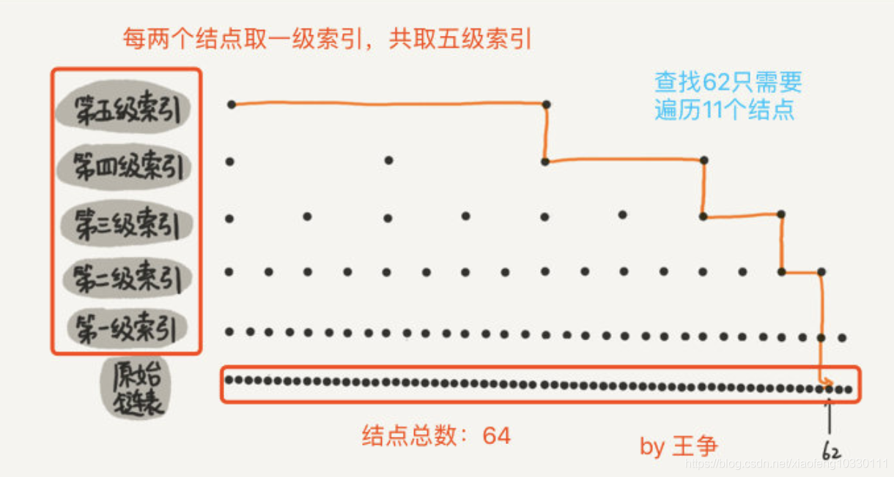

### 1.Redis在项目中的主要作用是是什么？怎么用的？（应用场景）

Redis作为一款性能优异的内存数据库，在互联网公司有着多种应用场景，主要有以下几个方面：

缓存
大多时候作为mq的替代者，当计数、统计、热数据 
分布式锁
接口限流器
分布式session共享
作为消息队列，生产一消费 
作为订阅发布器，似聊天工具或推送
选择一些经典的问题：

Redis实现分布式锁
基础方法：如果为空就插入值，返回true,如果不为空则不做操作，返回false----setIfAbsent(String key, String value)

                  插入新值并返回旧值----getAndSet(String key, String value)

具体思路：

基于Redis的限流器的实现
系统中的接口通常都有限流，比如 70次/秒 ，如何保证我们的接口的调用次数在超过第三方接口限流的时候快速失败？这时候就需要限流器了。

补充问题：

#### 单线程的Redis为什么快？

纯内存操作
单线程操作，避免了频繁的上下文切换
合理高效的数据结构
采用了非阻塞I/O多路复用机制
Redis和memcached的区别？
存储方式上：memcache会把数据全部存在内存之中，断电后会挂掉，数据不能超过内存大小。redis有部分数据存在硬盘上，这样能保证数据的持久性。
数据支持类型上：memcache对数据类型的支持简单，只支持简单的key-value，，而redis支持五种数据类型。
用底层模型不同：它们之间底层实现方式以及与客户端之间通信的应用协议不一样。redis直接自己构建了VM机制，因为一般的系统调用系统函数的话，会浪费一定的时间去移动和请求。
value的大小：redis可以达到1GB，而memcache只有1MB。
Redis和DB数据一致性处理
对于读操作流程：先到redis缓存中查询数据，如果为null，那么再到数据库查询出来再设置到redis中去，最后将数据返回给请求。
定义： 如果只是简单查询，缓存数据和数据库数据没有什么问题，当我们更新的时候就可能导致数据库数据和缓存数据不一致了。 数据库库存为 999  缓存数据为1000 这就是更新导致的情况。    
解决方案：
    1、比如操作菜单的时候，当我们增加 、删除、修改菜单时，操作成功之后就应该立刻根据菜单的key从redis缓存中把数据给删除，第二次查询 的时候肯定为null，从数据库查询再设置到redis中。这是马上见效情况
    2、不是马上见效的情况，就是设置过期时间来确定，比如我们商城中web页面根据店铺搜索出来的数据有最新的4张照片，当我们在商家后台添加一个商品时，就应该显示在最新添加的照片，此时就不能按照删除key来操作redis了，因为多个商家添加多个商品，就失去了缓存的意义，那么会根据用户需求来设置过期时间，这里的redis缓存就可能和数据库不一致，需要过期时间来控制数据。因为缓存时间到了，就会被删除，再到数据库查询设置到redis中去。

### 2.Redis支持的数据类型（必考）

String字符串:字符串类型是 Redis 最基础的数据结构，首先键都是字符串类型，而且其他几种数据结构都是在字符串类型基础上构建的，我们常使用的 set key value 命令就是字符串。常用在缓存、计数、共享Session、限速等。
Hash哈希:在Redis中，哈希类型是指键值本身又是一个键值对结构，哈希可以用来存放用户信息，比如实现购物车。
List列表（双向链表）:列表（list）类型是用来存储多个有序的字符串。可以做简单的消息队列的功能。
Set集合：集合（set）类型也是用来保存多个的字符串元素，但和列表类型不一 样的是，集合中不允许有重复元素，并且集合中的元素是无序的，不能通过索引下标获取元素。利用 Set 的交集、并集、差集等操作，可以计算共同喜好，全部的喜好，自己独有的喜好等功能。
Sorted Set有序集合（跳表实现）：Sorted Set 多了一个权重参数 Score，集合中的元素能够按 Score 进行排列。可以做排行榜应用，取 TOP N 操作。

### 3.zset跳表的数据结构（必考）

跳跃表（skiplist）是一种有序数据链表结构， 它通过在每个节点中维持多个指向其他节点的指针， 从而达到快速访问节点的目的。查询平均性能为O(logN)，最坏的情况会出现O(N)情况，而redis中的zset在数据较多的时候底层就是采用跳跃表去实现的，元素较少的时候会进行小对象压缩采用压缩列表实现。

从上述图我们可以看出跳跃表有以下几个特点：

跳跃表的每个节点都有多层构成。
跳跃表存在一个头结点，该头结点有64层结构，每层都包含指向下个节点的指针，指向本层下个节点中间所跨越的节点个数为跨度（span）。
除头结点以外，层高最高的节点为该跳跃表的level，图中的跳跃表level为3。
每层都是一个有序链表。
最底层的有序链表包含所有的节点数，也即是整个跳跃表的长度。
跳跃表每个节点都维护了多个指向其他节点的指针，所以在进行查询、更新、删除等操作的时候不需要进行整条链表的遍历，可以通过维护的指针过滤掉中间的很多节点，从而达到很快速的访问效果，一般情况来说跳跃表的性能能与平衡树相媲美的，而且跳跃表实现较为简单，所以这也是redis为什么采用跳跃表来作为zset底层的数据结构实现。

查找过程

跳跃表的查询，跳跃表有多层的情况下查询复杂度为O(logN)，如果跳跃表就一层那么查询复杂度会上升为O(N)，接下来我们就用图1的实例来模拟下查询score为70的节点的具体查询过程。

如图所示我们需要找到score为70的节点，查找首先从header开始，因为level为3我们先从L2开始往后开始遍历，查找到第一个节点，发现score比70小，继续往后遍历查找到第五个节点，发现score比70大，于是从当前节点往下一层进行查找，查找到节点3，以此类推，最终查询到score为70的节点。

插入以及更新过程
插入过程：跳跃表插入节点的时候，首先需要通过score找到自己的位置，也就是需要先走一步查找过程，找到新节点所处的位置的时候就创建一个新节点，并对新节点分配一个层数（这里层数的分配redis采用的是random随机机制，分配层数从1开始，每次晋升为上一层的概率为0.25），层数分配完了之后将前后指针进行赋值将新节点与旧节点串起来，如果层数大于当前的level还需要进行level的更新操作。

更新过程：更新过程会稍微复杂一些，更新其实就是插入，只不过插入的时候发现value已经存在了，只是需要调整一下score值，如果更新的score值不会带来位置上的改变，那么直接更新score就行不需要进行调整位置，但是如果新score会导致排序改变，那么就需要调整位置了，redis采用的方式比较直接就是先删除这个元素然后再插入这个元素即可，前后需要两次路径搜索。

补充问题：
Redis使用跳表不用B+树的原因？
Redis使用跳表不用B+树的原因是：redis是内存数据库，而B+树纯粹是为了mysql这种IO数据库准备的。B+树的每个节点的数量都是一个mysql分区页的大小。

## 深入学习：（具体参考王争的博客，讲的很详细！！！）

### 一、如何理解跳表？ 

对于单链表来说，我们查找某个数据，只能从头到尾遍历链表，此时时间复杂度是 ○(n)。

提高单链表的查找效率呢？对链表建立一级索引，每两个节点提取一个结点到上一级，被抽出来的这级叫做索引或索引层。 所以要找到13，就不需要将16前的结点全遍历一遍，只需要遍历索引，找到13，然后发现下一个结点是17，那么16一定是在 [13,17] 之间的，此时在13位置下降到原始链表层，找到16，加上一层索引后，查找一个结点需要遍历的结点个数减少了，也就是说查找效率提高了。

建立一级索引的方式相似，我们在第一级索引的基础上，每两个结点就抽出一个结点到第二级索引。此时再查找16，只需要遍历 6 个结点了，需要遍历的结点数量又减少了。 

当结点数量多的时候，这种添加索引的方式，会使查询效率提高的非常明显，这种链表加多级索引的结构，就是跳表。

### 二、用跳表查询到底有多快 

在一个单链表中，查询某个数据的时间复杂度是 ○(n)，那在一个具有多级索引的跳表中，查询某个数据的时间复杂度就是 ○(㏒n) 。

根据上图得知，每级遍历 3 个结点即可，而跳表的高度为 h ，所以每次查找一个结点时，需要遍历的结点数为 3*跳表高度 ，所以忽略低阶项和系数后的时间复杂度就是 ○(㏒n) 。

### 三、跳表是不是很浪费内存？ 

来分析一下跳表的空间复杂度为O(n)。

实际上，在实际开发中，我们不需要太在意索引占据的额外空间，在学习数据结构与算法时，我们习惯的将待处理数据看成整数，但是实际开发中，原始链表中存储的很可能是很大的对象，而索引结点只需要存储关键值（用来比较的值）和几个指针（找到下级索引的指针），并不需要存储原始链表中完整的对象，所以当对象比索引结点大很多时，那索引占用的额外空间就可以忽略了。 

### 四、高效的动态插入和删除 

跳表这个动态数据结构，不仅支持查找操作，还支持动态的插入、删除操作，而且插入、删除操作的时间复杂度也是 ○(㏒n)。 

对于单纯的单链表，需要遍历每个结点来找到插入的位置。但是对于跳表来说，因为其查找某个结点的时间复杂度是 ○(㏒n)，所以这里查找某个数据应该插入的位置，时间复杂度也是 ○(㏒n)。 

### 五、跳表索引动态更新 

当我们不停的往跳表中插入数据时，如果我们不更新索引，就可能出现某 2 个索引结点之间数据非常多的情况。极端情况下，跳表会退化成单链表。 

作为一种动态数据结构，我们需要某种手段来维护索引与原始链表大小之间的平滑，也就是说如果链表中结点多了，索引结点就相应地增加一些，避免复杂度退化，以及查找、插入、删除操作性能下降。

跳表是通过随机函数来维护前面提到的平衡性。 

我们往跳表中插入数据的时候，可以选择同时将这个数据插入到第几级索引中，比如随机函数生成了值 K，那我们就将这个结点添加到第一级到第 K 级这 K 级索引中。 随机函数可以保证跳表的索引大小和数据大小的平衡性，不至于性能过度退化。

### 4.Redis的数据过期策略（必考）

Redis 中数据过期策略采用**定期删除+惰性删除策略**结合起来，以及采用淘汰策略来兜底。

**定期删除策略**：Redis 启用一个定时器定时监视所有的 key，判断key是否过期，过期的话就删除。这种策略可以保证过期的 key 最终都会被删除，但是也存在严重的缺点：每次都遍历内存中所有的数据，非常消耗 CPU 资源，并且当 key 已过期，但是定时器还处于未唤起状态，这段时间内 key 仍然可以用。

**惰性删除策略**：在获取 key 时，先判断 key 是否过期，如果过期则删除。这种方式存在一个缺点：如果这个 key 一直未被使用，那么它一直在内存中，其实它已经过期了，会浪费大量的空间。

这两种策略天然的互补，结合起来之后，定时删除策略就发生了一些改变，不在是每次扫描全部的 key 了，而是随机抽取一部分 key 进行检查，这样就降低了对 CPU 资源的损耗，惰性删除策略互补了为检查到的key，基本上满足了所有要求。但是有时候就是那么的巧，既没有被定时器抽取到，又没有被使用，这些数据又如何从内存中消失？没关系，还有内存淘汰机制，当内存不够用时，内存淘汰机制就会上场。

内存淘汰机制就保证了在redis的内存占用过多的时候，去进行内存淘汰，也就是删除一部分key，保证redis的内存占用率不会过高。

**redis 提供 6种数据淘汰策略：**

volatile-lru：从已设置过期时间的数据集（server.db[i].expires）中挑选最近最少使用的数据淘汰
volatile-ttl：从已设置过期时间的数据集（server.db[i].expires）中挑选将要过期的数据淘汰
volatile-random：从已设置过期时间的数据集（server.db[i].expires）中随机移除key
allkeys-lru：当内存不足以容纳新写入数据时，在键空间中，移除最近最少使用的key（这个是最常用的）
allkeys-random：从数据集（server.db[i].dict）中任意选择数据淘汰
no-eviction：当内存不足以容纳新写入数据时，新写入操作会报错，无法写入新数据，一般不采用

4.0版本后增加以下两种：
volatile-lfu：从已设置过期时间的数据集(server.db[i].expires)中挑选最不经常使用的数据淘汰
allkeys-lfu：当内存不足以容纳新写入数据时，在键空间中，移除最不经常使用的key

### 5.Redis的LRU过期策略的具体实现

Redis每次按key获取一个值的时候，都会更新value中的lru字段为当前秒级别的时间戳。

Redis初始的实现算法很简单，随机从dict中取出五个key,淘汰一个lru字段值最小的。

在3.0的时候，又改进了一版算法：

首先第一次随机选取的key都会放入一个pool中(pool的大小为16)，pool中的key是按lru大小顺序排列的。
接下来每次随机选取的key lru值必须小于pool中最小的lru才会继续放入，直到将pool放满。
放满之后，每次如果有新的key需要放入，需要将pool中lru最大的一个key取出。
淘汰的时候，直接从pool中选取一个lru最小的值然后将其淘汰。

### 6.如何解决Redis缓存雪崩，缓存穿透问题

#### Redis缓存雪崩

定义：当 redis服务挂掉时，大量请求数据库，对数据库产生巨大的压力，导致数据库瘫痪。
场景： 把所有存入redis的所有数据设置相同过期的时间，过期时间失效后，就会大量请求数据库。
如何解决？
   1、在缓存的时候我们给过期时间设置一个随机数，但是也要根据业务场景需求来设置
   2、事发前：实现redis的高可用、主从架构+sentinel 或者 redis cluster
   3、事发后：万一redis真的挂了、可以设置本地缓存ehcache+限流hystrix
   4、事发后：redis持久化，重启后自动从磁盘上加载数据，快速恢复缓存数据

#### Redis缓存穿透

定义：大量到数据库请求一些不存在的数据，查询一个数据库不存在的数据。请求的数据在缓存大量不命中，导致大量请求数据库。
场景：比如我们表的数据的id是从1开始的正数，如果在这里有黑客攻击我们的系统，会设置一些负数的id到数据库查询数据，查询出来返回的数据为null，在这里，由于缓存不命中，并且处于容错考虑，从数据库查询的数据为null就不写到redis，这将导致每次查询数据都会到数据库查询，失去了缓存的意义。这样数据库迟早也会挂掉
如何解决缓存穿透？
    1、由于请求的参数是不合法(-1) 每次请求都是不存在的数据，于是我们可以使用布隆过滤器(BloomFilter) 或者 压缩filter提前拦截，不合法就不能访问数据库。
    2、当我们从数据库查询出来的数据为null时，也把他设置到缓存redis中，下次请求的时候就到redis中查询了，在这里后台可以判断，如果为null，那么设置一个较短的过期时间，到期自动就失效，否则就是按正常操作。

### 7.Redis的持久化机制（必考）

Redis为了保证效率，数据缓存在了内存中，但是会周期性的把更新的数据写入磁盘或者把修改操作写入追加的记录文件中，以保证数据的持久化。Redis的持久化策略有两种：

RDB：快照形式是直接把内存中的数据保存到一个dump的文件中，定时保存，保存策略。 当Redis需要做持久化时，Redis会fork一个子进程，子进程将数据写到磁盘上一个临时RDB文件中。当子进程完成写临时文件后，将原来的RDB替换掉。
AOF：把所有的对Redis的服务器进行修改的命令都存到一个文件里，命令的集合。 使用AOF做持久化，每一个写命令都通过write函数追加到appendonly.aof中。aof的默认策略是每秒钟fsync一次，在这种配置下，就算发生故障停机，也最多丢失一秒钟的数据。 缺点是对于相同的数据集来说，AOF的文件体积通常要大于RDB文件的体积。根据所使用的fsync策略，AOF的速度可能会慢于RDB。
Redis默认是快照RDB的持久化方式。对于主从同步来说，主从刚刚连接的时候，进行全量同步（RDB）；全同步结束后，进行增量同步(AOF)。

### 8.Redis的管道pipeline

对于单线程阻塞式的Redis，Pipeline可以满足批量的操作，把多个命令连续的发送给Redis Server，然后一一解析响应结果。

Pipelining可以提高批量处理性能，提升的原因主要是TCP连接中减少了“交互往返”的时间。

pipeline 底层是通过把所有的操作封装成流，redis有定义自己的出入输出流。在 sync() 方法执行操作，每次请求放在队列里面，解析响应包。

### 9.Redis集群容错机制是什么样的？

高可用首先需要解决集群部分失败的场景：当集群内少量节点出现故障时通过自动故障转移保证集群可以正常对外提供服务。主要针对Redis Cluster来分析：

详细的知识见：https://blog.csdn.net/xiaofeng10330111/article/details/90384502

故障发现

redis的各个节点通过ping/pong进行消息通信，不需要Sentinel，转播槽的信息和节点状态信息，故障发现也是通过这个动作发现的，跟Sentinel一样，有主观下线和客观下线。

主观下线：某个节点认为另一个节点不可用，“偏见”，但不是最终的故障判断。
客观下线：标志着一个节点真正的下线，即半数以上持有槽的主节点都标记某节点主观下线，如果是持有槽的主节点故障，需要为该节点进行故障转移。
尝试客观下线：通知集群内所有节点标记故障节点为客观下线，通过故障节点的从节点触发故障转移流程。
故障恢复

故障节点变为客观下线后，如果下线节点是持有槽的主节点则需要在它的从节点中选出一个替换它，从而保证集群的高可用。下线主节点的所有从节点承担故障恢复的义务，当从节点通过内部定时任务发现自身复制的主节 点进入客观下线时，将会触发故障恢复流程：资格检查-->准备选举时间-->发起选举-->选举投票-->替换主节点。

### 10.Redis集群中某个master节点挂了，后面流程怎么判断？

具体还是9上的回答，更为具体的见：https://blog.csdn.net/xiaofeng10330111/article/details/90384502

可以从以下三个方面分析：

redis集群如何判断一个主节点挂了：

集群中的每个节点都会顶起地向集群中的其他节点发送PING消息
默认每隔1s中发送一次PING
 默认随机选择5个集群中的其他主节点，规则为最长时间未PING以及PONG时间超过timeout/2
如果发送PING的主节点1，在timeout时间内没收到主节点2的PONG消息，那么主节点1会将主节点2的状态标记为pfail
主节点1在后续发送PING消息时，会带上主节点2的pfail状态，收到这个消息的主节点会在clusterNode里下线报告fail_reports中将主节点2标记为pfail
当某个主节点被标记为pfail的个数大于集群总主节点个数的一半时，会被标记为fail, 并向整个集群广播一条PONG消息，说明该主节点下线。
其他主节点收到广播消息后，将该主节点状态标记为fail,
集群进入故障转移阶段
故障转移阶段流程：

当一个从节点发现自己正在复制的主节点进入已下线状态时，从节点将开始对下线主节点进行故障转移
复制下线主节点的所有从节点里面，会有一个从节点被选为新的主节点
新的主节点从撤销所有已下线主节点的槽位指派，并将这些槽位指给自己
新的主节点会向集群广播一条PONG消息，告知其他节点自己已由从节点转为主节点，并接管相应的槽位
故障转移完成
选举新的主节点

集群的纪元时一个自增的计数器，初始值为0
当集群里的某个节点开始一次故障转移操作时，集群的纪元会加一
对于每个纪元，集群里每个复制处理槽位的主节点都有一次投票机会，而第一次向主节点要求投票的从节点将获得主节点的投票
什么时候开始投票？ 当从节点发现自己正在复制的主节点进入已下线状态，从节点会向集群广播一条CLUSTERMSG_TYPE_FAILOVER_AUTH_REQUEST消息，收到该消息的主节点可以开始投票
主节点投票后返回CLUSTERMSG_TYPE_FAILOVER_AUTH_ACK消息
当某个从节点的票数大于投票总节点数的一半时，被选为新的主节点
若每个获得足够的票数，进入下一轮投票

### 11.Redis的缓存优化方向有哪些？你们怎么理解的？对热点键的注意事项设计什么？

缓存的主要优势和成本：

缓存收益：加速读写、降低后端存储负载；
缓存成本：缓存和存储数据不一致性、代码维护成本、运维成本；
优化方向：

Redis 的数据过期策略：采用定期删除+惰性删除策略结合起来，以及采用淘汰策略来兜底。
缓存粒度控制：全部属性更好or部分重要属性更好？
缓存穿透优化：缓存空对象 + 布隆过滤器拦截（通过很小的内存来实现对数据的过滤。）
缓存雪崩优化：保证缓存高可用性，例如 Redis Cluster、Redis Sentinel、VIP；依赖隔离组件为后端限流；提前演练，例如压力测试。
无底洞问题优化：命令本身优化，例如慢查询 keys、hgetall bigkey；减少网络通信次数；降低接入成本，例如客户端使用长连接/连接池、NIO 等 。
热点key优化：避免 bigkey；热键不要用 hash_tag，因为 hash_tag 会落到一个节点上；如果真有热点 key 而且业务对一致性要求不高时，可以用本地缓存 + MQ 解决。
热点key重建优化：互斥锁（mutex key），查询数据源 -> 重建缓存 这个过程加互斥锁；永不过期，缓存层面不设置过期时间（没有用 expire），功能层面为每个 value 添加逻辑过期时间，但发现超过逻辑过期时间后，会使用单独的线程去构建缓存。
对热点键的注意事项，如上热点key优化和热点key重建优化。

### 12.高并发情况下，对于Redis的更新操作有哪些注意事项？

操作：先更新数据库，再删除缓存
正常的情况是这样的：    

1、 先操作数据库，成功
2、再删除缓存，也成功
3、 如果原子性被破坏了：第一步成功(操作数据库)，第二步失败(删除缓存)，会导致数据库里是新数据，而缓存里是旧数据。
如果第一步(操作数据库)就失败了，我们可以直接返回错误(Exception)，不会出现数据不一致。
如果在高并发的场景下，出现数据库与缓存数据不一致的概率特别低，也不是没有：缓存刚好失效//线程A查询数据库，得一个旧值//线程B将新值写入数据库//线程B删除缓存//线程A将查到的旧值写入缓存
要达成上述情况，还是说一句概率特别低,因为这个条件需要发生在读缓存时缓存失效，而且并发着有一个写操作。而实际上数据库的写操作会比读操作慢得多，而且还要锁表，而读操作必需在写操作前进入数据库操作，而又要晚于写操作更新缓存，所有的这些条件都具备的概率基本并不大。对于这种策略，其实是一种设计模式：Cache Aside Pattern
解决删除缓存失败的解决思路：将需要删除的key发送到消息队列中---自己消费消息，获得需要删除的key---不断重试删除操作，直到成功
     
操作:先删除缓存，再更新数据库
正常情况是这样的：

1、先删除缓存，成功；
2、再更新数据库，也成功；
3、如果原子性被破坏了
第一步成功(删除缓存)，第二步失败(更新数据库)，数据库和缓存的数据还是一致的。
如果第一步(删除缓存)就失败了，我们可以直接返回错误(Exception)，数据库和缓存的数据还是一致的。
看起来是很美好，但是我们在并发场景下分析一下，就知道还是有问题的了：线程A删除了缓存///线程B查询，发现缓存已不存在
///线程B去数据库查询得到旧值///线程B将旧值写入缓存///线程A将新值写入数据库-------->所以也会导致数据库和缓存不一致的问题。
解决并发下解决数据库与缓存不一致的思路：将删除缓存、修改数据库、读取缓存等的操作积压到队列里边，实现串行化。

对比两种策略：

先删除缓存、再更新数据库----->在高并发下表现的不如意，在原子性被破环时表现优异
先更新数据库，再删除缓存(Cache Aside Pattern设计模式)) ----->在高并发先表现优异，在原子性被破坏时表现不如意
参考书籍、文献和资料
1.https://blog.csdn.net/weixin_42075468/article/details/89040452

2.http://www.360doc.com/content/18/0226/15/16915_732617375.shtml

3.https://blog.csdn.net/wang258533488/article/details/78913800

4.https://blog.csdn.net/wang258533488/article/details/78913827

5.https://blog.csdn.net/gfyann/article/details/103395477

6.https://www.cnblogs.com/aspirant/p/11475295.html

7.https://segmentfault.com/a/1190000020653415

8.https://blog.csdn.net/u011489043/article/details/78769428

9.https://blog.csdn.net/xiaofeng10330111/article/details/90384502

10.https://blog.csdn.net/u010627840/article/details/103919540

11.https://blog.csdn.net/smartbetter/article/details/97953883
————————————————
版权声明：本文为CSDN博主「张彦峰ZYF」的原创文章，遵循CC 4.0 BY-SA版权协议，转载请附上原文出处链接及本声明。
原文链接：https://blog.csdn.net/xiaofeng10330111/article/details/105360939