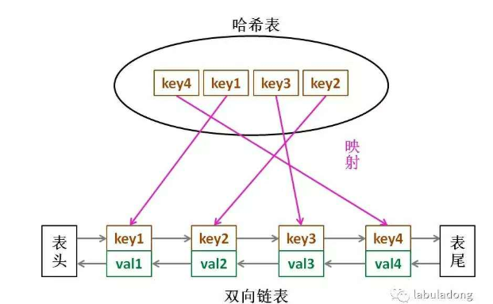

# LRU

## 1、什么是LRU算法？

LRU是Least Recently Used的缩写，即最近最少使用，常用于页面置换算法，为虚拟页式存储管理服务。LRU算法的提出，是基于这样一个事实：在前面几条指令中使用频繁的页面很可能在后面的几条指令中频繁使用。反过来说，已经很久没有使用的页面很可能在未来较长的一段时间内不会被用到。这个，就是著名的局部性原理。此外，LRU算法也经常被用作缓存淘汰策略。本文将基于LRU算法的思想，使用Java语言实现一个我们自己的缓存工具类。

## 2、算法思想

1. 新数据插入到链表头部；
2. 每当缓存命中（即缓存数据被访问），则将数据移到链表头部；
3. 当链表满的时候，将链表尾部的数据丢弃。

## 3、数据结构

[](https://img2020.cnblogs.com/blog/1983810/202004/1983810-20200421220441589-814500954.png)

## 4、思考节点的结构为什么要有key val(一般不是只有val吗)

移除尾部节点的时候需要根据节点的key来删除映射关系（key——>node）

## 5、实现


```java
import java.util.HashMap;
import java.util.Map;

public class LRUCache {
    // 双向链表节点定义
    class Node {
        int key;
        int val;
        Node prev;
        Node next;
    }
    //模拟缓存容量
    private int capacity;
    //保存链表的头节点和尾节点
    private Node first;
    private Node last;

    //从key到node映射的map
    private Map<Integer, Node> map;

    public LRUCache(int capacity) {
        this.capacity = capacity;
        map = new HashMap<>(capacity);
    }

    public int get(int key) {
        Node node = map.get(key);
        //为空返回-1
        if (node == null) {
            return -1;
        }
        moveToHead(node);
        return node.val;
    }
    public void put(int key, int value) {
        //先看看是否已经存在
        Node node = map.get(key);

        if (node == null) {
            //不存在创建节点，然后判断缓存是否满了，如果满了删除最后一个节点。然后将新节点放到链表头部，增加一个映射关系
            //存在则直接覆盖，然后移动到头部
            node = new Node();
            node.key = key;
            node.val = value;

            if(map.size() == capacity) {
                removeLast();
            }

            addToHead(node);
            map.put(key, node);
        } else {
            node.val = value;
            moveToHead(node);
        }
    }

    private void moveToHead(Node node) {
        //要修改很多指针
        if (node == first) {
            return;
        } else if (node == last) {
            //如果是最后一个节点，将最后一个节点的next指针置为空，然后last指向前一个节点
            last.prev.next = null;
            last = last.prev;
        } else {
            //如果是中间节点，中间节点的前节点的后指针  指向 中间节点的后节点
            //中间节点的后节点的前指针 指向 中间节点的前节点
            node.prev.next = node.next;
            node.next.prev = node.prev;
        }
        //把该节点作为头结点
        node.prev = first.prev;// 写成node.prev = null;更好理解
        node.next = first;
        first.prev = node;
        first = node;
    }


    private void addToHead(Node node) {
        if (map.isEmpty()) {
            first = node;
            last = node;
        } else {
            //把新节点作为头结点
            node.next = first;
            first.prev = node;
            first = node;
        }
    }

    private void removeLast() {
        map.remove(last.key);
        Node prevNode = last.prev;
        //修改last所指的位置
        if (prevNode != null) {
            prevNode.next = null;
            last = prevNode;
        }
    }

    @Override
    public String toString() {
        return map.keySet().toString();
    }

    public static void main(String[] args) {
        LRUCache cache = new LRUCache(3);
        cache.put(1, 1);//【1】左边是最近使用的
        cache.put(2, 2);//【2，1】
        cache.put(3, 3);//【3，2，1】
        cache.get(1);//【1，3，2】
        cache.put(4, 3);//【4，1，3】
        System.out.println(cache);
    }
}
```

