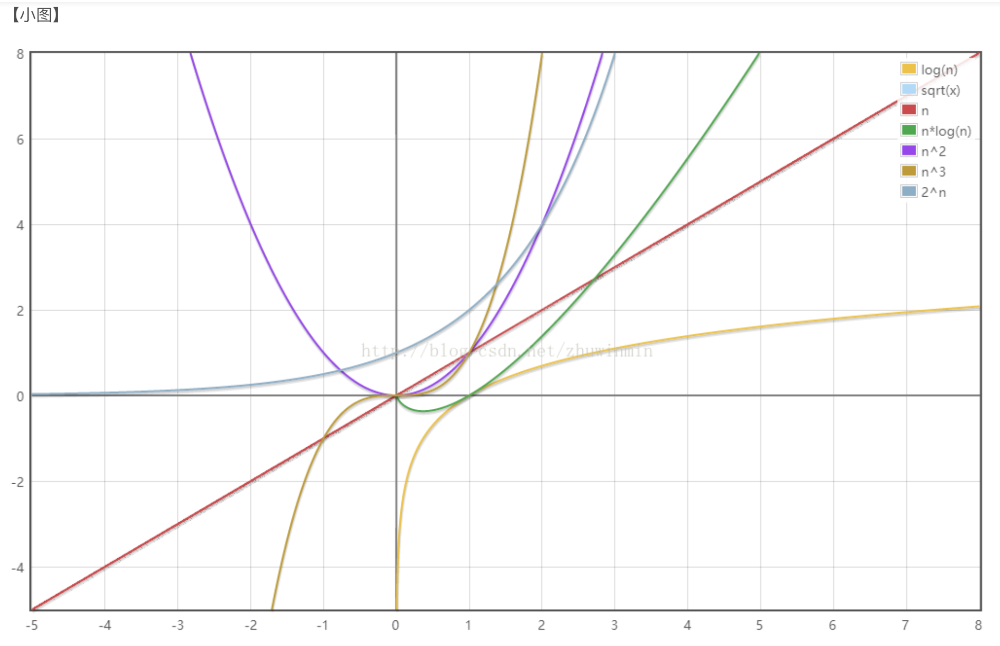

* ### 十大经典排序之
  
  * [归并排序](/docs/dataStructures-algorithms/algorithms/归并排序.html)
  * [快速排序](/docs/dataStructures-algorithms/algorithms/快速排序.html)
  * 
* 


```
二分查找  是 O(log n)
简单查找 是 O(n)
快速查找 是 O(n log n)
选择排序 是 O(n²)

```




