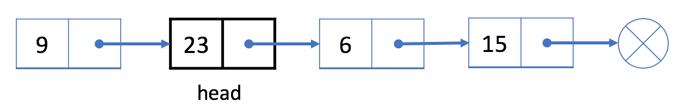

# LinkedList 链表

## 链表：

* 定义：链表是一个包含0个或多个元素的数据结构。每个元素都包含一个值和到另一个元素的链接。根据链接数的不同，可以分为单链表，双链表和多重链表。
* 与数组相似，链表是一种线性数据结构。
* 它通过`引用字段`将所有分离的元素链接在一起。

## 单向链表：

### 简介：

* 单链表中的每个结点不仅包含值，还包含链接到下一个结点的`引用字段`。通过这种方式，单链表将所有结点按顺序组织起来。


* 链表中的每个元素实际上是一个单独的对象，而所有对象都通过每个元素中的引用字段链接在一起。

#### 结构特点：

* 单向链表的定义：自身值加上下一对象的引用。通常是用头结点来表示整个链表。

```java
// Definition for singly-linked list.
public class SinglyListNode {
    int val;
    SinglyListNode next;
    SinglyListNode(int x) { val = x; }
}
```

### 操作：

* 与数组不同，我们无法在常量时间内访问单链表中的随机元素。 如果我们想要获得第 i 个元素，我们必须从头结点逐个遍历。 我们按索引来访问元素平均要花费 O(N) 时间，其中 N 是链表的长度。

#### 添加操作：

​	如果我们想在给定的结点 `prev` 之后添加新值，我们应该：

1. 使用给定值初始化新结点 `cur`；


将 cur 的 next 字段链接到 prev 的下一个结点 next ；

将 prev 中的 next 字段链接到 cur 。

与数组不同，我们不需要将所有元素移动到插入元素之后。因此，您可以在 O(1) 时间复杂度中将新结点插入到链表中，这非常高效。

 

示例


让我们在第二个结点 6 之后插入一个新的值 9 。

我们将首先初始化一个值为 9 的新结点。然后将结点 9 链接到结点 15 。最后，将结点 6 链接到结点 9 。

插入之后，我们的链表将如下所示：


在开头添加结点
众所周知，我们使用头结点来代表整个列表。

因此，在列表开头添加新节点时更新头结点 head 至关重要。

1、初始化一个新结点 cur ；
2、将新结点链接到我们的原始头结点 head。
3、将 cur 指定为 head 。
例如，让我们在列表的开头添加一个新结点 9 。

1、我们初始化一个新结点 9 并将其链接到当前头结点 23 。



2、指定结点 9 为新的头结点。


如何在列表的末尾添加新的结点？我们还能使用类似的策略吗？

#### 删除操作：

如果我们想从单链表中删除现有结点 cur，可以分两步完成：

1、找到 cur 的上一个结点 prev 及其下一个结点 next ；


2、接下来链接 prev 到 cur 的下一个节点 next 。


在我们的第一步中，我们需要找出 prev 和 next。使用 cur 的参考字段很容易找出 next，但是，我们必须从头结点遍历链表，以找出 prev，它的平均时间是 O(N)，其中 N 是链表的长度。因此，删除结点的时间复杂度将是 O(N)。

空间复杂度为 O(1)，因为我们只需要常量空间来存储指针。

示例


让我们尝试把结点 6从上面的单链表中删除。

1. 从头遍历链表，直到我们找到前一个结点 prev，即结点 23

2. 将 prev（结点 23）与 next（结点 15）链接


结点 6 现在不在我们的单链表中。

 

删除第一个结点
如果我们想删除第一个结点，策略会有所不同。

正如之前所提到的，我们使用头结点 head 来表示链表。我们的头是下面示例中的黑色结点 23。


如果想要删除第一个结点，我们可以简单地将下一个结点分配给 head。也就是说，删除之后我们的头将会是结点 6。


链表从头结点开始，因此结点 23 不再在我们的链表中。

删除最后一个结点呢？我们还能使用类似的策略吗？


## 双向链表：

链表有两种类型：单链表和双链表。上面给出的例子是一个单链表，这里有一个双链表的例子：


