# kafka

## 1、前言

Kafka 是一款分布式消息发布和订阅系统，具有高性能、高吞吐量的特点而被广泛应用与大数据传输场景。它是由 LinkedIn 公司开发，使用 Scala 语言编写，之后成为 Apache 基金会的一个顶级项目。kafka 提供了类似 JMS 的特性，但是在设计和实现上是完全不同的，而且他也不是 JMS 规范的实现。

## ***2\***|***0\*****Kafka简介*****2\***|***1\*****kafka产生背景**

kafka 作为一个消息系统，早起设计的目的是用作 LinkedIn 的活动流（Activity Stream）和运营数据处理管道（Pipeline）。活动流数据是所有的网站对用户的使用情况做分析的时候要用到的最常规的部分,活动数据包括页面的访问量（PV）、被查看内容方面的信息以及搜索内容。这种数据通常的处理方式是先把各种活动以日志的形式写入某种文件，然后周期性的对这些文件进行统计分析。运营数据指的是服务器的性能数据（CPU、IO 使用率、请求时间、服务日志等）。

***2\***|***2\*****Kafka应用场景**

由于 kafka 具有更好的吞吐量、内置分区、冗余及容错性的优点(kafka 每秒可以处理几十万消息)，让 kafka 成为了一个很好的大规模消息处理应用的解决方案。

所以在企业级应用长，主要会应用于如下几个方面

**行为跟踪**：kafka 可以用于跟踪用户浏览页面、搜索及其他行为。通过发布-订阅模式实时记录到对应的 topic中，通过后端大数据平台接入处理分析，并做更进一步的实时处理和监控
**日志收集**：日志收集方面，有很多比较优秀的产品，比如 Apache Flume，很多公司使用kafka 代理日志聚合。日志聚合表示从服务器上收集日志文件，然后放到一个集中的平台（文件服务器）进行处理。在实际应用开发中，我们应用程序的 log 都会输出到本地的磁盘上，排查问题的话通过 linux 命令来搞定，如果应用程序组成了负载均衡集群，并且集群的机器有几十台以上，那么想通过日志快速定位到问题，就是很麻烦的事情了。所以一般都会做一个日志统一收集平台管理 log 日志用来快速查询重要应用的问题。所以很多公司的套路都是把应用日志几种到 kafka 上，然后分别导入到 es 和 hdfs 上，用来做实时检索分析和离线统计数据备份等。而另一方面，kafka 本身又提供了很好的 api 来集成日志并且做日志收集

[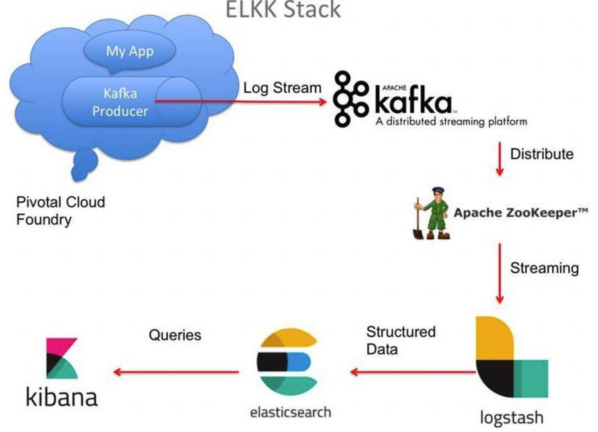](https://img2020.cnblogs.com/blog/874710/202101/874710-20210118101445323-292915327.png)

***2\***|***3\*****kafka架构**

一个典型的 kafka 集群包含若干 Producer（可以是应用节点产生的消息，也可以是通过Flume 收集日志产生的事件），若干个 Broker（kafka 支持水平扩展）、若干个 Consumer Group，以及一个 zookeeper 集群。kafka 通过 zookeeper 管理集群配置及服务协同。

Producer 使用 push 模式将消息发布到 broker，consumer 通过监听使用 pull 模式从broker 订阅并消费消息。多个 broker 协同工作，producer 和 consumer 部署在各个业务逻辑中。三者通过zookeeper 管理协调请求和转发。这样就组成了一个高性能的分布式消息发布和订阅系统。图上有一个细节是和其他 mq 中间件不同的点，producer 发送消息到 broker的过程是 push，而 consumer 从 broker 消费消息的过程是 pull，主动去拉数据。而不是 broker 把数据主动发送给 consumer

[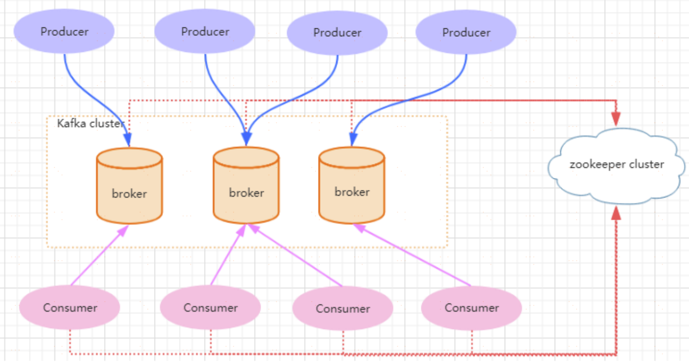](https://img2020.cnblogs.com/blog/874710/202101/874710-20210118101455091-1429974880.png)

**名词解释**:

**Topic**

Kafka将消息分门别类，每一类的消息称之为一个主题（Topic）。

**Producer**

发布消息的对象称之为主题生产者（Kafka topic producer）

**Consumer**

订阅消息并处理发布的消息的对象称之为主题消费者（consumers）

**Broker**

已发布的消息保存在一组服务器中，称之为Kafka集群。集群中的每一个服务器都是一个代理（Broker）。 消费者可以订阅一个或多个主题（topic），并从Broker拉数据，从而消费这些已发布的消息。

***2\***|***4\*****Topic和Log**

Topic是发布的消息的类别名，一个topic可以有零个，一个或多个消费者订阅该主题的消息。

对于每个topic，Kafka集群都会维护一个分区log，就像下图中所示：

[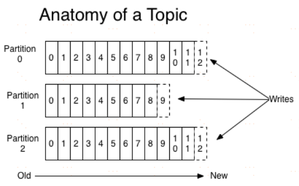](https://img2020.cnblogs.com/blog/874710/202101/874710-20210118101505235-1579046089.png)

每一个分区都是一个顺序的、不可变的消息队列， 并且可以持续的添加。分区中的消息都被分了一个序列号，称之为偏移量(offset)，在每个分区中此偏移量都是唯一的。

Kafka集群保持所有的消息，直到它们过期（无论消息是否被消费）。实际上消费者所持有的仅有的元数据就是这个offset（偏移量），也就是说offset由消费者来控制：正常情况当消费者消费消息的时候，偏移量也线性的的增加。但是实际偏移量由消费者控制，消费者可以将偏移量重置为更早的位置，重新读取消息。可以看到这种设计对消费者来说操作自如，一个消费者的操作不会影响其它消费者对此log的处理。

[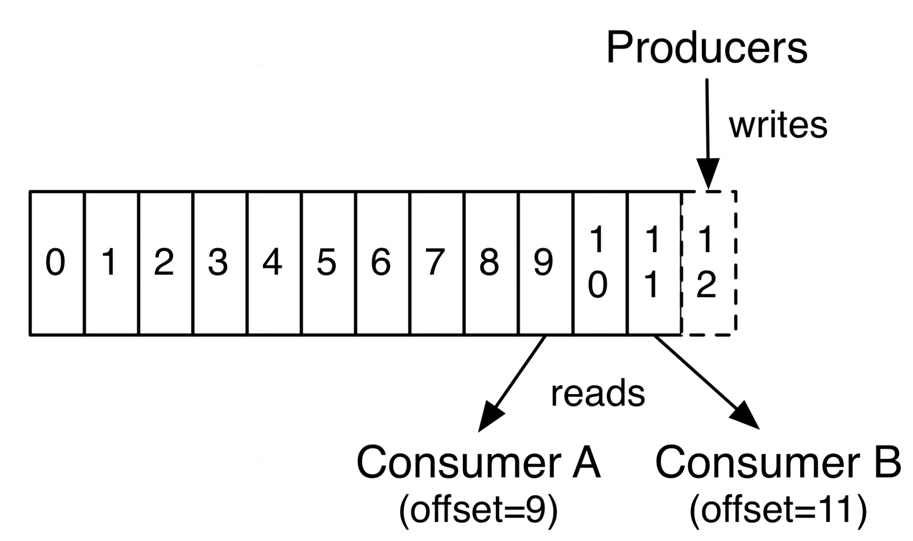](https://img2020.cnblogs.com/blog/874710/202101/874710-20210118101513758-915476349.png)

再说说分区。Kafka中采用分区的设计有几个目的。一是可以处理更多的消息，不受单台服务器的限制。Topic拥有多个分区意味着它可以不受限的处理更多的数据。第二，分区可以作为并行处理的单元，稍后会谈到这一点。

***2\***|***5\*****分布式**

Log的分区被分布到集群中的多个服务器上。每个服务器处理它分到的分区。 根据配置每个分区还可以复制到其它服务器作为备份容错。 每个分区有一个leader，零或多个follower。Leader处理此分区的所有的读写请求，而follower被动的复制数据。如果leader宕机，其它的一个follower会被推举为新的leader。 一台服务器可能同时是一个分区的leader，另一个分区的follower。 这样可以平衡负载，避免所有的请求都只让一台或者某几台服务器处理。

***2\***|***6\*****生产者**

生产者往某个Topic上发布消息。生产者也负责选择发布到Topic上的哪一个分区。最简单的方式从分区列表中轮流选择。也可以根据某种算法依照权重选择分区。开发者负责如何选择分区的算法。

***2\***|***7\*****消费者**

通常来讲，消息模型可以分为两种， 队列和发布-订阅式。 队列的处理方式是 一组消费者从服务器读取消息，一条消息只有其中的一个消费者来处理。在发布-订阅模型中，消息被广播给所有的消费者，接收到消息的消费者都可以处理此消息。Kafka为这两种模型提供了单一的消费者抽象模型： 消费者组 （consumer group）。 消费者用一个消费者组名标记自己。 一个发布在Topic上消息被分发给此消费者组中的一个消费者。 假如所有的消费者都在一个组中，那么这就变成了queue模型。 假如所有的消费者都在不同的组中，那么就完全变成了发布-订阅模型。 更通用的， 我们可以创建一些消费者组作为逻辑上的订阅者。每个组包含数目不等的消费者， 一个组内多个消费者可以用来扩展性能和容错。正如下图所示：

[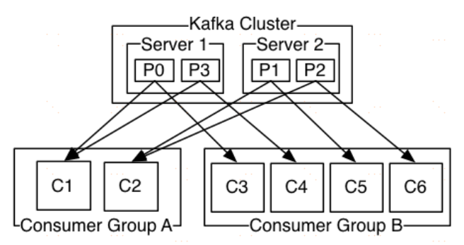](https://img2020.cnblogs.com/blog/874710/202101/874710-20210118101524438-995690061.png)

2个kafka集群托管4个分区（P0-P3），2个消费者组，消费组A有2个消费者实例，消费组B有4个。

正像传统的消息系统一样，Kafka保证消息的顺序不变。 再详细扯几句。传统的队列模型保持消息，并且保证它们的先后顺序不变。但是， 尽管服务器保证了消息的顺序，消息还是异步的发送给各个消费者，消费者收到消息的先后顺序不能保证了。这也意味着并行消费将不能保证消息的先后顺序。用过传统的消息系统的同学肯定清楚，消息的顺序处理很让人头痛。如果只让一个消费者处理消息，又违背了并行处理的初衷。 在这一点上Kafka做的更好，尽管并没有完全解决上述问题。 Kafka采用了一种分而治之的策略：分区。 因为Topic分区中消息只能由消费者组中的唯一一个消费者处理，所以消息肯定是按照先后顺序进行处理的。但是它也仅仅是保证Topic的一个分区顺序处理，不能保证跨分区的消息先后处理顺序。 所以，如果你想要顺序的处理Topic的所有消息，那就只提供一个分区。

***3\***|***0\*****Docker搭建kafka*****3\***|***1\*****下载以下三个镜像**


```
docker pull wurstmeister/zookeeper
docker pull wurstmeister/kafka
docker pull sheepkiller/kafka-manager
```

kafka-manager是kafka的可视化管理工具

***3\***|***2\*****启动容器**


```
docker run -d --name zookeeper --publish 2181:2181 \--volume /etc/localtime:/etc/localtime \--restart=always \wurstmeister/zookeeper
```


```
docker run -d --name kafka --publish 9082:9092 \--link zookeeper:zookeeper \--env KAFKA_BROKER_ID=100 \--env HOST_IP=127.0.0.1 \--env KAFKA_ZOOKEEPER_CONNECT=zookeeper:2181 \--env KAFKA_ADVERTISED_HOST_NAME=192.168.1.108 \--env KAFKA_ADVERTISED_PORT=9082 \--restart=always \--volume /etc/localtime:/etc/localtime \wurstmeister/kafka
```


```
docker run -d --name kafka-manager \--link zookeeper:zookeeper \--link kafka:kafka -p 9001:9000 \--restart=always \--env ZK_HOSTS=zookeeper:2181 \sheepkiller/kafka-manager
```

***3\***|***3\*****访问**

[http://127.0.0.1:9001](http://127.0.0.1:9001/)

***3\***|***4\*****添加Cluster**

[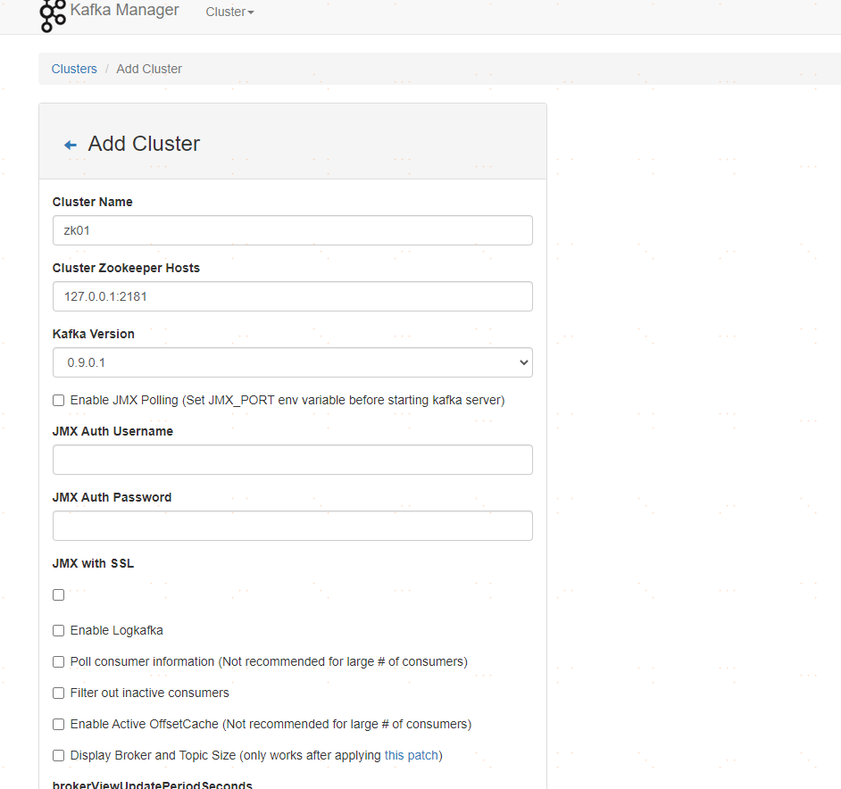](https://img2020.cnblogs.com/blog/874710/202101/874710-20210118101534216-1835065136.png)

***3\***|***5\*****查看界面**

[](https://img2020.cnblogs.com/blog/874710/202101/874710-20210118101541770-1681167049.png)

搭建完毕,页面其他功能自己摸索下

***4\***|***0\*****Kafka快速入门**


```
//以下Spring Boot应用程序将三个消息发送到一个主题，接收它们，然后停止：
@SpringBootApplication
public class Application implements CommandLineRunner {

    public static Logger logger = LoggerFactory.getLogger(Application.class);

    public static void main(String[] args) {
        SpringApplication.run(Application.class, args).close();
    }

    @Autowired
    private KafkaTemplate<String, String> template;

    private final CountDownLatch latch = new CountDownLatch(3);

    @Override
    public void run(String... args) throws Exception {
        this.template.send("myTopic", "foo1");
        this.template.send("myTopic", "foo2");
        this.template.send("myTopic", "foo3");
        latch.await(60, TimeUnit.SECONDS);
        logger.info("All received");
    }

    @KafkaListener(topics = "myTopic")
    public void listen(ConsumerRecord<?, ?> cr) throws Exception {
        logger.info(cr.toString());
        latch.countDown();
    }

}
```

***5\***|***0\*****Kafka进阶*****5\***|***1\*****通信原理**

消息是 kafka 中最基本的数据单元，在 kafka 中，一条消息由 key、 value 两部分构成，在发送一条消息时，我们可以指定这个 key，那么 producer 会根据 key 和 partition 机制来判断当前这条消息应该发送并存储到哪个 partition 中。我们可以根据需要进行扩展 producer 的 partition 机制。

**消息默认的分发机制**

默认情况下，kafka 采用的是 hash 取模的分区算法。如果Key 为 null，则会随机分配一个分区。这个随机是在这个参数”metadata.max.age.ms”的时间范围内随机选择一个。对于这个时间段内，如果 key 为 null，则只会发送到唯一的分区。这个值值哦默认情况下是 10 分钟更新一次。

关于 Metadata ，这个之前没讲过，简单理解就是T opic/Partition 和 broker 的映射关系，每一个 topic 的每一个 partition，需要知道对应的 broker 列表是什么， leader是谁、 follower 是谁。这些信息都是存储在 Metadata 这个类里面。

**消费端如何消费指定的分区**


```
//通过下面的代码，就可以消费指定该 topic 下的 0 号分区。其他分区的数据就无法接收
//消费指定分区的时候，不需要再订阅
//kafkaConsumer.subscribe(Collections.singletonList(topic));
//消费指定的分区
TopicPartition topicPartition=new 
TopicPartition(topic,0);
kafkaConsumer.assign(Arrays.asList(topicPartit
ion));
```

**消费原理**

在实际生产过程中，每个 topic 都会有多个 partitions，多个 partitions 的好处在于，一方面能够对 broker 上的数据进行分片有效减少了消息的容量从而提升 io 性能。另外一方面，为了提高消费端的消费能力，一般会通过多个consumer 去消费同一个 topic ，也就是消费端的负载均衡机制，也就是我们接下来要了解的，在多个partition 以及多个 consumer 的情况下，消费者是如何消费消息的同时，在上一节课，我们讲了， kafka 存在 consumer group的 概 念 ， 也 就是 group.id 一样 的 consumer ，这些consumer 属于一个 consumer group，组内的所有消费者协调在一起来消费订阅主题的所有分区。当然每一个分区只能由同一个消费组内的 consumer 来消费，那么同一个consumer group 里面的 consumer 是怎么去分配该消费哪个分区里的数据的呢？如下图所示， 3 个分区， 3 个消费者，那么哪个消费者消分哪个分区？

[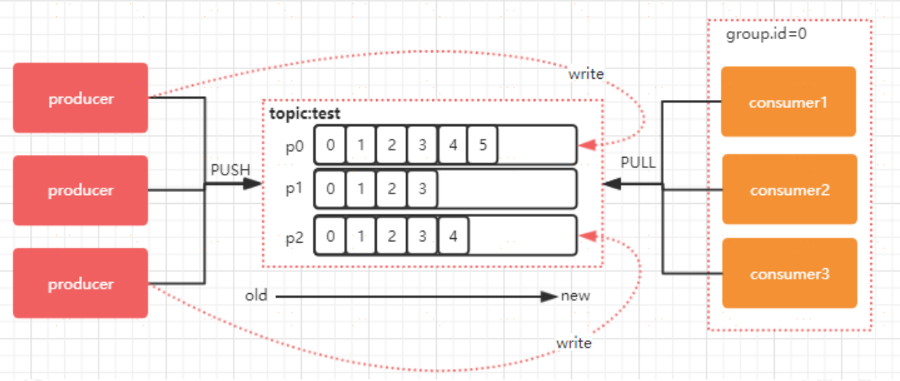](https://img2020.cnblogs.com/blog/874710/202101/874710-20210118101551646-237576573.png)

**分区分配策略**

在 kafka 中，存在两种分区分配策略，一种是 Range(默认)、另 一 种 另 一 种 还 是 RoundRobin （ 轮 询 ）。 通过partition.assignment.strategy 这个参数来设置。

**Range strategy（范围分区）**

Range 策略是对每个主题而言的，首先对同一个主题里面的分区按照序号进行排序，并对消费者按照字母顺序进行排序。假设我们有 10 个分区，3 个消费者，排完序的分区将会是 0, 1, 2, 3, 4, 5, 6, 7, 8, 9；消费者线程排完序将会是C1-0, C2-0, C3-0。然后将 partitions 的个数除于消费者线程的总数来决定每个消费者线程消费几个分区。如果除不尽，那么前面几个消费者线程将会多消费一个分区。在我们的例子里面，我们有 10 个分区，3 个消费者线程， 10 / 3 = 3，而且除不尽，那么消费者线程 C1-0 将会多消费一个分区，所以最后分区分配的结果看起来是这样的：
C1-0 将消费 0, 1, 2, 3 分区
C2-0 将消费 4, 5, 6 分区
C3-0 将消费 7, 8, 9 分区

假如我们有 11 个分区，那么最后分区分配的结果看起来是这样的：
C1-0 将消费 0, 1, 2, 3 分区
C2-0 将消费 4, 5, 6, 7 分区
C3-0 将消费 8, 9, 10 分区

假如我们有 2 个主题(T1 和 T2)，分别有 10 个分区，那么最后分区分配的结果看起来是这样的：
C1-0 将消费 T1 主题的 0, 1, 2, 3 分区以及 T2 主题的 0, 1, 2, 3 分区
C2-0 将消费 T1 主题的 4, 5, 6 分区以及 T2 主题的 4, 5, 6 分区
C3-0 将消费 T1 主题的 7, 8, 9 分区以及 T2 主题的 7, 8, 9 分区
可以看出，C1-0 消费者线程比其他消费者线程多消费了 2 个分区，这就是 Range strategy 的一个很明显的弊端

**RoundRobin strategy（轮询分区）**

轮询分区策略是把所有 partition 和所有 consumer 线程都列出来，然后按照 hashcode 进行排序。最后通过轮询算法分配 partition 给消费线程。如果所有 consumer 实例的订阅是相同的，那么 partition 会均匀分布。

在我们的例子里面，假如按照 hashCode 排序完的 topicpartitions 组依次为 T1-5, T1-3, T1-0, T1-8, T1-2, T1-1, T1-4, T1-7, T1-6, T1-9，我们的消费者线程排序为 C1-0, C1-1, C2-0, C2-1，最后分区分配的结果为：
C1-0 将消费 T1-5, T1-2, T1-6 分区；
C1-1 将消费 T1-3, T1-1, T1-9 分区；
C2-0 将消费 T1-0, T1-4 分区；
C2-1 将消费 T1-8, T1-7 分区；

使用轮询分区策略必须满足两个条件

1. 每个主题的消费者实例具有相同数量的流
2. 每个消费者订阅的主题必须是相同的

**什么时候会触发这个策略呢？**

当出现以下几种情况时，kafka 会进行一次分区分配操作，
也就是 kafka consumer 的 rebalance

1. 同一个 consumer group 内新增了消费者
2. 消费者离开当前所属的 consumer group，比如主动停机或者宕机
3. topic 新增了分区（也就是分区数量发生了变化）
   kafka consuemr 的 rebalance 机制规定了一个 consumergroup 下的所有 consumer 如何达成一致来分配订阅 topic的每个分区。而具体如何执行分区策略，就是前面提到过的两种内置的分区策略。而 kafka 对于分配策略这块，提供了可插拔的实现方式， 也就是说，除了这两种之外，我们还可以创建自己的分配机制。

**什么时候会触发这个策略呢？**

当出现以下几种情况时，kafka 会进行一次分区分配操作，也就是 kafka consumer 的 rebalance

1. 同一个 consumer group 内新增了消费者
2. 消费者离开当前所属的 consumer group，比如主动停机或者宕机
3. topic 新增了分区（也就是分区数量发生了变化）kafka consuemr 的 rebalance 机制规定了一个 consumergroup 下的所有 consumer 如何达成一致来分配订阅 topic的每个分区。而具体如何执行分区策略，就是前面提到过的两种内置的分区策略。而 kafka 对于分配策略这块，提供了可插拔的实现方式， 也就是说，除了这两种之外，我们还可以创建自己的分配机制。

**谁来执行 Rebalance 以及管理 consumer 的 group 呢？**

Kafka 提供了一个角色： coordinator 来执行对于 consumer group 的管理，Kafka 提供了一个角色：coordinator 来执行对于 consumer group 的管理，当 consumer group 的第一个 consumer 启动的时候，它会去和 kafka server 确定谁是它们组的 coordinator。之后该 group 内的所有成员都会和该 coordinator 进行协调通信

**如何确定 coordinator**

consumer group 如何确定自己的 coordinator 是谁呢, 消费 者 向 kafka 集 群 中 的 任 意 一 个 broker 发 送 一 个GroupCoordinatorRequest 请求，服务端会返回一个负载最 小 的 broker 节 点 的 id ， 并 将 该 broker 设 置 为coordinator

**JoinGroup 的过程**

在 rebalance 之前，需要保证 coordinator 是已经确定好了的，整个 rebalance 的过程分为两个步骤，Join 和 Syncjoin: 表示加入到 consumer group 中，在这一步中，所有的成员都会向 coordinator 发送 joinGroup 的请求。一旦所有成员都发送了 joinGroup 请求，那么 coordinator 会选择一个 consumer 担任 leader 角色，并把组成员信息和订阅信息发送消费者

[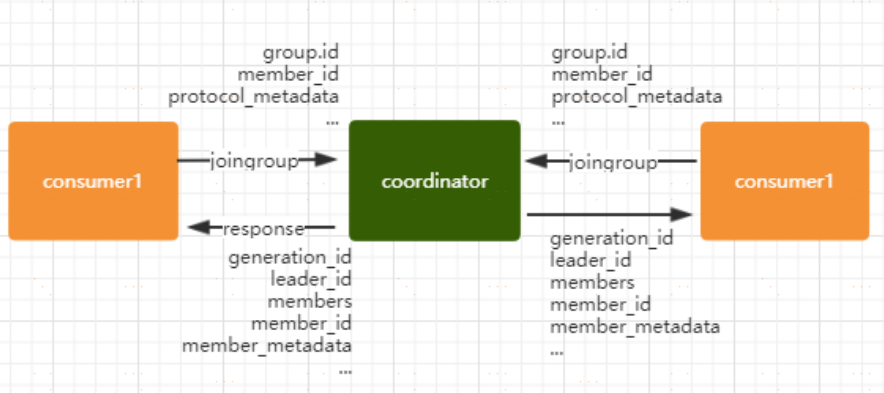](https://img2020.cnblogs.com/blog/874710/202101/874710-20210118101600962-24184293.png)

protocol_metadata: 序列化后的消费者的订阅信息
leader_id： 消费组中的消费者，coordinator 会选择一个座位 leader，对应的就是 member_id
member_metadata 对应消费者的订阅信息
members：consumer group 中全部的消费者的订阅信息
generation_id： 年代信息，类似于之前讲解 zookeeper 的时候的 epoch 是一样的，对于每一轮 rebalance ，
generation_id 都会递增。主要用来保护 consumer group。隔离无效的 offset 提交。也就是上一轮的 consumer 成员无法提交 offset 到新的 consumer group 中。

**Synchronizing Group State 阶段**

完成分区分配之后，就进入了 Synchronizing Group State阶段，主要逻辑是向 GroupCoordinator 发送SyncGroupRequest 请求，并且处理 SyncGroupResponse响应，简单来说，就是 leader 将消费者对应的 partition 分配方案同步给 consumer group 中的所有 consumer

[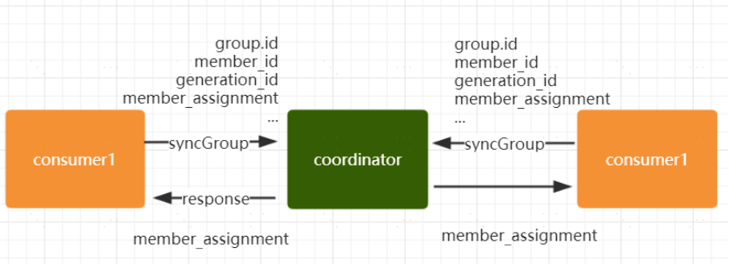](https://img2020.cnblogs.com/blog/874710/202101/874710-20210118101610350-600860183.png)

每个消费者都会向 coordinator 发送 syncgroup 请求，不过只有 leader 节点会发送分配方案，其他消费者只是打打酱油而已。当 leader 把方案发给 coordinator 以后，coordinator 会把结果设置到 SyncGroupResponse 中。这样所有成员都知道自己应该消费哪个分区。
➢ consumer group 的分区分配方案是在客户端执行的！Kafka 将这个权利下放给客户端主要是因为这样做可以有更好的灵活性

**如何保存消费端的消费位置**

**什么是 offset**

前面在讲partition 的时候，提到过 offset， 每个 topic可以划分多个分区（每个 Topic 至少有一个分区），同一topic 下的不同分区包含的消息是不同的。每个消息在被添加到分区时，都会被分配一个 offset（称之为偏移量），它是消息在此分区中的唯一编号， kafka 通过 offset 保证消息在分区内的顺序， offset 的顺序不跨分区，即 kafka 只保证在同一个分区内的消息是有序的； 对于应用层的消费来说，每次消费一个消息并且提交以后，会保存当前消费到的最近的一个 offset。那么 offset 保存在哪里？

[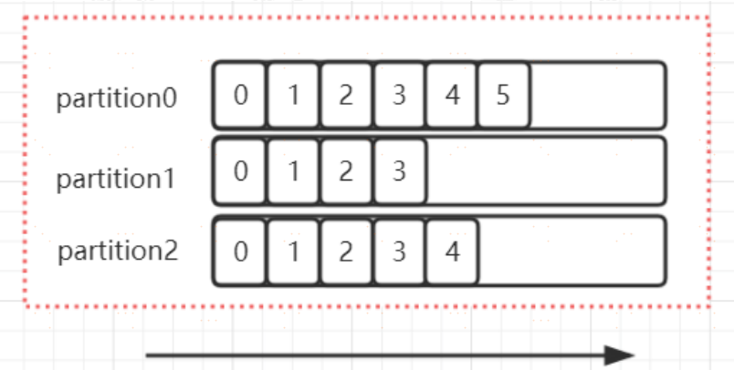](https://img2020.cnblogs.com/blog/874710/202101/874710-20210118101618777-572435168.png)

**offset 在哪里维护？**

在 kafka 中，提供了一个__consumer_offsets_的一个topic ，把 offset 信 息 写 入 到 这 个 topic 中。
_consumer_offsets——按保存了每个 consumer group某一时刻提交的 offset 信息。 consumer_offsets 默认有50 个分区。

[](https://img2020.cnblogs.com/blog/874710/202101/874710-20210118101628716-1287743710.png)

**消息的存储原理**

**消息的保存路径**

消息发送端发送消息到 broker 上以后，消息是如何持久化的呢？那么接下来去分析下消息的存储

首先我们需要了解的是， kafka 是使用日志文件的方式来保存生产者和发送者的消息，每条消息都有一个 offset 值来表示它在分区中的偏移量。 Kafka 中存储的一般都是海量的消息数据，为了避免日志文件过大，Log 并不是直接对应在一个磁盘上的日志文件，而是对应磁盘上的一个目录，这个目录的明明规则是<topic_name>_<partition_id>比如创建一个名为 firstTopic 的 topic，其中有 3 个 partition，那么在 kafka 的数据目录（/tmp/kafka-log）中就有 3 个目录，firstTopic-0~3

**多个分区在集群中的分配**

如果我们对于一个 topic，在集群中创建多个 partition，那么 partition 是如何分布的呢？
1.将所有 N Broker 和待分配的 i 个 Partition 排序
2.将第 i 个 Partition 分配到第(i mod n)个 Broker 上

[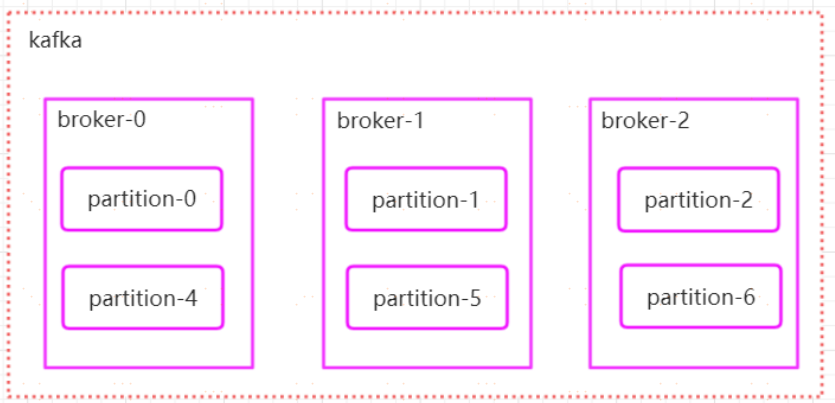](https://img2020.cnblogs.com/blog/874710/202101/874710-20210118101638131-1145459848.png)

了解到这里的时候，大家再结合前面讲的消息分发策略，就应该能明白消息发送到 broker 上，消息会保存到哪个分区中，并且消费端应该消费哪些分区的数据了。

**消息写入的性能**

我们现在大部分企业仍然用的是机械结构的磁盘，如果把消息以随机的方式写入到磁盘，那么磁盘首先要做的就是寻址，也就是定位到数据所在的物理地址，在磁盘上就要找到对应的柱面、磁头以及对应的扇区；这个过程相对内存来说会消耗大量时间，为了规避随机读写带来的时间消耗， kafka 采用顺序写的方式存储数据。即使是这样，但是频繁的 I/O 操作仍然会造成磁盘的性能瓶颈，所以 kafka还有一个性能策略

**页缓存**

顺序写入是Kafka高吞吐量的一个原因，当然即使采用的是磁盘的顺序写入，那么也是没有办法和内存相比的。因为为了再一次提高Kakfa的吞吐量，Kafka采用了Memory Mapped Files
(后面简称mmap)也被翻译成内存映射文件 ，它的工作原理是直接利用操作系统的page cache 来实现文件到物理内存的直接映射，完成映射之后你对物理内存的操作会被同步到硬盘上（操作系统在适当的时候）。
操作系统本身有一层缓存，叫做page cache，是在内存里的缓存，我们也可以称之为os cache，意思就是操作系统自己管理的缓存。你在写入磁盘文件的时候，可以直接写入这个os cache里，也就是仅仅写入内存中，接下来由操作系统自己决定什么时候把os cache里的数据真的刷入磁
盘文件中（每5秒检查一次是否需要将页缓存数据同步到磁盘文件）。仅仅这一个步骤，就可以将磁盘文件写性能提升很多了，因为其实这里相当于是在写内存，不是在写磁盘.

**零拷贝**

消息从发送到落地保存，broker 维护的消息日志本身就是文件目录，每个文件都是二进制保存，生产者和消费者使用相同的格式来处理。在消费者获取消息时，服务器先从硬盘读取数据到内存，然后把内存中的数据原封不动的通过 socket 发送给消费者。虽然这个操作描述起来很简单，但实际上经历了很多步骤。

[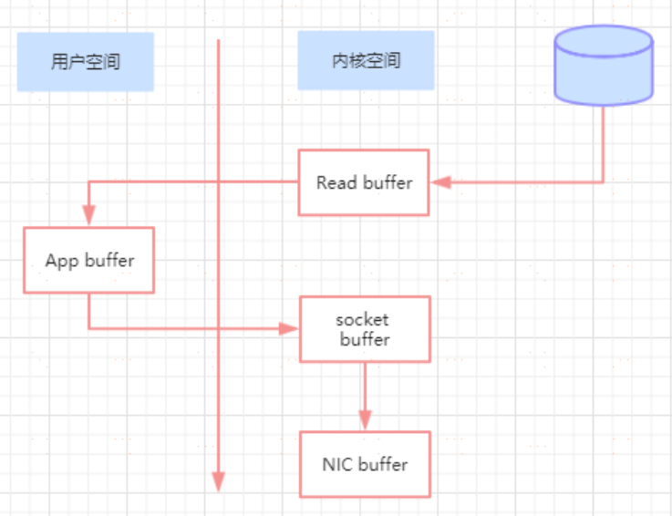](https://img2020.cnblogs.com/blog/874710/202101/874710-20210118101646795-1036930428.png)

▪ 操作系统将数据从磁盘读入到内核空间的页缓存
▪ 应用程序将数据从内核空间读入到用户空间缓存中
▪ 应用程序将数据写回到内核空间到 socket 缓存中
▪ 操作系统将数据从 socket 缓冲区复制到网卡缓冲区，以便将数据经网络发出

这个过程涉及到 4 次上下文切换以及 4 次数据复制，并且有两次复制操作是由 CPU 完成。但是这个过程中，数据完全没有进行变化，仅仅是从磁盘复制到网卡缓冲区。

通过“**零拷贝**”技术，可以去掉这些没必要的数据复制操作，同时也会减少上下文切换次数。现代的 unix 操作系统提供一个优化的代码路径，用于将数据从页缓存传输到 socket；在 Linux 中，是通过 sendfile 系统调用来完成的。Java 提供了访问这个系统调用的方法： FileChannel.transferTo API

[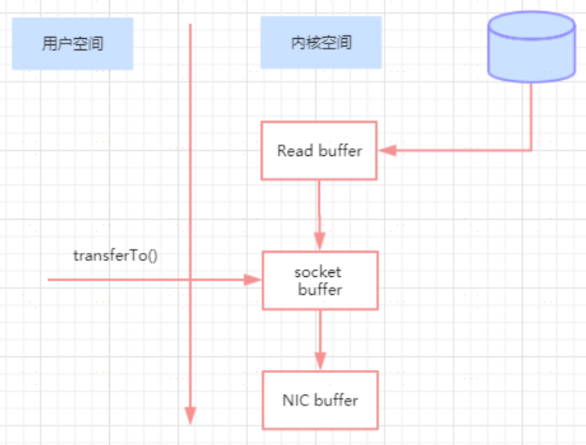](https://img2020.cnblogs.com/blog/874710/202101/874710-20210118101655340-1812794731.png)

使用 sendfile，只需要一次拷贝就行，允许操作系统将数据直接从页缓存发送到网络上。所以在这个优化的路径中，只有最后一步将数据拷贝到网卡缓存中是需要的

**消息的文件存储机制**

[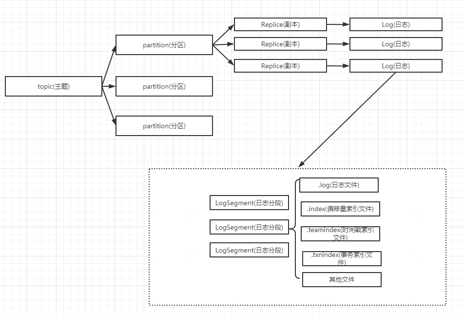](https://img2020.cnblogs.com/blog/874710/202101/874710-20210118101703117-2020961285.png)

前面我们知道了一个 topic 的多个 partition 在物理磁盘上的保存路径，那么我们再来分析日志的存储方式。通过如下命令找到对应 partition 下的日志内容


```
[root@localhost ~]# ls /tmp/kafka-logs/firstTopic-1/00000000000000000000.index 00000000000000000000.log  00000000000000000000.timeindex   leader-epochcheckpoint
```

kafka 是通过分段的方式将 Log 分为多个 LogSegment，LogSegment 是一个逻辑上的概念，一个 LogSegment 对应磁盘上的一个日志文件和一个索引文件，其中日志文件是用来记录消息的。索引文件是用来保存消息的索引。那么这个 LogSegment 是什么呢？

**LogSegment**

假设 kafka 以 partition 为最小存储单位，那么我们可以想象当 kafka producer 不断发送消息，必然会引起 partition文件的无线扩张，这样对于消息文件的维护以及被消费的消息的清理带来非常大的挑战，所以 kafka 以 segment 为单位又把 partition 进行细分。每个 partition 相当于一个巨型文件被平均分配到多个大小相等的 segment 数据文件中（每个 segment 文件中的消息不一定相等），这种特性方便已经被消费的消息的清理，提高磁盘的利用率。
➢ log.segment.bytes=107370 ( 设置分段大小 ), 默认是1gb，我们把这个值调小以后，可以看到日志分段的效果
➢ 抽取其中 3 个分段来进行分析

[](https://img2020.cnblogs.com/blog/874710/202101/874710-20210118101713247-1904772287.png)

segment file 由 2 大部分组成，分别为 index file 和 data file，此 2 个文件一一对应，成对出现，后缀".index"和“.log”分别表示为 segment 索引文件、数据文件.segment 文件命名规则：partion 全局的第一个 segment从 0 开始，后续每个 segment 文件名为上一个 segment文件最后一条消息的 offset 值进行递增。数值最大为 64 位long 大小，20 位数字字符长度，没有数字用 0 填。

**segment 中 index 和 log 的对应关系**

从所有分段中，找一个分段进行分析为了提高查找消息的性能，为每一个日志文件添加 2 个索引索引文件： OffsetIndex 和 TimeIndex，分别对应*.index以及*.timeindex, TimeIndex 索引文件格式：它是映射时间戳和相对offset


```
查 看 索 引 内 容 ： sh  kafka-run-class.sh 
kafka.tools.DumpLogSegments  --files  /tmp/kafkalogs/test-0/00000000000000000000.index  --print-datalog
```

[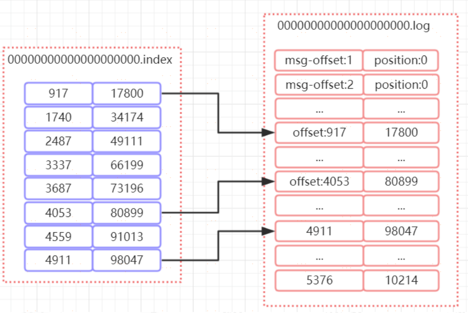](https://img2020.cnblogs.com/blog/874710/202101/874710-20210118101727930-982092067.png)

如图所示，index 中存储了索引以及物理偏移量。 log 存储了消息的内容。索引文件的元数据执行对应数据文件中
message 的物理偏移地址。举个简单的案例来说，以[4053,80899]为例，在 log 文件中，对应的是第 4053 条记录，物理偏移量（ position ）为 80899. position 是ByteBuffer 的指针位置

**在 partition 中如何通过 offset 查找 message**

1. 根据 offset 的值，查找 segment 段中的 index 索引文件。由于索引文件命名是以上一个文件的最后一个offset 进行命名的，所以，使用二分查找算法能够根据offset 快速定位到指定的索引文件。
2. 找到索引文件后，根据 offset 进行定位，找到索引文件中的符合范围的索引。（kafka 采用稀疏索引的方式来提高查找性能）
3. 得到 position 以后，再到对应的 log 文件中，从 position出开始查找 offset 对应的消息，将每条消息的 offset 与目标 offset 进行比较，直到找到消息

比如说，我们要查找 offset=2490 这条消息，那么先找到00000000000000000000.index, 然后找到[2487,49111]这个索引，再到 log 文件中，根据 49111 这个 position 开始查找，比较每条消息的 offset 是否大于等于 2490。最后查找到对应的消息以后返回

**日志清除策略**

前面提到过，日志的分段存储，一方面能够减少单个文件内容的大小，另一方面，方便 kafka 进行日志清理。日志的清理策略有两个

1. 根据消息的保留时间，当消息在 kafka 中保存的时间超过了指定的时间，就会触发清理过程
2. 根据 topic 存储的数据大小，当 topic 所占的日志文件大小大于一定的阀值，则可以开始删除最旧的消息。 kafka会启动一个后台线程，定期检查是否存在可以删除的消息

通过 log.retention.bytes 和 log.retention.hours 这两个参数来设置，当其中任意一个达到要求，都会执行删除。默认的保留时间是：7 天

**日志压缩策略**

Kafka 还提供了“日志压缩（Log Compaction）”功能，通过这个功能可以有效的减少日志文件的大小，缓解磁盘紧张的情况，在很多实际场景中，消息的 key 和 value 的值之间的对应关系是不断变化的，就像数据库中的数据会不断被修改一样，消费者只关心 key 对应的最新的 value。 因此，我们可以开启 kafka 的日志压缩功能，服务端会在后台启动启动 Cleaner 线程池，定期将相同的 key 进行合并，只保留最新的 value 值。日志的压缩原理是

[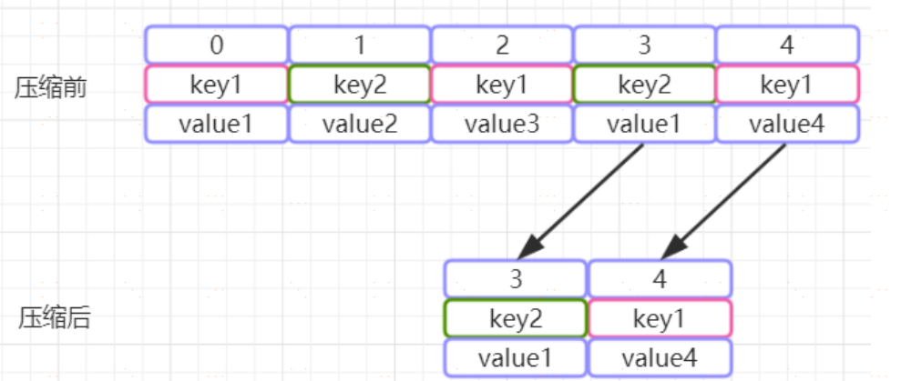](https://img2020.cnblogs.com/blog/874710/202101/874710-20210118101736353-1669492578.png)

**partition 的高可用副本机制**

我们已经知道 Kafka 的每个 topic 都可以分为多个 Partition，并且多个 partition 会均匀分布在集群的各个节点下。虽然这种方式能够有效的对数据进行分片，但是对于每个partition 来说，都是单点的，当其中一个 partition 不可用的时候，那么这部分消息就没办法消费。所以 kafka 为了提高 partition 的可靠性而提供了副本的概念（Replica） ,通过副本机制来实现冗余备份。每个分区可以有多个副本，并且在副本集合中会存在一个leader 的副本，所有的读写请求都是由 leader 副本来进行处理。剩余的其他副本都做为 follower 副本，follower 副本 会 从 leader 副 本 同 步 消 息 日 志 。 这 个 有 点 类 似zookeeper 中 leader 和 follower 的概念，但是具体的时间方式还是有比较大的差异。所以我们可以认为，副本集会存在一主多从的关系。
一般情况下，同一个分区的多个副本会被均匀分配到集群中的不同 broker 上，当 leader 副本所在的 broker 出现故障后，可以重新选举新的 leader 副本继续对外提供服务。通过这样的副本机制来提高 kafka 集群的可用性。

**副本分配算法**

将所有 N Broker 和待分配的 i 个 Partition 排序.
将第 i 个 Partition 分配到第(i mod n)个 Broker 上.
将第 i 个 Partition 的第 j 个副本分配到第((i + j) mod n)个Broker 上.

**kafka 副本机制中的几个概念**

Kafka 分区下有可能有很多个副本(replica)用于实现冗余，从而进一步实现高可用。副本根据角色的不同可分为 3 类：
leader 副本：响应 clients 端读写请求的副本
follower 副本：被动地备份 leader 副本中的数据，不能响应 clients 端读写请求。
ISR 副本：包含了 leader 副本和所有与 leader 副本保持同步的 follower 副本——如何判定是否与 leader 同步后面会提到每个 Kafka 副本对象都有两个重要的属性：LEO 和HW。注意是所有的副本，而不只是 leader 副本。
LEO：即日志末端位移(log end offset)，记录了该副本底层日志(log)中下一条消息的位移值。注意是下一条消息！也就是说，如果 LEO=10，那么表示该副本保存了 10 条消息，位移值范围是[0, 9]。另外， leader LEO 和follower LEO 的更新是有区别的。我们后面会详细说
HW：即上面提到的水位值。对于同一个副本对象而言，其
HW 值不会大于 LEO 值。小于等于 HW 值的所有消息都被认为是“ 已备份” 的（replicated ）。同理， leader 副本和follower 副本的 HW 更新是有区别的

**副本协同机制**

刚刚提到了，消息的读写操作都只会由 leader 节点来接收和处理。follower 副本只负责同步数据以及当 leader 副本所在的 broker 挂了以后，会从 follower 副本中选取新的leader。

[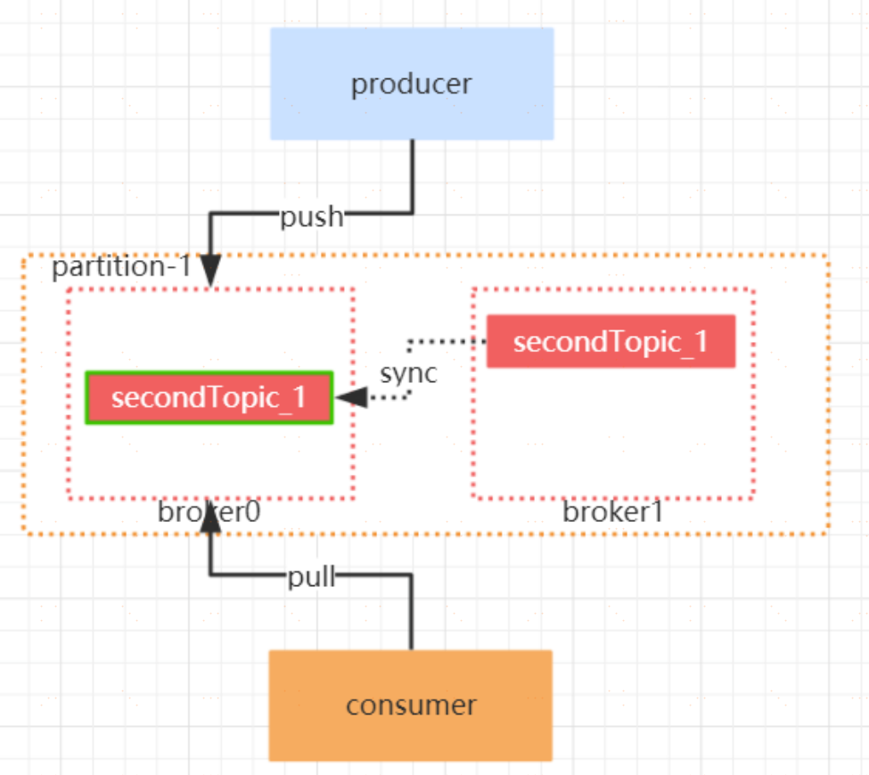](https://img2020.cnblogs.com/blog/874710/202101/874710-20210118101744559-367687726.png)

请求首先由 Leader 副本处理，之后 follower 副本会从leader 上拉取写入的消息，这个过程会有一定的延迟，导致 follower 副本中保存的消息略少于 leader 副本，但是只要没有超出阈值都可以容忍。但是如果一个 follower 副本出现异常，比如宕机、网络断开等原因长时间没有同步到消息，那这个时候， leader 就会把它踢出去。 kafka 通过 ISR集合来维护一个分区副本信息

**ISR**
ISR 表示目前“可用且消息量与 leader 相差不多的副本集合，这是整个副本集合的一个子集”。怎么去理解可用和相差不多这两个词呢？具体来说，ISR 集合中的副本必须满足两个条件

1. 副本所在节点必须维持着与 zookeeper 的连接
2. 副本最后一条消息的 offset 与 leader 副本的最后一条消息的 offset 之 间 的 差 值 不 能 超 过 指 定 的 阈值(replica.lag.time.max.ms)replica.lag.time.max.ms：如果该 follower 在此时间间隔内一直没有追上过 leader 的所有消息，则该 follower 就会被剔除 isr 列表
   ➢ ISR 数 据 保 存 在 Zookeeper 的/brokers/topics//partitions//state 节点中

**HW&LEO**

关于 follower 副本同步的过程中，还有两个关键的概念，HW(HighWatermark)和 LEO(Log End Offset). 这两个参数跟 ISR 集合紧密关联。 HW 标记了一个特殊的 offset，当消费者处理消息的时候，只能拉去到 HW 之前的消息， HW之后的消息对消费者来说是不可见的。也就是说，取partition 对应 ISR 中最小的 LEO 作为 HW，consumer 最多只能消费到 HW 所在的位置。每个 replica 都有 HW，leader 和 follower 各自维护更新自己的 HW 的状态。一条消息只有被 ISR 里的所有 Follower 都从 Leader 复制过去才会被认为已提交。这样就避免了部分数据被写进了Leader，还没来得及被任何 Follower 复制就宕机了，而造成数据丢失（Consumer 无法消费这些数据）。而对于Producer 而言，它可以选择是否等待消息 commit，这可以通过 acks 来设置。这种机制确保了只要 ISR 有一个或以上的 Follower，一条被 commit 的消息就不会丢失。

**数据的同步过程**

了解了副本的协同过程以后，还有一个最重要的机制，就是数据的同步过程。它需要解决

1. 怎么传播消息
2. 在向消息发送端返回 ack 之前需要保证多少个 Replica
   已经接收到这个消息

数据的处理过程是
Producer 在 发 布 消 息 到 某 个 Partition 时 ，先通过ZooKeeper 找到该 Partition 的 Leader 【 get /brokers/topics//partitions/2/state】，然后无论该Topic 的 Replication Factor 为多少（也即该 Partition 有多少个 Replica）， Producer 只将该消息发送到该 Partition 的Leader。 Leader 会将该消息写入其本地 Log。每个 Follower都从 Leader pull 数据。这种方式上， Follower 存储的数据顺序与 Leader 保持一致。 Follower 在收到该消息并写入其Log 后，向 Leader 发送 ACK。一旦 Leader 收到了 ISR 中的所有 Replica 的 ACK，该消息就被认为已经 commit 了，Leader 将增加 HW(HighWatermark)并且向 Producer 发送ACK。

**初始状态**

初始状态下，leader 和 follower 的 HW 和 LEO 都是 0，leader 副本会保存 remote LEO，表示所有 follower LEO，也会被初始化为 0，这个时候，producer 没有发送消息。follower 会不断地个 leader 发送 FETCH 请求，但是因为没有数据，这个请求会被 leader 寄存，当在指定的时间之后会 强 制 完 成 请 求 ， 这 个 时 间 配 置 是(replica.fetch.wait.max.ms)，如果在指定时间内 producer有消息发送过来，那么 kafka 会唤醒 fetch 请求，让 leader继续处理

[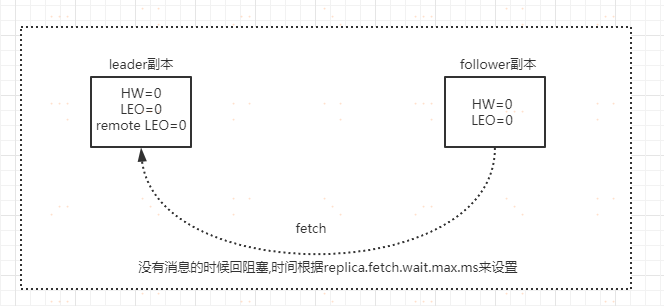](https://img2020.cnblogs.com/blog/874710/202101/874710-20210118101752763-1157601595.png)

这里会分两种情况，第一种是 leader 处理完 producer 请求之后，follower 发送一个 fetch 请求过来、第二种是follower 阻塞在 leader 指定时间之内，leader 副本收到producer 的请求。这两种情况下处理方式是不一样的。先来看第一种情况

**一、follower 的 fetch 请求是当 leader 处理消息以后执行的**

leader 处理完 producer 请求之后，follower 发送一个fetch 请求过来 。状态图如下

[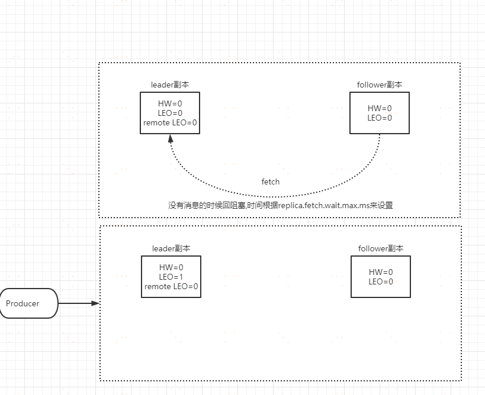](https://img2020.cnblogs.com/blog/874710/202101/874710-20210118101800481-1343047905.png)

**leader 副本收到请求以后，会做几件事情**

1. 把消息追加到 log 文件，同时更新 leader 副本的 LEO
2. 尝试更新 leader HW 值。这个时候由于 follower 副本还没有发送 fetch 请求，那么 leader 的 remote LEO 仍然是 0。leader 会比较自己的 LEO 以及 remote LEO 的值发现最小值是 0，与 HW 的值相同，所以不会更新 HW

**follower fetch 消息**

[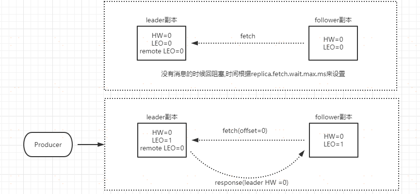](https://img2020.cnblogs.com/blog/874710/202101/874710-20210118101809624-1817469321.png)

**follower 发送 fetch 请求，leader 副本的处理逻辑是:**

1. 读取 log 数据、更新 remote LEO=0(follower 还没有写入这条消息，这个值是根据 follower 的 fetch 请求中的offset 来确定的)
2. 尝试更新 HW，因为这个时候 LEO 和 remoteLEO 还是不一致，所以仍然是 HW=0
3. 把消息内容和当前分区的 HW 值发送给 follower 副本follower 副本收到 response 以后
4. 将消息写入到本地 log，同时更新 follower 的 LEO
5. 更新 follower HW，本地的 LEO 和 leader 返回的 HW进行比较取小的值，所以仍然是 0第一次交互结束以后， HW 仍然还是 0，这个值会在下一次follower 发起 fetch 请求时被更新

**follower 发第二次 fetch 请求，leader 收到请求以后**

[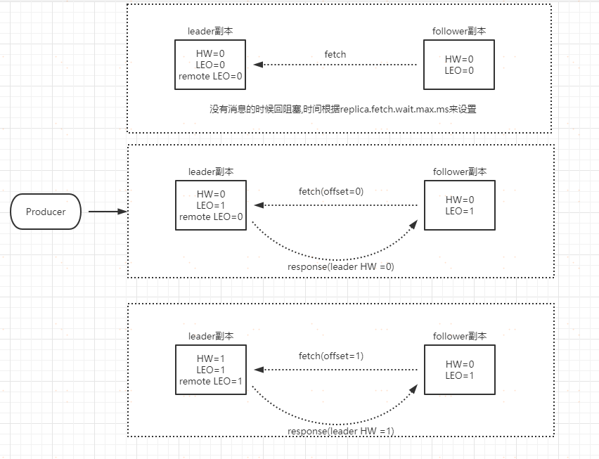](https://img2020.cnblogs.com/blog/874710/202101/874710-20210118101817619-1431507409.png)

1. 读取 log 数据
2. 更新 remote LEO=1， 因为这次 fetch 携带的 offset 是1.
3. 更新当前分区的 HW，这个时候 leader LEO 和 remoteLEO 都是 1，所以 HW 的值也更新为 1
4. 把数据和当前分区的 HW 值返回给 follower 副本，这个时候如果没有数据，则返回为空

follower 副本收到 response 以后

1. 如果有数据则写本地日志，并且更新 LEO
2. 更新 follower 的 HW 值 到目前为止，数据的同步就完成了，意味着消费端能够消费 offset=0 这条消息。

**二、follower 的 fetch 请求是直接从阻塞过程中触发**

前面说过，由于 leader 副本暂时没有数据过来，所以follower 的 fetch 会被阻塞，直到等待超时或者 leader 接收到新的数据。当 leader 收到请求以后会唤醒处于阻塞的fetch 请求。处理过程基本上和前面说的一直

1. leader 将消息写入本地日志，更新 Leader 的 LEO
2. 唤醒 follower 的 fetch 请求
3. 更新 HWkafka 使用 HW 和 LEO 的方式来实现副本数据的同步，本身是一个好的设计，但是在这个地方会存在一个数据丢失的问题，当然这个丢失只出现在特定的背景下。我们回想一下， HW 的值是在新的一轮 FETCH 中才会被更新。我们分析下这个过程为什么会出现数据丢失

**数据丢失问题****问题描述**

前提： min.insync.replicas=1 的时候。 ->设定 ISR 中的最小副本数是多少，默认值为 1, 当且仅当 acks 参数设置为-1（表示需要所有副本确认） 时，此参数才生效. 表达的含义是，至少需要多少个副本同步才能表示消息是提交的所以，当 min.insync.replicas=1 的时候一旦消息被写入 leader 端 log 即被认为是“已提交”，而延迟一轮 FETCH RPC 更新 HW 值的设计使得 follower HW值是异步延迟更新的，倘若在这个过程中 leader 发生变更，那么成为新 leader 的 follower 的 HW 值就有可能是过期的，使得 clients 端认为是成功提交的消息被删除。

**数据丢失的解决方案**

在 kafka0.11.0.0 版本以后，提供了一个新的解决方案，使用 leader epoch 来解决这个问题， leader epoch 实际上是一对之(epoch,offset), epoch 表示 leader 的版本号，从 0开始，当 leader 变更过 1 次时 epoch 就会+1，而 offset 则对应于该 epoch 版本的 leader 写入第一条消息的位移。比如说(0,0) ; (1,50); 表示第一个 leader 从 offset=0 开始写消息，一共写了 50 条，第二个 leader 版本号是 1，从 50 条处开始写消息。这个信息保存在对应分区的本地磁盘文件中，文 件 名 为 ： /tml/kafka-log/topic/leader-epochcheckpointleader broker 中会保存这样的一个缓存，并定期地写入到一个 checkpoint 文件中。
当 leader 写 log 时它会尝试更新整个缓存——如果这个leader 首次写消息，则会在缓存中增加一个条目；否则就不做更新。而每次副本重新成为 leader 时会查询这部分缓存，获取出对应 leader 版本的 offset

**如何处理所有的 Replica 不工作的情况**

在 ISR 中至少有一个 follower 时，Kafka 可以确保已经commit 的数据不丢失，但如果某个 Partition 的所有Replica 都宕机了，就无法保证数据不丢失了

1. 等待 ISR 中的任一个 Replica“活”过来，并且选它作为Leader
2. 选择第一个“活”过来的 Replica（不一定是 ISR 中的）作为 Leader这就需要在可用性和一致性当中作出一个简单的折衷。如果一定要等待 ISR 中的 Replica“活”过来，那不可用的时间就可能会相对较长。而且如果 ISR 中的所有 Replica 都无法“活”过来了，或者数据都丢失了，这个 Partition 将永远不可用。

选择第一个 “ 活 ” 过来的 Replica 作为 Leader ，而这个Replica 不是 ISR 中的 Replica，那即使它并不保证已经包含了所有已 commit 的消息，它也会成为 Leader 而作为consumer 的数据源（前文有说明，所有读写都由 Leader完成）。

**ISR 的设计原理**

 在所有的分布式存储中，冗余备份是一种常见的设计方式，而常用的模式有同步复制和异步复制，按照 kafka 这个副本模型来说如果采用同步复制，那么需要要求所有能工作的 Follower 副本都复制完，这条消息才会被认为提交成功，一旦有一个follower 副本出现故障，就会导致 HW 无法完成递增，消息就无法提交，消费者就获取不到消息。这种情况下，故障的Follower 副本会拖慢整个系统的性能，设置导致系统不可用.
​ 如果采用异步复制， leader 副本收到生产者推送的消息后，就认为次消息提交成功。follower 副本则异步从 leader 副本同步。这种设计虽然避免了同步复制的问题，但是假设所有follower 副本的同步速度都比较慢他们保存的消息量远远落后于 leader 副本。而此时 leader 副本所在的 broker 突然宕机，则会重新选举新的 leader 副本，而新的 leader 副本中没有原来 leader 副本的消息。这就出现了消息的丢失。
​ kafka 权衡了同步和异步的两种策略，采用 ISR 集合，巧妙解决了两种方案的缺陷：当 follower 副本延迟过高， leader 副本则会把该 follower 副本提出 ISR 集合，消息依然可以快速提交。当 leader 副本所在的 broker 突然宕机，会优先将 ISR 集合中follower 副本选举为 leader，新 leader 副本包含了 HW 之前的全部消息，这样就避免了消息的丢失。

**Kafka顺序性保证**

Kafka保证消息顺序性的特点如下所示：
topic中的数据分割为一个或多个partition。每个topic至少有一个partition。在单个partition中的数据是有序的，如果消息分散在不同的partition，Kafka 无法保证其顺序性。但只需要确保要求顺序性的若干消息发送到同一个partiton，即可满足其顺序性。并且在进行消息消费的时候，需要确保消费者是进行单线程消费。

要保证若干消息发送到同一个partiton中，那么我们就需要在发送消息的时候指定一个分区的id，那么这样的话消息就被发送到同一个分区中。


```
// 发送消息到指定的分区，保证分区的消息顺序性
public static void sendMessageToDestPartition() {
   for(int x = 0; x < 5; x++) {
       // Kafka消息的异步发送
       String msg = "Kakfa环境测试...." + x;
       kafkaTemplate.send("test",0, "order",
msg).addCallback((obj) ->{
           LOGGER.info("send msg to kafka broker success ---> {} ",
((SendResult)obj).getProducerRecord().value());
      } , (t) ->{
           t.printStackTrace();
      });
       LOGGER.info("send msg to local cache success ---> {} ", msg);
  }
}
```

消费者进行指定分区的消费：


```
@KafkaListener(topicPartitions =
{@org.springframework.kafka.annotation.TopicPartition(topic = "test",
partitions = "0")} , groupId = "test.demo")
public void consumerOrderMessageHandler(String msg, KafkaConsumer
consumer) {
   LOGGER.info("consumer topic is : {} , msg is ----> {} ", "test",
msg);
   consumer.commitAsync();
}
```

**Kafka解决消息重复保证****生产者消息重复**

**问题描述**
生产者发送的消息没有收到正确的broke响应，导致producer重试。producer发出一条消息，broker落盘以后因为网络等种种原因发送端得到一个发送失败的响应或者网络中断，然后producer收到一个可恢复的Exception重试消息导致消息重复。

**解决方案**

解决方案：
1、启动kafka的幂等性
2、retries=0，不重试（可能会丢消息，适用于吞吐量指标重要性高于数据丢失，例如：日志收集）所谓幂等性，就是对接口的多次调用所产生的结果和调用一次是一致的。生产者在进行重试的时候有可能会重复写入消息，而使用Kafka的幂等性功能就可以避免这种情况。
开启幂等性的方式比较简单，我们只需要设置enable.idempotence参数为true就可以了。如下所示：


```
spring:
 kafka:
   producer:
     bootstrap-servers: 192.168.23.131:9092
     acks: all
     retries: 2
     properties: {'max.in.flight.requests.per.connection': 1,"enable.idempotence":true}
```

如果使用幂等性，并且我们显示的指定了retries，acks，max.in.flight.requests.per.connection这几个参数，那么就对这几个参数的配置是有要求的：
retries的值必须是大于0，如果设置不对就会抛出如下异常：


```
Caused by: org.apache.kafka.common.config.ConfigException: Must set retries to non-zero when using the idempotent producer.
```

max.in.flight.requests.per.connection的值不能大于5，如果设置不对就会抛出如下异常：


```
Caused by: org.apache.kafka.common.config.ConfigException: Must set
max.in.flight.requests.per.connection to at most 5 to use the idempotent
producer.
```

acks的取值需要设置为-1/all，如果设置不对就会抛出如下异常：


```
Caused by: org.apache.kafka.common.config.ConfigException: Must set acks
to all in order to use the idempotent producer. Otherwise we cannot
guarantee idempotence.
```

幂等性原理介绍：
为了实现生产者幂等性，Kafka为此引入了producer id(PID) 和序列号（sequence number）这两个概念，每个新的生产者实例在初始化的时候都会被分配一个PID ，这个PID对用户而言是完全透明的。对于每个PID，消息发送到的每一个分区都有对应的序列号，这些序列号从0开始单调递增。生产者每发送一条消息就会将<PID , 分区>对应的序号的值加1。
broker端会在内存中为每一对<PID , 分区>维护一个序列号。对于收到的每一条消息，会存在这样的几种情
况：
1、SN_new = SN_old + 1时，broker才会接收它。
2、SN_new < SN_old + 1，那么说明消息被重复写入，broker可以直接将其丢弃。
3、SN_new > SN_old + 1，那么说明中间有数据尚未写入，出现了乱序，暗示可能有消息丢失，对应的生产者会抛出OutOfOrderSquenceException，这个异常时一个严重的异常。幂等性不能跨分区实现。

**相关知识**
幂等性并不能跨多个分区运作，比如我们现在要想发送3个消息，当第二个消息发送完毕以后程序报错了，这样第三个消息就没有发送成功，当下一次在调用这个方法发送数据的时候，就会导致消息重复发送（失去了幂等性）。而事务可以弥补这个缺憾，事务可以保证对多个分区写入操作的原子性。操作的原子性是指多个操作要么全部成功，要么全部失败，不存在部分成功部分失败的可能。为了实现事务，应用程序必须提供唯一的transactionalId，这个参数通过客户

端程序来进行设定。如下所示：


```
spring.kafka.producer.transaction-id-prefix=order_tx.   # 表示开启事务机制
```

并且事务机制的使用需要幂等性的支持，所以我们还需要开启幂等性：enable.idempotence = true。如果没有开启幂等性的支持，就会报错，如下所示：


```
Caused by: org.apache.kafka.common.config.ConfigException: Cannot set a transactional.id without also enabling idempotence.
```

事务机制实现的两种方式：

1、第一种方式


```
// 事务消息发送的第一种方式
public static void sendTransactionMessageMethod01() {
    // 发送事务消息
   kafkaTemplate.executeInTransaction((operations) ->{
       // 发送消息
       kafkaTemplate.send("itcast", 0, "order", "事务消息----> 1")
;
       kafkaTemplate.send("itcast", 0, "order", "事务消息----> 2")
;
       // 产生异常代码
       int a = 1 / 0;
       kafkaTemplate.send("itcast", 0, "order", "事务消息----> 3")
;
       // 返回true，表示发送成功
       return true;
  }) ;
   LOGGER.info("send transaction message to local cache success ");
}
```

2、第二种方式


```
@Transactional(rollbackFor = RuntimeException.class)
public void sendTransactionMessage() {
   // 发送消息
   kafkaTemplate.send("itcast", 0, "order", "事务消息----> 1") ;
   kafkaTemplate.send("itcast", 0, "order", "事务消息----> 2") ;
   // 产生异常代码
   int a = 1 / 0;
   kafkaTemplate.send("itcast", 0, "order", "事务消息----> 3") ;
}
```

**消费端消息重复**

1、根本原因
数据消费完没有及时提交offset到broker。
解决方案
1、取消自动自动提交
每次消费完或者程序退出时手动提交。
2、下游做幂等
一般的解决方案是让下游做幂等。

***5\***|***2\*****Kafka为什么快****分区管理**

 Kafka可以将主题划分为多个分区（Partition），会根据分区规则选择把消息存储到哪个分区中，只要分区
规则设置的合理，那么所有的消息将会被均匀的分布到不同的分区中，这样就实现了负载均衡和水平扩展。另外，多个订阅者可以从一个或者多个分区中同时消费数据，以支撑海量数据处理能力。顺便说一句，由于消息是以追加的方法存储到分区中的，多个分区顺序写磁盘的总效率要比随机写内存还要高（引用Apache Kafka – A High Throughput Distributed Messaging System的观点），是Kafka高吞吐率的重要保证之一。

**分区副本机制**

由于Producer和Consumer都只会与Leader角色的分区副本相连，所以kafka需要以集群的组织形式提供主题下的消息高可用。kafka支持主备复制，所以消息具备高可用和持久性。
一个分区可以有多个副本，这些副本保存在不同的broker上。每个分区的副本中都会有一个作为Leader。当
一个broker失败时，Leader在这台broker上的分区都会变得不可用，kafka会自动移除Leader，再其他副本中选一个作为新的Leader。在通常情况下，增加分区可以提供kafka集群的吞吐量。然而，也应该意识到集群的总分区数或是单台服务器上的分区数过多，会增加不可用及延迟的风险。

**分区leader选举**

可以预见的是,如果某个分区的Leader挂了,那么其它跟随者将会进行选举产生一个新的leader,之后所有的读写就会转移到这个新的Leader上,在kafka中,其不是采用常见的多数选举的方式进行副本的Leader选举,而是会在Zookeeper上针对每个T opic维护一个称为ISR（in-sync replica，已同步的副本）的集合,显然还有一些副本没有来得及同步。只有这个ISR列表里面的才有资格成为leader(先使用ISR里面的第一个，如果不行依次类推，因为ISR里面的是同步副本，消息是最完整且各个节点都是一样的)。通过ISR,kafka可以容忍的失败数比较高。
假设某个topic有f+1个副本，kafka可以容忍f个不可用,当然如果全部ISR里面的副本都不可用,也可以选择其他可用的副本,只是存在数据的不一致。

**分区重新分配**

我们往已经部署好的Kafka集群里面添加机器是最正常不过的需求，而且添加起来非常地方便，我们需要做
的事是从已经部署好的Kafka节点中复制相应的配置文件，然后把里面的
broker id修改成全局唯一的，最后启动这个节点即可将它加入到现有Kafka集群中。但是问题来了，新添加
的Kafka节点并不会自动地分配数据，所以无法分担集群的负载，除非我
们新建一个topic。但是现在我们想手动将部分分区移到新添加的Kafka节点上，Kafka内部提供了相关的工具
来重新分布某个topic的分区。
具体的实现步骤如下所示：
1、比如某一个主题的分区信息如下所示：

[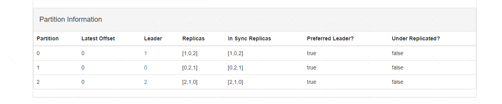](https://img2020.cnblogs.com/blog/874710/202101/874710-20210118101826366-1910055080.png)

2、给某一个分区在添加一个新的分区


```
bin/kafka-topics.sh --alter --zookeeper 172.19.0.61:2181 --topic demo
--partitions 4
```

添加完毕以后，分区的信息如下所示：

[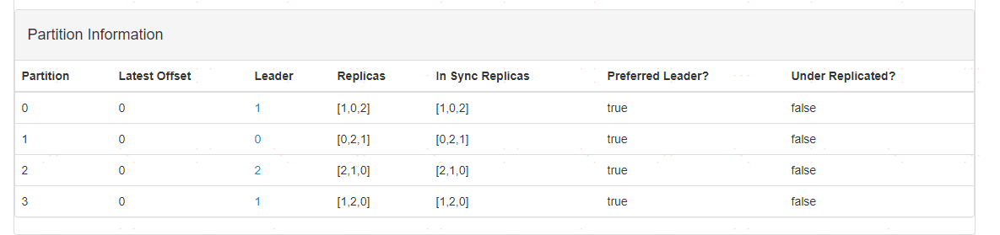](https://img2020.cnblogs.com/blog/874710/202101/874710-20210118101834810-1401826628.png)

这样会导致3个Broker上有重新维护了更多的分区节点。

3、再次创建一个kafka的容器


```
docker run -di --network=host --name=kafka_04 -v
/etc/localtime:/etc/localtime --privileged=true
wurstmeister/kafka:latest /bin/bash
```

查看itheima主题的分区情况，如下所示

[](https://img2020.cnblogs.com/blog/874710/202101/874710-20210118101845963-1949608510.png)

和之前没有任何的变化。

3、修改集群配置文件


```
broker.id=3                       # 表示broker的编号，如
果集群中有多个broker，则每个broker的编号需要设置的不同
port=9095                      # 端口号
listeners=PLAINTEXT://192.168.23.131:9095       # brokder对外提供的服
务入口地址
log.dirs=/tmp/kafka-logs                # 设置存放消息日志文件
的地址
zookeeper.connect=172.19.0.61:2181,172.19.0.62:2181,172.19.0.63:2181
# Kafka所需Zookeeper集群地址，Zookeeper和Kafka都安装本机
```

4、重新分配

现在我们需要将原先分布在broker 1-3节点上的分区重新分布到broker 1-4节点上，借助kafkareassignpartitions.sh工具生成reassign plan，不过我们先得按照要求定义一个文件，里面说明哪些topic需要重新分区，文件内容如下：


```
demo@Server-node:/mnt/d/kafka-cluster/kafka-1$ cat reassign.json
{"topics":[{"topic":"demo"}],
"version":1
}
```

然后使用 kafka-reassign-partitions.sh 工具生成reassign plan


```
bin/kafka-reassign-partitions.sh --zookeeper 172.19.0.61:2181 --topics-to-move-json-file
reassign.json --broker-list "0,1,2,3" --generate
```

命令会输出两个字符串,如下所示：


```
Current partition replica assignment
{"version":1,"partitions":[{"topic":"demo","partition":2,"replicas":
[2,1,0],"log_dirs":["any","any","any"]},
{"topic":"demo","partition":1,"replicas":[0,2,1],"log_dirs":
["any","any","any"]},{"topic":"itheima","partition":0,"replicas":
[1,0,2],"log_dirs":["any","any","any"]},
{"topic":"demo","partition":3,"replicas":[1,2,0],"log_dirs":
["any","any","any"]}]}
Proposed partition reassignment configuration
{"version":1,"partitions":[{"topic":"demo","partition":2,"replicas":
[3,1,2],"log_dirs":["any","any","any"]},
{"topic":"demo","partition":1,"replicas":[2,0,1],"log_dirs":
["any","any","any"]},{"topic":"demo","partition":3,"replicas":
[0,2,3],"log_dirs":["any","any","any"]},
{"topic":"demo","partition":0,"replicas":[1,3,0],"log_dirs":
["any","any","any"]}]}
```

第一个JSON内容为当前的分区副本分配情况，第二个为重新分配的候选方案，注意这里只是生成一份可行性的方案，并没有真正执行重分配的动作。
我们将第二个JSON内容保存到名为result.json文件里面（文件名不重要，文件格式也不一定要以json为结尾，只要保证内容是json即可），然后执行这些reassign plan。如下所示：

执行分配策略


```
bin/kafka-reassign-partitions.sh --zookeeper 172.19.0.61:2181 --reassignment-json-file result.json --execute
```

执行完毕以后，看出分区信息：

[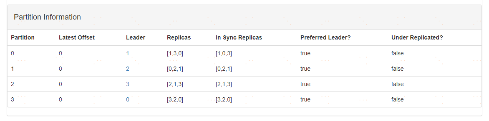](https://img2020.cnblogs.com/blog/874710/202101/874710-20210118101854333-130214618.png)

**修改副本因子**

**场景**
修改副本因子的使用场景也很多，比如在创建主题时填写了错误的副本因子数而需要修改，再比如运行一段时间之后想要通过增加副本因子数来提高容错性和可靠性。修改副本因此也是通过kafka-reassign-partitions.sh脚本实现的。仔细观察我们刚才对itheima进行分区重新分配以后的结果：


```
{"version":1,"partitions":[{"topic":"demo","partition":2,"replicas":
[3,1,2],"log_dirs":["any","any","any"]},
{"topic":"demo","partition":1,"replicas":[2,0,1],"log_dirs":
["any","any","any"]},{"topic":"itheima","partition":3,"replicas":
[0,2,3],"log_dirs":["any","any","any"]},
{"topic":"demo","partition":0,"replicas":[1,3,0],"log_dirs":
["any","any","any"]}]}
```

通过观察JSON内容里的replicas都是3个副本。我们可以更改指定分区数的副本，具体的实现如下所示：

1、创建一个json文件，定义指定分区的副本数据


```
{
"version":1,
"partitions":[
        {"topic":"demo","partition":2,"replicas":[0,1]}
]
}
```

2、然后执行脚本文件


```
bash-4.4# bin/kafka-reassign-partitions.sh --zookeeper 172.19.0.61:2181
--reassignment-json-file replication-factor.json --execute
Current partition replica assignment
{"version":1,"partitions":[{"topic":"demo","partition":2,"replicas":
[3,1,2],"log_dirs":["any","any","any"]},
{"topic":"demo","partition":1,"replicas":[2,0,1],"log_dirs":
["any","any","any"]},{"topic":"itheima","partition":0,"replicas":
[1,3,0],"log_dirs":["any","any","any"]},
{"topic":"demo","partition":3,"replicas":[0,2,3],"log_dirs":
["any","any","any"]}]}
Save this to use as the --reassignment-json-file option during rollback
Successfully started reassignment of partitions.
```

执行完毕以后，我们再次看出demo的分区副本情况，如下所示：

[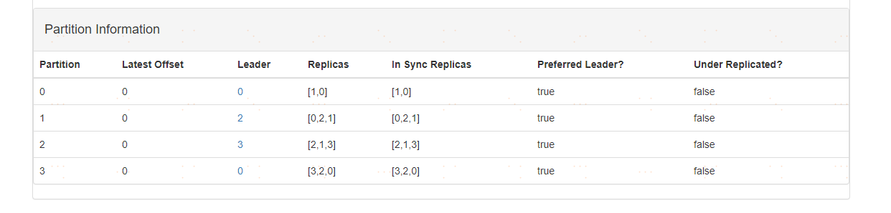](https://img2020.cnblogs.com/blog/874710/202101/874710-20210118101907430-575301161.png)


**[有梦想的老王](https://www.cnblogs.com/whgk/p/14291466.html)**

