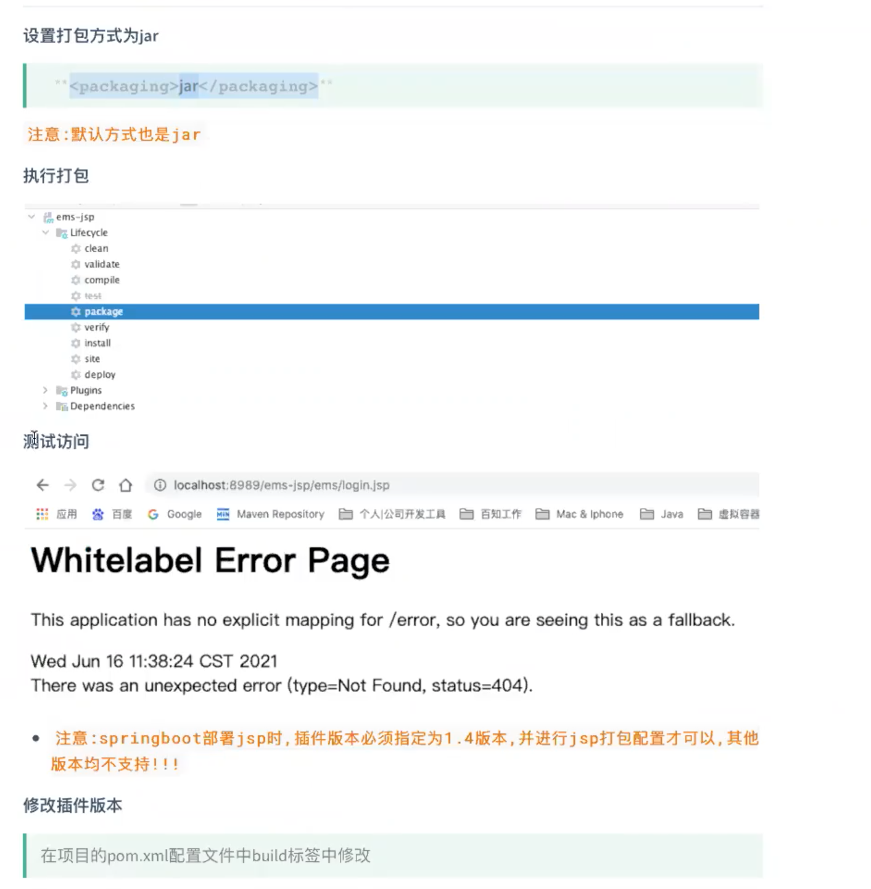
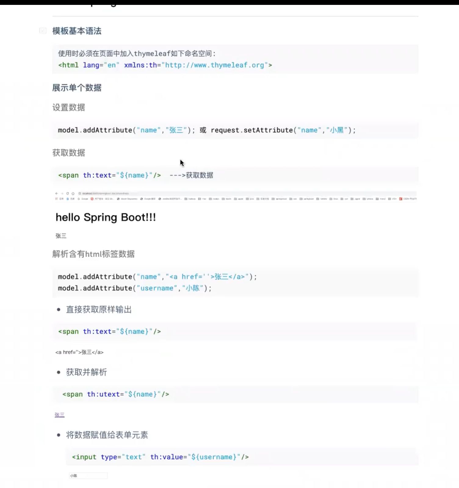

## SpringBoot中SpringBootTest

### 1、引入包：

```xml
<dependency>
    <groupId>org.springframework.boot</groupId>
    <artifactId>spring-boot-starter-test</artifactId>
    <scope>test</scope>
</dependency>
```

### 2、在测试类上加`@SpringBootTest`注解

```java
import org.springframework.boot.test.context.SpringBootTest;

/**
 * 定义一个基础的类 ,没有任何代码逻辑,只是为了使用@SpringBootTest ,别的类去继承
 **/

@SpringBootTest
public class BasicTest {
}


/*****************************************************************/

import com.weidd.best.springboot_mybatis.mapper.UserDao;
import com.weidd.best.springboot_mybatis.pojo.User;
import org.junit.jupiter.api.Test;
import org.springframework.beans.factory.annotation.Autowired;
import org.springframework.boot.test.context.SpringBootTest;

import java.util.List;

//@SpringBootTest //单元测试注解
class SpringbootMybatisApplicationTests extends BasicTest {
  
    @Autowired
    private UserDao userDao;

    @Test
    void contextLoads() {
        List<User> all = userDao.findAll();

        System.out.println(all);
        System.out.println("*******************");
        userDao.findAll().forEach(user -> System.out.println(user.getName()));
    }
}
```

## SpringBoot项目热部署：

### 0、热部署是将修改的类的class文件去替换原有的文件，实现编译部署。

### 1、引入依赖

```xml
<!--热部署依赖 spring-boot-devtools-->
<dependency>
    <groupId>org.springframework.boot</groupId>
    <artifactId>spring-boot-devtools</artifactId>
    <!--optional: 该依赖是否可以传递: (项目与项目之间): true:可以传递,只能在当前项目 : 默认是false(可以传递),-->
    <optional>true</optional>
</dependency>
```

### 2、设置Idea中支持自动编译，（需要设置一次）

1、开启自动编译：Preferences | Build, Execution, Deployment | Compiler


2、开启运行过程中修改文件(允许运行过程中，新的文件去交换老的文件)

`command+option+shift+/    --> Registry  -->  compiler.automake.allow.when.app.running`

```
2021-08-02 14:06:59,116 [restartedMain]
* restartedMain 即为热部署设置成功。
```


## springboot项目中的日志处理：

### 0、springboot中日志处理

* 引言：springboot集成的日志框架：  logback 。logback是log4j的改良框架，分三个模块
* 总结： logback也是一个开源的日志组件和log4j作用一致，都是用来生成日志，但是logback更轻量级。

### 日志级别：


### 项目中日志分类：


## springboot使用jsp

### 1、引入包

```xml
<!--引入jsp的解析依赖-->
<dependency>
    <groupId>org.apache.tomcat.embed</groupId>
    <artifactId>tomcat-embed-jasper</artifactId>
</dependency>
```

### 2、配置

```yml
spring:
  mvc:
    view:
      prefix: /
      suffix: .jsp
```

### 3、idea配置


项目可以访问jsp Working directory （$MODULE_DIR$）


### 用户注册


## 切面编程：


## springboot文件上传和下载


#### 不推荐如下方式进行文件上传（springboot项目不能往jar包中放置文件。）方式1：不推荐


#### 方式2： 


>springboot 加载外部配置。 

### 文件下载 


> 中名文需要特殊处理
>
> 


## 拦截器


>多个拦截器，（拦截器是栈是结构）
>
>


## war包部署：

>* 指定war包部署   	<pakaging>war</pakaging>
>* 排除内嵌Tomcat依赖在打包时不参与打包。 <scope>provided</scope>
>
>* 在pom.xml插件中中指定入口类
>* 启动类上进行配置


配置启动类：


## jar包部署：



>* jsp页面在jar包部署的时候有问题:解决办法：
>
>  
>
>
>
>

## Thymeleaf引擎模板

> * thymeleaf java模板引擎，必须经过Controller控制器，才能去渲染。





