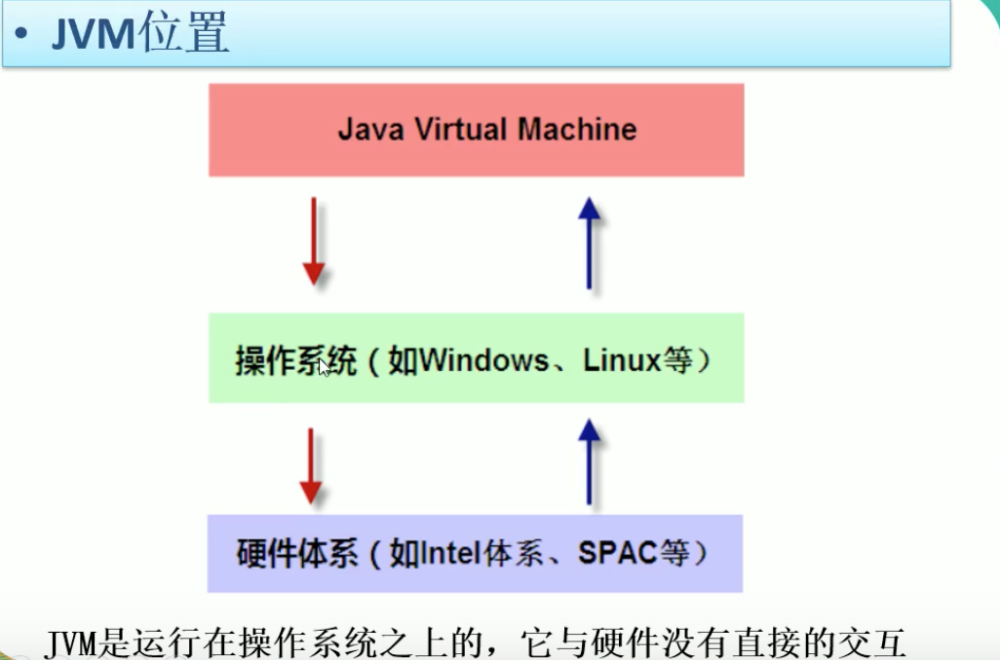
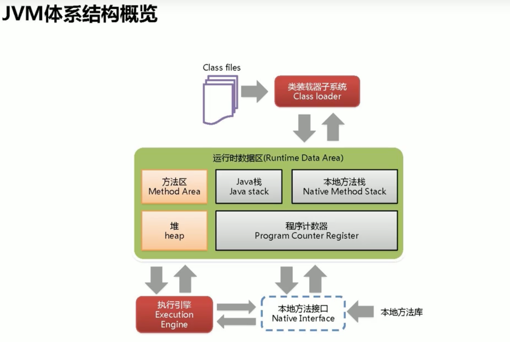
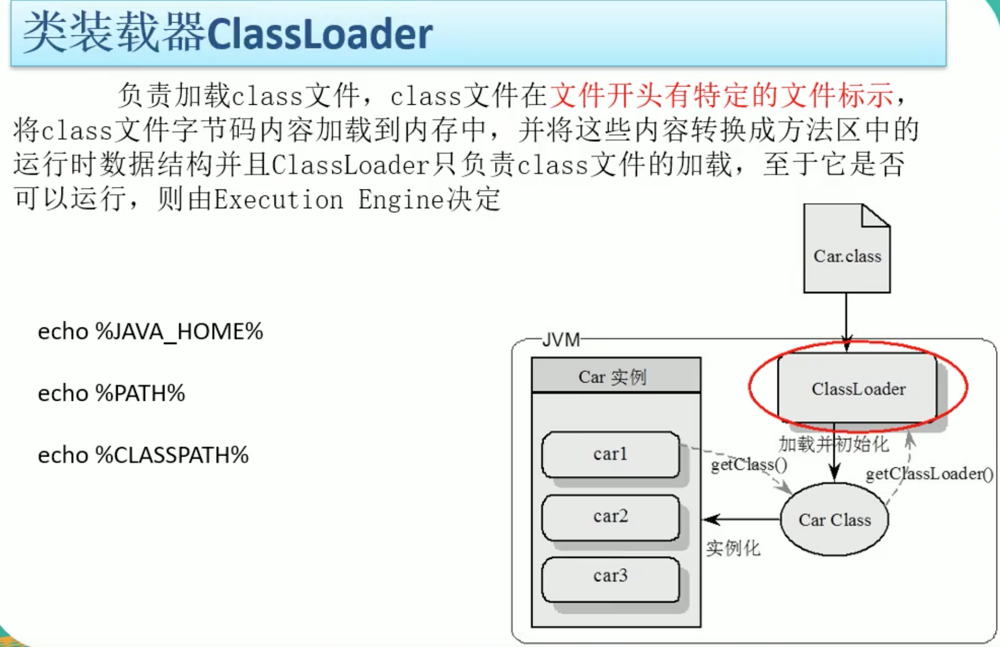
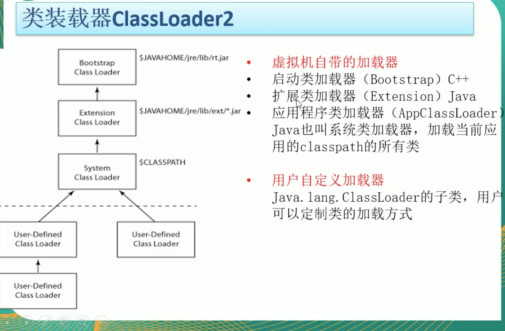
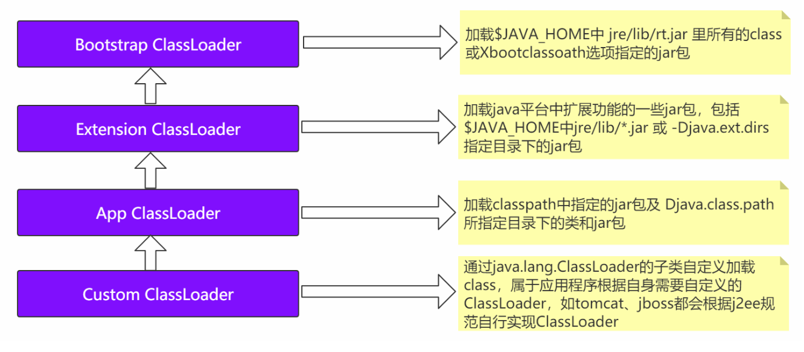
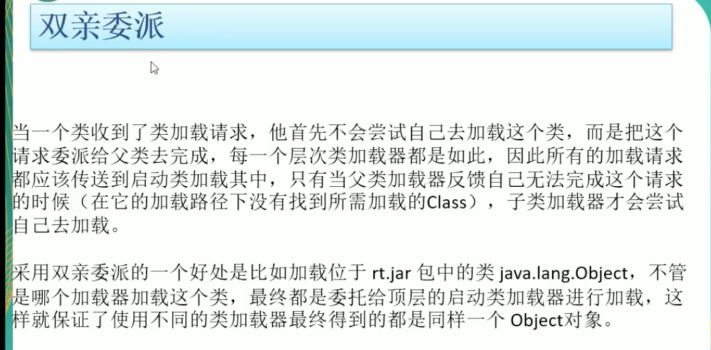
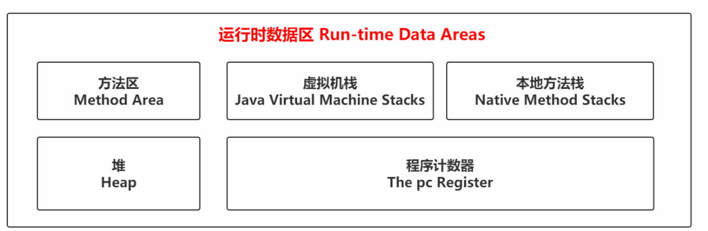
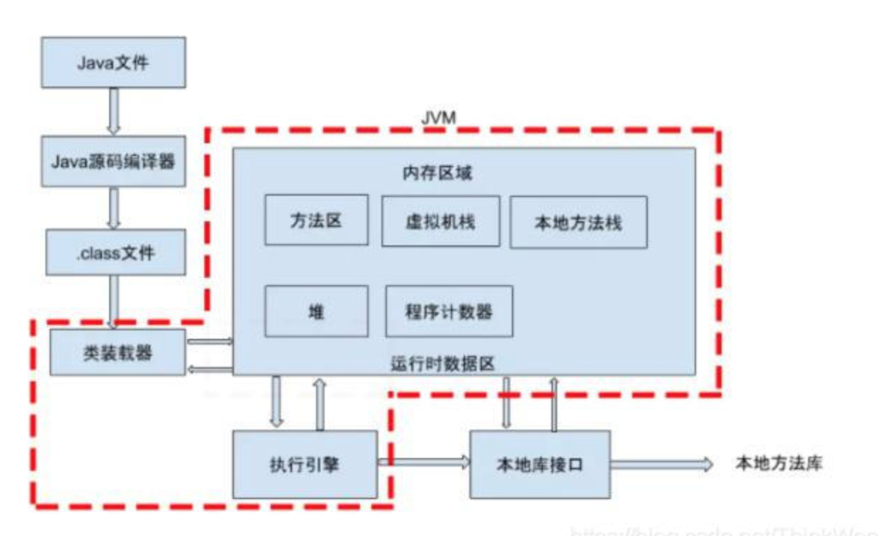
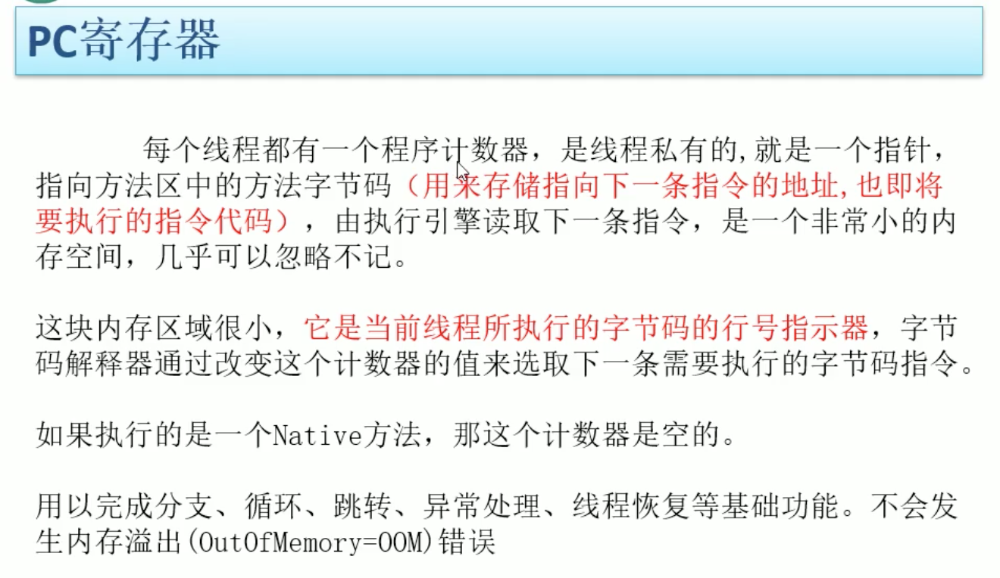
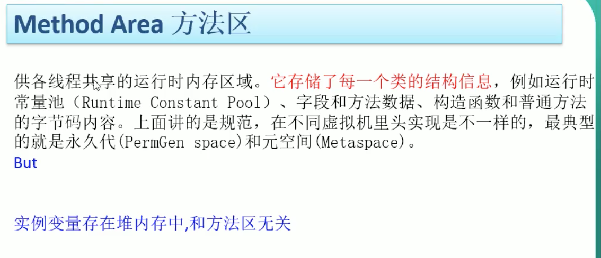

# JVM

## Jvm学习：尚硅谷周阳老师课程

* 谈一谈对JVM的理解？Java8的虚拟机有什么更新？
* 什么是OOM？什么是StackOverflowError？有哪些方法分析?
* JVM的常用参数调优你知道哪些？
* 谈谈jvm中，对类加载器你的认识？

## jvm位置：

### JVM体系结构概览：

## 类加载器

### 类加载器种类：ClassLoader

* 启动类加载器（Bootstrap）: C++ 语言写的，用于加载$JAVA_HOME/jre/lib/rt.jar(即为：runtime.jar) Java核心类，环境依赖的jar（Object、String、ArrayList、、、、）
* 扩展类加载器（Extension）：负责加载jre的扩展目录（$JAVA_HOME/jre/lib/ext/*.jar）由Java实现，父类加载器为null。
* 系统类加载器（AppClassLoader）：负责加载classpath下的jar包。Java实现，父类加载器为extClassLoader。

* 用户自定义加载器（java.lang.ClassLoader的子类）用户可以自定义一些类加载器。

### 双亲委派机制：

### 名词：异构系统：不同语言开发的系统。

## JVM内存模型

### 本地方法栈 native method stack

* 线程私有。
* C++语言实现的，有声明无实现。

### 程序计数器（The pc Register）

* 线程私有
* 用来存储指向下一条指令的地址，也即将要执行的指令代码。
* 内存区域很小，是当前线程所执行的字节码的行号指示器。

### 方法区 （Method Area）

* 用于存储已被虚拟机加载的类信息、常量、静态变量、即时编译器编译后的代码等数据。
* 方法区是各个线程共享的内存区域，在虚拟机启动时创建。
* 虽然Java虚拟机规范把方法区描述为堆的一个逻辑部分，但是它却又一个别名叫做Non-Heap(非堆)，目 的是与Java堆区分开来。

