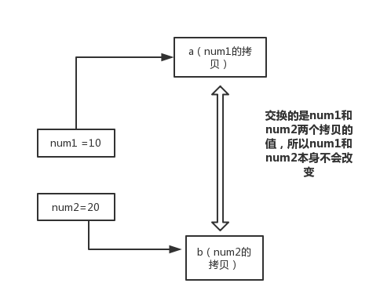

#  一、Java基础知识：

## ①、基础知识

### 1、什么是Java？

> Java是一门面向对象编程语言，不仅吸收了C++语言的各种优点，还摒弃了C++里难以理解的多继承、指针等概念，因此Java语言具有功能强大和简单易用两个特征。Java语言作为静态面向对象编程语言的代表，极好地实现了面向对象理论，允许程序员以优雅的思维方式进行复杂的编程 。

### 2、Java 语言有哪些特点？

>1.简单易学；
>
>2.面向对象（封装，继承，多态）；
>
>3.平台无关性（ Java 虚拟机实现平台无关性）；
>
>4.可靠性；
>
>5.安全性；
>
>6.支持多线程（ C++ 语言没有内置的多线程机制，因此必须调用操作系统的多线程功能来进行多线程程序设计，而 Java 语言却提供了多线程支持）；
>
>7.支持网络编程并且很方便（ Java 语言诞生本身就是为简化网络编程设计的，因此 Java 语言不仅支持网络编程而且很方便）；
>
>8.编译与解释并存;

###  3、JVM简答（祥看jvm整理章节）

Java 虚拟机（JVM）是运行 Java 字节码的虚拟机。JVM 有针对不同系统的特定实现（Windows，Linux，macOS），目的是使用相同的字节码，它们都会给出相同的结果。

#### 什么是字节码?采用字节码的好处是什么?

在 Java 中，JVM 可以理解的代码就叫做字节码（即扩展名为 .class 的文件），它不面向任何特定的处理器，只面向虚拟机。Java 语言通过字节码的方式，在一定程度上解决了传统解释型语言执行效率低的问题，同时又保留了解释型语言可移植的特点。所以 Java 程序运行时比较高效，而且，由于字节码并不针对一种特定的机器，因此，Java 程序无须重新编译便可在多种不同操作系统的计算机上运行。

Java 程序从源代码到运行一般有下面 3 步：


我们需要格外注意的是 .class->机器码 这一步。在这一步 JVM 类加载器首先加载字节码文件，然后通过解释器逐行解释执行，这种方式的执行速度会相对比较慢。而且，有些方法和代码块是经常需要被调用的(也就是所谓的热点代码)，所以后面引进了 JIT 编译器，而 JIT 属于运行时编译。当 JIT 编译器完成第一次编译后，其会将字节码对应的机器码保存下来，下次可以直接使用。而我们知道，机器码的运行效率肯定是高于 Java 解释器的。这也解释了我们为什么经常会说 Java 是编译与解释共存的语言。

HotSpot 采用了惰性评估(Lazy Evaluation)的做法，根据二八定律，消耗大部分系统资源的只有那一小部分的代码（热点代码），而这也就是 JIT 所需要编译的部分。JVM 会根据代码每次被执行的情况收集信息并相应地做出一些优化，因此执行的次数越多，它的速度就越快。JDK 9 引入了一种新的编译模式 AOT(Ahead of Time Compilation)，它是直接将字节码编译成机器码，这样就避免了 JIT 预热等各方面的开销。JDK 支持分层编译和 AOT 协作使用。但是 ，AOT 编译器的编译质量是肯定比不上 JIT 编译器的。

**总结：**

Java 虚拟机（JVM）是运行 Java 字节码的虚拟机。JVM 有针对不同系统的特定实现（Windows，Linux，macOS），目的是使用相同的字节码，它们都会给出相同的结果。字节码和不同系统的 JVM 实现是 Java 语言“一次编译，随处可以运行”的关键所在。

### 4、Java 和 C++的区别?

>- 都是面向对象的语言，都支持封装、继承和多态
>- Java 不提供指针来直接访问内存，程序内存更加安全
>- Java 的类是单继承的，C++ 支持多重继承；虽然 Java 的类不可以多继承，但是接口可以多继承。
>- Java 有自动内存管理机制，不需要程序员手动释放无用内存
>- 在 C 语言中，字符串或字符数组最后都会有一个额外的字符‘\0’来表示结束。但是，Java 语言中没有结束符这一概念。 这是一个值得深度思考的问题，具体原因推荐看这篇文章： https://blog.csdn.net/sszgg2006/article/details/49148189

### 5、为什么说 Java 语言“编译与解释并存”？

> 高级编程语言按照程序的执行方式分为**编译型和解释型两种**。简单来说，编译型语言是指编译器针对特定的操作系统将源代码一次性翻译成可被该平台执行的机器码；解释型语言是指解释器对源程序逐行解释成特定平台的机器码并立即执行。比如，你想阅读一本英文名著，你可以找一个英文翻译人员帮助你阅读， 有两种选择方式，你可以先等翻译人员将全本的英文名著（也就是源码）都翻译成汉语，再去阅读，也可以让翻译人员翻译一段，你在旁边阅读一段，慢慢把书读完。
>
> Java 语言既具有编译型语言的特征，也具有解释型语言的特征，因为 Java 程序要经过**先编译，后解释**两个步骤，由 Java 编写的程序需要先经过编译步骤，生成字节码（*.class 文件），这种字节码必须由 Java 解释器来解释执行。因此，我们可以认为 Java 语言编译与解释并存。

###  6、自增自减运算符（i++  ，++i）

在写代码的过程中，常见的一种情况是需要某个整数类型变量增加 1 或减少 1，Java 提供了一种特殊的运算符，用于这种表达式，叫做自增运算符（++)和自减运算符（--）。

++和--运算符可以放在操作数之前，也可以放在操作数之后，**当运算符放在操作数之前时，先自增/减，再赋值**；**当运算符放在操作数之后时，先赋值，再自增/减**。例如，当“b=++a”时，先自增（自己增加 1），再赋值（赋值给 b）；当“b=a++”时，先赋值(赋值给 b)，再自增（自己增加 1）。也就是，++a 输出的是 a+1 的值，a++输出的是 a 值。用一句口诀就是：“符号在前就先加/减，符号在后就后加/减”。

```java
int countDown =10;
private  void run() {
    while (countDown-- > 0) {// 先拿countDown做比较，比较后再做自减
        System.out.println("(" + (countDown > 0 ? countDown : "liftOff!") + ")");
    }
}

// (9)(8)(7)(6)(5)(4)(3)(2)(1)(liftOff!)
private  void run1() {
    while (--countDown > 0) {// countDown先做自减然后再做比较
        System.out.println("(" + (countDown > 0 ? countDown : "liftOff!") + ")");
    }
}
// (9)(8)(7)(6)(5)(4)(3)(2)(1) 
```


### 7、Oracle JDK 和 OpenJDK 的对比

>1. Oracle JDK版本将每三年发布一次，而OpenJDK版本每三个月发布一次；
>2. OpenJDK 是一个参考模型并且是完全开源的，而Oracle JDK是OpenJDK的一个实现，并不是完全开源的；
>3. Oracle JDK 比 OpenJDK 更稳定。OpenJDK和Oracle JDK的代码几乎相同，但Oracle JDK有更多的类和一些错误修复。因此，如果您想开发企业/商业软件，我建议您选择Oracle JDK，因为它经过了彻底的测试和稳定。某些情况下，有些人提到在使用OpenJDK 可能会遇到了许多应用程序崩溃的问题，但是，只需切换到Oracle JDK就可以解决问题；
>4. 在响应性和JVM性能方面，Oracle JDK与OpenJDK相比提供了更好的性能；
>5. Oracle JDK不会为即将发布的版本提供长期支持，用户每次都必须通过更新到最新版本获得支持来获取最新版本；
>6. Oracle JDK根据二进制代码许可协议获得许可，而OpenJDK根据GPL v2许可获得许可。

### 8、Java泛型了解么？什么是类型擦除？介绍一下常用的通配符？

Java 泛型（generics）是 JDK 5 中引入的一个新特性, 泛型提供了编译时类型安全检测机制，该机制允许程序员在编译时检测到非法的类型。泛型的本质是参数化类型，也就是说所操作的数据类型被指定为一个参数。

Java的泛型是伪泛型，这是因为Java在编译期间，所有的泛型信息都会被擦掉，这也就是通常所说类型擦除 。 更多关于类型擦除的问题，可以查看这篇文章：[《Java泛型类型擦除以及类型擦除带来的问题》](https://www.cnblogs.com/wuqinglong/p/9456193.html) 。

```java
List<Integer> list = new ArrayList<>();

	list.add(12);
	//这里直接添加会报错
	list.add("a");
	Class<? extends List> clazz = list.getClass();
	Method add = clazz.getDeclaredMethod("add", Object.class);
	//但是通过反射添加，是可以的
	add.invoke(list, "kl");
	System.out.println(list)
```

泛型一般有三种使用方式:泛型类、泛型接口、泛型方法。

#### 1.泛型类：

```java
//此处T可以随便写为任意标识，常见的如T、E、K、V等形式的参数常用于表示泛型
//在实例化泛型类时，必须指定T的具体类型
public class Generic<T>{ 
    private T key;
    public Generic(T key) { 
        this.key = key;
    }
    public T getKey(){ 
        return key;
    }
}
```

如何实例化泛型类：

`Generic genericInteger = new Generic(123456);`

#### 2.泛型接口 ：

```java
public interface Generator<T> {
    public T method();
}
```

实现泛型接口，不指定类型：

```java
class GeneratorImpl<T> implements Generator<T>{
    @Override
    public T method() {
        return null;
    }
}
```

实现泛型接口，指定类型：

```java
class GeneratorImpl<T> implements Generator<String>{
    @Override
    public String method() {
        return "hello";
    }
}
```

#### 3.泛型方法

```java
public static < E > void printArray( E[] inputArray )
   {         
         for ( E element : inputArray ){        
            System.out.printf( "%s", element );
         }
         System.out.println();
    }
   
```

使用

```java
// 创建不同类型数组： Integer, Double 和 Character
Integer[] intArray = { 1, 2, 3 };
String[] stringArray = { "Hello", "World" };
printArray( intArray  ); 
printArray( stringArray  ); 
```

常用的通配符为： T，E，K，V，？

- ？ 表示不确定的 java 类型
- T (type) 表示具体的一个java类型
- K V (key value) 分别代表java键值中的Key Value
- E (element) 代表Element

更多关于Java 泛型中的通配符可以查看这篇文章：[《聊一聊-JAVA 泛型中的通配符 T，E，K，V，？》](https://juejin.im/post/5d5789d26fb9a06ad0056bd9)

### 9、==和equals的区别

== : 它的作用是判断两个对象的地址是不是相等。即判断两个对象是不是同一个对象。(基本数据类型==比较的是值，引用数据类型==比较的是内存地址)

因为 Java 只有值传递，所以，对于 == 来说，不管是比较基本数据类型，还是引用数据类型的变量，其本质比较的都是值，只是引用类型变量存的值是对象的地址。

equals() : 它的作用也是判断两个对象是否相等，它不能用于比较基本数据类型的变量。equals()方法存在于Object类中，而Object类是所有类的直接或间接父类。

Object类equals()方法：

```java
public boolean equals(Object obj) {     
	return (this == obj); 
}
```

equals() 方法存在两种使用情况：

- 情况 1：类没有覆盖 equals()方法。则通过 equals()比较该类的两个对象时，等价于通过“==”比较这两个对象。使用的默认是 Object类equals()方法。
- 情况 2：类覆盖了 equals()方法。一般，我们都覆盖 equals()方法来两个对象的内容相等；若它们的内容相等，则返回 true(即，认为这两个对象相等)。

举个例子：

```java
public class test1 {
    public static void main(String[] args) {
        String a = new String("ab"); // a 为一个引用
        String b = new String("ab"); // b为另一个引用,对象的内容一样
        String aa = "ab"; // 放在常量池中
        String bb = "ab"; // 从常量池中查找
        if (aa == bb) // true
            System.out.println("aa==bb");
        if (a == b) // false，非同一对象
            System.out.println("a==b");
        if (a.equals(b)) // true
            System.out.println("aEQb");
        if (42 == 42.0) { // true
            System.out.println("true");
        }
    }
}
```

说明：

- String 中的 equals 方法是被重写过的，因为 Object 的 equals 方法是比较的对象的内存地址，而 String 的 equals 方法比较的是对象的值。
- 当创建 String 类型的对象时，虚拟机会在常量池中查找有没有已经存在的值和要创建的值相同的对象，如果有就把它赋给当前引用。如果没有就在常量池中重新创建一个 String 对象。

String类equals()方法：

```java
public boolean equals(Object anObject) {
    if (this == anObject) {
        return true;
    }
    if (anObject instanceof String) {
        String anotherString = (String)anObject;
        int n = value.length;
        if (n == anotherString.value.length) {
            char v1[] = value;
            char v2[] = anotherString.value;
            int i = 0;
            while (n-- != 0) {
                if (v1[i] != v2[i])
                    return false;
                i++;
            }
            return true;
        }
    }
    return false;
}
```

### 10、 hashCode()与 equals()

面试官可能会问你：“你重写过 hashcode 和 equals 么，为什么重写 equals 时必须重写 hashCode 方法？”

#### 1) hashCode()介绍:

hashCode() 的作用是获取哈希码，也称为散列码；它实际上是返回一个 int 整数。这个哈希码的作用是确定该对象在哈希表中的索引位置。hashCode() 定义在 JDK 的 Object 类中，这就意味着 Java 中的任何类都包含有 hashCode() 函数。另外需要注意的是： Object 的 hashcode 方法是本地方法，也就是用 c 语言或 c++ 实现的，**该方法通常用来将对象的 内存地址 转换为整数之后返回。**

public native int hashCode();

散列表存储的是键值对(key-value)，它的特点是：能根据“键”快速的检索出对应的“值”。这其中就利用到了散列码！（可以快速找到所需要的对象）

#### 2) 为什么要有 hashCode？

我们以“HashSet 如何检查重复”为例子来说明为什么要有 hashCode？

当你把对象加入 HashSet 时，HashSet 会先计算对象的 hashcode 值来判断对象加入的位置，同时也会与其他已经加入的对象的 hashcode 值作比较，如果没有相符的 hashcode，HashSet 会假设对象没有重复出现。但是如果发现有相同 hashcode 值的对象，这时会调用 equals（）方法来检查 hashcode 相等的对象是否真的相同。如果两者相同，HashSet 就不会让其加入操作成功。如果不同的话，就会重新散列到其他位置。（摘自我的 Java 启蒙书《Head fist java》第二版）。这样我们就大大减少了 equals 的次数，相应就大大提高了执行速度。

#### 3) 为什么重写 equals 时必须重写 hashCode 方法？

如果两个对象相等，则 hashcode 一定也是相同的。两个对象相等,对两个对象分别调用 equals 方法都返回 true。但是，两个对象有相同的 hashcode 值，它们也不一定是相等的 。因此，equals 方法被覆盖过，则 hashCode 方法也必须被覆盖。

hashCode()的默认行为是对堆上的对象产生独特值。如果没有重写 hashCode()，则该 class 的两个对象无论如何都不会相等（即使这两个对象指向相同的数据）。

#### 4) 为什么两个对象有相同的 hashcode 值，它们也不一定是相等的？

在这里解释一位小伙伴的问题。以下内容摘自《Head Fisrt Java》。

因为 hashCode() 所使用的杂凑算法也许刚好会让多个对象传回相同的杂凑值。越糟糕的杂凑算法越容易碰撞，但这也与数据值域分布的特性有关（所谓碰撞也就是指的是不同的对象得到相同的 hashCode。

我们刚刚也提到了 HashSet,如果 HashSet 在对比的时候，同样的 hashcode 有多个对象，它会使用 equals() 来判断是否真的相同。也就是说 hashcode 只是用来缩小查找成本。

更多关于 hashcode() 和 equals() 的内容可以查看：[Java hashCode() 和 equals()的若干问题解答](https://www.cnblogs.com/skywang12345/p/3324958.html)


### 11、为什么java只有值传递？

􏳨􏳩􏱣􏳪􏰚􏲇􏱜􏰭􏳫􏳬􏱍􏳭􏳮􏰮􏱓􏱁􏳯􏲙􏳋􏳁􏳦􏲀􏰶􏲬􏳐􏳰􏳱􏳋􏳲􏰐􏰚􏳳􏳴􏳵􏳶􏳭􏰫􏲅􏳄􏳷􏲸 当一个对象被当作参数传递到一个方法后，此方法可改变这个对象的属性，并可返回变化后的结果，那么这里到底是值传递还是引用传递？ 

是值传递。Java 语言的方法调用只支持参数的值传递。当一个对象实例作为一个参数被传递到方法中时，参数的值就是对该对象的引用。对象的属性可以在被调用过程中被改变，但对对象引用的改变是不会影响到调用者的。

#### 为什么 Java 中只有值传递

首先回顾一下在程序设计语言中有关将参数传递给方法（或函数）的一些专业术语。**按值调用(call by value)表示`方法接收的是调用者提供的值`，而按引用调用（call by reference)表示`方法接收的是调用者提供的变量地址`。一个方法可以修改传递引用所对应的变量值，而不能修改传递值调用所对应的变量值。** 它用来描述各种程序设计语言（不只是Java)中方法参数传递方式。

**Java程序设计语言总是采用按值调用。也就是说，方法得到的是所有参数值的一个拷贝，也就是说，方法不能修改传递给它的任何参数变量的内容。**

**下面通过 3 个例子来给大家说明**

example 1

```java
public static void main(String[] args) {
    int num1 = 10;
    int num2 = 20;

    swap(num1, num2);

    System.out.println("num1 = " + num1);
    System.out.println("num2 = " + num2);
}

public static void swap(int a, int b) {
    int temp = a;
    a = b;
    b = temp;

    System.out.println("a = " + a);
    System.out.println("b = " + b);
}
```

**结果**：

```java
a = 20
b = 10
num1 = 10
num2 = 20
```

**解析**：



在swap方法中，a、b的值进行交换，并不会影响到 num1、num2。因为，a、b中的值，只是从 num1、num2 的复制过来的。也就是说，a、b相当于num1、num2 的副本，副本的内容无论怎么修改，都不会影响到原件本身。

**通过上面例子，我们已经知道了一个方法不能修改一个基本数据类型的参数，而对象引用作为参数就不一样，请看 example2.**

example 2

```java
    public static void main(String[] args) {
        int[] arr = { 1, 2, 3, 4, 5 };
        System.out.println(arr[0]);
        change(arr);
        System.out.println(arr[0]);
    }

    public static void change(int[] array) {
        // 将数组的第一个元素变为0
        array[0] = 0;
    }
```

**结果**：

```undefined
1
0
```

**解析**：


array 被初始化 arr 的拷贝也就是一个对象的引用，也就是说 array 和 arr 指向的时同一个数组对象。 因此，外部对引用对象的改变会反映到所对应的对象上。

**通过 example2 我们已经看到，实现一个改变对象参数状态的方法并不是一件难事。理由很简单，方法得到的是对象引用的拷贝，对象引用及其他的拷贝同时引用同一个对象。**

**很多程序设计语言（特别是，C++和Pascal)提供了两种参数传递的方式：值调用和引用调用。有些程序员（甚至本书的作者）认为Java程序设计语言对对象采用的是引用调用，实际上，这种理解是不对的。由于这种误解具有一定的普遍性，所以下面给出一个反例来详细地阐述一下这个问题。**

example 3

```java
public class Test {

    public static void main(String[] args) {
        // TODO Auto-generated method stub
        Student s1 = new Student("小张");
        Student s2 = new Student("小李");
        Test.swap(s1, s2);
        System.out.println("s1:" + s1.getName());
        System.out.println("s2:" + s2.getName());
    }

    public static void swap(Student x, Student y) {
        Student temp = x;
        x = y;
        y = temp;
        System.out.println("x:" + x.getName());
        System.out.println("y:" + y.getName());
    }
}
```

**结果**：

```undefined
x:小李
y:小张
s1:小张
s2:小李
```

**解析**：

交换之前：


交换之后：


通过上面两张图可以很清晰的看出： **方法并没有改变存储在变量 s1 和 s2 中的对象引用。swap方法的参数x和y被初始化为两个对象引用的拷贝，这个方法交换的是这两个拷贝**

**总结**

Java程序设计语言对对象采用的不是引用调用，实际上，对象引用是按值传递的。

下面再总结一下Java中方法参数的使用情况：

- 一个方法不能修改一个基本数据类型的参数（即数值型或布尔型》
- 一个方法可以改变一个对象参数的状态。
- 一个方法不能让对象参数引用一个新的对象。

#### 值传递和引用传递有什么区别

值传递：指的是在方法调用时，传递的参数是按值的拷贝传递，传递的是值的拷贝，也就是说传递后就互不相关了。

引用传递：指的是在方法调用时，传递的参数是按引用进行传递，其实传递的引用的地址，也就是变量所对应的内存空间的地址。传递的是值的引用，也就是说传递前和传递后都指向同一个引用（也就是同一个内存空间）。


## ②、基本语法

### 0、权限修饰符：public >protected>default>private


### 1、基本数据类型


#### 1、 Java中的几种基本数据类型是什么？对应的包装类型是什么？各自占用多少字节呢？

Java中有8种基本数据类型，分别为：

*  6种数字类型 ：byte、short、int、long、float、double（1、2、4、8、4、8）

* 1种字符类型：char（2）

* 1中布尔型：boolean。

这八种基本类型都有对应的包装类分别为：Byte、Short、Integer、Long、Float、Double、Character、Boolean

| 基本类型 | 位数 | 字节 | 默认值  |
| -------- | ---- | ---- | ------- |
| int      | 32   | 4    | 0       |
| short    | 16   | 2    | 0       |
| long     | 64   | 8    | 0L      |
| byte     | 8    | 1    | 0       |
| char     | 16   | 2    | 'u0000' |
| float    | 32   | 4    | 0f      |
| double   | 64   | 8    | 0d      |
| boolean  | 1    |      | false   |

1字节占8个bit位

#### 2、8种基本类型的包装类和常量池

Java 基本类型的包装类的大部分都实现了常量池技术，即 Byte,Short,Integer,Long,Character,Boolean；前面 4 种包装类默认创建了数值[-128，127] 的相应类型的缓存数据，Character创建了数值在[0,127]范围的缓存数据，Boolean 直接返回True Or False。如果超出对应范围仍然会去创建新的对象。 为啥把缓存设置为[-128，127]区间？（[参见issue/461](https://github.com/Snailclimb/JavaGuide/issues/461)）性能和资源之间的权衡。

```java
public static Boolean valueOf(boolean b) {
    return (b ? TRUE : FALSE);
}
private static class CharacterCache {         
    private CharacterCache(){}
          
    static final Character cache[] = new Character[127 + 1];          
    static {             
        for (int i = 0; i < cache.length; i++)                 
            cache[i] = new Character((char)i);         
    }   
}
```

两种浮点数类型的包装类 Float,Double 并没有实现常量池技术。

```java
		Integer i1 = 33;
		Integer i2 = 33;
		System.out.println(i1 == i2);// 输出 true
		Integer i11 = 333;
		Integer i22 = 333;
		System.out.println(i11 == i22);// 输出 false
		Double i3 = 1.2;
		Double i4 = 1.2;
		System.out.println(i3 == i4);// 输出 false
```

Integer 缓存源代码：

```java
/**
*此方法将始终缓存-128 到 127（包括端点）范围内的值，并可以缓存此范围之外的其他值。
*/
    public static Integer valueOf(int i) {
        if (i >= IntegerCache.low && i <= IntegerCache.high)
            return IntegerCache.cache[i + (-IntegerCache.low)];
        return new Integer(i);
    }
```

应用场景：

>1. Integer i1=40；Java 在编译的时候会直接将代码封装成 Integer i1=Integer.valueOf(40);，从而使用常量池中的对象。
>2. Integer i1 = new Integer(40);这种情况下会创建新的对象。

```java
Integer i1 = 40;
  Integer i2 = new Integer(40);
  System.out.println(i1==i2);//输出 false
// Integer 比较更丰富的一个例子:
  Integer i1 = 40;
  Integer i2 = 40;
  Integer i3 = 0;
  Integer i4 = new Integer(40);
  Integer i5 = new Integer(40);
  Integer i6 = new Integer(0);
  
  System.out.println("i1=i2   " + (i1 == i2)); //true 
  System.out.println("i1=i2+i3   " + (i1 == i2 + i3)); //true
  System.out.println("i1=i4   " + (i1 == i4));//false
  System.out.println("i4=i5   " + (i4 == i5));//false
  System.out.println("i4=i5+i6   " + (i4 == i5 + i6));//true   
  System.out.println("40=i5+i6   " + (40 == i5 + i6));//true
```

解释：

> 语句 i4 == i5 + i6，因为+这个操作符不适用于 Integer 对象，
>
> 首先 i5 和 i6 进行自动拆箱操作，进行数值相加，即 i4 == 40。
>
> 然后 Integer 对象无法与数值进行直接比较，所以 i4 自动拆箱转为 int 值 40，最终这条语句转为 40 == 40 进行数值比较。

###  2、重载和重写的区别

重载就是同样的一个方法能够根据输入数据的不同，做出不同的处理

重写就是当子类继承自父类的相同方法，输入数据一样，但要做出有别于父类的响应时，你就要覆盖父类方法

#### 1、 重载

发生在同一个类中，方法名必须相同，参数类型不同、个数不同、顺序不同，方法返回值和访问修饰符可以不同。

下面是《Java 核心技术》对重载这个概念的介绍：


综上：重载就是同一个类中多个同名方法根据不同的传参来执行不同的逻辑处理。

#### 2、重写

重写发生在运行期，是子类对父类的允许访问的方法的实现过程进行重新编写。

> 1.返回值类型、方法名、参数列表必须相同，抛出的异常范围小于等于父类，访问修饰符范围大于等于父类。
>
> 2.如果父类方法访问修饰符为 private/final/static 则子类就不能重写该方法，但是被 static 修饰的方法能够被再次声明。
>
> 3.构造方法无法被重写

综上：重写就是子类对父类方法的重新改造，外部样子不能改变，内部逻辑可以改变

| 区别点     | 重载方法 | 重写方法                                       |
| ---------- | -------- | ---------------------------------------------- |
| 发生范围   | 同一个类 | 子类 中                                        |
| 参数列表   | 必须修改 | 一定不能修改                                   |
| 返回类型   | 可修改   | 一定不能修改                                   |
| 异常       | 可修改   | 可以减少或删除，一定不能抛出新的或者更广的异常 |
| 访问修饰符 | 可修改   | 一定不能做更严格的限制（可以降低限制）         |
| 发生阶段   | 编译期   | 运行期                                         |

方法的重写要遵循“**两同两小一大**”（以下内容摘录自《疯狂 Java 讲义》,[issue#892](https://github.com/Snailclimb/JavaGuide/issues/892) ）：

- “两同”即方法名相同、形参列表相同；
- “两小”指的是子类方法返回值类型应比父类方法返回值类型更小或相等，子类方法声明抛出的异常类应比父类方法声明抛出的异常类更小或相等；
- “一大”指的是子类方法的访问权限应比父类方法的访问权限更大或相等。


### 3、类和对象

#### 1、面向对象和面向过程的区别

- 面向过程 ：面向过程性能比面向对象高。 因为类调用时需要实例化，开销比较大，比较消耗资源，当性能是最重要的考量因素的时候，比如单片机、嵌入式开发、Linux/Unix 等一般采用面向过程开发。但是，面向过程没有面向对象易维护、易复用、易扩展。
- 面向对象 ：面向对象易维护、易复用、易扩展。 因为面向对象有封装、继承、多态性的特性，所以可以设计出低耦合的系统，使系统更加灵活、更加易于维护。但是，面向对象性能比面向过程低。

####  2、面向过程 ：面向过程性能比面向对象高？

这个并不是根本原因，面向过程也需要分配内存，计算内存偏移量，Java 性能差的主要原因并不是因为它是面向对象语言，而是 Java 是半编译语言，最终的执行代码并不是可以直接被 CPU 执行的二进制机械码。而面向过程语言大多都是直接编译成机械码在电脑上执行，并且其它一些面向过程的脚本语言性能也并不一定比 Java 好。

###  4、 面向对象三大特征

#### 1. 封装

封装是指把一个对象的状态信息（也就是属性）隐藏在对象内部，不允许外部对象直接访问对象的内部信息。但是可以提供一些可以被外界访问的方法来操作属性。如果属性不想被外界访问，我们大可不必提供方法给外界访问。但是如果一个类没有提供给外界访问的方法，那么这个类也没有什么意义了。

```java
public class Student {
    private int id;//id属性私有化
    private String name;//name属性私有化

    //获取id的方法
    public int getId() {
        return id;
    }

    //设置id的方法
    public void setId(int id) {
        this.id = id;
    }

    //获取name的方法
    public String getName() {
        return name;
    }

    //设置name的方法
    public void setName(String name) {
        this.name = name;
    }
}
```

#### 2. 继承

**不同类型的对象，相互之间经常有一定数量的共同点**。继承是使用已存在的类的定义作为基础建立新类的技术，新类的定义可以增加新的数据或新的功能，也可以用父类的功能，但不能选择性地继承父类。

通过使用继承，可以快速地创建新的类，可以提高代码的重用，程序的可维护性，节省大量创建新类的时间 ，提高我们的开发效率。

关于继承如下 3 点请记住：

* 1.子类拥有父类对象所有的属性和方法（包括私有属性和私有方法），但是父类中的私有属性和方法子类是无法访问，只是拥有。

* 2.子类可以拥有自己属性和方法，即子类可以对父类进行扩展。

* 3.子类可以用自己的方式实现父类的方法。

#### 3. 多态

多态，顾名思义，**表示一个对象具有多种的状态**。具体表现为父类的引用指向子类的实例。

多态的特点:

- 对象类型和引用类型之间具有继承（类）/实现（接口）的关系；
- 对象类型不可变，引用类型可变；
- 方法具有多态性，属性不具有多态性；
- 引用类型变量发出的方法调用的到底是哪个类中的方法，必须在程序运行期间才能确定；
- 多态不能调用“只在子类存在但在父类不存在”的方法；
- 如果子类重写了父类的方法，真正执行的是子类覆盖的方法，如果子类没有覆盖父类的方法，执行的是父类的方法。
- 1.通过父类类型的对象访问方法,访问的是子类重写父类后的方法;
- 2.通过父类类型的对象访问变量,访问的是父类中的变量;
- 3.通过父类类型的对象不能访问子类中特有的成员;


###  5、构造器 Constructor 是否可被 override?

Constructor 不能被 override（重写）,但是可以 overload（重载）,所以你可以看到一个类中有多个构造函数的情况。

###  6、在 Java 中定义一个不做事且没有参数的构造方法的作用

Java 程序在执行子类的构造方法之前，如果没有用 super()来调用父类特定的构造方法，则会调用父类中“没有参数的构造方法”。因此，如果父类中只定义了有参数的构造方法，而在子类的构造方法中又没有用 super()来调用父类中特定的构造方法，则编译时将发生错误，因为 Java 程序在父类中找不到没有参数的构造方法可供执行。解决办法是在父类里加上一个不做事且没有参数的构造方法。

### 7、 成员变量与局部变量的区别有哪些？

* 从语法形式上看:成员变量是属于类的，而局部变量是在方法中定义的变量或是方法的参数; 成员变量可以被 public , private , static 等修饰符所修饰，而局部变量不能被访问控制修饰 符及 static 所修饰;但是，成员变量和局部变量都能被 final 所修饰。

* 从变量在内存中的存储方式来看:如果成员变量是使用 static 修饰的，那么这个成员变量是属 于类的，如果没有使用 static 修饰，这个成员变量是属于实例的。对象存于堆内存，如果局 部变量类型为基本数据类型，那么存储在栈内存，如果为引用数据类型，那存放的是指向堆 内存对象的引用或者是指向常量池中的地址。

* 从变量在内存中的生存时间上看:成员变量是对象的一部分，它随着对象的创建而存在，而局 部变量随着方法的调用而自动消失。

* 成员变量如果没有被赋初值:则会自动以类型的默认值而赋值(一种情况例外:被 final 修饰 的成员变量也必须显式地赋值)，而局部变量则不会自动赋值。

### 8、一个类的构造方法的作用是什么? 若一个类没有声明构造方法，该程序能正确执行吗? 为什么?

主要作用是完成对类对象的初始化工作。可以执行。因为一个类即使没有声明构造方法也会有默认的不带参数的构造方法。如果我们自己添加了类的构造方法（无论是否有参），Java 就不会再添加默认的无参数的构造方法了，这时候，就不能直接 new 一个对象而不传递参数了，所以我们一直在不知不觉地使用构造方法，这也是为什么我们在创建对象的时候后面要加一个括号（因为要调用无参的构造方法）。如果我们重载了有参的构造方法，记得都要把无参的构造方法也写出来（无论是否用到），因为这可以帮助我们在创建对象的时候少踩坑。

### 9、构造方法有哪些特性？

> 1.名字与类名相同。
>
> 2.没有返回值，但不能用 void 声明构造函数。
>
> 3.生成类的对象时自动执行，无需调用。

### 10、在调用子类构造方法之前会先调用父类没有参数的构造方法,其目的是?

帮助子类做初始化工作。

###  11、对象的相等与指向他们的引用相等,两者有什么不同?

对象的相等，比的是内存中存放的内容是否相等。而引用相等，比较的是他们指向的内存地址是否相等。

###  12、静态方法和实例方法有何不同

1.在外部调用静态方法时，可以使用"类名.方法名"的方式，也可以使用"对象名.方法名"的方式。而实例方法只有后面这种方式。也就是说，调用静态方法可以无需创建对象。

2.静态方法在访问本类的成员时，只允许访问静态成员（即静态成员变量和静态方法），而不允许访问实例成员变量和实例方法；实例方法则无此限制。

### 13、 接口和抽象类的区别是什么？

>* 接口中所有的方法都是public的抽象方法(Java 8 开始接口方法可以有默认实现）,但是抽象类中的方法可以是普通方法。
>
>* 接口中除了 static、final 变量(只能定义常量)，不能有其他变量，而抽象类中则不一定。
>
>* 类只能继承一个抽象父类,但是可以实现多个接口,所有接口的扩展性比抽象类还要强。接口自己本身可以通过 extends 关键字扩展多个接口。
>
>* 接口方法默认修饰符是 public，抽象方法可以有 public、protected 和 default 这些修饰符（抽象方法就是为了被重写所以不能使用 private 关键字修饰！）。
>
>* 从设计层面来说，抽象是对类的抽象，是一种模板设计，而接口是对行为的抽象，是一种行为的规范。
>
>* 定义接口的关键字是interface ,定义抽象类的关键字是abstract class;

应用场景:

>​		1.如果子类有共同的功能,并且功能的实现都一样,这时选用抽象类;
>
>​		2.如果子类有共同的功能名称,但是功能的实现方式不一样,这时选用接口;

**总结一下 jdk7~jdk9 Java** 中接口概念的变化（[相关阅读](https://www.geeksforgeeks.org/private-methods-java-9-interfaces/)）：

>1. 在 jdk 7 或更早版本中，接口里面只能有常量变量和抽象方法。这些接口方法必须由选择实现接口的类实现。
>2. jdk8 的时候接口可以有默认方法和静态方法功能。
>3. Jdk 9 在接口中引入了私有方法和私有静态方法。


### 14、String StringBuffer 和 StringBuilder 的区别是什么? String 为什么是不可变的?

#### 1、区别：

简单的来说：

* String 类中使用 final 关键字修饰字符数组来保存字符串，private final char value[]，所以 String 对象是不可变的。

> 补充（来自[issue 675](https://github.com/Snailclimb/JavaGuide/issues/675)）：在 Java 9 之后，String 类的实现改用 byte 数组存储字符串 private final byte[] value;

* 而 StringBuilder 与 StringBuffer 都继承自 AbstractStringBuilder 类，在 AbstractStringBuilder 中也是使用字符数组保存字符串char[]value 但是没有用 final 关键字修饰，所以这两种对象都是可变的。
* StringBuffer 它是线程安全的，所以它的开销比StringBuilder大

StringBuilder 与 StringBuffer 的构造方法都是调用父类构造方法也就是AbstractStringBuilder 实现的，大家可以自行查阅源码。

AbstractStringBuilder.java

```java
abstract class AbstractStringBuilder implements Appendable, CharSequence {
    /**
     * The value is used for character storage.
     */
    char[] value;
    /**
     * The count is the number of characters used.
     */
    int count;
    AbstractStringBuilder(int capacity) {
        value = new char[capacity];
    }
}
```

#### 2、线程安全性

String 中的对象是不可变的，也就可以理解为常量，线程安全。AbstractStringBuilder 是 StringBuilder 与 StringBuffer 的公共父类，定义了一些字符串的基本操作，如 expandCapacity、append、insert、indexOf 等公共方法。StringBuffer 对方法加了同步锁或者对调用的方法加了同步锁，所以是线程安全的。StringBuilder 并没有对方法进行加同步锁，所以是非线程安全的。

#### 3、 性能

每次对 String 类型进行改变的时候，都会生成一个新的 String 对象，然后将指针指向新的 String 对象。StringBuffer 每次都会对 StringBuffer 对象本身进行操作，而不是生成新的对象并改变对象引用。相同情况下使用 StringBuilder 相比使用 StringBuffer 仅能获得 10%~15% 左右的性能提升，但却要冒多线程不安全的风险。

#### 4、使用

对于三者使用的总结：

>1.操作少量的数据: 适用 String
>
>2.单线程操作字符串缓冲区下操作大量数据: 适用 StringBuilder
>
>3.多线程操作字符串缓冲区下操作大量数据: 适用 StringBuffer
>
>* 循环外字符串拼接可以直接使用String的+操作，没有必要通过StringBuilder进行append.
>* 有循环体的话，好的做法是在循环外声明StringBuilder对象，在循环内进行手动append。不论循环多少层都只有一个StringBuilder对象。
>* 当字符串相加操作较多的情况下，建议使用StringBuilder，如果采用了多线程，则使用StringBuffer。


**如何鉴定线程安全**：

查看源代码，StringBuilder和StringBuffer类拥有的成员属性以及成员方法基本相同，区别是StringBuffer类的成员方法前面多了一个关键字：synchronized，不用多说，这个关键字是在多线程访问时起到安全保护作用的,也就是说StringBuffer是线程安全的。

### 补充问题：

### String有哪些特性

* 不变性：String 是只读字符串，是一个典型的 immutable 对象，对它进行任何操作，其实都是创建一个新的对象，再把引用指向该对象。不变模式的主要作用在于当一个对象需要被多线程共享并频繁访问时，可以保证数据的一致性。

* 常量池优化：String 对象创建之后，会在字符串常量池中进行缓存，如果下次创建同样的对象时，会直接返回缓存的引用。

* final：使用 final 来定义 String 类，表示 String 类不能被继承，提高了系统的安全性。

String为什么是不可变的吗？
简单来说就是String类利用了final修饰的char类型数组存储字符，源码如下图所以：

```java
/** The value is used for character storage. */
private final char value[];
```


String真的是不可变的吗？
我觉得如果别人问这个问题的话，回答不可变就可以了。 下面只是给大家看两个有代表性的例子：

1) String不可变但不代表引用不可以变

```java
String str = "Hello";
str = str + " World";
System.out.println("str=" + str);

```

结果：

> str=Hello World

解析：

实际上，原来String的内容是不变的，只是str由原来指向"Hello"的内存地址转为指向"Hello World"的内存地址而已，也就是说多开辟了一块内存区域给"Hello World"字符串。

#### 1、String str="hello world"和String str=new String("hello world")的区别？

* `String str=“hello world”`

通过直接赋值的形式可能创建一个或者不创建对象，如果"hello world"在字符串池中不存在，会在java字符串池中创建一个String对象（“hello world”）,常量池中的值不能有重复的，所以当你通过这种方式创建对象的时候，java虚拟机会自动的在常量池中搜索有没有这个值，如果有的话就直接利用他的值，如果没有，他会自动创建一个对象，所以，str指向这个内存地址，无论以后用这种方式创建多少个值为”hello world”的字符串对象，始终只有一个内存地址被分配。

* `String str=new String(“hello world”)`

通过new 关键字至少会创建一个对象，也有可能创建两个。

因为用到new关键字，肯定会在堆中创建一个String对象，如果字符池中已经存在"hello world"，则不会在字符串池中创建一个String对象，如果不存在，则会在字符串常量池中也创建一个对象。他是放到堆内存中的，这里面可以有重复的，所以每一次创建都会new一个新的对象，所以他们的地址不同。

String 有一个intern() 方法，native，用来检测在String pool是否已经有这个String存在。


###  15、Object 类的常见方法总结

Object 类是一个特殊的类，是所有类的父类。它主要提供了以下 11 个方法：

* ```java
  public final native Class<?> getClass()//native方法，用于返回当前运行时对象的Class对象，使用了final关键字修饰，故不允许子类重写。
  
  public native int hashCode() //native方法，用于返回对象的哈希码，主要使用在哈希表中，比如JDK中的HashMap。  该方法用于哈希查找，重写了equals方法一般都要重写hashCode方法。这个方法在一些具有哈希功能的Collection中用到。一般必须满足`obj1.equals(obj2)==true`。可以推出`obj1.hashCode()==obj2.hashCode()`，但是hashCode相等不一定就满足equals。不过为了提高效率，应该尽量使上面两个条件接近等价。
  
  public boolean equals(Object obj)//用于比较2个对象的内存地址是否相等，String类对该方法进行了重写用户比较字符串的值是否相等。一般equals和==是不一样的，但是在Object中两者是一样的。子类一般都要重写这个方法。
  
  protected native Object clone() throws CloneNotSupportedException//naitive方法，用于创建并返回当前对象的一份拷贝。一般情况下，对于任何对象 x，表达式 x.clone() != x 为true，x.clone().getClass() == x.getClass() 为true。Object本身没有实现Cloneable接口，所以不重写clone方法并且进行调用的话会发生CloneNotSupportedException异常。 保护方法，实现对象的浅复制，只有实现了Cloneable接口才可以调用该方法，否则抛出CloneNotSupportedException异常。
  
  public String toString()//返回类的名字@实例的哈希码的16进制的字符串。建议Object所有的子类都重写这个方法。
  
  public final native void notify()//native方法，并且不能重写。唤醒一个在此对象监视器上等待的线程(监视器相当于就是锁的概念)。如果有多个线程在等待只会任意唤醒一个。
  
  public final native void notifyAll()//native方法，并且不能重写。跟notify一样，唯一的区别就是会唤醒在此对象监视器上等待的所有线程，而不是一个线程。
  
  public final native void wait(long timeout) throws InterruptedException//native方法，并且不能重写。暂停线程的执行。注意：sleep方法没有释放锁，而wait方法释放了锁 。timeout是等待时间。
  
  public final void wait(long timeout, int nanos) throws InterruptedException//多了nanos参数，这个参数表示额外时间（以毫微秒为单位，范围是 0-999999）。 所以超时的时间还需要加上nanos毫秒。
  
  public final void wait() throws InterruptedException//跟之前的2个wait方法一样，只不过该方法一直等待，没有超时时间这个概念
  
  protected void finalize() throws Throwable { }//实例被垃圾回收器回收的时候触发的操作 很少使用。
  ```

  

###  16、final，static，this，super关键字总结

####  1、final关键字

​	final是最终的,不可修改的意思;

​	final可以用来修饰类,修饰方法,修饰变量;	


final关键字主要用在三个地方：变量、方法、类。

* 对于一个final变量，如果是基本数据类型的变量，则其数值一旦在初始化之后便不能更改；如果是引用类型的变量，则在对其初始化之后便不能再让其指向另一个对象。

* 当用final修饰一个类时，表明这个类不能被继承。final类中的所有成员方法都会被隐式地指定为final方法。

* 使用final方法的原因有两个。第一个原因是把方法锁定，以防任何继承类修改它的含义；第二个原因是效率。在早期的Java实现版本中，会将final方法转为内嵌调用。但是如果方法过于庞大，可能看不到内嵌调用带来的任何性能提升（现在的Java版本已经不需要使用final方法进行这些优化了）。类中所有的private方法都隐式地指定为final。

#####  1.使用final修饰类

​		final关键字写在修饰符的后面,class的前面;

​		被final修饰的类不能被继承.

##### 	2.使用final修饰方法

​		final关键字写在修饰符的后面,返回值类型的前面;

​		被final修饰的方法不能被子类重写;

##### 	3.使用final修饰变量(定义常量)

​		1.被final修饰的变量是常量,不能被二次赋值;

​		2.如果常量在定义时没有赋值,要在每个构造方法中赋值;

​		3.被final修饰的引用变量的值(对象的地址)不能被修改,但是对象中的成员的数据可以被修改;

#### 2、static关键字

* static主要意义在于创建独立于具体对象的域变量或者方法。达到即使没有创建对象，也能使用属性和调用方法。

1. 修饰成员变量和成员方法: 被 static 修饰的成员属于类，不属于单个这个类的某个对象，被类中所有对象共享，可以并且建议通过类名调用。被static 声明的成员变量属于静态成员变量，静态变量 存放在 Java 内存区域的方法区。调用格式：类名.静态变量名 类名.静态方法名()
2. 静态代码块: 静态代码块定义在类中方法外, 静态代码块在非静态代码块之前执行(静态代码块—>非静态代码块—>构造方法)。 该类不管创建多少对象，静态代码块只执行一次.
3. 静态内部类（static修饰类的话只能修饰内部类）： 静态内部类与非静态内部类之间存在一个最大的区别: 非静态内部类在编译完成之后会隐含地保存着一个引用，该引用是指向创建它的外围类，但是静态内部类却没有。没有这个引用就意味着：1. 它的创建是不需要依赖外围类的创建。2. 它不能使用任何外围类的非static成员变量和方法。
4. 静态导包(用来导入类中的静态资源，1.5之后的新特性): 格式为：import static 这两个关键字连用可以指定导入某个类中的指定静态资源，并且不需要使用类名调用类中静态成员，可以直接使用类中静态成员变量和成员方法。

**static修饰的成员的使用细节**

​	1.在成员方法中访问静态变量;

​	2.在成员方法中访问静态方法

​	3.在成员方法中访问成员变量

​	4.在静态方法中不能访问成员变量;

​	5.在静态方法中不能访问成员方法;

#####  在静态方法中不能访问成员变量和成员方法的原因: 

​	1.成员变量和成员方法属于对象的,只有对象创建后才能创建这些成员变量和成员方法;

​	2.访问静态变量和静态方法是通过类名的方式来访问的,这时可能对象没有被创建,就不知道访问的成员变量和成员方法的哪个对象的.


#### 3、this关键字

this关键字用于引用类的当前实例。 例如：

```java
class Manager {
    Employees[] employees;

    void manageEmployees() {
        int totalEmp = this.employees.length;
        System.out.println("Total employees: " + totalEmp);
        this.report();
    }

    void report() { }
}
```

在上面的示例中，this关键字用于两个地方：

- this.employees.length：访问类Manager的当前实例的变量。
- this.report（）：调用类Manager的当前实例的方法。 此关键字是可选的，这意味着如果上面的示例在不使用此关键字的情况下表现相同。 但是，使用此关键字可能会使代码更易读或易懂。

##### this关键字的用法

this的用法在java中大体可以分为3种：

1.普通的直接引用，this相当于是指向当前对象本身。

2.形参与成员名字重名，用this来区分：

```java
public Person(String name, int age) {
    this.name = name;
    this.age = age;
}
```

3.引用本类的构造函数

```java
class Person{
    private String name;
    private int age;
    
    public Person() {
    }
 
    public Person(String name) {
        this.name = name;
    }
    public Person(String name, int age) {
        this(name);
        this.age = age;
    }
}
```

####  4、super关键字

super关键字用于从子类访问父类的变量和方法。 例如：

```java
public class Super {
    protected int number;

    protected showNumber() {
        System.out.println("number = " + number);
    }
}

public class Sub extends Super {
    void bar() {
        super.number = 10;
        super.showNumber();
    }
}
```

在上面的例子中，Sub 类访问父类成员变量 number 并调用其其父类 Super 的 showNumber（） 方法。 **使用 this 和 super 要注意的问题：**

- 在构造器中使用 super（） 调用父类中的其他构造方法时，该语句必须处于构造器的首行，否则编译器会报错。另外，this 调用本类中的其他构造方法时，也要放在首行。
- this、super不能用在static方法中。

#### super关键字的用法

super可以理解为是指向自己超（父）类对象的一个指针，而这个超类指的是离自己最近的一个父类。

super也有三种用法：

1.普通的直接引用

与this类似，super相当于是指向当前对象的父类的引用，这样就可以用super.xxx来引用父类的成员。

2.子类中的成员变量或方法与父类中的成员变量或方法同名时，用super进行区分

```java
class Person{
    protected String name;
 
    public Person(String name) {
        this.name = name;
    }
 
}
 
class Student extends Person{
    private String name;
 
    public Student(String name, String name1) {
        super(name);
        this.name = name1;
    }
 
    public void getInfo(){
        System.out.println(this.name);      //Child
        System.out.println(super.name);     //Father
    }
 
}

public class Test {
    public static void main(String[] args) {
       Student s1 = new Student("Father","Child");
       s1.getInfo();
 
    }
}
```

3.引用父类构造函数

3、引用父类构造函数

- super（参数）：调用父类中的某一个构造函数（应该为构造函数中的第一条语句）。
- this（参数）：调用本类中另一种形式的构造函数（应该为构造函数中的第一条语句）。


#### this与super的区别

- super:　它引用当前对象的直接父类中的成员（用来访问直接父类中被隐藏的父类中成员数据或函数，基类与派生类中有相同成员定义时如：super.变量名 super.成员函数据名（实参）
- this：它代表当前对象名（在程序中易产生二义性之处，应使用this来指明当前对象；如果函数的形参与类中的成员数据同名，这时需用this来指明成员变量名）
- super()和this()类似,区别是，super()在子类中调用父类的构造方法，this()在本类内调用本类的其它构造方法。
- super()和this()均需放在构造方法内第一行。
- 尽管可以用this调用一个构造器，但却不能调用两个。
- this和super不能同时出现在一个构造函数里面，因为this必然会调用其它的构造函数，其它的构造函数必然也会有super语句的存在，所以在同一个构造函数里面有相同的语句，就失去了语句的意义，编译器也不会通过。
- this()和super()都指的是对象，所以，均不可以在static环境中使用。包括：static变量,static方法，static语句块。
- 从本质上讲，this是一个指向本对象的指针, 然而super是一个Java关键字。

### 17、final、finnally、finalize的区别是什么？

final，finally，finalize只是长得有点像，一点关系都没有

* final 表示不可修改的，可以用来修饰类，方法，变量。

  final修饰class表示该class不可以被继承。
  final修饰方法表示方法不可以被overrride（重写）。
  final修饰变量表示变量是不可以修改。

一般来说推荐将本地变量，成员变量，固定的静态变量用final修饰，明确是不可以被修改的。

* finally是Java的异常处理机制中的一部分。finally块的作用就是为了保证无论出现什么情况，finally块里的代码一定会被执行。

  一般来说在try-catch-finally 来进行类似关闭 JDBC连接，释放锁等资源的操作。
  如果try语句块里有return语句，那么finally还会被执行吗？答案是肯定的。

* finalize是Object类的一个方法，是GC进行垃圾回收前要调用的一个方法。

  如果实现了非空的这个方法，那么会导致相应对象回收呈现数量级上的变慢，在新版的JDK中（好像是1.9之后的版本），这个方法已经逐渐被抛弃了。


### 18、BigDecimal

>#### 1. BigDecimal 的用处
>
>《阿里巴巴Java开发手册》中提到：浮点数之间的等值判断，基本数据类型不能用==来比较，包装数据类型不能用 equals 来判断。 具体原理和浮点数的编码方式有关，这里就不多提了，我们下面直接上实例：
>
>```
> float a = 1.0f - 0.9f; 
> float b = 0.9f - 0.8f; 
> System.out.println(a);// 0.100000024 
> System.out.println(b);// 0.099999964 
> System.out.println(a == b);// false
>```
>
>具有基本数学知识的我们很清楚的知道输出并不是我们想要的结果（精度丢失），我们如何解决这个问题呢？一种很常用的方法是：使用 BigDecimal 来定义浮点数的值，再进行浮点数的运算操作。
>
>```
> BigDecimal a = new BigDecimal("1.0"); 
> BigDecimal b = new BigDecimal("0.9"); 
> BigDecimal c = new BigDecimal("0.8"); 
> BigDecimal x = a.subtract(b);// 0.1 
> BigDecimal y = b.subtract(c);// 0.1 
> System.out.println(x.equals(y));// true 
>```
>
>#### 2. BigDecimal 的大小比较
>
>a.compareTo(b) : 返回 -1 表示小于，0 表示 等于， 1表示 大于。
>
>```
> BigDecimal a = new BigDecimal("1.0"); 
> BigDecimal b = new BigDecimal("0.9"); 
> System.out.println(a.compareTo(b));// 1
>```
>
>#### 3. BigDecimal 保留几位小数
>
>通过 setScale方法设置保留几位小数以及保留规则。保留规则有挺多种，不需要记，IDEA会提示。
>
>```
> BigDecimal m = new BigDecimal("1.255433"); 
> BigDecimal n = m.setScale(3,BigDecimal.ROUND_HALF_DOWN);
>  System.out.println(n);// 1.255
>```
>
>#### 4. BigDecimal 的使用注意事项
>
>注意：我们在使用BigDecimal时，为了防止精度丢失，推荐使用它的 BigDecimal(String) 构造方法来创建对象。《阿里巴巴Java开发手册》对这部分内容也有提到如下图所示。
>
>
>
>#### 5. 总结
>
>BigDecimal 主要用来操作（大）浮点数，BigInteger 主要用来操作大整数（超过 long 类型）。
>
>BigDecimal 的实现利用到了 BigInteger, 所不同的是 BigDecimal 加入了小数位的概念
>
>

### 19.Boolean占几个字节

未精确定义字节。

首先在Java中定义的八种基本数据类型中，除了其它七种类型都有明确的内存占用字节数外，就boolean类型没有给出具体的占用字节数，因为对虚拟机来说根本就不存在 boolean 这个类型，boolean类型在编译后会使用其他数据类型来表示。

boolean类型没有给出精确的定义，《Java虚拟机规范》给出了4个字节，和boolean数组1个字节的定义，具体还要看虚拟机实现是否按照规范来，所以1个字节、4个字节都是有可能的。这其实是运算效率和存储空间之间的博弈，两者都非常的重要。

### 21、Jdk1.8/Jdk1.7都分别新增了哪些特性？

#### jdk1.7新特性

* 泛型实例的创建可以通过类型推断来简化，可以去掉后面new部分的泛型类型，只用<>就可以了。

* 并发工具增强： fork-join框架最大的增强，充分利用多核特性，将大问题分解成各个子问题，由多个cpu可以同时 解决多个子问题，最后合并结果，继承RecursiveTask，实现compute方法，然后调用fork计算，最后用join合并结果。

* try-with-resources语句是一种声明了一种或多种资源的try语句。资源是指在程序用完了之后必须要关闭的对象。try-with-resources语句保证了每个声明了的资源在语句结束的时候都会被关闭。任何实现了java.lang.AutoCloseable接口的对象，和实现了java .io .Closeable接口的对象，都可以当做资源使用。

* Catch多个异常：在Java 7中，catch代码块得到了升级，用以在单个catch块中处理多个异常。如果你要捕获多个异常并且它们包含相似的代码，使用这一特性将会减少代码重复度。

#### jdk1.8新特性

* jdk1.8对hashMap等map集合的优化

* Lambda表达式

* 函数式接口

* 方法引用和构造器调用

* Stream API

* 并行流和串行流

* Optional容器：Java 8引入Optional类来防止空指针异常，Optional类最先是由Google的Guava项目引入的。Optional类实际上是个容器，它可以保存类型T的值，或者保存null。使用Optional类我们就不用显式进行空指针检查了。

* 接口中的默认方法和静态方法

* 新时间日期API

* 定义可重复的注解：在Java 5中使用注解有一个限制，即相同的注解在同一位置只能声明一次。Java 8引入重复注解，这样相同的注解在同一地方也可以声明多次。重复注解机制本身需要用@Repeatable注解。Java 8在编译器层做了优化，相同注解会以集合的方式保存，因此底层的原理并没有变化。

* 扩展注解的支持：Java 8扩展了注解的上下文，几乎可以为任何东西添加注解，包括局部变量、泛型类、父类与接口的实现，连方法的异常也能添加注解。

* jvm中的方法区变成了元数据区（PermGen变成了Metaspace） 

* 更好的类型推测机制（不需要太多的强制类型转换了）

* 编译器优化：Java 8 将方法的参数名加入了字节码中，这样在运行时 通过反射 就能获取到参数名，只需要在编译时使用-parameters参数。

## 异常：

### java异常类层次结构图：


java中左右的异常有一个共同的祖先，java.lang包中的Throwable类。Throwable类有两个重要的子类Exception（异常）和Error（错误）。Exception能被程序本身处理（try-catch） ,Error是无法处理的（只能尽量避免）。

### Exception又可以分为受检查异常和不受检查异常：

* 受检查异常：在java代码编译过程中，如果受检查异常没有被catch或者throw处理的话，就没办法通过编译。
  * 常见：IO相关的异常、ClassNoFoundException、SQLException
* 不受检查异常：编译过程中即使不处理不受检查异常也可以正常编译通过。
  * 常见：NullPointerException，ClassCastException ，ArrayIndexsOutOfBoundsException，ArithmeticException(算术异常，除0溢出)

###  Exception和Error

* Exception和Error都是继承了Throwable类，在java中只有Throwable类型的实例才可以被抛出（throw）或者捕获（catch），他是异常处理机制的基本组成类型。
* Exception和Error体现了java平台设计者对不同异常情况的分类，Exception是程序正常运行中，可以预料的意外情况，可能并且应该被捕获，进行相应的处理。
* Error是指正常情况下，不大可能出现的情况，绝大部分的Error都会导致程序（比如JVM自身）处于非正常状态，不可恢复状态。既然是非正常情况，所以不便于也不需要捕获，常见的比如OutOfMemoryError之类，都是Error的子类。
* Exception又分为可检查（checked）异常和不检查（unchecked）异常，可检查异常在源码里必须显示的进行捕获处理，这里是编译期检查的一部分。前面我们介绍的不可查的Error，是Throwable不是Exception。
* 不检查异常就是所谓的运行时异常，类似NullPointerException,ArrayIndexOutOfBoundsExceptin之类，通常是可以编码避免的逻辑错误，具体根据需要来判断是否需要捕获，并不会在编译器强制要求。


## IO流：

### java 中 IO 流分为几种?

- 按照流的流向分，可以分为输入流和输出流；
- 按照操作单元划分，可以划分为字节流和字符流；
- 按照流的角色划分为节点流和处理流。

Java Io流共涉及40多个类，这些类看上去很杂乱，但实际上很有规则，而且彼此之间存在非常紧密的联系， Java I0流的40多个类都是从如下4个抽象类基类中派生出来的。

- InputStream/Reader: 所有的输入流的基类，前者是字节输入流，后者是字符输入流。
- OutputStream/Writer: 所有输出流的基类，前者是字节输出流，后者是字符输出流。

按操作方式分类结构图：


按操作对象分类结构图：


### BIO,NIO,AIO 有什么区别?

简答

- BIO：Block IO 同步阻塞式 IO，就是我们平常使用的传统 IO，它的特点是模式简单使用方便，并发处理能力低。
- NIO：Non IO 同步非阻塞 IO，是传统 IO 的升级，客户端和服务器端通过 Channel（通道）通讯，实现了多路复用。
- AIO：Asynchronous IO 是 NIO 的升级，也叫 NIO2，实现了异步非堵塞 IO ，异步 IO 的操作基于事件和回调机制。

详细回答

- **BIO (Blocking I/O):** 同步阻塞I/O模式，数据的读取写入必须阻塞在一个线程内等待其完成。在活动连接数不是特别高（小于单机1000）的情况下，这种模型是比较不错的，可以让每一个连接专注于自己的 I/O 并且编程模型简单，也不用过多考虑系统的过载、限流等问题。线程池本身就是一个天然的漏斗，可以缓冲一些系统处理不了的连接或请求。但是，当面对十万甚至百万级连接的时候，传统的 BIO 模型是无能为力的。因此，我们需要一种更高效的 I/O 处理模型来应对更高的并发量。
- **NIO (New I/O):** NIO是一种同步非阻塞的I/O模型，在Java 1.4 中引入了NIO框架，对应 java.nio 包，提供了 Channel , Selector，Buffer等抽象。NIO中的N可以理解为Non-blocking，不单纯是New。它支持面向缓冲的，基于通道的I/O操作方法。 NIO提供了与传统BIO模型中的 `Socket` 和 `ServerSocket` 相对应的 `SocketChannel` 和 `ServerSocketChannel` 两种不同的套接字通道实现,两种通道都支持阻塞和非阻塞两种模式。阻塞模式使用就像传统中的支持一样，比较简单，但是性能和可靠性都不好；非阻塞模式正好与之相反。对于低负载、低并发的应用程序，可以使用同步阻塞I/O来提升开发速率和更好的维护性；对于高负载、高并发的（网络）应用，应使用 NIO 的非阻塞模式来开发
- **AIO (Asynchronous I/O):** AIO 也就是 NIO 2。在 Java 7 中引入了 NIO 的改进版 NIO 2,它是异步非阻塞的IO模型。异步 IO 是基于事件和回调机制实现的，也就是应用操作之后会直接返回，不会堵塞在那里，当后台处理完成，操作系统会通知相应的线程进行后续的操作。AIO 是异步IO的缩写，虽然 NIO 在网络操作中，提供了非阻塞的方法，但是 NIO 的 IO 行为还是同步的。对于 NIO 来说，我们的业务线程是在 IO 操作准备好时，得到通知，接着就由这个线程自行进行 IO 操作，IO操作本身是同步的。查阅网上相关资料，我发现就目前来说 AIO 的应用还不是很广泛，Netty 之前也尝试使用过 AIO，不过又放弃了。

### Files的常用方法都有哪些？

>Files. exists()：检测文件路径是否存在。
>Files. createFile()：创建文件。
>Files. createDirectory()：创建文件夹。
>Files. delete()：删除一个文件或目录。
>Files. copy()：复制文件。
>Files. move()：移动文件。
>Files. size()：查看文件个数。
>Files. read()：读取文件。
>Files. write()：写入文件。


## Java基础面试部分

### 锁相关

### synchronized

### 线程池

### ThreadLocal

### 锁相关

### CAS

#### 


### 1.socket 用的什么协议? 

TCP协议.
​​​​
应用层：TFTP，`HTTP`，SNMP，FTP，SMTP，DNS，Telnet 等等
传输层：TCP，UDP
网络层：IP，ICMP，OSPF，EIGRP，IGMP
数据链路层：SLIP，CSLIP，PPP，MTU

### HTTP 和 HTTPS 区别？

1、HTTPS  协议需要到 CA （Certificate Authority，证书颁发机构）申请证书，一般免费证书较少，因而需要一定费用。(以前的网易官网是http，而网易邮箱是 https 。)
2、HTTP 是超文本传输协议，信息是明文传输，HTTPS 则是具有安全性的 SSL 加密传输协议。
3、HTTP 和 HTTPS 使用的是完全不同的连接方式，用的端口也不一样，前者是80，后者是443。
4、HTTP 的连接很简单，是无状态的。HTTPS 协议是由 SSL+HTTP 协议构建的可进行加密传输、身份认证的网络协议，比 HTTP 协议安全。(无状态的意思是其数据包的发送、传输和接收都是相互独立的。无连接的意思是指通信双方都不长久的维持对方的任何信息。)


### 1.说说何为进程何为线程？

* 进程是系统分配资源的最小单位，进程间是相互独立的。一个程序至少有一个进程，一个进程至少有一个线程。
* 线程是程序执行的最小单元，一个进程可能会有多个线程，各个线程共享进程的资源。
* 线程的开销小，但是不利于资源的管理和维护。进程则是相反的。

### 2.String为什么不能修改?

 * String内容不能改变的理解 String的值不能修改的理解
   java中，String类的值声明后是不能修改，有些初学者就难以理解，为什么下面程序明明是修改了String对象的内容，为什么还可以正常运行？

```java
public class JavaTest {    
  public static void main(String[] args) {        
    String str = "Hello";        
    str = str + " World";        
    System.out.println("str=" + str);    
  }
}
```

> 运行结果为：
> str=Hello World

>【解释】 String类是final类故不可以继承，也就意味着String引用的字符串内容是不能被修改。
> 要注意的是：String类对象内容不能修改，但并不代表其引用不能改变，下面通过内存的分配图说明字符串不可改变的真正含义：
>可知，String对象内容的改变实际上是通过内存地址“断开-连接”变化来完成的，而原字符串中的内容并没有任何的改变。String str = "Hello";和str = str + " World";实质上是开辟了三个内存空间，str只是由原来指向"hello"变为指向“hello world”而已，而其原来的指向内容，是没有改变的。
> 因此，在以后的开发中，若要经常修改字符串的内容，请尽量少用String，因为字符串的指向“断开-连接”会大大降低性能；对于要经常修改内容的情况，建议使用：StringBuilder、StringBuffer

### ThreadLocal

### 3.equals和hashcode的区别

* 若重写了equals(Object obj)方法，则有必要重写hashCode()方法。
* 若两个对象equals(Object obj)返回true，则hashCode（）有必要也返回相同的int数。
* 若两个对象equals(Object obj)返回false，则hashCode（）不一定返回不同的int数。
* 若两个对象hashCode（）返回相同int数，则equals（Object obj）不一定返回true。
* 若两个对象hashCode（）返回不同int数，则equals（Object obj）一定返回false。
* 同一对象在执行期间若已经存储在集合中，则不能修改影响hashCode值的相关信息，否则会导致内存泄露问题。

### 4.synchronized和volatile关键字的区别？

synchronized关键字和volatile关键字不是对立的是互补的。

* volatile关键字是线程同步的轻量级实现，所以volatile的性能肯定比synchronized要好。但是volatile只能用于修饰变量；synchronized关键字可以修饰方法和代码块。
* volatile关键字能保证数据的可见性，但不保证原子性。synchronized两者都能保证。
* volatile关键字主要用于解决变量在多个线程之间的可见性，而synchronized关键字解决的是多线程之间访问资源的同步性。

### [synchronized与lock的区别？](https://blog.csdn.net/weixin_39559282/article/details/114273936)

### synchronized的锁升级过程。


----

## 1、 Java语言有哪些特点

（1）简单易学、有丰富的类库

（2）面向对象（Java最重要的特性，让程序耦合度更低，内聚性更高）

（3）与平台无关性（JVM是Java跨平台使用的根本）

（4）可靠安全

（5）支持多线程

## 2、面向对象和面向过程的区别

**面向过程**：是分析解决问题的步骤，然后用函数把这些步骤一步一步地实现，然后在使用的时候一一调用则可。性能较高，所以单片机、嵌入式开发等一般采用面向过程开发

**面向对象**：是把构成问题的事务分解成各个对象，而建立对象的目的也不是为了完成一个个步骤，而是为了描述某个事物在解决整个问题的过程中所发生的行为。面向对象有**封装、继承、多态**的特性，所以易维护、易复用、易扩展。可以设计出低耦合的系统。但是性能上来说，比面向过程要低。

## 3 、八种基本数据类型的大小，以及他们的封装类基本类型 大小（字节） 默认值 封装类


注：

1.int是基本数据类型，Integer是int的封装类，是引用类型。int默认值是0，而Integer默认值是null，所以Integer能区分出0和null的情况。一旦java看到null，就知道这个引用还没有指向某个对象，

2.基本数据类型在声明时系统会自动给它分配空间，而引用类型声明时只是分配了引用空间，必须通过实例化开辟数据空间之后才可以赋值。数组对象也是一个引用对象，将一个数组赋值给另一个数组时只是复制了一个引用，所以通过某一个数组所做的修改在另一个数组中也看的见。

虽然定义了boolean这种数据类型，但是只对它提供了非常有限的支持。在Java虚拟机中没有任何供boolean值专用的字节码指令，Java语言表达式所操作的boolean值，在编译之后都使用Java虚拟机中的int数据类型来代替，而boolean数组将会被编码成Java虚拟机的byte数组，每个元素boolean元素占8位。这样我们可以得出boolean类型占了单独使用是4个字节，在数组中又是1个字节。使用int的原因是，对于当下32位的处理器（CPU）来说，一次处理数据是32位（这里不是指的是32/64位系统，而是指CPU硬件层面），具有高效存取的特点。

## 4、标识符的命名规则。

**标识符的含义：**

是指在程序中，我们自己定义的内容，譬如，类的名字，方法名称以及变量名称等等，都是标识符。

**命名规则：（硬性要求）**

标识符可以包含英文字母，0-9的数字，$以及_

标识符不能以数字开头

标识符不是关键字

**命名规范：（非硬性要求）**

类名规范：首字符大写，后面每个单词首字母大写（大驼峰式）。

变量名规范：首字母小写，后面每个单词首字母大写（小驼峰式）。

方法名规范：同变量名。

## 5、instanceof 关键字的作用

instanceof 严格来说是Java中的一个双目运算符，用来测试一个对象是否为一个类的实例，用法为：

```
Boolean result = obj instanceof Class
```

其中 obj 为一个对象，Class 表示一个类或者一个接口，当 obj 为 Class 的对象，或者是其直接或间接子类，或者是其接口的实现类，结果result 都返回 true，否则返回false。

注意：编译器会检查 obj 是否能转换成右边的class类型，如果不能转换则直接报错，如果不能确定类型，则通过编译，具体看运行时定。

```
int i = 0;
System.out.println(i instanceof Integer);//编译不通过 i必须是引用类型，不能是基本类型
System.out.println(i instanceof Object);//编译不通过
Integer integer = new Integer(1);
System.out.println(integer instanceof Integer);//true
//false ,在 JavaSE规范 中对 instanceof 运算符的规定就是：如果 obj 为 null，那么将返回
false。
```

## 6、Java自动装箱与拆箱

**装箱就是自动将基本数据类型转换为包装器类型（int-->Integer）；调用方法：Integer的valueOf(int) 方法**

**拆箱就是自动将包装器类型转换为基本数据类型（Integer-->int）。调用方法：Integer的intValue方法**

在Java SE5之前，如果要生成一个数值为10的Integer对象，必须这样进行：

```
Integer i = new Integer(10);
```

而在从Java SE5开始就提供了自动装箱的特性，如果要生成一个数值为10的Integer对象，只需要这

样就可以了：

```
Integer i = 10;
```

## 7、 重载和重写的区别

**重写(Override)**

从字面上看，重写就是 重新写一遍的意思。其实就是在子类中把父类本身有的方法重新写一遍。子类继承了父类原有的方法，但有时子类并不想原封不动的继承父类中的某个方法，所以在方法名，参数列表，返回类型(除过子类中方法的返回值是父类中方法返回值的子类时)都相同的情况下， 对方法体进行修改或重写，这就是重写。但要注意子类函数的访问修饰权限不能少于父类的。

```
public class Father {
	public static void main(String[] args) {
		// TODO Auto-generated method stub
		Son s = new Son();
		s.sayHello();
	}
	public void sayHello() {
		System.out.println("Hello");
	}
}
class Son extends Father{
	@Override
	public void sayHello() {
		// TODO Auto-generated method stub
		System.out.println("hello by ");
	}
}
```

**重写 总结：**

（1）发生在父类与子类之间

（2）方法名，参数列表，返回类型（除过子类中方法的返回类型是父类中返回类型的子类）必须相同

（3）访问修饰符的限制一定要大于被重写方法的访问修饰符（public>protected>default>private)

（4）重写方法一定不能抛出新的检查异常或者比被重写方法申明更加宽泛的检查型异常

**重载（Overload）**

在一个类中，同名的方法如果有不同的参数列表（**参数类型不同、参数个数不同甚至是参数顺序不同**）

则视为重载。同时，重载对返回类型没有要求，可以相同也可以不同，但**不能通过返回类型是否相同来**

**判断重载**。

```
public static void main(String[] args) {
	// TODO Auto-generated method stub
	Father s = new Father();
	s.sayHello();
	s.sayHello("wintershii");
}
public void sayHello() {
	System.out.println("Hello");
}
public void sayHello(String name) {
	System.out.println("Hello" + " " + name);
}
}
```

**重载 总结：**

（1）重载Overload是一个类中多态性的一种表现

（2）重载要求同名方法的参数列表不同(参数类型，参数个数甚至是参数顺序)

（3）重载的时候，返回值类型可以相同也可以不相同。无法以返回型别作为重载函数的区分标准

## 8、 equals与==的区别

**== ：**

== 比较的是变量(栈)内存中存放的对象的(堆)内存地址，用来判断两个对象的地址是否相同，即是否是指相同一个对象。比较的是真正意义上的指针操作。

（1）比较的是操作符两端的操作数是否是同一个对象。

（2）两边的操作数必须是同一类型的（可以是父子类之间）才能编译通过。

（3）比较的是地址，如果是具体的阿拉伯数字的比较，值相等则为true，如：

int a=10 与 long b=10L 与 double c=10.0都是相同的（为true），因为他们都指向地址为10的堆。

**equals**：

equals用来比较的是两个对象的内容是否相等，由于所有的类都是继承自java.lang.Object类的，所以适用于所有对象，如果没有对该方法进行覆盖的话，调用的仍然是Object类中的方法，而Object中的equals方法返回的却是==的判断。

总结：

所有比较是否相等时，都是用equals 并且在对常量相比较时，把常量写在前面，因为使用object的equals object可能为null 则空指针在阿里的代码规范中只使用equals ，阿里插件默认会识别，并可以快速修改，推荐安装阿里插件来排查老代码使用“==”，替换成equals

## 9、 Hashcode的作用

java的集合有两类，一类是List，还有一类是Set。前者有序可重复，后者无序不重复。当我们在set中插入的时候怎么判断是否已经存在该元素呢，可以通过equals方法。但是如果元素太多，用这样的方法就会比较满。

于是有人发明了哈希算法来提高集合中查找元素的效率。这种方式将集合分成若干个存储区域，每个对象可以计算出一个哈希码，可以将哈希码分组，每组分别对应某个存储区域，根据一个对象的哈希码就可以确定该对象应该存储的那个区域。

hashCode方法可以这样理解：它返回的就是根据对象的内存地址换算出的一个值。这样一来，当集合要添加新的元素时，先调用这个元素的hashCode方法，就一下子能定位到它应该放置的物理位置上。如果这个位置上没有元素，它就可以直接存储在这个位置上，不用再进行任何比较了；如果这个位置上已经有元素了，就调用它的equals方法与新元素进行比较，相同的话就不存了，不相同就散列其它的地址。这样一来实际调用equals方法的次数就大大降低了，几乎只需要一两次。

## 10、String、String StringBuffer 和 StringBuilder 的区别是什么?

String是只读字符串，它并不是基本数据类型，而是一个对象。从底层源码来看是一个final类型的字符数组，所引用的字符串不能被改变，一经定义，无法再增删改。每次对String的操作都会生成新的String对象。

```
private final char value[];
```

每次+操作 ：隐式在堆上new了一个跟原字符串相同的StringBuilder对象，再调用append方法 拼接+后面的字符。

StringBuffer和StringBuilder他们两都继承了AbstractStringBuilder抽象类，从AbstractStringBuilder抽象类中我们可以看到

```
/**
* The value is used for character storage.
*/
char[] value;
```

他们的底层都是可变的字符数组，所以在进行频繁的字符串操作时，建议使用StringBuffer和StringBuilder来进行操作。另外StringBuffer 对方法加了同步锁或者对调用的方法加了同步锁，所以是线程安全的。StringBuilder 并没有对方法进行加同步锁，所以是非线程安全的。

## 11、ArrayList和linkedList的区别

**Array（数组）是基于索引(index)的数据结构，它使用索引在数组中搜索和读取数据是很快的。**

Array获取数据的时间复杂度是O(1),但是要删除数据却是开销很大，因为这需要重排数组中的所有数据,(因为删除数据以后, 需要把后面所有的数据前移)

**缺点:** 数组初始化必须指定初始化的长度, 否则报错

例如:

```
int[] a = new int[4];
//推介使用int[] 这种方式初始化
int c[] = {23,43,56,78};
//长度：4，索引范围：[0,3]
```

**List—是一个有序的集合，可以包含重复的元素，提供了按索引访问的方式，它继承Collection。**

**List有两个重要的实现类：ArrayList和LinkedList**

**ArrayList: 可以看作是能够自动增长容量的数组**

**ArrayList的toArray方法返回一个数组**

**ArrayList的asList方法返回一个列表**

**ArrayList底层的实现是Array, 数组扩容实现**

**LinkList是一个双链表,在添加和删除元素时具有比ArrayList更好的性能.但在get与set方面弱于**

**ArrayList.当然,这些对比都是指数据量很大或者操作很频繁。**

## 12、 HashMap和HashTable的区别

**（1）两者父类不同**

HashMap是继承自AbstractMap类，而Hashtable是继承自Dictionary类。不过它们都实现了同时实现了map、Cloneable（可复制）、Serializable（可序列化）这三个接口。

**（2）对外提供的接口不同**

Hashtable比HashMap多提供了elments() 和contains() 两个方法。

elments() 方法继承自Hashtable的父类Dictionnary。elements() 方法用于返回此Hashtable中的value的枚举。

contains()方法判断该Hashtable是否包含传入的value。它的作用与containsValue()一致。事实上，contansValue() 就只是调用了一下contains() 方法。

**（3）对null的支持不同**

Hashtable：key和value都不能为null。

HashMap：key可以为null，但是这样的key只能有一个，因为必须保证key的唯一性；可以有多个key值对应的value为null。

**（4）安全性不同**

HashMap是线程不安全的，在多线程并发的环境下，可能会产生死锁等问题，因此需要开发人员自己处理多线程的安全问题。

Hashtable是线程安全的，它的每个方法上都有synchronized 关键字，因此可直接用于多线程中。虽然HashMap是线程不安全的，但是它的效率远远高于Hashtable，这样设计是合理的，因为大部分的使用场景都是单线程。当需要多线程操作的时候可以使用线程安全的ConcurrentHashMap。

ConcurrentHashMap虽然也是线程安全的，但是它的效率比Hashtable要高好多倍。因为

ConcurrentHashMap使用了分段锁，并不对整个数据进行锁定。

**（5）计算hash值的方法不同**

## 13、 Collection包结构，与Collections的区别

Collection是集合类的上级接口，子接口有 Set、List、LinkedList、ArrayList、Vector、Stack、Set；Collections是集合类的一个帮助类， 它包含有各种有关集合操作的静态多态方法，用于实现对各种集合的搜索、排序、线程安全化等操作。此类不能实例化，就像一个工具类，服务于Java的Collection框架。

## 14、 Java的四种引用，强弱软虚

**强引用**

强引用是平常中使用最多的引用，强引用在程序内存不足（OOM）的时候也不会被回收，使用方式：

```
String str = new String("str");
```

**软引用**

软引用在程序内存不足时，会被回收，使用方式：

```
// 注意：wrf这个引用也是强引用，它是指向SoftReference这个对象的，
// 这里的软引用指的是指向new String("str")的引用，也就是SoftReference类中T
SoftReference<String> wrf = new SoftReference<String>(new String("str"));
```

可用场景：创建缓存的时候，创建的对象放进缓存中，当内存不足时，JVM就会回收早先创建的对象。

**弱引用**

弱引用就是只要JVM垃圾回收器发现了它，就会将之回收，使用方式：

```
WeakReference<String> wrf = new WeakReference<String>(str);
```

**可用场景：**Java源码中的 java.util.WeakHashMap中的 key就是使用弱引用，我的理解就是，一旦我不需要某个引用，JVM会自动帮我处理它，这样我就不需要做其它操作。

**虚引用**

虚引用的回收机制跟弱引用差不多，但是它被回收之前，会被放入 ReferenceQueue中。注意哦，其它引用是被JVM回收后才被传入 ReferenceQueue中的。由于这个机制，所以虚引用大多被用于引用销毁前的处理工作。还有就是，虚引用创建的时候，必须带有 ReferenceQueue，使用

例子：

```
PhantomReference<String> prf = new PhantomReference<String>(new
String("str"), new ReferenceQueue<>());
```

可用场景：对象销毁前的一些操作，比如说资源释放等。** Object.finalize()虽然也可以做这类动作，但是这个方式即不安全又低效

## 15、 泛型常用特点 （待补充）

泛型是Java SE 1.5之后的特性， 《Java 核心技术》中对泛型的定义是：

“泛型” 意味着编写的代码可以被不同类型的对象所重用。

“泛型”，顾名思义，“泛指的类型”。我们提供了泛指的概念，但具体执行的时候却可以有具体的规则来约束，比如我们用的非常多的ArrayList就是个泛型类，ArrayList作为集合可以存放各种元素，如Integer, String，自定义的各种类型等，但在我们使用的时候通过具体的规则来约束，如我们可以约束集合中只存放Integer类型的元素，如

```
List<Integer> iniData = new ArrayList<>()
```

使用泛型的好处？

以集合来举例，使用泛型的好处是我们不必因为添加元素类型的不同而定义不同类型的集合，如整型集合类，浮点型集合类，字符串集合类，我们可以定义一个集合来存放整型、浮点型，字符串型数据，而这并不是最重要的，因为我们只要把底层存储设置了Object即可，添加的数据全部都可向上转型为Object。更重要的是我们可以通过规则按照自己的想法控制存储的数据类型。

## 16、Java创建对象有几种方式？

java中提供了以下四种创建对象的方式:

（1）new创建新对象

（2）通过反射机制

（3）采用clone机制

（4）通过序列化机制

## 17、有没有可能两个不相等的对象有相同的hashcode

有可能.在产生hash冲突时,两个不相等的对象就会有相同的 hashcode 值.当hash冲突产生时,一般有以下几种方式来处理:

#### hash冲突时的处理办法：拉链法、开放定址法、再hash

（1）拉链法:每个哈希表节点都有一个next指针,多个哈希表节点可以用next指针构成一个单向链表，被分配到同一个索引上的多个节点可以用这个单向链表进行存储.

（2）开放定址法:一旦发生了冲突,就去寻找下一个空的散列地址,只要散列表足够大,空的散列地址总能找到,并将记录存入

（3）再哈希:又叫双哈希法,有多个不同的Hash函数.当发生冲突时,使用第二个,第三个….等哈希函数计算地址,直到无冲突.

## 18、深拷贝和浅拷贝的区别是什么?

**浅拷贝:**被复制对象的所有变量都含有与原来的对象相同的值,而所有的对其他对象的引用仍然指向原来的对象.换言之,浅拷贝仅仅复制所考虑的对象,而不复制它所引用的对象.

**深拷贝:**被复制对象的所有变量都含有与原来的对象相同的值.而那些引用其他对象的变量将指向被复制过的新对象.而不再是原有的那些被引用的对象.换言之.深拷贝把要复制的对象所引用的对象都

**19、final有哪些用法?**

final也是很多面试喜欢问的地方,但我觉得这个问题很无聊,通常能回答下以下5点就不错了:

（1）被final修饰的类不可以被继承

（2）被final修饰的方法不可以被重写

（3）被final修饰的变量不可以被改变.如果修饰引用,那么表示引用不可变,引用指向的内容可变.

（4）被final修饰的方法,JVM会尝试将其内联,以提高运行效率

（5）被final修饰的常量,在编译阶段会存入常量池中.

除此之外,编译器对final域要遵守的两个重排序规则更好:

在构造函数内对一个final域的写入,与随后把这个被构造对象的引用赋值给一个引用变量,这两个操作之间不能重排序

初次读一个包含final域的对象的引用,与随后初次读这个final域,这两个操作之间不能重排序.

## 20、static都有哪些用法?

所有的人都知道static关键字这两个基本的用法:静态变量和静态方法.也就是被static所修饰的变量/方法都属于类的静态资源,类实例所共享.

除了静态变量和静态方法之外,static也用于静态块,多用于初始化操作:

```
public calss PreCache{
	static{
		//执行相关操作
	}
}
```

此外static也多用于修饰内部类,此时称之为静态内部类.

最后一种用法就是静态导包,即 import static.import static是在JDK 1.5之后引入的新特性,可以用来指定导入某个类中的静态资源,并且不需要使用类名,可以直接使用资源名,比如:

```
import static java.lang.Math.*;
public class Test{
	public static void main(String[] args){
		//System.out.println(Math.sin(20));传统做法
		System.out.println(sin(20));
	}
}
```

## 21、3*0.1 0.3返回值是什么

false,因为有些浮点数不能完全精确的表示出来.

## 22、a=a+b与a+=b有什么区别吗?

操作符会进行隐式自动类型转换,此处a+=b隐式的将加操作的结果类型强制转换为持有结果的类型,

```
byte a = 127;
byte b = 127;
b = a + b;
// 报编译错误:cannot convert from int to byte
b += a;
```

以下代码是否有错,有的话怎么改？

```
short s1= 1;
s1 = s1 + 1;
```

有错误.short类型在进行运算时会自动提升为int类型,也就是说 s1+1的运算结果是int类型,而s1是short类型,此时编译器会报错.

正确写法：

```
short s1= 1;
s1 += 1;
```

+=操作符会对右边的表达式结果强转匹配左边的数据类型,所以没错.

## 23、try catch finally，try里有return，finally还执行么？

执行，并且finally的执行早于try里面的return

结论：

（1）不管有木有出现异常，finally块中代码都会执行；

（2）当try和catch中有return时，finally仍然会执行；

（3）finally是在return后面的表达式运算后执行的（此时并没有返回运算后的值，而是先把要返回的值保存起来，管finally中的代码怎么样，返回的值都不会改变，任然是之前保存的值），所以函数返回值是在finally执行前确定的；

（4）finally中最好不要包含return，否则程序会提前退出，返回值不是try或catch中保存的返回值。

**24、 Excption与Error包结构**

Java可抛出(Throwable)的结构分为三种类型：被检查的异常(CheckedException)，运行时异常(RuntimeException)，错误(Error)。

**运行时异常**

定义:RuntimeException及其子类都被称为运行时异常。

特点:Java编译器不会检查它。也就是说，当程序中可能出现这类异常时，倘若既"没有通过throws声明抛出它"，也"没有用try-catch语句捕获它"，还是会编译通过。例如，除数为零时产生的ArithmeticException异常，数组越界时产生的IndexOutOfBoundsException异常，fail-fast机制产生的ConcurrentModificationException异常（java.util包下面的所有的集合类都是快速失败的，“快速失败”也就是fail-fast，它是Java集合的一种错误检测机制。当多个线程对集合进行结构上的改变的操作时，有可能会产生fail-fast机制。记住是有可能，而不是一定。例如：假设存在两个线程（线程1、线程2），线程1通过Iterator在遍历集合A中的元素，在某个时候线程2修改了集合A的结构（是结构上面的ConcurrentModificationException 异常，从而产生fail-fast机制，这个错叫并发修改异常。Fail-safe，java.util.concurrent包下面的所有的类都是安全失败的，在遍历过程中，如果已经遍历的数组上的内容变化了，迭代器不会抛出ConcurrentModificationException异常。如果未遍历的数组上的内容发生了变化，则有可能反映到迭代过程中。这就是ConcurrentHashMap迭代器弱一致的表现。ConcurrentHashMap的弱一致性主要是为了提升效率，是一致性与效率之间的一种权衡。要成为强一致性，就得到处使用锁，甚至是全局锁，这就与Hashtable和同步的HashMap一样了。）等，都属于运行时异常。

常见的五种运行时异常：

（1）ClassCastException（类转换异常）

（2）IndexOutOfBoundsException（数组越界）

（3）NullPointerException（空指针异常）

（4）ArrayStoreException（数据存储异常，操作数组是类型不一致）

（5）BufferOverflowException

**被检查异常**

定义:Exception类本身，以及Exception的子类中除了"运行时异常"之外的其它子类都属于被检查异常。

特点 : Java编译器会检查它。此类异常，要么通过throws进行声明抛出，要么通过try-catch进行捕获处理，否则不能通过编译。例如，CloneNotSupportedException就属于被检查异常。当通过clone()接口去克隆一个对象，而该对象对应的类没有实现Cloneable接口，就会抛出CloneNotSupportedException异常。被检查异常通常都是可以恢复的。

如：

IOException

FileNotFoundException

SQLException

被检查的异常适用于那些不是因程序引起的错误情况，比如：读取文件时文件不存在引发的

FileNotFoundException 。然而，不被检查的异常通常都是由于糟糕的编程引起的，比如：在对象引

用时没有确保对象非空而引起的 NullPointerException 。

**错误**

定义 : Error类及其子类。

特点 : 和运行时异常一样，编译器也不会对错误进行检查。

当资源不足、约束失败、或是其它程序无法继续运行的条件发生时，就产生错误。程序本身无法修复这些错误的。例如，VirtualMachineError就属于错误。出现这种错误会导致程序终止运行。OutOfMemoryError、ThreadDeath。

Java虚拟机规范规定JVM的内存分为了好几块，比如堆，栈，程序计数器，方法区等

## 25、OOM你遇到过哪些情况，SOF你遇到过哪些情况

**OOM**：

（1）OutOfMemoryError异常

Java Heap 溢出：

一般的异常信息：java.lang.OutOfMemoryError:Java heap spacess。

java堆用于存储对象实例，我们只要不断的创建对象，并且保证GC Roots到对象之间有可达路径来避免垃圾回收机制清除这些对象，就会在对象数量达到最大堆容量限制后产生内存溢出异常。

出现这种异常，一般手段是先通过内存映像分析工具(如Eclipse Memory Analyzer)对dump出来的堆转存快照进行分析，重点是确认内存中的对象是否是必要的，先分清是因为内存泄漏(Memory Leak)还是内存溢出(Memory Overflow)。

如果是内存泄漏，可进一步通过工具查看泄漏对象到GCRoots的引用链。于是就能找到泄漏对象是通过怎样的路径与GC Roots相关联并导致垃圾收集器无法自动回收。

如果不存在泄漏，那就应该检查虚拟机的参数(-Xmx与-Xms)的设置是否适当。

（2）虚拟机栈和本地方法栈溢出

如果线程请求的栈深度大于虚拟机所允许的最大深度，将抛出StackOverflowError异常。

如果虚拟机在扩展栈时无法申请到足够的内存空间，则抛出OutOfMemoryError异常

这里需要注意当栈的大小越大可分配的线程数就越少。

（3）运行时常量池溢出

异常信息：java.lang.OutOfMemoryError:PermGenspace

如果要向运行时常量池中添加内容，最简单的做法就是使用String.intern()这个Native方法。该方法的作用是：如果池中已经包含一个等于此String的字符串，则返回代表池中这个字符串的String对象；否则，将此String对象包含的字符串添加到常量池中，并且返回此String对象的引用。由于常量池分配在方法区内，我们可以通过-XX:PermSize和-XX:MaxPermSize限制方法区的大小，从而间接限制其中常量池的容量。

（4）方法区溢出

方法区用于存放Class的相关信息，如类名、访问修饰符、常量池、字段描述、方法描述等。也有可能是方法区中保存的class对象没有被及时回收掉或者class信息占用的内存超过了我们配置。

异常信息：java.lang.OutOfMemoryError:PermGenspace

方法区溢出也是一种常见的内存溢出异常，一个类如果要被垃圾收集器回收，判定条件是很苛刻的。在经常动态生成大量Class的应用中，要特别注意这点。

**SOF（堆栈溢出StackOverflow）：**

StackOverflowError 的定义：当应用程序递归太深而发生堆栈溢出时，抛出该错误。

因为栈一般默认为1-2m，一旦出现死循环或者是大量的递归调用，在不断的压栈过程中，造成栈容量超过1m而导致溢出。

栈溢出的原因：递归调用，大量循环或死循环，全局变量是否过多，数组、List、map数据过大。

## 26、 简述线程、程序、进程的基本概念。以及他们之间关系是什么?

**线程**与进程相似，但线程是一个比进程更小的执行单位。一个进程在其执行的过程中可以产生多个线程。与进程不同的是同类的多个线程共享同一块内存空间和一组系统资源，所以系统在产生一个线程，或是在各个线程之间作切换工作时，负担要比进程小得多，也正因为如此，线程也被称为轻量级进程。**程序**是含有指令和数据的文件，被存储在磁盘或其他的数据存储设备中，也就是说程序是静态的代码。

**进程**是程序的一次执行过程，是系统运行程序的基本单位，因此进程是动态的。系统运行一个程序即是一个进程从创建，运行到消亡的过程。简单来说，一个进程就是一个执行中的程序，它在计算机中一个指令接着一个指令地执行着，同时，每个进程还占有某些系统资源如 CPU 时间，内存空间，文件，输入输出设备的使用权等等。换句话说，当程序在执行时，将会被操作系统载入内存中。线程是进程划分成的更小的运行单位。线程和进程最大的不同在于基本上各进程是独立的，而各线程则不一定，因为同一进程中的线程极有可能会相互影响。从另一角度来说，进程属于操作系统的范畴，主要是同一段时间内，可以同时执行一个以上的程序，而线程则是在同一程序内几乎同时执行一个以上的程序段。

## 27、线程有哪些基本状态?（补充）

Java 线程在运行的生命周期中的指定时刻只可能处于下面 6 种不同状态的其中一个状态（图源《Java并发编程艺术》4.1.4 节）。

## 28、Java 序列化中如果有些字段不想进行序列化，怎么办？

对于不想进行序列化的变量，使用 transient 关键字修饰。

transient 关键字的作用是：阻止实例中那些用此关键字修饰的的变量序列化；当对象被反序列化时，被 transient 修饰的变量值不会被持久化和恢复。transient 只能修饰变量，不能修饰类和方法。

## 29、Java 中 IO 流

**Java 中 IO 流分为几种?**

（1）按照流的流向分，可以分为输入流和输出流；

（2）按照操作单元划分，可以划分为字节流和字符流；

（3）按照流的角色划分为节点流和处理流。

Java Io 流共涉及 40 多个类，这些类看上去很杂乱，但实际上很有规则，而且彼此之间存在非常紧密的联系， Java I0 流的 40 多个类都是从如下 4 个抽象类基类中派生出来的。

InputStream/Reader: 所有的输入流的基类，前者是字节输入流，后者是字符输入流。

OutputStream/Writer: 所有输出流的基类，前者是字节输出流，后者是字符输出流。

按操作方式分类结构图：


按操作对象分类结构图：


## 30、 Java IO与 NIO的区别（补充）

NIO即New IO，这个库是在JDK1.4中才引入的。NIO和IO有相同的作用和目的，但实现方式不同，NIO主要用到的是块，所以NIO的效率要比IO高很多。在Java API中提供了两套NIO，一套是针对标准输入输出NIO，另一套就是网络编程NIO。

## 31、java反射的作用于原理

**（1）定义：**

反射机制是在运行时，对于任意一个类，都能够知道这个类的所有属性和方法；对于任意个对象，都能够调用它的任意一个方法。在java中，只要给定类的名字，就可以通过反射机制来获得类的所有信息。

**这种动态获取的信息以及动态调用对象的方法的功能称为Java语言的反射机制。**

**（2）哪里会用到反射机制？**

jdbc就是典型的反射

```
Class.forName('com.mysql.jdbc.Driver.class');
//加载MySQL的驱动类
```

这就是反射。如hibernate，struts等框架使用反射实现的。

第一步：获取Class对象，有4中方法：

1）Class.forName(“类的路径”)；

2）类名.class

3）对象名.getClass()

4）基本类型的包装类，可以调用包装类的Type属性来获得该包装类的Class对象

**（3）实现Java反射的类：**

1）Class：表示正在运行的Java应用程序中的类和接口

注意：所有获取对象的信息都需要Class类来实现。

2）Field：提供有关类和接口的属性信息，以及对它的动态访问权限。

3）Constructor：提供关于类的单个构造方法的信息以及它的访问权限

4）Method：提供类或接口中某个方法的信息

**（4）反射机制的优缺点：**

**优点：**

1）能够运行时动态获取类的实例，提高灵活性；

2）与动态编译结合

**缺点：**

1）使用反射性能较低，需要解析字节码，将内存中的对象进行解析。

解决方案：

1、通过setAccessible(true)关闭JDK的安全检查来提升反射速度；

2、多次创建一个类的实例时，有缓存会快很多

3、ReflectASM工具类，通过字节码生成的方式加快反射速度

2）相对不安全，破坏了封装性（因为通过反射可以获得私有方法和属性）

## 32、说说List,Set,Map三者的区别？

**List(对付顺序的好帮手)：**List接口存储一组不唯一（可以有多个元素引用相同的对象），有序的对象

**Set(注重独一无二的性质):** 不允许重复的集合。不会有多个元素引用相同的对象。

**Map(用Key来搜索的专家):** 使用键值对存储。Map会维护与Key有关联的值。两个Key可以引用相同的对象，但Key不能重复，典型的Key是String类型，但也可以是任何对象。
