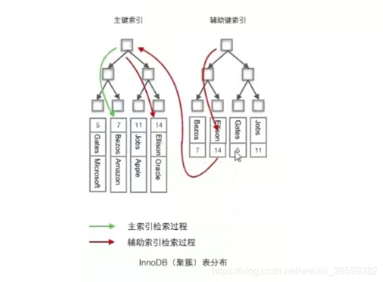
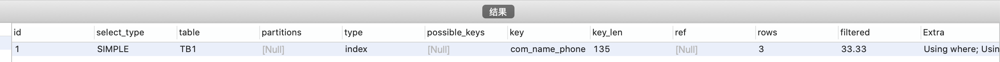
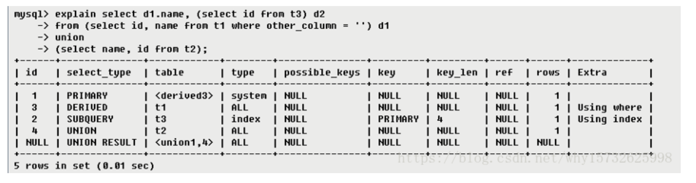
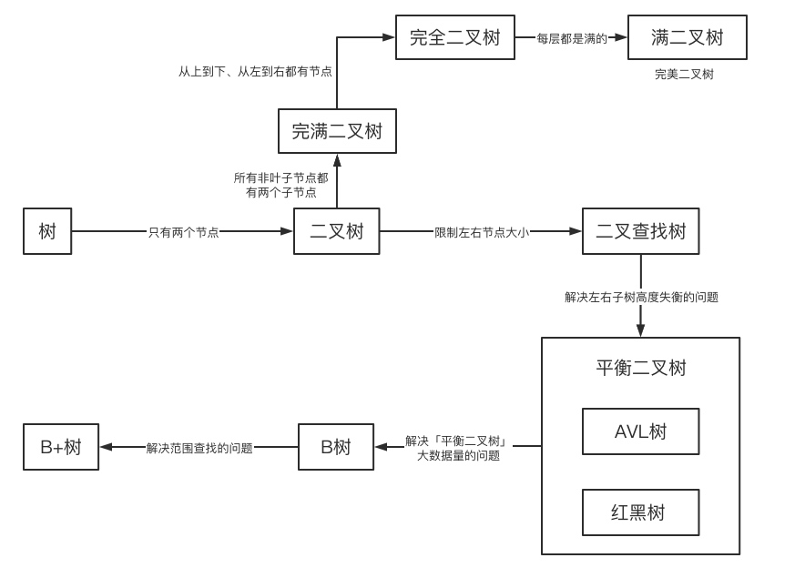
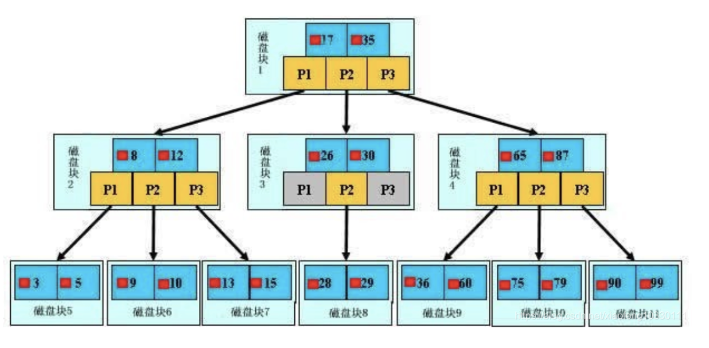

# MySQL

[MySQL官方参考手册](https://dev.mysql.com/doc/refman/5.7/en/)

| MySQL数据库知识汇总                  | MySQL数据库知识汇总                                          |
| ------------------------------------ | ------------------------------------------------------------ |
| MySQL学习笔记一索引                  | [MySQL学习笔记一索引](https://blog.csdn.net/weixin_39559282/article/details/115075213) |
| 数据库性能优化                       | [数据库性能优化](https://blog.csdn.net/weixin_39559282/article/details/115284142) |
| 执行流程、数据库架构、磁盘与内存结构 | 执行流程、数据库架构、磁盘与内存结构                         |
| 数据事务                             | [数据事务](https://blog.csdn.net/weixin_39559282/article/details/116159057) |
| MySQL中Explain                       | [MySQL中Explain](https://blog.csdn.net/weixin_39559282/article/details/116561659) |

## 一、为什么要使用数据库？

* 数据可以永久保存；使用SQL语句查询修改效率高；管理数据方便。

## 二、数据库三大范式：

* 范式1：每一列都不可再分； 
* 范式2：在范式1的基础上，非主键列完全依赖主键，不是依赖主键的一部分；
* 范式3：在范式2的基础上，非主键完全依赖于主键不能依赖于其他非主键。

## 三、MySQL数据库索引：

### 1、什么是索引：

数据库索引，是数据库管理系统(DBMS)中一个排序的数据结构，以协助快速查询、 更新数据库表中数据。

### 2、索引的作用：

数据是以文件的形式存放在磁盘上面的，每一条数据都有它的磁盘地址，如果没有索引要从百万行数据中检索一条数据，只能依次遍历全部数据直至找到。有了索引只需在索引里面检索这条数据就行。索引是一种专门用来检索的数据结构，我们找到数据存放的磁盘地址以后就可以拿到数据。（就像我们在从现代汉语大词典中查找某个成语一样不能能从第一页翻到最后去找，会根据拼音或偏旁去找。索引可以理解为书的目录或排序规则。）

### 3、如何创建索引：

* 方式1：建表时候创建索引
```sql
	CREATE TABLE `user` (
	  `id` int(255) NOT NULL AUTO_INCREMENT COMMENT '用户ID',
	  `code` varchar(255) DEFAULT NULL COMMENT '用户编号',
	  `name` varchar(255) NOT NULL COMMENT '用户姓名',
	  `password` varchar(255) DEFAULT NULL COMMENT '用户密码',
	  `grade` int(255) DEFAULT NULL COMMENT '用户等级',
	  PRIMARY KEY (`id`) USING BTREE,
	  UNIQUE KEY `code` (`code`) USING BTREE,
	  key index_name (`name`) 	
	) ENGINE=InnoDB AUTO_INCREMENT=8 DEFAULT CHARSET=utf8mb4 ROW_FORMAT=DYNAMIC
```
* 方式2：  
```sql
ALTER TABLE user ADD INDEX index_name (name);
```
* 方式3：
```sql
CREATE INDEX index_name ON user (name);
```
### 4、索引的优缺点：

* 优点：
	* 可以大大加快检索的速度；
	* 通过使用索引可以在查询过程中使用优化隐藏器提升系统性能。
* 缺点
	*  创建和维护索引需要消耗时间。增删改的时候索引需要动态维护会降低执行的效率。
### 索引类型：
在 InnoDB 里面，索引类型有三种，普通索引(Normal)、`唯一索引(主键索引是特殊的唯一 索引 Unique)`、全文索引(Fulltext)。

Myisam和Innodb（5.7）均支持Fulltext索引。(MySQL 中的全文索引，有两个变量，最小搜索长度和最大搜索长度，对于长度小于最小搜索长度和大于最大搜索长度的词语，都不会被索引。通俗点就是说，想对一个词语使用全文索引搜索，那么这个词语的长度必须在以上两个变量的区间内。)
```sql
select * from user where match(name) against('张'); #字段长度需要在某一范围方可生效 
```
>// MyISAM
>最小搜索长度：ft_min_word_len = 4;
>最大搜索长度：ft_max_word_len = 84;
>// InnoDB
>innodb_ft_min_token_size = 3;
>innodb_ft_max_token_size = 84;

## 四、InnoDB 逻辑存储结构

[MySQL官方文档](https://dev.mysql.com/doc/refman/5.7/en/innodb-disk-management.html)
[14.12.2文件空间管理](https://dev.mysql.com/doc/refman/5.7/en/innodb-file-space.html)
MySQL 的存储结构分为 5 级:表空间、段、簇、页、行。

* 表空间：
表空间可以看做是 InnoDB 存储引擎逻辑结构的 最高层，所有的数据都存放在表空间中。分为:系统表空间、独占表空间、通用表空间、 临时表空间、Undo 表空间。
* 段 segment：
表空间是由段组成，常见段有数据段、索引段、回滚段等，段是一个逻辑 的概念。一个 ibd 文件(独立表空间文件)里面会由很多个段组成。创建一个索引会创建两个段，一个是索引段，一个是数据段。（索引段管理非叶子节点的数据，数据段管理叶子节点的数据。）
* 簇
簇（区）每个区的大小为1M（1M/16k=64个连续的页）。一个表空间有2^3个页，每页默认大小为16k，一个表空间最多可以存64T的数据。
* 页
* 行

## 五、索引存储模型的推演过程

有序数组（利于查询不利于修改）--》二叉查找树（左小右大、可能会出现链化）--》平衡二叉树（左右子树深度绝对值不能超过1、左旋右旋）--》B+树（分叉数去减少树深度）

### 1、平衡二叉树到B+树的推演

* 当我们用树结构存储索引的时候，访问一个节点就要和磁盘进行一次IO，InNoDB操作数磁盘的最小单位就是页，大小为16k（16384字节）。一个树的节点就是16k的大小，如果一个节点只存储一个键值+数据+引用，可能大小只有十几字节或几十字节，远远达不到16k容量大小，此时导致浪费大量的空间。如果每个节点的数据都很少，从索引找到我们要的数据就需要索引大量的数据，进行大量的IO。机械硬盘时代每次从磁盘读取数据需要10ms左右的寻址时间，交互次数越多，消耗的时间越多。
* 如上问题的解决方法：	
	*  	每个节点存储更多的数据
	* 节点上关键字数量越多，指针越多，意味着有更多的分叉
	* 分叉越多，树的深度就会减少，二叉树就从高高瘦瘦变得矮矮胖胖。（多路）

### 2、MySQL数据库为什么不用B tree，而是选择B+ tree

* B+tree是在BTree的基础上的一种优化，使其更适合实现外存储的索引结构
* BTree的每个节点不仅包含数据的key值，还有data的值。而每一页存储空间是有限的，如果data的数据较大的话会导致每个节点（每页）存储的存储的key值较少，当存储数据量很大的话会导致树的深度较大，也即会增大磁盘的IO次数，进而影响查询的效率。
* B+Tree所有数据记录都是按照键值的大小存储在叶子节点上，而非叶子节点只存储key值，这样大大加大每一页的存储数量，同时降低B+Tree的深度。因此树从`高高瘦瘦，变得矮矮胖胖`。虽然变丑了但是查询效率起来了。`胖子是潜力股。`
* 最关键的是因为mysql场景里，有很多例如: score > 90 and score< 120 范围查询。
  而B+树这种数据结构能更好满足这种范围查询输出。（叶子节点存放数据，同时叶子节点有指向相邻叶子节点的指针）

###  3、MySQL数据库为什么不用红黑树

* 在大规模数据存储的时候，红黑树往往出现由于树的深度过大而导致磁盘IO读写频繁，进而导致效率底下，。

### 4、B+树的特点：

* 关键字的数量更路数相同；
* B+树的根节点和枝节点不存放数据，只在叶子节点存储数据；（树的深度为2时可存储两千万左右的数据）
* 每个叶子节点会增加一个指向相邻叶子节点的指针，它的最后一个数据会指向下一个叶子节点的第一个数据（双向链表结构）；
* 左闭右开 [) 的区间。

### 4、InnoDB中B+树的特点：

* Btree的变种，B+ 树能解决的问题都能解决；（每个节点存储更多的数据，路数更多）
* 扫库、扫表的能力强（如果需要全表扫描，不需要遍历整棵树，仅需要遍历叶子节点就可以拿到所以数据）
* B+树的磁盘读写能力比Btree更强（根节点和枝节点不存储数据，所以一个节点能存储更多的关键字，一次磁盘加载的关键字更多）
* 排序能力更强（叶子节点上有下一个数据区的指针，数据形成链表）
* 效率更稳点（所有的数据在叶子节点，IO的次数相同）

##   六、Hash索引

### 1、什么是hash索引：

* hash是以KV的形式检索数据，	它会根据索引字段生成哈希码和指针，指针指向数据。

### 2、哈希索引的特点

* 它的时间复杂度为O(1)，查询速度比较快。因为hash索引里面的数据不是顺序存储的，所以不能用于排序；
* 在查询的时候根据键值计算哈希码，它只能支持等值查询(= IN )，不支持范围查询(>, <, >=, <=, between and )。
* 如果字段重复很多的话会出现大量的哈希冲突。

### 3、哈希索引在InnoDB中的使用。

* INNODB只支持显示创建B+Tree索引，对于一些热点数据页，InNoDB会自动创建自适应索引，也就是在B+树的基础上，创建Hash索引，此过程是隐式的。

## 七、Mysql数据存储文件

* 每张Innodb有两个文件：.frm 和 .ibd
* Myisam 的表有三个文件：.frm、.MYD、.MYI 
* .frm是MySQL表结构的定义文件，无论何存储引擎都会生成。

### 1、MyISAM

#### MyISAM文件解析

* .MYD文件D代表Data，是MyISAM的数据文件存放记录数据。
* .MYI文件I代表Index，是MyIASM的索引文件，存放的是索引。
#### MyISAM查找数据的过程：
* 由于MyIASM的B+Tree里面叶子节点存储的是数据文件对应的磁盘地址。所以从索引文件.MYI中找到键值后，会在数据文件.MYD中取出响应的数据记录。
* 对主键索引和辅助索引检索的方式都是一样的。

### 2、InnoDB

#### InnoDB查找数据的过程
* InnnoDB只有一个文件.ibd，它是以`主键为索引`来组织数据的存储的所有的索引文件和数据文件都在.ibd文件中。
* 主键索引的叶子节点上直接存储的是数据。	
#### 思考：树的高度为3时，要进行几次磁盘IO？
* 1-3次：（顶层是常驻内存的）,但是为什么还是会有三次呢？
* 3次出现的原因在于，当主键索引时，3层最多是2次，但是当非主键索引时，会出现回表的可能。
#### 思考：深度为3的B+Tree可以存储多少数据？

INnoDB存储引擎中页大小为16KB，一般表的主键为int类型（占4个字节）或bigint（占8个字节），指针类型一般也是4~8个字节，也即是一页（B+Tree的一个节点）中大概可以存储（16KB/(8+8B)=1K个键值。当深度为3层时候，可存储1024*1024*1024=10亿个数据。实际上有的节点不一定会被填满，另外还有数据可能也不止那么多，但是千万级别还是可以达到的。因此，B+Tree树的深度，一般在`2~4层就足够了`

#### 聚簇索引（聚集索引）和非聚集索引？
* 将数据存储与索引放到了一起，索引结构的叶子节点保存了行数据（聚集索引）。
* 将数据与索引分开存储索引结构的叶子节点指向了数据对应的位置。
注： 在InnoDB中在聚簇索引之上建立的索引称为辅助索引，非聚簇索引都是辅助索引，像复合索引、前缀索引、唯一索引，辅助索引的叶子节点存储的不再是行的物理位置，而是主键值，辅助索引在访问数据库总是需要二次查找。

* Innodb中组织数据的方式叫做聚集索引（主键索引叫聚集索引，非主键都是非聚集索引）
* InnoDB中主键是这样存储的那除了主键之外的索引，如name上建立了普通索引，检索和存储的方式？
 InNoDB中主键索引和辅助索引是有主次之分的。
* 辅助索引存储的是辅助索引和主键值。如果根据辅助索引查询，会根据主键值在主键索引中去查询，最终取得数据。（例：通过name辅助索引查询name=“张三”，它会在叶子节点上找到主键值，即id=1，然后再到主键索引的叶子节点拿到数据）

#### 思考1：为什么辅助索引中存的是主键值而不是主键的的磁盘地址？

>B Tree 实现一个节点存储多个关键字，保持平衡，是由于分叉和合并的操作存在（增删改查的存在），此时的地址值是会变化的，因此辅助索引中存储的是主键值。

#### 思考2：如果一张表中没有主键？
>如果定义了primary key ，则InNoDB会选择主键作为聚集索引；
>如果没有显示的定义主键，则InnoDB会选择一个不为空的值为唯一索引作为主键；
>如果也没有不为空的值，则会选择内置6字节长度的RowID作为隐藏的聚集索引，随着行记录的写入而主键递增。

### MyISAM和InnoDB索引的区别：

* 每张InnoDB表中有两个文件（.frm和.idb）,MyISAM的表有三个文件（.frm、.MYD、MYI）。InnoDB数据和索引在一个文件中；MyISAM数据文件和索引文件是分开的。
* MyISAM的B+树里面，叶子节点存储的是数据文件对应的磁盘地址，所以从索引文件MYI中找到键值后，会到数据文件MYD中获取对应的数据记录（也即是，辅助索引和主键索引存储和检索数据的方式没有任何区别，一样是在索引文件里找到到磁盘地址，然后到数据文件中获取数据）；
* InnoDB是以主键为索引来组织数据的存储，所以索引文件和数据文件在一个文件中。主键索引的叶子节点上直接存储着数据。InNoDB主键索引和辅助索引是有一个主次之分的。辅助索引存储的是辅助索引和主键值。如果使用辅助索引查询，会根据主键值在主键索引中查询，最终取得数据。

## 八、索引使用原则

###  1、列的离散度

* 离散度公式：count(distinct(column_name)):count(*) --(列的全部不同值和所有数据行的比例，数据行相同时，分子越大，离散度越大。)【重复越少，离散度越大】
	* 在name上和gender上建立索引的区别，在于离散度的大小。（`离散度越大越有利于索引的检索`） 

### 2、联合索引的最左匹配（最左包含）原则

* 原则1：最左匹配原则（最左包含）。
* 原则2：MySQL存储引擎为了在查询时候使用到索引，在查询过程中动态调整字段顺序，以便更好的使用到索引。

#### 创建联合索引

```sql
alter table drop index com_name_phone;
alter table add index  com_name_phone(name,phone);
```
* 联合索引在B+树中是复合的数据结构，它按照从左到右的顺序建立索引树，（name在左，phone在右。）如上联合索引，name是有序的，phone是无序的，只有当name相同时，phone才有序。
* 此时，如果查询语句是`select * from user where phone ="xxx";` 则不会用到联合索引。
#### 联合索引的命中(最左匹配原则【最左包含】)


```sql
drop table  if exists TB1 ;
create table TB1(
id int primary key auto_increment,
name varchar(32) ,
phone varchar(11) 
);
alter table TB1 add index com_name_phone(name,phone);
insert  into TB1 (name,phone) values("张三","33333333333"),
("李四","44444444444"),("王五","55555555555");
```
* 使用到联合索引
```sql
explain select * from TB1 where name ="张三" 
and phone ="33333333333";
```

* 使用到联合索引
```sql
explain select * from TB1 where name ="张三";
```

* 未使用到联合索引
```sql
explain select * from TB1 where phone ="33333333333";
```

注：

>当我们创建索引index(a,b,c)；
>相当于是常见了三个索引index(a),index(a,b),index(a,b,c);
>查询时出现 where b=?和where b=? and where c=?和where  c =?
>是不会用到索引的。

**例：**

```sql
create table test(
id int primary key auto_increment,
name varchar(32) not null,
age int(3) not null default 0,
addr varchar(64),
key(name,age,addr)
);
insert into test(name,age,addr)values("张三",33,"北京西城"),("李四",44,"北京东城"); 
show index from test;
explain select * from test where name ="张三" and  age=33 and addr ="北京西城"; #用到
explain select * from test where name ="张三"; #用到
explain select * from test where name ="张三" and addr ="北京西城"; #用到
explain select * from test where age=33 and addr ="北京西城" and name ="张三"; #用到
explain select * from test where age=33 and addr ="北京西城"; #未用到
```


## 九、索引的创建

###  1、索引创建注意事项：

* 在用于where判断、order by 排序、join on等字段上创建索引
* 索引个数不能过多。（浪费空间，修改时变慢）
* 区分度低的字段（如：性别）不要创建索引。（离散度越高，越有利于索引检索）
* 更新频繁的值不要作为主键或索引。（页分裂）
* 组合索引将区分度高的字段放在前面。
* 创建组合索引，（利用索引命中的最左原则）

### 2、什么情况下用不到索引？

* 索引列上使用函数（replace、substr、concat、sum count avg）表达式、计算（+-*/）
* 字符串类型不加引号会出现隐式转换
* like条件中前面加% 。
* 负向查询，not like不可以、!= (<>) not in 在某些情况下可以。
* 查询语句中使用多列索引，只有在查询条件中使用到了第一个字段，索引才会生效。
* 查询语句中使用or关键字。如果or前后两个条件都是索引，那么查询才会用到索引。如果or前后有一个条件不是索引，那么查询将不会用到索引。

##  十、Explain执行计划：

### 1、Explain介绍：

使用EXPLAIN关键字可以模拟优化器执行SQL查询语句，从而知道MySQL是如何处理你的SQL语句的。分析你的查询语句或是表结构的性能瓶颈。

###  2、通过Explain能分析什么？

* 表的读取顺序
* 数据读取操作的操作类型
* 哪些索引可以使用
* 哪些索引被实际使用
* 表之间的引用
* 每张表有多少行被优化器查询

### 3、Explain如何使用？

*  Explain + SQL语句

### 4、各字段的含义？


#### 1、各字段的含义？

| 信息                        | 描述                                                         |
| --------------------------- | ------------------------------------------------------------ |
| id                          | 查询的序号，包含一组数字，表示查询中执行select子句或操作表的顺序<br/>**两种情况**<br/>id相同，执行顺序`从上往下`（小表驱动大表）<br/>id不同，id值越大，优先级越高，越先执行(`先大后小`) |
| select_type<br>（查询类型） | 查询类型，主要用于区别普通查询，联合查询，子查询等的复杂查询<br/>1、simple ——`简单的select查询`，查询中不包含子查询或者UNION<br/>2、primary ——查询中若`包含任何复杂的子部分`，最外层查询被标记<br/>3、subquery——在select或where列表中包含了子查询<br/>4、derived——在from列表中包含的`子查询被标记为derived（衍生）`，MySQL会递归执行这些子查询，把结果放到临时表中<br/>5、union——如果第二个select出现在UNION之后，则被标记为UNION，如果union包含在from子句的子查询中，外层select被标记为derived<br/>6、union result:UNION 的结果<br/> |
| table                       | 输出的行所引用的表                                           |
| type                        | 显示联结类型，显示查询使用了何种类型，按照从最佳到最坏类型排序<br/>1、`system`：表中仅有一行（等于系统表）这是const联结类型的一个特例。<br/>2、`const`：表示通过索引一次就找到，const用于比较primary key或者unique索引。因为只匹配一行数据，所以如果将主键置于where列表中，mysql能将该查询转换为一个常量<br/>3、`eq_ref`:唯一性索引扫描，对于每个索引键，表中只有一条记录与之匹配。常见于唯一索引或者主键扫描<br/>4、`ref`:非唯一性索引扫描，返回匹配某个单独值的所有行，本质上也是一种索引访问，它返回所有匹配某个单独值的行，可能会找多个符合条件的行，属于查找和扫描的混合体<br/>5、`range`:只检索给定范围的行，使用一个索引来选择行。key列显示使用了哪个索引，一般就是where语句中出现了between，> , < , in等范围的查询。这种范围扫描索引扫描比全表扫描要好，因为它开始于索引的某一个点，而结束另一个点，不用全表扫描<br/>6、index: `index 与all区别为index类型只遍历索引树`。通常比all快，因为索引文件比数据文件小很多。<br/>7、all：遍历全表以找到匹配的行<br/>==注意:一般保证查询至少达到`range`级别，最好能达到ref。==<br/>从最好到最差：`system > const > eq_ref > ref > range > index > all` |
| possible_keys               | 指出MySQL能使用哪个索引在该表中找到行                        |
| key                         | 显示MySQL实际决定使用的键(索引)。如果没有选择索引,键是NULL。查询中如果使用覆盖索引，则该索引和查询的select字段重叠。 |
| key_len                     | 表示索引中使用的字节数，该列计算查询中使用的索引的长度在`不损失精度的情况下，长度越短越好`。如果键是NULL,则长度为NULL。该字段显示为索引字段的最大可能长度，并非实际使用长度。 |
| ref                         | `显示索引的哪一列被使用了`，如果有可能是一个常数，哪些列或常量被用于查询索引列上的值 |
| rows                        | 根据表统计信息以及索引选用情况，大致估算出找到所需的记录所需要读取的行数 |
| Extra                       | 包含不适合在其他列中显示，但是十分重要的额外信息<br/>1、Using filesort：说明mysql会对数据适用一个外部的索引排序。而不是按照表内的索引顺序进行读取。MySQL中无法利用索引完成排序操作称为“文件排序”<br/>2、Using temporary:使用了临时表保存中间结果，mysql在查询结果排序时使用临时表。常见于排序order by和分组查询group by。<br/>3、`Using index`:表示相应的select操作用使用覆盖索引，避免访问了表的数据行。如果同时出现using where，表名索引被用来执行索引键值的查找；如果没有同时出现using where，表明索引用来读取数据而非执行查询动作。<br/>4、Using where :表明使用where过滤<br/>5、using join buffer:使用了连接缓存<br/>6、impossible where:where子句的值总是false，不能用来获取任何元组（SELECT * FROM t_user WHERE id = '1' and id = '2'）<br/>7、select tables optimized away：在没有group by子句的情况下，基于索引优化Min、max操作或者对于MyISAM存储引擎优化count（*），不必等到执行阶段再进行计算，查询执行计划生成的阶段即完成优化。<br/>8、distinct：优化distinct操作，在找到第一匹配的元组后即停止找同样值的动作。 |

#### 案例分析：



执行顺序1：select_type为UNION，说明第四个select是UNION里的第二个select，最先执行【select name,id from t2】
执行顺序2：id为3，是整个查询中第三个select的一部分。因查询包含在from中，所以为DERIVED【select id,name from t1 where other_column=’’】
执行顺序3：select列表中的子查询select_type为subquery,为整个查询中的第二个select【select id from t3】
执行顺序4：id列为1，表示是UNION里的第一个select，select_type列的primary表示该查询为外层查询，table列被标记为<derived3>,表示查询结果来自一个衍生表，其中derived3中的3代表该查询衍生自第三个select查询，即id为3的select。【select d1.name …】
执行顺序5：代表从UNION的临时表中读取行的阶段，table列的< union1,4 >表示用第一个和第四个select的结果进行UNION操作。【两个结果union操作】


### 5、SQL执行顺序

想要优化SQL，必须清楚知道SQL的执行顺序，这样再配合explain才能事半功倍！ 

#### 1、完整SQL语句

>select distinct 
>        <select_list>
>from
>    <left_table><join_type>
>join <right_table> on <join_condition>
>where
>    <where_condition>
>group by
>    <group_by_list>
>having
>    <having_condition>
>order by
>    <order_by_condition>
>limit <limit number>

####  2、SQL执行顺序

>1、from <left_table><join_type>
>2、on <join_condition>
>3、<join_type> join <right_table>
>4、where <where_condition>
>5、group by <group_by_list>
>6、having <having_condition>
>7、select
>8、distinct <select_list>
>9、order by <order_by_condition>
>10、limit <limit_number>


## B树和B+树

为什么B+树，而不是平衡二叉树，红黑树？
单纯从性能速度上看，平衡二叉树（这里暂时不展开各种数据结构）查找效率高于B+树。为什么不用了？

核心原因是受限于磁盘i/o读取速度。mysql一般用于存储比较大的数据，使用的都是机械硬盘。机械硬盘一次数据读取的时间是毫秒级的，和内存读取远远不在一个量级。
如果使用二叉树这种多层级结构，会导致磁盘的多次读取，每读取下一层数据，都是一次磁盘重新寻址。
所以B树，B+树 这种多叉树的优势有体现出来了。一个4层的B+树，基本能覆盖上亿数据的查找。

平衡二叉树的查找效率是非常高的，并可以通过降低树的深度来提高查找的效率。但是当数据量非常大，树的存储的元素数量是有限的，这样会导致二叉查找树结构由于树的深度过大而造成磁盘 I/O 读写过于频繁，进而导致查询效率低下。

而 B 树的出现是为了解决这个问题，其可以一次性读入许多数据。一个节点不再只是存储一个数值，而是存储一个分片的数据。这样就可以避免频繁去读取磁盘数据，造成频繁的 IO 访问，造成查找速度瓶颈。

### B树

B-Tree 其实就是 B 树，很多人都会说成 B 减树，其实是错的，要注意。

**B 树不要和二叉树混淆，B 树不是二叉树，而是一种自平衡树数据结构。** 它维护有序数据并允许以对数时间进行搜索，顺序访问，插入和删除。B 树是二叉搜索树的一般化，因为 B 树的节点可以有两个以上的子节点。

与其他自平衡二进制搜索树不同，B 树非常适合读取和写入相对较大的数据块（如光盘）的存储系统。它通常用于数据库和文件系统，例如 mysql 的 InnoDB 引擎使用的数据结构就是 B 树的变形 B+ 树。

B 树是一种平衡的多分树，通常我们说 m 阶的 B 树，它必须满足如下条件：

- 每个节点最多只有 m 个子节点。
- 每个非叶子节点（除了根）具有至少 ⌈m/2⌉ 子节点。
- 如果根不是叶节点，则根至少有两个子节点。
- 具有 k 个子节点的非叶节点包含 k -1 个键。
- 所有叶子都出现在同一水平，没有任何信息（高度一致）。


B 树的阶，指的是 B 树中节点的子节点数目的最大值。例如在上图的书中，「13,16,19」拥有的子节点数目最多，一共有四个子节点（灰色节点）。所以该 B 树的阶为 4，该树称为 4 阶 B 树。在实际应用中，B 树应用于 MongoDb 的索引。

### B+树

B+ 树是应文件系统所需而产生的 B 树的变形树。B+ 树的特征：

- 有 m 个子树的中间节点包含有 m 个元素（B 树中是 k-1 个元素），每个元素不保存数据，只用来索引。
- 所有的叶子结点中包含了全部关键字的信息，及指向含有这些关键字记录的指针，且叶子结点本身依关键字的大小自小而大的顺序链接。而 B 树的叶子节点并没有包括全部需要查找的信息。
- 所有的非终端结点可以看成是索引部分，结点中仅含有其子树根结点中最大（或最小）关键字。而 B 树的非终节点也包含需要查找的有效信息。例如下图中的根节点 8 是左子树中最大的元素，15 是右子树中最大的元素。


与 B 树相比，B+ 树有着如下的好处：

1. B+ 树的磁盘读写代价更低

B+ 树的内部结点并没有指向关键字具体信息的指针，所以其内部结点相对 B 树更小。如果把所有同一内部结点的关键字存放在同一盘块中，那么盘块所能容纳的关键字数量也越多，所以一次性读入内存中的需要查找的关键字也就越多。相对来说 IO 读写次数也就降低了，查找速度就更快了。

1. B+ 树查询效率更加稳定

由于非终结点并不是最终指向文件内容的结点，而只是叶子结点中关键字的索引。所以 B+ 树中任何关键字的查找必须走一条从根结点到叶子结点的路。所有关键字查询的路径长度相同，导致每一个数据的查询效率相当。而对于 B 树来说，因为其每个节点都存具体的数据，因此其查询速度可能更快，但是却并不稳定。

1. B+ 树便于范围查询（最重要的原因，范围查找是数据库的常态）

B 树在提高了 IO 性能的同时，并没有解决元素遍历效率低下的问题。为了解决这个问题，B+ 树应用而生。B+ 树只需要去遍历叶子节点就可以实现整棵树的遍历。在数据库中基于范围的查询是非常频繁的，因此 MySQL 的 Innodb 引擎就使用了 B+ 树作为其索引的数据结构。

### B和B+树核心区别

B+跟B树不同B+树的非叶子节点不保存关键字记录的指针，只进行数据索引，这样使得B+树每个非叶子节点所能保存的关键字大大增加；

B+树的信息全部在叶子节点上，非叶子节点都是指针信息。
B树的中间节点会存数据信息。
在查找时，B+树每次都需要查询到叶子节点，B树可能第一层查询到就结束了。这个也就是为什么说查找单个节点，B+树查询会更稳定，B树查询可能会更快的原因。

### B和B+树的查询性能

B+ 树的中间节点不含有实际数据，只有子树的最大数据和子树指针，因此磁盘页中可以容纳更多节点元素。但是每次必须查询到叶子节点。

B树，不用每次查询到叶子节点，所以少几次磁盘的i/o

所以没有最好的数据结构，只有最适合的场景。

### 总结

B 树是为了解决大数据量的查找问题而诞生的，其实二叉搜索树的一般化。通过每个节点存储更多的数据，使得 B 树比起二叉搜索树更加扁平化，从而减少 IO 读取频次，提高搜索速度。

B+ 树比起 B 树，最大的差异是非叶子节点不再存储具体数据，以及叶子节点是链表结构。非叶子节点不再存储具体数据，这使得 B+ 树更加扁平化，查找效率更高。叶子节点是链表结构，这使得 B+ 树更适合用在范围查找的场景中。

学到这里，我们的树结构大道基本上学完了，来整体温习一下吧。




# 面试

###  MySQL中 in是否能用到索引？

### 1、事务的基本要素

数据库事务(Transanction)正确执行的四个基本要素：

**原子性（Atomicity）**：事务开始后所有操作，要么全部完成，要么全部不完成，不可能停滞在中间环节。事务执行过程中出错，会回滚（Rollback）到事务开始前的状态，所有的操作就像没有发生一样。也就是说事务是一个不可分割的整体，就像化学中学过的原子，是物质构成的基本单位
**一致性（Consistency）**：事务开始前和结束后，数据库的完整性约束没有被破坏 。比如A向B转账，不可能A扣了钱，B却没收到
**隔离性（Isolation**）：同一时间，只允许一个事务请求同一数据，不同的事务之间彼此没有任何干扰。比如A正在从一张银行卡中取钱，在A取钱的过程结束前，B不能向这张卡转账
**持久性（Durability）**：事务完成后，该事务所对数据库所作的更改将被保存到数据库之中，不能回滚

### 2.事务隔离级别

**前提知识：事务的并发问题**

**脏读**：事务A读取了事务B更新的数据，然后B回滚操作，那么A读取到的数据是脏数据
**不可重复读**：事务A多次读取同一数据，事务B在事务A多次读取的过程中，对数据作了更新并提交，导致事务A多次读取同一数据时，结果不一致。
**幻读**：A事务读取了B事务已经提交的新增数据。注意和不可重复读的区别，这里是新增，不可重复读是更改（或删除）。select某记录是否存在，不存在，准备插入此记录，但执行 insert 时发现此记录已存在，无法插入，此时就发生了幻读。
结：不可重复读的和幻读很容易混淆，**不可重复读侧重于修改，幻读侧重于新增或删除**。解决不可重复读的问题只需锁住满足条件的行，解决幻读需要锁表。

#### 隔离级别

事务的隔离级别分为：**未提交读(read uncommitted)、已提交读(read committed)、可重复读(repeatable read)、串行化(serializable)**。

未提交读：A事务已执行，但未提交；B事务查询到A事务的更新后数据；A事务回滚；---出现脏数据
已提交读：A事务执行更新；B事务查询；A事务又执行更新；B事务再次查询时，前后两次数据不一致；---不可重复读（Oracle默认的隔离级别）
可重复读：A事务无论执行多少次，只要不提交，B事务查询值都不变；B事务仅查询B事务开始时那一瞬间的数据快照；（MySQL默认隔离级别）
串行化：不允许读写并发操作，写执行时，读必须等待；

| 事务隔离级别                 | 脏读 | 不可重复读 | 幻读 |
| ---------------------------- | :--- | ---------- | ---- |
| 读未提交（read-uncommitted） | 是   | 是         | 是   |
| 不可重复读（read-committed） | 否   | 是         | 是   |
| 可重复读（repeatable-read）  | 否   | 否         | 是   |
| 串行化（serializable）       | 否   | 否         | 否   |

在MySQL可重复读的隔离级别中并不是完全解决了幻读的问题，而是解决了读数据情况下的幻读问题。而对于修改的操作依旧存在幻读问题，就是说MVCC对于幻读的解决是不彻底的。 **通过索引加锁，间隙锁，next key lock可以解决幻读的问题**。

### 3.如何解决事务的并发问题(脏读，幻读)

注意：要想解决脏读、不可重复读、幻读等读现象，那么就需要提高事务的隔离级别。但与此同时，事务的隔离级别越高，并发能力也就越低。

为了解决上述问题，数据库通过锁机制解决并发访问的问题。

* 根据锁定对象不同：分为行级锁和表级锁；
* 根据并发事务锁定的关系上看：分为共享锁定和独占锁定，共享锁定会防止独占锁定但允许其他的共享锁定。而独占锁定既防止共享锁定也防止其他独占锁定。为了更改数据，数据库必须在进行更改的行上施加行独占锁定，insert、update、delete和select for update语句都会隐式采用必要的行锁定。

但是直接使用锁机制管理是很复杂的，基于锁机制，数据库给用户提供了不同的事务隔离级别。

#### 脏读的表现和具体解决并发问题

一个事务读取到了另外一个事务没有提交的数据。

详细解释：脏读就是指:当一个事务正在访问数据，并且对数据进行了修改，而这种修改还没有提交到数据库中，这时，另外一个事务也访问这个数据，然后使用了这个数据。因为这个数据是还没有提交的数据，那么另外一个事务读到的这个数据是脏数据，依据脏数据所做的操作可能是不正确的。

**解决：**

**修改时加排他锁，直到事务提交后才释放；**

读取时加共享锁，读取完释放事务1读取数据时加上共享锁后（这样在事务1读取数据的过程中，其他事务就不会修改该数据），不允许任何事物操作该数据，只能读取，之后1如果有更新操作，那么会转换为排他锁，其他事务更无权参与进来读写，这样就防止了脏读问题。

但是当事务1读取数据过程中，有可能其他事务也读取了该数据，读取完毕后共享锁释放，此时事务1修改数据，修改完毕提交事务，其他事务再次读取数据时候发现数据不一致，就会出现不可重复读问题，所以这样不能够避免不可重复读问题。

#### 不可重复读/ 幻读 的表现和具体解决并发问题

**不可重复读**：在同一事务中，两次读取同一数据，得到内容不同

**幻读**：同一事务中，用同样的操作读取两次，得到的记录数不相同

解决：

**读取数据时加共享锁，写数据时加排他锁，都是事务提交才释放锁**。读取时候不允许其他事物修改该数据，不管数据在事务过程中读取多少次，数据都是一致的，避免了不可重复读问题

### 4.MVCC多版本并发控制

MVCC的全称就是`多版本并发控制`。这项技术使得InnoDB的事务隔离级别下执行一致性读操作有了保证。换言之，为了查询在一些正在被另外一个事务更新的行，并且可以看到它们被更新之前的值。这是一个可以用来增强并发性的强大技术，因为这样一来的话查询就不用等待另一个事务释放锁。这项技术在数据库领域并不是普遍使用的。MVVC最大的好处是:`读不加锁，读写不冲突`。在读多写少的应用中，读写不冲突非常重要，极大的增加了系统的并发性。InnoDB使用的是行锁，并且采用了多版本并发控制来提高读操作的性能。

#### 什么是多版本并发控制呢？

其实就是在每一行记录的后面增加了两个隐藏列，记录创建版本号和删除版本号。而每一个事务开启的时候，都会有唯一的递增版本号，被操作的数据会生成一条新的数据行（临时），但是在提交前对其他事务是不可见的，对于数据的更新（包括增删改）操作成功，会将这个版本号更新到数据的行中，事务提交成功，将新的版本号更新到此数据行中。这样保证了每个事务操作的数据，都是互不影响，也不存在锁的问题。

#### InnoDB的MVCC实现机制

MVCC可以认为是`行级锁`的一个变种，它可以在很多情况下避免加锁操作，因此开销更低。MVCC的实现大都都实现了非阻塞的读操作，写操作也只锁定必要的行。InnoDB的MVCC实现，是通过保存数据在某个时间点的快照来实现的。一个事务，不管其执行多长时间，其内部看到的数据是一致的，也就是事务在执行的过程中不会相互影响。

#### 简述一下MVCC在InnoDB中的实现：

InnoDB的MVCC，通过在每行记录后面保存两个隐藏的列来实现：一个保存了行的创建时间，一个保存行的过期时间（删除时间），当然，这里的时间并不是时间戳，而是系统版本号，每开始一个新的事务，系统版本号就会递增。在RR隔离级别下，MVCC的操作如下：

* select操作：
  * InnoDB只查找版本早于（包含等于）当前事务版本的数据行。可以确保事务读取的行，要么是事务开始前就已存在，或者事务自身插入或修改的记录。
  * 行的删除版本要么未定义，要么大于当前事务版本号。可以确保事务读取的行，在事务开始之前未删除。
* insert操作：将新插入的行保存当前版本号为行版本号。
* delete操作：将删除的行保存当前版本号为删除标识。
* update操作：变为insert和delete操作的组合，insert的行保存当前版本号为行版本号，delete则保存当前版本号到原来的行作为删除标识。

由于旧数据并不真正的删除，所以必须对这些数据进行清理，innodb会开启一个后台线程执行清理工作，具体的规则是将删除版本号小于当前系统版本的行删除，这个过程叫做purge。

### 5.为什么选择B+树作为索引结构

Inodb存储引擎 默认是 B+Tree索引；MyISAM 存储引擎 默认是Fulltext索引；Memory 存储引擎 默认 Hash索引；

* B树：有序数组+平衡多叉树； 
* B+树：有序数组链表+平衡多叉树；

B+树(叶节点保存数据，其他的节点 全部存放索引)，数据库索引采用B+树的主要原因是B树在提高了磁盘IO性能的同时并没有解决元素遍历的效率低下的问题。正是为了解决这个问题，B+树应运而生。 B+树只要遍历叶子节点就可以实现整棵树的遍历。而且在数据库中基于范围的查询是非常频繁的，而B树不支持这样的操作（或者说效率太低）。

正如上面所说，在数据库中基于范围的查询是非常频繁的，因此MySQL最终选择的索引结构是B+树而不是B树。

#### 注：与其他数据结构的对比：

* Hash索引：Hash索引底层是哈希表，哈希表是一种以key-value存储数据的结构，所以多个数据在存储关系上是完全没有任何顺序关系的，所以，对于区间查询是无法直接通过索引查询的，就需要全表扫描。所以，哈希索引只适用于等值查询的场景。而B+ 树是一种多路平衡查询树，所以他的节点是天然有序的（左子节点小于父节点、父节点小于右子节点），所以对于范围查询的时候不需要做全表扫描

* 二叉查找树：解决了排序的基本问题，但是由于无法保证平衡，可能退化为链表。

* 平衡二叉树：通过旋转解决了平衡的问题，但是旋转操作效率太低。

* 红黑树：通过舍弃严格的平衡和引入红黑节点，解决了 AVL旋转效率过低的问题，但是在磁盘等场景下，树仍然太高，IO次数太多。

* B+树：在B树的基础上，将非叶节点改造为不存储数据纯索引节点，进一步降低了树的高度；此外将叶节点使用指针连接成链表，范围查询更加高效。

## 补充问题：

### 为什么平衡二叉树（或红黑树）不适合作为索引？

索引是存在于索引文件中，是存在于磁盘中的。因为索引通常是很大的，因此无法一次将全部索引加载到内存当中，因此每次只能从磁盘中读取一个磁盘页的数据到内存中。而这个磁盘的读取的速度较内存中的读取速度而言是差了好几个级别。

注意，我们说的平衡二叉树结构，指的是逻辑结构上的平衡二叉树，其物理实现是数组。然后由于在逻辑结构上相近的节点在物理结构上可能会差很远。因此，每次读取的磁盘页的数据中有许多是用不上的。因此，查找过程中要进行许多次的磁盘读取操作。

而适合作为索引的结构应该是尽可能少的执行磁盘IO操作，因为执行磁盘IO操作非常的耗时。因此，平衡二叉树并不适合作为索引结构。B树的查询，主要发生在内存中，而平衡二叉树的查询，则是发生在磁盘读取中。因此，虽然B树查询查询的次数不比平衡二叉树的次数少，但是相比起磁盘IO速度，内存中比较的耗时就可以忽略不计了。

## 补充知识：

### 索引相关原理和知识

详细将查看：https://www.cnblogs.com/aspirant/p/9214485.html

### 一、索引原理

索引的目的在于提高查询效率，与我们查阅图书所用的目录是一个道理：先定位到章，然后定位到该章下的一个小节，然后找到页数。相似的例子还有：查字典，查火车车次，飞机航班等

本质都是：通过不断地缩小想要获取数据的范围来筛选出最终想要的结果，同时把随机的事件变成顺序的事件，也就是说，有了这种索引机制，我们可以总是用同一种查找方式来锁定数据。

索引（Index）是帮助数据库高效获取数据的数据结构。索引是在基于数据库表创建的，它包含一个表中某些列的值以及记录对应的地址，并且把这些值存储在一个数据结构中。最常见的就是使用哈希表、B+树作为索引。

一般的应用系统，读写比例在10:1左右，而且插入操作和一般的更新操作很少出现性能问题，在生产环境中，我们遇到最多的，也是最容易出问题的，还是一些复杂的查询操作，因此对查询语句的优化显然是重中之重。说起加速查询，就不得不提到索引了。

数据库查询是数据库最主要的功能之一。而查询速度当然是越快越好。而当数据量越来越大的时候，查询花费的时间会随之增长。而索引，可以加速数据的查询。因为索引是有序排列的。

### 二、磁盘IO与预读

考虑到磁盘IO是非常高昂的操作，计算机操作系统做了一些优化，当一次IO时，不光把当前磁盘地址的数据，而是把相邻的数据也都读取到内存缓冲区内，因为局部预读性原理告诉我们，当计算机访问一个地址的数据的时候，与其相邻的数据也会很快被访问到。每一次IO读取的数据我们称之为一页(page)。具体一页有多大数据跟操作系统有关，一般为4k或8k，也就是我们读取一页内的数据时候，实际上才发生了一次IO，这个理论对于索引的数据结构设计非常有帮助。

`局部性原理与磁盘预读`：由于存储介质的特性，磁盘本身存取就比主存慢很多，再加上机械运动耗费，磁盘的存取速度往往是主存的几百分分之一，因此为了提高效率，要尽量减少磁盘I/O。为了达到这个目的，磁盘往往不是严格按需读取，而是每次都会预读，即使只需要一个字节，磁盘也会从这个位置开始，顺序向后读取一定长度的数据放入内存。这样做的理论依据是计算机科学中著名的局部性原理： 当一个数据被用到时，其附近的数据也通常会马上被使用。 程序运行期间所需要的数据通常比较集中。 由于磁盘顺序读取的效率很高（不需要寻道时间，只需很少的旋转时间），因此对于具有局部性的程序来说，预读可以提高I/O效率。

### 三、索引的数据结构

任何一种数据结构都不是凭空产生的，一定会有它的背景和使用场景，现在总结一下，我们需要这种数据结构能够做些什么，其实很简单，那就是：每次查找数据时把磁盘IO次数控制在一个很小的数量级，最好是常数数量级。那么我们就想到如果一个高度可控的多路搜索树是否能满足需求呢？就这样，b+树应运而生。



如上图，是一颗b+树，浅蓝色的块我们称之为一个磁盘块，可以看到每个磁盘块包含几个数据项（深蓝色所示）和指针（黄色所示），如磁盘块1包含数据项17和35，包含指针P1、P2、P3，P1表示小于17的磁盘块，P2表示在17和35之间的磁盘块，P3表示大于35的磁盘块。真实的数据存在于叶子节点即3、5、9、10、13、15、28、29、36、60、75、79、90、99。非叶子节点只不存储真实的数据，只存储指引搜索方向的数据项，如17、35并不真实存在于数据表中。

### 四、B+树的查找过程

如图所示，如果要查找数据项29，那么首先会把磁盘块1由磁盘加载到内存，此时发生一次IO，在内存中用二分查找确定29在17和35之间，锁定磁盘块1的P2指针，内存时间因为非常短（相比磁盘的IO）可以忽略不计，通过磁盘块1的P2指针的磁盘地址把磁盘块3由磁盘加载到内存，发生第二次IO，29在26和30之间，锁定磁盘块3的P2指针，通过指针加载磁盘块8到内存，发生第三次IO，同时内存中做二分查找找到29，结束查询，总计三次IO。真实的情况是，3层的b+树可以表示上百万的数据，如果上百万的数据查找只需要三次IO，性能提高将是巨大的，如果没有索引，每个数据项都要发生一次IO，那么总共需要百万次的IO，显然成本非常非常高。

### 五、B+树性质

* 索引字段要尽量的小
  通过上面的分析，我们知道IO次数取决于b+数的高度h，假设当前数据表的数据为N，每个磁盘块的数据项的数量是m，则有h=㏒(m+1)N，当数据量N一定的情况下，m越大，h越小；而m = 磁盘块的大小 / 数据项的大小，磁盘块的大小也就是一个数据页的大小，是固定的，如果数据项占的空间越小，数据项的数量越多，树的高度越低。这就是为什么每个数据项，即索引字段要尽量的小，比如int占4字节，要比bigint8字节少一半。这也是为什么b+树要求把真实的数据放到叶子节点而不是内层节点，一旦放到内层节点，磁盘块的数据项会大幅度下降，导致树增高。当数据项等于1时将会退化成线性表。

* 索引的最左匹配特性（即从左往右匹配）
  当b+树的数据项是复合的数据结构，比如(name,age,sex)的时候，b+数是按照从左到右的顺序来建立搜索树的，比如当(张三,20,F)这样的数据来检索的时候，b+树会优先比较name来确定下一步的所搜方向，如果name相同再依次比较age和sex，最后得到检索的数据；但当(20,F)这样的没有name的数据来的时候，b+树就不知道下一步该查哪个节点，因为建立搜索树的时候name就是第一个比较因子，必须要先根据name来搜索才能知道下一步去哪里查询。比如当(张三,F)这样的数据来检索时，b+树可以用name来指定搜索方向，但下一个字段age的缺失，所以只能把名字等于张三的数据都找到，然后再匹配性别是F的数据了， 这个是非常重要的性质，即索引的最左匹配特性。

这也是经常考察的，比如 我定义了 A,B,C的联合索引，如果 我只传递了 A,B 能走索引吗？答案是能，因为最左侧原理(百度问过) 


## 索引使用注意事项与数据类型选择

### 一、索引使用注意事项

* 不要滥用索引：索引提高查询速度，却会降低更新表的速度，因为更新表时，mysql不仅要更新数据，保存数据，还要更新索引，保存索引；索引会占用磁盘空间 

* 索引不会包含含有NULL值的列：复合索引只要有一列含有NULL值,那么这一列对于此符合索引就是无效的，因此我们在设计数据库设计时不要让字段的默认值为NULL。 

* MySQL查询只是用一个索引：如果where字句中使用了索引的话，那么order by中的列是不会使用索引的 

* like：like '%aaa%'不会使用索引而like "aaa%"可以使用索引

### 二、选择索引的数据类型

Mysql支持很多数据类型，选择合适的数据类型存储数据对性能有很大的影响。

* 越小的数据类型通常更好：越小的数据类型通常在磁盘、内存和cpu缓存中都需要更少的空间，处理起来更快。
* 简单的数据类型更好：整形数据比起字符，处理开销更小，因为字符串的比较更复杂。在MySQL中，应用内置的日期和时间数据类型，而不是字符串来存储时间；以及用整形数据存储IP地址。

* 尽量避免NULL：应该制定列为NOT NULL，除非你想存储NULL。在MySQL中，含有空值的列很难进行查询优化，因为他们使得索引、索引的统计信息以及比较运算更加复杂。

### 三、MySQL常见索引有：主键索引、唯一索引、普通索引、全文索引、组合索引

* INDEX（普通索引）：ALTER TABLE 'table_name' ADD INDEX index_name('col')最基本的索引，没有任何限制 

* UNIQUE（唯一索引）：ALTER TABLE 'table_name' ADD UNIQUE('col')，与“普通索引”类似，不同的就是：索引列的值必须唯一，但允许有空值。 

* PRIMARY KEY（主键索引）：ALTER TABLE 'table_name' ADD PRIMARY KEY('col') 是一种特殊的唯一索引，不允许有空值。 

* FULLTEXT（全文索引）：ALTER TABLE 'table_name' ADD FULLTEXT('col')，仅可用于MyISAM和InoDB，针对较大的数据，生成全文索引很耗时耗空间

* 组合索引：ALTER TABLE 'table_name' ADD INDEX index_name('col1','col2','col3')

为了更多的提高mysql效率可建立组合索引，遵循“最左前缀”原则。创建复合索引应该将最常用（频率）做限制条件的列放在最左边，一次递减。组合索引最左字段用in是可以用到索引的。相当于建立了col1,col1col2,col1col2col3三个索引。

### 6.索引B+树的叶子节点都可以存哪些东西（或问聚簇索引与非聚簇索引的区别？）

可能存储的是整行数据，也有可能是主键的值。

B+树的叶子节点存储了整行数据的是主键索引，也被称之为聚簇索引。而索引B+ Tree的叶子节点存储了主键的值的是非主键索引，也被称之为非聚簇索引。

* 聚簇索引
  所谓聚簇索引，就是指主索引文件和数据文件为同一份文件，聚簇索引主要用在Innodb存储引擎中。在该索引实现方式中B+Tree的叶子节点上的data就是数据本身，key为主键，如果是一般索引的话，data便会指向对应的主索引。

* 非聚簇索引
  非聚簇索引就是指B+Tree的叶子节点上的data，并不是数据本身，而是数据存放的地址。主索引和辅助索引没啥区别，只是主索引中的key一定得是唯一的，主要用在MyISAM存储引擎中。非聚簇索引比聚簇索引多了一次读取数据的IO操作，所以查找性能上会差。

* 覆盖索引
  指一个查询语句的执行只用从索引中就能够取得，不必从数据表中读取。也可以称之为实现了索引覆盖。

注意：
MySQL InnoDB一定会建立聚簇索引，把实际数据行和相关的键值保存在一块，这也决定了一个表只能有一个聚簇索引，即MySQL不会一次把数据行保存在二个地方。

InnoDB通常根据主键值(primary key)进行聚簇
如果没有创建主键，则会用一个唯一且不为空的索引列做为主键，成为此表的聚簇索引
上面二个条件都不满足，InnoDB会自己创建一个虚拟的聚集索引
正因为InnoDB将数据保存在一处，因此其插入速度严重依赖插入顺序。按照主键顺序插入无疑是最快的。如果不是按照主键插入，建议加载完成后最好使用OPTIMIZE TABLE重新组织一下表。

## 补充问题：

### InnoDB一棵B+树可以存放多少行数据？

这个问题的简单回答是：约2千万

在计算机中磁盘存储数据最小单元是扇区，一个扇区的大小是512字节，而文件系统（例如XFS/EXT4）的最小单元是块，一个块的大小是4k。

而对于我们的InnoDB存储引擎也有自己的最小储存单元——页（Page），一个页的大小是16K。InnoDB的所有数据文件（后缀为ibd的文件），他的大小始终都是16384（16k）的整数倍。

假设主键ID为bigint类型，长度为8字节，而指针大小在InnoDB源码中设置为6字节，这样一共14字节，一个页中能存放多少这样的单元，其实就代表有多少指针，即16384/14=1170。

那么可以算出一棵高度为2的B+树，能存放1170*16=18720条这样的数据记录。

根据同样的原理我们可以算出一个高度为3的B+树可以存放：1170*1170*16=21902400条这样的记录。所以在InnoDB中B+树高度一般为1-3层，它就能满足千万级的数据存储。

### MyisAM索引与InnoDB索引相比较

* MyisAM支持全文索引（FULLTEXT）、压缩索引，InnoDB不支持；

* InnoDB支持事务，MyisAM不支持；

* MyisAM顺序储存数据，索引叶子节点保存对应数据行地址，辅助索引很主键索引相差无几；InnoDB主键节点同时保存数据行，其他辅助索引保存的是主键索引的值；

* MyisAM键值分离，索引载入内存（key_buffer_size），数据缓存依赖操作系统；InnoDB键值一起保存，索引与数据一起载入InnoDB缓冲池；MyisAM主键（唯一）索引按升序来存储存储，InnoDB则不一定

* MyisAM索引的基数值（Cardinality，show index 命令可以看见）是精确的，InnoDB则是估计值。这里涉及到信息统计的知识，MyisAM统计信息是保存磁盘中，在alter表或Analyze table操作更新此信息，而InnoDB则是在表第一次打开的时候估计值保存在缓存区内；

* MyisAM处理字符串索引时用增量保存的方式，如第一个索引是‘preform’，第二个是‘preformence’，则第二个保存是‘7，ance’，这个明显的好处是缩短索引，但是缺陷就是不支持倒序提取索引，必须顺序遍历获取索引

### 7.查询在什么时候不走（预期中的）索引

* order by 和 limit 结合使用，遇到此类状况可以考虑用子查询将order by 和 limit 分开。

* DATE_FORMAT()格式化时间，格式化后的时间再去比较，可能会导致索引失效。

* 子查询中order by的索引会失效，同时可能导致子查询中的where条件索引都不能用。

* 字符集的使用导致不走索引，有时你会发现用一个SQL 条件值不同可能会有天的差别
* like语句 

* 列类型为字符串类型，查询时没有用单引号引起来 

* 在where查询语句中使用表达式 

* 在where查询语句中对字段进行NULL值判断 

* 在where查询中使用了or关键字, myisam表能用到索引， innodb不行;(用UNION替换OR,可以使用索引)

* 全表扫描快于索引扫描（数据量小时）

### 8.sql如何优化

更多的应该是在于数据库应用的优化：

* 创建并使用正确的索引

* 只返回需要的字段

* 减少交互次数（批量提交）

* 设置合理的Fetch Size（数据每次返回给客户端的条数）

具体到sql的优化上有很多，这里只展示部分：

* 对查询进行优化，应尽量避免全表扫描，首先应考虑在 where 及 order by 涉及的列上建立索引    

* 应尽量避免在 where 子句中对字段进行 null 值判断，否则将导致引擎放弃使用索引而进行全表扫描

* 应尽量避免在 where 子句中使用!=或<>操作符，否则将引擎放弃使用索引而进行全表扫描   

* 应尽量避免在 where 子句中使用 or 来连接条件，否则将导致引擎放弃使用索引而进行全表扫描

* in 和 not in 也要慎用，否则会导致全表扫描

* 应尽量避免在 where 子句中对字段进行表达式操作，这将导致引擎放弃使用索引而进行全表扫描

* 应尽量避免在where子句中对字段进行函数操作，这将导致引擎放弃使用索引而进行全表扫描

* 不要在 where 子句中的“=”左边进行函数、算术运算或其他表达式运算，否则系统将可能无法正确使用索引

* 在使用索引字段作为条件时，如果该索引是复合索引，那么必须使用到该索引中的第一个字段作为条件时才能保证系统使用该索引，否则该索引将不会被使用，并且应尽可能的让字段顺序与索引顺序相一致

* 不要写一些没有意义的查询，如需要生成一个空表结构，这类代码不会返回任何结果集，但是会消耗系统资源的

* 很多时候用 exists 代替 in 是一个好的选择

* 并不是所有索引对查询都有效，SQL是根据表中数据来进行查询优化的，当索引列有大量数据重复时，SQL查询可能不会去利用索引，如一表中有字段sex，male、female几乎各一半，那么即使在sex上建了索引也对查询效率起不了作用。 

* 索引并不是越多越好，索引固然可以提高相应的 select 的效率，但同时也降低了 insert 及 update 的效率，因为 insert 或 update 时有可能会重建索引，所以怎样建索引需要慎重考虑，视具体情况而定。一个表的索引数最好不要超过6个，若太多则应考虑一些不常使用到的列上建的索引是否有必要。    

* 尽量使用数字型字段，若只含数值信息的字段尽量不要设计为字符型，这会降低查询和连接的性能，并会增加存储开销。 

* 这是因为引擎在处理查询和连接时会逐个比较字符串中每一个字符，而对于数字型而言只需要比较一次就够了。 

* 尽可能的使用 varchar 代替 char ，因为首先变长字段存储空间小，可以节省存储空间，    其次对于查询来说，在一个相对较小的字段内搜索效率显然要高些。    

* 任何地方都不要使用 select * from t ，用具体的字段列表代替“*”，不要返回用不到的任何字段。    

* 避免频繁创建和删除临时表，以减少系统表资源的消耗。

* 临时表并不是不可使用，适当地使用它们可以使某些例程更有效，例如，当需要重复引用大型表或常用表中的某个数据集时。但是，对于一次性事件，最好使用导出表。    

* 在新建临时表时，如果一次性插入数据量很大，那么可以使用 select into 代替 create table，避免造成大量 log，以提高速度；如果数据量不大，为了缓和系统表的资源，应先create table，然后insert。

* 如果使用到了临时表，在存储过程的最后务必将所有的临时表显式删除，先 truncate table ，然后 drop table ，这样可以避免系统表的较长时间锁定。    

* 尽量避免使用游标，因为游标的效率较差，如果游标操作的数据超过1万行，那么就应该考虑改写。    

* 使用基于游标的方法或临时表方法之前，应先寻找基于集的解决方案来解决问题，基于集的方法通常更有效。

* 与临时表一样，游标并不是不可使用。对小型数据集使用 FAST_FORWARD 游标通常要优于其他逐行处理方法，尤其是在必须引用几个表才能获得所需的数据时。在结果集中包括“合计”的例程通常要比使用游标执行的速度快。如果开发时间允许，基于游标的方法和基于集的方法都可以尝试一下，看哪一种方法的效果更好。

* 尽量避免大事务操作，提高系统并发能力。

* 尽量避免向客户端返回大数据量，若数据量过大，应该考虑相应需求是否合理。

## 补充问题：

### SQL执行顺序是什么样的？

SQL的执行顺序：from---where--group by---having---select---order by

### 9.explain是如何解析sql的

使用 EXPLAIN 关键字可以模拟优化器执行SQL查询语句，从而知道MySQL是如何处理你的SQL语句的。这可以帮你分析你的查询语句或是表结构的性能瓶颈。通过explain命令可以得到:

* 表的读取顺序

* 数据读取操作的操作类型 

* 哪些索引可以使用 

* 哪些索引被实际使用 

* 表之间的引用

* 每张表有多少行被优化器查询


### 10.order by原理

#### 原理分析：

根据MySQL排序原理划分的话，MySQL排序有两种方式，一个是通过有序索引直接返回数据，另一种是通过Filesort进行排序数据。

* 利用索引的有序性获取有序数据
* 利用内存/磁盘文件排序获取结果
* 1) 双路排序:是首先根据相应的条件取出相应的排序字段 和可以直接定位行数据的行指针信息，然后在sort buffer 中进行排序。
* 2)单路排序:是一次性取出满足条件行的所有字段，然后在sort buffer中进行排序。

平时判断一条SQL语句用的是哪种排序可以使用Explain或desc SQL语句来查看，在输出信息中Extra字段会具体显示用了哪种排序，如果Extra显示Using  index，则表示是通过有序索引直接返回有序数据的。如果显示Using filesort，则表示SQL是通过Filesort进行排序返回数据的。

MySQL 中的 Filesort 并不一定是在磁盘文件中进行排序的，也有可能在内存中排序，内存排序还是磁盘排序取决于排序的数据大小和 sort_buffer_size 配置的大小。

* 如果 “排序的数据大小” < sort_buffer_size: 内存排序。
* 如果 “排序的数据大小” > sort_buffer_size: 磁盘排序。

#### Filesort排序模式总共有三种模式：

* 双路排序（又叫回表排序模式）< sort_key, rowid >：是首先根据相应的条件取出相应的排序字段和可以直接定位行数据的行 ID，然后在 sort buffer 中进行排序，排序完后需要再次取回其它需要的字段；
* 单路排序< sort_key, additional_fields >：是一次性取出满足条件行的所有字段，然后在sort buffer中进行排序；
* 打包数据排序模式< sort_key, packed_additional_fields >：打包数据排序模式是单路排序的一种升级模式，与单路排序相似，区别是将 char 和 varchar 字段存到 sort buffer 中时，更加紧缩。

#### MySQL 通过比较系统变量 max_length_for_sort_data 的大小和需要查询的字段总大小来判断使用哪种排序模式。

* 如果 max_length_for_sort_data 比查询字段的总长度大，那么使用 < sort_key, additional_fields >排序模式；
* 如果 max_length_for_sort_data 比查询字段的总长度小，那么使用 <sort_key, rowid> 排序模式。

**优化方式：**

* 给order by 字段增加索引,orderby的字段必须在最前面设置

* 去掉不必要的返回字段

* 增大 sort_buffer_size 参数设置

### 11.InnoDB的行锁/表锁

基本认识：

在mysql 的 InnoDB引擎支持行锁，与Oracle不同，mysql的行锁是通过索引加载的，即是行锁是加在索引响应的行上的，要是对应的SQL语句没有走索引，则会全表扫描，行锁则无法实现，取而代之的是表锁。

#### 行锁分共享锁和排它锁。

* 共享锁：读锁。当一个事务对某几行上读锁时，允许其他事务对这几行进行读操作，但不允许其进行写操作，也不允许其他事务给这几行上排它锁，但允许上读锁。
* 排它锁：写锁。当一个事务对某几个上写锁时，不允许其他事务写，但允许读。更不允许其他事务给这几行上任何锁，包括写锁。

上共享锁的写法：lock in share mode          例如： select  math from zje where math>60 lock in share mode；

上排它锁的写法：for update                        例如：select math from zje where math >60 for update；

**两者的比较：**

表锁：不会出现死锁，发生锁冲突几率高，并发低。

行锁：会出现死锁，发生锁冲突几率低，并发高。

* 锁冲突：例如说事务A将某几行上锁后，事务B又对其上锁，锁不能共存否则会出现锁冲突。（但是共享锁可以共存，共享锁和排它锁不能共存，排它锁和排他锁也不可以）
* 死锁：例如说两个事务，事务A锁住了1~5行，同时事务B锁住了6~10行，此时事务A请求锁住6~10行，就会阻塞直到事务B施放6~10行的锁，而随后事务B又请求锁住1~5行，事务B也阻塞直到事务A释放1~5行的锁。死锁发生时，会产生Deadlock错误。
  锁是对表操作的，所以自然锁住全表的表锁就不会出现死锁。

#### 行锁的实现注意事项：

* 行锁必须有索引才能实现，否则会自动锁全表，那么就不是行锁了。
* 两个事务不能锁同一个索引，例如：

事务A先执行：
select math from zje where math>60 for update;

事务B再执行：
select math from zje where math<60 for update；
这样的话，事务B是会阻塞的。如果事务B把 math索引换成其他索引就不会阻塞，
但注意，换成其他索引锁住的行不能和math索引锁住的行有重复。

* insert ，delete ， update在事务中都会自动默认加上排它锁。

### 12.myisam和innodb的区别，什么时候选择myisam

基本的区别：存储结构/存储空间/事物支持/CURD操作/外键

#### 存储结构

* MyISAM：每个MyISAM在磁盘上存储成三个文件。第一个文件的名字以表的名字开始，扩展名指出文件类型。 .frm文件存储表定义。数据文件的扩展名为.MYD(MYD)。索引文件的扩展名是.MYI(MYIndex)。

* InnoDB:所在的表都保存在同一个数据文件中（也可能是多个文件，或者是独立的表空间），InnoDB表的大小只受限于操作系统文件的大小，一般为2GB。

#### 存储空间

* MyISAM:可被压缩，存储空间较小。支持三种不同的存储格式：静态表（默认，但是注意数据末尾不能有空格，会被去掉）、动态表、压缩表。

* InnoDB:需要更多的内存和存储，它会在主内存中建立其专用的缓冲池用于高速缓冲数据和索引。

#### 事物支持

MyISAM:强调的是性能，每次查询具有原子性，其执行速度比Innodb类型更快，但是不提供事物支持。
InnoDB:提供事务支持，外部键等高级数据库功能。具有事务（commit）、回滚（rollback）和崩溃修复能力（crach recovery capabilities）的事务安全（transaction-safe ACID compliant）型表。

#### CURD操作

MyISAM: 如果执行大量的select, MyISAM是更好的选择。（因为没有支持行级锁），在增删的时候需要锁定整个表格，效率会低一些。相关的是innoDB支持行级锁，删除插入的时候只需要锁定该行就行，效率较高。
InnoDB:如果你的数据执行大量的insert或update，出于性能方面的考虑，应该使用InnoDB表。Delete从性能上Innodb更优，但delete from table时，InnoDB不会重新建立表，而是一行一行的删除，在innodb上如果要清空保存有大量数据的表，最好使用truncate table这个命令。

#### 外键

MyISAM: 不支持。
InoDB:支持。

**选择上的考虑：**
因为MyISAM相对简单所以在效率上要优于InnoDB。如果系统读多，写少。对原子性要求低，那么MyISAM最好的选择。且MyISAM恢复速度快，可直接用备份覆盖恢复。
**如果系统读少，写多的时候，尤其是并发写入高的时候。InnoDB就是首选了。**
两种类型都有自己优缺点，选择那个完全要看自己的实际类弄。

### 13.binlog,redolog,undolog都是什么，起什么作用

#### undoLog

也就是我们常说的回滚日志文件，主要用于事务中执行失败，进行回滚，以及MVCC中对于数据历史版本的查看。由引擎层的InnoDB引擎实现,是逻辑日志,记录数据修改被修改前的值,比如"把id='B' 修改为id = 'B2' ，那么undo日志就会用来存放id ='B'的记录”。当一条数据需要更新前,会先把修改前的记录存储在undolog中,如果这个修改出现异常,,则会使用undo日志来实现回滚操作,保证事务的一致性。当事务提交之后，undo log并不能立马被删除,而是会被放到待清理链表中,待判断没有事物用到该版本的信息时才可以清理相应undolog。它保存了事务发生之前的数据的一个版本，用于回滚，同时可以提供多版本并发控制下的读（MVCC），也即非锁定读。

#### redoLog

是重做日志文件是记录数据修改之后的值，用于持久化到磁盘中。redo log包括两部分：一是内存中的日志缓冲(redo log buffer)，该部分日志是易失性的；二是磁盘上的重做日志文件(redo log file)，该部分日志是持久的。由引擎层的InnoDB引擎实现,是物理日志,记录的是物理数据页修改的信息,比如“某个数据页上内容发生了哪些改动”。当一条数据需要更新时,InnoDB会先将数据更新，然后记录redoLog 在内存中，然后找个时间将redoLog的操作执行到磁盘上的文件上。不管是否提交成功我都记录，你要是回滚了，那我连回滚的修改也记录。它确保了事务的持久性。

MVCC多版本并发控制是MySQL中基于乐观锁理论实现隔离级别的方式，用于读已提交和可重复读取隔离级别的实现。在MySQL中，会在表中每一条数据后面添加两个字段：最近修改该行数据的事务ID，指向该行（undolog表中）回滚段的指针。Read View判断行的可见性，创建一个新事务时，copy一份当前系统中的活跃事务列表。意思是，当前不应该被本事务看到的其他事务id列表。

#### binlog

由Mysql的Server层实现，是逻辑日志，记录的是sql语句的原始逻辑，比如"把id='B' 修改为id = ‘B2’。binlog会写入指定大小的物理文件中，是追加写入的，当前文件写满则会创建新的文件写入。 产生:事务提交的时候，一次性将事务中的sql语句，按照一定的格式记录到binlog中。用于复制和恢复在主从复制中，从库利用主库上的binlog进行重播(执行日志中记录的修改逻辑),实现主从同步。业务数据不一致或者错了，用binlog恢复。

### 14.数据库的乐观锁与悲观锁的区别是什么？乐观锁常用的两种实现方式是什么？

#### 基本理解与区别：

数据的锁定分为两种，第一种叫作悲观锁，第二种叫作乐观锁。

* 悲观锁，就是对数据的冲突采取一种悲观的态度，也就是说假设数据肯定会冲突，所以在数据开始读取的时候就把数据锁定住。【数据锁定：数据将暂时不会得到修改】悲观锁是数据库实现，他阻止一切数据库操作。
* 乐观锁，认为数据一般情况下不会造成冲突，所以在数据进行提交更新的时候，才会正式对数据的冲突与否进行检测，如果发现冲突了，则让用户返回错误的信息，让用户决定如何去做。乐观锁是一种思想，具体实现是，表中有一个版本字段，第一次读的时候，获取到这个字段。处理完业务逻辑开始更新的时候，需要再次查看该字段的值是否和第一次的一样。如果一样更新，反之拒绝。之所以叫乐观，因为这个模式没有从数据库加锁。

#### 实现方式对比：

* 悲观锁：大多数情况下依靠数据库的锁机制实现，排它锁（当事务在操作数据时把这部分数据进行锁定，直到操作完毕后再解锁，其他事务操作才可操作该部分数据。这将防止其他进程读取或修改表中的数据。）。一般使用 select ...for update 对所选择的数据进行加锁处理，例如select * from account where name=”Max” for update， 这条sql 语句锁定了account 表中所有符合检索条件（name=”Max”）的记录。本次事务提交之前（事务提交时会释放事务过程中的锁），外界无法修改这些记录。

* 乐观锁：大多数基于数据版本（Version）记录机制实现，具体可通过给表加一个版本号或时间戳字段实现，当读取数据时，将version字段的值一同读出，数据每更新一次，对此version值加一。当我们提交更新的时候，判断当前版本信息与第一次取出来的版本值大小，如果数据库表当前版本号与第一次取出来的version值相等，则予以更新，否则认为是过期数据，拒绝更新，让用户重新操作。

## 补充两个基本的问题：

### 15.当前读和快照读

* 当前读：读取的是最新版本。UPDATE、DELETE、INSERT、SELECT … LOCK IN SHARE MODE、SELECT … FOR UPDATE是当前读。并且对读取的记录加锁, 阻塞其他事务同时改动相同记录，避免出现安全问题。

* 快照读：读取的是快照版本，也就是历史版本。普通的SELECT就是快照读
  * Read Committed隔离级别：每次select都生成一个快照读。
  * Read Repeatable隔离级别：开启事务后第一个select语句才是快照读的地方，而不是一开启事务就快照读。 

### 16.一条sql的执行过程？

* 第一步：连接器（负责跟客户端建立连接、获取权限、维持和管理连接）

* 第二步：查询缓存
  * 之前执行过的查询，MySQL以"Key - Value"的形式存在内存（key为SQL，value为结果集）；
  * 只要对该表有一个更新，则这个表上的查询缓存都会被清空；
  * 手动创建命令：select SQL_CACHE * from T（MySQL8中已经彻底废除此功能）；
* 第三步：分析器（词法分析 —— 语法分析）

词法分析：通过“select”，识别出为查询；通过“T”，识别出表名；通过条件“ID”，识别出ID那一列；等等；
语法分析：如果语法有误，则提示“You have an error in your SQL syntax”；

* 第四步：优化器

决定用哪个索引；联查表连接顺序；条件执行优先级 ，等等；

* 第五步：执行器 （执行SQL）

* 第六步：存储引擎（提供读写接口，供执行器调用并获取结果集）

首先会判断你是否有该权限；
如果命中查询缓存，则会在返回结果的时候进行权限验证；


## MySQL面试部分：

### 1、讲一讲聚簇索引与非聚簇索引？

* 在 InnoDB 里，索引B+ Tree的叶子节点存储了整行数据的是主键索引，也被称之为聚簇索引，即将数据存储与索引放到了一块，找到索引也就找到了数据。
* 而索引B+ Tree的叶子节点存储了主键的值的是非主键索引，也被称之为非聚簇索引、二级索引。
* 聚簇索引与非聚簇索引的区别：
* 非聚集索引与聚集索引的区别在于非聚集索引的叶子节点不存储表中的数据，而是存储该列对应的主键（行号）
* 对于InnoDB来说，想要查找数据我们还需要根据主键再去聚集索引中进行查找，这个再根据聚集索引查找数据的过程，我们称为回表。第一次索引一般是顺序IO，回表的操作属于随机IO。需要回表的次数越多，即随机IO次数越多，我们就越倾向于使用全表扫描 。
* 通常情况下， 主键索引（聚簇索引）查询只会查一次，而非主键索引（非聚簇索引）需要回表查询多次。当然，如果是覆盖索引的话，查一次即可
* 注意：MyISAM无论主键索引还是二级索引都是非聚簇索引，而InnoDB的主键索引是聚簇索引，二级索引是非聚簇索引。我们自己建的索引基本都是非聚簇索引。

### 2、为什么在辅助索引里面存储的是主键值而不是主键的磁盘地址？

### 为什么不要在频繁更新的列上建索引（为什么不要更新主键）

* 在更新索引的时候会有大量的索引的结构的调整。
* 节点的分裂和合并其实就是InnoDB页的分裂和合并。

### B树的特点：

* B树在枝节点和叶子节点存储键值、数据地址、节点引用。
* 分叉数（路数）永远比关键字数多1。

### B+ 树和B树的区别：

* B+树的的关键字的数量跟路数相等。
* B+树的根节点和枝节点中都不会存储数据，只有在叶子节点上才会存储数据。搜索到关键字不会直接返回，会到最后一层的叶子节点。
* B+树的每个叶子节点增加一个指向相邻叶子节点的指针，它的最后一个数据会指向下一个叶子节点的第一个数据。
* B+树根据左闭右开的区间[ )来检索数据。

### InnoDB中B+Tree的特点

* 它是B Tree的变种，B Tree能解决的问题它都能解决。B Tree解决的两大问题（每个节点存储更多的关键字；路数更多）
* 扫库、扫表能力更强（如果我们要对表进行全表扫描，只需要遍历叶子节点就可以了，不需要遍历整棵B+ Tree拿到所有的数据）
* B+Tree的磁盘读写能力相对于B Tree来说更强（根节点和枝节点不保存数据区，所以一个节点可以保存更多的关键字，一次磁盘加载的关键字更多）
* 排序能力强（因为叶子节点上有下一个数据区的指针，数据形成了链表）
* 效率更加稳定（B+ Tree永远是在叶子节点拿数据，所以IO次数是稳定的。）

### 讲一讲聚簇索引与非聚簇索引？


在 InnoDB 里，索引B+ Tree的叶子节点存储了整行数据的是主键索引，也被称之为聚簇索引，即将数据存储与索引放到了一块，找到索引也就找到了数据。

而索引B+ Tree的叶子节点存储了主键的值的是非主键索引，也被称之为非聚簇索引、二级索引。

聚簇索引与非聚簇索引的区别：

非聚集索引与聚集索引的区别在于非聚集索引的叶子节点不存储表中的数据，而是存储该列对应的主键（行号）

对于InnoDB来说，想要查找数据我们还需要根据主键再去聚集索引中进行查找，这个再根据聚集索引查找数据的过程，我们称为回表。第一次索引一般是顺序IO，回表的操作属于随机IO。需要回表的次数越多，即随机IO次数越多，我们就越倾向于使用全表扫描 。

通常情况下， 主键索引（聚簇索引）查询只会查一次，而非主键索引（非聚簇索引）需要回表查询多次。当然，如果是覆盖索引的话，查一次即可

注意：MyISAM无论主键索引还是二级索引都是非聚簇索引，而InnoDB的主键索引是聚簇索引，二级索引是非聚簇索引。我们自己建的索引基本都是非聚簇索引。


## Mysql主从复制

### 主从同步有什么好处？

- 水平扩展数据库的负载能力。
- 容错，高可用。Failover(失败切换)/High Availability
- 数据备份。

### 工作原理图：


**主从复制的原理：**

分为同步复制和异步复制，实际复制架构中大部分为异步复制。 复制的基本过程如下：

1).Slave上面的IO进程连接上Master，并请求从指定日志文件的指定位置（或者从最开始的日志）之后的日志内容；

2).Master接收到来自Slave的IO进程的请求后，通过负责复制的IO进程根据请求信息读取制定日志指定位置之后的日志信息，返回给Slave 的IO进程。返回信息中除了日志所包含的信息之外，还包括本次返回的信息已经到Master端的bin-log文件的名称以及bin-log的位置；  

3).Slave的IO进程接收到信息后，将接收到的日志内容依次添加到Slave端的relay-log文件的最末端，并将读取到的Master端的 bin-log的文件名和位置记录到master-info文件中，以便在下一次读取的时候能够清楚的告诉Master“我需要从某个bin-log的哪个位置开始往后的日志内容，请发给我”；  

4).Slave的Sql进程检测到relay-log中新增加了内容后，会马上解析relay-log的内容成为在Master端真实执行时候的那些可执行的内容，并在自身执行。

#### 在master机器上的操作

当master上的数据发生改变的时候，该事件(insert、update、delete)变化会按照顺序写入到binlog中。

#### binlog dump线程

当slave连接到master的时候，master机器会为slave开启binlog dump线程。当master 的 binlog发生变化的时候，binlog dump线程会通知slave，并将相应的binlog内容发送给slave。

#### 在slave机器上的操作

当主从同步开启的时候，slave上会创建2个线程。

- I/O线程。该线程连接到master机器，master机器上的binlog dump线程会将binlog的内容发送给该I/O线程。该I/O线程接收到binlog内容后，再将内容写入到本地的relay log。
- SQL线程。该线程读取I/O线程写入的relay log。并且根据relay log的内容对slave数据库做相应的操作。


#  SQL优化的一些方法

1.对查询进行优化，应尽量避免全表扫描，首先应考虑在 where 及 order by 涉及的列上建立索引。   

2.应尽量避免在 where 子句中对字段进行 null 值判断，否则将导致引擎放弃使用索引而进行全表扫描，如：   

select id from t where num is null  可以在num上设置默认值0，确保表中num列没有null值，然后这样查询：select id from t where num=0   

3.应尽量避免在 where 子句中使用!=或<>操作符，否则将引擎放弃使用索引而进行全表扫描。   

4.应尽量避免在 where 子句中使用 or 来连接条件，否则将导致引擎放弃使用索引而进行全表扫描，如：   
select id from t where num=10 or num=20   
可以这样查询：   
select id from t where num=10   
union all   
select id from t where num=20   

5.in 和 not in 也要慎用，否则会导致全表扫描，如：   
select id from t where num in(1,2,3)   
对于连续的数值，能用 between 就不要用 in 了：   
select id from t where num between 1 and 3   

6.下面的查询也将导致全表扫描：   
select id from t where name like '%abc%'   

7.应尽量避免在 where 子句中对字段进行表达式操作，这将导致引擎放弃使用索引而进行全表扫描。如：   
select id from t where num/2=100   
应改为:   
select id from t where num=100*2   

8.应尽量避免在where子句中对字段进行函数操作，这将导致引擎放弃使用索引而进行全表扫描。如：   
select id from t where substring(name,1,3)='abc'--name以abc开头的id   
应改为:   
select id from t where name like 'abc%'   

9.不要在 where 子句中的“=”左边进行函数、算术运算或其他表达式运算，否则系统将可能无法正确使用索引。   

10.在使用索引字段作为条件时，如果该索引是复合索引，那么必须使用到该索引中的第一个字段作为条件时才能保证系统使用该索引，否则该索引将不会被使用，并且应尽可能的让字段顺序与索引顺序相一致。   

11.不要写一些没有意义的查询，如需要生成一个空表结构：   
select col1,col2 into #t from t where 1=0   
这类代码不会返回任何结果集，但是会消耗系统资源的，应改成这样：   
create table #t(...)   

12.很多时候用 exists 代替 in 是一个好的选择：   
select num from a where num in(select num from b)   
用下面的语句替换：   
select num from a where exists(select 1 from b where num=a.num)   

13.并不是所有索引对查询都有效，SQL是根据表中数据来进行查询优化的，当索引列有大量数据重复时，SQL查询可能不会去利用索引，如一表中有字段sex，male、female几乎各一半，那么即使在sex上建了索引也对查询效率起不了作用。   

14.索引并不是越多越好，索引固然可以提高相应的 select 的效率，但同时也降低了 insert 及 update 的效率，   
因为 insert 或 update 时有可能会重建索引，所以怎样建索引需要慎重考虑，视具体情况而定。   
一个表的索引数最好不要超过6个，若太多则应考虑一些不常使用到的列上建的索引是否有必要。   

15.尽量使用数字型字段，若只含数值信息的字段尽量不要设计为字符型，这会降低查询和连接的性能，并会增加存储开销。   
这是因为引擎在处理查询和连接时会逐个比较字符串中每一个字符，而对于数字型而言只需要比较一次就够了。   

16.尽可能的使用 varchar 代替 char ，因为首先变长字段存储空间小，可以节省存储空间，   
其次对于查询来说，在一个相对较小的字段内搜索效率显然要高些。   

17.任何地方都不要使用 select * from t ，用具体的字段列表代替“*”，不要返回用不到的任何字段。   

18.避免频繁创建和删除临时表，以减少系统表资源的消耗。

19.临时表并不是不可使用，适当地使用它们可以使某些例程更有效，例如，当需要重复引用大型表或常用表中的某个数据集时。但是，对于一次性事件，最好使用导出表。   

20.在新建临时表时，如果一次性插入数据量很大，那么可以使用 select into 代替 create table，避免造成大量 log ， 以提高速度；如果数据量不大，为了缓和系统表的资源，应先create table，然后insert。

21.如果使用到了临时表，在存储过程的最后务必将所有的临时表显式删除，先 truncate table ，然后 drop table ，这样可以避免系统表的较长时间锁定。   

22.尽量避免使用游标，因为游标的效率较差，如果游标操作的数据超过1万行，那么就应该考虑改写。   

23.使用基于游标的方法或临时表方法之前，应先寻找基于集的解决方案来解决问题，基于集的方法通常更有效。

24.与临时表一样，游标并不是不可使用。对小型数据集使用 FAST_FORWARD 游标通常要优于其他逐行处理方法，尤其是在必须引用几个表才能获得所需的数据时。
在结果集中包括“合计”的例程通常要比使用游标执行的速度快。如果开发时间允许，基于游标的方法和基于集的方法都可以尝试一下，看哪一种方法的效果更好。

25.尽量避免大事务操作，提高系统并发能力。

26.尽量避免向客户端返回大数据量，若数据量过大，应该考虑相应需求是否合理。


# [ThinkWon数据库知识点](https://blog.csdn.net/ThinkWon/article/details/104778621?ops_request_misc=%257B%2522request%255Fid%2522%253A%2522162555018316780366528301%2522%252C%2522scm%2522%253A%252220140713.130102334.pc%255Fblog.%2522%257D&request_id=162555018316780366528301&biz_id=0&utm_medium=distribute.pc_search_result.none-task-blog-2~blog~first_rank_v2~hot_rank-1-104778621.pc_v2_rank_blog_default&utm_term=MySQL%E6%80%A7%E8%83%BD%E4%BC%98%E5%8C%96&spm=1018.2226.3001.4450)


## 面试题：

### [1、MySql的多存储引擎架构, 默认的引擎InnoDB与 MYISAM的区别](https://www.cnblogs.com/aspirant/p/6878204.html)

>1、MyIASM是非事务安全的，不支持事务，而InnoDB是事务安全的，支持事务这是最重要的区别(百度面试)
>
>2、MyIASM锁的粒度是表级的，而InnoDB支持行级锁
>
>3、MyIASM支持全文类型索引，而InnoDB不支持全文索引
>
>4、MyIASM相对简单，效率上要优于InnoDB，小型应用可以考虑使用MyIASM
>
>5、MyIASM表保存成文件形式，跨平台使用更加方便　

### 2、SQL注入：

>通过id去排序，但是使用了 id -- ，导致分页失效，
>
>select * from goods order by ${id} limit 1,15
>
>select * from goods order by id --  limit 1,15
>
>这样就会导致id 后面的值都无效，查询所有了。

### 3、如何快速向数据库中插入1000万条数据用于测试？

>sysbench工具

### 4、千万级数据分页查询很慢如何进行优化？

> `select * from table limit 8000000 ，15;`
>
> 优化为：
>
> `select a.* from table a,(select id from table limit 8000000 ,15) b` 
>
> `where a.id=b.id;`

### 5、什么时候考虑分库分表？

>* 能不分尽量不分
>* 数据量快速增长
>* 数据量过大，日常运维将对业务造成影响。
>
>单表的数据超过500万；或者单表的数据达到2G。

### 6、什么是前缀索引？

>前缀索引也叫部分索引，也就是给某个字段的部分信息添加索引叫前缀索引。
>
>比如手机号：
>
>13245423456
>
>15312234567
>
>alert table users add index(phone(7));
>
>* 前缀索引能减少索引文件的大小，让每个索引页可以保存更多的索引值，从而提高索引的查询速度。
>* 前缀索引不能用户order by 或者group by ，也不能用于覆盖索引。
>* 前缀索引所选定的前几个字符重复概率越低，则前缀索引效率越高。
>
>
