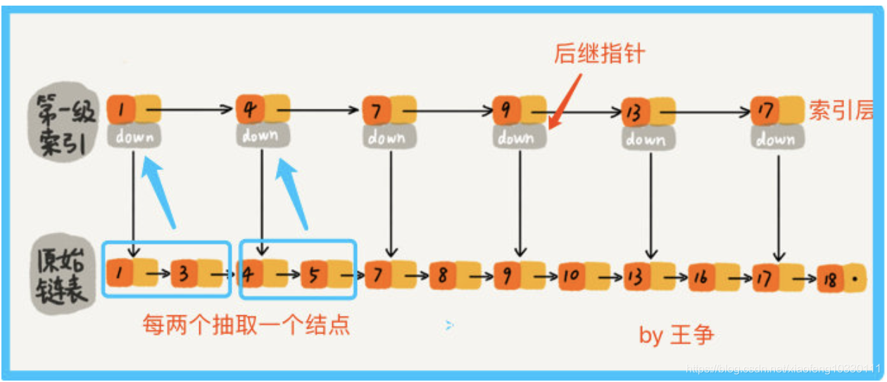

# Redis重点知识整理  -奔波儿东

## 一、Redis简介：

###  1、什么是Redis？

* Redis（Remote Dictionary Server）是一个用c语言写的，开源的、高性能非关系型数据库。`NoSQL`

#### ①优点：

* 读写性能优异，单机redis读的速度能到110000次/s，写的速度能到81000次/s
* 支持数据的持久化和过期策略
* 丰富的数据类型。key为String类型，value常用类型：String、hash、List、set、zset等
* 支持事务，redis所有的操作是都是原子的，同时redis还支持对几个操作合并后的原子执行。
* 支持多种语言编程
* 支持主从复制，主机会自动将数据同步到从机，可以进行读写分离。
* 高可用、集群

#### ②缺点：

* 数据库容量受物理内存的限制，不能作为海量数据的高性能读写。因此redis适合的场景主要局限在较小数据量的高性能操作和运算上。
* redis不具备自动容错和恢复功能，主从机的宕机都会导致前端部分读写请求的失败，需要等待机器重启或手动切换前端ip才能恢复。
* redis较难支持在线扩容，在集群达到上限时在线扩容变得很复杂。为避免这一问题，运维人员需要在系统上线时就必须确保足够的空间，这对资源造成浪费。
* 主机宕机，宕机前有部分数据未及时同步到从机，切换IP后会引入数据不一问题，降低系统可用性。

### 2、SQL与nosql

#### ①关系型数据库的特点：

* 以表格的形式、基于行存储数据是一个二维的模式
* 存储是结构化的数据，数据存储有固定的模式（schema）数据需适应表结构
* 表与表之间存在关联
* 大部分关系型数据库都支持SQL的操作，支持复杂的关联查询
* 支持事务来提供严格或者实时的数据一致性。（ACID）

局限：

* 要实现扩容的话，只能垂直扩容，（磁盘限制数据的存储，就要扩磁盘容量，通过堆硬件的方式，不支持动态扩容缩容。水平扩容需要复杂的技术来实现，如分库分表）
* 表结构修改困难，因此存储数据格式也受到限制。
* 在高并发和大数据量的情况下，由于关系型数据库数据存储于磁盘中，加载时需要磁盘IO，访问速度较慢。

#### ②非关系型数据库的特点：

* 存储非结构化的数据、如文本、图片、音频、视频
* 表与表之间没有关联，可扩展性强。
* 保证数据的最终一致性。遵循BASE理论。Basically Available（基本可用）、Soft-state（软状态）、Eventually Consistent（最终一致性）
* 支持海量数据的存储和高并发的高效读写。
* 支持分布式，能够对数据进行分片存储、扩容简单。


##  二、Redis在项目中的主要作用是是什么？怎么用的？（应用场景）

Redis作为一款性能优异的内存数据库，在互联网公司有着多种应用场景，主要有以下几个方面：

* 数据缓存
* 会话缓存
* 分布式session共享
* 当计数、统计、热数据 
* 分布式锁
* 接口限流器
* 作为消息队列，生产一消费 
* 作为订阅发布器，似聊天工具或推送

### ①应用场景：

#### `总结1：`

* 缓存

  将热点数据放到内存中，设置内存的最大使用量以及淘汰策略来保证缓存的命中率。

* 会话缓存

  可以使用 Redis 来统一存储多台应用服务器的会话信息。当应用服务器不再存储用户的会话信息，也就不再具有状态，一个用户可以请求任意一个应用服务器，从而更容易实现高可用性以及可伸缩性。

* 计数器：

  可以对 String 进行自增自减运算，从而实现计数器功能。Redis 这种内存型数据库的读写性能非常高，很适合存储频繁读写的计数量。

* 全页缓存（FPC）

  除基本的会话token之外，Redis还提供很简便的FPC平台。以Magento为例，Magento提供一个插件来使用Redis作为全页缓存后端。此外，对WordPress的用户来说，Pantheon有一个非常好的插件 wp-redis，这个插件能帮助你以最快速度加载你曾浏览过的页面。

* 查找表

  例如 DNS 记录就很适合使用 Redis 进行存储。查找表和缓存类似，也是利用了 Redis 快速的查找特性。但是查找表的内容不能失效，而缓存的内容可以失效，因为缓存不作为可靠的数据来源。

* 消息队列(发布/订阅功能)

  List 是一个双向链表，可以通过 lpush 和 rpop 写入和读取消息。不过最好使用 Kafka、RabbitMQ 等消息中间件。

* 分布式锁实现

  在分布式场景下，无法使用单机环境下的锁来对多个节点上的进程进行同步。可以使用 Redis 自带的 `SETNX` 命令实现分布式锁（使用del key 命令释放锁），除此之外，还可以使用官方提供的 RedLock 分布式锁实现。

* 其它

  Set 可以实现交集、并集等操作，从而实现共同好友等功能。ZSet 可以实现有序性操作，从而实现排行榜等功能。

#### `总结2：`

* String类型应用场景：

  * 热点数据缓存（报表、明星出轨）、
  * 对象缓存、
  * 全页缓存、
  * 数据共享分布式（分布式Session）

* hash类型应用场景：（String可以做的hash都可以做。）

  * 存储对象类型的数据（对象或一张表数据，比String节省更多的key空间，更便于集中管理）、
  * 购物车（key：用户ID；field：商品id；value：商品数量 +1：hincr；-1:hdecr ； 删除：hdel； 全选：hgetall; 商品数：hlen）

* List列表类型的应用场景：

  * 用户消息时间线（timeline:微博的时间线）、
  * 消息队列（lpush/rpop 或rpush/lpop）

* set类型应用场景：抽奖（随机获取元素 spop）、点赞、签到、打卡

  

  这条微博的id是t1001，用户ID是u2001

  用like:t1001来维护t1001这条微博的所有的点赞用户

  点赞：sadd like:t1001 u3001

  取消点赞：srem like:t1001 u3001

  是否点赞：sismember like:t1001 u3001

  点赞的总人数： smembers like:t1001 u3001

  点赞数：scard like:t1001

  * 商品标签：（用tags:i5000来维护商品的所有标签）

  

  sadd tags:i5000 画质清晰细腻

  sadd tags:i5000 真彩清晰显示屏

  sadd tags:i5000 性能一流

  * 商品筛选

  

  获取差集：sdiff set1 set2

  获取交集：sinter set1 set2

  获取并集： sunion set1 set2

  * 用户关注、推荐模型（相互关注、我关注的人也关注了他、可能认识的人）

* zset类型的应用场景

  * 排行榜：ID为5000的新闻的点击数加1：zincrby hotnews:20210525 n5000

  * 获取今天点击数最多的10条： zrevrange hotnews:20210525  10 withscores

    


## 三、Redis支持的数据类型

### 1、Redis五种常用数据类型：

* String字符串：字符串类型是 Redis 最基础的数据结构，首先键都是字符串类型，而且其他几种数据结构都是在字符串类型基础上构建的，我们常使用的 set key value 命令就是字符串。常用在缓存、计数、共享Session、限速等。
* Hash哈希：在Redis中，哈希类型是指值本身又是一个键值对结构，哈希可以用来存放用户信息，比如实现购物车。
* List列表（双向链表）:列表（list）类型是用来存储多个有序的字符串。可以做简单的消息队列的功能。
* Set集合：集合（set）类型也是用来保存多个的字符串元素，但和列表类型不一 样的是，集合中不允许有重复元素，并且集合中的元素是无序的，不能通过索引下标获取元素。利用 Set 的交集、并集、差集等操作，可以计算共同喜好，全部的喜好，自己独有的喜好等功能。
* Sorted Set有序集合（跳表实现）：Sorted Set 多了一个权重参数 Score，集合中的元素能够按 Score 进行排列。可以做排行榜应用，取 TOP N 操作。

### 2、redis不同对象的编码

* 字符串对象string: int，存储8个字节的长整型（long）、embstr编码的SDS(Simple Dynamic String)简单动态字符串(存储小于44个字节的字符串)、raw简单动态字符串（存储大于44个字节的字符串）
* 列表对象list：ziplist、linkedlist
* 哈希对象hash：ziplist、hashtable
* 集合对象set：intset、hsahtable
* 有序集合zset：ziplist、skiplist

## 四、Redis的持久化机制

### ①Redis持久化定义：

* Redis速度快，很大一部分原因是它所有的数据均存储在内存中。如果断电或者宕机都会导致内存中的数据丢失。为了实现重启后数据不丢失，Redis提供了两种持久化的方案，RDB快照（redis database）和 AOF（append only file）

### ②RDB：默认方案

* RDB：快照形式是直接把内存中的数据保存到一个dump.rdb的文件中，按照一定的时间将内存中的数据以快照的形式保存到硬盘中。 当Redis需要做持久化时，Redis会fork一个子进程，子进程将数据写到磁盘上一个临时RDB文件中。当子进程完成写临时文件后，将原来的RDB替换掉。
* 优点：
  * 只有一个文件 dump.rdb，方便持久化。
  * 容灾性好，一个文件可以保存到安全的磁盘。
  * 性能最大化，fork 子进程来完成写操作，让主进程继续处理命令，所以是 IO 最大化。使用单独子进程来进行持久化，主进程不会进行任何 IO 操作，保证了 redis 的高性能
  * 相对于数据集大时，比 AOF 的启动效率更高。
* 缺点：
  * 数据安全性低。RDB 是间隔一段时间进行持久化，如果两个持久化之间 redis 发生故障，会发生数据丢失。所以这种方式更适合数据要求不严谨的时候。

### ③AOF：

* AOF：把所有的对Redis的服务器进行修改的命令都存到一个文件里，命令的集合。 使用AOF做持久化，每一个写命令都通过write函数追加到appendonly.aof中。aof的默认策略是每秒钟fsync一次，在这种配置下，就算发生故障停机，也最多丢失一秒钟的数据。 缺点是对于相同的数据集来说，AOF的文件体积通常要大于RDB文件的体积。根据所使用的fsync策略，AOF的速度可能会慢于RDB。

Redis默认是快照RDB的持久化方式。对于主从同步来说，主从刚刚连接的时候，进行全量同步（RDB）；全同步结束后，进行增量同步(AOF)。

### ④RDB和AOF的优缺点：

* AOF文件比RDB更新频率高，优先使用AOF还原数据。
* AOF比RDB更安全，但也更大。
* RDB性能比AOF要好。
* 如果两个都配了，优先加载AOF

###  ⑤如何选择合适的持久化方式

* 一般来说要较高的数据安全性，需要同时使用两种持久化，当redis重启后会优先加载AOF文件来恢复原始数据，因为AOF文件保存的数据集要不比RDB文件保存的数据集要完整。
* 如果可以忍受数分钟内的数据丢失，那么可以只是用RDB。
* 不建议只是用AOF，因为定时生成的RDB非常便于数据库备份，并且RDB恢复数据集的速度要比AOF要快。并且RDB还可以避免AOF程序的bug。
* 如果只是希望数据在服务器运行时候存在，可以不做持久化。

## 五、Redis的数据过期策略以及内存淘汰机制

### ①数据过期策略

Redis 中数据过期策略采用`定期删除+惰性删除策略`结合起来，以及采用淘汰策略来兜底。

* 定时删除策略：

  * 每个设置过期时间的key都创建一个定时器，到过期时间后立即删除。该策略可以立即清除过期的数据，对内存很友好。
  * 缺点：每次都遍历内存中所有的数据，非常消耗 CPU 资源，影响缓存的响应时间和吞吐量；并且当 key 已过期，但是定时器还处于未唤起状态，这段时间内 key 仍然可以用。

* 惰性删除策略：

  * 在获取 key 时，先判断 key 是否过期，如果过期则删除。节约CPU资源但是很耗内存。
  * 缺点：如果这个 key 一直未被使用，那么它一直在内存中，其实它已经过期了，会浪费大量的空间。

  


* 定期删除
  * 每隔一段时间，会扫描设置expires字典中一定数量的key，并清除其中已经过期的key。该策略是定时和惰性删除的折中方案。不在是每次扫描全部的 key 了，而是`随机抽取一部分 key 进行检查`，这样就降低了对 CPU 资源的损耗，惰性删除策略互补了为检查到的key，基本上满足了所有要求。

定期删除+惰性删除都没有删除过期的key？

* 当内存不够用的时候，就会走到redis的内存淘汰机制。

* 内存淘汰机制就保证了在redis的内存占用过多的时候，去进行内存淘汰，也就是删除一部分key，保证redis的内存占用率不会过高。

在redis.conf中有一行配置

```shell
maxmemory-policy volatile-lru
```

###  ②redis提供6种数据淘汰策略：

`volatile-lru：`从`已设置过期时间`的数据集（server.db[i].expires）中挑选最近最少使用的数据淘汰

`volatile-ttl`：从`已设置过期时间`的数据集（server.db[i].expires）中挑选将要过期的数据淘汰

`volatile-random`：从已设置过期时间的数据集（server.db[i].expires）中随机移除key

`allkeys-lru`：当内存不足以容纳新写入数据时，在键空间中，移除最近最少使用的key（这个是最常用的）

`allkeys-random`：从数据集（server.db[i].dict）中任意选择数据淘汰

`no-eviction`：当内存不足以容纳新写入数据时，新写入操作会报错，无法写入新数据，一般不采用

4.0版本后增加以下两种：

* volatile-lfu：从已设置过期时间的数据集(server.db[i].expires)中挑选最不经常使用的数据淘汰
* allkeys-lfu：当内存不足以容纳新写入数据时，在键空间中，移除最不经常使用的key

### ③Redis的LRU过期策略的具体实现

Redis每次按key获取一个值的时候，都会更新value中的lru字段为当前秒级别的时间戳。

Redis初始的实现算法很简单，随机从dict中取出五个key,淘汰一个lru字段值最小的。

在3.0的时候，又改进了一版算法：

* 首先第一次随机选取的key都会放入一个pool中(pool的大小为16)，pool中的key是按lru大小顺序排列的。
* 接下来每次随机选取的key lru值必须小于pool中最小的lru才会继续放入，直到将pool放满。
* 放满之后，每次如果有新的key需要放入，需要将pool中lru最大的一个key取出。
* 淘汰的时候，直接从pool中选取一个lru最小的值然后将其淘汰。

## 六、如何解决Redis缓存雪崩，缓存穿透、缓存预热、缓存更新、缓存降级

###  `1、Redis缓存雪崩`

定义：redis缓存中大量的key同时失效，（缓存服务器宕机）此时又刚好有大量的请求打进来，直接打到数据库层，造成数据库阻塞甚至宕机。
场景： 把所有存入redis的所有数据设置相同过期的时间，过期时间失效后，就会大量请求数据库。
如何解决？
   1、在缓存的时候我们给过期时间设置一个随机数，但是也要根据业务场景需求来设置
   2、事发前：实现redis的高可用、主从架构+sentinel 或者 redis cluster ，避免全盘崩溃；
   3、事发后：万一redis真的挂了，可以设置本地缓存ehcache+限流hystrix，避免数据库被打死；
   4、事发后：redis持久化，重启后自动从磁盘上加载数据，快速恢复缓存数据


### 2、Redis缓存穿透

`定义`：指查询一个缓存和数据库都不存在的数据，导致尽管数据不存在但是每次都会到数据库查询。在访问量大时可能DB就会挂掉。如果有人利用不存在的key频繁攻击，则这就形成了漏洞。

` 场景`：比如我们表的数据的id是从1开始的正数，如果在这里有黑客攻击我们的系统，会设置一些负数的id到数据库查询数据，查询出来返回的数据为null，在这里，由于缓存不命中，并且处于容错考虑，从数据库查询的数据为null就不写到redis，这将导致每次查询数据都会到数据库查询，失去了缓存的意义。这样数据库迟早也会挂掉

`如何解决缓存穿透？`
    1、由于请求的参数是不合法(-1) 每次请求都是不存在的数据，于是我们可以使用布隆过滤器(BloomFilter) 或者 压缩filter提前拦截，不合法就不能访问数据库。
    2、当我们从数据库查询出来的数据为null时，也把他设置到缓存redis中，下次请求的时候就到redis中查询了，在这里后台可以判断，如果为null，那么设置一个较短的过期时间，到期自动就失效，否则就是按正常操作。

###  3、布隆过滤器

* 什么是布隆过滤器？
  * 布隆过滤器（Bloom Filter）是1970年由布隆提出的。它实际上是一个很长的`二进制向量`和`一系列随机映射函数`。布隆过滤器可以用于检索一个元素是否在一个集合中。它的优点是空间效率和查询时间都比一般的算法要好的多，缺点是有一定的误识别率和删除困难。
* 设计概念
  * 如果判断一个元素是否在集合中，一般思路可以是将所有的元素保存起来，然后通过比较确定。但是随着数据量的增加我们需要的存储空间也越来越大，检索速度也越来越慢。此时可以使用到hash表的数据结构。可以通过hash函数将一个元素映射到位阵列（bit array）中的一个点。这样我们只要判断这个点是不是1就可以知道集合中存不存在某元素。
  * 使用hash算法，免不了会有冲突，为了解决冲突就只能通过增加散列表的空间大小，导致空间利用率不高，此时还有一种方式就是增加hash函数的数量。通过多个hash函数，判断元素是否存在，如果有一个判断为0（即不存在），则判断此元素在集合中是不存在的。但是避免不了有误判的可能。
* 核心思想
  * 多个hash函数，增加随机性，减少hash碰撞的概率。
  * 扩大数组范围，使hash值均匀分布，减少hash碰撞的概率。
* 优点：
  * 相比其他的数据结构，布隆过滤器的空间及时间方面的优势是巨大的。存储空间和插入、查询时间都是常数。
  * hash函数之间是没有关系的，方便由硬件并行实现。
  * 布隆过滤器本身不需要存储元素本身，数据安全性较高。
* 缺点：
  * 存在一定的误判率，不能100%判断元素是否真的存在。
  * 不能删除。（因为不知道某一个位置上代表的是否还有其他的元素）

* BloomFilter的应用
  * K-V系统快速判断某个key是否存在
    典型的例子有Hbase，Hbase的每个Region中都包含一个BloomFilter，用于在查询时快速判断某个key在该region中是否存在，如果不存在，直接返回，节省掉后续的查询。
  * 黑名单
    比如邮件黑名单过滤器，判断邮件地址是否在黑名单中
  * 排序(仅限于BitSet)
    仔细想想，其实BitSet在set(int value)的时候，“顺便”把value也给排序了。
  * 网络爬虫
    判断某个URL是否已经被爬取过
  * 缓存穿透
  * 集合元素重复的判断

### 4、击穿：

击穿与雪崩的不同在于缓存key失效的量级上。击穿是对于单个key值的缓存失效过期，雪崩则是大面积key同时失效。

* 解决办法：

若缓存数据基本不会发生更新，则可尝试将热点数据设置为永不过期。
若缓存的数据更新不频繁，且缓存刷新的整个流程耗时较少的情况下，则可以采用基于 Redis、zookeeper 等分布式中间件的分布式互斥锁，或者本地互斥锁以保证仅少量的请求能请求数据库并重新构建缓存，其余线程则在锁释放后能访问到新缓存。
若缓存的数据更新频繁或者在缓存刷新的流程耗时较长的情况下，可以利用定时线程在缓存过期前主动地重新构建缓存或者延后缓存的过期时间，以保证所有的请求能一直访问到对应的缓存。

### 5、缓存预热：

* 缓存预热是在系统上线后，将相关缓存数据直接加载到缓存系统中。这样可以避免用户请求时先查数据库，再更新缓存的问题。

* 方案：
  * 写缓存刷新页面，上线时候手动更新缓存
  * 数据量不大的话可以在项目启动时自动加载
  * 定时刷新缓存（每天凌晨去做）

### 6、缓存降级

* 当访问量剧增、服务出现问题（响应时间长或不响应）或非核心服务影响到核心流程的性能，仍然需要保证服务是可用的，即使有损服务。系统可以根据一些关键数据进行自动降级，也可以配置开关实现人工降级。

* 降级的目的：保证核心服务的可用性，即使是有损的，而且有些服务是不能降级的（购物车、支付等）

* 以参考日志级别设置预案：

  （1）一般：比如有些服务偶尔因为网络抖动或者服务正在上线而超时，可以自动降级；

  （2）警告：有些服务在一段时间内成功率有波动（如在95~100%之间），可以自动降级或人工降级，并发送告警；

  （3）错误：比如可用率低于90%，或者数据库连接池被打爆了，或者访问量突然猛增到系统能承受的最大阀值，此时可以根据情况自动降级或者人工降级；

  （4）严重错误：比如因为特殊原因数据错误了，此时需要紧急人工降级。

  服务降级的目的，是为了防止Redis服务故障，导致数据库跟着一起发生雪崩问题。因此，对于不重要的缓存数据，可以采取服务降级策略，例如一个比较常见的做法就是，Redis出现问题，不去数据库查询，而是直接返回默认值给用户。

## 七、zset跳表的数据结构

跳跃表（skiplist）是一种有序数据链表结构， 它通过在每个节点中维持多个指向其他节点的指针， 从而达到快速访问节点的目的。查询平均性能为O(logN)，最坏的情况会出现O(N)情况，而redis中的zset在数据较多的时候底层就是采用跳跃表去实现的，元素较少的时候会进行小对象压缩采用压缩列表实现。


从上述图我们可以看出跳跃表有以下几个特点：

* 跳跃表的每个节点都有多层构成。
* 跳跃表存在一个头结点，该头结点有64层结构，每层都包含指向下个节点的指针，指向本层下个节点中间所跨越的节点个数为跨度（span）。
* 除头结点以外，层高最高的节点为该跳跃表的level，图中的跳跃表level为3。
  每层都是一个有序链表。
* 最底层的有序链表包含所有的节点数，也即是整个跳跃表的长度。
  跳跃表每个节点都维护了多个指向其他节点的指针，所以在进行查询、更新、删除等操作的时候不需要进行整条链表的遍历，可以通过维护的指针过滤掉中间的很多节点，从而达到很快速的访问效果，一般情况来说跳跃表的性能能与平衡树相媲美的，而且跳跃表实现较为简单，所以这也是redis为什么采用跳跃表来作为zset底层的数据结构实现。

#### `查找过程`

跳跃表的查询，跳跃表有多层的情况下查询复杂度为O(logN)，如果跳跃表就一层那么查询复杂度会上升为O(N)，接下来我们就用图1的实例来模拟下查询score为70的节点的具体查询过程。


如图所示我们需要找到score为70的节点，查找首先从header开始，因为level为3我们先从L2开始往后开始遍历，查找到第一个节点，发现score比70小，继续往后遍历查找到第五个节点，发现score比70大，于是从当前节点往下一层进行查找，查找到节点3，以此类推，最终查询到score为70的节点。

#### 插入以及更新过程

`插入过程`：跳跃表插入节点的时候，首先需要通过score找到自己的位置，也就是需要先走一步查找过程，找到新节点所处的位置的时候就创建一个新节点，并对新节点分配一个层数（这里层数的分配redis采用的是random随机机制，分配层数从1开始，每次晋升为上一层的概率为0.25），层数分配完了之后将前后指针进行赋值将新节点与旧节点串起来，如果层数大于当前的level还需要进行level的更新操作。

`更新过程`：更新过程会稍微复杂一些，更新其实就是插入，只不过插入的时候发现value已经存在了，只是需要调整一下score值，如果更新的score值不会带来位置上的改变，那么直接更新score就行不需要进行调整位置，但是如果新score会导致排序改变，那么就需要调整位置了，redis采用的方式比较直接就是先删除这个元素然后再插入这个元素即可，前后需要两次路径搜索。

补充问题：
`Redis使用跳表不用B+树的原因？`
Redis使用跳表不用B+树的原因是：redis是内存数据库，而B+树纯粹是为了mysql这种IO数据库准备的。B+树的每个节点的数量都是一个mysql分区页的大小。

## 八、缓存和数据库双写时数据一致性问题？

操作：先更新数据库，再删除缓存
正常的情况是这样的：    

* 先操作数据库，成功
* 再删除缓存，也成功

* 如果原子性被破坏了：第一步成功(操作数据库)，第二步失败(删除缓存)，会导致数据库里是新数据，而缓存里是旧数据。

如果第一步(操作数据库)就失败了，我们可以直接返回错误(Exception)，不会出现数据不一致。
如果在高并发的场景下，出现数据库与缓存数据不一致的概率特别低，也不是没有：缓存刚好失效//线程A查询数据库，得一个旧值//线程B将新值写入数据库//线程B删除缓存//线程A将查到的旧值写入缓存
要达成上述情况，还是说一句概率特别低,因为这个条件需要发生在读缓存时缓存失效，而且并发着有一个写操作。而实际上数据库的写操作会比读操作慢得多，而且还要锁表，而读操作必需在写操作前进入数据库操作，而又要晚于写操作更新缓存，所有的这些条件都具备的概率基本并不大。对于这种策略，其实是一种设计模式：Cache Aside Pattern
`解决删除缓存失败的解决思路`：将需要删除的key发送到消息队列中---自己消费消息，获得需要删除的key---不断重试删除操作，直到成功

操作:先删除缓存，再更新数据库
正常情况是这样的：

1、先删除缓存，成功；
2、再更新数据库，也成功；
3、如果原子性被破坏了
第一步成功(删除缓存)，第二步失败(更新数据库)，数据库和缓存的数据还是一致的。
如果第一步(删除缓存)就失败了，我们可以直接返回错误(Exception)，数据库和缓存的数据还是一致的。
看起来是很美好，但是我们在并发场景下分析一下，就知道还是有问题的了：线程A删除了缓存///线程B查询，发现缓存已不存在
///线程B去数据库查询得到旧值///线程B将旧值写入缓存///线程A将新值写入数据库-------->所以也会导致数据库和缓存不一致的问题。
解决并发下解决数据库与缓存不一致的思路：将删除缓存、修改数据库、读取缓存等的操作积压到队列里边，实现串行化。

对比两种策略：

先删除缓存、再更新数据库----->在高并发下表现的不如意，在原子性被破环时表现优异
先更新数据库，再删除缓存(Cache Aside Pattern设计模式)) ----->在高并发先表现优异，在原子性被破坏时表现不如意

## 九、Redis集群方案

[参考文档](https://blog.csdn.net/miss1181248983/article/details/90056960?ops_request_misc=%257B%2522request%255Fid%2522%253A%2522162209597116780269860485%2522%252C%2522scm%2522%253A%252220140713.130102334.pc%255Fall.%2522%257D&request_id=162209597116780269860485&biz_id=0&utm_medium=distribute.pc_search_result.none-task-blog-2~all~first_rank_v2~hot_rank-1-90056960.first_rank_v2_pc_rank_v29&utm_term=redis%E9%9B%86%E7%BE%A4&spm=1018.2226.3001.4187)

### ① 主从模式

#### 特点：

* 主数据库可以进行读写操作，当读写操作导致数据变化时会自动将数据同步给从数据库
* 从数据库一般都是只读的，并且接收主数据库同步过来的数据
* 一个master可以拥有多个slave，但是一个slave只能对应一个master
* slave挂了不影响其他slave的读和master的读和写，重新启动后会将数据从master同步过来
* master挂了以后，不影响slave的读，但redis不再提供写服务，master重启后redis将重新对外提供写服务
* master挂了以后，不会在slave节点中重新选一个master

#### 工作机制

* 当slave启动后，主动向master发送SYNC命令，master接收到命令后在后台保存快照和缓存保存快照这段时间的操作，然后将保存的快照文件和缓存命令发送到slave。slave接收到快照文件和命令后加载到快照和缓存的执行命令。
* 在复制初始化后，master每次接收到写命令都会同步发送给slave，保证主从数据一致性。

#### 缺点：

* master节点在主从模式中是唯一的，如果master挂掉，则redis无法对外提供写服务。

`redis-cli -h 182.208.x.x  -a 密码`

###  ②哨兵模式（Sentinel）

#### 哨兵模式

* 集群监控：负责监控master和slave进程是否正常工作。
* 消息通知：如果某个redis实例出现故障，哨兵会负责发送消息作为警报通知给管理员
* 故障转移：如果master节点挂掉，会自动转移到slave节点上。
* 配置中心：如果故障转义发生了，通知client客户端新的master地址。


* 主从模式不具备高可用性，当master挂掉之后，redis不能再对外提供写操作。

#### 哨兵模式特点：

* sentinel模式是建立在主从模式的基础上，如果只有一个Redis节点，sentinel就没有任何意义
* 当master挂了以后，sentinel会在slave中选择一个做为master，并修改它们的配置文件，其他slave的配置文件也会被修改，比如slaveof属性会指向新的master
* 当master重新启动后，它将不再是master而是做为slave接收新的master的同步数据
* sentinel因为也是一个进程有挂掉的可能，所以sentinel也会启动多个形成一个sentinel集群
* 多sentinel配置的时候，sentinel之间也会自动监控
* 当主从模式配置密码时，sentinel也会同步将配置信息修改到配置文件中，不需要担心
* 一个sentinel或sentinel集群可以管理多个主从Redis，多个sentinel也可以监控同一个redis
* sentinel最好不要和Redis部署在同一台机器，不然Redis的服务器挂了以后，sentinel也挂了

#### 工作机制

* 每个sentinel以每秒钟一次的频率向它所知的master，slave以及其他sentinel实例发送一个 PING 命令 
* 如果一个实例距离最后一次有效回复 PING 命令的时间超过 down-after-milliseconds 选项所指定的值， 则这个实例会被sentinel标记为主观下线。 
* 如果一个master被标记为主观下线，则正在监视这个master的所有sentinel要以每秒一次的频率确认master的确进入了主观下线状态
* 当有足够数量的sentinel（大于等于配置文件指定的值）在指定的时间范围内确认master的确进入了主观下线状态， 则master会被标记为客观下线 
* 在一般情况下， 每个sentinel会以每 10 秒一次的频率向它已知的所有master，slave发送 INFO 命令 
* 当master被sentinel标记为客观下线时，sentinel向下线的master的所有slave发送 INFO 命令的频率会从 10 秒一次改为 1 秒一次 
* 若没有足够数量的sentinel同意master已经下线，master的客观下线状态就会被移除；
* 若master重新向sentinel的 PING 命令返回有效回复，master的主观下线状态就会被移除

#### 哨兵用于实现 redis 集群的高可用，本身也是分布式的，作为一个哨兵集群去运行，互相协同工作。

* 故障转移时，判断一个 master node 是否宕机了，需要大部分的哨兵都同意才行，涉及到了分布式选举的问题。

* 即使部分哨兵节点挂掉了，哨兵集群还是能正常工作的，因为如果一个作为高可用机制重要组成部分的故障转移系统本身是单点的，那就很坑爹了。

#### 哨兵的核心知识

* 哨兵至少需要 3 个实例，来保证自己的健壮性。
* 哨兵 + redis 主从的部署架构，是不保证数据零丢失的，只能保证 redis 集群的高可用性。
* 对于哨兵 + redis 主从这种复杂的部署架构，尽量在测试环境和生产环境，都进行充足的测试和演练。

### ③官方Redis Cluster（服务端路由查询）


* sentinel 模式可以满足一般生产的需求，具备高可用性。但是当数据过大后一台服务器存放不下的情况时，主从模式和哨兵模式都不能满足需求。此时需要对存储的数据进行分片，将数据存储到多个实例中。cluster模式的出现就是为解决Redis容量有限的问题，将数据根据一定的规则分配到多台机器上。

####  cluster集群的特点

* 多个redis节点网络互联，数据共享
* 所有的节点都是一主一从（也可以是一主多从），其中从节点不提供服务，仅作为备用
* 不支持同时处理多个key（如MSET/MGET），因为redis需要把key均匀分布在各个节点上，
  并发量很高的情况下同时创建key-value会降低性能并导致不可预测的行为
* 支持在线增加、删除节点
* 客户端可以连接任何一个主节点进行读写

#### 方案说明

* 通过哈希的方式，将数据分片，每个节点均分存储一定哈希槽(哈希值)区间的数据，默认分配了16384 个槽位

* 每份数据分片会存储在多个互为主从的多节点上

* 数据写入先写主节点，再同步到从节点(支持配置为阻塞同步)

* 同一分片多个节点间的数据不保持一致性

* 读取数据时，当客户端操作的key没有分配在该节点上时，redis会返回转向指令，指向正确的节点

* 扩容时时需要需要把旧节点的数据迁移一部分到新节点

在 redis cluster 架构下，每个 redis 要放开两个端口号，比如一个是 6379，另外一个就是 加1w 的端口号，比如 16379。16379 端口号是用来进行节点间通信的，也就是 cluster bus 的东西，cluster bus 的通信，用来进行故障检测、配置更新、故障转移授权。cluster bus 用了另外一种二进制的协议，gossip 协议，用于节点间进行高效的数据交换，占用更少的网络带宽和处理时间。

节点间的内部通信机制

基本通信原理

集群元数据的维护有两种方式：集中式、Gossip 协议。redis cluster 节点间采用 gossip 协议进行通信。

#### 分布式寻址算法

hash 算法（大量缓存重建）
一致性 hash 算法（自动缓存迁移）+ 虚拟节点（自动负载均衡）
redis cluster 的 hash slot 算法
优点

无中心架构，支持动态扩容，对业务透明
具备Sentinel的监控和自动Failover(故障转移)能力
客户端不需要连接集群所有节点，连接集群中任何一个可用节点即可
高性能，客户端直连redis服务，免去了proxy代理的损耗
缺点

运维也很复杂，数据迁移需要人工干预
只能使用0号数据库
不支持批量操作(pipeline管道操作)
分布式逻辑和存储模块耦合等

#### 基于客户端分配


##### 简介

Redis Sharding是Redis Cluster出来之前，业界普遍使用的多Redis实例集群方法。其主要思想是采用哈希算法将Redis数据的key进行散列，通过hash函数，特定的key会映射到特定的Redis节点上。Java redis客户端驱动jedis，支持Redis Sharding功能，即ShardedJedis以及结合缓存池的ShardedJedisPool

##### 优点

* 优势在于非常简单，服务端的Redis实例彼此独立，相互无关联，每个Redis实例像单服务器一样运行，非常容易线性扩展，系统的灵活性很强

##### 缺点

* 由于sharding处理放到客户端，规模进一步扩大时给运维带来挑战。
* 客户端sharding不支持动态增删节点。服务端Redis实例群拓扑结构有变化时，每个客户端都需要更新调整。连接不能共享，当应用规模增大时，资源浪费制约优化

#### 基于代理服务器分片


简介

客户端发送请求到一个代理组件，代理解析客户端的数据，并将请求转发至正确的节点，最后将结果回复给客户端

特征

透明接入，业务程序不用关心后端Redis实例，切换成本低
Proxy 的逻辑和存储的逻辑是隔离的
代理层多了一次转发，性能有所损耗
业界开源方案

Twtter开源的Twemproxy
豌豆荚开源的Codis

### 9.Redis集群容错机制是什么样的？

高可用首先需要解决集群部分失败的场景：当集群内少量节点出现故障时通过自动故障转移保证集群可以正常对外提供服务。主要针对Redis Cluster来分析：

详细的知识见：https://blog.csdn.net/xiaofeng10330111/article/details/90384502

#### 故障发现

redis的各个节点通过ping/pong进行消息通信，不需要Sentinel，转播槽的信息和节点状态信息，故障发现也是通过这个动作发现的，跟Sentinel一样，有主观下线和客观下线。

* 主观下线：某个节点认为另一个节点不可用，“偏见”，但不是最终的故障判断。
  客观下线：标志着一个节点真正的下线，即半数以上持有槽的主节点都标记某节点主观下线，如果是持有槽的主节点故障，需要为该节点进行故障转移。
* 尝试客观下线：通知集群内所有节点标记故障节点为客观下线，通过故障节点的从节点触发故障转移流程。

#### 故障恢复

故障节点变为客观下线后，如果下线节点是持有槽的主节点则需要在它的从节点中选出一个替换它，从而保证集群的高可用。下线主节点的所有从节点承担故障恢复的义务，当从节点通过内部定时任务发现自身复制的主节 点进入客观下线时，将会触发故障恢复流程：资格检查-->准备选举时间-->发起选举-->选举投票-->替换主节点。

### 10.Redis集群中某个master节点挂了，后面流程怎么判断？

具体还是9上的回答，更为具体的见：https://blog.csdn.net/xiaofeng10330111/article/details/90384502

可以从以下三个方面分析：

#### redis集群如何判断一个主节点挂了：

* 集群中的每个节点都会顶起地向集群中的其他节点发送PING消息
* 默认每隔1s中发送一次PING
* 默认随机选择5个集群中的其他主节点，规则为最长时间未PING以及PONG时间超过timeout/2
* 如果发送PING的主节点1，在timeout时间内没收到主节点2的PONG消息，那么主节点1会将主节点2的状态标记为pfail
* 主节点1在后续发送PING消息时，会带上主节点2的pfail状态，收到这个消息的主节点会在clusterNode里下线报告fail_reports中将主节点2标记为pfail
* 当某个主节点被标记为pfail的个数大于集群总主节点个数的一半时，会被标记为fail, 并向整个集群广播一条PONG消息，说明该主节点下线。
* 其他主节点收到广播消息后，将该主节点状态标记为fail,
* 集群进入故障转移阶段

#### 故障转移阶段流程：

当一个从节点发现自己正在复制的主节点进入已下线状态时，从节点将开始对下线主节点进行故障转移
复制下线主节点的所有从节点里面，会有一个从节点被选为新的主节点
新的主节点从撤销所有已下线主节点的槽位指派，并将这些槽位指给自己
新的主节点会向集群广播一条PONG消息，告知其他节点自己已由从节点转为主节点，并接管相应的槽位
故障转移完成

#### 选举新的主节点

集群的纪元时一个自增的计数器，初始值为0
当集群里的某个节点开始一次故障转移操作时，集群的纪元会加一
对于每个纪元，集群里每个复制处理槽位的主节点都有一次投票机会，而第一次向主节点要求投票的从节点将获得主节点的投票
什么时候开始投票？ 当从节点发现自己正在复制的主节点进入已下线状态，从节点会向集群广播一条CLUSTERMSG_TYPE_FAILOVER_AUTH_REQUEST消息，收到该消息的主节点可以开始投票
主节点投票后返回CLUSTERMSG_TYPE_FAILOVER_AUTH_ACK消息
当某个从节点的票数大于投票总节点数的一半时，被选为新的主节点
若每个获得足够的票数，进入下一轮投票

## 11.Redis的缓存优化方向有哪些？你们怎么理解的？对热点键的注意事项设计什么？

#### 缓存的主要优势和成本：

缓存收益：加速读写、降低后端存储负载；
缓存成本：缓存和存储数据不一致性、代码维护成本、运维成本；

#### 优化方向：

* Redis 的数据过期策略：采用定期删除+惰性删除策略结合起来，以及采用淘汰策略来兜底。
* 缓存粒度控制：全部属性更好or部分重要属性更好？
* 缓存穿透优化：缓存空对象 + 布隆过滤器拦截（通过很小的内存来实现对数据的过滤。）
* 缓存雪崩优化：保证缓存高可用性，例如 Redis Cluster、Redis Sentinel、VIP；*  依赖隔离组件为后端限流；提前演练，例如压力测试。
* 无底洞问题优化：命令本身优化，例如慢查询 keys、hgetall bigkey；减少网络通信次数；降低接入成本，例如客户端使用长连接/连接池、NIO 等 。
* 热点key优化：避免 bigkey；热键不要用 hash_tag，因为 hash_tag 会落到一个节点上；如果真有热点 key 而且业务对一致性要求不高时，可以用本地缓存 + MQ 解决。
* 热点key重建优化：互斥锁（mutex key），查询数据源 -> 重建缓存 这个过程加互斥锁；永不过期，缓存层面不设置过期时间（没有用 expire），功能层面为每个 value 添加逻辑过期时间，但发现超过逻辑过期时间后，会使用单独的线程去构建缓存。
* 对热点键的注意事项，如上热点key优化和热点key重建优化。


## 十一、补充问题：

### 1、单线程的Redis为什么快？

* 纯内存操作
* 单线程操作，避免了频繁的上下文切换
* 合理高效的数据结构
* 采用了非阻塞I/O多路复用机制

### 2、Redis和memcached的区别？

* 存储方式上：memcache会把数据全部存在内存之中，断电后会挂掉，数据不能超过内存大小。redis有部分数据存在硬盘上，这样能保证数据的持久性。
* 数据支持类型上：memcache对数据类型的支持简单，只支持简单的key-value，，而redis支持常见的五种数据类型。（String、List、set、zset、hash）
* 用底层模型不同：它们之间底层实现方式以及与客户端之间通信的应用协议不一样。redis直接自己构建了VM机制，因为一般的系统调用系统函数的话，会浪费一定的时间去移动和请求。
* value的大小：redis可以达到512MB，而memcache只有1MB。
* redis支持数据的备份，即master-slave模式的数据备份。

### 3、redis的同步机制

* redis可以使用主从同步，从从同步第一次同步时，主节点做一次bgsave，并同时将后续的修改操作记录到内存缓存中，待完成后将RDB文件全量同步到复制节点，复制节点接收完成后将RDB镜像加载到内存。加载完成后，再通知主节点将期间修改的操作记录同步到复制节点进行重放完成同步过程。

### 4、Redis和DB数据一致性处理

对于读操作流程：先到redis缓存中查询数据，如果为null，那么再到数据库查询出来再设置到redis中去，最后将数据返回给请求。
定义： 如果只是简单查询，缓存数据和数据库数据没有什么问题，当我们更新的时候就可能导致数据库数据和缓存数据不一致了。 数据库库存为 999  缓存数据为1000 这就是更新导致的情况。    

解决方案：
    1、比如操作菜单的时候，当我们增加 、删除、修改菜单时，操作成功之后就应该立刻根据菜单的key从redis缓存中把数据给删除，第二次查询 的时候肯定为null，从数据库查询再设置到redis中。这是马上见效情况
    2、不是马上见效的情况，就是设置过期时间来确定，比如我们商城中web页面根据店铺搜索出来的数据有最新的4张照片，当我们在商家后台添加一个商品时，就应该显示在最新添加的照片，此时就不能按照删除key来操作redis了，因为多个商家添加多个商品，就失去了缓存的意义，那么会根据用户需求来设置过期时间，这里的redis缓存就可能和数据库不一致，需要过期时间来控制数据。因为缓存时间到了，就会被删除，再到数据库查询设置到redis中去。

### 5、Redis 常见性能问题和解决方案？

* Master 最好不要做任何持久化工作，如 RDB 内存快照和 AOF 日志文件

* 如果数据比较重要，某个 Slave 开启 AOF 备份数据，策略设置为每秒同步一次

* 为了主从复制的速度和连接的稳定性， Master 和 Slave 最好在同一个局域网内

* 尽量避免在压力很大的主库上增加从库

* 主从复制不要用图状结构，用单向链表结构更为稳定，即：Master <- Slave1 <- Slave2 <-Slave3…

### 6、知道什么是热key问题？热key问题怎么解决？

* 热key：突然有十几万请求去访问redis中的某个特定key。那么这样造成流量过于集中，达到物理网卡上限，从而导致这台redis服务器宕机。接下来就是这个key的请求直接打到数据库服务器上导致整个服务不可用。（击穿）

#### 发现热key：

* 根据经验评估热key。（某些商品在做秒杀，那么此商品的key可判断为热key，但不是所有的业务都能判断出来热key）
* 客户端收集。（在操作redis之前加代码进行统计，但是会造成代码的侵入）
* 代理层做收集。
* redis自带的命令
  *  monitor命令，该命令可以实时抓取出redis服务器接收到的命令，然后写代码统计出热key是啥。当然，也有现成的分析工具可以给你使用，比如redis-faina。但是该命令在高并发的条件下，有内存增暴增的隐患，还会降低redis的性能。

#### 解决方案：

* 提前将热key打散到不同的服务器上降低压力。
* 加入二级缓存，提前加载热key数据到内存中，如果redis宕机走查内存。（可使用HashMap或ehcache，在发现热key后，把热key加载到系统的JVM中，针对此热key请求直接从JVM中取，不走redis）

### 7、假如 Redis 里面有 1 亿个 key，其中有 10w 个 key 是以某个固定的已知的前缀开头的，如果将它们全部找出来？

答：使用 keys 指令可以扫出指定模式的 key 列表。

对方接着追问：如果这个 redis 正在给线上的业务提供服务，那使用 keys 指令会有什么问题？

这个时候你要回答 redis 关键的一个特性：redis 的单线程的。keys 指令会导致线程阻塞一段时间，线上服务会停顿，直到指令执行完毕，服务才能恢复。这个时候可以使用 scan 指令，scan 指令可以无阻塞的提取出指定模式的 key 列表，但是会有一定的重复概率，在客户端做一次去重就可以了，但是整体所花费的时间会比直接用 keys 指令长。

## 十二、Redis事务

### ①Redis事务：

Redis事务功能是通过`MULTI、EXEC、DISCARD和WATCH` 四个原语实现的

Redis会将一个事务中的所有命令序列化，然后按顺序执行。其他客户端提交的命令不会被插入到事务执行命令的序列中。（一次性、顺序性、排他性）

​	1、redis 不支持回滚	`Redis 在事务失败时不进行回滚，而是继续执行余下的命令`， 所以 Redis 的内部可以保持简单且快速。

​	2、如果在一个事务中的命令出现错误，那么所有的命令都不会执行；

​	3、如果在一个事务中出现运行错误，那么正确的命令会被执行。

（1）MULTI命令用于开启一个事务，它总是返回OK。MULTI执行之后，客户端可以继续向服务器发送任意多条命令，这些命令不会立即被执行，而是被放到一个队列中，当EXEC命令被调用时，所有队列中的命令才会被执行。

（2）EXEC：执行所有事务块内的命令。返回事务块内所有命令的返回值，按命令执行的先后顺序排列。当操作被打断时，返回空值 nil 。

（3）通过调用DISCARD，客户端可以清空事务队列，并放弃执行事务， 并且客户端会从事务状态中退出。

（4）WATCH 命令可以为 Redis 事务提供 check-and-set （CAS）行为。可以监控一个或多个键，一旦其中有一个键被修改（或删除），之后的事务就不会执行，监控一直持续到EXEC命令。

### ②Redis事务支持隔离性吗

Redis 是单进程程序，并且它保证在执行事务时，不会对事务进行中断，事务可以运行直到执行完所有事务队列中的命令为止。因此，**Redis 的事务是总是带有隔离性的**。

### Redis秒杀、事务、单线程模型？内存淘汰策略？超时时间？

## 十三、线程模型

### Redis线程模型

Redis基于Reactor模式开发了网络事件处理器，这个处理器被称为文件事件处理器（file event handler）。它的组成结构为4部分：多个套接字、IO多路复用程序、文件事件分派器、事件处理器。因为文件事件分派器队列的消费是单线程的，所以Redis才叫单线程模型。

* 文件事件处理器使用 I/O 多路复用（multiplexing）程序来同时监听多个套接字， 并根据套接字目前执行的任务来为套接字关联不同的事件处理器。
* 当被监听的套接字准备好执行连接应答（accept）、读取（read）、写入（write）、关闭（close）等操作时， 与操作相对应的文件事件就会产生， 这时文件事件处理器就会调用套接字之前关联好的事件处理器来处理这些事件。

虽然文件事件处理器以单线程方式运行， 但通过使用 I/O 多路复用程序来监听多个套接字， 文件事件处理器既实现了高性能的网络通信模型， 又可以很好地与 redis 服务器中其他同样以单线程方式运行的模块进行对接， 这保持了 Redis 内部单线程设计的简单性。


# 深入学习：（具体参考王争的博客，讲的很详细！！！）跳表

## 一、如何理解跳表？

对于单链表来说，我们查找某个数据，只能从头到尾遍历链表，此时时间复杂度是 ○(n)。


提高单链表的查找效率呢？对链表建立一级索引，每两个节点提取一个结点到上一级，被抽出来的这级叫做索引或索引层。 所以要找到13，就不需要将16前的结点全遍历一遍，只需要遍历索引，找到13，然后发现下一个结点是17，那么16一定是在 [13,17] 之间的，此时在13位置下降到原始链表层，找到16，加上一层索引后，查找一个结点需要遍历的结点个数减少了，也就是说查找效率提高了。



建立一级索引的方式相似，我们在第一级索引的基础上，每两个结点就抽出一个结点到第二级索引。此时再查找16，只需要遍历 6 个结点了，需要遍历的结点数量又减少了。 


当结点数量多的时候，这种添加索引的方式，会使查询效率提高的非常明显，这种链表加多级索引的结构，就是跳表。


## 二、用跳表查询到底有多快

在一个单链表中，查询某个数据的时间复杂度是 ○(n)，那在一个具有多级索引的跳表中，查询某个数据的时间复杂度就是 ○(㏒n) 。


根据上图得知，每级遍历 3 个结点即可，而跳表的高度为 h ，所以每次查找一个结点时，需要遍历的结点数为     3*跳表高度 ，所以忽略低阶项和系数后的时间复杂度就是 ○(㏒n) 。

## 三、跳表是不是很浪费内存？

来分析一下跳表的空间复杂度为O(n)。

实际上，在实际开发中，我们不需要太在意索引占据的额外空间，在学习数据结构与算法时，我们习惯的将待处理数据看成整数，但是实际开发中，原始链表中存储的很可能是很大的对象，而索引结点只需要存储关键值（用来比较的值）和几个指针（找到下级索引的指针），并不需要存储原始链表中完整的对象，所以当对象比索引结点大很多时，那索引占用的额外空间就可以忽略了。 

## 四、高效的动态插入和删除

跳表这个动态数据结构，不仅支持查找操作，还支持动态的插入、删除操作，而且插入、删除操作的时间复杂度也是 ○(㏒n)。 

对于单纯的单链表，需要遍历每个结点来找到插入的位置。但是对于跳表来说，因为其查找某个结点的时间复杂度是 ○(㏒n)，所以这里查找某个数据应该插入的位置，时间复杂度也是 ○(㏒n)。 

## 五、跳表索引动态更新

当我们不停的往跳表中插入数据时，如果我们不更新索引，就可能出现某 2 个索引结点之间数据非常多的情况。极端情况下，跳表会退化成单链表。 


作为一种动态数据结构，我们需要某种手段来维护索引与原始链表大小之间的平滑，也就是说如果链表中结点多了，索引结点就相应地增加一些，避免复杂度退化，以及查找、插入、删除操作性能下降。

跳表是通过随机函数来维护前面提到的平衡性。 

我们往跳表中插入数据的时候，可以选择同时将这个数据插入到第几级索引中，比如随机函数生成了值 K，那我们就将这个结点添加到第一级到第 K 级这 K 级索引中。 随机函数可以保证跳表的索引大小和数据大小的平衡性，不至于性能过度退化。


## Redis面试部分

#### 1、redis中的过期策略

#### 1）Redis项目中用来做什么

#### 2） Redis分布式锁怎么实现的

#### 3）Redisson的看门狗机制

#### 4）Redis底层数据结构

#### 5）Redis持久化机制

#### 3.秒杀是怎么做的

#### 1）怎么测试秒杀

#### 2）Redis怎么库存预热


参考书籍、文献和资料 

1、https://blog.csdn.net/xiaofeng10330111/article/details/105360939