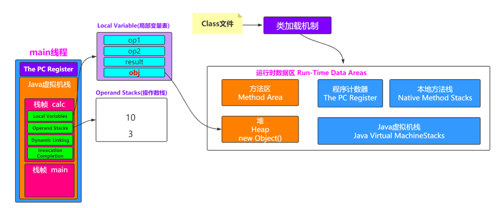

### JVM整理

## 一、JDK、JRE、JVM之间的关系

### 1、JDK、JRE、JVM之间的关系图


#### JVM

Java Virtual Machine是Java虚拟机，Java程序需要运行在虚拟机上，不同的平台有自己的虚拟机，因此Java语言可以实现跨平台。

#### JRE

Java Runtime Environment包括Java虚拟机和Java程序所需的核心类库等。核心类库主要是java.lang包：包含了运行Java程序必不可少的系统类，如基本数据类型、基本数学函数、字符串处理、线程、异常处理类等，系统缺省加载这个包如果想要运行一个开发好的Java程序，计算机中只需要安装JRE即可。

#### JDK

Java Development Kit是提供给Java开发人员使用的，其中包含了Java的开发工具，也包括了JRE。所以安装了JDK，就无需再单独安装JRE了。其中的开发工具：编译工具(javac.exe)，打包工具(jar.exe)等

##  二、Java类的编译过程

* Person.java -> 词法分析器 -> tokens流 -> 语法分析器 -> 语法树/抽象语法树 -> 语义分析器 -> 注解抽象语法树 -> 字节码生成器 -> Person.class文件

## 三、类文件到虚拟机：（ClassLoader的工作原理）

###  1、ClassLoader 类加载器的作用：

* 负责将 Class 加载到 JVM 中
* 审查每个类由谁加载（父优先的等级加载机制）
* 将 Class 字节码重新解析成 JVM 统一要求的对象格式

类从被加载到虚拟机内存中开始，直到卸载出内存为止，它的整个生命周期包括了：加载、验证、准备、解析、初始化、使用和卸载这7个阶段。其中，验证、准备和解析这三个部分统称为连接（linking）。


* 加载（load）：查找和导入class
  * (1)通过一个类的全限定名获取定义此类的二进制字节流
  *  (2)将这个字节流所代表的静态存储结构转化为方法区的运行时数据结构 
  * (3)在Java堆中生成一个代表这个类的java.lang.Class对象，作为对方法区中这些数据的访问入口
* 验证：
  * 目的是确保Class文件的字节流中包含的信息符合当前虚拟机的要求，保证类加载的正确性。
* 准备：为类的静态变量分配内存，并将其初始化为默认值。
  * 准备阶段是正式为类变量分配内存并设置类变量初始值的阶段，这些变量所使用的内存都将在方法去中进行分配。这时候进行内存分配的仅包括类变量（static），而不包括实例变量，实例变量将会在对象实例化时随着对象一起分配在Java堆中。
* 解析：解析阶段是虚拟机将常量池内的符号（Class文件内的符号）引用替换为直接引用（指针）的过程。
* 初始化：对类的静态变量，静态代码块执行初始化操作。

## 补充问题：

### 1、对象创建的方式？

| 创建方式                           | 解释             |
| ---------------------------------- | ---------------- |
| 使用new关键字                      | 调用了构造函数   |
| 使用Class的newInstance方法         | 调用了构造函数   |
| 使用Constructor类的newInstance方法 | 调用了构造函数   |
| 使用clone方法                      | 没有调用构造函数 |
| 使用反序列化                       | 没有调用构造函数 |

###  2、对象的创建过程是什么样的？


虚拟机遇到一条new指令时，先检查常量池是否已经加载相应的类，如果没有，必须先执行相应的类加载。类加载通过后，接下来分配内存。若Java堆中内存是绝对规整的，使用“`指针碰撞`“方式分配内存；如果不是规整的，就从空闲列表中分配，叫做“`空闲列表`”方式。划分内存时还需要考虑一个问题-并发，也有两种方式: CAS同步处理，或者本地线程分配缓冲(Thread Local Allocation Buffer, TLAB)。然后内存空间初始化操作，接着是做一些必要的对象设置(元信息、哈希码…)，最后执行`<init>`方法。


* 类加载检查
  虚拟机遇到一条 new 指令时，首先将去检查这个指令的参数是否能在常量池中定位到这个类的符号引用，并且检查这个符号引用代表的类是否已被加载过、解析和初始化过。如果没有，那必须先执行相应的类加载过程。

* 分配内存（根据Java堆内存是否规整两种形式：`指针碰撞、空闲列表`）
  在类加载检查通过后，接下来虚拟机将为新生对象分配内存。对象所需的内存大小在类加载完成后便可确定，为对象分配空间的任务等同于把一块确定大小的内存从 Java 堆中划分出来。分配方式有 `“指针碰撞” 和 “空闲列表”` 两种，选择哪种分配方式由 Java 堆`是否规整`决定，而 Java 堆是否规整又由所采用的垃圾收集器是否带有压缩整理功能决定。
  * `指针碰撞`：如果Java堆的内存是规整，即所有用过的内存放在一边，而空闲的的放在另一边。中间放一指针作为分界点指示器，分配内存时将位于中间的指针指示器向空闲的内存移动一段与对象大小相等的距离，这样便完成分配内存工作。
  * `空闲列表`：如果Java堆的内存不是规整的，则需要由虚拟机维护一个列表来记录那些内存是可用的，这样在分配的时候可以从列表中查询到足够大的内存分配给对象，并在分配后更新列表记录。

* 处理并发安全问题
  对象的创建在虚拟机中是一个非常频繁的行为，哪怕只是修改一个指针所指向的位置，在并发情况下也是不安全的，可能出现正在给对象 A 分配内存，指针还没来得及修改，对象 B 又同时使用了原来的指针来分配内存的情况。解决这个问题有两种方案：
  * 对分配内存空间的动作进行同步处理（采用 CAS + 失败重试来保障更新操作的原子性）；
  * 把内存分配的动作按照线程划分在不同的空间之中进行，即每个线程在 Java 堆中预先分配一小块内存，称为`本地线程分配缓冲`（Thread Local Allocation Buffer, TLAB）。哪个线程要分配内存，就在哪个线程的 TLAB 上分配。只有 TLAB 用完并分配新的 TLAB 时，才需要同步锁。通过-XX:+/-UserTLAB参数来设定虚拟机是否使用TLAB。
* 初始化零值
  内存分配完成后，虚拟机需要将分配到的内存空间都初始化为零值（不包括对象头），这一步操作保证了对象的实例字段在 Java 代码中可以不赋初始值就直接使用，程序能访问到这些字段的数据类型所对应的零值。

* 设置对象头
  初始化零值完成之后，虚拟机要对对象进行必要的设置，例如这个对象是哪个类的实例、如何才能找到类的元数据信息、对象的哈希码、对象的 GC 分代年龄等信息。 这些信息存放在对象头中。 另外，根据虚拟机当前运行状态的不同，如是否启用偏向锁等，对象头会有不同的设置方式。

* 执行init方法
  在上面工作都完成之后，从虚拟机的视角来看，一个新的对象已经产生了，但从 Java 程序的视角来看，对象创建才刚开始，`<init>` 方法还没有执行，所有的字段都还为零。所以一般来说，执行 new 指令之后会接着执行 `<init>` 方法，把对象按照程序员的意愿进行初始化，这样一个真正可用的对象才算完全产生出来。

###  3、对象的访问定位

Java程序需要通过 JVM 栈上的引用访问堆中的具体对象。对象的访问方式取决于 JVM 虚拟机的实现。目前主流的访问方式有 `句柄 和 直接指针` 两种方式。

>  指针： 指向对象，代表一个对象在内存中的起始地址。
>
>  句柄： 可以理解为指向指针的指针，维护着对象的指针。句柄不直接指向对象，而是指向对象的指针（句柄不发生变化，指向固定内存地址），再由对象的指针指向对象的真实内存地址。

####  1、句柄访问

Java堆中划分出一块内存来作为句柄池，引用中存储对象的句柄地址，而句柄中包含了对象实例数据与对象类型数据各自的具体地址信息，具体构造如下图所示：


优势：引用中存储的是稳定的句柄地址，在对象被移动（垃圾收集时移动对象是非常普遍的行为）时只会改变句柄中的实例数据指针，而引用本身不需要修改。

####   2、直接指针

如果使用直接指针访问，引用 中存储的直接就是对象地址，那么Java堆对象内部的布局中就必须考虑如何放置访问类型数据的相关信息。


优势：速度更快，节省了一次指针定位的时间开销。由于对象的访问在Java中非常频繁，因此这类开销积少成多后也是非常可观的执行成本。HotSpot 中采用的就是这种方式。

## 三、双亲委派模型

###  1、JVM类加载器？


* 1)Bootstrap ClassLoader 负责加载$JAVA_HOME中 jre/lib/`rt.jar` 里所有的class或 Xbootclassoath选项指定的jar包。由C++实现，不是ClassLoader子类。
* 2)Extension ClassLoader 负责加载java平台中扩展功能的一些jar包，包括$JAVA_HOME中 `jre/lib/*.jar` 或 -Djava.ext.dirs指定目录下的jar包。
* 3)App ClassLoader 负责加载classpath中指定的jar包及 Djava.class.path 所指定目录下的类和 jar包。
* 4)Custom ClassLoader 通过java.lang.ClassLoader的子类自定义加载class，属于应用程序根据 自身需要自定义的ClassLoader，如tomcat、jboss都会根据j2ee规范自行实现ClassLoader。

#### 加载原则：

* 检查某个类是否已经加载：顺序是自底向上，从Custom ClassLoader 到BootStrap ClassLoader 逐层检查，只要某个ClassLoader已经加载，就为已加载此类，保证此类只加载一次。
* 加载顺序：自顶向下，就是由上层逐层尝试加载此类。

###  2、双亲委派机制

* **定义**：如果一个类加载器在接到加载类的请求时，它首先不会自己尝试去加载这个类，而是把这个请求任务委托给父类加载器去完成，依次向上，如果父类加载器可以完成加载任务，就成功返回。只有父类加载器无法完成加载任务时才会自己去加载。
* **优势**：Java类随着加载它的类加载器一起具备一种带有优先级的层级关系。举例如：`Java中的Object类`，它存放在`rt.jar`之中，无论哪个一个类加载器要加载这个类，最终都是委派给处于模型最顶端的启动类加载器进行加载，因此Object在各种类加载环境中都是同一个类。如果不采用双亲委派模型，那么由各个类加载器自己去加载的话，那么系统中就会有多种不同的Object类。

## 补充问题：

### 1、双亲委派模型的"破坏"

一个典型的例子便是JNDI服务，JNDI现在已经是Java的标准服务，它的代码由启动类加载器去加载(在JDK 1.3时放进去的rt.jar)，但JNDI的目的就是对资源进行集中管理和查找，它需要调用由独立厂商实现并部署在应用程序的ClassPath下的JNDI接口提供者(SPI,Service Provider Interface)的代码，但启动类加载器不可能“认识”这些代码那该怎么办?

为了解决这个问题，Java设计团队只好引入了一个不太优雅的设计：线程上下文类加载器(Thread Context ClassLoader)。这个类加载器可以通过java.lang.Thread类的 setContextClassLoaser()方法进行设置，如果创建线程时还未设置，它将会从父线程中继承 一个，如果在应用程序的全局范围内都没有设置过的话，那这个类加载器默认就是应用程序类加载器。

有了线程上下文类加载器，就可以做一些“舞弊”的事情了，JNDI服务使用这个线程上下 文类加载器去加载所需要的SPI代码，也就是父类加载器请求子类加载器去完成类加载的动作，这种行为实际上就是打通了双亲委派模型的层次结构来逆向使用类加载器，实际上已经违背了双亲委派模型的一般性原则，但这也是无可奈何的事情。Java中所有涉及SPI的加载动 作基本上都采用这种方式，例如JNDI、JDBC、JCE、JAXB和JBI等。

###  2、JDBC和双亲委派模型关系

JDBC违法了双亲委派模型的关系。

先得知道SPI(Service Provider Interface)，这玩意和API不一样，它是面向拓展的，也就是定义了这个SPI，具体如何实现由扩展者实现。

JDBC就是如此，在rt里面定义了这个SPI，那mysql有mysql的jdbc实现，oracle有oracle的jdbc实现，java不管你内部如何实现的，反正你们都得统一按我这个来，这样我们java开发者才能容易的调用数据库操作。所以因为这样那就不得不违反这个约束啊，Bootstrap ClassLoader就得委托子类来加载数据库厂商们提供的具体实现。因为它的手只能摸到`<JAVA_HOME>\lib`中，其他的它无能为力，这就违反了自下而上的委托机制了。

Java就搞了个线程上下文类加载器，通过`setContextClassLoader()`默认情况就是应用程序类加载器然后`Thread.current.currentThread().getContextClassLoader()`获得类加载器来加载。

## 四、JVM 的主要组成部分及其作用？


JVM包含`两个子系统和两个组件`: 两个子系统为：Class loader(类装载)、Execution engine(执行引擎)；两个组件为Runtime data area(运行时数据区)、Native Interface(本地接口)。

* Class loader(类装载)：根据给定的全限定名类名(如：java.lang.Object)来装载class文件到Runtime data area中的method area。
* Execution engine（执行引擎）：执行classes中的指令。
* Native Interface(本地接口)：与native libraries交互，是其它编程语言交互的接口。
* `Runtime data area`(运行时数据区域)：这就是我们常说的JVM的内存。

`一个类从编译到计算机可执行过程` ：首先通过javac编译器把 .java结尾的代码转换成.class结尾的字节码，类加载器（ClassLoader）再把字节码加载到内存中，将其放在运行时数据区（Runtime data area）的方法区内，而字节码文件只是 JVM 的一套指令集规范，并不能直接交给底层操作系统去执行，因此需要特定的命令解析器执行引擎（Execution Engine），将字节码翻译成底层系统指令，再交由 CPU 去执行，而这个过程中需要调用其他语言的本地库接口（Native Interface）来实现整个程序的功能。


## 五、运行时数据区域（重要）

###  0、Java 内存区域和内存模型是不一样的东西：

* 内存区域是指 Jvm 运行时将数据分区域存储，强调对内存空间的划分。
* 而内存模型（Java Memory Model，简称 JMM ）是定义了线程和主内存之间的抽象关系，即 JMM 定义了 JVM 在计算机内存(RAM)中的工作方式。

主要的运行时数据如下：


JDK8 之前的内存区域图如下:


JDK8 之后的内存区域图如下:


### 1、方法区

方法区（Method Area）各个`线程共享`的内存区域，在虚拟机启动时创建。它用于存储已被虚拟机加载的`类信息、常量、静态变量、即时编译器编译后的代码`等数据。虽然Java 虚拟机规范把方法区描述为堆的一个逻辑部分，但是它却有一个别名叫做 Non-Heap（非堆），目的应该是与 Java 堆区分开来。

Java 虚拟机规范对方法区的限制非常宽松，除了和 Java 堆一样不需要连续的内存和可以选择固定大小或者可扩展外，还可以选择不实现垃圾收集。垃圾收集行为在这个区域是比较少出现的，其内存回收目标主要是针对常量池的回收和对类型的卸载。当方法区无法满足内存分配需求时，将抛出 OutOfMemoryError 异常。

`JDK8 之前，Hotspot 中方法区的实现是永久代（Perm），JDK8 开始使用元空间（Metaspace），以前永久代所有内容的字符串常量移至堆内存，其他内容移至元空间，元空间直接在本地内存分配。`

####  为什么要使用元空间取代永久代的实现？

* 字符串存在永久代中，容易出现性能问题和内存溢出。
* 类及方法的信息等比较难确定其大小，因此对于永久代的大小指定比较困难，太小容易出现永久代溢出，太大则容易导致老年代溢出。
* 永久代会为 GC 带来不必要的复杂度，并且回收效率偏低。
* 将 HotSpot 与 JRockit 合二为一。

###  2、Java堆

Java堆是Java虚拟机所管理内存中最大的一块，在虚拟机启动时创建，被所有线程共享。此内存区域的唯一目的就是存放对象实例，几乎所有的对象实例都在这里分配内存。

堆是垃圾收集器管理的主要区域，因此很多时候也被称做 “GC堆”（Garbage Collected Heap）。从内存回收的角度来看，由于现在收集器基本都采用分代收集算法，所以 Java 堆中还可以细分为：新生代和老年代；再细致一点的有 Eden 空间、From Survivor 空间、To Survivor 空间等。从内存分配的角度来看，线程共享的 Java 堆中可能划分出多个线程私有的分配缓冲区（Thread Local Allocation Buffer,TLAB）。

Java 堆可以处于物理上不连续的内存空间中，只要逻辑上是连续的即可，当前主流的虚拟机都是按照可扩展来实现的（通过 -Xmx 和 -Xms 控制）。如果在堆中没有内存完成实例分配，并且堆也无法再扩展时，将会抛出 OutOfMemoryError 异常。

###  3、Java虚拟机栈（常说的栈）

Java 虚拟机栈（Java Virtual Machine Stacks）`线程私有的`，它的生命周期与线程相同。

虚拟机栈描述的是 Java 方法执行的`内存模型`：每个方法在执行的同时都会创建一个`栈帧`（Stack Frame，是方法运行时的基础数据结构）用于存储`局部变量表、操作数栈、动态链接、方法出口`等信息。每一个方法从调用直至执行完成的过程，对应着一个栈帧在虚拟机栈中入栈到出栈的过程。

在活动线程中，只有位于栈顶的帧才是有效的，称为当前栈帧。正在执行的方法称为当前方法，栈帧是方法运行的基本结构。在执行引擎运行时，所有指令都只能针对当前栈帧进行操作。


#### 局部变量表

局部变量表是存放`方法参数和局部变量`的区域。 局部变量没有准备阶段， 必须显式初始化。如果是非静态方法，则在 index[0] 位置上存储的是方法所属对象的实例引用，一个引用变量占 4 个字节，随后存储的是参数和局部变量。字节码指令中的 STORE 指令就是将操作栈中计算完成的局部变呈写回局部变量表的存储空间内。

虚拟机栈规定了两种异常状况：如果线程请求的栈深度大于虚拟机所允许的深度，将抛出 StackOverflowError 异常；如果虚拟机栈可以动态扩展（当前大部分的 Java 虚拟机都可动态扩展），如果扩展时无法申请到足够的内存，就会抛出 OutOfMemoryError 异常。

#### 操作栈

以压栈和出栈的方式存储操作数的

操作栈是个初始状态为空的桶式结构栈。在方法执行过程中， 会有各种指令往栈中写入和提取信息。JVM 的执行引擎是基于栈的执行引擎， 其中的栈指的就是操作栈。字节码指令集的定义都是基于栈类型的，栈的深度在方法元信息的 stack 属性中。

#### 动态链接

每个栈帧都包含一个指向运行时常量池中该栈帧所属方法的引用， 目的是支持方法调用过程的动态连接。

#### 方法返回地址

当一个方法开始执行后,只有两种方式可以退出，一种是遇到方法返回的字节码指令；一种是遇见异常，并且 这个异常没有在方法体内得到处理。

无论何种退出情况，都将返回至方法当前被调用的位置。方法退出的过程相当于弹出当前栈帧，退出可能有三种方式：返回值压入上层调用栈帧/异常信息抛给能够处理的栈帧/PC计数器指向方法调用后的下一条指令。

#### i++ 和 ++i 的区别：

* i++：从局部变量表取出 i 并压入操作栈，然后对局部变量表中的 i 自增 1，将操作栈栈顶值取出使用，最后，使用栈顶值更新局部变量表，如此线程从操作栈读到的是自增之前的值。
* ++i：先对局部变量表的 i 自增 1，然后取出并压入操作栈，再将操作栈栈顶值取出使用，最后，使用栈顶值更新局部变量表，线程从操作栈读到的是自增之后的值。
  之所以说 i++ 不是原子操作，即使使用 volatile 修饰也不是线程安全，就是因为，可能 i 被从局部变量表（内存）取出，压入操作栈（寄存器），操作栈中自增，使用栈顶值更新局部变量表（寄存器更新写入内存），其中分为 3 步，volatile 保证可见性，保证每次从局部变量表读取的都是最新的值，但可能这 3 步可能被另一个线程的 3 步打断，产生数据互相覆盖问题，从而导致 i 的值比预期的小。

### 堆栈的区别：

* 物理地址：
  * 堆的物理地址对对象是不连续的，因此性能会慢些。GC的时候也考虑到不连续性，所以会有多种垃圾回收算法。
  * 栈使用的是数据结构中的栈，先进后出（FILO），物理地址是连续的，性能快些。
* 内存分配：
  * 堆因为是不连续的，所以在分配内存时是在`运行期`确认的，因此大小不固定。（堆远大于栈）
  * 栈是连续的，分配内存是在`编译期`确定，大小固定
* 存放内容：
  * 堆存放：对象的实例及数组，因此该区域更关注数据的存储。
  * 栈存放：局部变量、操作数栈、返回结果。更关注程序方法的执行。
  * 静态变量存放在方法区，静态对象还是存放于堆中。
* 程序的可见性
  * 堆对于整个应用程序都是可见的，共享的
  * 栈只对当前线程可见，线程私有的。

###  4、程序计数器（The pc Register）

程序计数器（Program Counter Register）是一块较小的内存空间，当前线程所执行的字节码的行号指示器。

 Java 虚拟机的多线程是通过线程轮流切换并分配处理器执行时间来实现的，在任何一个确定的时刻，一个处理器内核都只会执行一条线程中的指令。因此，为了线程切换后能恢复到正确的执行位置，每条线程都需要有一个独立的程序计数器，各条线程之间计数器互不影响，独立存储，`“线程私有”`的内存。

*  如果线程正在执行的是一个 Java 方法，这个计数器记录的是正在执行的虚拟机字节码指令的地址；
*  如果正在执行的是 Native 方法，这个计数器值则为空（Undefined）。

此内存区域是唯一一个在 Java 虚拟机规范中没有规定任何 OutOfMemoryError 情况的区域。

### 5、本地方法栈

如果当前线程执行的方法是Native类型的，这些方法就会在本地方法栈中执行。

本地方法栈（Native Method Stack）与虚拟机栈所发挥的作用是非常相似的，它们之间的区别不过是虚拟机栈为虚拟机执行 Java 方法（也就是字节码）服务，而本地方法栈则为虚拟机使用到的 Native 方法服务。Sun HotSpot 虚拟机直接就把本地方法栈和虚拟机栈合二为一。与虚拟机栈一样，本地方法栈区域也会抛出 StackOverflowError 和 OutOfMemoryError 异常。

线程开始调用本地方法时，会进入 个不再受 JVM 约束的世界。本地方法可以通过 JNI(Java Native Interface)来访问虚拟机运行时的数据区，甚至可以调用寄存器，具有和 JVM 相同的能力和权限。 当大量本地方法出现时，势必会削弱 JVM 对系统的控制力，因为它的出错信息都比较黑盒。对内存不足的情况，本地方法栈还是会抛出 nativeheapOutOfMemory。

JNI 类本地方法最著名的应该是 System.currentTimeMillis() ，JNI使 Java 深度使用操作系统的特性功能，复用非 Java 代码。 但是在项目过程中， 如果大量使用其他语言来实现 JNI , 就会丧失跨平台特性。


## 补充内容：

### 运行时常量池

运行时常量池（Runtime Constant Pool）是方法区的一部分。Class 文件中除了有类的版本、字段、方法、接口等描述信息外，还有一项信息是常量池（Constant Pool Table），用于存放编译期生成的各种字面量和符号引用，这部分内容将在类加载后进入方法区的运行时常量池中存放。

一般来说，除了保存 Class 文件中描述的符号引用外，还会把翻译出来的直接引用也存储在运行时常量池中。

运行时常量池相对于 Class 文件常量池的另外一个重要特征是具备动态性，Java 语言并不要求常量一定只有编译期才能产生，也就是并非预置入 Class 文件中常量池的内容才能进入方法区运行时常量池，运行期间也可能将新的常量放入池中，这种特性被开发人员利用得比较多的便是 String 类的 intern() 方法。

既然运行时常量池是方法区的一部分，自然受到方法区内存的限制，当常量池无法再申请到内存时会抛出 OutOfMemoryError 异常。

### 直接内存

直接内存（Direct Memory）并不是虚拟机运行时数据区的一部分，也不是 Java 虚拟机规范中定义的内存区域。

在 JDK 1.4 中新加入了 NIO，引入了一种基于通道（Channel）与缓冲区（Buffer）的 I/O 方式，它可以使用 Native 函数库直接分配堆外内存，然后通过一个存储在 Java 堆中的 DirectByteBuffer 对象作为这块内存的引用进行操作。这样能在一些场景中显著提高性能，因为避免了在 Java 堆和 Native 堆中来回复制数据。

显然，本机直接内存的分配不会受到 Java 堆大小的限制，但是，既然是内存，肯定还是会受到本机总内存（包括 RAM 以及 SWAP 区或者分页文件）大小以及处理器寻址空间的限制。服务器管理员在配置虚拟机参数时，会根据实际内存设置 -Xmx 等参数信息，但经常忽略直接内存，使得各个内存区域总和大于物理内存限制（包括物理的和操作系统级的限制），从而导致动态扩展时出现 OutOfMemoryError 异常。

## 补充内容：

###  1、简单介绍一下Java内存模型

Java内存模型是共享内存的并发模型，线程之间主要通过读-写共享变量（堆内存中的实例域，静态域和数组元素）来完成隐式通信。Java 内存模型（JMM）控制 Java 线程之间的通信，决定一个线程对共享变量的写入何时对另一个线程可见。

#### 计算机高速缓存和缓存一致性

计算机在高速的 CPU 和相对低速的存储设备之间使用高速缓存，作为内存和处理器之间的缓冲。将运算需要使用到的数据复制到缓存中，让运算能快速运行，当运算结束后再从缓存同步回内存之中。

在多处理器的系统中(或者单处理器多核的系统)，每个处理器内核都有自己的高速缓存，它们有共享同一主内存(Main Memory)。当多个处理器的运算任务都涉及同一块主内存区域时，将可能导致各自的缓存数据不一致。

为此，需要各个处理器访问缓存时都遵循一些协议，在读写时要根据协议进行操作，来维护缓存的一致性。


#### JVM主内存与工作内存

Java 内存模型的主要目标是定义程序中各个变量的访问规则，即在虚拟机中将变量（线程共享的变量）存储到内存和从内存中取出变量这样底层细节。

Java内存模型中规定了所有的变量都存储在主内存中，每条线程还有自己的工作内存，线程对变量的所有操作都必须在工作内存中进行，而不能直接读写主内存中的变量。这里的工作内存是 JMM 的一个抽象概念，也叫本地内存，其存储了该线程以读 / 写共享变量的副本。

就像每个处理器内核拥有私有的高速缓存，JMM 中每个线程拥有私有的本地内存。不同线程之间无法直接访问对方工作内存中的变量，线程间的通信一般有两种方式进行，一是通过消息传递，二是共享内存。Java 线程间的通信采用的是共享内存方式，线程、主内存和工作内存的交互关系如下图所示：


这里所讲的主内存、工作内存与 Java 内存区域中的 Java 堆、栈、方法区等并不是同一个层次的内存划分，这两者基本上是没有关系的，如果两者一定要勉强对应起来，那从变量、主内存、工作内存的定义来看，主内存主要对应于Java堆中的对象实例数据部分，而工作内存则对应于虚拟机栈中的部分区域。

###  2、重排序和happens-before规则

#### 重排序

在执行程序时为了提高性能，编译器和处理器常常会对指令做重排序。重排序分三种类型：

* 编译器优化的重排序。编译器在不改变单线程程序语义的前提下，可以重新安排语句的执行顺序。
* 指令级并行的重排序。现代处理器采用了指令级并行技术（Instruction-Level Parallelism， ILP）来将多条指令重叠执行。如果不存在数据依赖性，处理器可以改变语句对应机器指令的执行顺序。
* 内存系统的重排序。由于处理器使用缓存和读 / 写缓冲区，这使得加载和存储操作看上去可能是在乱序执行。
  从 java 源代码到最终实际执行的指令序列，会分别经历下面三种重排序：


JMM 属于语言级的内存模型，它确保在不同的编译器和不同的处理器平台之上，通过禁止特定类型的编译器重排序和处理器重排序，为程序员提供一致的内存可见性保证。java 编译器禁止处理器重排序是通过在生成指令序列的适当位置会插入内存屏障（重排序时不能把后面的指令重排序到内存屏障之前的位置）指令来实现的。

#### happens-before

从 JDK5 开始，java 内存模型提出了 happens-before 的概念，通过这个概念来阐述操作之间的内存可见性。如果一个操作执行的结果需要对另一个操作可见，那么这两个操作之间必须存在 happens-before 关系。这里提到的两个操作既可以是在一个线程之内，也可以是在不同线程之间。这里的“可见性”是指当一条线程修改了这个变量的值，新值对于其他线程来说是可以立即得知的。

如果 A happens-before B，那么 Java 内存模型将向程序员保证—— A 操作的结果将对 B 可见，且 A 的执行顺序排在 B 之前。

重要的 happens-before 规则如下：

* 程序顺序规则：一个线程中的每个操作，happens- before 于该线程中的任意后续操作。
* 监视器锁规则：对一个监视器锁的解锁，happens- before 于随后对这个监视器锁的加锁。
* volatile 变量规则：对一个 volatile 域的写，happens- before 于任意后续对这个 volatile 域的读。
* 传递性：如果 A happens- before B，且 B happens- before C，那么 A happens- before C。

下图是 happens-before 与 JMM 的关系


###  3、volatile关键字

>保证可见性
>
>不保证原子性
>
>禁止指令重排

volatile 可以说是 JVM 提供的最轻量级的同步机制，当一个变量定义为volatile之后，它将具备两种特性：

**保证此变量对所有线程的可见性**。
而普通变量不能做到这一点，普通变量的值在线程间传递均需要通过主内存来完成。注意，volatile 虽然保证了可见性，但是 Java 里面的运算并非原子操作，导致 volatile 变量的运算在并发下一样是不安全的。而 synchronized 关键字则是由“一个变量在同一个时刻只允许一条线程对其进行 lock 操作”这条规则获得线程安全的。

**禁止指令重排序优化**。
普通的变量仅仅会保证在该方法的执行过程中所有依赖赋值结果的地方都能获取到正确的结果，而不能保证变量赋值操作的顺序与程序代码中的执行顺序一致。

###  4、垃圾回收器的基本原理是什么？垃圾回收器可以马上回收内存吗？有什么办法主动通知虚拟机进行垃圾回收？

对于GC来说，当程序员创建对象时，GC就开始监控这个对象的地址、大小以及使用情况。

通常，GC采用有向图的方式记录和管理堆(heap)中的所有对象。通过这种方式确定哪些对象是"可达的"，哪些对象是"不可达的"。当GC确定一些对象为"不可达"时，GC就有责任回收这些内存空间。

可以。程序员可以手动执行System.gc()，通知GC运行，但是Java语言规范并不保证GC一定会执行。

## 六、内存分配策略

#### 1、简述java内存分配与回收策略

所谓自动内存管理，最终要解决的也就是内存分配和内存回收两个问题。

###  2、内存分配与回收策略（重要）

对象的内存分配，大方向上，就是在堆上分配，对象主要分配在新生代的Eden区上。少数情况下也可能会直接分配在老年代中，分配的规则并不是百分之百固定的，其细节取决于当前使用的是哪一种垃圾收集器组合，还有虚拟机中与内存相关的参数的设置。


对象的内存分配通常是在 Java 堆上分配（随着虚拟机优化技术的诞生，某些场景下也会在栈上分配，后面会详细介绍），对象主要分配在新生代的 Eden 区，如果启动了本地线程缓冲，将按照线程优先在 TLAB 上分配。少数情况下也会直接在老年代上分配。总的来说分配规则不是百分百固定的，其细节取决于哪一种垃圾收集器组合以及虚拟机相关参数有关，但是虚拟机对于内存的分配还是会遵循以下几种「普世」规则：

##### 1、对象优先在 Eden 区分配

多数情况，对象都在新生代 Eden 区分配。当 Eden 区分配没有足够的空间进行分配时，虚拟机将会发起一次 Minor GC。如果本次 GC 后还是没有足够的空间，则将启用分配担保机制在老年代中分配内存。

这里我们提到 Minor GC，如果你仔细观察过 GC 日常，通常我们还能从日志中发现 Major GC/Full GC。

* Minor GC 是指发生在新生代的 GC，因为 Java 对象大多都是朝生夕死，所有 Minor GC 非常频繁，一般回收速度也非常快；
* Major GC/Full GC 是指发生在老年代的 GC，出现了 Major GC 通常会伴随至少一次 Minor GC。Major GC 的速度通常会比 Minor GC 慢 10 倍以上。

##### 2、大对象直接进入老年代

所谓大对象是指需要大量连续内存空间的对象，频繁出现大对象是致命的，会导致在内存还有不少空间的情况下提前触发 GC 以获取足够的连续空间来安置新对象。

前面我们介绍过新生代使用的是标记-清除算法来处理垃圾回收的，如果大对象直接在新生代分配就会导致 Eden 区和两个 Survivor 区之间发生大量的内存复制。因此对于大对象都会直接在老年代进行分配。

##### 3、长期存活对象将进入老年代

虚拟机采用分代收集的思想来管理内存，那么内存回收时就必须判断哪些对象应该放在新生代，哪些对象应该放在老年代。因此虚拟机给每个对象定义了一个对象年龄的计数器，如果对象在 Eden 区出生，并且能够被 Survivor 容纳，将被移动到 Survivor 空间中，这时设置对象年龄为 1。对象在 Survivor 区中每「熬过」一次 Minor GC 年龄就加 1，当年龄达到一定程度（默认 15） 就会被晋升到老年代。

##  七、垃圾回收机制

###  1、垃圾回收主要关注 Java 堆

Java 内存运行时区域中的`程序计数器、虚拟机栈、本地方法栈随线程生命周期`；栈中的栈帧随着方法的进入和退出而有条不紊地执行着出栈和入栈操作。每一个栈帧中分配多少内存基本上是在类结构确定下来时就已知的（尽管在运行期会由 JIT 编译器进行一些优化），因此这几个区域的内存分配和回收都具备确定性，不需要过多考虑回收的问题，因为方法结束或者线程结束时，内存自然就跟随着回收了。

而 Java 堆不一样，一个接口中的多个实现类需要的内存可能不一样，一个方法中的多个分支需要的内存也可能不一样，我们只有在程序处于运行期间时才能知道会创建哪些对象，这部分内存的分配和回收都是动态的，垃圾收集器所关注的是这部分内存。

###  2、判断哪些对象需要被回收（两种方法）

#### ①、引用计数法

给对象添加一引用计数器，被引用一次计数器值就加 1；当引用失效时，计数器值就减 1；计数器为 0 时，对象就是不可能再被使用的，简单高效，缺点是`无法解决对象之间相互循环引用`的问题。

#### ②、可达性分析算法

通过一系列的称为 "GC Roots" 的对象作为起始点，从这些节点开始向下搜索，搜索所走过的路径称为引用链（Reference Chain），当一个对象到 GC Roots 没有任何引用链相连时，则证明此对象是不可用的。此算法解决了上述循环引用的问题。


##### 可作为 GC Roots 的对象包括下面几种：（重要）

* a. 虚拟机栈（栈帧中的本地变量表）中引用的对象。
* b. 方法区中类静态属性引用的对象。
* c. 方法区中常量引用的对象。
* d. 本地方法栈中 JNI（Native方法）引用的对象

作为 GC Roots 的节点主要在全局性的引用与执行上下文中。要明确的是，tracing gc必须以当前存活的对象集为 Roots，因此必须选取确定存活的引用类型对象。

`GC 管理的区域是Java堆`，虚拟机栈、方法区和本地方法栈不被 GC 所管理，因此选用这些区域内引用的对象作为 GC Roots，是不会被 GC 所回收的。其中虚拟机栈和本地方法栈都是线程私有的内存区域，只要线程没有终止，就能确保它们中引用的对象的存活。而方法区中类静态属性引用的对象是显然存活的。常量引用的对象在当前可能存活，因此，也可能是 GC roots 的一部分。

#### 可达性分析算法

不可达的对象将暂时处于“缓刑”阶段，要真正宣告一个对象死亡，至少要经历两次标记过程：

* 如果对象在进行可达性分析后发现没有与 GC Roots 相连接的引用链，那它将会被第一次标记并且进行一次筛选，筛选的条件是此对象是否有必要执行 finalize() 方法。
* 当对象没有覆盖 finalize() 方法，或者 finalize() 方法已经被虚拟机调用过，虚拟机将这两种情况都视为“没有必要执行”，直接进行第二次标记。
* 如果这个对象被判定为有必要执行 finalize() 方法，那么这个对象将会放置在一个叫做 F-Queue 的队列之中，并在稍后由一个由虚拟机自动建立的、低优先级的 Finalizer 线程去执行它。

这里所谓的“执行”是指虚拟机会触发这个方法，但并不承诺会等待它运行结束，因为如果一个对象在 finalize() 方法中执行缓慢，将很可能会一直阻塞 F-Queue 队列，甚至导致整个内存回收系统崩溃。

值得注意的是，使用 finalize() 方法来“拯救”对象是不值得提倡的，它的运行代价高昂，不确定性大，无法保证各个对象的调用顺序。finalize() 能做的工作，使用 try-finally 或者其它方法都更适合、及时。

###  3、相关JVM的调优参数有哪些？在工作中怎么调优的？

#### JVM常见的调优参数包括：

* -Xmx：指定java程序的最大堆内存, 使用java -Xmx5000M -version判断当前系统能分配的最大堆内存
* -Xms：指定最小堆内存, 通常设置成跟最大堆内存一样，减少GC
* -Xmn：设置年轻代大小。整个堆大小=年轻代大小 + 年老代大小。所以增大年轻代后，将会减小年老代大小。此值对系统性能影响较大，Sun官方推荐配置为整个堆的3/8。
* -Xss：指定线程的最大栈空间，此参数决定了java函数调用的深度,，值越大调用深度越深,，若值太小则容易出栈溢出错误(StackOverflowError)
* -XX:PermSize：指定方法区(永久区)的初始值，默认是物理内存的1/64， 在Java8永久区移除, 代之的是元数据区， 由-XX:MetaspaceSize指定
* -XX:MaxPermSize：指定方法区的最大值, 默认是物理内存的1/4， 在java8中由-XX:MaxMetaspaceSize指定元数据区的大小
* -XX:NewRatio=n：年老代与年轻代的比值，-XX:NewRatio=2, 表示年老代与年轻代的比值为2:1
* -XX:SurvivorRatio=n：Eden区与Survivor区的大小比值，-XX:SurvivorRatio=8表示Eden区与Survivor区的大小比值是8:1:1，因为Survivor区有两个(from, to)


## 补充内容：

### JVM性能监控有哪些？

JDK的命令行工具

* jps(虚拟机进程状况工具)：jps可以列出正在运行的虚拟机进程，并显示虚拟机执行主类(Main Class,main()函数所在的类)名称 以及这些进程的本地虚拟机唯一ID(Local Virtual Machine Identifier,LVMID)。
* jstat(虚拟机统计信息监视工具)：jstat是用于监视虚拟机各种运行状态信息的命令行工 具。它可以显示本地或者远程虚拟机进程中的类装载、内存、垃圾收集、JIT编译等运行数据。
* jinfo(Java配置信息工具)：jinfo的作用是实时地查看和调整虚拟机各项参数。
* jmap(Java内存映像工具)：命令用于生成堆转储快照(一般称为heapdump或dump文 件)。如果不使用jmap命令，要想获取Java堆转储快照，还有一些比较“暴力”的手段:譬如 在第2章中用过的-XX:+HeapDumpOnOutOfMemoryError参数，可以让虚拟机在OOM异常出 现之后自动生成dump文件。jmap的作用并不仅仅是为了获取dump文件，它还可以查询finalize执行队列、Java堆和永 久代的详细信息，如空间使用率、当前用的是哪种收集器等。
* jhat(虚拟机堆转储快照分析工具)：jhat命令与jmap搭配使用，来分析jmap生成的堆 转储快照。jhat内置了一个微型的HTTP/HTML服务器，生成dump文件的分析结果后，可以在 浏览器中查看。
* jstack(Java堆栈跟踪工具)：jstack命令用于生成虚拟机当前时刻的线程快照。线程快照就是当前虚拟机内每一条线程正在执行的方法堆栈 的集合，生成线程快照的主要目的是定位线程出现长时间停顿的原因，如线程间死锁、死循 环、请求外部资源导致的长时间等待等都是导致线程长时间停顿的常见原因。线程出现停顿 的时候通过jstack来查看各个线程的调用堆栈，就可以知道没有响应的线程到底在后台做些 什么事情，或者等待着什么资源。

JDK的可视化工具

* JConsole
* VisualVM

## 补充内容：

###  1、强、软、弱、虚引用

JDK1.2 以前，一个对象只有被引用和没有被引用两种状态。后来，Java 对引用的概念进行了扩充，将引用分为强引用（Strong Reference）、软引用（Soft Reference）、弱引用（Weak Reference）、虚引用（Phantom Reference）4 种，这 4 种引用强度依次逐渐减弱。


* 强引用就是指在程序代码之中普遍存在的，类似"Object obj=new Object()"这类的引用，垃圾收集器永远不会回收存活的强引用对象。(发生 gc 的时候不会被回收。) （`重要`） 
* 软引用：还有用但并非必需的对象。在系统将要发生内存溢出异常之前 ，将会把这些对象列进回收范围之中进行第二次回收。(有用但不是必须的对象，在发生内存溢出之前会被回收。)
* 弱引用也是用来描述非必需对象的，被弱引用关联的对象 只能生存到下一次垃圾收集发生之前 。当垃圾收集器工作时，无论内存是否足够，都会回收掉只被弱引用关联的对象。(有用但不是必须的对象，在下一次GC时会被回收。)
* 虚引用是最弱的一种引用关系。 无法通过虚引用来取得一个对象实例 。为一个对象设置虚引用关联的唯一目的就是能在这个对象被收集器回收时收到一个系统通知。(无法通过虚引用获得对象，用 PhantomReference 实现虚引用，虚引用的用途是在 gc 时返回一个通知。)

###  2、Java 堆永久代的回收

永久代的垃圾收集主要回收两部分内容：`废弃常量和无用的类。`

* 回收废弃常量与回收 Java 堆中的对象非常类似。以常量池中字面量的回收为例，假如一个字符串"abc"已经进入了常量池中，但是当前系统没有任何一个 String 对象是叫做"abc"的，也没有其他地方引用了这个字面量，如果这时发生内存回收，而且必要的话，这个"abc"常量就会被系统清理出常量池。常量池中的其他类（接口）、方法、字段的符号引用也与此类似。
* 类需要同时满足下面 3 个条件才能算是“无用的类”：（重要）
  a. 该类所有的实例都已经被回收，也就是 Java 堆中不存在该类的任何实例。
  b. 加载该类的 ClassLoader 已经被回收。
  c. 该类对应的 java.lang.Class 对象没有在任何地方被引用，无法在任何地方通过反射访问该类的方法。

虚拟机可以对满足上述 3 个条件的无用类进行回收，这里说的仅仅是“可以”，而并不是和对象一样，不使用了就必然会回收。

在大量使用反射、动态代理、CGLib 等 ByteCode 框架、动态生成 JSP 以及 OSGi 这类频繁自定义 ClassLoader 的场景都需要虚拟机具备类卸载的功能，以保证永久代不会溢出。

## 补充内容：

### 1、各种指向：栈--》堆《--》方法区

#### 1、栈指向堆

如果在栈帧中有一个变量，类型为引用类型，比如Object obj=new Object()，这时候就是典型的栈中元素指向堆中的 对象。



#### 2、方法区指向堆：

方法区中会存放静态变量，常量等数据。如果是下面这种情况，就是典型的方法区中元素指向堆中的对象。

`private static Object obj=new Object(); ` 


#### 3、堆指向方法区

方法区中会包含类的信息，堆中会有对象，那怎么知道对象是哪个类创建的呢?


###  2、Java对象内存布局


* 一个对象在内存中包括3部分：对象头、实例数据、对齐填充。

###  3、内存模型图

* 一块是非堆区，一块是堆区。
  * 堆区分为两大块：一块是Old区，一块儿是Young区。
  * Young区分为两大块：一个是Survivor区（S0+S1），一块是Eden区。比例为：Eden：S0：S1=8：1：1 （S0和S1一样大，也可以加From和To）
    

#### 对象创建所在的区域：

一般情况下，新创建的对象都会被分配到Eden区，一些特殊的大对象会直接分配到Old区。


##  八、垃圾回收算法

### 一共有 4 种：`标记-清除算法、复制算法、标记整理算法、分代收集算法`

### 1、标记-清除算法

最基础的收集算法是“标记-清除”（Mark-Sweep）算法，分为“标记”和“清除”两个阶段：首先标记出所有需要回收的对象，在标记完成后统一回收所有被标记的对象。


它的主要不足有两个：

* 效率问题：标记和清除两个过程都比较耗时，效率不高；
* 空间问题：会产生大量不连续的内存碎片，空间碎片太多可能会导致以后在程序运行过程中需要分配较大对象时，无 法找到足够的连续内存而不得不提前触发另一次垃圾收集动作。

优点：

* 实现简单不需要对对象进行移动。

### 2、复制算法（年轻代）

为解决效率问题，一种称为“复制”（Copying）的收集算法出现，它将可用内存按容量划分为两个大小相等的区域，每次只使用其中的一块。当这一块的内存用完，就将还存活着的对象复制到另外一块上面，然后再把已使用过的内存空间一次清理掉。

这样使得每次都是对整个半区进行内存回收，内存分配时也就不用考虑内存碎片等复杂情况，只要移动堆顶指针，按顺序分配内存即可，实现简单，运行高效。只是这种算法的代价是将内存缩小为了原来的一半。复制算法的执行过程如下图：


现在的商业虚拟机都采用这种算法来回收新生代，IBM 研究指出新生代中的对象 98% 是“朝生夕死”的，所以并不需要按照 1:1 的比例来划分内存空间，而是将内存分为一块较大的 Eden 空间和两块较小的 Survivor 空间（8：1：1），每次使用 Eden 和其中一块 Survivor 。

当回收时，将 Eden 和 Survivor 中还存活着的对象一次性地复制到另外一块 Survivor 空间上，最后清理掉 Eden 和刚才用过的 Survivor 空间。HotSpot 虚拟机默认 Eden:Survivor = 8:1，也就是每次新生代中可用内存空间为整个新生代容量的 90%（其中一块Survivor不可用），只有 10% 的内存会被“浪费”。

当然，98%的对象可回收只是一般场景下的数据，我们没有办法保证每次回收都只有不多于 10% 的对象存活，当 Survivor 空间不够用时，需要依赖其他内存（这里指老年代）进行分配担保（Handle Promotion）。内存的分配担保也一样，如果另外一块 Survivor 空间没有足够空间存放上一次新生代收集下来的存活对象时，这些对象将直接通过分配担保机制进入老年代。

### 3、标记-整理算法（老年代）

复制算法在对象存活率较高时就要进行较多的复制操作，效率将会变低。更关键的是，如果不想浪费 50% 的空间，就需要有额外的空间进行分配担保，以应对被使用的内存中所有对象都 100% 存活的极端情况，所以在老年代一般不能直接选用这种算法。

根据老年代的特点，有人提出了另外一种“标记-整理”（Mark-Compact）算法，标记过程仍然与“标记-清除”算法一样，但后续步骤不是直接对可回收对象进行清理，而是让所有存活的对象都向一端移动，然后直接清理掉端边界以外的内存。


###  4、分代收集算法

当前商业虚拟机的垃圾收器都采用“分代收集”（Generational Collection）算法，根据对象存活周期的不同将内存划分为几块并采用不同的垃圾收集算法。

一般是把 Java 堆分为新生代和老年代，这样就可以根据各个年代的特点采用最适当的收集算法。在新生代中，每次垃圾收集时都发现有大批对象死去，只有少量存活，那就选用复制算法，只需要付出少量存活对象的复制成本就可以完成收集。而老年代中因为对象存活率高、没有额外空间对它进行分配担保，就必须使用“标记—清理”或者“标记—整理”算法来进行回收。

### 5、分代垃圾回收器是怎么工作的？（重要）

分代回收器有两个分区：老生代和新生代，新生代默认的空间占比总空间的 1/3，老生代的默认占比是 2/3。

新生代使用的是复制算法，新生代里有 3 个分区：Eden、To Survivor、From Survivor，它们的默认占比是 8:1:1，它的执行流程如下：

* 把 Eden + From Survivor 存活的对象放入 To Survivor 区；
* 清空 Eden 和 From Survivor 分区；
* From Survivor 和 To Survivor 分区交换，From Survivor 变 To Survivor，To Survivor 变 From Survivor。
* 每次在 From Survivor 到 To Survivor 移动时都存活的对象，年龄就 +1，当年龄到达 15（默认配置是 15）时，升级为老生代。大对象也会直接进入老生代。

老生代当空间占用到达某个值之后就会触发全局垃圾收回，一般使用标记整理的执行算法。以上这些循环往复就构成了整个分代垃圾回收的整体执行流程。


## 补充内容：

### 1、Minor GC和Full GC触发条件

#### 1、如何理解Minor/Major/Full GC

* Minor GC:新生代垃圾回收

* Major GC:老年代垃圾回收  

* Full GC:新生代+老年代 垃圾回收

#### 2、Minor GC触发条件：

* 当Eden区满时，触发Minor GC。

####  3、Full GC触发条件：

* System.gc()方法的调用
* 老年代空间不足
* 方法区空间不足
* 通过Minor GC后进入老年代的平均大小大于老年代的可用内存

由Eden区、From Space区向To Space区复制时，对象大小大于To Space可用内存，则把该对象转存到老年代，且老年代的可用内存小于该对象大小

###  2、Minor GC 和 Full GC 有什么不一样吗？

* 新生代 GC（Minor GC）：指发生在新生代的垃圾收集动作，因为 Java 对象大多都具备朝生夕死的特性，所以 Minor GC 非常频繁，一般回收速度也比较快。

* 老年代 GC（Major GC/Full GC）：指发生在老年代的 GC，出现了 Major GC，经常会伴随至少一次的 Minor GC（但非绝对的，在 Parallel Scavenge 收集器的收集策略里就有直接进行 Major GC 的策略选择过程）。Major GC 的速度一般会比 Minor GC 慢 10 倍以上。

###  3、GC中Stop the world（STW）

垃圾回收首先是要经过标记的，对象被标记后就会根据不同的区域采用不同的收集方法。垃圾回收并不会阻塞我们程序的线程，他是与当前程序并发执行的。所以问题就出在这里，当GC线程标记好了一个对象的时候，此时我们程序的线程又将该对象重新加入了“关系网”中，当执行二次标记的时候，该对象也没有重写finalize()方法，因此回收的时候就会回收这个不该回收的对象。 虚拟机的解决方法就是在一些特定指令位置设置一些“安全点”，当程序运行到这些“安全点”的时候就会`暂停所有当前运行的线程`（Stop The World 所以叫STW），暂停后再找到“GC Roots”进行关系的组建，进而执行标记和清除。 

这些特定的指令（安全点）位置主要在：（重要）

* 循环的末尾
* 方法临返回前 / 调用方法的call指令后
* 可能抛异常的位置

停顿类型就是STW，至于有GC和Full GC之分，主要是Full GC时STW的时间相对GC来说时间很长，因为Full GC针对整个堆以及永久代的，因此整个GC的范围大大增加；还有就是他的回收算法就是“标记–清除–整理”，这里也会损耗一定的时间。所以我们在优化JVM的时候，减少Full GC的次数也是经常用到的办法。 

##   九、各垃圾回收器的特点及区别，怎么做选择？

如果说收集算法是内存回收的方法论，那么垃圾收集器就是内存回收的具体实现。

* 回收新生代的有：Serial收集器（串行收集器）、ParNew收集器、Parallel Scavenge收集器；
* 回收老年代的：Serial Old 收集器、Parallel Old收集器、CMS收集器；
* 回收整个Java堆的G1收集器。

下图中7 种作用于不同分代的收集器，如果两个收集器之间存在连线，就说明它们可以搭配使用。重点分析 CMS 和 G1 这两款相对复杂的收集器，了解它们的部分运作细节。


###  0、总括：

* Serial收集器（复制算法): 新生代单线程收集器，标记和清理都是单线程，优点是简单高效；
* ParNew收集器 (复制算法): 新生代收并行集器，实际上是Serial收集器的多线程版本，在多核CPU环境下有着比Serial更好的表现；
* Parallel Scavenge收集器 (复制算法): 新生代并行收集器，追求高吞吐量，高效利用 CPU。吞吐量 = 用户线程时间/(用户线程时间+GC线程时间)，高吞吐量可以高效率的利用CPU时间，尽快完成程序的运算任务，适合后台应用等对交互相应要求不高的场景；
* Serial Old收集器 (标记-整理算法): 老年代单线程收集器，Serial收集器的老年代版本；
* Parallel Old收集器 (标记-整理算法)： 老年代并行收集器，吞吐量优先，Parallel Scavenge收集器的老年代版本；
* `CMS(Concurrent Mark Sweep)收集器（标记-清除算法）`： 老年代并行收集器，以获取最短回收停顿时间为目标的收集器，具有高并发、低停顿的特点，追求最短GC回收停顿时间。
* `G1(Garbage First)收集器 (标记-整理算法)`： Java堆并行收集器，G1收集器是JDK1.7提供的一个新收集器，G1收集器基于“标记-整理”算法实现，也就是说不会产生内存碎片。此外，G1收集器不同于之前的收集器的一个重要特点是：G1回收的范围是整个Java堆(包括新生代，老年代)，而前六种收集器回收的范围仅限于新生代或老年代。

###  1、Serial收集器（串行收集器）

Serial 收集器，一个单线程的收集器，但它的“单线程”的意义并不仅仅说明它只会使用一个 CPU 或一条收集线程去完成垃圾收集工作，`更重要的是在它进行垃圾收集时，必须暂停其他所有的工作线程，直到它收集结束`。"`Stop The World`"这个名字也许听起来很酷，但这项工作实际上是由虚拟机在后台自动发起和自动完成的，在用户不可见的情况下把用户正常工作的线程全部停掉，这对很多应用来说都是难以接受的。下图示意了 Serial/Serial Old 收集器的运行过程。


实际上到现在为止，它依然是虚拟机运行在 Client 模式下的默认新生代收集器。它也有着优于其他收集器的地方：简单而高效（与其他收集器的单线程比），对于限定单个 CPU 的环境来说，Serial 收集器由于没有线程交互的开销，专心做垃圾收集自然可以获得最高的单线程收集效率。

在用户的桌面应用场景中，分配给虚拟机管理的内存一般来说不会很大，收集几十兆甚至一两百兆的新生代（仅仅是新生代使用的内存，桌面应用基本上不会再大了），停顿时间完全可以控制在几十毫秒最多一百多毫秒以内，只要不是频繁发生，这点停顿是可以接受的。所以，Serial 收集器对于运行在 `Client 模式下`的虚拟机来说是一个很好的选择。

>优点:简单高效，拥有很高的单线程收集效率 
>
>缺点:收集过程需要暂停所有线程 算法:复制算法
>
>适用范围:新生代 
>
>应用:Client模式下的默认新生代收集器

### 2、ParNew收集器

ParNew 收集器其实就是 Serial 收集器的多线程版本，除了使用多条线程进行垃圾收集之外，其余行为包括 Serial 收集器可用的所有控制参数（例如：-XX:SurvivorRatio、-XX:PretenureSizeThreshold、-XX:HandlePromotionFailure等）、收集算法、Stop The World、对象分配规则、回收策略等都与 Serial 收集器完全一样，在实现上，这两种收集器也共用了相当多的代码。ParNew 收集器的工作过程如下图所示。


ParNew 收集器除了多线程收集之外，其他与 Serial 收集器相比并没有太多创新之处，但它却是许多运行在 `Server 模式下`的虚拟机中首选的新生代收集器，其中有一个与性能无关但很重要的原因是，除了 Serial 收集器外，目前只有它能与 CMS 收集器（并发收集器，后面有介绍）配合工作。

ParNew 收集器在单 CPU 的环境中不会有比 Serial 收集器更好的效果，甚至由于存在线程交互的开销，该收集器在通过超线程技术实现的两个 CPU 的环境中都不能百分之百地保证可以超越 Serial 收集器。

当然，随着可以使用的 CPU 的数量的增加，它对于 GC 时系统资源的有效利用还是很有好处的。它默认开启的收集线程数与 CPU 的数量相同，在 CPU 非常多（如 32 个)的环境下，可以使用-XX:ParallelGCThreads参数来限制垃圾收集的线程数。

注意，从 ParNew 收集器开始，后面还会接触到几款并发和并行的收集器。这里有必要先解释两个名词：并发和并行。这两个名词都是并发编程中的概念，在谈论垃圾收集器的上下文语境中，它们可以解释如下。

* 并行（Parallel）：指多条垃圾收集线程并行工作，但此时用户线程仍然处于等待状态。
* 并发（Concurrent）：指用户线程与垃圾收集线程同时执行（但不一定是并行的，可能会交替执行），用户程序在继续运行，而垃圾收集程序运行于另一个 CPU 上。

>优点:在多CPU时，比Serial效率高。 
>
>缺点:收集过程暂停所有应用程序线程，单CPU时比Serial效率差。 
>
>算法:复制算法
>
>适用范围:新生代 
>
>应用:运行在Server模式下的虚拟机中首选的新生代收集器

### 3、Parallel Scavenge收集器

* 更关注系统的吞吐量

Parallel Scavenge 收集器的特点是它的关注点与其他收集器不同，`CMS 等收集器的关注点是尽可能地缩短垃圾收集时用户线程的停顿时间`，而 `Parallel Scavenge 收集器的目标则是达到一个可控制的吞吐量（Throughput）`。

所谓吞吐量就是 CPU 用于运行用户代码的时间与 CPU 总消耗时间的比值，即吞吐量=运行用户代码时间/（运行用户代码时间+垃圾收集时间），虚拟机总共运行了 100 分钟，其中垃圾收集花掉1分钟，那吞吐量就是99% 。停顿时间越短就越适合需要与用户交互的程序，良好的响应速度能提升用户体验，而高吞吐量则可以高效率地利用 CPU 时间，尽快完成程序的运算任务，主要适合在后台运算而不需要太多交互的任务。

Parallel Scavenge收集器提供了两个参数用于`精确控制吞吐量`，分别是

>控制最大垃圾收集停顿时间的-XX:MaxGCPauseMillis参数
>
>直接设置吞吐量大小的-XX:GCTimeRatio参数。

* MaxGCPauseMillis参数允许的值是一个大于 0 的毫秒数，收集器将尽可能地保证内存回收花费的时间不超过设定值。不要认为如果把这个参数的值设置得稍小一点就能使得系统的垃圾收集速度变得更快，GC停顿时间缩短是以牺牲吞吐量和新生代空间来换取的：系统把新生代调小一些，收集 300MB 新生代肯定比收集 500MB 快吧，这也直接导致垃圾收集发生得更频繁一些，原来10秒收集一次、每次停顿100毫秒，现在变成5秒收集一次、每次停顿70毫秒。停顿时间的确在下降，但吞吐量也降下来了。
* GCTimeRatio 参数的值应当是一个 0 到 100 的整数，也就是垃圾收集时间占总时间的比率，相当于是吞吐量的倒数。如果把此参数设置为 19，那允许的最大 GC 时间就占总时间的 5%（即 1/（1+19）），默认值为 99 ，就是允许最大 1%（即 1/（1+99））的垃圾收集时间。

由于与吞吐量关系密切，Parallel Scavenge 收集器也经常称为“`吞吐量优先`”收集器。除上述两个参数之外，Parallel Scavenge 收集器还有一个参数-XX:+UseAdaptiveSizePolicy值得关注。这是一个开关参数，当这个参数打开之后，就不需要手工指定新生代的大小（-Xmn）、Eden 与 Survivor 区的比例（-XX:SurvivorRatio）、晋升老年代对象年龄（-XX:PretenureSizeThreshold）等细节参数了，虚拟机会根据当前系统的运行情况收集性能监控信息，动态调整这些参数以提供最合适的停顿时间或者最大的吞吐量，这种调节方式称为 GC 自适应的调节策略（GC Ergonomics）。

###  4、Serial Old 收集器

Serial Old 是 Serial 收集器的老年代版本，它同样是一个单线程收集器，不同的是它使用`“标记-整理”`算法。这个收集器的主要意义也是在于给 Client 模式下的虚拟机使用。如果在 Server 模式下，那么它主要还有两大用途：一种用途是在 JDK 1.5 以及之前的版本中与 Parallel Scavenge 收集器搭配使用，另一种用途就是作为 CMS 收集器的后备预案，在并发收集发生 Concurrent Mode Failure 时使用。这两点都将在后面的内容中详细讲解。Serial Old 收集器的工作过程如下图所示。


### 5、Parallel Old收集器

* 吞吐量优先。

Parallel Old 是 Parallel Scavenge 收集器的老年代版本，使用多线程和“`标记-整理`”算法。这个收集器是在 JDK 1.6 中才开始提供的，在此之前，新生代的 Parallel Scavenge 收集器一直处于比较尴尬的状态。原因是：如果新生代选择了 Parallel Scavenge 收集器，老年代除了 Serial Old（PS MarkSweep）收集器外别无选择（Parallel Scavenge 收集器无法与 CMS 收集器配合工作）。 

由于老年代 Serial Old 收集器在服务端应用性能上的“拖累”，使用了 Parallel Scavenge 收集器也未必能在整体应用上获得吞吐量最大化的效果，由于单线程的老年代收集中无法充分利用服务器多 CPU 的处理能力，在老年代很大而且硬件比较高级的环境中，这种组合的吞吐量甚至还不一定有 ParNew 加 CMS 的组合“给力”。

直到 Parallel Old 收集器出现后，“吞吐量优先”收集器终于有了比较名副其实的应用组合，在注重吞吐量以及 CPU 资源敏感的场合，都可以优先考虑 Parallel Scavenge 加 Parallel Old 收集器。Parallel Old 收集器的工作过程如下图所示。


###  6、CMS收集器（重要）

CMS（Concurrent Mark Sweep）收集器是一种`以获取最短回收停顿时间为目标的收集器`（是以牺牲吞吐量为代价来获得最短回收停顿时间的垃圾回收器）。目前很大一部分的 Java 应用集中在互联网站或者 B/S 系统的服务端上，这类应用尤其重视服务的响应速度，希望系统停顿时间最短，以给用户带来较好的体验。CMS 收集器就非常符合这类应用的需求。从名字（包含"Mark Sweep"）上就可以看出，CMS 收集器是基于“`标记—清除`”算法实现的，它的运作过程相对于前面几种收集器来说更复杂一些，整个过程分为4个步骤，包括：

* 初始标记（CMS initial mark）  	标记GC Roots能关联到的对象 Stop The World--->速度很快
* 并发标记（CMS concurrent mark）   进行gc Roots Tracing
* 重新标记（CMS remark）  修改并发标记因用户程序变动的内容 Stop The World
* 并发清除（CMS concurrent sweep） 

其中，初始标记、重新标记这两个步骤仍然需要"Stop The World"。初始标记仅仅只是标记一下 GC Roots 能直接关联到的对象，速度很快，并发标记阶段就是进行 GC Roots Tracing 的过程，而重新标记阶段则是为了修正并发标记期间因用户程序继续运作而导致标记产生变动的那一部分对象的标记记录，这个阶段的停顿时间一般会比初始标记阶段稍长一些，但远比并发标记的时间短。


CMS 是一款优秀的收集器，它的主要优点在名字上已经体现出来了：`并发收集、低停顿`，但是 CMS 还远达不到完美的程度，它有以下 3 个明显的缺点：

* 第一、导致吞吐量降低。
  CMS 收集器对 CPU 资源非常敏感。其实，面向并发设计的程序都对 CPU 资源比较敏感。在并发阶段，它虽然不会导致用户线程停顿，但是会因为占用了一部分线程（或者说CPU资源）而导致应用程序变慢，总吞吐量会降低。CMS 默认启动的回收线程数是（CPU数量+3）/4，也就是当 CPU 在4个以上时，并发回收时垃圾收集线程不少于 25% 的 CPU 资源，并且随着 CPU 数量的增加而下降。但是当 CPU 不足 4 个（譬如2个）时，CMS 对用户程序的影响就可能变得很大，如果本来 CPU 负载就比较大，还分出一半的运算能力去执行收集器线程，就可能导致用户程序的执行速度忽然降低了 50%，其实也让人无法接受。

* 第二、CMS 收集器无法处理浮动垃圾（Floating Garbage），可能出现"Concurrent Mode Failure"失败而导致另一次 Full GC（新生代和老年代同时回收） 的产生。

  由于 CMS 并发清理阶段用户线程还在运行着，伴随程序运行自然就还会有新的垃圾不断产生，这一部分垃圾出现在标记过程之后，CMS 无法在当次收集中处理掉它们，只好留待下一次 GC 时再清理掉。这一部分垃圾就称为“浮动垃圾”。也是由于在垃圾收集阶段用户线程还需要运行，那也就还需要预留有足够的内存空间给用户线程使用，因此 CMS 收集器不能像其他收集器那样等到老年代几乎完全被填满了再进行收集，需要预留一部分空间提供并发收集时的程序运作使用。

  要是 CMS 运行期间预留的内存无法满足程序需要，就会出现一次"Concurrent Mode Failure"失败，这时虚拟机将启动后备预案：临时启用 Serial Old 收集器来重新进行老年代的垃圾收集，这样停顿时间就很长了。所以说参数-XX:CM SInitiatingOccupancyFraction设置得太高很容易导致大量"Concurrent Mode Failure"失败，性能反而降低。

* 第三、产生空间碎片。 
  CMS 是一款基于“标记—清除”算法实现的收集器，这意味着收集结束时会有大量空间碎片产生。空间碎片过多时，将会给大对象分配带来很大麻烦，往往会出现老年代还有很大空间剩余，但是无法找到足够大的连续空间来分配当前对象，不得不提前触发一次 Full GC 。

为了解决这个问题，CMS 收集器提供了一个-XX:+UseCMSCompactAtFullCollection开关参数（默认就是开启的），用于在CMS收集器顶不住要进行 FullGC 时开启内存碎片的合并整理过程，内存整理的过程是无法并发的，空间碎片问题没有了，但停顿时间不得不变长。虚拟机设计者还提供了另外一个参数-XX:CMSFullGCsBeforeCompaction，这个参数是用于设置执行多少次不压缩的 Full GC 后，跟着来一次带压缩的（默认值为0，表示每次进入Full GC时都进行碎片整理）。

### 7、G1收集器（重要）

G1（Garbage-First）收集器是当今收集器技术发展的最前沿成果之一，G1 是一款`面向服务端`应用的垃圾收集器。HotSpot 开发团队赋予它的使命是（在比较长期的）未来可以替换掉 JDK 1.5 中发布的 CMS 收集器。


`与其他 GC 收集器相比，G1 具备如下特点：`

* 并行与并发： G1 能充分利用多 CPU、多核环境下的硬件优势，使用多个CPU（CPU或者CPU核心）来缩短 Stop-The-World 停顿的时间，部分其他收集器原本需要停顿 Java 线程执行的 GC 动作，G1 收集器仍然可以通过并发的方式让 Java 程序继续执行。
* 分代收集： 与其他收集器一样，分代概念在 G1 中依然得以保留。虽然 G1 可以不需要其他收集器配合就能独立管理整个 GC 堆，但它能够采用不同的方式去处理新创建的对象和已经存活了一段时间、熬过多次 GC 的旧对象以获取更好的收集效果。
* 空间整合： 与 CMS 的“标记—清理”算法不同，G1 从整体来看是基于“标记—整理”算法实现的收集器，从局部（两个 Region 之间）上来看是基于“复制”算法实现的，但无论如何，这两种算法都意味着 G1 运作期间不会产生内存空间碎片，收集后能提供规整的可用内存。这种特性有利于程序长时间运行，分配大对象时不会因为无法找到连续内存空间而提前触发下一次 GC 。
* 可预测的停顿： 这是 G1 相对于 CMS 的另一大优势，降低停顿时间是 G1 和 CMS 共同的关注点，但 G1 除了追求低停顿外，还能建立可预测的停顿时间模型，能让使用者明确指定在一个长度为M毫秒的时间片段内，消耗在垃圾收集上的时间不得超过N毫秒，这几乎已经是实时 Java（RTSJ）的垃圾收集器的特征了。

在 G1 之前的其他收集器进行收集的范围都是整个新生代或者老年代，而 G1 不再是这样。使用 G1 收集器时，Java 堆的内存布局就与其他收集器有很大差别，它将整个 Java 堆划分为多个大小相等的独立区域（Region），虽然还保留有新生代和老年代的概念，但新生代和老年代不再是物理隔离的了，它们都是一部分 Region （不需要连续）的集合。

G1 收集器之所以能建立可预测的停顿时间模型，是因为它可以有计划地避免在整个Java堆中进行全区域的垃圾收集。G1 在后台维护一个优先列表，每次根据允许的收集时间，优先回收价值最大的 Region（这也就是Garbage-First名称的来由），保证了 G1 收集器在有限的时间内可以获取尽可能高的收集效率。

在 G1 收集器中，Region 之间的对象引用以及其他收集器中的新生代与老年代之间的对象引用，虚拟机都是使用 Remembered Set 来避免全堆扫描的。

==G1 中每个Region 都有一个与之对应的 Remembered Set，虚拟机发现程序在对 Reference 类型的数据进行写操作时，会产生一个 Write Barrier 暂时中断写操作，检查 Reference 引用的对象是否处于不同的 Region 之中（在分代的例子中就是检查是否老年代中的对象引用了新生代中的对象），如果是，便通过 CardTable 把相关引用信息记录到被引用对象所属的 Region 的 Remembered Set 之中。当进行内存回收时，在 GC 根节点的枚举范围中加入 Remembered Set 即可保证不对全堆扫描也不会有遗漏。==

如果不计算维护 Remembered Set 的操作，G1 收集器的运作大致可划分为以下几个步骤：

* 初始标记（Initial Marking）
* 并发标记（Concurrent Marking）
* 最终标记（Final Marking）
* 筛选回收（Live Data Counting and Evacuation）

G1 的前几个步骤的运作过程和 CMS 有很多相似之处：

* 初始标记阶段仅仅只是标记一下 GC Roots 能直接关联到的对象，并且修改 TAMS（Next Top at Mark Start）的值，让下一阶段用户程序并发运行时，能在正确可用的 Region 中创建新对象，这阶段需要停顿线程，但耗时很短。
* 并发标记阶段是从 GC Root 开始对堆中对象进行可达性分析，找出存活的对象，这阶段耗时较长，但可与用户程序并发执行。
* 最终标记阶段则是为了修正在并发标记期间因用户程序继续运作而导致标记产生变动的那一部分标记记录，虚拟机将这段时间对象变化记录在线程 Remembered Set Logs 里面，最终标记阶段需要把 Remembered Set Logs 的数据合并到 Remembered Set 中，这阶段需要停顿线程，但是可并行执行。
* 最后在筛选回收阶段首先对各个 Region 的回收价值和成本进行排序，根据用户所期望的 GC 停顿时间来制定回收计划，从Sun公司透露出来的信息来看，这个阶段其实也可以做到与用户程序一起并发执行，但是因为只回收一部分 Region，时间是用户可控制的，而且停顿用户线程将大幅提高收集效率。

## 补充问题：

### 1、G1和CMS的比较

* CMS收集器是`获取最短回收停顿时间为目标的收集器`，因为CMS工作时，GC工作线程与用户线程可以并发执行，以此来达到降低停顿时间的目的（只有初始标记和重新标记会STW）。但是CMS收集器对CPU资源非常敏感。在并发阶段，虽然不会导致用户线程停顿，但是会占用CPU资源而导致引用程序变慢，`总吞吐量下降`。
* CMS仅作用于`老年代`，是基于`标记清除算法`，所以清理的过程中会有`大量的空间碎片`。
* CMS收集器无法处理浮动垃圾，由于CMS并发清理阶段用户线程还在运行，伴随程序的运行自热会有新的垃圾不断产生，这一部分垃圾出现在标记过程之后，CMS无法在本次收集中处理它们，只好留待下一次GC时将其清理掉。
* G1是一款面向服务端应用的垃圾收集器，适用于多核处理器、大内存容量的服务端系统。G1能充分利用CPU、多核环境下的硬件优势，使用多个CPU（CPU或者CPU核心）来缩短STW的停顿时间，它`满足短时间停顿的同时达到一个高的吞吐量`。
* 从JDK 9开始，G1成为默认的垃圾回收器。当应用有以下任何一种特性时非常适合用G1：Full GC持续时间太长或者太频繁；对象的创建速率和存活率变动很大；应用不希望停顿时间长(长于0.5s甚至1s)。
* G1将空间划分成很多块（Region），然后他们各自进行回收。堆比较大的时候可以采用复制算法，碎片化问题不严重。`整体上看属于标记整理算法，局部(region之间)属于复制算法`。
* `G1 需要记忆集 (具体来说是卡表)来记录新生代和老年代之间的引用关系`，这种数据结构在 G1 中需要占用大量的内存，可能达到整个堆内存容量的 20% 甚至更多。而且 G1 中维护记忆集的成本较高，带来了更高的执行负载，影响效率。所以 CMS 在小内存应用上的表现要优于 G1，而大内存应用上 G1 更有优势，大小内存的界限是6GB到8GB。

### 2、CMS垃圾回收器存在的问题及解决方案

CMS是使用标记-清理算法来垃圾回收的。其中四个主要的流程分别是**初始标记、并发标记、重新标记、并发清理。**

* 并发消耗CPU资源
  其中的并发标记和并发清理是工作线程和垃圾回收线程并发工作，这样在需要STW的时间内不会让整个系统不可用。但是在并发标记阶段，需要根据GC Roots标记出大量的存活对象，而在并发清理阶段，则需要将垃圾对象从各种随机内存位置删掉，这两个阶段都非常消耗性能，所以垃圾回收线程会占用一部分的CPU资源，导致系统的执行效率降低。

CMS默认的回收线程数是 `(CPU个数+3)/4`，当在CPU核数较多的时候，对系统性能的影响并不是特别大。但是如果是CPU核数较少，例如双核的时候，就会占用一个CPU去处理垃圾回收，系统的CPU资源直接降低50%，这就严重影响了效率。

因为现在CPU的核数越来越多，所以这种场景基本不会对系统造成很大的影响，可以忽略不计。

* Concurrent Mode Failure问题
  并发清理阶段，工作线程和垃圾回收线程并发工作的时候，此时工作线程会不断产生新的垃圾，但是垃圾回收线程并不会去处理这些新生成的垃圾对象，需要等到下次垃圾回收的时候才会去处理，这些垃圾对象称之为：浮动垃圾 。因为有这些浮动垃圾的存在，所以老年代不能在100%使用的时候才去进行垃圾回收，否则就放不下这些浮动垃圾了。

有一个参数是“-XX:CMSInitiatingOccupancyFraction”，这个参数在jdk1.6里面默认是92%，意思是老年代使用了92%的空间就会执行垃圾回收了。但是即使预留了8%的内存去存放浮动垃圾，但是还是有可能放不下，这样就会产生Concurrent Mode Failure问题。一旦产生了Concurrent Mode Failure问题，系统会直接使用Serial Old垃圾回收器取代CMS垃圾回收器，从头开始进行GC Roots追踪对象，并清理垃圾，这样会导致整个垃圾回收的时间变得更长。

解决办法就是根据系统的需求，合理设置“-XX:CMSInitiatingOccupancyFraction”的值，如果过大，则会产生Concurrent Mode Failure问题，如果设置的过小，则会导致老年代更加频繁的垃圾回收。

* 空间碎片问题
  CMS的标记-清理算法会在并发清理的阶段产生大量的内存碎片，如果不整理的话，则会有大量不连续的内存空间存在，无法放入一些进入老年代的大对象，导致老年代频繁垃圾回收。所以CMS存在一个默认的参数 “-XX:+UseCMSCompactAtFullCollection”，意思是在Full GC之后再次STW，停止工作线程，整理内存空间，将存活的对象移到一边。还要一个参数是“-XX:+CMSFullGCsBeforeCompaction”，表示在进行多少次Full GC之后进行内存碎片整理，默认为0，即每次Full GC之后都进行内存碎片整理。

CMS虽然使用并发的方式降低了STW的时间，但是还需要配合一些CMS的参数才能完全发挥出CMS的优势，否则甚至会降低垃圾回收的效率。因此只有掌握了CMS的原理和参数的调试，才能让系统运行的更加流畅。

### 3、理解吞吐量和停顿时间

* 停顿时间->垃圾收集器 进行 垃圾回收终端应用执行响应的时间 

* 吞吐量->运行用户代码时间/(运行用户代码时间+垃圾收集时间)

  >停顿时间越短就越适合需要和用户交互的程序，良好的响应速度能提升用户体验; 
  >
  >高吞吐量则可以高效地利用CPU时间，尽快完成程序的运算任务，主要适合在后台运算而不需要太多交互的任 务。

### 4、如何选择合适的垃圾回收器？

* 优先调整堆的大小让服务器自己来选择 
* 如果内存小于100M，使用串行收集器 
* 如果是单核，并且没有停顿时间要求，使用串行或JVM自己选 
* 如果允许停顿时间超过1秒，选择并行或JVM自己选 
* 如果响应时间最重要，并且不能超过1秒，使用并发收集器 
* 对于G1收集

### 5、G1

* JDK7开始使用，JDK8已经非常成熟，jdk9默认的收集器，适用于新老生代。

* 判断是否需要G1垃圾收集器
  * (1)50%以上的堆被存活对象占用 
  * (2)对象分配和晋升的速度变化非常大 
  * (3)垃圾回收时间比较长

### 6、如何开启需要的垃圾收集器

1)串行 -XX:+UseSerialGC -XX:+UseSerialOldGC

(2)并行(吞吐量优先): -XX:+UseParallelGC -XX:+UseParallelOldGC

(3)并发收集器(响应时间优先) -XX:+UseConcMarkSweepGC -XX:+UseG1GC


##  十、JVM锁优化和锁膨胀过程

高效并发是JDK 1.6的一个重要主题，HotSpot虚拟机开发团队在这个版本上花费了大量的精力去实现各种锁优化技术，如适应性自旋（Adaptive Spinning）、锁消除（Lock Elimination）、锁膨胀（Lock Coarsening）、轻量级锁（Lightweight Locking）、偏向锁（Biased Locking）等，这些技术都是为了在线程之间更高效地共享数据，以及解决竞争问题，从而提高程序的执行效率。


### 1、自旋锁

自选锁其实就是在拿锁时发现已经有线程拿了锁，自己如果去拿会阻塞自己，这个时候会选择进行一次忙循环尝试。也就是不停循环看是否能等到上个线程自己释放锁。这个问题是基于一个现实考量的：很多拿了锁的线程会很快释放锁。因为一般敏感的操作不会很多。当然这个是一种不能完全确定的情况，只能说总体上是一种优化。

基于这种做法的一个优化：自适应自旋锁。也就是说，第一次设置最多自旋10次，结果在自旋的过程中成功获得了锁，那么下一次就可以设置成最多自旋20次。
道理是：一个锁如果能够在自旋的过程中被释放说明很有可能下一次也会发生这种事。那么就更要给这个锁某种“便利”方便其不阻塞得锁（毕竟快了很多）。同样如果多次尝试的结果是完全不能自旋等到其释放锁，那么就说明很有可能这个临界区里面的操作比较耗时间。就减小自旋的次数，因为其可能性太小了。

### 2、锁粗化

原则上为了提高运行效率，锁的范围应该尽量小，减少同步的代码，但是这不是绝对的原则，试想有一个循环，循环里面是一些敏感操作，有的人就在循环里面写上了synchronized关键字。这样确实没错不过效率也许会很低，因为其频繁地拿锁释放锁。要知道锁的取得（假如只考虑重量级MutexLock）是需要操作系统调用的，从用户态进入内核态，开销很大。于是针对这种情况也许虚拟机发现了之后会适当扩大加锁的范围（所以叫锁粗化）以避免频繁的拿锁释放锁的过程。

比如像这样的代码：

```java
synchronized{
做一些事情
}
synchronized{
做另外一些事情
}
```

就会被粗化成：

```java 
synchronized{
做一些事情
做另外一些事情
}
```

### 3、锁消除

通过逃逸分析发现其实根本就没有别的线程产生竞争的可能（别的线程没有临界量的引用），或者同步块内进行的是原子操作，而“自作多情”地给自己加上了锁。有可能虚拟机会直接去掉这个锁。

###  4、偏向锁

在大多数的情况下，锁不仅不存在多线程的竞争，而且总是由同一个线程获得。因此为了让线程获得锁的代价更低引入了偏向锁的概念。偏向锁的意思是如果一个线程获得了一个偏向锁，如果在接下来的一段时间中没有其他线程来竞争锁，那么持有偏向锁的线程再次进入或者退出同一个同步代码块，不需要再次进行抢占锁和释放锁的操作。偏向锁可以通过 -XX:+UseBiasedLocking开启或者关闭

偏向锁的获取：偏向锁的获取过程非常简单，当一个线程访问同步块获取锁时，会在对象头和栈帧中的锁记录里存储偏向锁的线程ID，表示哪个线程获得了偏向锁，结合Mark Word来分析一下偏向锁的获取逻辑

* 首先获取目标对象的Mark Word，根据锁的标识为和epoch去判断当前是否处于可偏向的状态
* 如果为可偏向状态，则通过CAS操作将自己的线程ID写入到MarkWord，如果CAS操作成功，则表示当前线程成功获取到偏向锁，继续执行同步代码块
* 如果是已偏向状态，先检测MarkWord中存储的threadID和当前访问的线程的threadID是否相等，如果相等，表示当前线程已经获得了偏向锁，则不需要再获得锁直接执行同步代码；如果不相等，则证明当前锁偏向于其他线程，需要撤销偏向锁。

偏向锁的撤销：当其他线程尝试竞争偏向锁时，持有偏向锁的线程才会释放偏向锁，撤销偏向锁的过程需要等待一个全局安全点(所有工作线程都停止字节码的执行)。

* 首先，暂停拥有偏向锁的线程，然后检查偏向锁的线程是否为存活状态
* 如果线程已经死了，直接把对象头设置为无锁状态
* 如果还活着，当达到全局安全点时获得偏向锁的线程会被挂起，接着偏向锁升级为轻量级锁，然后唤醒被阻塞在全局安全点的线程继续往下执行同步代码

### 5、轻量级锁

当存在超过一个线程在竞争同一个同步代码块时，会发生偏向锁的撤销。当前线程会尝试使用CAS来获取锁，当自旋超过指定次数(可以自定义)时仍然无法获得锁，此时锁会膨胀升级为重量级锁。

当存在超过一个线程在竞争同一个同步代码块时，会发生偏向锁的撤销。偏向锁撤销以后对象会可能会处于两种状态

* 一种是不可偏向的无锁状态，简单来说就是已经获得偏向锁的线程已经退出了同步代码块，那么这个时候会撤销偏向锁，并升级为轻量级锁
* 一种是不可偏向的已锁状态，简单来说就是已经获得偏向锁的线程正在执行同步代码块，那么这个时候会升级到轻量级锁并且被原持有锁的线程获得锁

#### 那么升级到轻量级锁以后的加锁过程和解锁过程是怎么样的呢?

####  1、轻量级锁加锁

* JVM会先在当前线程的栈帧中创建用于存储锁记录的空间(LockRecord)
* 将对象头中的Mark Word复制到锁记录中，称为Displaced Mark Word.
* 线程尝试使用CAS将对象头中的Mark Word替换为指向锁记录的指针
* 如果替换成功，表示当前线程获得轻量级锁，如果失败，表示存在其他线程竞争锁，那么当前线程会尝试使用CAS来获取锁， 当自旋超过指定次数(可以自定义)时仍然无法获得锁，此时锁会膨胀升级为重量级锁

####  2、轻量级锁解锁

尝试CAS操作将锁记录中的Mark Word替换回到对象头中
如果成功，表示没有竞争发生
如果失败，表示当前锁存在竞争，锁会膨胀成重量级锁

###  6、重量级锁

重量级锁依赖对象内部的monitor锁来实现，而monitor又依赖操作系统的MutexLock（互斥锁）

大家如果对MutexLock有兴趣，可以抽时间去了解，假设Mutex变量的值为1，表示互斥锁空闲，这个时候某个线程调用lock可以获得锁，而Mutex的值为0表示互斥锁已经被其他线程获得，其他线程调用lock只能挂起等待

#### 1、为什么重量级锁的开销比较大呢？

原因是当系统检查到是重量级锁之后，会把等待想要获取锁的线程阻塞，被阻塞的线程不会消耗CPU，但是阻塞或者唤醒一个线程，都需要通过操作系统来实现，也就是相当于从用户态转化到内核态，而转化状态是需要消耗时间的

#### 2、锁的膨胀过程

首先简单说下先偏向锁、轻量级锁、重量级锁三者各自的应用场景：

* 偏向锁： 只有一个线程进入临界区；
* 轻量级锁： 多个线程交替进入临界区；
* 重量级锁： 多个线程同时进入临界区。

首先它们的关系是：最高效的是偏向锁，尽量使用偏向锁，如果不能（发生了竞争）就膨胀为轻量级锁，最后是重量级锁。

## 十一、Java管理内存、内存泄漏和泄漏的原因？

###  1、Java是如何管理内存

Java的内存管理就是对象的分配和释放问题。

在 Java 中，程序员需要通过关键字 new 为每个对象申请内存空间 (基本类型除外)，所有的对象都在堆 (Heap)中分配空间。另外，对象的释放是由 GC 决定和执行的。在 Java 中，内存的分配是由程序完成的，而内存的释放是由 GC 完成的，这种收支两条线的方法确实简化了程序员的工作。但同时，它也加重了JVM的工作。这也是 Java 程序运行速度较慢的原因之一。因为，GC 为了能够正确释放对象，GC 必须监控每一个对象的运行状态，包括对象的申请、引用、被引用、赋值等，GC 都需要进行监控。监视对象状态是为了更加准确地、及时地释放对象，而释放对象的根本原则就是该对象不再被引用。

为了更好理解 GC 的工作原理，我们可以将对象考虑为有向图的顶点，将引用关系考虑为图的有向边，有向边从引用者指向被引对象。另外，每个线程对象可以作为一个图的起始顶点，例如大多程序从 main 进程开始执行，那么该图就是以 main 进程顶点开始的一棵根树。在这个有向图中，根顶点可达的对象都是有效对象，GC将不回收这些对象。如果某个对象 (连通子图)与这个根顶点不可达(注意，该图为有向图)，那么我们认为这个(这些)对象不再被引用，可以被 GC 回收。 以下，我们举一个例子说明如何用有向图表示内存管理。对于程序的每一个时刻，我们都有一个有向图表示JVM的内存分配情况。以下右图，就是左边程序运行到第6行的示意图。


Java使用`有向图`的方式进行内存管理，可以消除引用循环的问题，例如有三个对象，相互引用，只要它们和根进程不可达的，那么GC也是可以回收它们的。这种方式的优点是管理内存的精度很高，但是效率较低。另外一种常用的内存管理技术是使用计数器，例如COM模型采用计数器方式管理构件，它与有向图相比，精度行低(很难处理循环引用的问题)，但执行效率很高。

###  2、什么是Java中的内存泄露

`不再被使用的对象或变量一直占据着内存`。

在Java中，内存泄漏就是存在一些被分配的对象，这些对象有下面两个特点，`首先，这些对象是可达的，即在有向图中，存在通路可以与其相连；其次，这些对象是无用的，即程序以后不会再使用这些对象。`如果对象满足这两个条件，这些对象就可以判定为Java中的内存泄漏，这些对象不会被GC所回收，然而它却占用内存。

在C++中，内存泄漏的范围更大一些。有些对象被分配了内存空间，然后却不可达，由于C++中没有GC，这些内存将永远收不回来。在Java中，这些不可达的对象都由GC负责回收，因此程序员不需要考虑这部分的内存泄露。

通过分析，我们得知，对于C++，程序员需要自己管理边和顶点，而对于Java程序员只需要管理边就可以了(不需要管理顶点的释放)。通过这种方式，Java提高了编程的效率。


因此，通过以上分析，我们知道在Java中也有内存泄漏，但范围比C++要小一些。因为Java从语言上保证，任何对象都是可达的，所有的不可达对象都由GC管理。

对于程序员来说，GC基本是透明的，不可见的。虽然，我们只有几个函数可以访问GC，例如运行GC的函数System.gc()，但是根据Java语言规范定义， 该函数不保证JVM的垃圾收集器一定会执行。因为，不同的JVM实现者可能使用不同的算法管理GC。通常，GC的线程的优先级别较低。JVM调用GC的策略也有很多种，有的是内存使用到达一定程度时，GC才开始工作，也有定时执行的，有的是平缓执行GC，有的是中断式执行GC。但通常来说，我们不需要关心这些。除非在一些特定的场合，GC的执行影响应用程序的性能，例如对于基于Web的实时系统，如网络游戏等，用户不希望GC突然中断应用程序执行而进行垃圾回收，那么我们需要调整GC的参数，让GC能够通过平缓的方式释放内存，例如将垃圾回收分解为一系列的小步骤执行，Sun提供的HotSpot JVM就支持这一特性。

### 3、Java内存泄漏引起的原因及发生场景

`内存泄漏是指无用对象（不再使用的对象）持续占有内存或无用对象的内存得不到及时释放，从而造成内存空间的浪费称为内存泄漏`。内存泄露有时不严重且不易察觉，这样开发者就不知道存在内存泄露，但有时也会很严重，会提示你Out of memory。

Java内存泄漏的根本原因是什么呢？`长生命周期的对象持有短生命周期对象的引用就很可能发生内存泄漏，尽管短生命周期对象已经不再需要，但是因为长生命周期持有它的引用而导致不能被回收`，这就是Java中内存泄漏的发生场景。具体主要有如下几大类：

* #### `静态集合类引起内存泄漏`
  
  像HashMap、Vector等的使用最容易出现内存泄露，这些静态变量的生命周期和应用程序一致，他们所引用的所有的对象Object也不能被释放，因为他们也将一直被Vector等引用着。

```java
Static Vector v = new Vector(10);
for (int i = 1; i<100; i++){
	Object o = new Object();
	v.add(o);
	o = null;
}
```

在这个例子中，循环申请Object 对象，并将所申请的对象放入一个Vector 中，如果仅仅释放引用本身（o=null），那么Vector 仍然引用该对象，所以这个对象对GC 来说是不可回收的。因此，`如果对象加入到Vector 后，还必须从Vector中删除，最简单的方法就是将Vector对象设置为null`。

* #### 当集合里面的对象属性被修改后，再调用remove()方法时不起作用。

  ```java
  public static void main(String[] args) {
      Set<Person> set = new HashSet<Person>();
      Person p1 = new Person("唐僧","pwd1",25);
      Person p2 = new Person("孙悟空","pwd2",26);
      Person p3 = new Person("猪八戒","pwd3",27);
      set.add(p1);
      set.add(p2);
      set.add(p3);
      System.out.println("总共有:"+set.size()+" 个元素!"); //结果：总共有:3 个元素!
      p3.setAge(2); //修改p3的年龄,此时p3元素对应的hashcode值发生改变
      set.remove(p3); //此时remove不掉，造成内存泄漏
      set.add(p3); //重新添加，居然添加成功
      System.out.println("总共有:"+set.size()+" 个元素!"); //结果：总共有:4 个元素!
     
    	for (Person person : set) {
      	System.out.println(person);
      }
  }
  ```

* #### 监听器
  
  在java 编程中，我们都需要和监听器打交道，通常一个应用当中会用到很多监听器，我们会调用一个控件的诸如addXXXListener()等方法来增加监听器，但往往在释放对象的时候却没有记住去删除这些监听器，从而增加了内存泄漏的机会。
  
* #### 各种连接
  
  比如数据库连接（dataSourse.getConnection()），网络连接(socket)和io连接，除非其显式的调用了其close（）方法将其连接关闭，否则是不会自动被GC 回收的。对于Resultset 和Statement 对象可以不进行显式回收，但Connection 一定要显式回收，因为Connection 在任何时候都无法自动回收，而Connection一旦回收，Resultset 和Statement 对象就会立即为NULL。但是如果使用连接池，情况就不一样了，除了要显式地关闭连接，还必须显式地关闭Resultset Statement 对象（关闭其中一个，另外一个也会关闭），否则就会造成大量的Statement 对象无法释放，从而引起内存泄漏。这种情况下一般都会在try里面去的连接，在finally里面释放连接。
  
* #### 内部类和外部模块的引用
  
  内部类的引用是比较容易遗忘的一种，而且一旦没释放可能导致一系列的后继类对象没有释放。此外程序员还要小心外部模块不经意的引用，例如程序员A 负责A 模块，调用了B 模块的一个方法如：

```java
public void registerMsg(Object b);
```

这种调用就要非常小心了，传入了一个对象，很可能模块B就保持了对该对象的引用，这时候就需要注意模块B 是否提供相应的操作去除引用。

* #### 单例模式
  
  不正确使用单例模式是引起内存泄漏的一个常见问题，单例对象在初始化后将在JVM的整个生命周期中存在（以静态变量的方式），如果单例对象持有外部的引用，那么这个对象将不能被JVM正常回收，导致内存泄漏，考虑下面的例子：

```java
class A {
  public A() {
  B.getInstance().setA(this);
  }
	....
}

//B类采用单例模式
class B {
  private A a;
  private static B instance=new B();
  public B(){}
  public static B getInstance() {
      return instance;
  }
  public void setA(A a){
      this.a=a;
  }
  //getter...
}
```


显然B采用singleton模式，它持有一个A对象的引用，而这个A类的对象将不能被回收。想象下如果A是个比较复杂的对象或者集合类型会发生什么情况。

## 补充内容：

### 1、OOM说一下？怎么排查？哪些会导致OOM?

####  1、OOM 异常

OOM 异常，在应用开发中，是比较常见的一种异常，就是我们常见的： “java.lang.OutOfMemoryError” 主要：

>java.lang.OutOfMemoryError:Java heap space
>java.lang.OutOfMemoryError:GC overhead limit exceeded
>java.lang.OutOfMemoryError:Permgen space
>java.lang.OutOfMemoryError:Metaspace
>java.lang.OutOfMemoryError:Unable to create new native thread
>java.lang.OutOfMemoryError:Out of swap space?
>java.lang.OutOfMemoryError:Requested array size exceeds VM limit
>Out of memory:Kill process or sacrifice child

出现OOM的情况，往往会导致：应用服务异常、线程异常、程序崩溃等

#### 2、排查OOM问题

A 确认是不是内存本身就分配过小         方法：jmap -heap pid  查看对应的jvm的堆内存空间，比如eden区和old是否被占用等

B 找到最耗内存的对象                           方法：jmap -histo:live pid | more

jmap 命令将对文件导出----》jstack pid导出线程信息----》利用分析工具对dump文件进行分析，加入文件过大可以用eclipse分析插件memory Alyse还是啥----》打开插件的monitor-tree，找到占用空间最多的线程。找到线程名，在jstack导出的文件下查看线程对应的类，用代码分析
C Linux命令行工具

* 查看进程创建的线程数，以及网络连接数，如果资源耗尽，也可能出现OOM     pstree    netstat
* 进程打开的句柄数和线程数      ll /proc/${PID}/fd | wc -l            ll /proc/${PID}/task | wc -l （效果等同pstree -p | wc -l）

### 2、JVM虚拟机老年代什么情况下会发生gc，给你一个场景，一台4核8G的服务器，每隔两个小时就要出现一次老年代gc，现在有日志，怎么分析是哪里出了问题？

#### 1、Full GC触发条件：

* System.gc()方法的调用

* 老年代空间不足

* 方法区空间不足

* 通过Minor GC后进入老年代的平均大小大于老年代的可用内存

* 由Eden区、From Space区向To Space区复制时，对象大小大于To Space可用内存，则把该对象转存到老年代，且老年代的可用内存小于该对象大小

#### 2、GC日志

阅读 GC 日志是处理 Java 虚拟机内存问题的基础技能，它只是一些人为确定的规则，没有太多技术含量。

每一种收集器的日志形式都是由它们自身的实现所决定的，换而言之，每个收集器的日志格式都可以不一样。但虚拟机设计者为了方便用户阅读，将各个收集器的日志都维持一定的共性，例如以下两段典型的 GC 日志：

```
33.125:[GC[DefNew:3324K-＞152K（3712K），0.0025925 secs]3324K-＞152K（11904K），0.0031680 secs]
100.667:[Full GC[Tenured:0 K-＞210K（10240K），0.0149142secs]4603K-＞210K（19456K），[Perm:2999K-＞2999K（21248K）]，0.0150007
```

最前面的数字33.125： 和 100.667： 代表了 GC 发生的时间，这个数字的含义是从 Java 虚拟机启动以来经过的秒数。

GC 日志开头的 [GC 和 [Full GC 说明了这次垃圾收集的停顿类型，而不是用来区分新生代 GC 还是老年代 GC 的。

如果有 Full ，说明这次 GC 是发生了 Stop-The-World 的，例如下面这段新生代收集器 ParNew 的日志也会出现 [Full GC（这一般是因为出现了分配担保失败之类的问题，所以才导致 STW）。如果是调用 System.gc() 方法所触发的收集，那么在这里将显示 [Full GC（System）。

```
[Full GC 283.736:[ParNew:261599K-＞261599K（261952K），0.0000288 secs]
```

接下来的 [DefNew、[Tenured、[Perm 表示 GC 发生的区域，这里显示的区域名称与使用的 GC 收集器是密切相关的，例如上面样例所使用的 Serial 收集器中的新生代名为 "Default New Generation"，所以显示的是 [DefNew。如果是 ParNew 收集器，新生代名称就会变为 [ParNew，意为 "Parallel New Generation"。如果采用 Parallel Scavenge 收集器，那它配套的新生代称为 PSYoungGen，老年代和永久代同理，名称也是由收集器决定的。

后面方括号内部的 3324K-＞152K（3712K）含义是GC前该内存区域已使用容量 -＞ GC后该内存区域已使用容量 （该内存区域总容量）。而在方括号之外的 3324K-＞152K（11904K） 表示 GC前Java堆已使用容量 -＞ GC后Java 堆已使用容量 （Java 堆总容量）。

再往后，0.0025925 secs 表示该内存区域 GC 所占用的时间，单位是秒。有的收集器会给出更具体的时间数据，如 [Times:user=0.01 sys=0.00，real=0.02 secs] ，这里面的 user、sys 和 real 与 Linux 的 time 命令所输出的时间含义一致，分别代表用户态消耗的 CPU 时间、内核态消耗的 CPU 事件和操作从开始到结束所经过的墙钟时间（Wall Clock Time）。

CPU 时间与墙钟时间的区别是，墙钟时间包括各种非运算的等待耗时，例如等待磁盘 I/O、等待线程阻塞，而 CPU 时间不包括这些耗时，但当系统有多 CPU 或者多核的话，多线程操作会叠加这些 CPU 时间，所以读者看到 user 或 sys 时间超过 real 时间是完全正常的。

### 3、常用的 JVM 调优的参数都有哪些？

-Xms2g：初始化推大小为 2g；
-Xmx2g：堆最大内存为 2g；
-XX:NewRatio=4：设置年轻的和老年代的内存比例为 1:4；
-XX:SurvivorRatio=8：设置新生代 Eden 和 Survivor 比例为 8:2；
–XX:+UseParNewGC：指定使用 ParNew + Serial Old 垃圾回收器组合；
-XX:+UseParallelOldGC：指定使用 ParNew + ParNew Old 垃圾回收器组合；
-XX:+UseConcMarkSweepGC：指定使用 CMS + Serial Old 垃圾回收器组合；
-XX:+PrintGC：开启打印 gc 信息；
-XX:+PrintGCDetails：打印 gc 详细信息。

### 4、一个4核8G的服务器，初步设置JVM参数，如何分配？

JVM初始分配的堆内存由-Xms指定，默认是物理内存的1/64；JVM最大分配的堆内存由-Xmx指定，默认是物理内存的1/4。

默认空余堆内存小于40%时，JVM就会增大堆直到-Xmx的最大限制； 空余堆内存大于70%时，JVM会减少堆直到-Xms的最小限制。因此服务器一般设置-Xms. -Xmx 相等以避免在每次GC 后调整堆的大小。

参考：

```c++
-Dfile.encoding=utf-8 -Xms3072M -Xmx3072M -Xmn2048M -Xss1M -XX:PermSize=256M -XX:MaxPermSize=256M -XX:SurvivorRatio=8 -XX:MaxTenuringThreshold=10 -XX:PretenureSizeThreshold=1M -XX:+UseParNewGC -XX:+UseConcMarkSweepGC
```

Jdk1.8 废弃 PermSize 和 MaxPermSize 参数了，改成Metaspace 元空间了。也可以修改:MetaspaceSize 和 MaxMetaspaceSize

测试参数：

```c
 -XX:+PrintGCDetails -XX:+PrintClassHistogram -XX:+PrintGCTimeStamps -XX:+PrintHeapAtGC -XX:+TraceClassUnloading 
```


----


# JVM面试部分

###  1、垃圾回收算法

### 2、GC ROOT？

### 4、内存泄漏与内存溢出的区别

* 内存泄漏：对象无法得到及时的回收，持续占用内存空间，从而造成内存空间的浪费。
* 内存溢出：内存泄漏到一定的程度就会导致内存溢出，但是内存溢出也有可能是大对象导致的。

###  5、垃圾算法

### 1、为什么需要分代回收？

### 7、可作为 GC Roots 的对象包括下面几种：（重要）

###  7、深拷贝和浅拷贝

* 浅拷贝（shallowCopy）只是增加了一个指针指向已存在的内存地址。
* 深拷贝（deepCopy）是增加了一个指针并且申请了一个新的内存，使这个增加的指针指向这个新的内存。
* 使用深拷贝的情况下，释放内存时不会因为出现浅拷贝时释放同一个内存的错误。

###  8、JMM内存模型：


|      |
| ---- |
|      |
|      |

## 常见问题思考 								

### (1)内存泄漏与内存溢出的区别

* 内存泄漏:对象无法得到及时的回收，持续占用内存空间，从而造成内存空间的浪费。
* 内存溢出:内存泄漏到一定的程度就会导致内存溢出，但是内存溢出也有可能是大对象导致的。

### (2)young gc会有stw吗?

* 不管什么 GC，都会有 stop-the-world，只是发生时间的长短。

## (3)major gc和full gc的区别

major gc指的是老年代的gc，而full gc等于young+old+metaspace的gc。

### (4)G1与CMS的区别是什么

CMS 用于老年代的回收，而 G1 用于新生代和老年代的回收。

G1 使用了 Region 方式对堆内存进行了划分，且基于标记整理算法实现，整体减少了垃圾碎片的产生。 

### (5)什么是直接内存 

直接内存是在java堆外的、直接向系统申请的内存空间。通常访问直接内存的速度会优于Java堆。因此出于性能的考 虑，读写频繁的场合可能会考虑使用直接内存。

### (6)不可达的对象一定要被回收吗? 	

即使在可达性分析法中不可达的对象，也并非是“非死不可”的，这时候它们暂时处于“缓刑阶段”，要真正宣告一个对 象死亡，至少要经历两次标记过程;可达性分析法中不可达的对象被第一次标记并且进行一次筛选，筛选的条件是此 对象是否有必要执行 finalize 方法。当对象没有覆盖 finalize 方法，或 finalize 方法已经被虚拟机调用过时，虚拟机 将这两种情况视为没有必要执行。

被判定为需要执行的对象将会被放在一个队列中进行第二次标记，除非这个对象与引用链上的任何一个对象建立关 联，否则就会被真的回收。

### (7)方法区中的无用类回收 方法区主要回收的是无用的类，那么如何判断一个类是无用的类的呢?

判定一个常量是否是“废弃常量”比较简单，而要判定一个类是否是“无用的类”的条件则相对苛刻许多。类需要同时满 足下面 3 个条件才能算是 “无用的类” :

* 该类所有的实例都已经被回收，也就是 Java 堆中不存在该类的任何实例。

* 加载该类的 ClassLoader 已经被回收。

*  该类对应的 java.lang.Class 对象没有在任何地方被引用，无法在任何地方通过反射访问该类的方法。

虚拟机可以对满足上述 3 个条件的无用类进行回收，这里说的仅仅是“可以”，而并不是和对象一样不使用了就会必然 被回收。

### (8)不同的引用 JDK1.2以后，Java对引用进行了扩充:强引用、软引用、弱引用和虚引用

### 5. SafePoint 是什么

比如 GC 的时候必须要等到 Java 线程都进入到 safepoint 的时候 VMThread 才能开始 执行 GC，

* 1. 循环的末尾 (防止大循环的时候一直不进入 safepoint，而其他线程在等待它进入 safepoint)

* 2. 方法返回前
* 3. 调用方法的call之后 4. 抛出异常的位置

## 字节码：

### **其实布尔型在 Java 虚拟机是用整型表示的，true 用 1 表示，false 用 0 表示。**

参考书籍、文献和资料
1.https://blog.csdn.net/xiaofeng10330111/article/details/105360974
2.https://thinkwon.blog.csdn.net/article/details/104390752