# 想往高处走，怎么能不懂 Dubbo？

Dubbo是国内最出名的分布式服务框架，也是 Java 程序员必备的必会的框架之一。Dubbo 更是中高级面试过程中经常会问的技术，无论你是否用过，你都必须熟悉。

**下面我为大家准备了一些 Dubbo 常见的的面试题，一些是我经常问别人的，一些是我过去面试遇到的一些问题，总结给大家，希望对大家能有所帮助。**

------

### **1、Dubbo是什么？**

Dubbo是阿里巴巴开源的基于 Java 的高性能 RPC 分布式服务框架，现已成为 Apache 基金会孵化项目。

面试官问你如果这个都不清楚，那下面的就没必要问了。

> 官网：http://dubbo.apache.org

### **2、为什么要用Dubbo？**

因为是阿里开源项目，国内很多互联网公司都在用，已经经过很多线上考验。内部使用了 Netty、Zookeeper，保证了高性能高可用性。

使用 Dubbo 可以将核心业务抽取出来，作为独立的服务，逐渐形成稳定的服务中心，可用于提高业务复用灵活扩展，使前端应用能更快速的响应多变的市场需求。

下面这张图可以很清楚的诠释，最重要的一点是，分布式架构可以承受更大规模的并发流量。

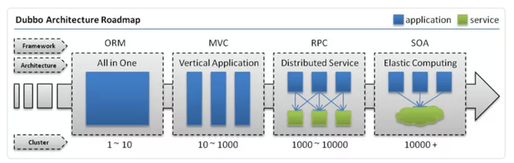

下面是 Dubbo 的服务治理图。


### **3、Dubbo 和 Spring Cloud 有什么区别？**

两个没关联，如果硬要说区别，有以下几点。

#### 1）通信方式不同

* Dubbo 使用的是 RPC 通信，而 Spring Cloud 使用的是 HTTP RESTFul 方式。
* dubbo由于是二进制传输，占用带宽会更少（基于netty）；SpringCloud是http协议传输，宽带会比较多，同时使用http协议（http+restful api）一般会使用JSON报文，消耗会更大。
* dubbo的开发难度较大，原因是dubbo的jar包依赖（存在代码级别的强依赖）问题很多大型工程无法解决；springcloud的接口协议约定比较自由松散，需要强有力的行政措施来限制接口无序升级。
* dubbo的改进是通过dubbofilter，很多东西没有，需要自己继承，如监控、日志、限流、追踪；springcloud具有配置管理、服务发现、断路器、智能路由、微代理、控制总线、一次性token、全局锁、选主、分布式会话和集群状态等，满足了构建微服务所需的所有解决方案、

#### 2）组成部分不同


### **4、dubbo都支持什么协议，推荐用哪种？**

- dubbo://（推荐）
- rmi://
- hessian://
- http://
- webservice://
- thrift://
- memcached://
- redis://
- rest://

### **5、Dubbo需要 Web 容器吗？**

不需要，如果硬要用 Web 容器，只会增加复杂性，也浪费资源。

### **6、Dubbo内置了哪几种服务容器？**

- Spring Container
- Jetty Container
- Log4j Container

Dubbo 的服务容器只是一个简单的 Main 方法，并加载一个简单的 Spring 容器，用于暴露服务。

### **7、Dubbo里面有哪几种节点角色？**


### **8、画一画服务注册与发现的流程图**


该图来自 Dubbo 官网，供你参考，如果你说你熟悉 Dubbo, 面试官经常会让你画这个图，记好了。

### **9、Dubbo默认使用什么注册中心，还有别的选择吗？**

推荐使用 Zookeeper 作为注册中心，还有 Redis、Multicast、Simple 注册中心，但不推荐。

### **10、Dubbo有哪几种配置方式？**

1）Spring 配置方式
2）Java API 配置方式

### **11、Dubbo 核心的配置有哪些？**

我曾经面试就遇到过面试官让你写这些配置，我也是蒙逼。。

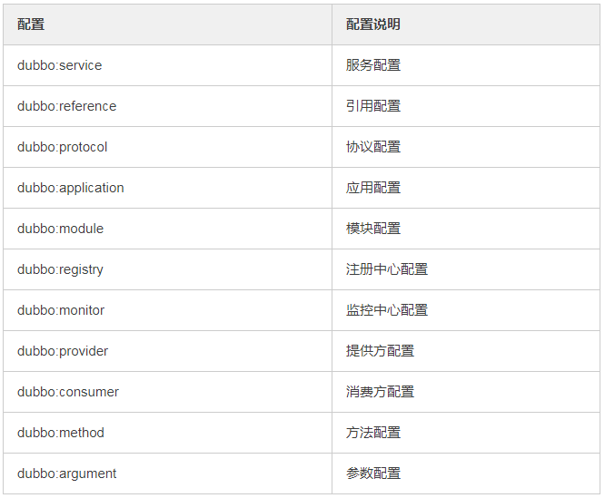

配置之间的关系见下图。


### **12、在 Provider 上可以配置的 Consumer 端的属性有哪些？**

1）timeout：方法调用超时
2）retries：失败重试次数，默认重试 2 次
3）loadbalance：负载均衡算法，默认随机
4）actives 消费者端，最大并发调用限制

### **13、Dubbo启动时如果依赖的服务不可用会怎样？**

Dubbo 缺省会在启动时检查依赖的服务是否可用，不可用时会抛出异常，阻止 Spring 初始化完成，默认 check="true"，可以通过 check="false" 关闭检查。

### **14、Dubbo推荐使用什么序列化框架，你知道的还有哪些？**

推荐使用Hessian序列化，还有Duddo、FastJson、Java自带序列化。

### **15、Dubbo默认使用的是什么通信框架，还有别的选择吗？**

Dubbo 默认使用 Netty 框架，也是推荐的选择，另外内容还集成有Mina、Grizzly。

### 16、Dubbo有哪几种集群容错方案，默认是哪种？


###  17、Dubbo有哪几种负载均衡策略，默认是哪种？


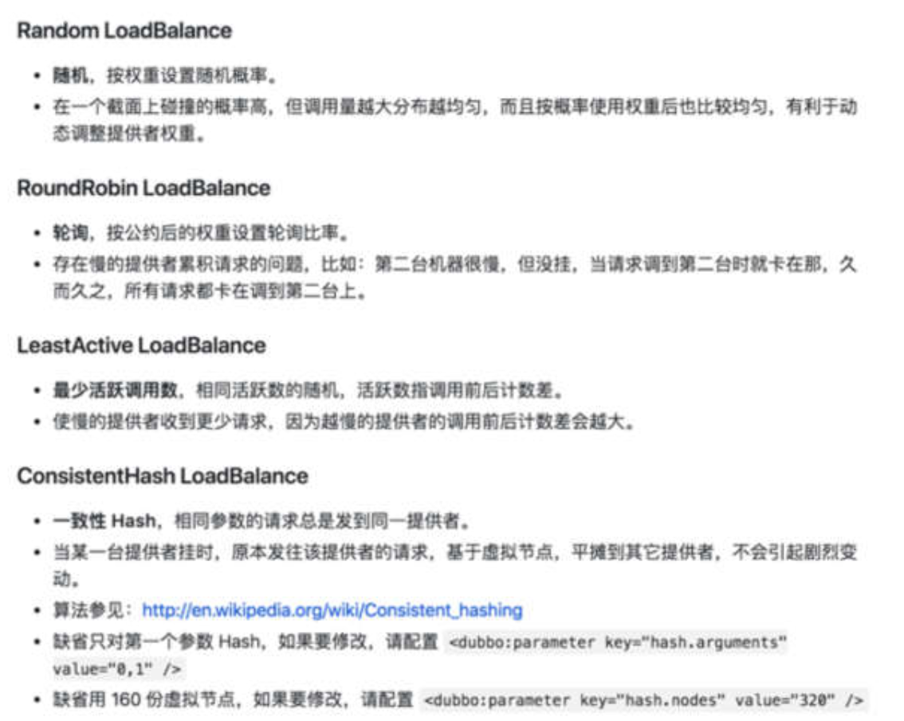


###   18、注册了多个同一样的服务，如果测试指定的某一个服务呢？

可以配置环境点对点直连，绕过注册中心，将以服务接口为单位，忽略注册中心的提供者列表。

###  19、Dubbo支持服务多协议吗？

Dubbo允许配置多协议，在不同服务上支持不同协议或者同一服务上同时支持多种协议。

### 20、当一个服务接口有多种实现时怎么做？

当一个接口有多种实现时，可以用 group 属性来分组，服务提供方和消费方都指定同一个 group 即可。

### 21、服务上线怎么兼容旧版本？

可以用版本号（version）过渡，多个不同版本的服务注册到注册中心，版本号不同的服务相互间不引用。这个和服务分组的概念有一点类似。

### **22、Dubbo可以对结果进行缓存吗？**

可以，Dubbo 提供了声明式缓存，用于加速热门数据的访问速度，以减少用户加缓存的工作量。

### **23、Dubbo服务之间的调用是阻塞的吗？**

默认是同步等待结果阻塞的，支持异步调用。

Dubbo 是基于 NIO 的非阻塞实现并行调用，客户端不需要启动多线程即可完成并行调用多个远程服务，相对多线程开销较小，异步调用会返回一个 Future 对象。

异步调用流程图如下。


### **24、Dubbo支持分布式事务吗？**

目前暂时不支持，后续可能采用基于 JTA/XA 规范实现，如以图所示。

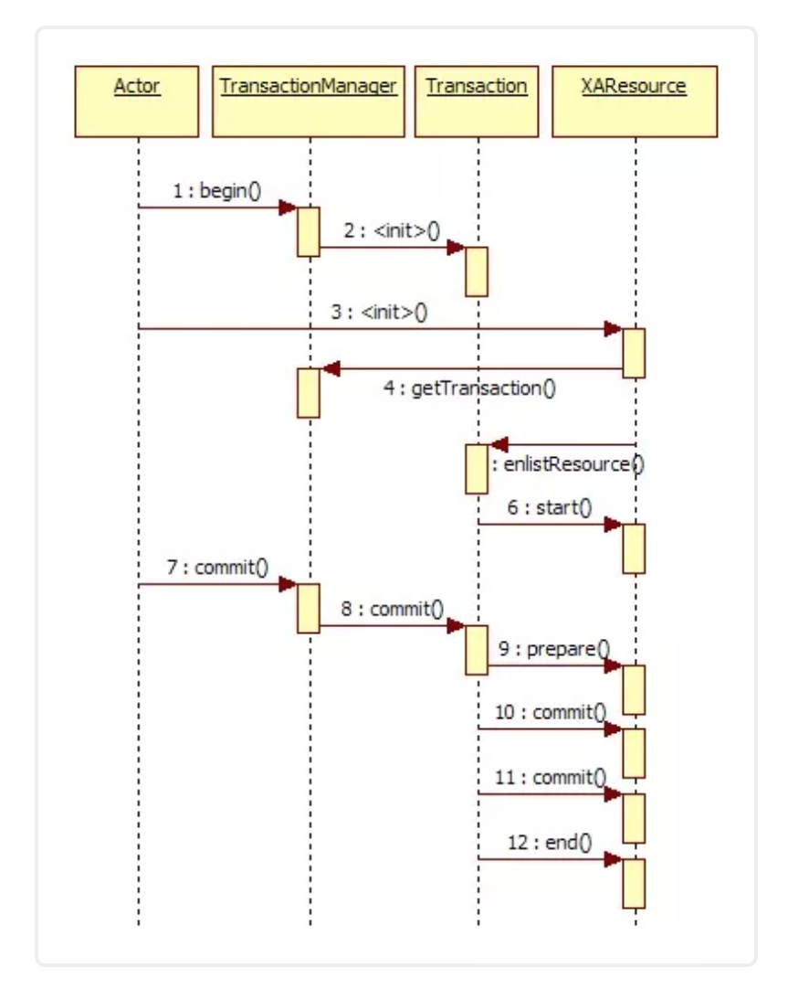

### **25、Dubbo telnet 命令能做什么？**

dubbo 通过 telnet 命令来进行服务治理，具体使用看这篇文章《[dubbo服务调试管理实用命令](https://mp.weixin.qq.com/s?__biz=MzI3ODcxMzQzMw==&mid=2247483709&idx=1&sn=afe0688c184f00902529583a85d90089&scene=21#wechat_redirect)》。

> telnet localhost 8090

### **26、Dubbo支持服务降级吗？**

Dubbo 2.2.0 以上版本支持。

### **27、Dubbo如何优雅停机？**

Dubbo 是通过 JDK 的 ShutdownHook 来完成优雅停机的，所以如果使用 kill -9 PID 等强制关闭指令，是不会执行优雅停机的，只有通过 kill PID 时，才会执行。

### **28、服务提供者能实现失效踢出是什么原理？**

服务失效踢出基于 Zookeeper 的临时节点原理。

### **29、如何解决服务调用链过长的问题？**

Dubbo 可以使用 Pinpoint 和 Apache Skywalking(Incubator) 实现分布式服务追踪，当然还有其他很多方案。

### **30、服务读写推荐的容错策略是怎样的？**

读操作建议使用 Failover 失败自动切换，默认重试两次其他服务器。

写操作建议使用 Failfast 快速失败，发一次调用失败就立即报错。

### 31、Dubbo必须依赖的包有哪些？

Dubbo 必须依赖 JDK，其他为可选。

### **32、Dubbo的管理控制台能做什么？**

管理控制台主要包含：路由规则，动态配置，服务降级，访问控制，权重调整，负载均衡，等管理功能。

### **33、说说 Dubbo 服务暴露的过程。**

Dubbo 会在 Spring 实例化完 bean 之后，在刷新容器最后一步发布 ContextRefreshEvent 事件的时候，通知实现了 ApplicationListener 的 ServiceBean 类进行回调 onApplicationEvent 事件方法，Dubbo 会在这个方法中调用 ServiceBean 父类 ServiceConfig 的 export 方法，而该方法真正实现了服务的（异步或者非异步）发布。

### **34、Dubbo 停止维护了吗？**

2014 年开始停止维护过几年，17 年开始重新维护，并进入了 Apache 项目。

### 35、Dubbo 和 Dubbox 有什么区别？

Dubbox 是继 Dubbo 停止维护后，当当网基于 Dubbo 做的一个扩展项目，如加了服务可 Restful 调用，更新了开源组件等。

### **36、你还了解别的分布式框架吗？**

别的还有 Spring cloud、Facebook 的 Thrift、Twitter 的 Finagle 等。

### **37、Dubbo 能集成 Spring Boot 吗？**

可以的，项目地址如下。

> https://github.com/apache/incubator-dubbo-spring-boot-project

### **38、在使用过程中都遇到了些什么问题？**

Dubbo 的设计目的是为了满足高并发小数据量的 rpc 调用，在大数据量下的性能表现并不好，建议使用 rmi 或 http 协议。

### **39、你读过 Dubbo 的源码吗？**

要了解 Dubbo 就必须看其源码，了解其原理，花点时间看下吧，网上也有很多教程，后续有时间我也会在公众号上分享 Dubbo 的源码。

### 40、你觉得用 Dubbo 好还是 Spring Cloud 好？

扩展性的问题，没有好坏，只有适合不适合，不过我好像更倾向于使用 Dubbo, Spring Cloud 版本升级太快，组件更新替换太频繁，配置太繁琐，还有很多我觉得是没有 Dubbo 顺手的地方……


----


#  Dubbo最全面试题 附答案（敖丙）

### 知道什么是RPC吗？

答：RPC 就是 Remote Procedure Call，远程过程调用，它相对应的是本地过程调用。

### 那为什么要有 RPC，HTTP 不好么？

这时候面试官就开始追问了。

这个问题其实很有意思，有些面试官可能自己不太清楚，然后以为自己很清楚，所以问出这个问题，还有一种是真的清楚，问这个问题是为了让你跳坑里。

因为 RPC 和 HTTP 就不是一个层级的东西，所以严格意义上这两个没有可比性，也不应该来作比较，而题目问的就是把这两个作为比较了。

HTTP 只是传输协议，协议只是规范了一定的交流格式，而且 RPC 是早于 HTTP 的，所以真要问也是问有 RPC 为什么还要 HTTP。

RPC 对比的是本地过程调用，是用来作为分布式系统之间的通信，它可以用 HTTP 来传输，也可以基于 TCP 自定义协议传输。

所以你要先提出这两个不是一个层级的东西，没有可比性，然后再表现一下，可以说 HTTP 协议比较冗余，所以 RPC 大多都是基于 TCP 自定义协议，定制化的才是最适合自己的。

当然也有基于 HTTP 协议的 RPC 框架，毕竟 HTTP 是公开的协议，比较通用，像 HTTP2 已经做了相应的压缩了，而且系统之间的调用都在内网，所以说影响也不会很大。

这波回答下来，面试官会觉得你有点东西，开始对你有点兴趣了，要开始深入你了。


### 说说你对 Dubbo 的了解？

面试官会先问个大点的问题，然后从你的回答中找到一些突破口来深入问，所以这个问题其实挺开放性的，你可以从历史的发展来答，也可以从整体架构来答。

如果从历史发展的角度来答，说明你平日里也是挺关注一些开源软件的，侧面也能体现你的对开源的拥抱。

如果从总体架构答，毋庸置疑肯定也是可以的，建议先浅显的说，等着追问。

历史发展，这个其实丙之前文章已经提到了：

Dubbo 是阿里巴巴开源的一个基于 Java 的 RPC 框架，中间沉寂了一段时间，但在 2017 年阿里巴巴又重启了对 Dubbo 维护。

并且在 2018 年和 当当的 Dubbox 进行了合并，进入 Apache 孵化器，在 2019 年毕业正式成为 Apache 顶级项目。

目前 Dubbo 社区主力维护的是 2.6.x 和 2.7.x 两大版本，2.6.x 版本主要是 bug 修复和少量功能增强为准，是稳定版本。

2.7.5 版本的发布被 Dubbo 认为是里程碑式的版本发布，支持 gRPC，并且性能提升了 30%（这里不了解gRPC 和为什么性能提升的话就别说了，别给自己挖坑）。

最新的 3.0 版本往云原生方向上探索着。

注意了，如果对历史各个版本不太熟，也不知道最新的版本要干啥就别往这方向答了，运气好点就是面试官自己也不太了解，他可能不会问，运气背点就追问了。

总体架构，上面也提到了先浅显的说，等追问，因为面试官如果懂，他肯定会问深入，如果不懂你芭芭拉一堆他无感的。


### 你就简单的提一下现在这几个角色。

节点	角色说明
Consumer	需要调用远程服务的服务消费方
Registry	注册中心
Provider	服务提供方
Container	服务运行的容器
Monitor	监控中心


比如， Dubbo 总体分了以上这么几个角色，分别的作用是xxxx。

这里停顿下看下面试官的反应，如果没搭话，就继续说大致的流程。

首先服务提供者 Provider 启动然后向注册中心注册自己所能提供的服务。

服务消费者 Consumer 启动向注册中心订阅自己所需的服务。然后注册中心将提供者元信息通知给 Consumer， 之后 Consumer 因为已经从注册中心获取提供者的地址，因此可以通过负载均衡选择一个 Provider 直接调用 。

之后服务提供方元数据变更的话注册中心会把变更推送给服务消费者。

服务提供者和消费者都会在内存中记录着调用的次数和时间，然后定时的发送统计数据到监控中心。

到这基本上就差不多了，如果之前看过丙的 Dubbo 系列文章的话，那就算看过源码了，肯定对一系列过程很清晰了，所以在适当的时机可以说自己看过 Dubbo 源码。

众所周知，看过源码肯定是加分项，所以这点是要提的。

面试官一听，好家伙看过源码是吧，来说说。


接下来就开始连击了。

### 看过源码，那说下服务暴露的流程？

服务的暴露起始于 Spring IOC 容器刷新完毕之后，会根据配置参数组装成 URL， 然后根据 URL 的参数来进行本地或者远程调用。

会通过 proxyFactory.getInvoker，利用 javassist 来进行动态代理，封装真的实现类，然后再通过 URL 参数选择对应的协议来进行 protocol.export，默认是 Dubbo 协议。

在第一次暴露的时候会调用 createServer 来创建 Server，默认是 NettyServer。

然后将 export 得到的 exporter 存入一个 Map 中，供之后的远程调用查找，然后会向注册中心注册提供者的信息。

基本上就是这么个流程，说了这些差不多了，太细的谁都记住不。


### 看过源码，那说下服务引入的流程？

服务的引入时机有两种，第一种是饿汉式，第二种是懒汉式。

饿汉式就是加载完毕就会引入，懒汉式是只有当这个服务被注入到其他类中时启动引入流程，默认是懒汉式。

会先根据配置参数组装成 URL ，一般而言我们都会配置的注册中心，所以会构建 RegistryDirectory
向注册中心注册消费者的信息，并且订阅提供者、配置、路由等节点。

得知提供者的信息之后会进入 Dubbo 协议的引入，会创建 Invoker ，期间会包含 NettyClient，来进行远程通信，最后通过 Cluster 来包装 Invoker，默认是 FailoverCluster，最终返回代理类。

说这么多差不多了，关键的点都提到了。

切忌不要太过细，不要把你知道的都说了，这样会抓不住重点，比如上面的流程你要插入，引入的三种方式：本地引入、直连远程引入、通过注册中心引入。

然后再分别说本地引入怎样的，芭芭拉的就会很乱，所以面试的时候是需要删减的，要直击重点。

其实真实说的应该比我上面说的还要精简点才行，我是怕大家不太清楚说的稍微详细了一些。


### 看过源码，那说下服务调用的流程？

调用某个接口的方法会调用之前生成的代理类，然后会从 cluster 中经过路由的过滤、负载均衡机制选择一个 invoker 发起远程调用，此时会记录此请求和请求的 ID 等待服务端的响应。

服务端接受请求之后会通过参数找到之前暴露存储的 map，得到相应的 exporter ，然后最终调用真正的实现类，再组装好结果返回，这个响应会带上之前请求的 ID。

消费者收到这个响应之后会通过 ID 去找之前记录的请求，然后找到请求之后将响应塞到对应的 Future 中，唤醒等待的线程，最后消费者得到响应，一个流程完毕。

关键的就是 cluster、路由、负载均衡，然后 Dubbo 默认是异步的，所以请求和响应是如何对应上的。

之后可能还会追问 Dubbo 异步转同步如何实现的之类的，在丙之前文章里面都说了，忘记的同学可以回去看看。

### 知道什么是 SPI 嘛？

这又是一个方向了，从上面的回答中，不论是从 Dubbo 协议，还是 cluster ，什么 export 方法等等无处不是 SPI 的影子，所以如果是问 Dubbo 方面的问题，问 SPI 是毋庸置疑的，因为源码里 SPI 无处不在，而且 SPI 也是 Dubbo 可扩展性的基石。

所以这个题目没什么套路，直接答就行。

SPI 是 Service Provider Interface，主要用于框架中，框架定义好接口，不同的使用者有不同的需求，因此需要有不同的实现，而 SPI 就通过定义一个特定的位置，Java SPI 约定在 Classpath 下的 META-INF/services/ 目录里创建一个以服务接口命名的文件，然后文件里面记录的是此 jar 包提供的具体实现类的全限定名。

所以就可以通过接口找到对应的文件，获取具体的实现类然后加载即可，做到了灵活的替换具体的实现类。


### 为什么 Dubbo 不用 JDK 的 SPI，而是要自己实现?

问这个问题就是看你有没有深入的了解，或者自己思考过，不是死板的看源码，或者看一些知识点。

很多点是要思考的，不是书上说什么就是什么，你要知道这样做的理由，有什么好处和坏处，这很容易看出一个人是死记硬背还是有自己的思考。

答：因为 Java SPI 在查找扩展实现类的时候遍历 SPI 的配置文件并且将实现类全部实例化，假设一个实现类初始化过程比较消耗资源且耗时，但是你的代码里面又用不上它，这就产生了资源的浪费。

因此 Dubbo 就自己实现了一个 SPI，给每个实现类配了个名字，通过名字去文件里面找到对应的实现类全限定名然后加载实例化，按需加载。

这答出来就加分了，面试官心里在拍手了，不错不错有点东西。


### Dubbo 为什么默认用 Javassist

上面你回答 Dubbo 用 Javassist 动态代理，所以很可能会问你为什么要用这个代理，可能还会引申出 JDK 的动态代理、ASM、CGLIB。

所以这也是个注意点，如果你不太清楚的话上面的回答就不要扯到动态代理了，如果清楚的话那肯定得提，来诱导面试官来问你动态代理方面的问题，这很关键。

面试官是需要诱导的，毕竟他也想知道你优秀的方面到底有多优秀，你也取长补短，双赢双赢。

来回答下为什么用 Javassist，很简单，就是快，且字节码生成方便。

ASM 比 Javassist 更快，但是没有快一个数量级，而Javassist 只需用字符串拼接就可以生成字节码，而 ASM 需要手工生成，成本较高，比较麻烦。

### 如果让你设计一个 RPC 框架，如何设计？

面试官都很喜欢问这类问题，来考验候选人的设计能力，和平日有无全方面的了解过一个框架。

如果你平时没有思考，没有往这方面想过答出来的东西就会没有条理性，会显得杂乱无章，不过你也不用慌张，不用想的很全面，答的很细致，没有必要，面试官要的是那些关键的重点。

你可以从底层向上开始说起。

首先需要实现高性能的网络传输，可以采用 Netty 来实现，不用自己重复造轮子，然后需要自定义协议，毕竟远程交互都需要遵循一定的协议，然后还需要定义好序列化协议，网络的传输毕竟都是二进制流传输的。

然后可以搞一套描述服务的语言，即 IDL（Interface description language），让所有的服务都用 IDL 定义，再由框架转换为特定编程语言的接口，这样就能跨语言了。

此时最近基本的功能已经有了，但是只是最基础的，工业级的话首先得易用，所以框架需要把上述的细节对使用者进行屏蔽，让他们感觉不到本地调用和远程调用的区别，所以需要代理实现。

然后还需要实现集群功能，因此的要服务发现、注册等功能，所以需要注册中心，当然细节还是需要屏蔽的。

最后还需要一个完善的监控机制，埋点上报调用情况等等，便于运维。

这样一个 RPC 框架的雏形就差不多了。


最后
Dubbo 系列就到此结束了，其实还是有很多细节的，如果要写肯定还是有很多可以写的。

不过整体脉络都理清楚了，之后的修行还是得靠大家自己多多努力。

面试题肯定不止这一些，面试题是问不完的，真实的面试肯定是抓住你回答的点来深挖，所以我也模拟不了，我只能告诉你大致关键点，和揣摩一下面试官的心理活动。

当面试官问你的时候你可以试着去揣摩，看看他到底想要问什么，这很关键。

面试的时候不要慌，你和面试官是平等的，而且面试官不一定你厉害，还有面试有时候就是看运气了，面试失败了也不要气馁，换一家就好了，有时候就是气场不和，这很正常。


---

# dubbo


### **Dubbo** 支持哪些协议，每种协议的应用场景，优缺点?

-    **dubbo**: 单一长连接和 NIO 异步通讯，适合大并发小数据量的服务调用， 以及消费者远大于提供者。传输协议 TCP，异步，Hessian 序列化;
-    **rmi**: 采用 JDK 标准的 rmi 协议实现，传输参数和返回参数对象需要实现 Serializable 接口，使用 java 标准序列化机制，使用阻塞式短连接，传输数 据包大小混合，消费者和提供者个数差不多，可传文件，传输协议 TCP。 多个短连接，TCP 协议传输，同步传输，适用常规的远程服务调用和 rmi 互 操作。在依赖低版本的 Common-Collections 包，java 序列化存在安全漏 洞;
-    **webservice**: 基于 WebService 的远程调用协议，集成 CXF 实现，提供和 原生 WebService 的互操作。多个短连接，基于 HTTP 传输，同步传输，适 用系统集成和跨语言调用;
-    **http**: 基于 Http 表单提交的远程调用协议，使用 Spring 的 HttpInvoke 实 现。多个短连接，传输协议 HTTP，传入参数大小混合，提供者个数多于消 费者，需要给应用程序和浏览器 JS 调用;
-    **hessian**: 集成 Hessian 服务，基于 HTTP 通讯，采用 Servlet 暴露服务， Dubbo 内嵌 Jetty 作为服务器时默认实现，提供与 Hession 服务互操作。多 个短连接，同步 HTTP 传输，Hessian 序列化，传入参数较大，提供者大于 消费者，提供者压力较大，可传文件;
-    **memcache**: 基于 memcached 实现的 RPC 协议
-    **redis**: 基于 redis 实现的 RPC 协议

### **Dubbo** 超时时间怎样设置?

####  Dubbo 超时时间设置有两种方式:

-    服务提供者端设置超时时间，在 Dubbo 的用户文档中，推荐如果能在服务 端多配置就尽量多配置，因为服务提供者比消费者更清楚自己提供的服务特 性。
-    服务消费者端设置超时时间，如果在消费者端设置了超时时间，以消费者端 为主，即优先级更高。因为服务调用方设置超时时间控制性更灵活。如果消 费方超时，服务端线程不会定制，会产生警告。

### **Dubbo** 有些哪些注册中心?

-    **Multicast** 注册中心: Multicast 注册中心不需要任何中心节点，只要广播地 址，就能进行服务注册和发现。基于网络中组播传输实现;
-    **Zookeeper** 注册中心: 基于分布式协调系统 Zookeeper 实现，采用 Zookeeper 的 watch 机制实现数据变更;
-    **redis** 注册中心: 基于 redis 实现，采用 key/Map 存储，住 key 存储服务名 和类型，Map 中 key 存储服务 URL，value 服务过期时间。基于 redis 的发 布/订阅模式通知数据变更;
-    **Simple** 注册中心

### **Dubbo** 集群的负载均衡有哪些策略  

 Dubbo 提供了常见的集群策略实现，并预扩展点予以自行实现。

-    **Random LoadBalance:** 随机选取提供者策略，有利于动态调整提供者权 重。截面碰撞率高，调用次数越多，分布越均匀;
-    **RoundRobin LoadBalance:** 轮循选取提供者策略，平均分布，但是存在请 求累积的问题;
-    **LeastActive LoadBalance:** 最少活跃调用策略，解决慢提供者接收更少的 请求;
-    **ConstantHash LoadBalance:** 一致性 Hash 策略，使相同参数请求总是发 到同一提供者，一台机器宕机，可以基于虚拟节点，分摊至其他提供者，避 免引起提供者的剧烈变动;

###    **Dubbo** **是什么?**

-    Dubbo 是一个分布式、高性能、透明化的 RPC 服务框架，提供服务自动注册、自动发现等高效服务治理方案， 可以和 Spring 框架无缝集成。

###    **Dubbo** **的主要应用场景?**

-    透明化的远程方法调用，就像调用本地方法一样调用远程方法，

  只需简单配置，没有任何 API 侵入。

-    软负载均衡及容错机制，可在内网替代 F5 等硬件负载均衡器， 降低成本，减少单点。

-    服务自动注册与发现，不再需要写死服务提供方地址，注册中心 基于接口名查询服务提供者的 IP 地址，并且能够平滑添加或删 除服务提供者。

### **Dubbo 的核心功能?**

主要就是如下 3 个核心功能:

*  **Remoting**:网络通信框架，提供对多种NIO框架抽象封装，包括 “同步转异步”和“请求-响应”模式的信息交换方式。

*  **Cluster****:服务框架**，提供基于接口方法的透明远程过程调用，包括多 协议支持，以及软负载均衡，失败容错，地址路由，动态配置等集群 支持。

*  **Registry****:服务注册**，基于注册中心目录服务，使服务消费方能动态 的查找服务提供方，使地址透明，使服务提供方可以平滑增加或减少 机器。

###  **Dubbo**的核心组件?


### **Dubbo 服务注册与发现的流程?**


**流程说明:**

-    Provider(提供者)绑定指定端口并启动服务

-    指供者连接注册中心，并发本机IP、端口、应用信息和提供服务信息

  发送至注册中心存储

-    Consumer(消费者)，连接注册中心 ，并发送应用信息、所求服务信

  息至注册中心

-    注册中心根据 消费 者所求服务信息匹配对应的提供者列表发送至

  Consumer 应用缓存。

-    Consumer 在发起远程调用时基于缓存的消费者列表择其一发起调

  用。

-    Provider 状态变更会实时通知注册中心、在由注册中心实时推送至

  Consumer

#### **设计的原因:**

-    Consumer 与 Provider 解偶，双方都可以横向增减节点数。

-    注册中心对本身可做对等集群，可动态增减节点，并且任意一台宕掉

  后，将自动切换到另一台

-    去中心化，双方不直接依懒注册中心，即使注册中心全部宕机短时间

  内也不会影响服务的调用

-    服务提供者无状态，任意一台宕掉后，不影响使用


### **Dubbo** **的架构设计?**


### **Dubbo** **框架设计一共划分了** **10** **个层:**

  **服务接口层(****Service****)**:该层是与实际业务逻辑相关的，根据服务提 供方和服务消费方的业务设计对应的接口和实现。

  **配置层(****Config****)**:对外配置接口，以ServiceConfig和 ReferenceConfig 为中心。

  **服务代理层(****Proxy**):服务接口透明代理，生成服务的客户端Stub 和服务器端 Skeleton。

-    **服务注册层(****Registry****)**:封装服务地址的注册与发现，以服务URL 为中心。

-    **集群层(****Cluster****)**:封装多个提供者的路由及负载均衡，并桥接注册 中心，以 Invoker 为中心。

-    **监控层(****Monitor****)**:RPC调用次数和调用时间监控。

-    **远程调用层(****Protocol****)**:封将RPC调用，以Invocation和Result

  为中心，扩展接口为 Protocol、Invoker 和 Exporter。

-    **信息交换层(****Exchange****)**:封装请求响应模式，同步转异步，以

  Request 和 Response 为中心。

-    **网络传输层(****Transport****)**:抽象mina和netty为统一接口，以

  Message 为中心。

### **Dubbo 的服务调用流程?**


### **Dubbo** **支持哪些协议，每种协议的应用场景，优缺点?**

  **dubbo****:** 单一长连接和 NIO 异步通讯，适合大并发小数据量的服务 调用，以及消费者远大于提供者。传输协议 TCP，异步，Hessian 序 列化;

  **rmi****:**采用JDK标准的rmi协议实现，传输参数和返回参数对象需要 实现 Serializable 接口，使用 java 标准序列化机制，使用阻塞式短连 接，传输数据包大小混合，消费者和提供者个数差不多，可传文件，

传输协议 TCP。 多个短连接，TCP 协议传输，同步传输，适用常规的 远程服务调用和 rmi 互操作。在依赖低版本的 Common-Collections 包，java 序列化存在安全漏洞;

-    **webservice****:**基于WebService的远程调用协议，集成CXF实现， 提供和原生 WebService 的互操作。多个短连接，基于 HTTP 传输， 同步传输，适用系统集成和跨语言调用;
- http:基于Http表单提交的远程调用协议，使用Spring的 HttpInvoke 实现。多个短连接，传输协议 HTTP，传入参数大小混 合，提供者个数多于消费者，需要给应用程序和浏览器 JS 调用;
- hessian:集成Hessian服务，基于HTTP通讯，采用Servlet暴露 服务，Dubbo 内嵌 Jetty 作为服务器时默认实现，提供与 Hession 服 务互操作。多个短连接，同步 HTTP 传输，Hessian 序列化，传入参 数较大，提供者大于消费者，提供者压力较大，可传文件;
-    **memcache**:**基于memcached实现的RPC协议
-    **redis**:**基于redis实现的RPC协议 **

#### dubbo**推荐用什么协议?**

默认使用 dubbo 协议

### **Dubbo** **有些哪些注册中心?**

  **Multicast****注册中心:**Multicast注册中心不需要任何中心节点，只 要广播地址，就能进行服务注册和发现。基于网络中组播传输实现;

  **Zookeeper****注册中心:**基于分布式协调系统Zookeeper实现，采用 Zookeeper 的 watch 机制实现数据变更;

  **redis****注册中心:**基于redis实现，采用key/Map存储，住key存储 服务名和类型，Map 中 key 存储服务 URL，value 服务过期时间。基 于 redis 的发布/订阅模式通知数据变更;

  **Simple****注册中心**

**Dubbo** **默认采用注册中心?**

采用 Zookeeper

### dubbo集成Zookeeper的实现原理：

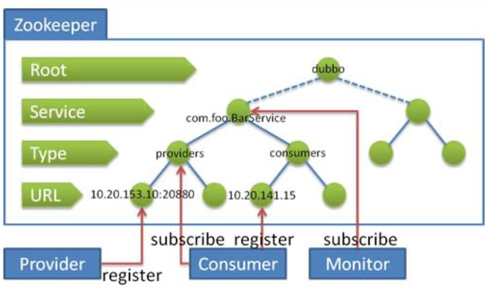

### **为什么需要服务治理?**


* 过多的服务URL配置困难
* 负载均衡分配节点压力过大的情况下也需要部署集群

* 服务依赖混乱，启动顺序不清晰
* 过多服务导致性能指标分析难度较大，需要监控 

### **Dubbo** **的注册中心集群挂掉，发布者和订阅者之间还能通信么?**

可以的，启动 dubbo 时，消费者会从 zookeeper 拉取注册的生产者 的地址接口等数据，缓存在本地。

每次调用时，按照本地存储的地址进行调用。

### **Dubbo** **与** **Spring** **的关系?**

Dubbo 采用全 Spring 配置方式，透明化接入应用，对应用没有任何 API 侵入，只需用 Spring 加载 Dubbo 的配置即可，Dubbo 基于 Spring 的 Schema 扩展进行加载。

### **Dubbo** **使用的是什么通信框架**?

默认使用 NIO Netty 框架

### **Dubbo** **集群提供了哪些负载均衡策略?**

  **Random LoadBalance:** 随机选取提供者策略，有利于动态调整提供 者权重。截面碰撞率高，调用次数越多，分布越均匀;

  **RoundRobin LoadBalance:** 轮循选取提供者策略，平均分布，但是 存在请求累积的问题;

  **LeastActive LoadBalance:** 最少活跃调用策略，解决慢提供者接收 更少的请求;

  **ConstantHash LoadBalance:** 一致性 Hash 策略，使相同参数请求 总是发到同一提供者，一台机器宕机，可以基于虚拟节点，分摊至其 他提供者，避免引起提供者的剧烈变动;

缺省时为 Random 随机调用

### **Dubbo** **的集群容错方案有哪些?**

-    **Failover Cluster**

  -    失败自动切换，当出现失败，重试其它服务器。通常用于读操作，但

  重试会带来更长延迟。

-    **Failfast Cluster**

  -    快速失败，只发起一次调用，失败立即报错。通常用于非幂等性的写

  操作，比如新增记录。

-    **Failsafe Cluster**

  -    失败安全，出现异常时，直接忽略。通常用于写入审计日志等操作。

-    **Failback Cluster**

  -    失败自动恢复，后台记录失败请求，定时重发。通常用于消息通知操作。

-    **Forking Cluster**

  - 并行调用多个服务器，只要一个成功即返回。通常用于实时性要求较 高的读操作，但需要浪费更多服务资源。可通过 forks="2" 来设置最 大并行数。

* **Broadcast Cluster** 
  * 广播调用所有提供者，逐个调用，任意一台报错则报错 。通常用于通知所有提供者更新缓存或日志等本地资源信息。

#### **Dubbo** **的默认集群容错方案?**

**Failover Cluster**

### **Dubbo** **支持哪些序列化方式?**

默认使用 Hessian 序列化，还有 Duddo、FastJson、Java 自带序列 化。

### **Dubbo** **超时时间怎样设置?**

Dubbo 超时时间设置有两种方式:

-    服务提供者端设置超时时间，在Dubbo的用户文档中，推荐如果能 在服务端多配置就尽量多配置，因为服务提供者比消费者更清楚自己 提供的服务特性。
-    服务消费者端设置超时时间，如果在消费者端设置了超时时间，以消 费者端为主，即优先级更高。因为服务调用方设置超时时间控制性更 灵活。如果消费方超时，服务端线程不会定制，会产生警告。

### 服务调用超时问题怎么解决?

dubbo 在调用服务不成功时，默认是会重试两次的。

### **Dubbo** **在安全机制方面是如何解决?**

Dubbo 通过 Token 令牌防止用户绕过注册中心直连，然后在注册中 心上管理授权。Dubbo 还提供服务黑白名单，来控制服务所允许的调 用方。

### **Dubbo** **和** **Dubbox** **之间的区别?**

dubbox 基于 dubbo 上做了一些扩展，如加了服务可 restful 调 用，更新了开源组件等。

### **Dubbo** **和** **Spring Cloud** **的关系?**

Dubbo 是 SOA 时代的产物，它的关注点主要在于服务的调用，流 量分发、流量监控和熔断。而 Spring Cloud 诞生于微服务架构时 代，考虑的是微服务治理的方方面面，另外由于依托了 Spirng、 Spirng Boot 的优势之上，两个框架在开始目标就不一致，Dubbo 定位服务治理、Spirng Cloud 是一个生态。

### **Dubbo** **和** **Spring Cloud** **的区别?**


最大的区别:Dubbo 底层是使用 Netty 这样的 NIO 框架，是基于 TCP 协议传输的，配合以 Hession 序列化完成 RPC 通信。

而 SpringCloud 是基于 Http 协议+Rest 接口调用远程过程的通信， 相对来说，Http 请求会有更大的报文，占的带宽也会更多。但是 REST 相比 RPC 更为灵活，服务提供方和调用方的依赖只依靠一纸契 约，不存在代码级别的强依赖。

----

Dubbo是一个分布式服务框架，致力于提供高性能和透明化的RPC远程服务调用方案，以及SOA服务治理方案。简单的说，dubbo就是个服务框架，如果没有分布式的需求，其实是不需要用的，只有在分布式的时候，才有dubbo这样的分布式服务框架的需求，并且本质上是个服务调用的东东，说白了就是个远程服务调用的分布式框架（告别Web Service模式中的WSdl，以服务者与消费者的方式在dubbo上注册）。


很多时候，其实我们使用这个技术的时候，可能都是因为项目需要，所以，我们就用了，但是，至于为什么我们需要用到这个技术，可能自身并不是很了解的，但是，其实了解技术的来由及背景知识，对于理解一项技术还是有帮助的。


## 1、为什么要用 Dubbo？

随着服务化的进一步发展，服务越来越多，服务之间的调用和依赖关系也越来越复杂，诞生了面向服务的架构体系(SOA)，也因此衍生出了一系列相应的技术，如对服务提供、服务调用、连接处理、通信协议、序列化方式、服务发现、服务路由、日志输出等行为进行封装的服务框架。就这样为分布式系统的服务治理框架就出现了，Dubbo 也就这样产生了。

## 2、Dubbo 的整体架构设计有哪些分层?

**接口服务层（Service）**：该层与业务逻辑相关，根据 provider 和 consumer 的业务设计对应的接口和实现

**配置层（Config）：**对外配置接口，以 ServiceConfig 和 ReferenceConfig 为中心

**服务代理层（Proxy）：**服务接口透明代理，生成服务的客户端 Stub 和 服务端的 Skeleton，以 ServiceProxy 为中心，扩展接口为 ProxyFactory

**服务注册层（Registry）：**封装服务地址的注册和发现，以服务 URL 为中心，扩展接口为 RegistryFactory、Registry、RegistryService

**路由层（Cluster）：**封装多个提供者的路由和负载均衡，并桥接注册中心，以Invoker 为中心，扩展接口为 Cluster、Directory、Router 和 LoadBlancce

**监控层（Monitor）：**RPC 调用次数和调用时间监控，以 Statistics 为中心，扩展接口为 MonitorFactory、Monitor 和 MonitorService

**远程调用层（Protocal）：**封装 RPC 调用，以 Invocation 和 Result 为中心，扩展接口为 Protocal、Invoker 和 Exporter

**信息交换层（Exchange）：**封装请求响应模式，同步转异步。以 Request 和Response 为中心，扩展接口为 Exchanger、ExchangeChannel、ExchangeClient 和 ExchangeServer

**网络 传输 层（Transport）：**抽象 mina 和 netty 为统一接口，以 Message 为中心，扩展接口为 Channel、Transporter、Client、Server 和 Codec

**数据序列化层（Serialize）：**可复用的一些工具，扩展接口为 Serialization、ObjectInput、ObjectOutput 和 ThreadPool

## 3、默认使用的是什么通信框架，还有别的选择吗?

默认也推荐使用 netty 框架，还有 mina。

## 4、服务调用是阻塞的吗？

默认是阻塞的，可以异步调用，没有返回值的可以这么做。Dubbo 是基于 NIO 的非阻塞实现并行调用，客户端不需要启动多线程即可完成并行调用多个远程服务，相对多线程开销较小，异步调用会返回一个 Future 对象。

## 5、一般使用什么注册中心？还有别的选择吗？

推荐使用 Zookeeper 作为注册中心，还有 Redis、Multicast、Simple 注册中心，但不推荐。

## 6、默认使用什么序列化框架，你知道的还有哪些？

推荐使用 Hessian 序列化，还有 Duddo、FastJson、Java 自带序列化。

## 7、服务提供者能实现失效踢出是什么原理？

服务失效踢出基于 zookeeper 的临时节点原理。

## 8、服务上线怎么不影响旧版本？

采用多版本开发，不影响旧版本。

## 9、如何解决服务调用链过长的问题？

可以结合 zipkin 实现分布式服务追踪。

## 10、说说核心的配置有哪些？

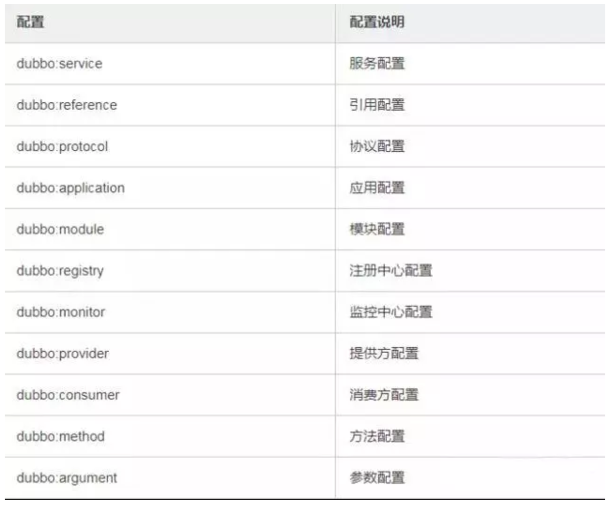


## 11、Dubbo 推荐用什么协议？

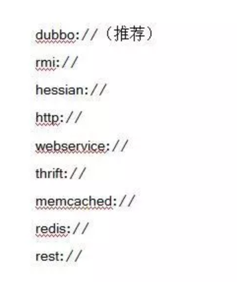

## 12、同一个服务多个注册的情况下可以直连某一个服务吗？

可以点对点直连，修改配置即可，也可以通过 telnet 直接某个服务。

## 13、画一画服务注册与发现的流程图？


## 14、Dubbo 集群容错有几种方案？


## 15、Dubbo 服务降级，失败重试怎么做？

可以通过 dubbo:reference 中设置 mock="return null"。mock 的值也可以修改为 true，然后再跟接口同一个路径下实现一个 Mock 类，命名规则是 “接口名称+Mock” 后缀。然后在 Mock 类里实现自己的降级逻辑

## 16、Dubbo 使用过程中都遇到了些什么问题？

在注册中心找不到对应的服务,检查 service 实现类是否添加了@service 注解无法连接到注册中心,检查配置文件中的对应的测试 ip 是否正确

## 17、Dubbo Monitor 实现原理？

Consumer 端在发起调用之前会先走 filter 链；provider 端在接收到请求时也是先走 filter 链，然后才进行真正的业务逻辑处理。默认情况下，在 consumer 和 provider 的 filter 链中都会有 Monitorfilter。

1、MonitorFilter 向 DubboMonitor 发送数据 2、DubboMonitor 将数据进行聚合后（默认聚合 1min 中的统计数据）暂存到ConcurrentMap<Statistics, AtomicReference> statisticsMap，然后使用一个含有 3 个线程（线程名字：DubboMonitorSendTimer）的线程池每隔 1min 钟，调用 SimpleMonitorService 遍历发送 statisticsMap 中的统计数据，每发送完毕一个，就重置当前的 Statistics 的 AtomicReference 3、SimpleMonitorService 将这些聚合数据塞入 BlockingQueue queue 中（队列大写为 100000） 4、SimpleMonitorService 使用一个后台线程（线程名为：DubboMonitorAsyncWriteLogThread）将 queue 中的数据写入文件（该线程以死循环的形式来写） 5、SimpleMonitorService 还会使用一个含有 1 个线程（线程名字：DubboMonitorTimer）的线程池每隔 5min 钟，将文件中的统计数据画成图表

## 18、Dubbo 用到哪些设计模式？

Dubbo 框架在初始化和通信过程中使用了多种设计模式，可灵活控制类加载、权限控制等功能。

**工厂模式**

Provider 在 export 服务时，会调用 ServiceConfig 的 export 方法。ServiceConfig中有个字段：

```
private static final Protocol protocol =
ExtensionLoader.getExtensionLoader(Protocol.class).getAdaptiveExtensi
on();
```

Dubbo 里有很多这种代码。这也是一种工厂模式，只是实现类的获取采用了 JDKSPI 的机制。这么实现的优点是可扩展性强，想要扩展实现，只需要在 classpath下增加个文件就可以了，代码零侵入。另外，像上面的 Adaptive 实现，可以做到调用时动态决定调用哪个实现，但是由于这种实现采用了动态代理，会造成代码调试比较麻烦，需要分析出实际调用的实现类。

**装饰器模式**

Dubbo 在启动和调用阶段都大量使用了装饰器模式。以 Provider 提供的调用链为例，具体的调用链代码是在 ProtocolFilterWrapper 的 buildInvokerChain 完成的，具体是将注解中含有 group=provider 的 Filter 实现，按照 order 排序，最后的调用顺序是：

```
EchoFilter -> ClassLoaderFilter -> GenericFilter -> ContextFilter ->
ExecuteLimitFilter -> TraceFilter -> TimeoutFilter -> MonitorFilter ->
ExceptionFilter
```

更确切地说，这里是装饰器和责任链模式的混合使用。例如，EchoFilter 的作用是判断是否是回声测试请求，是的话直接返回内容，这是一种责任链的体现。而像ClassLoaderFilter 则只是在主功能上添加了功能，更改当前线程的 ClassLoader，这是典型的装饰器模式。

**观察者模式**

Dubbo 的 Provider 启动时，需要与注册中心交互，先注册自己的服务，再订阅自己的服务，订阅时，采用了观察者模式，开启一个 listener。注册中心会每 5 秒定时检查是否有服务更新，如果有更新，向该服务的提供者发送一个 notify 消息，provider 接受到 notify 消息后，运行 NotifyListener 的 notify 方法，执行监听器方法。

**动态代理模式**

Dubbo 扩展 JDK SPI 的类 ExtensionLoader 的 Adaptive 实现是典型的动态代理实现。Dubbo 需要灵活地控制实现类，即在调用阶段动态地根据参数决定调用哪个实现类，所以采用先生成代理类的方法，能够做到灵活的调用。生成代理类的代码是 ExtensionLoader 的 createAdaptiveExtensionClassCode 方法。代理类主要逻辑是，获取 URL 参数中指定参数的值作为获取实现类的 key。

## 19、Dubbo 配置文件是如何加载到 Spring 中的？

Spring 容器在启动的时候，会读取到 Spring 默认的一些 schema 以及 Dubbo 自定义的 schema，每个 schema 都会对应一个自己的 NamespaceHandler，NamespaceHandler 里面通过 BeanDefinitionParser 来解析配置信息并转化为需要加载的 bean 对象！

## 20、Dubbo SPI 和 Java SPI 区别？

**JDK SPI：**

JDK 标准的 SPI 会一次性加载所有的扩展实现，如果有的扩展吃实话很耗时，但也没用上，很浪费资源。所以只希望加载某个的实现，就不现实了

**DUBBO SPI：**

1、对 Dubbo 进行扩展，不需要改动 Dubbo 的源码

2、延迟加载，可以一次只加载自己想要加载的扩展实现。

3、增加了对扩展点 IOC 和 AOP 的支持，一个扩展点可以直接 setter 注入其它扩展点。

4、Dubbo 的扩展机制能很好的支持第三方 IoC 容器，默认支持 Spring Bean。

## 21、Dubbo 支持分布式事务吗？

目前暂时不支持，可与通过 tcc-transaction 框架实现

介绍：tcc-transaction 是开源的 TCC 补偿性分布式事务框架

TCC-Transaction 通过 Dubbo 隐式传参的功能，避免自己对业务代码的入侵。

## 22、Dubbo 可以对结果进行缓存吗？

为了提高数据访问的速度。Dubbo 提供了声明式缓存，以减少用户加缓存的工作量<dubbo:reference cache="true" />

其实比普通的配置文件就多了一个标签 cache="true"

## 23、服务上线怎么兼容旧版本？

可以用版本号（version）过渡，多个不同版本的服务注册到注册中心，版本号不同的服务相互间不引用。这个和服务分组的概念有一点类似。

## 24、Dubbo 必须依赖的包有哪些？

Dubbo 必须依赖 JDK，其他为可选。

## 25、Dubbo telnet 命令能做什么？

dubbo 服务发布之后，我们可以利用 telnet 命令进行调试、管理。Dubbo2.0.5 以上版本服务提供端口支持 telnet 命令

**连接服务**

telnet localhost 20880 //键入回车进入 Dubbo 命令模式。

**查看服务列表**

```
dubbo>ls
com.test.TestService
dubbo>ls com.test.TestService
create
delete
query
```

· ls (list services and methods)

· ls : 显示服务列表。

· ls -l : 显示服务详细信息列表。

· ls XxxService：显示服务的方法列表。

· ls -l XxxService：显示服务的方法详细信息列表。

## 26、Dubbo 支持服务降级吗？

以通过 dubbo:reference 中设置 mock="return null"。mock 的值也可以修改为 true，然后再跟接口同一个路径下实现一个 Mock 类，命名规则是 “接口名称+Mock” 后缀。然后在 Mock 类里实现自己的降级逻辑

## 27、Dubbo 如何优雅停机？

Dubbo 是通过 JDK 的 ShutdownHook 来完成优雅停机的，所以如果使用kill -9 PID 等强制关闭指令，是不会执行优雅停机的，只有通过 kill PID 时，才会执行。

## 28、Dubbo 和 Dubbox 之间的区别？

Dubbox 是继 Dubbo 停止维护后，当当网基于 Dubbo 做的一个扩展项目，如加了服务可 Restful 调用，更新了开源组件等。

## 29、Dubbo 和 Spring Cloud 的区别？

根据微服务架构在各方面的要素，看看 Spring Cloud 和 Dubbo 都提供了哪些支持。


使用 Dubbo 构建的微服务架构就像组装电脑，各环节我们的选择自由度很高，但是最终结果很有可能因为一条内存质量不行就点不亮了，总是让人不怎么放心，但是如果你是一名高手，那这些都不是问题；而 Spring Cloud 就像品牌机，在Spring Source 的整合下，做了大量的兼容性测试，保证了机器拥有更高的稳定性，但是如果要在使用非原装组件外的东西，就需要对其基础有足够的了解。

## 30、你还了解别的分布式框架吗？

别的还有 spring 的 spring cloud，facebook 的 thrift，twitter 的 finagle 等


----

# 将近2万字的Dubbo原理解析，彻底搞懂dubbo

## 前言

 前面我们研究了RPC的原理，市面上有很多基于RPC思想实现的框架，比如有Dubbo。今天就从Dubbo的SPI机制、服务注册与发现源码及网络通信过程去深入剖析下Dubbo。

## 2、Dubbo架构

### 2\*1概述

Dubbo是阿里巴巴公司开源的一个高性能优秀的服务框架，使得应用可通过高性能的RPC 实现服务的输出和输入功能，可以和Spring框架无缝集成。
Dubbo是一款高性能、轻量级的开源Java RPC框架，它提供了三大核心能力：面向接口的远程方法调用，智能容错和负载均衡，以及服务自动注册和发现。

[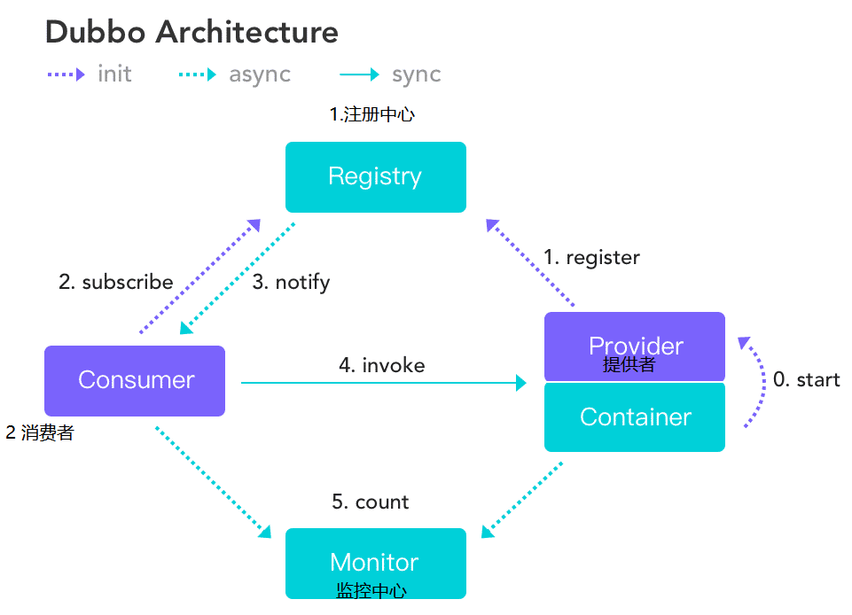](https://img2020.cnblogs.com/blog/874710/202103/874710-20210327165416057-319858511.png)

**调用流程:**

1. 服务容器负责启动，加载，运行服务提供者。
2. 服务提供者在启动时，向注册中心注册自己提供的服务。
3. 服务消费者在启动时，向注册中心订阅自己所需的服务。
4. 注册中心返回服务提供者地址列表给消费者，如果有变更，注册中心将基于长连接推送变更数据给消费者。
5. 服务消费者，从提供者地址列表中，基于软负载均衡算法，选一台提供者进行调用，如果调用失败，再选另一台调用。
6. 服务消费者和提供者，在内存中累计调用次数和调用时间，定时每分钟发送一次统计数据到监控中心。

## ***2\***|***2\*****架构体系

### 源码结构

[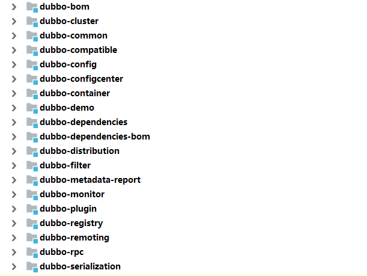](https://img2020.cnblogs.com/blog/874710/202103/874710-20210327165426716-158904719.png)

- **dubbo-common:公共逻辑模块**: 包括Util类和通用模型
- **dubbo-remoting 远程通信模块**: 相当于dubbo协议的实现，如果RPC使用RMI协议则不需要使用此包
- **dubbo-rpc 远程调用模块**: 抽象各种协议，以及动态代理，包含一对一的调用，不关心集群的原理。
- **dubbo-cluster 集群模块**: 将多个服务提供方伪装成一个提供方,包括负载均衡,容错,路由等,集群的地址列表可以是静态配置的,也可以是注册中心下发的.
- **dubbo-registry 注册中心模块**: 基于注册中心下发的集群方式,以及对各种注册中心的抽象
- **dubbo-monitor 监控模块**: 统计服务调用次数,调用时间,调用链跟踪的服务.
- **dubbo-config 配置模块**: 是dubbo对外的api,用户通过config使用dubbo,隐藏dubbo所有细节
- **dubbo-container 容器模块**: 是一个standlone的容器,以简单的main加载spring启动,因为服务通常不需要Tomcat/Jboss等web容器的特性,没必要用web容器去加载服务.

### **整体设计**

[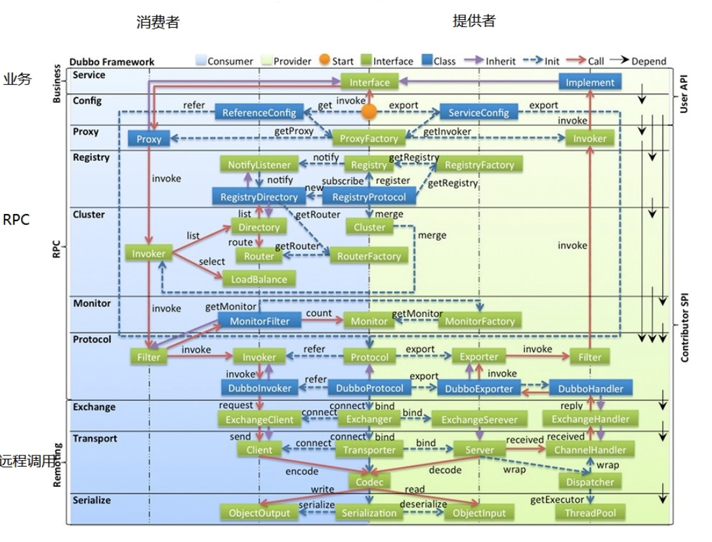](https://img2020.cnblogs.com/blog/874710/202103/874710-20210327165442208-2102582900.png)

- 图中左边淡蓝背景的为服务消费方使用的接口，右边淡绿色背景的为服务提供方使用的接口，位于中轴线上的为双方都用到的接口。
- 图中从下至上分为十层，各层均为单向依赖，每一层都可以剥离上层被复用，其中，Service 和Config 层为API，其它各层均为SPI。
- 图中绿色小块的为扩展接口，蓝色小块为实现类，图中只显示用于关联各层的实现类。
- 图中蓝色虚线为初始化过程，即启动时组装链，红色实线为方法调用过程，即运行时调时链，紫色三角箭头为继承，可以把子类看作父类的同一个节点，线上的文字为调用的方法。

### **各层说明**

- config 配置层：对外配置接口，以 ServiceConfig , ReferenceConfig 为中心，可以直接初始化配置类，也可以通过spring 解析配置生成配置类
- proxy 服务代理层：服务接口透明代理，生成服务的客户端Stub 和服务器端Skeleton, 以ServiceProxy 为中心，扩展接口为 ProxyFactory
- registry 注册中心层：封装服务地址的注册与发现，以服务URL 为中心，扩展接口为RegistryFactory , Registry , RegistryService
- cluster 路由层：封装多个提供者的路由及负载均衡，并桥接注册中心，以 Invoker 为中心，扩展接口为 Cluster , Directory , Router , LoadBalance
- monitor 监控层：RPC 调用次数和调用时间监控，以 Statistics 为中心，扩展接口为MonitorFactory , Monitor , MonitorService
- protocol 远程调用层：封装RPC 调用，以 Invocation , Result 为中心，扩展接口为Protocol , Invoker , Exporter
- exchange 信息交换层：封装请求响应模式，同步转异步，以 Request , Response 为中心，扩展接口为 Exchanger , ExchangeChannel , ExchangeClient , ExchangeServer
- transport 网络传输层：抽象mina 和netty 为统一接口，以 Message 为中心，扩展接口为Channel , Transporter , Client , Server , Codec
- serialize 数据序列化层：可复用的一些工具，扩展接口为 Serialization , ObjectInput ,ObjectOutput , ThreadPool

### **调用流程**

对照上面的整体架构图可以大致分为以下步骤：

1、服务提供者启动，开启Netty服务，创建Zookeeper客户端，向注册中心注册服务。

2、服务消费者启动，通过Zookeeper向注册中心获取服务提供者列表，与服务提供者通过Netty建立长连接。

3、服务消费者通过接口开始远程调用服务，ProxyFactory通过初始化Proxy对象，Proxy通过创建动态代理对象。

4、动态代理对象通过invoke方法，层层包装生成一个Invoker对象，该对象包含了代理对象。

5、Invoker通过路由，负载均衡选择了一个最合适的服务提供者，在通过加入各种过滤器，协议层包装生成一个新的DubboInvoker对象。

6、再通过交换成将DubboInvoker对象包装成一个Reuqest对象，该对象通过序列化通过NettyClient传输到服务提供者的NettyServer端。

7、到了服务提供者这边，再通过反序列化、协议解密等操作生成一个DubboExporter对象,再层层传递处理,会生成一个服务提供端的Invoker对象.

8、这个Invoker对象会调用本地服务，获得结果再通过层层回调返回到服务消费者，服务消费者拿到结果后，再解析获得最终结果。

## ***3\***|***0\*****Dubbo中的SPI机制*

### *3\***|***1\*什么是SPI

#### 概述

在Dubbo 中，SPI 是一个非常重要的模块。基于SPI，我们可以很容易的对Dubbo 进行拓展。如果大家想要学习Dubbo 的源码，SPI 机制务必弄懂。接下来，我们先来了解一下Java SPI 与Dubbo SPI 的用法，然后再来分析Dubbo SPI 的源码。

SPI是Service Provider Interface 服务提供接口缩写,是一种服务发现机制。SPI的本质是将接口的实现类的全限定名定义在配置文件中，并有服务器读取配置文件，并加载实现类。这样就可以在运行的时候，动态为接口替换实现类。

[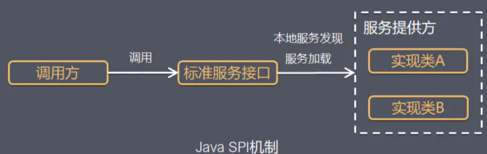](https://img2020.cnblogs.com/blog/874710/202103/874710-20210327165451264-1030819346.png)

### ***3\***|***2\*****JDK中的SPI**

Java SPI 实际上是“基于接口的编程＋策略模式＋配置文件”组合实现的动态加载机制。

通过一个案例我们来认识下SPI

定义一个接口：


```java
package com.laowang;

/**
 * @author 原
 * @date 2021/3/27
 * @since 1.0
 **/
public interface User {

    String showName();
}
```

定义两个实现类

```
package com.laowang.impl;

import com.laowang.User;

/**
 * @author 原
 * @date 2021/3/27
 * @since 1.0
 **/
public class Student implements User {
    @Override
    public String showName() {
        System.out.println("my name is laowang");
        return null;
    }
}
```


```
package com.laowang.impl;

import com.laowang.User;

/**
 * @author 原
 * @date 2021/3/27
 * @since 1.0
 **/
public class Teacher implements User {
    @Override
    public String showName() {
        System.out.println("my name is zhangsan");
        return null;
    }
}
```

在resources目录下创建文件夹META-INF.services，并在该文件夹下创建一个名称与User的全路径一致的文件com.laowang.User

在文件中写入，两个实现类的全路径名

[](https://img2020.cnblogs.com/blog/874710/202103/874710-20210327165500139-1046766161.png)

编写测试类：


```
package com.laowang;

import java.util.ServiceLoader;

/**
 * @author 原
 * @date 2021/3/27
 * @since 1.0
 **/
public class SpiTest {
    public static void main(String[] args) {
        ServiceLoader<User> serviceLoader = ServiceLoader.load(User.class);
        serviceLoader.forEach(User::showName);
    }
}
```

运行结果:

[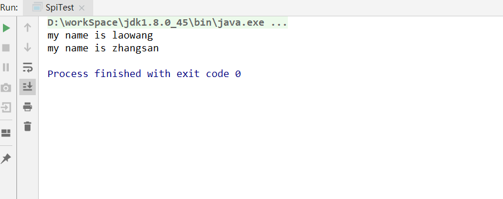](https://img2020.cnblogs.com/blog/874710/202103/874710-20210327165509026-1989292653.png)

我们发现通过SPI机制，帮我们自动运行了两个实现类。

通过查看ServiceLoader源码:

[](https://img2020.cnblogs.com/blog/874710/202103/874710-20210327165517957-896207071.png)

其实通过读取配置文件中实现类的全路径类名,通过反射创建对象,并放入providers容器中。

### **总结：**

#### **调用过程**

应用程序调用ServiceLoader.load方法，创建一个新的ServiceLoader，并实例化该类中的成员变量
应用程序通过迭代器接口获取对象实例，ServiceLoader先判断成员变量providers对象中(LinkedHashMap<String,S>类型)是否有缓存实例对象，如果有缓存，直接返回。如果没有缓存，执行类的装载，
**优点**
使用Java SPI 机制的优势是实现解耦，使得接口的定义与具体业务实现分离，而不是耦合在一起。应用进程可以根据实际业务情况启用或替换具体组件。
**缺点**
不能按需加载。虽然ServiceLoader 做了延迟载入，但是基本只能通过遍历全部获取，也就是接口的实现类得全部载入并实例化一遍。如果你并不想用某些实现类，或者某些类实例化很耗时，它也被载入并实例化了，这就造成了浪费。
获取某个实现类的方式不够灵活，只能通过Iterator 形式获取，不能根据某个参数来获取对应的实现类。
多个并发多线程使用ServiceLoader 类的实例是不安全的。
加载不到实现类时抛出并不是真正原因的异常，错误很难定位。

### ***3\***|***3\*****Dubbo中的SPI**

Dubbo 并未使用Java SPI，而是重新实现了一套功能更强的SPI 机制。Dubbo SPI 的相关逻辑被封装在了ExtensionLoader 类中，通过ExtensionLoader，我们可以加载指定的实现类。

#### **栗子**

与Java SPI 实现类配置不同，Dubbo SPI 是通过键值对的方式进行配置，这样我们可以按需加载指定的实现类。下面来演示Dubbo SPI 的用法：
Dubbo SPI 所需的配置文件需放置在META-INF/dubbo 路径下，与Java SPI 实现类配置不同，DubboSPI 是通过键值对的方式进行配置，配置内容如下。


```
optimusPrime = org.apache.spi.OptimusPrime
bumblebee = org.apache.spi.Bumblebee
```

在使用Dubbo SPI 时，需要在接口上标注@SPI 注解。


```
@SPI
public interface Robot {
void sayHello();
}
```

通过ExtensionLoader，我们可以加载指定的实现类，下面来演示Dubbo SPI ：


```
public class DubboSPITest {
   @Test
   public void sayHello() throws Exception {
       ExtensionLoader<Robot> extensionLoader =
           ExtensionLoader.getExtensionLoader(Robot.class);
       Robot optimusPrime = extensionLoader.getExtension("optimusPrime");
       optimusPrime.sayHello();
       Robot bumblebee = extensionLoader.getExtension("bumblebee");
       bumblebee.sayHello();
   }
}
```

Dubbo SPI 除了支持按需加载接口实现类，还增加了IOC 和AOP 等特性，这些特性将会在接下来的源码分析章节中一一进行介绍。

#### **源码分析**

ExtensionLoader 的getExtensionLoader 方法获取一个ExtensionLoader 实例，然后再通过ExtensionLoader 的getExtension 方法获取拓展类对象。下面我们从ExtensionLoader 的getExtension 方法作为入口，对拓展类对象的获取过程进行详细的分析。


```
public T getExtension(String name) {
       if (StringUtils.isEmpty(name)) {
           throw new IllegalArgumentException("Extension name == null");
       }
       if ("true".equals(name)) {
            // 获取默认的拓展实现类
           return getDefaultExtension();
       }
       // Holder，顾名思义，用于持有目标对象 就是从容器中获取,如果没有直接new一个Holder
       Holder<Object> holder = getOrCreateHolder(name);
       //获取目标对象实例
       Object instance = holder.get();
        // 如果目标对象实例为null 就需要通过双重检查创建实例
       if (instance == null) {
           synchronized (holder) {
               instance = holder.get();
               if (instance == null) {
                   // 创建拓展实例
                   instance = createExtension(name);
                   // 设置实例到 holder 中
                   holder.set(instance);
               }
           }
       }
       return (T) instance;
   }
```

上面代码的逻辑比较简单，首先检查缓存，缓存未命中则创建拓展对象。下面我们来看一下创建拓展对象的过程是怎样的。


```
private T createExtension(String name) {
   // 从配置文件中加载所有的拓展类，可得到“配置项名称”到“配置类”的映射关系表
   Class<?> clazz = getExtensionClasses().get(name);
   if (clazz == null) {
       throw findException(name);
   }
   try {
       //从容器中获取对应的实例对象 如果不存在就通过反射创建
       T instance = (T) EXTENSION_INSTANCES.get(clazz);
       if (instance == null) {
           // 通过反射创建实例
           EXTENSION_INSTANCES.putIfAbsent(clazz, clazz.newInstance());
           instance = (T) EXTENSION_INSTANCES.get(clazz);
       }
       // 向实例中注入依赖 下面是IOC和AOP的实现
       injectExtension(instance);
       Set<Class<?>> wrapperClasses = cachedWrapperClasses;
       if (CollectionUtils.isNotEmpty(wrapperClasses)) {
             // 循环创建 Wrapper 实例
           for (Class<?> wrapperClass : wrapperClasses) {
               // 将当前 instance 作为参数传给 Wrapper 的构造方法，并通过反射创建Wrapper 实例。
               // 然后向 Wrapper 实例中注入依赖，最后将 Wrapper 实例再次赋值给instance 变量
               instance = injectExtension(
                   (T)
wrapperClass.getConstructor(type).newInstance(instance));
           }
       }
```

createExtension 方法的逻辑稍复杂一下，包含了如下的步骤：

1. 通过getExtensionClasses 获取所有的拓展类
2. 通过反射创建拓展对象
3. 向拓展对象中注入依赖
4. 将拓展对象包裹在相应的Wrapper 对象中

以上步骤中，第一个步骤是加载拓展类的关键，第三和第四个步骤是Dubbo IOC 与AOP 的具体实现。由于此类设计源码较多，这里简单的总结下ExtensionLoader整个执行逻辑：


```
getExtension(String name)  #根据key获取拓展对象
    -->createExtension(String name) #创建拓展实例
        -->getExtensionClasses #根据路径获取所有的拓展类
            -->loadExtensionClasses #加载拓展类
                -->cacheDefaultExtensionName #解析@SPI注解
            -->loadDirectory #方法加载指定文件夹配置文件
                -->loadResource #加载资源
                    -->loadClass #加载类，并通过 loadClass 方法对类进行缓存
```

### ***3\***|***4\*****Dubbo的SPI如何实现IOC和AOP的

#### Dubbo IOC**

Dubbo IOC 是通过setter 方法注入依赖。Dubbo 首先会通过反射获取到实例的所有方法，然后再遍历方法列表，检测方法名是否具有setter 方法特征。若有，则通过ObjectFactory 获取依赖对象，最后通过反射调用setter 方法将依赖设置到目标对象中。整个过程对应的代码如下：


```
    private T injectExtension(T instance) {
        try {
            if (objectFactory != null) {
                //获取实例的所有方法
                for (Method method : instance.getClass().getMethods()) {
                    //isSetter做的事:检测方法是否以 set 开头，且方法仅有一个参数，且方法访问级别为 public
                    if (isSetter(method)) {
                        /**
                         * Check {@link DisableInject} to see if we need auto injection for this property
                         */
                        if (method.getAnnotation(DisableInject.class) != null) {
                            continue;
                        }
                        Class<?> pt = method.getParameterTypes()[0];
                        if (ReflectUtils.isPrimitives(pt)) {
                            continue;
                        }
                        try {
                            String property = getSetterProperty(method);
                            //获取依赖对象
                            Object object = objectFactory.getExtension(pt, property);
                            if (object != null) {
                                //设置属性
                                method.invoke(instance, object);
                            }
                        } catch (Exception e) {
                            logger.error("Failed to inject via method " + method.getName()
                                    + " of interface " + type.getName() + ": " + e.getMessage(), e);
                        }
                    }
                }
            }
        } catch (Exception e) {
            logger.error(e.getMessage(), e);
        }
        return instance;
    }
```

#### **Dubbo Aop**

在说这个之前，我们得先知道装饰者模式

装饰者模式：在不改变原类文件以及不使用继承的情况下，动态地将责任附加到对象上，从而实现动态拓展一个对象的功能。它是通过创建一个包装对象，也就是装饰来包裹真实的对象。

在用Spring的时候，我们经常会用到AOP功能。在目标类的方法前后插入其他逻辑。比如通常使用Spring AOP来实现日志，监控和鉴权等功能。Dubbo的扩展机制，是否也支持类似的功能呢？答案是yes。在Dubbo中，有一种特殊的类，被称为Wrapper类。通过装饰者模式，使用包装类包装原始的扩展点实例。在原始扩展点实现前后插入其他逻辑，实现AOP功能。

一般来说装饰者模式有下面几个参与者：
Component：装饰者和被装饰者共同的父类，是一个接口或者抽象类，用来定义基本行为
ConcreteComponent：定义具体对象，即被装饰者
Decorator：抽象装饰者，继承自Component，从外类来扩展ConcreteComponent。对于ConcreteComponent来说，不需要知道Decorator的存在，Decorator是一个接口或抽象类
ConcreteDecorator：具体装饰者，用于扩展ConcreteComponent

[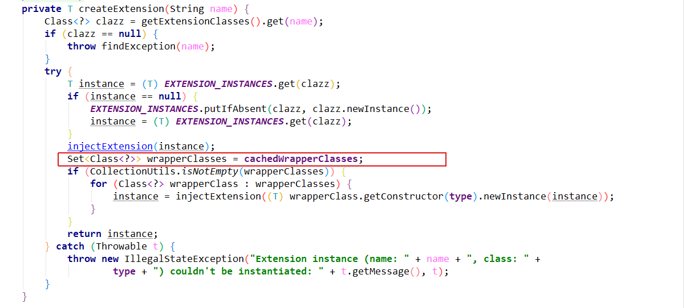](https://img2020.cnblogs.com/blog/874710/202103/874710-20210327165527614-1737800731.png)


```
//获取所有需要包装的类
Set<Class<?>> wrapperClasses = cachedWrapperClasses;
```

我们再看看cachedWrapperClasses是什么?


```
private Set<Class<?>> cachedWrapperClasses;
```

是一个set集合,那么集合是什么时候添加元素的呢?

```
    /**
     * cache wrapper class
     * <p>
     * like: ProtocolFilterWrapper, ProtocolListenerWrapper
     */
    private void cacheWrapperClass(Class<?> clazz) {
        if (cachedWrapperClasses == null) {
            cachedWrapperClasses = new ConcurrentHashSet<>();
        }
        cachedWrapperClasses.add(clazz);
    }
```

通过这个方法添加的,再看看谁调用了这个私有方法:

[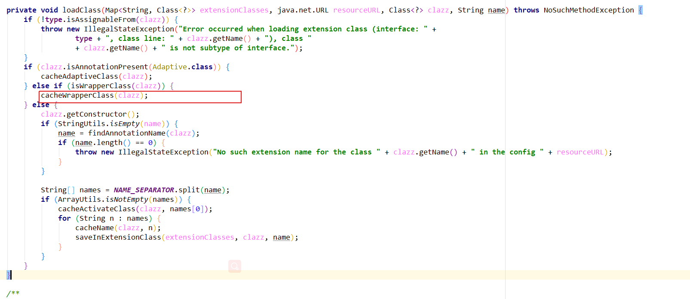](https://img2020.cnblogs.com/blog/874710/202103/874710-20210327165536321-97190377.png)


```
    /**
     * test if clazz is a wrapper class
     * <p>
     * which has Constructor with given class type as its only argument
     */
    private boolean isWrapperClass(Class<?> clazz) {
        try {
            clazz.getConstructor(type);
            return true;
        } catch (NoSuchMethodException e) {
            return false;
        }
    }
```

原来是通过isWrapperClass这个方法,判断有没有其他对象中的构造方法中持有本对象,如果有,dubbo就认为这是个装饰类,调用装饰者类的构造方法，并返回实例对象

然后通过实例化这个包装类代替需要加载的这个类。这样执行的方法就是包装类的方法。

## ***4\***|***0\*****Dubbo中的动态编译**

我们知道在Dubbo 中，很多拓展都是通过SPI 机制 进行加载的，比如Protocol、Cluster、LoadBalance、ProxyFactory 等。有时，有些拓展并不想在框架启动阶段被加载，而是希望在拓展方法被调用时，根据运行时参数进行加载，即根据参数动态加载实现类。

这种在运行时，根据方法参数才动态决定使用具体的拓展，在dubbo中就叫做扩展点自适应实例。其实是一个扩展点的代理，将扩展的选择从Dubbo启动时，延迟到RPC调用时。Dubbo中每一个扩展点都有一个自适应类，如果没有显式提供，Dubbo会自动为我们创建一个，默认使用Javaassist。

自适应拓展机制的实现逻辑是这样的

1. 首先Dubbo 会为拓展接口生成具有代理功能的代码；
2. 通过javassist 或jdk 编译这段代码，得到Class 类；
3. 通过反射创建代理类；
4. 在代理类中，通过URL对象的参数来确定到底调用哪个实现类；

### ***4\***|***1\*****javassist**

Javassist是一个开源的分析、编辑和创建Java字节码的类库。是由东京工业大学的数学和计算机科学系的Shigeru Chiba （千叶滋）所创建的。它已加入了开放源代码JBoss 应用服务器项目,通过使用Javassist对字节码操作为JBoss实现动态AOP框架。javassist是jboss的一个子项目，其主要的优点，在于简单，而且快速。直接使用java编码的形式，而不需要了解虚拟机指令，就能动态改变类的结构，或者动态生成类。


```
/**
*  Javassist是一个开源的分析、编辑和创建Java字节码的类库
*  能动态改变类的结构，或者动态生成类
*/
public class CompilerByJavassist {
public static void main(String[] args) throws Exception {
// ClassPool：class对象容器
ClassPool pool = ClassPool.getDefault();
// 通过ClassPool生成一个User类
CtClass ctClass = pool.makeClass("com.itheima.domain.User");
// 添加属性     -- private String username
CtField enameField = new CtField(pool.getCtClass("java.lang.String"),
"username", ctClass);
enameField.setModifiers(Modifier.PRIVATE);
ctClass.addField(enameField);
// 添加属性    -- private int age
CtField enoField = new CtField(pool.getCtClass("int"), "age", ctClass);
enoField.setModifiers(Modifier.PRIVATE);
ctClass.addField(enoField);
//添加方法
ctClass.addMethod(CtNewMethod.getter("getUsername", enameField));
ctClass.addMethod(CtNewMethod.setter("setUsername", enameField));
ctClass.addMethod(CtNewMethod.getter("getAge", enoField));
ctClass.addMethod(CtNewMethod.setter("setAge", enoField));
// 无参构造器
CtConstructor constructor = new CtConstructor(null, ctClass);
constructor.setBody("{}");
ctClass.addConstructor(constructor);
// 添加构造函数
//ctClass.addConstructor(new CtConstructor(new CtClass[] {}, ctClass));
CtConstructor ctConstructor = new CtConstructor(new CtClass[]
{pool.get(String.class.getName()),CtClass.intType}, ctClass);
ctConstructor.setBody("{\n this.username=$1; \n this.age=$2;\n}");
ctClass.addConstructor(ctConstructor);
// 添加自定义方法
CtMethod ctMethod = new CtMethod(CtClass.voidType, "printUser",new
CtClass[] {}, ctClass);
// 为自定义方法设置修饰符
ctMethod.setModifiers(Modifier.PUBLIC);
// 为自定义方法设置函数体
StringBuffer buffer2 = new StringBuffer();
buffer2.append("{\nSystem.out.println(\"用户信息如下\");\n")
.append("System.out.println(\"用户名=\"+username);\n")
.append("System.out.println(\"年龄=\"+age);\n").append("}");
ctMethod.setBody(buffer2.toString());
ctClass.addMethod(ctMethod);
//生成一个class
Class<?> clazz = ctClass.toClass();
Constructor cons2 =
clazz.getDeclaredConstructor(String.class,Integer.TYPE);
Object obj = cons2.newInstance("itheima",20);
//反射 执行方法
obj.getClass().getMethod("printUser", new Class[] {})
.invoke(obj, new Object[] {});
// 把生成的class文件写入文件
byte[] byteArr = ctClass.toBytecode();
FileOutputStream fos = new FileOutputStream(new File("D://User.class"));
fos.write(byteArr);
fos.close();
}
}
```

### ***4\***|***2\*****源码分析**

Adaptive注解

```java
@Documented
@Retention(RetentionPolicy.RUNTIME)
@Target({ElementType.TYPE, ElementType.METHOD})
public @interface Adaptive {
   String[] value() default {};
}
```

Adaptive 可注解在类或方法上。
标注在类上：Dubbo 不会为该类生成代理类。
标注在方法上：Dubbo 则会为该方法生成代理逻辑，表示当前方法需要根据 参数URL 调用对应的扩展点实现。

dubbo中每一个扩展点都有一个自适应类，如果没有显式提供，Dubbo会自动为我们创建一个，默认使用Javaassist。 先来看下创建自适应扩展类的代码


```java
//1、看下extensionLoader的获取方法
ExtensionLoader<Robot>extensionLoader=ExtensionLoader.getExtensionLoader(Robot.class);
//2、最终调用的是ExtensionLoader的构造方法
private ExtensionLoader(Class<?> type) {
        this.type = type;
        objectFactory = (type == ExtensionFactory.class ? null : ExtensionLoader.getExtensionLoader(ExtensionFactory.class).getAdaptiveExtension());
    }
//3、getAdaptiveExtension()看看干了什么事
    public T getAdaptiveExtension() {
        //获取自适应扩展类,如果没有就开始初始化一个
        Object instance = cachedAdaptiveInstance.get();
        if (instance == null) {
            if (createAdaptiveInstanceError == null) {
                synchronized (cachedAdaptiveInstance) {
                    instance = cachedAdaptiveInstance.get();
                    if (instance == null) {
                        try {
                            //这里创建了一个自适应扩展类
                            instance = createAdaptiveExtension();
                            cachedAdaptiveInstance.set(instance);
                        } catch (Throwable t) {
                            createAdaptiveInstanceError = t;
                            throw new IllegalStateException("Failed to create adaptive instance: " + t.toString(), t);
                        }
                    }
                }
            } else {
                throw new IllegalStateException("Failed to create adaptive instance: " + createAdaptiveInstanceError.toString(), createAdaptiveInstanceError);
            }
        }

        return (T) instance;
    }
//看看createAdaptiveExtension()
 private T createAdaptiveExtension() {
        try {
            return injectExtension((T) getAdaptiveExtensionClass().newInstance());
        } catch (Exception e) {
            throw new IllegalStateException("Can't create adaptive extension " + type + ", cause: " + e.getMessage(), e);
        }
    }
//再进到getAdaptiveExtensionClass()
    private Class<?> getAdaptiveExtensionClass() {
        getExtensionClasses();
        if (cachedAdaptiveClass != null) {
            return cachedAdaptiveClass;
        }
        return cachedAdaptiveClass = createAdaptiveExtensionClass();
    }
//继续追进去createAdaptiveExtensionClass()
private Class<?> createAdaptiveExtensionClass() {
        String code = new AdaptiveClassCodeGenerator(type, cachedDefaultName).generate();
        ClassLoader classLoader = findClassLoader();
        org.apache.dubbo.common.compiler.Compiler compiler = ExtensionLoader.getExtensionLoader(org.apache.dubbo.common.compiler.Compiler.class).getAdaptiveExtension();
        return compiler.compile(code, classLoader);
    }

//看看compiler
@SPI("javassist")
public interface Compiler {

    /**
     * Compile java source code.
     *
     * @param code        Java source code
     * @param classLoader classloader
     * @return Compiled class
     */
    Class<?> compile(String code, ClassLoader classLoader);

}
//其实到这里就知道了,通过生成一个类的字符串,再通过javassist生成一个对象
```

createAdaptiveExtensionClassCode()方法中使用一个StringBuilder来构建自适应类的Java源码。方法实现比较长，这里就不贴代码了。这种生成字节码的方式也挺有意思的，先生成Java源代码，然后编译，加载到jvm中。通过这种方式，可以更好的控制生成的Java类。而且这样也不用care各个字节码生成框架的api等。因为xxx.java文件是Java通用的，也是我们最熟悉的。只是代码的可读性不强，需要一点一点构建xx.java的内容。

## ***5\***|***0\*****服务暴露与发现*

### *5\***|***1\*服务暴露

#### 名词解释**

在Dubbo 的核心领域模型中：

- Invoker 是实体域，它是Dubbo 的核心模型，其它模型都向它靠扰，或转换成它，它代表一个可执行体，可向它发起invoke 调用，它有可能是一个本地的实现，也可能是一个远程的实现，也可能一个集群实现。在服务提供方，Invoker用于调用服务提供类。在服务消费方，Invoker用于执行远程调用。
- Protocol 是服务域，它是Invoker 暴露和引用的主功能入口，它负责Invoker 的生命周期管理。
  export：暴露远程服务
  refer：引用远程服务
- proxyFactory：获取一个接口的代理类
  getInvoker：针对server端，将服务对象，如DemoServiceImpl包装成一个Invoker对象
  getProxy：针对client端，创建接口的代理对象，例如DemoService的接口。
- Invocation 是会话域，它持有调用过程中的变量，比如方法名，参数等

#### **整体流程**

在详细探讨服务暴露细节之前 ， 我们先看一下整体duubo的服务暴露原理

[](https://img2020.cnblogs.com/blog/874710/202103/874710-20210327165547050-1942444626.png)

在整体上看，Dubbo 框架做服务暴露分为两大部分 ， 第一步将持有的服务实例通过代理转换成Invoker, 第二步会把Invoker 通过具体的协议 （ 比如Dubbo ） 转换成Exporter, 框架做了这层抽象也大大方便了功能扩展 。

服务提供方暴露服务的蓝色初始化链，时序图如下：

[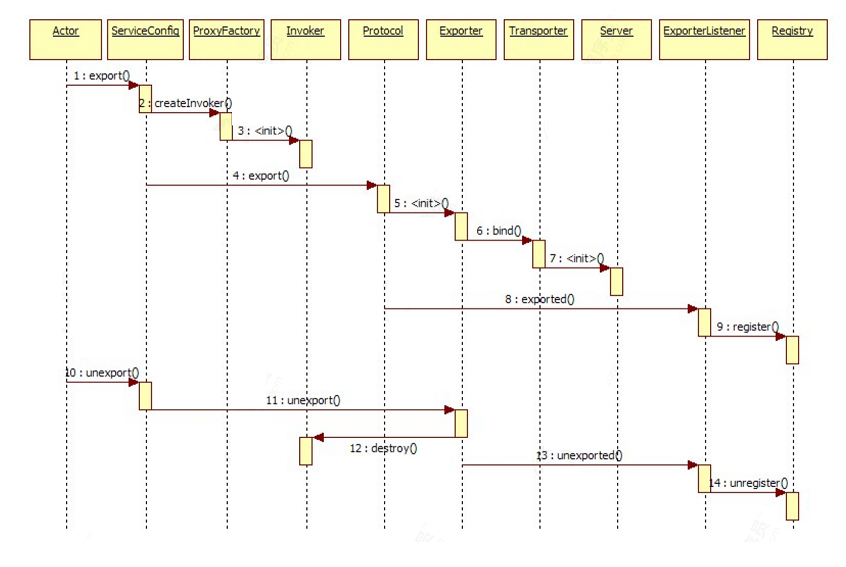](https://img2020.cnblogs.com/blog/874710/202103/874710-20210327165555700-111518722.png)

#### **源码分析**

服务导出的入口方法是ServiceBean 的onApplicationEvent。onApplicationEvent 是一个事件响应方法，该方法会在收到Spring 上下文刷新事件后执行服务导出操作。方法代码如下：


```
    @Override
    public void onApplicationEvent(ContextRefreshedEvent event) {
        if (!isExported() && !isUnexported()) {
            if (logger.isInfoEnabled()) {
                logger.info("The service ready on spring started. service: " + getInterface());
            }
            export();
        }
    }
```

通过export最终找到doExportUrls()方法


```java
private void doExportUrls() {
    	//加载配置文件中的所有注册中心，并且封装为dubbo内部的URL对象列表
        List<URL> registryURLs = loadRegistries(true);
        //循环所有协议配置，根据不同的协议，向注册中心中发起注册
        for (ProtocolConfig protocolConfig : protocols) {
            String pathKey = URL.buildKey(getContextPath(protocolConfig).map(p -> p + "/" + path).orElse(path), group, version);
            ProviderModel providerModel = new ProviderModel(pathKey, ref, interfaceClass);
            ApplicationModel.initProviderModel(pathKey, providerModel);
            //服务暴露方法
            doExportUrlsFor1Protocol(protocolConfig, registryURLs);
        }
    }
```

doExportUrlsFor1Protocol()方法代码老多了,我们只关系核心的地方

```java
...
    if (!SCOPE_NONE.equalsIgnoreCase(scope)) {

            //本地暴露，将服务数据记录到本地JVM中
            if (!SCOPE_REMOTE.equalsIgnoreCase(scope)) {
                exportLocal(url);
            }
           //远程暴露，向注册中心发送数据
            if (!SCOPE_LOCAL.equalsIgnoreCase(scope)) {
                if (!isOnlyInJvm() && logger.isInfoEnabled()) {
                    logger.info("Export dubbo service " + interfaceClass.getName() + " to url " + url);
                }
                if (CollectionUtils.isNotEmpty(registryURLs)) {
                    for (URL registryURL : registryURLs) {
                        //if protocol is only injvm ,not register
                        if (LOCAL_PROTOCOL.equalsIgnoreCase(url.getProtocol())) {
                            continue;
                        }
                        url = url.addParameterIfAbsent(DYNAMIC_KEY, registryURL.getParameter(DYNAMIC_KEY));
                        URL monitorUrl = loadMonitor(registryURL);
                        if (monitorUrl != null) {
		                    url = url.addParameterAndEncoded(MONITOR_KEY, monitorUrl.toFullString());
	                    }
                        if (logger.isInfoEnabled()) {
                            logger.info("Register dubbo service " + interfaceClass.getName() + " url " + url + " to registry " + registryURL);
                        }

                        // For providers, this is used to enable custom proxy to generate invoker
                        String proxy = url.getParameter(PROXY_KEY);
                        if (StringUtils.isNotEmpty(proxy)) {
                            registryURL = registryURL.addParameter(PROXY_KEY, proxy);
                        }
						// 为服务提供类(ref)生成 Invoker
                        Invoker<?> invoker = proxyFactory.getInvoker(ref, (Class) interfaceClass, registryURL.addParameterAndEncoded(EXPORT_KEY, url.toFullString()));
                       // DelegateProviderMetaDataInvoker 用于持有 Invoker 和ServiceConfig
                        DelegateProviderMetaDataInvoker wrapperInvoker = new DelegateProviderMetaDataInvoker(invoker, this);
                        // 导出服务，并生成 Exporter
                        Exporter<?> exporter = protocol.export(wrapperInvoker);
                        exporters.add(exporter);
                    }
                } else {
                    //不存在注册中心,仅导出服务
                    ....
                }
                /**
                 * @since 2.7.0
                 * ServiceData Store
                 */
                MetadataReportService metadataReportService = null;
                if ((metadataReportService = getMetadataReportService()) != null) {
                    metadataReportService.publishProvider(url);
                }
            }
        }
        this.urls.add(url);
```

上面代码根据url 中的scope 参数决定服务导出方式，分别如下：
scope = none，不导出服务
scope != remote，导出到本地
scope != local，导出到远程

不管是导出到本地，还是远程。进行服务导出之前，均需要先创建Invoker，这是一个很重要的步骤。因此下面先来分析Invoker 的创建过程。Invoker 是由ProxyFactory 创建而来，Dubbo 默认的ProxyFactory 实现类是JavassistProxyFactory。下面我们到JavassistProxyFactory 代码中，探索Invoker 的创建过程。如下：


```
    @Override
    public <T> Invoker<T> getInvoker(T proxy, Class<T> type, URL url) {
        // 为目标类创建warpper
        final Wrapper wrapper = Wrapper.getWrapper(proxy.getClass().getName().indexOf('$') < 0 ? proxy.getClass() : type);
        //创建匿名才invoker对象,并实现doinvoke方法
        return new AbstractProxyInvoker<T>(proxy, type, url) {
            @Override
            protected Object doInvoke(T proxy, String methodName,
                                      Class<?>[] parameterTypes,
                                      Object[] arguments) throws Throwable {
                // 调用 Wrapper 的 invokeMethod 方法，invokeMethod 最终会调用目标方法
                return wrapper.invokeMethod(proxy, methodName, parameterTypes, arguments);
            }
        };
    }
```

Invoke创建成功之后，接下来我们来看本地导出


```
    /**
     * always export injvm
     */
    private void exportLocal(URL url) {
        URL local = URLBuilder.from(url)
                .setProtocol(LOCAL_PROTOCOL) // 设置协议头为 injvm
                .setHost(LOCALHOST_VALUE)//本地ip:127.0.0.1
                .setPort(0)
                .build();
        // 创建 Invoker，并导出服务，这里的 protocol 会在运行时调用 InjvmProtocol 的export 方法
        Exporter<?> exporter = protocol.export(
                proxyFactory.getInvoker(ref, (Class) interfaceClass, local));
        exporters.add(exporter);
        logger.info("Export dubbo service " + interfaceClass.getName() + " to local registry url : " + local);
    }
```

exportLocal 方法比较简单，首先根据URL 协议头决定是否导出服务。若需导出，则创建一个新的URL并将协议头、主机名以及端口设置成新的值。然后创建Invoker，并调用InjvmProtocol 的export 方法导出服务。下面我们来看一下InjvmProtocol 的export 方法都做了哪些事情。


```
    @Override
    public <T> Exporter<T> export(Invoker<T> invoker) throws RpcException {
        return new InjvmExporter<T>(invoker, invoker.getUrl().getServiceKey(), exporterMap);
    }
```

如上，InjvmProtocol 的export 方法仅创建了一个InjvmExporter，无其他逻辑。到此导出服务到本地就分析完了。

再看看导出服务到远程

接下来，我们继续分析导出服务到远程的过程。导出服务到远程包含了服务导出与服务注册两个过程。先来分析服务导出逻辑。我们把目光移动到RegistryProtocol 的export 方法上。


```
    @Override
    public <T> Exporter<T> export(final Invoker<T> originInvoker) throws RpcException {
        // 获取注册中心 URL
        URL registryUrl = getRegistryUrl(originInvoker);
        URL providerUrl = getProviderUrl(originInvoker);
        final URL overrideSubscribeUrl = getSubscribedOverrideUrl(providerUrl);
        final OverrideListener overrideSubscribeListener = new OverrideListener(overrideSubscribeUrl, originInvoker);
        overrideListeners.put(overrideSubscribeUrl, overrideSubscribeListener);

        providerUrl = overrideUrlWithConfig(providerUrl, overrideSubscribeListener);

	    //导出服务
        final ExporterChangeableWrapper<T> exporter = doLocalExport(originInvoker, providerUrl);

	    // 根据 URL 加载 Registry 实现类，比如 ZookeeperRegistry
        final Registry registry = getRegistry(originInvoker);

	    //获取已注册的服务提供者 URL，
        final URL registeredProviderUrl = getRegisteredProviderUrl(providerUrl, registryUrl);
        ProviderInvokerWrapper<T> providerInvokerWrapper = ProviderConsumerRegTable.registerProvider(originInvoker,
                registryUrl, registeredProviderUrl);
        //to judge if we need to delay publish
        boolean register = registeredProviderUrl.getParameter("register", true);
        if (register) {
            // 向注册中心注册服务
            register(registryUrl, registeredProviderUrl);
            providerInvokerWrapper.setReg(true);
        }

        //  向注册中心进行订阅 override 数据
        registry.subscribe(overrideSubscribeUrl, overrideSubscribeListener);

        exporter.setRegisterUrl(registeredProviderUrl);
        exporter.setSubscribeUrl(overrideSubscribeUrl);
        // 创建并返回 DestroyableExporter
        return new DestroyableExporter<>(exporter);
    }
```

上面代码看起来比较复杂，主要做如下一些操作：

1. 调用doLocalExport 导出服务
2. 向注册中心注册服务
3. 向注册中心进行订阅override 数据
4. 创建并返回DestroyableExporter

看看doLocalExport 做了什么


```
    private <T> ExporterChangeableWrapper<T> doLocalExport(final Invoker<T> originInvoker, URL providerUrl) {
        String key = getCacheKey(originInvoker);

        return (ExporterChangeableWrapper<T>) bounds.computeIfAbsent(key, s -> {
            Invoker<?> invokerDelegate = new InvokerDelegate<>(originInvoker, providerUrl);
            //protocol和配置的协议相关（dubbo：DubboProtocol）
            return new ExporterChangeableWrapper<>((Exporter<T>) protocol.export(invokerDelegate), originInvoker);
        });
    }
```

接下来，我们把重点放在Protocol 的export 方法上。假设运行时协议为dubbo，此处的protocol 变量会在运行时加载DubboProtocol，并调用DubboProtocol 的export 方法。


```
    public <T> Exporter<T> export(Invoker<T> invoker) throws RpcException {
        URL url = invoker.getUrl();

        // export service.获取服务标识，理解成服务坐标也行。由服务组名，服务名，服务版本号以及端口组成。比如：demoGroup/com.alibaba.dubbo.demo.DemoService:1.0.1:20880
        String key = serviceKey(url);
        //创建DubboExporter
        DubboExporter<T> exporter = new DubboExporter<T>(invoker, key, exporterMap);
        exporterMap.put(key, exporter); //key：接口 （DemoService）

        //export an stub service for dispatching event
        Boolean isStubSupportEvent = url.getParameter(STUB_EVENT_KEY, DEFAULT_STUB_EVENT);
        Boolean isCallbackservice = url.getParameter(IS_CALLBACK_SERVICE, false);
        if (isStubSupportEvent && !isCallbackservice) {
            String stubServiceMethods = url.getParameter(STUB_EVENT_METHODS_KEY);
            if (stubServiceMethods == null || stubServiceMethods.length() == 0) {
                if (logger.isWarnEnabled()) {
                    logger.warn(new IllegalStateException("consumer [" + url.getParameter(INTERFACE_KEY) +
                            "], has set stubproxy support event ,but no stub methods founded."));
                }

            } else {
                stubServiceMethodsMap.put(url.getServiceKey(), stubServiceMethods);
            }
        }
		//启动服务
        openServer(url);
        //优化序列器
        optimizeSerialization(url);

        return exporter;
    }
```

如上，我们重点关注DubboExporter 的创建以及openServer 方法，其他逻辑看不懂也没关系，不影响理解服务导出过程。下面分析openServer 方法。


```
    private void openServer(URL url) {
        // find server.
        String key = url.getAddress();
        //client can export a service which's only for server to invoke
        boolean isServer = url.getParameter(IS_SERVER_KEY, true);
        if (isServer) {
            //访问缓存
            ExchangeServer server = serverMap.get(key);
            if (server == null) {
                synchronized (this) {
                    server = serverMap.get(key);
                    if (server == null) {
                        //创建服务器实例
                        serverMap.put(key, createServer(url));
                    }
                }
            } else {
                // server supports reset, use together with override
                server.reset(url);
            }
        }
    }
```

接下来分析服务器实例的创建过程。如下


```
    private ExchangeServer createServer(URL url) {
        url = URLBuilder.from(url)
                // send readonly event when server closes, it's enabled by default
                .addParameterIfAbsent(CHANNEL_READONLYEVENT_SENT_KEY, Boolean.TRUE.toString())
                // enable heartbeat by default
                .addParameterIfAbsent(HEARTBEAT_KEY, String.valueOf(DEFAULT_HEARTBEAT))
                .addParameter(CODEC_KEY, DubboCodec.NAME)
                .build();
        String str = url.getParameter(SERVER_KEY, DEFAULT_REMOTING_SERVER);
        
		// 通过 SPI 检测是否存在 server 参数所代表的 Transporter 拓展，不存在则抛出异常
        if (str != null && str.length() > 0 && !ExtensionLoader.getExtensionLoader(Transporter.class).hasExtension(str)) {
            throw new RpcException("Unsupported server type: " + str + ", url: " + url);
        }

        ExchangeServer server;
        try {
            // 创建 ExchangeServer
            server = Exchangers.bind(url, requestHandler);
        } catch (RemotingException e) {
            throw new RpcException("Fail to start server(url: " + url + ") " + e.getMessage(), e);
        }
        
		// 获取 client 参数，可指定 netty，mina
        str = url.getParameter(CLIENT_KEY);
        if (str != null && str.length() > 0) {
            // 获取所有的 Transporter 实现类名称集合，比如 supportedTypes = [netty, mina]
            Set<String> supportedTypes = ExtensionLoader.getExtensionLoader(Transporter.class).getSupportedExtensions();
            // 检测当前 Dubbo 所支持的 Transporter 实现类名称列表中，
      		 // 是否包含 client 所表示的 Transporter，若不包含，则抛出异常
            if (!supportedTypes.contains(str)) {
                throw new RpcException("Unsupported client type: " + str);
            }
        }

        return server;
    }
```

如上，createServer 包含三个核心的逻辑。

第一是检测是否存在server 参数所代表的Transporter 拓展，不存在则抛出异常。

第二是创建服务器实例。

第三是检测是否支持client 参数所表示的Transporter 拓展，不存在也是抛出异常。两次检测操作所对应的代码较直白了，无需多说。但创建服务器的操作目前还不是很清晰，我们继续往下看。


```
    public static ExchangeServer bind(URL url, ExchangeHandler handler) throws RemotingException {
        if (url == null) {
            throw new IllegalArgumentException("url == null");
        }
        if (handler == null) {
            throw new IllegalArgumentException("handler == null");
        }
        url = url.addParameterIfAbsent(Constants.CODEC_KEY, "exchange");
        // 获取 Exchanger，默认为 HeaderExchanger。
   		// 紧接着调用 HeaderExchanger 的 bind 方法创建 ExchangeServer 实例
        return getExchanger(url).bind(url, handler);
    }
```

上面代码比较简单，就不多说了。下面看一下HeaderExchanger 的bind 方法。


```
    public ExchangeServer bind(URL url, ExchangeHandler handler) throws RemotingException {
        // 创建 HeaderExchangeServer 实例，该方法包含了多个逻辑，分别如下：
        //   1. new HeaderExchangeHandler(handler)
        //   2. new DecodeHandler(new HeaderExchangeHandler(handler))
        //   3. Transporters.bind(url, new DecodeHandler(new
HeaderExchangeHandler(handler)))
        return new HeaderExchangeServer(Transporters.bind(url, new ChannelHandler[]{new DecodeHandler(new HeaderExchangeHandler(handler))}));
    }
```

HeaderExchanger 的bind 方法包含的逻辑比较多，但目前我们仅需关心Transporters 的bind 方法逻
辑即可。该方法的代码如下：


```
    public static Server bind(URL url, ChannelHandler... handlers) throws RemotingException {
        if (url == null) {
            throw new IllegalArgumentException("url == null");
        } else if (handlers != null && handlers.length != 0) {
            Object handler;
            if (handlers.length == 1) {
                handler = handlers[0];
            } else {
                // 如果 handlers 元素数量大于1，则创建 ChannelHandler 分发器
                handler = new ChannelHandlerDispatcher(handlers);
            }
			// 获取自适应 Transporter 实例，并调用实例方法
            return getTransporter().bind(url, (ChannelHandler)handler);
        } else {
            throw new IllegalArgumentException("handlers == null");
        }
    }
```

如上，getTransporter() 方法获取的Transporter 是在运行时动态创建的，类名为TransporterAdaptive，也就是自适应拓展类。TransporterAdaptive 会在运行时根据传入的URL 参数决定加载什么类型的Transporter，默认为NettyTransporter。调用 NettyTransporter.bind(URL,ChannelHandler) 方法。创建一个 NettyServer 实例。调用 NettyServer.doOPen() 方法，服务器被开启，服务也被暴露出来了。

#### **服务注册**

本节内容以Zookeeper 注册中心作为分析目标，其他类型注册中心大家可自行分析。下面从服务注册
的入口方法开始分析，我们把目光再次移到RegistryProtocol 的export 方法上。如下：

[](https://img2020.cnblogs.com/blog/874710/202103/874710-20210327165604685-461321921.png)

进入到register()方法


```
    public void register(URL registryUrl, URL registeredProviderUrl) {
        //获得注册中心实例
        Registry registry = registryFactory.getRegistry(registryUrl);
        //进行注册
        registry.register(registeredProviderUrl);
    }
```

看看getRegistry()方法


```
    @Override
    public Registry getRegistry(URL url) {
        url = URLBuilder.from(url)
                .setPath(RegistryService.class.getName())
                .addParameter(INTERFACE_KEY, RegistryService.class.getName())
                .removeParameters(EXPORT_KEY, REFER_KEY)
                .build();
        String key = url.toServiceStringWithoutResolving();
        // Lock the registry access process to ensure a single instance of the registry
        LOCK.lock();
        try {
            Registry registry = REGISTRIES.get(key);
            if (registry != null) {
                return registry;
            }
            //create registry by spi/ioc
            registry = createRegistry(url);
            if (registry == null) {
                throw new IllegalStateException("Can not create registry " + url);
            }
            REGISTRIES.put(key, registry);
            return registry;
        } finally {
            // Release the lock
            LOCK.unlock();
        }
    }
```

进入createRegistry()方法


```
    @Override
    public Registry createRegistry(URL url) {
        return new ZookeeperRegistry(url, zookeeperTransporter);
    }
```


```
    public ZookeeperRegistry(URL url, ZookeeperTransporter zookeeperTransporter) {
        super(url);
        if (url.isAnyHost()) {
            throw new IllegalStateException("registry address == null");
        }
        //// 获取组名，默认为 dubbo
        String group = url.getParameter(GROUP_KEY, DEFAULT_ROOT);
        if (!group.startsWith(PATH_SEPARATOR)) {
            group = PATH_SEPARATOR + group;
        }
        this.root = group;
        // 创建 Zookeeper 客户端，默认为 CuratorZookeeperTransporter
        zkClient = zookeeperTransporter.connect(url);
        // 添加状态监听器
        zkClient.addStateListener(state -> {
            if (state == StateListener.RECONNECTED) {
                try {
                    recover();
                } catch (Exception e) {
                    logger.error(e.getMessage(), e);
                }
            }
        });
    }
```

在上面的代码代码中，我们重点关注ZookeeperTransporter 的connect 方法调用，这个方法用于创建
Zookeeper 客户端。创建好Zookeeper 客户端，意味着注册中心的创建过程就结束了。

搞懂了服务注册的本质，那么接下来我们就可以去阅读服务注册的代码了。


```
    public void doRegister(URL url) {
        try {
            // 通过 Zookeeper 客户端创建节点，节点路径由 toUrlPath 方法生成，路径格式如下:
       //  /${group}/${serviceInterface}/providers/${url}
       // 比如 /dubbo/org.apache.dubbo.DemoService/providers/dubbo%3A%2F%2F127.0.0.1......
            zkClient.create(toUrlPath(url), url.getParameter(DYNAMIC_KEY, true));
        } catch (Throwable e) {
            throw new RpcException("Failed to register " + url + " to zookeeper " + getUrl() + ", cause: " + e.getMessage(), e);
        }
    }
```


```
    @Override
    public void create(String path, boolean ephemeral) {
        if (!ephemeral) {
            // 如果要创建的节点类型非临时节点，那么这里要检测节点是否存在
            if (checkExists(path)) {
                return;
            }
        }
        int i = path.lastIndexOf('/');
        if (i > 0) {
            // 递归创建上一级路径
            create(path.substring(0, i), false);
        }
        // 根据 ephemeral 的值创建临时或持久节点
        if (ephemeral) {
            createEphemeral(path);
        } else {
            createPersistent(path);
        }
    }
```

好了，到此关于服务注册的过程就分析完了。整个过程可简单总结为：先创建注册中心实例，之后再通过注册中心实例注册服务。

### **总结**

1. 在有注册中心，需要注册提供者地址的情况下，ServiceConfig 解析出的URL 格式为：registry:// registry-host/org.apache.dubbo.registry.RegistryService?export=URL.encode("dubbo://service-host/{服务名}/{版本号}")
2. 基于Dubbo SPI 的自适应机制，通过URL registry:// 协议头识别，就调用RegistryProtocol#export() 方法
3. 将具体的服务类名，比如 DubboServiceRegistryImpl ，通过ProxyFactory 包装成Invoker 实例
4. 调用doLocalExport 方法，使用DubboProtocol 将Invoker 转化为Exporter 实例，并打开Netty 服务端监听客户请求
5. 创建Registry 实例，连接Zookeeper，并在服务节点下写入提供者的URL 地址，注册服务
6. 向注册中心订阅override 数据，并返回一个Exporter 实例
7. 根据URL 格式中的 "dubbo://service-host/{服务名}/{版本号}" 中协议头 dubbo:// 识别，调用`DubboProtocol#export()`方法，开发服务端口
8. RegistryProtocol#export() 返回的Exporter 实例存放到ServiceConfig 的 `List<Exporter>exporters` 中


https://www.cnblogs.com/whgk/p/14586249.html


# ...接上文

## ***0\***|***1\*****服务发现

### 服务发现流程**

整体duubo的服务消费原理

[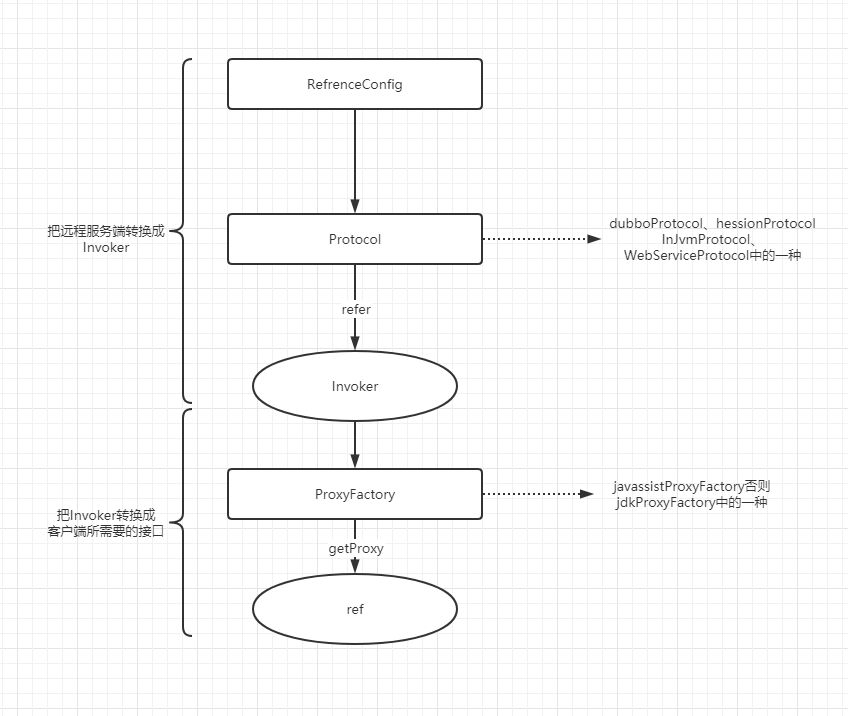](https://img2020.cnblogs.com/blog/874710/202103/874710-20210329111313592-1276109904.png)

Dubbo 框架做服务消费也分为两大部分 ， 第一步通过持有远程服务实例生成Invoker,这个Invoker 在客户端是核心的远程代理对象 。 第二步会把Invoker 通过动态代理转换成实现用户接口的动态代理引用 。

服务消费方引用服务的蓝色初始化链，时序图

[](https://img2020.cnblogs.com/blog/874710/202103/874710-20210329111323951-408035979.png)

### **源码分析应用**

引用入口:ReferenceBean 的getObject 方法，该方法定义在Spring 的FactoryBean 接口中，ReferenceBean 实现了这个方法。


```
public Object getObject() throws Exception {
   return get();
}
public synchronized T get() {
   // 检测 ref 是否为空，为空则通过 init 方法创建
   if (ref == null) {
       // init 方法主要用于处理配置，以及调用 createProxy 生成代理类
       init();
   }
   return ref;
}
```

Dubbo 提供了丰富的配置，用于调整和优化框架行为，性能等。Dubbo 在引用或导出服务时，首先会对这些配置进行检查和处理，以保证配置的正确性。


```
private void init() {
   // 创建代理类
   ref = createProxy(map);
}
```

此方法代码很长，主要完成的配置加载，检查，以及创建引用的代理对象。这里要从createProxy 开始看起。从字面意思上来看，createProxy 似乎只是用于创建代理对象的。但实际上并非如此，该方法还会调用其他方法构建以及合并Invoker 实例。具体细节如下。


```
private T createProxy(Map<String, String> map) {
   URL tmpUrl = new URL("temp", "localhost", 0, map);
...........
isDvmRefer = InjvmProtocol . getlnjvmProtocol( ) . islnjvmRefer(tmpUrl)
   // 本地引用略
   if (isJvmRefer) {
   } else {
       // 点对点调用略
       if (url != null && url.length() > 0) {
           
       } else {
           // 加载注册中心 url
           List<URL> us = loadRegistries(false);
           if (us != null && !us.isEmpty()) {
               for (URL u : us) {
                   URL monitorUrl = loadMonitor(u);
                   if (monitorUrl != null) {
                       map.put(Constants.MONITOR_KEY,
URL.encode(monitorUrl.toFullString()));
                   }
                   // 添加 refer 参数到 url 中，并将 url 添加到 urls 中
                   urls.add(u.addParameterAndEncoded(Constants.REFER_KEY,
StringUtils.toQueryString(map)));
               }
           }
       }
       // 单个注册中心或服务提供者(服务直连，下同)
       if (urls.size() == 1) {
           // 调用 RegistryProtocol 的 refer 构建 Invoker 实例
           invoker = refprotocol.refer(interfaceClass, urls.get(0));
       // 多个注册中心或多个服务提供者，或者两者混合
       } else {
           List<Invoker<?>> invokers = new ArrayList<Invoker<?>>();
           URL registryURL = null;
           // 获取所有的 Invoker
           for (URL url : urls) {
               // 通过 refprotocol 调用 refer 构建 Invoker，refprotocol 会在运行时
               // 根据 url 协议头加载指定的 Protocol 实例，并调用实例的 refer 方法
               invokers.add(refprotocol.refer(interfaceClass, url));
               if (Constants.REGISTRY_PROTOCOL.equals(url.getProtocol())) {
                   registryURL = url;
               }
           }
           if (registryURL != null) {
               // 如果注册中心链接不为空，则将使用 AvailableCluster
               URL u = registryURL.addParameter(Constants.CLUSTER_KEY,
AvailableCluster.NAME);
               // 创建 StaticDirectory 实例，并由 Cluster 对多个 Invoker 进行合并
               invoker = cluster.join(new StaticDirectory(u, invokers));
           } else {
               invoker = cluster.join(new StaticDirectory(invokers));
           }
       }
   }
    //省略无关代码...
    // 生成代理类
   return (T) proxyFactory.getProxy(invoker);
}   
```

上面代码很多，不过逻辑比较清晰。
1、如果是本地调用，直接jvm 协议从内存中获取实例
2、如果只有一个注册中心，直接通过Protocol 自适应拓展类构建Invoker 实例接口
3、如果有多个注册中心，此时先根据url 构建Invoker。然后再通过Cluster 合并多个Invoker，最后调用ProxyFactory 生成代理类

### **创建客户端**

在服务消费方，Invoker 用于执行远程调用。Invoker 是由Protocol 实现类构建而来。Protocol 实现类有很多，这里分析DubboProtocol


```
public <T> Invoker<T> refer(Class<T> serviceType, URL url) throws RpcException {
   optimizeSerialization(url);
   // 创建 DubboInvoker
   DubboInvoker<T> invoker = new DubboInvoker<T>(serviceType, url,
getClients(url), invokers);
   invokers.add(invoker);
   return invoker;
}
```

上面方法看起来比较简单，创建一个DubboInvoker。通过构造方法传入远程调用的client对象。默认情况下，Dubbo 使用NettyClient 进行通信。接下来，我们简单看一下getClients 方法的逻辑。


```
private ExchangeClient[] getClients(URL url) {
   // 是否共享连接
   boolean service_share_connect = false;
// 获取连接数，默认为0，表示未配置
   int connections = url.getParameter(Constants.CONNECTIONS_KEY, 0);
   // 如果未配置 connections，则共享连接
   if (connections == 0) {
       service_share_connect = true;
       connections = 1;
   }
   ExchangeClient[] clients = new ExchangeClient[connections];
   for (int i = 0; i < clients.length; i++) {
       if (service_share_connect) {
           // 获取共享客户端
           clients[i] = getSharedClient(url);
       } else {
           // 初始化新的客户端
           clients[i] = initClient(url);
       }
   }
   return clients;
}
```

这里根据connections 数量决定是获取共享客户端还是创建新的客户端实例，getSharedClient 方法中也会调用initClient 方法，因此下面我们一起看一下这个方法。


```
private ExchangeClient initClient(URL url) {
   // 获取客户端类型，默认为 netty
   String str = url.getParameter(Constants.CLIENT_KEY,
url.getParameter(Constants.SERVER_KEY, Constants.DEFAULT_REMOTING_CLIENT));
   //省略无关代码
   ExchangeClient client;
   try {
       // 获取 lazy 配置，并根据配置值决定创建的客户端类型
       if (url.getParameter(Constants.LAZY_CONNECT_KEY, false)) {
           // 创建懒加载 ExchangeClient 实例
           client = new LazyConnectExchangeClient(url, requestHandler);
       } else {
           // 创建普通 ExchangeClient 实例
           client = Exchangers.connect(url, requestHandler);
       }
   } catch (RemotingException e) {
       throw new RpcException("Fail to create remoting client for service...");
   }
   return client;
}
```

initClient 方法首先获取用户配置的客户端类型，默认为netty。下面我们分析一下Exchangers 的connect 方法。


```
public static ExchangeClient connect(URL url, ExchangeHandler handler) throws
RemotingException {
   // 获取 Exchanger 实例，默认为 HeaderExchangeClient
   return getExchanger(url).connect(url, handler);
}
```

如上，getExchanger 会通过SPI 加载HeaderExchangeClient 实例，这个方法比较简单，大家自己看一下吧。接下来分析HeaderExchangeClient 的实现。


```
public ExchangeClient connect(URL url, ExchangeHandler handler) throws
RemotingException {
   // 这里包含了多个调用，分别如下：
   // 1. 创建 HeaderExchangeHandler 对象
   // 2. 创建 DecodeHandler 对象
   // 3. 通过 Transporters 构建 Client 实例
   // 4. 创建 HeaderExchangeClient 对象
   return new HeaderExchangeClient(Transporters.connect(url, new
DecodeHandler(new HeaderExchangeHandler(handler))), true);
}
```

这里的调用比较多，我们这里重点看一下Transporters 的connect 方法。如下：


```
public static Client connect(URL url, ChannelHandler... handlers) throws
RemotingException {
   if (url == null) {
       throw new IllegalArgumentException("url == null");
       }
   ChannelHandler handler;
   if (handlers == null || handlers.length == 0) {
       handler = new ChannelHandlerAdapter();
   } else if (handlers.length == 1) {
       handler = handlers[0];
   } else {
       // 如果 handler 数量大于1，则创建一个 ChannelHandler 分发器
       handler = new ChannelHandlerDispatcher(handlers);
   }
   
   // 获取 Transporter 自适应拓展类，并调用 connect 方法生成 Client 实例
   return getTransporter().connect(url, handler);
}
```

如上，getTransporter 方法返回的是自适应拓展类，该类会在运行时根据客户端类型加载指定的Transporter 实现类。若用户未配置客户端类型，则默认加载NettyTransporter，并调用该类的connect 方法。如下：


```
public Client connect(URL url, ChannelHandler listener) throws RemotingException
{
   // 创建 NettyClient 对象
   return new NettyClient(url, listener);
}
```

### **注册**

这里就已经创建好了NettyClient对象。关于DubboProtocol 的refer 方法就分析完了。接下来，继续分析RegistryProtocol 的refer 方法逻辑。


```
public <T> Invoker<T> refer(Class<T> type, URL url) throws RpcException {
   // 取 registry 参数值，并将其设置为协议头
   url = url.setProtocol(url.getParameter(Constants.REGISTRY_KEY,
Constants.DEFAULT_REGISTRY)).removeParameter(Constants.REGISTRY_KEY);
   // 获取注册中心实例
   Registry registry = registryFactory.getRegistry(url);
   if (RegistryService.class.equals(type)) {
       return proxyFactory.getInvoker((T) registry, type, url);
   }
   // 将 url 查询字符串转为 Map
   Map<String, String> qs =
StringUtils.parseQueryString(url.getParameterAndDecoded(Constants.REFER_KEY));
   // 获取 group 配置
   String group = qs.get(Constants.GROUP_KEY);
   if (group != null && group.length() > 0) {
       if ((Constants.COMMA_SPLIT_PATTERN.split(group)).length > 1
               || "*".equals(group)) {
           // 通过 SPI 加载 MergeableCluster 实例，并调用 doRefer 继续执行服务引用逻辑
           return doRefer(getMergeableCluster(), registry, type, url);
       }
   }
   
   // 调用 doRefer 继续执行服务引用逻辑
   return doRefer(cluster, registry, type, url);
}
```

上面代码首先为url 设置协议头，然后根据url 参数加载注册中心实例。然后获取group 配置，根据group 配置决定doRefer 第一个参数的类型。这里的重点是doRefer 方法，如下：


```
private <T> Invoker<T> doRefer(Cluster cluster, Registry registry, Class<T>
type, URL url) {
   // 创建 RegistryDirectory 实例
   RegistryDirectory<T> directory = new RegistryDirectory<T>(type, url);
   // 设置注册中心和协议
   directory.setRegistry(registry);
   directory.setProtocol(protocol);
   Map<String, String> parameters = new HashMap<String, String>
(directory.getUrl().getParameters());
   // 生成服务消费者链接
   URL subscribeUrl = new URL(Constants.CONSUMER_PROTOCOL,
parameters.remove(Constants.REGISTER_IP_KEY), 0, type.getName(), parameters);
   // 注册服务消费者，在 consumers 目录下新节点
   if (!Constants.ANY_VALUE.equals(url.getServiceInterface())
           && url.getParameter(Constants.REGISTER_KEY, true)) {
       registry.register(subscribeUrl.addParameters(Constants.CATEGORY_KEY,
Constants.CONSUMERS_CATEGORY,
               Constants.CHECK_KEY, String.valueOf(false)));
   }
   // 订阅 providers、configurators、routers 等节点数据
   directory.subscribe(subscribeUrl.addParameter(Constants.CATEGORY_KEY,
           Constants.PROVIDERS_CATEGORY
                   + "," + Constants.CONFIGURATORS_CATEGORY
                   + "," + Constants.ROUTERS_CATEGORY));
   // 一个注册中心可能有多个服务提供者，因此这里需要将多个服务提供者合并为一个
   Invoker invoker = cluster.join(directory);
   ProviderConsumerRegTable.registerConsumer(invoker, url, subscribeUrl,
directory);
   return invoker;
}
```

如上，doRefer 方法创建一个RegistryDirectory 实例，然后生成服务者消费者链接，并向注册中心进行注册。注册完毕后，紧接着订阅providers、configurators、routers 等节点下的数据。完成订阅后，RegistryDirectory 会收到这几个节点下的子节点信息。由于一个服务可能部署在多台服务器上，这样就会在providers 产生多个节点，这个时候就需要Cluster 将多个服务节点合并为一个，并生成一个Invoker。

### **创建代理对象**

Invoker 创建完毕后，接下来要做的事情是为服务接口生成代理对象。有了代理对象，即可进行远程调用。代理对象生成的入口方法为ProxyFactory 的getProxy，接下来进行分析。


```
public <T> T getProxy(Invoker<T> invoker) throws RpcException {
   // 调用重载方法
   return getProxy(invoker, false);
}
public <T> T getProxy(Invoker<T> invoker, boolean generic) throws RpcException {
   Class<?>[] interfaces = null;
   // 获取接口列表
    String config = invoker.getUrl().getParameter("interfaces");
   if (config != null && config.length() > 0) {
       // 切分接口列表
       String[] types = Constants.COMMA_SPLIT_PATTERN.split(config);
       if (types != null && types.length > 0) {
           interfaces = new Class<?>[types.length + 2];
           // 设置服务接口类和 EchoService.class 到 interfaces 中
           interfaces[0] = invoker.getInterface();
           interfaces[1] = EchoService.class;
           for (int i = 0; i < types.length; i++) {
               // 加载接口类
               interfaces[i + 1] = ReflectUtils.forName(types[i]);
           }
       }
   }
   if (interfaces == null) {
       interfaces = new Class<?>[]{invoker.getInterface(), EchoService.class};
   }
   // 为 http 和 hessian 协议提供泛化调用支持，参考 pull request #1827
   if (!invoker.getInterface().equals(GenericService.class) && generic) {
       int len = interfaces.length;
       Class<?>[] temp = interfaces;
       // 创建新的 interfaces 数组
       interfaces = new Class<?>[len + 1];
       System.arraycopy(temp, 0, interfaces, 0, len);
       // 设置 GenericService.class 到数组中
       interfaces[len] = GenericService.class;
   }
   // 调用重载方法
   return getProxy(invoker, interfaces);
}
public abstract <T> T getProxy(Invoker<T> invoker, Class<?>[] types);
```

如上，上面大段代码都是用来获取interfaces 数组的，我们继续往下看。getProxy(Invoker, Class<?>[]) 这个方法是一个抽象方法，下面我们到JavassistProxyFactory 类中看一下该方法的实现代码。


```
public <T> T getProxy(Invoker<T> invoker, Class<?>[] interfaces) {
   // 生成 Proxy 子类（Proxy 是抽象类）。并调用 Proxy 子类的 newInstance 方法创建Proxy 实例
   return (T) Proxy.getProxy(interfaces).newInstance(new
InvokerInvocationHandler(invoker));
}
```

上面代码并不多，首先是通过Proxy 的getProxy 方法获取Proxy 子类，然后创建InvokerInvocationHandler 对象，并将该对象传给newInstance 生成Proxy 实例。InvokerInvocationHandler 实现JDK 的InvocationHandler 接口，具体的用途是拦截接口类调用。下面以org.apache.dubbo.demo.DemoService 这个接口为例，来看一下该接口代理类代码大致是怎样的（忽略EchoService 接口）。


```
package org.apache.dubbo.common.bytecode;
public class proxy0 implements org.apache.dubbo.demo.DemoService {
   public static java.lang.reflect.Method[] methods;
   private java.lang.reflect.InvocationHandler handler;
   public proxy0() {
   }
   public proxy0(java.lang.reflect.InvocationHandler arg0) {
       handler = $1;
   }
   public java.lang.String sayHello(java.lang.String arg0) {
       Object[] args = new Object[1];
       args[0] = ($w) $1;
       Object ret = handler.invoke(this, methods[0], args);
       return (java.lang.String) ret;
   }
}
```

好了，到这里代理类生成逻辑就分析完了。整个过程比较复杂，大家需要耐心看一下。

### **总结**

1. 从注册中心发现引用服务：在有注册中心，通过注册中心发现提供者地址的情况下，ReferenceConfig 解析出的URL 格式为： registry://registryhost:/org.apache.registry.RegistryService?refer=URL.encode("conumerhost/com.foo.FooService?version=1.0.0") 。
2. 通过URL 的registry://协议头识别，就会调用RegistryProtocol#refer()方法
3. 查询提供者URL，如 dubbo://service-host/com.foo.FooService?version=1.0.0 ，来获取注册中心
4. 创建一个RegistryDirectory 实例并设置注册中心和协议
5. 生成conusmer 连接，在consumer 目录下创建节点，向注册中心注册
6. 注册完毕后，订阅providers，configurators，routers 等节点的数据
7. 通过URL 的 dubbo:// 协议头识别，调用 DubboProtocol#refer() 方法，创建一个
   ExchangeClient 客户端并返回DubboInvoker 实例
8. 由于一个服务可能会部署在多台服务器上，这样就会在providers 产生多个节点，这样也就会得到多个DubboInvoker 实例，就需要RegistryProtocol 调用Cluster 将多个服务提供者节点伪装成一个节点，并返回一个Invoker
9. Invoker 创建完毕后，调用ProxyFactory 为服务接口生成代理对象，返回提供者引用

## ***1\***|***0\*****网络通信

在之前的内容中，我们分析了消费者端服务发现与提供者端服务暴露的相关内容，同时也知道消费者端通过内置的负载均衡算法获取合适的调用invoker进行远程调用。接下来我们再研究下远程调用过程即网络通信。

**网络通信位于Remoting模块：**
Remoting 实现是Dubbo 协议的实现，如果你选择RMI 协议，整个Remoting 都不会用上；
Remoting 内部再划为 Transport 传输层 和 Exchange 信息交换层 ；
Transport 层只负责单向消息传输，是对Mina, Netty, Grizzly 的抽象，它也可以扩展UDP 传输；
Exchange 层是在传输层之上封装了Request-Response 语义；
**网络通信的问题：**
客户端与服务端连通性问题
粘包拆包问题
异步多线程数据一致问题

###  **1\**|***1\*****通信协议**

dubbo内置，dubbo协议 ，rmi协议，hessian协议，http协议，webservice协议，thrift协议，rest协议，grpc协议，memcached协议，redis协议等10种通讯协议。各个协议特点如下

#### **dubbo协议**

Dubbo 缺省协议采用单一长连接和NIO 异步通讯，适合于小数据量大并发的服务调用，以及服务消费者机器数远大于服务提供者机器数的情况。
缺省协议，使用基于mina 1.1.7 和hessian 3.2.1 的tbremoting 交互。
连接个数：单连接
连接方式：长连接
传输协议：TCP
传输方式：NIO 异步传输
序列化：Hessian 二进制序列化
适用范围：传入传出参数数据包较小（建议小于100K），消费者比提供者个数多，单一消费者无法压满提供者，尽量不要用dubbo 协议传输大文件或超大字符串。
适用场景：常规远程服务方法调用

#### **rmi协议**

RMI 协议采用JDK 标准的 java.rmi.* 实现，采用阻塞式短连接和JDK 标准序列化方式。
连接个数：多连接
连接方式：短连接
传输协议：TCP
传输方式：同步传输
序列化：Java 标准二进制序列化
适用范围：传入传出参数数据包大小混合，消费者与提供者个数差不多，可传文件。
适用场景：常规远程服务方法调用，与原生RMI服务互操作

#### **hessian协议**

Hessian 协议用于集成Hessian 的服务，Hessian 底层采用Http 通讯，采用Servlet 暴露服务，
Dubbo 缺省内嵌Jetty 作为服务器实现。
Dubbo 的Hessian 协议可以和原生Hessian 服务互操作，即：提供者用Dubbo 的Hessian 协议暴露服务，消费者直接用标准Hessian 接口调用或者提供方用标准Hessian 暴露服务，消费方用Dubbo 的Hessian 协议调用。
连接个数：多连接
连接方式：短连接
传输协议：HTTP
传输方式：同步传输
序列化：Hessian二进制序列化
适用范围：传入传出参数数据包较大，提供者比消费者个数多，提供者压力较大，可传文件。
适用场景：页面传输，文件传输，或与原生hessian服务互操作

#### **http协议**

基于HTTP 表单的远程调用协议，采用Spring 的HttpInvoker 实现
连接个数：多连接
连接方式：短连接
传输协议：HTTP
传输方式：同步传输
序列化：表单序列化
适用范围：传入传出参数数据包大小混合，提供者比消费者个数多，可用浏览器查看，可用表单或URL传入参数，暂不支持传文件。
适用场景：需同时给应用程序和浏览器JS 使用的服务。

#### **webservice协议**

基于WebService 的远程调用协议，基于Apache CXF 实现](http://dubbo.apache.org/zh-cn/docs/us
er/references/protocol/webservice.html#fn2)。
可以和原生WebService 服务互操作，即：提供者用Dubbo 的WebService 协议暴露服务，消费者直接用标准WebService 接口调用，或者提供方用标准WebService 暴露服务，消费方用Dubbo 的WebService 协议调用。
连接个数：多连接
连接方式：短连接
传输协议：HTTP
传输方式：同步传输
序列化：SOAP 文本序列化（http + xml）
适用场景：系统集成，跨语言调用

#### **thrift协议**

当前dubbo 支持[1]的thrift 协议是对thrift 原生协议[2] 的扩展，在原生协议的基础上添加了一些额外的头信息，比如service name，magic number 等。

#### **rest协议**

基于标准的Java REST API——JAX-RS 2.0（Java API for RESTful Web Services的简写）实现的REST调用支持

#### **grpc协议**

Dubbo 自2.7.5 版本开始支持gRPC 协议，对于计划使用HTTP/2 通信，或者想利用gRPC 带来的Stream、反压、Reactive 编程等能力的开发者来说， 都可以考虑启用gRPC 协议。

为期望使用gRPC 协议的用户带来服务治理能力，方便接入Dubbo 体系用户可以使用Dubbo 风格的，基于接口的编程风格来定义和使用远程服务

#### **memcached协议**

基于memcached实现的RPC 协议

#### **redis协议**

基于Redis 实现的RPC 协议

### ***1\***|***2\*****序列化**

序列化就是将对象转成字节流，用于网络传输，以及将字节流转为对象，用于在收到字节流数据后还原成对象。序列化的优势有很多，例如安全性更好、可跨平台等。我们知道dubbo基于netty进行网络通讯，在NettyClient.doOpen() 方法中可以看到Netty的相关类


```
bootstrap.setPipelineFactory(new ChannelPipelineFactory() {
   public ChannelPipeline getPipeline() {
       NettyCodecAdapter adapter = new NettyCodecAdapter(getCodec(), getUrl(),
NettyClient.this);
       ChannelPipeline pipeline = Channels.pipeline();
       pipeline.addLast("decoder", adapter.getDecoder());
       pipeline.addLast("encoder", adapter.getEncoder());
       pipeline.addLast("handler", nettyHandler);
       return pipeline;
   }
});
```

然后去看NettyCodecAdapter 类最后进入ExchangeCodec类的encodeRequest方法，如下：


```
protected void encodeRequest(Channel channel, ChannelBuffer buffer, Request
req) throws IOException {
       Serialization serialization = getSerialization(channel);
       // header.
       byte[] header = new byte[HEADER_LENGTH];
```

是的，就是Serialization接口，默认是Hessian2Serialization序列化接口。

Dubbo序列化支持java、compactedjava、nativejava、fastjson、dubbo、fst、hessian2、kryo，protostuff其中默认hessian2。其中java、compactedjava、nativejava属于原生java的序列化。

dubbo序列化：阿里尚未开发成熟的高效java序列化实现，阿里不建议在生产环境使用它。
hessian2序列化：hessian是一种跨语言的高效二进制序列化方式。但这里实际不是原生的hessian2序列化，而是阿里修改过的，它是dubbo RPC默认启用的序列化方式。
json序列化：目前有两种实现，一种是采用的阿里的fastjson库，另一种是采用dubbo中自己实现的简单json库，但其实现都不是特别成熟，而且json这种文本序列化性能一般不如上面两种二进制序列化。
java序列化：主要是采用JDK自带的Java序列化实现，性能很不理想。

### ***1\***|***3\*****网络通信

#### Dubbo中的数据格式**

解决socket中数据粘包拆包问题，一般有三种方式
**定长协议（数据包长度一致）**
定长的协议是指协议内容的长度是固定的，比如协议byte长度是50，当从网络上读取50个byte后，就进行decode解码操作。定长协议在读取或者写入时，效率比较高，因为数据缓存的大小基本都确定了，就好比数组一样，缺陷就是适应性不足，以RPC场景为例，很难估计出定长的长度是多少。
**特殊结束符（数据尾：通过特殊的字符标识#）**
相比定长协议，如果能够定义一个特殊字符作为每个协议单元结束的标示，就能够以变长的方式进行通信，从而在数据传输和高效之间取得平衡，比如用特殊字符 \n 。特殊结束符方式的问题是过于简单的思考了协议传输的过程，对于一个协议单元必须要全部读入才能够进行处理，除此之外必须要防止用户传输的数据不能同结束符相同，否则就会出现紊乱。
**变长协议（协议头+payload模式）**
这种一般是自定义协议，会以定长加不定长的部分组成，其中定长的部分需要描述不定长的内容长度。
dubbo就是使用这种形式的数据传输格式

[](https://pic1.zhimg.com/v2-8db163dc36a973358307d3c78a3016cc_r.jpg)

Dubbo 数据包分为消息头和消息体，消息头用于存储一些元信息，比如魔数（Magic），数据包类型（Request/Response），消息体长度（Data Length）等。消息体中用于存储具体的调用消息，比如方法名称，参数列表等。下面简单列举一下消息头的内容。

偏移量(Bit) 字段 取值

0 ~ 7 魔数高位 0xda00

8 ~ 15 魔数低位 0xbb

16 数据包类型 0 - Response, 1 - Request

17 调用方式 仅在第16位被设为1的情况下有效，0 - 单向调用，1 - 双向调用

18 事件标 识 0 - 当前数据包是请求或响应包，1 - 当前数据包是心跳包

19 ~23 序列化器编号 2 - Hessian2Serialization
3 - JavaSerialization
4 - CompactedJavaSerialization
6 - FastJsonSerialization
7 - NativeJavaSerialization
8 - KryoSerialization
9 - FstSerialization

24 ~31 状态 20 - OK 30 - CLIENT_TIMEOUT 31 - SERVER_TIMEOUT 40 -BAD_REQUEST 50 - BAD_RESPONSE ......

32 ~95 请求编号 共8字节，运行时生成

96 ~127 消息体长度 运行时计算

#### **消费端发送请求**

```
/**
*proxy0#sayHello(String)
*—> InvokerInvocationHandler#invoke(Object, Method, Object[])
*   —> MockClusterInvoker#invoke(Invocation)
*     —> AbstractClusterInvoker#invoke(Invocation)
*       —> FailoverClusterInvoker#doInvoke(Invocation, List<Invoker<T>>,LoadBalance)
*         —> Filter#invoke(Invoker, Invocation)  // 包含多个 Filter 调用
*          —> ListenerInvokerWrapper#invoke(Invocation)
*             —> AbstractInvoker#invoke(Invocation)
*              —> DubboInvoker#doInvoke(Invocation)
*                 —> ReferenceCountExchangeClient#request(Object, int)
*                   —> HeaderExchangeClient#request(Object, int)
*                     —> HeaderExchangeChannel#request(Object, int)
*                       —> AbstractPeer#send(Object)
*                         —> AbstractClient#send(Object, boolean)
*                          —> NettyChannel#send(Object, boolean)
*                             —> NioClientSocketChannel#write(Object)
*/
```

dubbo消费方，自动生成代码对象如下


```
public class proxy0 implements ClassGenerator.DC, EchoService, DemoService {
   private InvocationHandler handler;
   public String sayHello(String string) {
       // 将参数存储到 Object 数组中
       Object[] arrobject = new Object[]{string};
       // 调用 InvocationHandler 实现类的 invoke 方法得到调用结果
       Object object = this.handler.invoke(this, methods[0], arrobject);
       // 返回调用结果
       return (String)object;
   }
}
```

InvokerInvocationHandler 中的invoker 成员变量类型为MockClusterInvoker，MockClusterInvoker内部封装了服务降级逻辑。下面简单看一下：


```
public Result invoke(Invocation invocation) throws RpcException {
       Result result = null;
// 获取 mock 配置值
       String value =
directory.getUrl().getMethodParameter(invocation.getMethodName(), MOCK_KEY,
Boolean.FALSE.toString()).trim();
       if (value.length() == 0 || value.equalsIgnoreCase("false")) {
            // 无 mock 逻辑，直接调用其他 Invoker 对象的 invoke 方法，
           // 比如 FailoverClusterInvoker
           result = this.invoker.invoke(invocation);
       } else if (value.startsWith("force")) {
           // force:xxx 直接执行 mock 逻辑，不发起远程调用
           result = doMockInvoke(invocation, null);
       } else {
            // fail:xxx 表示消费方对调用服务失败后，再执行 mock 逻辑，不抛出异常
           try {
               result = this.invoker.invoke(invocation);
           } catch (RpcException e) {
                // 调用失败，执行 mock 逻辑
               result = doMockInvoke(invocation, e);
           }
       }
       return result;
   }
```

考虑到前文已经详细分析过FailoverClusterInvoker，因此本节略过FailoverClusterInvoker，直接分析DubboInvoker。


```
public abstract class AbstractInvoker<T> implements Invoker<T> {
   
   public Result invoke(Invocation inv) throws RpcException {
       if (destroyed.get()) {
           throw new RpcException("Rpc invoker for service ...");
            }
       RpcInvocation invocation = (RpcInvocation) inv;
       // 设置 Invoker
       invocation.setInvoker(this);
       if (attachment != null && attachment.size() > 0) {
           // 设置 attachment
           invocation.addAttachmentsIfAbsent(attachment);
       }
       Map<String, String> contextAttachments =
RpcContext.getContext().getAttachments();
       if (contextAttachments != null && contextAttachments.size() != 0) {
           // 添加 contextAttachments 到 RpcInvocation#attachment 变量中
           invocation.addAttachments(contextAttachments);
       }
       if (getUrl().getMethodParameter(invocation.getMethodName(),
Constants.ASYNC_KEY, false)) {
           // 设置异步信息到 RpcInvocation#attachment 中
           invocation.setAttachment(Constants.ASYNC_KEY,
Boolean.TRUE.toString());
       }
       RpcUtils.attachInvocationIdIfAsync(getUrl(), invocation);
       try {
           // 抽象方法，由子类实现
           return doInvoke(invocation);
       } catch (InvocationTargetException e) {
           // ...
       } catch (RpcException e) {
           // ...
       } catch (Throwable e) {
           return new RpcResult(e);
       }
   }
   protected abstract Result doInvoke(Invocation invocation) throws Throwable;
   
   // 省略其他方法
}
```

上面的代码来自AbstractInvoker 类，其中大部分代码用于添加信息到RpcInvocation#attachment 变量中，添加完毕后，调用doInvoke 执行后续的调用。doInvoke 是一个抽象方法，需要由子类实现，下面到DubboInvoker 中看一下。


```
@Override
   protected Result doInvoke(final Invocation invocation) throws Throwable {
       RpcInvocation inv = (RpcInvocation) invocation;
       final String methodName = RpcUtils.getMethodName(invocation);
       //将目标方法以及版本号作为参数放入到Invocation中
       inv.setAttachment(PATH_KEY, getUrl().getPath());
       inv.setAttachment(VERSION_KEY, version);
       //获得客户端连接
       ExchangeClient currentClient; //初始化invoker的时候，构建的一个远程通信连接
       if (clients.length == 1) { //默认
           currentClient = clients[0];
       } else {
           //通过取模获得其中一个连接
            currentClient = clients[index.getAndIncrement() % clients.length];
       }
       try {
           //表示当前的方法是否存在返回值
           boolean isOneway = RpcUtils.isOneway(getUrl(), invocation);
           int timeout = getUrl().getMethodParameter(methodName, TIMEOUT_KEY,
DEFAULT_TIMEOUT);
           //isOneway 为 true，表示“单向”通信
           if (isOneway) {//异步无返回值
               boolean isSent = getUrl().getMethodParameter(methodName,
Constants.SENT_KEY, false);
               currentClient.send(inv, isSent);
               RpcContext.getContext().setFuture(null);
               return AsyncRpcResult.newDefaultAsyncResult(invocation);
           } else { //存在返回值
               //是否采用异步
               AsyncRpcResult asyncRpcResult = new AsyncRpcResult(inv);
               CompletableFuture<Object> responseFuture =
currentClient.request(inv, timeout);
               responseFuture.whenComplete((obj, t) -> {
                   if (t != null) {
                       asyncRpcResult.completeExceptionally(t);
                   } else {
                       asyncRpcResult.complete((AppResponse) obj);
                   }
               });
               RpcContext.getContext().setFuture(new
FutureAdapter(asyncRpcResult));
               return asyncRpcResult;
           }
       }
       //省略无关代码
   }
```

最终进入到HeaderExchangeChannel#request方法，拼装Request并将请求发送出去


```
public CompletableFuture<Object> request(Object request, int timeout) throws
RemotingException {
       if (closed) {
           throw new RemotingException(this.getLocalAddress(), null, "Failed
tosend request " + request + ", cause: The channel " + this + " is closed!");
       }
       // 创建请求对象
       Request req = new Request();
       req.setVersion(Version.getProtocolVersion());
       req.setTwoWay(true);
       req.setData(request);
       DefaultFuture future = DefaultFuture.newFuture(channel, req, timeout);
       try {
           //NettyClient
           channel.send(req);
       } catch (RemotingException e) {
           future.cancel();
           throw e;
       }
       return future;
   }
```

#### **请求编码如何做的?**

在netty启动时，我们设置了编解码器，其中通过ExchangeCodec完成编解码工作如下：


```
public class ExchangeCodec extends TelnetCodec {
   // 消息头长度
   protected static final int HEADER_LENGTH = 16;
   // 魔数内容
   protected static final short MAGIC = (short) 0xdabb;
   protected static final byte MAGIC_HIGH = Bytes.short2bytes(MAGIC)[0];
   protected static final byte MAGIC_LOW = Bytes.short2bytes(MAGIC)[1];
   protected static final byte FLAG_REQUEST = (byte) 0x80;
   protected static final byte FLAG_TWOWAY = (byte) 0x40;
   protected static final byte FLAG_EVENT = (byte) 0x20;
   protected static final int SERIALIZATION_MASK = 0x1f;
   private static final Logger logger =
LoggerFactory.getLogger(ExchangeCodec.class);
   public Short getMagicCode() {
       return MAGIC;
   }
   @Override
   public void encode(Channel channel, ChannelBuffer buffer, Object msg) throws
IOException {
       if (msg instanceof Request) {
           // 对 Request 对象进行编码
           encodeRequest(channel, buffer, (Request) msg);
       } else if (msg instanceof Response) {
           // 对 Response 对象进行编码，后面分析
           encodeResponse(channel, buffer, (Response) msg);
       } else {
           super.encode(channel, buffer, msg);
       }
   }
   protected void encodeRequest(Channel channel, ChannelBuffer buffer, Request
req) throws IOException {
       Serialization serialization = getSerialization(channel);
       // 创建消息头字节数组，长度为 16
       byte[] header = new byte[HEADER_LENGTH];
       // 设置魔数
       Bytes.short2bytes(MAGIC, header);
       // 设置数据包类型（Request/Response）和序列化器编号
       header[2] = (byte) (FLAG_REQUEST | serialization.getContentTypeId());
       // 设置通信方式(单向/双向)
       if (req.isTwoWay()) {
           header[2] |= FLAG_TWOWAY;
       }
       
       // 设置事件标识
       if (req.isEvent()) { header[2] |= FLAG_EVENT;
       }
       // 设置请求编号，8个字节，从第4个字节开始设置
       Bytes.long2bytes(req.getId(), header, 4);
       // 获取 buffer 当前的写位置
       int savedWriteIndex = buffer.writerIndex();
       // 更新 writerIndex，为消息头预留 16 个字节的空间
       buffer.writerIndex(savedWriteIndex + HEADER_LENGTH);
       ChannelBufferOutputStream bos = new ChannelBufferOutputStream(buffer);
       // 创建序列化器，比如 Hessian2ObjectOutput
       ObjectOutput out = serialization.serialize(channel.getUrl(), bos);
       if (req.isEvent()) {
           // 对事件数据进行序列化操作
           encodeEventData(channel, out, req.getData());
       } else {
           // 对请求数据进行序列化操作
           encodeRequestData(channel, out, req.getData(), req.getVersion());
       }
       out.flushBuffer();
       if (out instanceof Cleanable) {
           ((Cleanable) out).cleanup();
       }
       bos.flush();
       bos.close();
       
       // 获取写入的字节数，也就是消息体长度
       int len = bos.writtenBytes();
       checkPayload(channel, len);
       // 将消息体长度写入到消息头中
       Bytes.int2bytes(len, header, 12);
       // 将 buffer 指针移动到 savedWriteIndex，为写消息头做准备
       buffer.writerIndex(savedWriteIndex);
       // 从 savedWriteIndex 下标处写入消息头
       buffer.writeBytes(header);
       // 设置新的 writerIndex，writerIndex = 原写下标 + 消息头长度 + 消息体长度
       buffer.writerIndex(savedWriteIndex + HEADER_LENGTH + len);
   }
   
   // 省略其他方法
}
```

以上就是请求对象的编码过程，该过程首先会通过位运算将消息头写入到header 数组中。然后对Request 对象的data 字段执行序列化操作，序列化后的数据最终会存储到ChannelBuffer 中。序列化操作执行完后，可得到数据序列化后的长度len，紧接着将len 写入到header 指定位置处。最后再将消息头字节数组header 写入到ChannelBuffer 中，整个编码过程就结束了。本节的最后，我们再来看一下Request 对象的data 字段序列化过程，也就是encodeRequestData 方法的逻辑，如下：


```
public class DubboCodec extends ExchangeCodec implements Codec2 {
   
protected void encodeRequestData(Channel channel, ObjectOutput out, Object
data, String version) throws IOException {
       RpcInvocation inv = (RpcInvocation) data;
     // 依次序列化 dubbo version、path、version
       out.writeUTF(version);
       out.writeUTF(inv.getAttachment(Constants.PATH_KEY));
       out.writeUTF(inv.getAttachment(Constants.VERSION_KEY));
       // 序列化调用方法名
       out.writeUTF(inv.getMethodName());
       // 将参数类型转换为字符串，并进行序列化
       out.writeUTF(ReflectUtils.getDesc(inv.getParameterTypes()));
       Object[] args = inv.getArguments();
       if (args != null)
           for (int i = 0; i < args.length; i++) {
               // 对运行时参数进行序列化
               out.writeObject(encodeInvocationArgument(channel, inv, i));
           }
       
       // 序列化 attachments
       out.writeObject(inv.getAttachments());
   }
}
```

至此，关于服务消费方发送请求的过程就分析完了，接下来我们来看一下服务提供方是如何接收请求的。

### **提供方接受请求**

#### **请求如何解码**?

这里直接分析请求数据的解码逻辑，忽略中间过程，如下：


```
public class ExchangeCodec extends TelnetCodec {
   
   @Override
   public Object decode(Channel channel, ChannelBuffer buffer) throws
IOException {
       int readable = buffer.readableBytes();
       // 创建消息头字节数组
       byte[] header = new byte[Math.min(readable, HEADER_LENGTH)];
       // 读取消息头数据
       buffer.readBytes(header);
       // 调用重载方法进行后续解码工作
       return decode(channel, buffer, readable, header);
   }
   @Override
   protected Object decode(Channel channel, ChannelBuffer buffer, int readable,
byte[] header) throws IOException {
       // 检查魔数是否相等
       if (readable > 0 && header[0] != MAGIC_HIGH
               || readable > 1 && header[1] != MAGIC_LOW) {
           int length = header.length;
           if (header.length < readable) {
               header = Bytes.copyOf(header, readable);
               buffer.readBytes(header, length, readable - length);
           }
           for (int i = 1; i < header.length - 1; i++) {
               if (header[i] == MAGIC_HIGH && header[i + 1] == MAGIC_LOW) {
                    buffer.readerIndex(buffer.readerIndex() - header.length +
i);
                   header = Bytes.copyOf(header, i);
                   break;
               }
           }
           // 通过 telnet 命令行发送的数据包不包含消息头，所以这里
           // 调用 TelnetCodec 的 decode 方法对数据包进行解码
           return super.decode(channel, buffer, readable, header);
       }
       
       // 检测可读数据量是否少于消息头长度，若小于则立即返回
DecodeResult.NEED_MORE_INPUT
       if (readable < HEADER_LENGTH) {
           return DecodeResult.NEED_MORE_INPUT;
       }
       // 从消息头中获取消息体长度
       int len = Bytes.bytes2int(header, 12);
       // 检测消息体长度是否超出限制，超出则抛出异常
       checkPayload(channel, len);
       int tt = len + HEADER_LENGTH;
       // 检测可读的字节数是否小于实际的字节数
       if (readable < tt) {
           return DecodeResult.NEED_MORE_INPUT;
       }
       
       ChannelBufferInputStream is = new ChannelBufferInputStream(buffer, len);
       try {
           // 继续进行解码工作
           return decodeBody(channel, is, header);
       } finally {
           if (is.available() > 0) {
               try {
                   StreamUtils.skipUnusedStream(is);
               } catch (IOException e) {
                   logger.warn(e.getMessage(), e);
               }
           }
       }
   }
}
```

上面方法通过检测消息头中的魔数是否与规定的魔数相等，提前拦截掉非常规数据包，比如通过telnet命令行发出的数据包。接着再对消息体长度，以及可读字节数进行检测。最后调用decodeBody 方法进行后续的解码工作，ExchangeCodec 中实现了decodeBody 方法，但因其子类DubboCodec 覆写了该方法，所以在运行时DubboCodec 中的decodeBody 方法会被调用。下面我们来看一下该方法的代码。


```
public class DubboCodec extends ExchangeCodec implements Codec2 {
   @Override
   protected Object decodeBody(Channel channel, InputStream is, byte[] header)
throws IOException {
       // 获取消息头中的第三个字节，并通过逻辑与运算得到序列化器编号byte flag = header[2], proto = (byte) (flag & SERIALIZATION_MASK);
       Serialization s = CodecSupport.getSerialization(channel.getUrl(),
proto);
       // 获取调用编号
       long id = Bytes.bytes2long(header, 4);
       // 通过逻辑与运算得到调用类型，0 - Response，1 - Request
       if ((flag & FLAG_REQUEST) == 0) {
           // 对响应结果进行解码，得到 Response 对象。这个非本节内容，后面再分析
           // ...
       } else {
           // 创建 Request 对象
           Request req = new Request(id);
           req.setVersion(Version.getProtocolVersion());
           // 通过逻辑与运算得到通信方式，并设置到 Request 对象中
           req.setTwoWay((flag & FLAG_TWOWAY) != 0);
           
           // 通过位运算检测数据包是否为事件类型
           if ((flag & FLAG_EVENT) != 0) {
               // 设置心跳事件到 Request 对象中
               req.setEvent(Request.HEARTBEAT_EVENT);
           }
           try {
               Object data;
               if (req.isHeartbeat()) {
                   // 对心跳包进行解码，该方法已被标注为废弃
                   data = decodeHeartbeatData(channel, deserialize(s,
channel.getUrl(), is));
               } else if (req.isEvent()) {
                   // 对事件数据进行解码
                   data = decodeEventData(channel, deserialize(s,
channel.getUrl(), is));
               } else {
                   DecodeableRpcInvocation inv;
                   // 根据 url 参数判断是否在 IO 线程上对消息体进行解码
                   if (channel.getUrl().getParameter(
                           Constants.DECODE_IN_IO_THREAD_KEY,
                           Constants.DEFAULT_DECODE_IN_IO_THREAD)) {
                       inv = new DecodeableRpcInvocation(channel, req, is,
proto);
                       // 在当前线程，也就是 IO 线程上进行后续的解码工作。此工作完成后，
可将
                       // 调用方法名、attachment、以及调用参数解析出来
                       inv.decode();
                   } else {
                       // 仅创建 DecodeableRpcInvocation 对象，但不在当前线程上执行解
码逻辑
                       inv = new DecodeableRpcInvocation(channel, req,
                               new
UnsafeByteArrayInputStream(readMessageData(is)), proto);
                   }
                   data = inv;
               }
               
               // 设置 data 到 Request 对象中
               req.setData(data);
           } catch (Throwable t) {
               // 若解码过程中出现异常，则将 broken 字段设为 true，
               // 并将异常对象设置到 Reqeust 对象中
                req.setBroken(true);
               req.setData(t);
           }
           return req;
       }
   }
}
```

如上，decodeBody 对部分字段进行了解码，并将解码得到的字段封装到Request 中。随后会调用DecodeableRpcInvocation 的decode 方法进行后续的解码工作。此工作完成后，可将调用方法名、attachment、以及调用参数解析出来。

#### **调用服务**

解码器将数据包解析成Request 对象后，NettyHandler 的messageReceived 方法紧接着会收到这个对象，并将这个对象继续向下传递。整个调用栈如下：


```
NettyServerHandler#channelRead(ChannelHandlerContext, MessageEvent)
 —> AbstractPeer#received(Channel, Object)
   —> MultiMessageHandler#received(Channel, Object)
     —> HeartbeatHandler#received(Channel, Object)
       —> AllChannelHandler#received(Channel, Object)
         —> ExecutorService#execute(Runnable)    // 由线程池执行后续的调用逻辑
```

这里我们直接分析调用栈中的分析第一个和最后一个调用方法逻辑。如下：
考虑到篇幅，以及很多中间调用的逻辑并非十分重要，所以这里就不对调用栈中的每个方法都进行分析了。这里我们直接分析最后一个调用方法逻辑。如下：


```
public class ChannelEventRunnable implements Runnable {
   
   private final ChannelHandler handler;
   private final Channel channel;
   private final ChannelState state;
   private final Throwable exception;
   private final Object message;
   
   @Override
   public void run() {
       // 检测通道状态，对于请求或响应消息，此时 state = RECEIVED
       if (state == ChannelState.RECEIVED) {
           try {
               // 将 channel 和 message 传给 ChannelHandler 对象，进行后续的调用
               handler.received(channel, message);
           } catch (Exception e) {
               logger.warn("... operation error, channel is ... message is
...");
           }
       }
       
       // 其他消息类型通过 switch 进行处理
       else {
           switch (state) {
           case CONNECTED:
               try {
                   handler.connected(channel);
               } catch (Exception e) {
                   logger.warn("... operation error, channel is ...");
               }
               break;
           case DISCONNECTED:
               // ...
           case SENT:
               // ...
           case CAUGHT:
               // ...
           default:
               logger.warn("unknown state: " + state + ", message is " +
message);
           }
       }
   }
}
```

如上，请求和响应消息出现频率明显比其他类型消息高，所以这里对该类型的消息进行了针对性判断ChannelEventRunnable 仅是一个中转站，它的run 方法中并不包含具体的调用逻辑，仅用于将参数传给其他ChannelHandler 对象进行处理，该对象类型为DecodeHandler


```
public class DecodeHandler extends AbstractChannelHandlerDelegate {
   public DecodeHandler(ChannelHandler handler) {
       super(handler);
   }
   @Override
   public void received(Channel channel, Object message) throws
RemotingException {
       if (message instanceof Decodeable) {
           // 对 Decodeable 接口实现类对象进行解码
           decode(message);
       }
       if (message instanceof Request) {
           // 对 Request 的 data 字段进行解码
           decode(((Request) message).getData());
       }
       if (message instanceof Response) {
           // 对 Request 的 result 字段进行解码
           decode(((Response) message).getResult());
       }
       // 执行后续逻辑
       handler.received(channel, message);
   }
   private void decode(Object message) {
       // Decodeable 接口目前有两个实现类，
       // 分别为 DecodeableRpcInvocation 和 DecodeableRpcResult
       if (message != null && message instanceof Decodeable) {
           try {
               // 执行解码逻辑
               ((Decodeable) message).decode();
               } catch (Throwable e) {
               if (log.isWarnEnabled()) {
                   log.warn("Call Decodeable.decode failed: " + e.getMessage(),
e);
               }
           }
       }
   }
}
```

DecodeHandler 主要是包含了一些解码逻辑，完全解码后的Request 对象会继续向后传递


```
public class DubboProtocol extends AbstractProtocol {
   public static final String NAME = "dubbo";
   
   private ExchangeHandler requestHandler = new ExchangeHandlerAdapter() {
       @Override
       public Object reply(ExchangeChannel channel, Object message) throws
RemotingException {
           if (message instanceof Invocation) {
               Invocation inv = (Invocation) message;
               // 获取 Invoker 实例
               Invoker<?> invoker = getInvoker(channel, inv);
               if
(Boolean.TRUE.toString().equals(inv.getAttachments().get(IS_CALLBACK_SERVICE_INV
OKE))) {
                   // 回调相关，忽略
               }
             
 RpcContext.getContext().setRemoteAddress(channel.getRemoteAddress());
               // 通过 Invoker 调用具体的服务
               return invoker.invoke(inv);
           }
           throw new RemotingException(channel, "Unsupported request: ...");
       }
       
       // 忽略其他方法
   }
   
   Invoker<?> getInvoker(Channel channel, Invocation inv) throws
RemotingException {
       // 忽略回调和本地存根相关逻辑
       // ...
       
       int port = channel.getLocalAddress().getPort();
       
       // 计算 service key，格式为 groupName/serviceName:serviceVersion:port。比
如：
       //   dubbo/com.alibaba.dubbo.demo.DemoService:1.0.0:20880
       String serviceKey = serviceKey(port, path,
inv.getAttachments().get(Constants.VERSION_KEY),
inv.getAttachments().get(Constants.GROUP_KEY));
       // 从 exporterMap 查找与 serviceKey 相对应的 DubboExporter 对象，
       // 服务导出过程中会将 <serviceKey, DubboExporter> 映射关系存储到 exporterMap
集合中
       DubboExporter<?> exporter = (DubboExporter<?>)
exporterMap.get(serviceKey);
       if (exporter == null)
           throw new RemotingException(channel, "Not found exported service
...");
       // 获取 Invoker 对象，并返回
       return exporter.getInvoker();
   }
   
   // 忽略其他方法
}
```

在之前课程中介绍过，服务全部暴露完成之后保存到exporterMap中。这里就是通过serviceKey获取exporter之后获取Invoker，并通过Invoker 的invoke 方法调用服务逻辑


```
public abstract class AbstractProxyInvoker<T> implements Invoker<T> {
   @Override
   public Result invoke(Invocation invocation) throws RpcException {
       try {
           // 调用 doInvoke 执行后续的调用，并将调用结果封装到 RpcResult 中，并
           return new RpcResult(doInvoke(proxy, invocation.getMethodName(),
invocation.getParameterTypes(), invocation.getArguments()));
       } catch (InvocationTargetException e) {
           return new RpcResult(e.getTargetException());
       } catch (Throwable e) {
           throw new RpcException("Failed to invoke remote proxy method ...");
       }
   }
   
   protected abstract Object doInvoke(T proxy, String methodName, Class<?>[]
parameterTypes, Object[] arguments) throws Throwable;
}
```

如上，doInvoke 是一个抽象方法，这个需要由具体的Invoker 实例实现。Invoker 实例是在运行时通过JavassistProxyFactory 创建的，创建逻辑如下：


```
public class JavassistProxyFactory extends AbstractProxyFactory {
   
   // 省略其他方法
   @Override
   public <T> Invoker<T> getInvoker(T proxy, Class<T> type, URL url) {
       final Wrapper wrapper =
Wrapper.getWrapper(proxy.getClass().getName().indexOf('$') < 0 ?
proxy.getClass() : type);
       // 创建匿名类对象
       return new AbstractProxyInvoker<T>(proxy, type, url) {
           @Override
           protected Object doInvoke(T proxy, String methodName,
                                     Class<?>[] parameterTypes,
                                     Object[] arguments) throws Throwable {
               // 调用 invokeMethod 方法进行后续的调用
               return wrapper.invokeMethod(proxy, methodName, parameterTypes,
arguments);
           }
       };
   }
}
```

Wrapper 是一个抽象类，其中invokeMethod 是一个抽象方法。Dubbo 会在运行时通过Javassist 框架为Wrapper 生成实现类，并实现invokeMethod 方法，该方法最终会根据调用信息调用具体的服务。以DemoServiceImpl 为例，Javassist 为其生成的代理类如下。


```
/** Wrapper0 是在运行时生成的，大家可使用 Arthas 进行反编译 */
public class Wrapper0 extends Wrapper implements ClassGenerator.DC {
   public static String[] pns;
   public static Map pts;
   public static String[] mns;
   public static String[] dmns;
   public static Class[] mts0;
   // 省略其他方法
   public Object invokeMethod(Object object, String string, Class[] arrclass,
Object[] arrobject) throws InvocationTargetException {
       DemoService demoService;
       try {
           // 类型转换
           demoService = (DemoService)object;
       }
       catch (Throwable throwable) {
           throw new IllegalArgumentException(throwable);
       }
       try {
           // 根据方法名调用指定的方法
           if ("sayHello".equals(string) && arrclass.length == 1) {
               return demoService.sayHello((String)arrobject[0]);
           }
       }
       catch (Throwable throwable) {
           throw new InvocationTargetException(throwable);
       }
       throw new NoSuchMethodException(new StringBuffer().append("Not found
method \"").append(string).append("\" in class
com.alibaba.dubbo.demo.DemoService.").toString());
   }
}
```

到这里，整个服务调用过程就分析完了。最后把调用过程贴出来，如下：


```
ChannelEventRunnable#run()
 —> DecodeHandler#received(Channel, Object)
   —> HeaderExchangeHandler#received(Channel, Object)
     —> HeaderExchangeHandler#handleRequest(ExchangeChannel, Request)
       —> DubboProtocol.requestHandler#reply(ExchangeChannel, Object)
         —> Filter#invoke(Invoker, Invocation)
           —> AbstractProxyInvoker#invoke(Invocation)
             —> Wrapper0#invokeMethod(Object, String, Class[], Object[])
               —> DemoServiceImpl#sayHello(String)
```

### **提供方返回调用结果**

服务提供方调用指定服务后，会将调用结果封装到Response 对象中，并将该对象返回给服务消费方。服务提供方也是通过NettyChannel 的send 方法将Response 对象返回，这里就不在重复分析了。

### **消费方接收调用结果**

服务消费方在收到响应数据后，首先要做的事情是对响应数据进行解码，得到Response 对象。然后再将该对象传递给下一个入站处理器，这个入站处理器就是NettyHandler。接下来NettyHandler 会将这个对象继续向下传递，最后AllChannelHandler 的received 方法会收到这个对象，并将这个对象派发到线程池中。这个过程和服务提供方接收请求的过程是一样的，因此这里就不重复分析了

## **2\**|***0\***小结

至此整个dubbo的核心流程原理及其源码,我们就分析完毕了,整体流程思路不复杂,但是细节很多,要先理解其思想,还是得多花时间再仔细撸一遍。


---

## dubbo服务的超时（timeout）和 重试机制（retires）

技术标签： [dubbo](https://www.pianshen.com/tag/dubbo/)

 

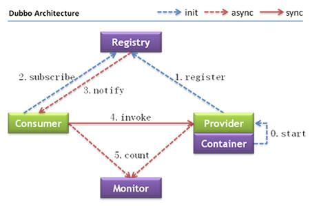


节点角色说明：

Provider: 暴露服务的服务提供方。

Consumer: 调用远程服务的服务消费方。

Registry: 服务注册与发现的注册中心。

Monitor: 统计服务的调用次调和调用时间的监控中心。

Container: 服务运行容器。

调用关系说明：

\0. 服务容器负责启动，加载，运行服务提供者。

\1. 服务提供者在启动时，向注册中心注册自己提供的服务。

\2. 服务消费者在启动时，向注册中心订阅自己所需的服务。

\3. 注册中心返回服务提供者地址列表给消费者，如果有变更，注册中心将基于长连接推送变更数据给消费者。

\4. 服务消费者，从提供者地址列表中，基于软负载均衡算法，选一台提供者进行调用，如果调用失败，再选另一台调用。

\5. 服务消费者和提供者，在内存中累计调用次数和调用时间，定时每分钟发送一次统计数据到监控中心。

timeout 和 retire 的 优先级别如下图：


dubbo 重试机制 retires 默认2次

假设服务端设置为 <dubbo:provider delay="-1" timeout="9000" retries="2"></dubbo:provider>，客户端不进行设置。

consumer调用 provider的 insert 服务时，本次调用由于某种原因 provider没能在50秒内完成（假设provider的 insert 需要60 秒完成），consumer 会发起第一个重复请求，此次请求还是没有结果（因为 provider 60秒才能完成），第二次重复发起请求，依然没有结果。此时会返回一个com.alibaba.dubbo.remoting.TimeoutException ，但 provider 却执行了总共三次的操作（其中retire 2次），此时可以设置 **客户端** 设置该insert方法 的 retire 为 0：

```
 <dubbo:reference interface="com.xxx.content.service.ContentService" id="contentService" >
     <dubbo:method name="insert" retries="0"></dubbo:method>

   </dubbo:reference>
```

