# 想往高处走，怎么能不懂 Dubbo？

Dubbo是国内最出名的分布式服务框架，也是 Java 程序员必备的必会的框架之一。Dubbo 更是中高级面试过程中经常会问的技术，无论你是否用过，你都必须熟悉。

**下面我为大家准备了一些 Dubbo 常见的的面试题，一些是我经常问别人的，一些是我过去面试遇到的一些问题，总结给大家，希望对大家能有所帮助。**

------

### **1、Dubbo是什么？**

Dubbo是阿里巴巴开源的基于 Java 的高性能 RPC 分布式服务框架，现已成为 Apache 基金会孵化项目。

面试官问你如果这个都不清楚，那下面的就没必要问了。

> 官网：http://dubbo.apache.org

### **2、为什么要用Dubbo？**

因为是阿里开源项目，国内很多互联网公司都在用，已经经过很多线上考验。内部使用了 Netty、Zookeeper，保证了高性能高可用性。

使用 Dubbo 可以将核心业务抽取出来，作为独立的服务，逐渐形成稳定的服务中心，可用于提高业务复用灵活扩展，使前端应用能更快速的响应多变的市场需求。

下面这张图可以很清楚的诠释，最重要的一点是，分布式架构可以承受更大规模的并发流量。


下面是 Dubbo 的服务治理图。


### **3、Dubbo 和 Spring Cloud 有什么区别？**

两个没关联，如果硬要说区别，有以下几点。

#### 1）通信方式不同

* Dubbo 使用的是 RPC 通信，而 Spring Cloud 使用的是 HTTP RESTFul 方式。
* dubbo由于是二进制传输，占用带宽会更少（基于netty）；SpringCloud是http协议传输，宽带会比较多，同时使用http协议（http+restful api）一般会使用JSON报文，消耗会更大。
* dubbo的开发难度较大，原因是dubbo的jar包依赖（存在代码级别的强依赖）问题很多大型工程无法解决；springcloud的接口协议约定比较自由松散，需要强有力的行政措施来限制接口无序升级。
* dubbo的改进是通过dubbofilter，很多东西没有，需要自己继承，如监控、日志、限流、追踪；springcloud具有配置管理、服务发现、断路器、智能路由、微代理、控制总线、一次性token、全局锁、选主、分布式会话和集群状态等，满足了构建微服务所需的所有解决方案、

#### 2）组成部分不同


### **4、dubbo都支持什么协议，推荐用哪种？**

- dubbo://（推荐）
- rmi://
- hessian://
- http://
- webservice://
- thrift://
- memcached://
- redis://
- rest://

### **5、Dubbo需要 Web 容器吗？**

不需要，如果硬要用 Web 容器，只会增加复杂性，也浪费资源。

### **6、Dubbo内置了哪几种服务容器？**

- Spring Container
- Jetty Container
- Log4j Container

Dubbo 的服务容器只是一个简单的 Main 方法，并加载一个简单的 Spring 容器，用于暴露服务。

### **7、Dubbo里面有哪几种节点角色？**


### **8、画一画服务注册与发现的流程图**

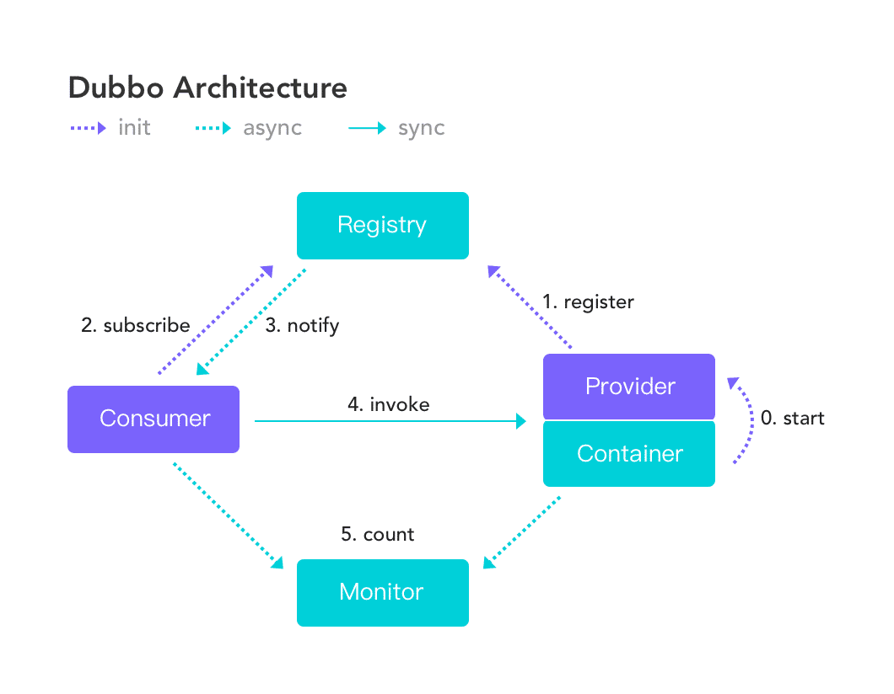

该图来自 Dubbo 官网，供你参考，如果你说你熟悉 Dubbo, 面试官经常会让你画这个图，记好了。

### **9、Dubbo默认使用什么注册中心，还有别的选择吗？**

推荐使用 Zookeeper 作为注册中心，还有 Redis、Multicast、Simple 注册中心，但不推荐。

### **10、Dubbo有哪几种配置方式？**

1）Spring 配置方式
2）Java API 配置方式

### **11、Dubbo 核心的配置有哪些？**

我曾经面试就遇到过面试官让你写这些配置，我也是蒙逼。。


配置之间的关系见下图。

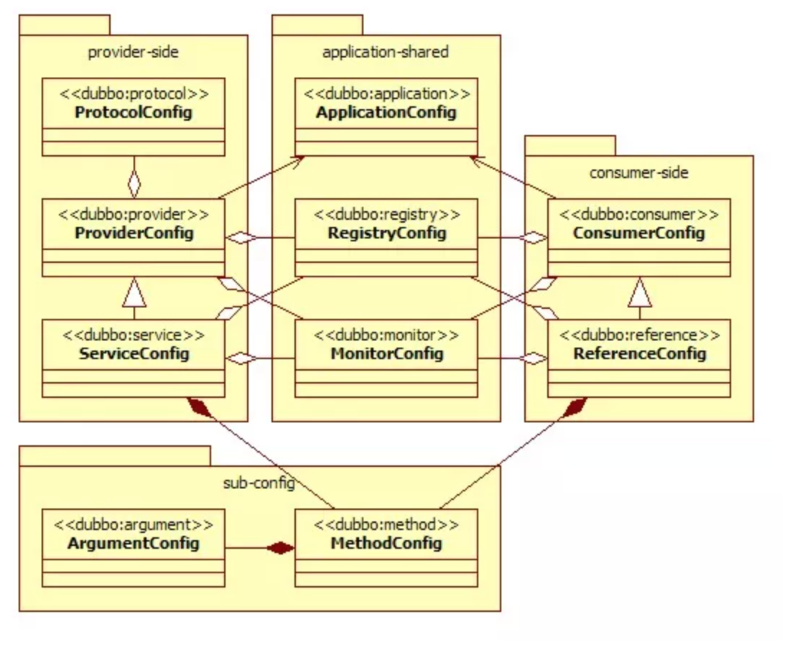

### **12、在 Provider 上可以配置的 Consumer 端的属性有哪些？**

1）timeout：方法调用超时
2）retries：失败重试次数，默认重试 2 次
3）loadbalance：负载均衡算法，默认随机
4）actives 消费者端，最大并发调用限制

### **13、Dubbo启动时如果依赖的服务不可用会怎样？**

Dubbo 缺省会在启动时检查依赖的服务是否可用，不可用时会抛出异常，阻止 Spring 初始化完成，默认 check="true"，可以通过 check="false" 关闭检查。

### **14、Dubbo推荐使用什么序列化框架，你知道的还有哪些？**

推荐使用Hessian序列化，还有Duddo、FastJson、Java自带序列化。

### **15、Dubbo默认使用的是什么通信框架，还有别的选择吗？**

Dubbo 默认使用 Netty 框架，也是推荐的选择，另外内容还集成有Mina、Grizzly。

### 16、Dubbo有哪几种集群容错方案，默认是哪种？

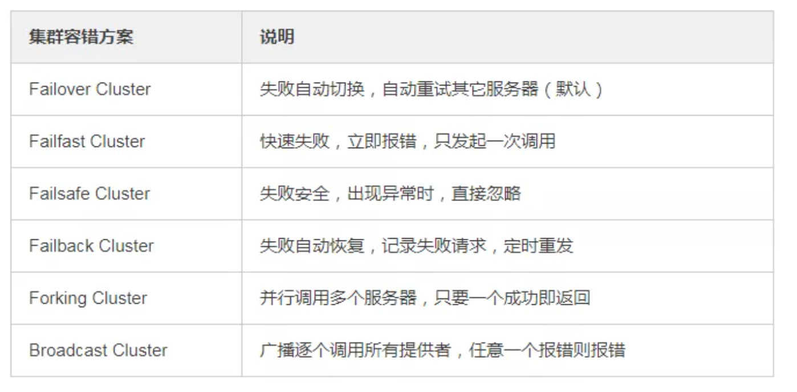

###  17、Dubbo有哪几种负载均衡策略，默认是哪种？

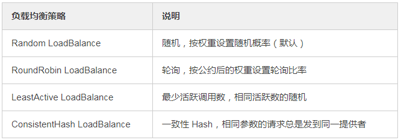


###   18、注册了多个同一样的服务，如果测试指定的某一个服务呢？

可以配置环境点对点直连，绕过注册中心，将以服务接口为单位，忽略注册中心的提供者列表。

###  19、Dubbo支持服务多协议吗？

Dubbo允许配置多协议，在不同服务上支持不同协议或者同一服务上同时支持多种协议。

### 20、当一个服务接口有多种实现时怎么做？

当一个接口有多种实现时，可以用 group 属性来分组，服务提供方和消费方都指定同一个 group 即可。

### 21、服务上线怎么兼容旧版本？

可以用版本号（version）过渡，多个不同版本的服务注册到注册中心，版本号不同的服务相互间不引用。这个和服务分组的概念有一点类似。

### **22、Dubbo可以对结果进行缓存吗？**

可以，Dubbo 提供了声明式缓存，用于加速热门数据的访问速度，以减少用户加缓存的工作量。

### **23、Dubbo服务之间的调用是阻塞的吗？**

默认是同步等待结果阻塞的，支持异步调用。

Dubbo 是基于 NIO 的非阻塞实现并行调用，客户端不需要启动多线程即可完成并行调用多个远程服务，相对多线程开销较小，异步调用会返回一个 Future 对象。

异步调用流程图如下。

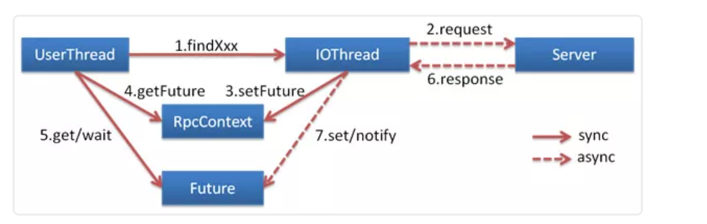

### **24、Dubbo支持分布式事务吗？**

目前暂时不支持，后续可能采用基于 JTA/XA 规范实现，如以图所示。


### **25、Dubbo telnet 命令能做什么？**

dubbo 通过 telnet 命令来进行服务治理，具体使用看这篇文章《[dubbo服务调试管理实用命令](https://mp.weixin.qq.com/s?__biz=MzI3ODcxMzQzMw==&mid=2247483709&idx=1&sn=afe0688c184f00902529583a85d90089&scene=21#wechat_redirect)》。

> telnet localhost 8090

### **26、Dubbo支持服务降级吗？**

Dubbo 2.2.0 以上版本支持。

### **27、Dubbo如何优雅停机？**

Dubbo 是通过 JDK 的 ShutdownHook 来完成优雅停机的，所以如果使用 kill -9 PID 等强制关闭指令，是不会执行优雅停机的，只有通过 kill PID 时，才会执行。

### **28、服务提供者能实现失效踢出是什么原理？**

服务失效踢出基于 Zookeeper 的临时节点原理。

### **29、如何解决服务调用链过长的问题？**

Dubbo 可以使用 Pinpoint 和 Apache Skywalking(Incubator) 实现分布式服务追踪，当然还有其他很多方案。

### **30、服务读写推荐的容错策略是怎样的？**

读操作建议使用 Failover 失败自动切换，默认重试两次其他服务器。

写操作建议使用 Failfast 快速失败，发一次调用失败就立即报错。

### 31、Dubbo必须依赖的包有哪些？

Dubbo 必须依赖 JDK，其他为可选。

### **32、Dubbo的管理控制台能做什么？**

管理控制台主要包含：路由规则，动态配置，服务降级，访问控制，权重调整，负载均衡，等管理功能。

### **33、说说 Dubbo 服务暴露的过程。**

Dubbo 会在 Spring 实例化完 bean 之后，在刷新容器最后一步发布 ContextRefreshEvent 事件的时候，通知实现了 ApplicationListener 的 ServiceBean 类进行回调 onApplicationEvent 事件方法，Dubbo 会在这个方法中调用 ServiceBean 父类 ServiceConfig 的 export 方法，而该方法真正实现了服务的（异步或者非异步）发布。

### **34、Dubbo 停止维护了吗？**

2014 年开始停止维护过几年，17 年开始重新维护，并进入了 Apache 项目。

### 35、Dubbo 和 Dubbox 有什么区别？

Dubbox 是继 Dubbo 停止维护后，当当网基于 Dubbo 做的一个扩展项目，如加了服务可 Restful 调用，更新了开源组件等。

### **36、你还了解别的分布式框架吗？**

别的还有 Spring cloud、Facebook 的 Thrift、Twitter 的 Finagle 等。

### **37、Dubbo 能集成 Spring Boot 吗？**

可以的，项目地址如下。

> https://github.com/apache/incubator-dubbo-spring-boot-project

### **38、在使用过程中都遇到了些什么问题？**

Dubbo 的设计目的是为了满足高并发小数据量的 rpc 调用，在大数据量下的性能表现并不好，建议使用 rmi 或 http 协议。

### **39、你读过 Dubbo 的源码吗？**

要了解 Dubbo 就必须看其源码，了解其原理，花点时间看下吧，网上也有很多教程，后续有时间我也会在公众号上分享 Dubbo 的源码。

### 40、你觉得用 Dubbo 好还是 Spring Cloud 好？

扩展性的问题，没有好坏，只有适合不适合，不过我好像更倾向于使用 Dubbo, Spring Cloud 版本升级太快，组件更新替换太频繁，配置太繁琐，还有很多我觉得是没有 Dubbo 顺手的地方……


----


#  Dubbo最全面试题 附答案（敖丙）

### 知道什么是RPC吗？

答：RPC 就是 Remote Procedure Call，远程过程调用，它相对应的是本地过程调用。

### 那为什么要有 RPC，HTTP 不好么？

这时候面试官就开始追问了。

这个问题其实很有意思，有些面试官可能自己不太清楚，然后以为自己很清楚，所以问出这个问题，还有一种是真的清楚，问这个问题是为了让你跳坑里。

因为 RPC 和 HTTP 就不是一个层级的东西，所以严格意义上这两个没有可比性，也不应该来作比较，而题目问的就是把这两个作为比较了。

HTTP 只是传输协议，协议只是规范了一定的交流格式，而且 RPC 是早于 HTTP 的，所以真要问也是问有 RPC 为什么还要 HTTP。

RPC 对比的是本地过程调用，是用来作为分布式系统之间的通信，它可以用 HTTP 来传输，也可以基于 TCP 自定义协议传输。

所以你要先提出这两个不是一个层级的东西，没有可比性，然后再表现一下，可以说 HTTP 协议比较冗余，所以 RPC 大多都是基于 TCP 自定义协议，定制化的才是最适合自己的。

当然也有基于 HTTP 协议的 RPC 框架，毕竟 HTTP 是公开的协议，比较通用，像 HTTP2 已经做了相应的压缩了，而且系统之间的调用都在内网，所以说影响也不会很大。

这波回答下来，面试官会觉得你有点东西，开始对你有点兴趣了，要开始深入你了。


### 说说你对 Dubbo 的了解？

面试官会先问个大点的问题，然后从你的回答中找到一些突破口来深入问，所以这个问题其实挺开放性的，你可以从历史的发展来答，也可以从整体架构来答。

如果从历史发展的角度来答，说明你平日里也是挺关注一些开源软件的，侧面也能体现你的对开源的拥抱。

如果从总体架构答，毋庸置疑肯定也是可以的，建议先浅显的说，等着追问。

历史发展，这个其实丙之前文章已经提到了：

Dubbo 是阿里巴巴开源的一个基于 Java 的 RPC 框架，中间沉寂了一段时间，但在 2017 年阿里巴巴又重启了对 Dubbo 维护。

并且在 2018 年和 当当的 Dubbox 进行了合并，进入 Apache 孵化器，在 2019 年毕业正式成为 Apache 顶级项目。

目前 Dubbo 社区主力维护的是 2.6.x 和 2.7.x 两大版本，2.6.x 版本主要是 bug 修复和少量功能增强为准，是稳定版本。

2.7.5 版本的发布被 Dubbo 认为是里程碑式的版本发布，支持 gRPC，并且性能提升了 30%（这里不了解gRPC 和为什么性能提升的话就别说了，别给自己挖坑）。

最新的 3.0 版本往云原生方向上探索着。

注意了，如果对历史各个版本不太熟，也不知道最新的版本要干啥就别往这方向答了，运气好点就是面试官自己也不太了解，他可能不会问，运气背点就追问了。

总体架构，上面也提到了先浅显的说，等追问，因为面试官如果懂，他肯定会问深入，如果不懂你芭芭拉一堆他无感的。

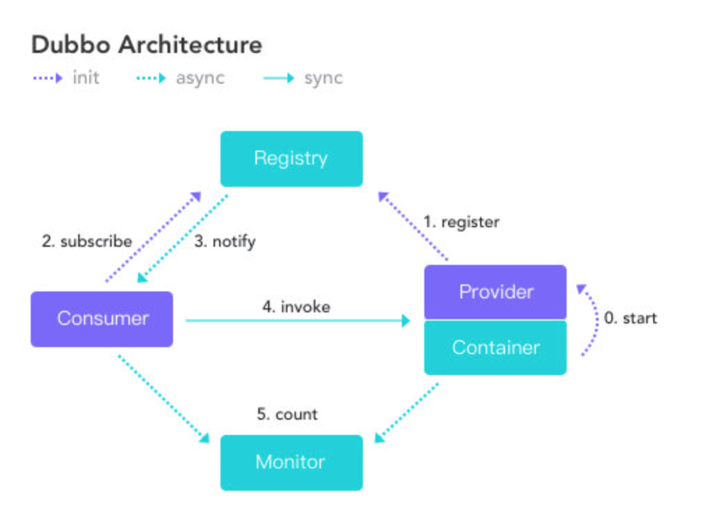

### 你就简单的提一下现在这几个角色。

节点	角色说明
Consumer	需要调用远程服务的服务消费方
Registry	注册中心
Provider	服务提供方
Container	服务运行的容器
Monitor	监控中心

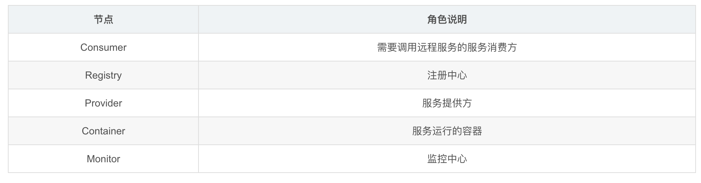

比如， Dubbo 总体分了以上这么几个角色，分别的作用是xxxx。

这里停顿下看下面试官的反应，如果没搭话，就继续说大致的流程。

首先服务提供者 Provider 启动然后向注册中心注册自己所能提供的服务。

服务消费者 Consumer 启动向注册中心订阅自己所需的服务。然后注册中心将提供者元信息通知给 Consumer， 之后 Consumer 因为已经从注册中心获取提供者的地址，因此可以通过负载均衡选择一个 Provider 直接调用 。

之后服务提供方元数据变更的话注册中心会把变更推送给服务消费者。

服务提供者和消费者都会在内存中记录着调用的次数和时间，然后定时的发送统计数据到监控中心。

到这基本上就差不多了，如果之前看过丙的 Dubbo 系列文章的话，那就算看过源码了，肯定对一系列过程很清晰了，所以在适当的时机可以说自己看过 Dubbo 源码。

众所周知，看过源码肯定是加分项，所以这点是要提的。

面试官一听，好家伙看过源码是吧，来说说。


接下来就开始连击了。

### 看过源码，那说下服务暴露的流程？

服务的暴露起始于 Spring IOC 容器刷新完毕之后，会根据配置参数组装成 URL， 然后根据 URL 的参数来进行本地或者远程调用。

会通过 proxyFactory.getInvoker，利用 javassist 来进行动态代理，封装真的实现类，然后再通过 URL 参数选择对应的协议来进行 protocol.export，默认是 Dubbo 协议。

在第一次暴露的时候会调用 createServer 来创建 Server，默认是 NettyServer。

然后将 export 得到的 exporter 存入一个 Map 中，供之后的远程调用查找，然后会向注册中心注册提供者的信息。

基本上就是这么个流程，说了这些差不多了，太细的谁都记住不。


### 看过源码，那说下服务引入的流程？

服务的引入时机有两种，第一种是饿汉式，第二种是懒汉式。

饿汉式就是加载完毕就会引入，懒汉式是只有当这个服务被注入到其他类中时启动引入流程，默认是懒汉式。

会先根据配置参数组装成 URL ，一般而言我们都会配置的注册中心，所以会构建 RegistryDirectory
向注册中心注册消费者的信息，并且订阅提供者、配置、路由等节点。

得知提供者的信息之后会进入 Dubbo 协议的引入，会创建 Invoker ，期间会包含 NettyClient，来进行远程通信，最后通过 Cluster 来包装 Invoker，默认是 FailoverCluster，最终返回代理类。

说这么多差不多了，关键的点都提到了。

切忌不要太过细，不要把你知道的都说了，这样会抓不住重点，比如上面的流程你要插入，引入的三种方式：本地引入、直连远程引入、通过注册中心引入。

然后再分别说本地引入怎样的，芭芭拉的就会很乱，所以面试的时候是需要删减的，要直击重点。

其实真实说的应该比我上面说的还要精简点才行，我是怕大家不太清楚说的稍微详细了一些。


### 看过源码，那说下服务调用的流程？

调用某个接口的方法会调用之前生成的代理类，然后会从 cluster 中经过路由的过滤、负载均衡机制选择一个 invoker 发起远程调用，此时会记录此请求和请求的 ID 等待服务端的响应。

服务端接受请求之后会通过参数找到之前暴露存储的 map，得到相应的 exporter ，然后最终调用真正的实现类，再组装好结果返回，这个响应会带上之前请求的 ID。

消费者收到这个响应之后会通过 ID 去找之前记录的请求，然后找到请求之后将响应塞到对应的 Future 中，唤醒等待的线程，最后消费者得到响应，一个流程完毕。

关键的就是 cluster、路由、负载均衡，然后 Dubbo 默认是异步的，所以请求和响应是如何对应上的。

之后可能还会追问 Dubbo 异步转同步如何实现的之类的，在丙之前文章里面都说了，忘记的同学可以回去看看。

### 知道什么是 SPI 嘛？

这又是一个方向了，从上面的回答中，不论是从 Dubbo 协议，还是 cluster ，什么 export 方法等等无处不是 SPI 的影子，所以如果是问 Dubbo 方面的问题，问 SPI 是毋庸置疑的，因为源码里 SPI 无处不在，而且 SPI 也是 Dubbo 可扩展性的基石。

所以这个题目没什么套路，直接答就行。

SPI 是 Service Provider Interface，主要用于框架中，框架定义好接口，不同的使用者有不同的需求，因此需要有不同的实现，而 SPI 就通过定义一个特定的位置，Java SPI 约定在 Classpath 下的 META-INF/services/ 目录里创建一个以服务接口命名的文件，然后文件里面记录的是此 jar 包提供的具体实现类的全限定名。

所以就可以通过接口找到对应的文件，获取具体的实现类然后加载即可，做到了灵活的替换具体的实现类。


### 为什么 Dubbo 不用 JDK 的 SPI，而是要自己实现?

问这个问题就是看你有没有深入的了解，或者自己思考过，不是死板的看源码，或者看一些知识点。

很多点是要思考的，不是书上说什么就是什么，你要知道这样做的理由，有什么好处和坏处，这很容易看出一个人是死记硬背还是有自己的思考。

答：因为 Java SPI 在查找扩展实现类的时候遍历 SPI 的配置文件并且将实现类全部实例化，假设一个实现类初始化过程比较消耗资源且耗时，但是你的代码里面又用不上它，这就产生了资源的浪费。

因此 Dubbo 就自己实现了一个 SPI，给每个实现类配了个名字，通过名字去文件里面找到对应的实现类全限定名然后加载实例化，按需加载。

这答出来就加分了，面试官心里在拍手了，不错不错有点东西。


### Dubbo 为什么默认用 Javassist

上面你回答 Dubbo 用 Javassist 动态代理，所以很可能会问你为什么要用这个代理，可能还会引申出 JDK 的动态代理、ASM、CGLIB。

所以这也是个注意点，如果你不太清楚的话上面的回答就不要扯到动态代理了，如果清楚的话那肯定得提，来诱导面试官来问你动态代理方面的问题，这很关键。

面试官是需要诱导的，毕竟他也想知道你优秀的方面到底有多优秀，你也取长补短，双赢双赢。

来回答下为什么用 Javassist，很简单，就是快，且字节码生成方便。

ASM 比 Javassist 更快，但是没有快一个数量级，而Javassist 只需用字符串拼接就可以生成字节码，而 ASM 需要手工生成，成本较高，比较麻烦。

### 如果让你设计一个 RPC 框架，如何设计？

面试官都很喜欢问这类问题，来考验候选人的设计能力，和平日有无全方面的了解过一个框架。

如果你平时没有思考，没有往这方面想过答出来的东西就会没有条理性，会显得杂乱无章，不过你也不用慌张，不用想的很全面，答的很细致，没有必要，面试官要的是那些关键的重点。

你可以从底层向上开始说起。

首先需要实现高性能的网络传输，可以采用 Netty 来实现，不用自己重复造轮子，然后需要自定义协议，毕竟远程交互都需要遵循一定的协议，然后还需要定义好序列化协议，网络的传输毕竟都是二进制流传输的。

然后可以搞一套描述服务的语言，即 IDL（Interface description language），让所有的服务都用 IDL 定义，再由框架转换为特定编程语言的接口，这样就能跨语言了。

此时最近基本的功能已经有了，但是只是最基础的，工业级的话首先得易用，所以框架需要把上述的细节对使用者进行屏蔽，让他们感觉不到本地调用和远程调用的区别，所以需要代理实现。

然后还需要实现集群功能，因此的要服务发现、注册等功能，所以需要注册中心，当然细节还是需要屏蔽的。

最后还需要一个完善的监控机制，埋点上报调用情况等等，便于运维。

这样一个 RPC 框架的雏形就差不多了。


最后
Dubbo 系列就到此结束了，其实还是有很多细节的，如果要写肯定还是有很多可以写的。

不过整体脉络都理清楚了，之后的修行还是得靠大家自己多多努力。

面试题肯定不止这一些，面试题是问不完的，真实的面试肯定是抓住你回答的点来深挖，所以我也模拟不了，我只能告诉你大致关键点，和揣摩一下面试官的心理活动。

当面试官问你的时候你可以试着去揣摩，看看他到底想要问什么，这很关键。

面试的时候不要慌，你和面试官是平等的，而且面试官不一定你厉害，还有面试有时候就是看运气了，面试失败了也不要气馁，换一家就好了，有时候就是气场不和，这很正常。


---

# dubbo


### **Dubbo** 支持哪些协议，每种协议的应用场景，优缺点?

-    **dubbo**: 单一长连接和 NIO 异步通讯，适合大并发小数据量的服务调用， 以及消费者远大于提供者。传输协议 TCP，异步，Hessian 序列化;
-    **rmi**: 采用 JDK 标准的 rmi 协议实现，传输参数和返回参数对象需要实现 Serializable 接口，使用 java 标准序列化机制，使用阻塞式短连接，传输数 据包大小混合，消费者和提供者个数差不多，可传文件，传输协议 TCP。 多个短连接，TCP 协议传输，同步传输，适用常规的远程服务调用和 rmi 互 操作。在依赖低版本的 Common-Collections 包，java 序列化存在安全漏 洞;
-    **webservice**: 基于 WebService 的远程调用协议，集成 CXF 实现，提供和 原生 WebService 的互操作。多个短连接，基于 HTTP 传输，同步传输，适 用系统集成和跨语言调用;
-    **http**: 基于 Http 表单提交的远程调用协议，使用 Spring 的 HttpInvoke 实 现。多个短连接，传输协议 HTTP，传入参数大小混合，提供者个数多于消 费者，需要给应用程序和浏览器 JS 调用;
-    **hessian**: 集成 Hessian 服务，基于 HTTP 通讯，采用 Servlet 暴露服务， Dubbo 内嵌 Jetty 作为服务器时默认实现，提供与 Hession 服务互操作。多 个短连接，同步 HTTP 传输，Hessian 序列化，传入参数较大，提供者大于 消费者，提供者压力较大，可传文件;
-    **memcache**: 基于 memcached 实现的 RPC 协议
-    **redis**: 基于 redis 实现的 RPC 协议

### **Dubbo** 超时时间怎样设置?

####  Dubbo 超时时间设置有两种方式:

-    服务提供者端设置超时时间，在 Dubbo 的用户文档中，推荐如果能在服务 端多配置就尽量多配置，因为服务提供者比消费者更清楚自己提供的服务特 性。
-    服务消费者端设置超时时间，如果在消费者端设置了超时时间，以消费者端 为主，即优先级更高。因为服务调用方设置超时时间控制性更灵活。如果消 费方超时，服务端线程不会定制，会产生警告。

### **Dubbo** 有些哪些注册中心?

-    **Multicast** 注册中心: Multicast 注册中心不需要任何中心节点，只要广播地 址，就能进行服务注册和发现。基于网络中组播传输实现;
-    **Zookeeper** 注册中心: 基于分布式协调系统 Zookeeper 实现，采用 Zookeeper 的 watch 机制实现数据变更;
-    **redis** 注册中心: 基于 redis 实现，采用 key/Map 存储，住 key 存储服务名 和类型，Map 中 key 存储服务 URL，value 服务过期时间。基于 redis 的发 布/订阅模式通知数据变更;
-    **Simple** 注册中心

### **Dubbo** 集群的负载均衡有哪些策略  

 Dubbo 提供了常见的集群策略实现，并预扩展点予以自行实现。

-    **Random LoadBalance:** 随机选取提供者策略，有利于动态调整提供者权 重。截面碰撞率高，调用次数越多，分布越均匀;
-    **RoundRobin LoadBalance:** 轮循选取提供者策略，平均分布，但是存在请 求累积的问题;
-    **LeastActive LoadBalance:** 最少活跃调用策略，解决慢提供者接收更少的 请求;
-    **ConstantHash LoadBalance:** 一致性 Hash 策略，使相同参数请求总是发 到同一提供者，一台机器宕机，可以基于虚拟节点，分摊至其他提供者，避 免引起提供者的剧烈变动;

###    **Dubbo** **是什么?**

-    Dubbo 是一个分布式、高性能、透明化的 RPC 服务框架，提供服务自动注册、自动发现等高效服务治理方案， 可以和 Spring 框架无缝集成。

###    **Dubbo** **的主要应用场景?**

-    透明化的远程方法调用，就像调用本地方法一样调用远程方法，

  只需简单配置，没有任何 API 侵入。

-    软负载均衡及容错机制，可在内网替代 F5 等硬件负载均衡器， 降低成本，减少单点。

-    服务自动注册与发现，不再需要写死服务提供方地址，注册中心 基于接口名查询服务提供者的 IP 地址，并且能够平滑添加或删 除服务提供者。

### **Dubbo 的核心功能?**

主要就是如下 3 个核心功能:

*  **Remoting**:网络通信框架，提供对多种NIO框架抽象封装，包括 “同步转异步”和“请求-响应”模式的信息交换方式。

*  **Cluster****:服务框架**，提供基于接口方法的透明远程过程调用，包括多 协议支持，以及软负载均衡，失败容错，地址路由，动态配置等集群 支持。

*  **Registry****:服务注册**，基于注册中心目录服务，使服务消费方能动态 的查找服务提供方，使地址透明，使服务提供方可以平滑增加或减少 机器。

###  **Dubbo**的核心组件?

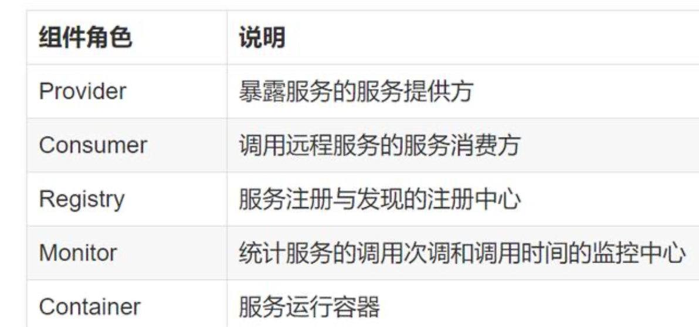


### **Dubbo 服务注册与发现的流程?**

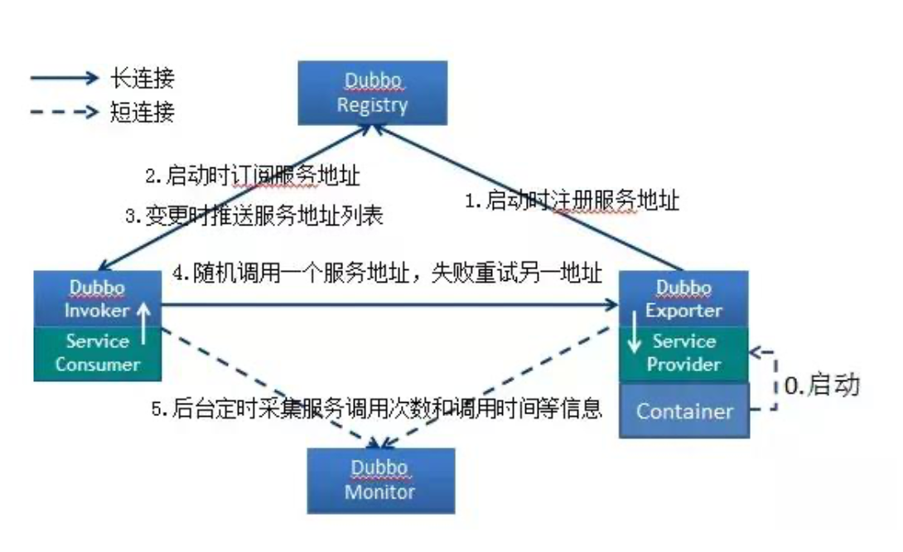

**流程说明:**

-    Provider(提供者)绑定指定端口并启动服务

-    指供者连接注册中心，并发本机IP、端口、应用信息和提供服务信息

  发送至注册中心存储

-    Consumer(消费者)，连接注册中心 ，并发送应用信息、所求服务信

  息至注册中心

-    注册中心根据 消费 者所求服务信息匹配对应的提供者列表发送至

  Consumer 应用缓存。

-    Consumer 在发起远程调用时基于缓存的消费者列表择其一发起调

  用。

-    Provider 状态变更会实时通知注册中心、在由注册中心实时推送至

  Consumer

#### **设计的原因:**

-    Consumer 与 Provider 解偶，双方都可以横向增减节点数。

-    注册中心对本身可做对等集群，可动态增减节点，并且任意一台宕掉

  后，将自动切换到另一台

-    去中心化，双方不直接依懒注册中心，即使注册中心全部宕机短时间

  内也不会影响服务的调用

-    服务提供者无状态，任意一台宕掉后，不影响使用

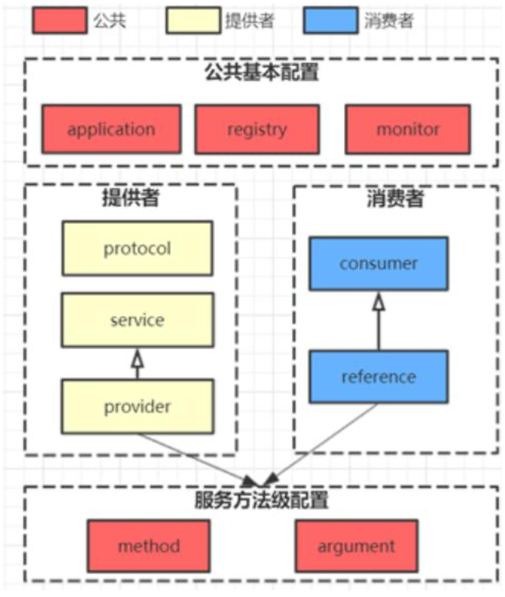

### **Dubbo** **的架构设计?**

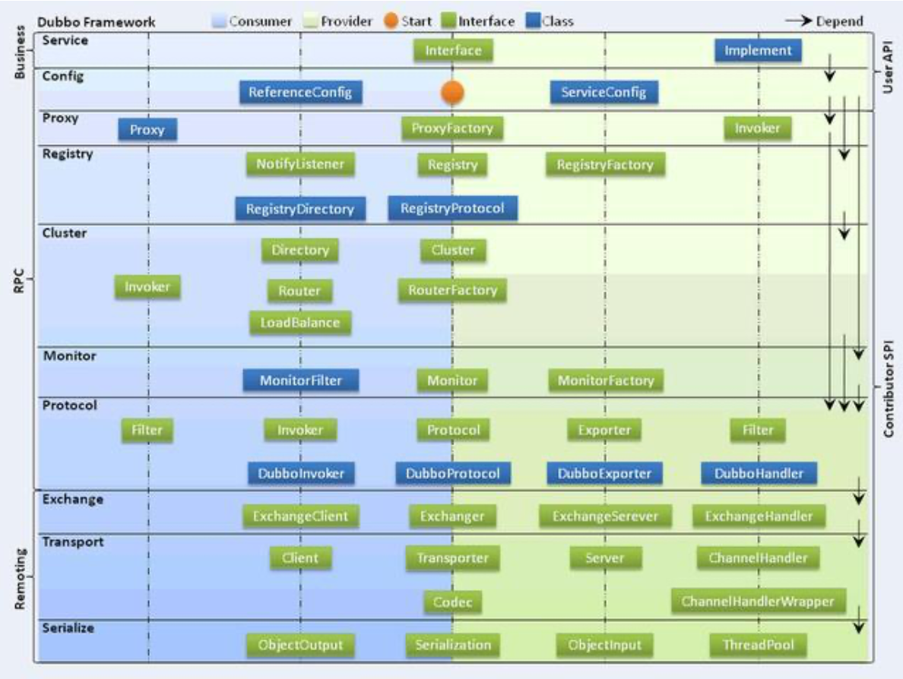

### **Dubbo** **框架设计一共划分了** **10** **个层:**

  **服务接口层(****Service****)**:该层是与实际业务逻辑相关的，根据服务提 供方和服务消费方的业务设计对应的接口和实现。

  **配置层(****Config****)**:对外配置接口，以ServiceConfig和 ReferenceConfig 为中心。

  **服务代理层(****Proxy**):服务接口透明代理，生成服务的客户端Stub 和服务器端 Skeleton。

-    **服务注册层(****Registry****)**:封装服务地址的注册与发现，以服务URL 为中心。

-    **集群层(****Cluster****)**:封装多个提供者的路由及负载均衡，并桥接注册 中心，以 Invoker 为中心。

-    **监控层(****Monitor****)**:RPC调用次数和调用时间监控。

-    **远程调用层(****Protocol****)**:封将RPC调用，以Invocation和Result

  为中心，扩展接口为 Protocol、Invoker 和 Exporter。

-    **信息交换层(****Exchange****)**:封装请求响应模式，同步转异步，以

  Request 和 Response 为中心。

-    **网络传输层(****Transport****)**:抽象mina和netty为统一接口，以

  Message 为中心。

### **Dubbo 的服务调用流程?**


### **Dubbo** **支持哪些协议，每种协议的应用场景，优缺点?**

  **dubbo****:** 单一长连接和 NIO 异步通讯，适合大并发小数据量的服务 调用，以及消费者远大于提供者。传输协议 TCP，异步，Hessian 序 列化;

  **rmi****:**采用JDK标准的rmi协议实现，传输参数和返回参数对象需要 实现 Serializable 接口，使用 java 标准序列化机制，使用阻塞式短连 接，传输数据包大小混合，消费者和提供者个数差不多，可传文件，

传输协议 TCP。 多个短连接，TCP 协议传输，同步传输，适用常规的 远程服务调用和 rmi 互操作。在依赖低版本的 Common-Collections 包，java 序列化存在安全漏洞;

-    **webservice****:**基于WebService的远程调用协议，集成CXF实现， 提供和原生 WebService 的互操作。多个短连接，基于 HTTP 传输， 同步传输，适用系统集成和跨语言调用;
- http:基于Http表单提交的远程调用协议，使用Spring的 HttpInvoke 实现。多个短连接，传输协议 HTTP，传入参数大小混 合，提供者个数多于消费者，需要给应用程序和浏览器 JS 调用;
- hessian:集成Hessian服务，基于HTTP通讯，采用Servlet暴露 服务，Dubbo 内嵌 Jetty 作为服务器时默认实现，提供与 Hession 服 务互操作。多个短连接，同步 HTTP 传输，Hessian 序列化，传入参 数较大，提供者大于消费者，提供者压力较大，可传文件;
-    **memcache**:**基于memcached实现的RPC协议
-    **redis**:**基于redis实现的RPC协议 **

#### dubbo**推荐用什么协议?**

默认使用 dubbo 协议

### **Dubbo** **有些哪些注册中心?**

  **Multicast****注册中心:**Multicast注册中心不需要任何中心节点，只 要广播地址，就能进行服务注册和发现。基于网络中组播传输实现;

  **Zookeeper****注册中心:**基于分布式协调系统Zookeeper实现，采用 Zookeeper 的 watch 机制实现数据变更;

  **redis****注册中心:**基于redis实现，采用key/Map存储，住key存储 服务名和类型，Map 中 key 存储服务 URL，value 服务过期时间。基 于 redis 的发布/订阅模式通知数据变更;

  **Simple****注册中心**

**Dubbo** **默认采用注册中心?**

采用 Zookeeper

### dubbo集成Zookeeper的实现原理：


### **为什么需要服务治理?**


* 过多的服务URL配置困难
* 负载均衡分配节点压力过大的情况下也需要部署集群

* 服务依赖混乱，启动顺序不清晰
* 过多服务导致性能指标分析难度较大，需要监控 

### **Dubbo** **的注册中心集群挂掉，发布者和订阅者之间还能通信么?**

可以的，启动 dubbo 时，消费者会从 zookeeper 拉取注册的生产者 的地址接口等数据，缓存在本地。

每次调用时，按照本地存储的地址进行调用。

### **Dubbo** **与** **Spring** **的关系?**

Dubbo 采用全 Spring 配置方式，透明化接入应用，对应用没有任何 API 侵入，只需用 Spring 加载 Dubbo 的配置即可，Dubbo 基于 Spring 的 Schema 扩展进行加载。

### **Dubbo** **使用的是什么通信框架**?

默认使用 NIO Netty 框架

### **Dubbo** **集群提供了哪些负载均衡策略?**

  **Random LoadBalance:** 随机选取提供者策略，有利于动态调整提供 者权重。截面碰撞率高，调用次数越多，分布越均匀;

  **RoundRobin LoadBalance:** 轮循选取提供者策略，平均分布，但是 存在请求累积的问题;

  **LeastActive LoadBalance:** 最少活跃调用策略，解决慢提供者接收 更少的请求;

  **ConstantHash LoadBalance:** 一致性 Hash 策略，使相同参数请求 总是发到同一提供者，一台机器宕机，可以基于虚拟节点，分摊至其 他提供者，避免引起提供者的剧烈变动;

缺省时为 Random 随机调用

### **Dubbo** **的集群容错方案有哪些?**

-    **Failover Cluster**

  -    失败自动切换，当出现失败，重试其它服务器。通常用于读操作，但

  重试会带来更长延迟。

-    **Failfast Cluster**

  -    快速失败，只发起一次调用，失败立即报错。通常用于非幂等性的写

  操作，比如新增记录。

-    **Failsafe Cluster**

  -    失败安全，出现异常时，直接忽略。通常用于写入审计日志等操作。

-    **Failback Cluster**

  -    失败自动恢复，后台记录失败请求，定时重发。通常用于消息通知操作。

-    **Forking Cluster**

  - 并行调用多个服务器，只要一个成功即返回。通常用于实时性要求较 高的读操作，但需要浪费更多服务资源。可通过 forks="2" 来设置最 大并行数。

* **Broadcast Cluster** 
  * 广播调用所有提供者，逐个调用，任意一台报错则报错 。通常用于通知所有提供者更新缓存或日志等本地资源信息。

#### **Dubbo** **的默认集群容错方案?**

**Failover Cluster**

### **Dubbo** **支持哪些序列化方式?**

默认使用 Hessian 序列化，还有 Duddo、FastJson、Java 自带序列 化。

### **Dubbo** **超时时间怎样设置?**

Dubbo 超时时间设置有两种方式:

-    服务提供者端设置超时时间，在Dubbo的用户文档中，推荐如果能 在服务端多配置就尽量多配置，因为服务提供者比消费者更清楚自己 提供的服务特性。
-    服务消费者端设置超时时间，如果在消费者端设置了超时时间，以消 费者端为主，即优先级更高。因为服务调用方设置超时时间控制性更 灵活。如果消费方超时，服务端线程不会定制，会产生警告。

### 服务调用超时问题怎么解决?

dubbo 在调用服务不成功时，默认是会重试两次的。

### **Dubbo** **在安全机制方面是如何解决?**

Dubbo 通过 Token 令牌防止用户绕过注册中心直连，然后在注册中 心上管理授权。Dubbo 还提供服务黑白名单，来控制服务所允许的调 用方。

### **Dubbo** **和** **Dubbox** **之间的区别?**

dubbox 基于 dubbo 上做了一些扩展，如加了服务可 restful 调 用，更新了开源组件等。

### **Dubbo** **和** **Spring Cloud** **的关系?**

Dubbo 是 SOA 时代的产物，它的关注点主要在于服务的调用，流 量分发、流量监控和熔断。而 Spring Cloud 诞生于微服务架构时 代，考虑的是微服务治理的方方面面，另外由于依托了 Spirng、 Spirng Boot 的优势之上，两个框架在开始目标就不一致，Dubbo 定位服务治理、Spirng Cloud 是一个生态。

### **Dubbo** **和** **Spring Cloud** **的区别?**


最大的区别:Dubbo 底层是使用 Netty 这样的 NIO 框架，是基于 TCP 协议传输的，配合以 Hession 序列化完成 RPC 通信。

而 SpringCloud 是基于 Http 协议+Rest 接口调用远程过程的通信， 相对来说，Http 请求会有更大的报文，占的带宽也会更多。但是 REST 相比 RPC 更为灵活，服务提供方和调用方的依赖只依靠一纸契 约，不存在代码级别的强依赖。

----

Dubbo是一个分布式服务框架，致力于提供高性能和透明化的RPC远程服务调用方案，以及SOA服务治理方案。简单的说，dubbo就是个服务框架，如果没有分布式的需求，其实是不需要用的，只有在分布式的时候，才有dubbo这样的分布式服务框架的需求，并且本质上是个服务调用的东东，说白了就是个远程服务调用的分布式框架（告别Web Service模式中的WSdl，以服务者与消费者的方式在dubbo上注册）。


很多时候，其实我们使用这个技术的时候，可能都是因为项目需要，所以，我们就用了，但是，至于为什么我们需要用到这个技术，可能自身并不是很了解的，但是，其实了解技术的来由及背景知识，对于理解一项技术还是有帮助的。

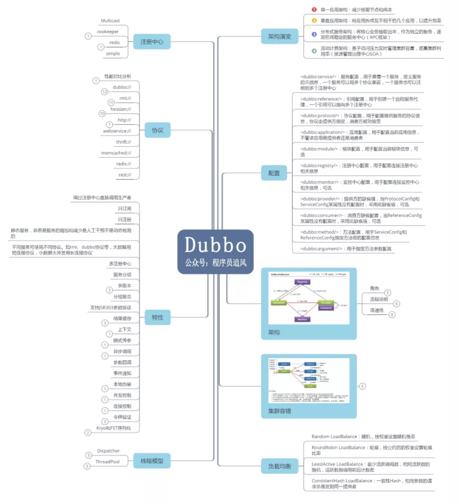


## 1、为什么要用 Dubbo？

随着服务化的进一步发展，服务越来越多，服务之间的调用和依赖关系也越来越复杂，诞生了面向服务的架构体系(SOA)，也因此衍生出了一系列相应的技术，如对服务提供、服务调用、连接处理、通信协议、序列化方式、服务发现、服务路由、日志输出等行为进行封装的服务框架。就这样为分布式系统的服务治理框架就出现了，Dubbo 也就这样产生了。

## 2、Dubbo 的整体架构设计有哪些分层?

**接口服务层（Service）**：该层与业务逻辑相关，根据 provider 和 consumer 的业务设计对应的接口和实现

**配置层（Config）：**对外配置接口，以 ServiceConfig 和 ReferenceConfig 为中心

**服务代理层（Proxy）：**服务接口透明代理，生成服务的客户端 Stub 和 服务端的 Skeleton，以 ServiceProxy 为中心，扩展接口为 ProxyFactory

**服务注册层（Registry）：**封装服务地址的注册和发现，以服务 URL 为中心，扩展接口为 RegistryFactory、Registry、RegistryService

**路由层（Cluster）：**封装多个提供者的路由和负载均衡，并桥接注册中心，以Invoker 为中心，扩展接口为 Cluster、Directory、Router 和 LoadBlancce

**监控层（Monitor）：**RPC 调用次数和调用时间监控，以 Statistics 为中心，扩展接口为 MonitorFactory、Monitor 和 MonitorService

**远程调用层（Protocal）：**封装 RPC 调用，以 Invocation 和 Result 为中心，扩展接口为 Protocal、Invoker 和 Exporter

**信息交换层（Exchange）：**封装请求响应模式，同步转异步。以 Request 和Response 为中心，扩展接口为 Exchanger、ExchangeChannel、ExchangeClient 和 ExchangeServer

**网络 传输 层（Transport）：**抽象 mina 和 netty 为统一接口，以 Message 为中心，扩展接口为 Channel、Transporter、Client、Server 和 Codec

**数据序列化层（Serialize）：**可复用的一些工具，扩展接口为 Serialization、ObjectInput、ObjectOutput 和 ThreadPool

## 3、默认使用的是什么通信框架，还有别的选择吗?

默认也推荐使用 netty 框架，还有 mina。

## 4、服务调用是阻塞的吗？

默认是阻塞的，可以异步调用，没有返回值的可以这么做。Dubbo 是基于 NIO 的非阻塞实现并行调用，客户端不需要启动多线程即可完成并行调用多个远程服务，相对多线程开销较小，异步调用会返回一个 Future 对象。

## 5、一般使用什么注册中心？还有别的选择吗？

推荐使用 Zookeeper 作为注册中心，还有 Redis、Multicast、Simple 注册中心，但不推荐。

## 6、默认使用什么序列化框架，你知道的还有哪些？

推荐使用 Hessian 序列化，还有 Duddo、FastJson、Java 自带序列化。

## 7、服务提供者能实现失效踢出是什么原理？

服务失效踢出基于 zookeeper 的临时节点原理。

## 8、服务上线怎么不影响旧版本？

采用多版本开发，不影响旧版本。

## 9、如何解决服务调用链过长的问题？

可以结合 zipkin 实现分布式服务追踪。

## 10、说说核心的配置有哪些？


## 11、Dubbo 推荐用什么协议？


## 12、同一个服务多个注册的情况下可以直连某一个服务吗？

可以点对点直连，修改配置即可，也可以通过 telnet 直接某个服务。

## 13、画一画服务注册与发现的流程图？

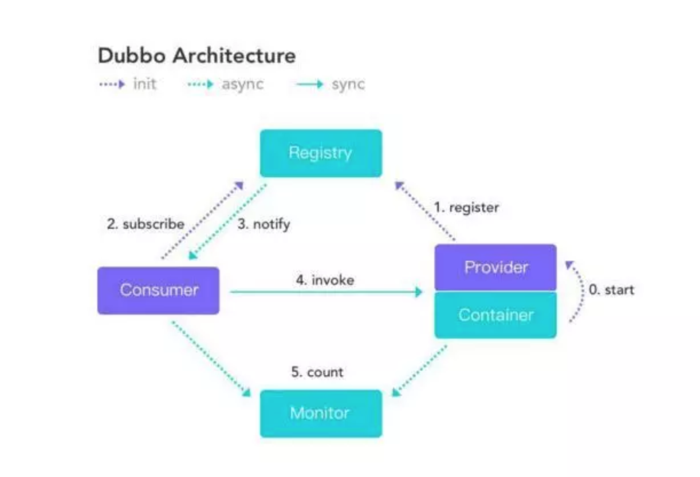

## 14、Dubbo 集群容错有几种方案？


## 15、Dubbo 服务降级，失败重试怎么做？

可以通过 dubbo:reference 中设置 mock="return null"。mock 的值也可以修改为 true，然后再跟接口同一个路径下实现一个 Mock 类，命名规则是 “接口名称+Mock” 后缀。然后在 Mock 类里实现自己的降级逻辑

## 16、Dubbo 使用过程中都遇到了些什么问题？

在注册中心找不到对应的服务,检查 service 实现类是否添加了@service 注解无法连接到注册中心,检查配置文件中的对应的测试 ip 是否正确

## 17、Dubbo Monitor 实现原理？

Consumer 端在发起调用之前会先走 filter 链；provider 端在接收到请求时也是先走 filter 链，然后才进行真正的业务逻辑处理。默认情况下，在 consumer 和 provider 的 filter 链中都会有 Monitorfilter。

1、MonitorFilter 向 DubboMonitor 发送数据 2、DubboMonitor 将数据进行聚合后（默认聚合 1min 中的统计数据）暂存到ConcurrentMap<Statistics, AtomicReference> statisticsMap，然后使用一个含有 3 个线程（线程名字：DubboMonitorSendTimer）的线程池每隔 1min 钟，调用 SimpleMonitorService 遍历发送 statisticsMap 中的统计数据，每发送完毕一个，就重置当前的 Statistics 的 AtomicReference 3、SimpleMonitorService 将这些聚合数据塞入 BlockingQueue queue 中（队列大写为 100000） 4、SimpleMonitorService 使用一个后台线程（线程名为：DubboMonitorAsyncWriteLogThread）将 queue 中的数据写入文件（该线程以死循环的形式来写） 5、SimpleMonitorService 还会使用一个含有 1 个线程（线程名字：DubboMonitorTimer）的线程池每隔 5min 钟，将文件中的统计数据画成图表

## 18、Dubbo 用到哪些设计模式？

Dubbo 框架在初始化和通信过程中使用了多种设计模式，可灵活控制类加载、权限控制等功能。

**工厂模式**

Provider 在 export 服务时，会调用 ServiceConfig 的 export 方法。ServiceConfig中有个字段：

```
private static final Protocol protocol =
ExtensionLoader.getExtensionLoader(Protocol.class).getAdaptiveExtensi
on();
```

Dubbo 里有很多这种代码。这也是一种工厂模式，只是实现类的获取采用了 JDKSPI 的机制。这么实现的优点是可扩展性强，想要扩展实现，只需要在 classpath下增加个文件就可以了，代码零侵入。另外，像上面的 Adaptive 实现，可以做到调用时动态决定调用哪个实现，但是由于这种实现采用了动态代理，会造成代码调试比较麻烦，需要分析出实际调用的实现类。

**装饰器模式**

Dubbo 在启动和调用阶段都大量使用了装饰器模式。以 Provider 提供的调用链为例，具体的调用链代码是在 ProtocolFilterWrapper 的 buildInvokerChain 完成的，具体是将注解中含有 group=provider 的 Filter 实现，按照 order 排序，最后的调用顺序是：

```
EchoFilter -> ClassLoaderFilter -> GenericFilter -> ContextFilter ->
ExecuteLimitFilter -> TraceFilter -> TimeoutFilter -> MonitorFilter ->
ExceptionFilter
```

更确切地说，这里是装饰器和责任链模式的混合使用。例如，EchoFilter 的作用是判断是否是回声测试请求，是的话直接返回内容，这是一种责任链的体现。而像ClassLoaderFilter 则只是在主功能上添加了功能，更改当前线程的 ClassLoader，这是典型的装饰器模式。

**观察者模式**

Dubbo 的 Provider 启动时，需要与注册中心交互，先注册自己的服务，再订阅自己的服务，订阅时，采用了观察者模式，开启一个 listener。注册中心会每 5 秒定时检查是否有服务更新，如果有更新，向该服务的提供者发送一个 notify 消息，provider 接受到 notify 消息后，运行 NotifyListener 的 notify 方法，执行监听器方法。

**动态代理模式**

Dubbo 扩展 JDK SPI 的类 ExtensionLoader 的 Adaptive 实现是典型的动态代理实现。Dubbo 需要灵活地控制实现类，即在调用阶段动态地根据参数决定调用哪个实现类，所以采用先生成代理类的方法，能够做到灵活的调用。生成代理类的代码是 ExtensionLoader 的 createAdaptiveExtensionClassCode 方法。代理类主要逻辑是，获取 URL 参数中指定参数的值作为获取实现类的 key。

## 19、Dubbo 配置文件是如何加载到 Spring 中的？

Spring 容器在启动的时候，会读取到 Spring 默认的一些 schema 以及 Dubbo 自定义的 schema，每个 schema 都会对应一个自己的 NamespaceHandler，NamespaceHandler 里面通过 BeanDefinitionParser 来解析配置信息并转化为需要加载的 bean 对象！

## 20、Dubbo SPI 和 Java SPI 区别？

**JDK SPI：**

JDK 标准的 SPI 会一次性加载所有的扩展实现，如果有的扩展吃实话很耗时，但也没用上，很浪费资源。所以只希望加载某个的实现，就不现实了

**DUBBO SPI：**

1、对 Dubbo 进行扩展，不需要改动 Dubbo 的源码

2、延迟加载，可以一次只加载自己想要加载的扩展实现。

3、增加了对扩展点 IOC 和 AOP 的支持，一个扩展点可以直接 setter 注入其它扩展点。

4、Dubbo 的扩展机制能很好的支持第三方 IoC 容器，默认支持 Spring Bean。

## 21、Dubbo 支持分布式事务吗？

目前暂时不支持，可与通过 tcc-transaction 框架实现

介绍：tcc-transaction 是开源的 TCC 补偿性分布式事务框架

TCC-Transaction 通过 Dubbo 隐式传参的功能，避免自己对业务代码的入侵。

## 22、Dubbo 可以对结果进行缓存吗？

为了提高数据访问的速度。Dubbo 提供了声明式缓存，以减少用户加缓存的工作量<dubbo:reference cache="true" />

其实比普通的配置文件就多了一个标签 cache="true"

## 23、服务上线怎么兼容旧版本？

可以用版本号（version）过渡，多个不同版本的服务注册到注册中心，版本号不同的服务相互间不引用。这个和服务分组的概念有一点类似。

## 24、Dubbo 必须依赖的包有哪些？

Dubbo 必须依赖 JDK，其他为可选。

## 25、Dubbo telnet 命令能做什么？

dubbo 服务发布之后，我们可以利用 telnet 命令进行调试、管理。Dubbo2.0.5 以上版本服务提供端口支持 telnet 命令

**连接服务**

telnet localhost 20880 //键入回车进入 Dubbo 命令模式。

**查看服务列表**

```
dubbo>ls
com.test.TestService
dubbo>ls com.test.TestService
create
delete
query
```

· ls (list services and methods)

· ls : 显示服务列表。

· ls -l : 显示服务详细信息列表。

· ls XxxService：显示服务的方法列表。

· ls -l XxxService：显示服务的方法详细信息列表。

## 26、Dubbo 支持服务降级吗？

以通过 dubbo:reference 中设置 mock="return null"。mock 的值也可以修改为 true，然后再跟接口同一个路径下实现一个 Mock 类，命名规则是 “接口名称+Mock” 后缀。然后在 Mock 类里实现自己的降级逻辑

## 27、Dubbo 如何优雅停机？

Dubbo 是通过 JDK 的 ShutdownHook 来完成优雅停机的，所以如果使用kill -9 PID 等强制关闭指令，是不会执行优雅停机的，只有通过 kill PID 时，才会执行。

## 28、Dubbo 和 Dubbox 之间的区别？

Dubbox 是继 Dubbo 停止维护后，当当网基于 Dubbo 做的一个扩展项目，如加了服务可 Restful 调用，更新了开源组件等。

## 29、Dubbo 和 Spring Cloud 的区别？

根据微服务架构在各方面的要素，看看 Spring Cloud 和 Dubbo 都提供了哪些支持。


使用 Dubbo 构建的微服务架构就像组装电脑，各环节我们的选择自由度很高，但是最终结果很有可能因为一条内存质量不行就点不亮了，总是让人不怎么放心，但是如果你是一名高手，那这些都不是问题；而 Spring Cloud 就像品牌机，在Spring Source 的整合下，做了大量的兼容性测试，保证了机器拥有更高的稳定性，但是如果要在使用非原装组件外的东西，就需要对其基础有足够的了解。

## 30、你还了解别的分布式框架吗？

别的还有 spring 的 spring cloud，facebook 的 thrift，twitter 的 finagle 等
