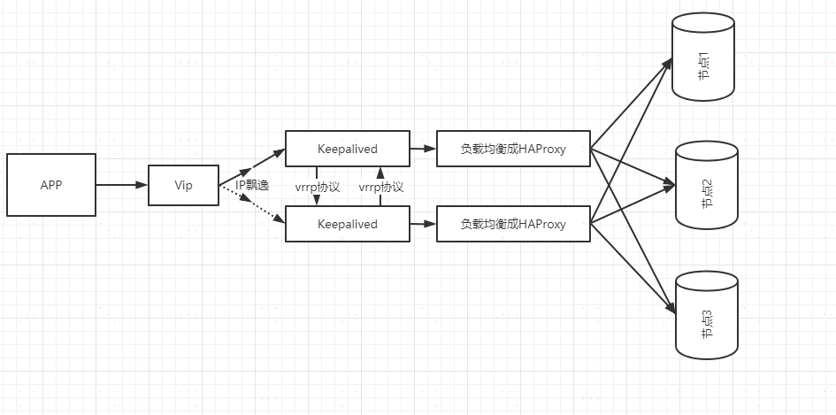

## RabbitMQ整理-benboerdong

## 项目中的使用：

### 1、签约信息通过MQ消息发送至银企直联系统，我们做更新缓存及数据库。

### 2、联保事前监控中核心拦截交易后，通过RabbitMQ将消息发送到直联系统，我们先入库，然后转换格式发送给客户。收到客户响应后，重新发起交易（会生成新的流水号）


# ThinkWon

### 为什么使用MQ？MQ的优点

简答

异步处理 - 相比于传统的串行、并行方式，提高了系统吞吐量。
应用解耦 - 系统间通过消息通信，不用关心其他系统的处理。
流量削锋 - 可以通过消息队列长度控制请求量；可以缓解短时间内的高并发请求。
日志处理 - 解决大量日志传输。
消息通讯 - 消息队列一般都内置了高效的通信机制，因此也可以用在纯的消息通讯。比如实现点对点消息队列，或者聊天室等。
详答

#### 主要是：解耦、异步、削峰。

解耦：A 系统发送数据到 BCD 三个系统，通过接口调用发送。如果 E 系统也要这个数据呢？那如果 C 系统现在不需要了呢？A 系统负责人几乎崩溃…A 系统跟其它各种乱七八糟的系统严重耦合，A 系统产生一条比较关键的数据，很多系统都需要 A 系统将这个数据发送过来。如果使用 MQ，A 系统产生一条数据，发送到 MQ 里面去，哪个系统需要数据自己去 MQ 里面消费。如果新系统需要数据，直接从 MQ 里消费即可；如果某个系统不需要这条数据了，就取消对 MQ 消息的消费即可。这样下来，A 系统压根儿不需要去考虑要给谁发送数据，不需要维护这个代码，也不需要考虑人家是否调用成功、失败超时等情况。

就是一个系统或者一个模块，调用了多个系统或者模块，互相之间的调用很复杂，维护起来很麻烦。但是其实这个调用是不需要直接同步调用接口的，如果用 MQ 给它异步化解耦。

异步：A 系统接收一个请求，需要在自己本地写库，还需要在 BCD 三个系统写库，自己本地写库要 3ms，BCD 三个系统分别写库要 300ms、450ms、200ms。最终请求总延时是 3 + 300 + 450 + 200 = 953ms，接近 1s，用户感觉搞个什么东西，慢死了慢死了。用户通过浏览器发起请求。如果使用 MQ，那么 A 系统连续发送 3 条消息到 MQ 队列中，假如耗时 5ms，A 系统从接受一个请求到返回响应给用户，总时长是 3 + 5 = 8ms。

削峰：减少高峰时期对服务器压力。

### 消息队列有什么优缺点？RabbitMQ有什么优缺点？

优点上面已经说了，就是在特殊场景下有其对应的好处，解耦、异步、削峰。

#### 缺点有以下几个：

* 系统可用性降低

本来系统运行好好的，现在你非要加入个消息队列进去，那消息队列挂了，你的系统不是呵呵了。因此，系统可用性会降低；

* 系统复杂度提高

加入了消息队列，要多考虑很多方面的问题，比如：一致性问题、如何保证消息不被重复消费、如何保证消息可靠性传输等。因此，需要考虑的东西更多，复杂性增大。

* 一致性问题

A 系统处理完了直接返回成功了，人都以为你这个请求就成功了；但是问题是，要是 BCD 三个系统那里，BD 两个系统写库成功了，结果 C 系统写库失败了，咋整？你这数据就不一致了。

所以消息队列实际是一种非常复杂的架构，你引入它有很多好处，但是也得针对它带来的坏处做各种额外的技术方案和架构来规避掉，做好之后，你会发现，妈呀，系统复杂度提升了一个数量级，也许是复杂了 10 倍。但是关键时刻，用，还是得用的。

### 你们公司生产环境用的是什么消息中间件？

这个首先你可以说下你们公司选用的是什么消息中间件，比如用的是RabbitMQ，然后可以初步给一些你对不同MQ中间件技术的选型分析。

举个例子：比如说ActiveMQ是老牌的消息中间件，国内很多公司过去运用的还是非常广泛的，功能很强大。

但是问题在于没法确认ActiveMQ可以支撑互联网公司的高并发、高负载以及高吞吐的复杂场景，在国内互联网公司落地较少。而且使用较多的是一些传统企业，用ActiveMQ做异步调用和系统解耦。

然后你可以说说RabbitMQ，他的好处在于可以支撑高并发、高吞吐、性能很高，同时有非常完善便捷的后台管理界面可以使用。

另外，他还支持集群化、高可用部署架构、消息高可靠支持，功能较为完善。

而且经过调研，国内各大互联网公司落地大规模RabbitMQ集群支撑自身业务的case较多，国内各种中小型互联网公司使用RabbitMQ的实践也比较多。

除此之外，RabbitMQ的开源社区很活跃，较高频率的迭代版本，来修复发现的bug以及进行各种优化，因此综合考虑过后，公司采取了RabbitMQ。

但是RabbitMQ也有一点缺陷，就是他自身是基于erlang语言开发的，所以导致较为难以分析里面的源码，也较难进行深层次的源码定制和改造，毕竟需要较为扎实的erlang语言功底才可以。

然后可以聊聊RocketMQ，是阿里开源的，经过阿里的生产环境的超高并发、高吞吐的考验，性能卓越，同时还支持分布式事务等特殊场景。

而且RocketMQ是基于Java语言开发的，适合深入阅读源码，有需要可以站在源码层面解决线上生产问题，包括源码的二次开发和改造。

另外就是Kafka。Kafka提供的消息中间件的功能明显较少一些，相对上述几款MQ中间件要少很多。

但是Kafka的优势在于专为超高吞吐量的实时日志采集、实时数据同步、实时数据计算等场景来设计。

因此Kafka在大数据领域中配合实时计算技术（比如Spark Streaming、Storm、Flink）使用的较多。但是在传统的MQ中间件使用场景中较少采用。

### Kafka、ActiveMQ、RabbitMQ、RocketMQ 有什么优缺点？

	ActiveMQ	RabbitMQ	RocketMQ	Kafka	ZeroMQ
单机吞吐量	比RabbitMQ低	2.6w/s（消息做持久化）	11.6w/s	17.3w/s	29w/s
开发语言	Java	Erlang	Java	Scala/Java	C
主要维护者	Apache	Mozilla/Spring	Alibaba	Apache	iMatix，创始人已去世
成熟度	成熟	成熟	开源版本不够成熟	比较成熟	只有C、PHP等版本成熟
订阅形式	点对点(p2p)、广播（发布-订阅）	提供了4种：direct, topic ,Headers和fanout。fanout就是广播模式	基于topic/messageTag以及按照消息类型、属性进行正则匹配的发布订阅模式	基于topic以及按照topic进行正则匹配的发布订阅模式	点对点(p2p)
持久化	支持少量堆积	支持少量堆积	支持大量堆积	支持大量堆积	不支持
顺序消息	不支持	不支持	支持	支持	不支持
性能稳定性	好	好	一般	较差	很好
集群方式	支持简单集群模式，比如’主-备’，对高级集群模式支持不好。	支持简单集群，'复制’模式，对高级集群模式支持不好。	常用 多对’Master-Slave’ 模式，开源版本需手动切换Slave变成Master	天然的‘Leader-Slave’无状态集群，每台服务器既是Master也是Slave	不支持
管理界面	一般	较好	一般	无	无


综上，各种对比之后，有如下建议：

一般的业务系统要引入 MQ，最早大家都用 ActiveMQ，但是现在确实大家用的不多了，没经过大规模吞吐量场景的验证，社区也不是很活跃，所以大家还是算了吧，我个人不推荐用这个了；

后来大家开始用 RabbitMQ，但是确实 erlang 语言阻止了大量的 Java 工程师去深入研究和掌控它，对公司而言，几乎处于不可控的状态，但是确实人家是开源的，比较稳定的支持，活跃度也高；

不过现在确实越来越多的公司会去用 RocketMQ，确实很不错，毕竟是阿里出品，但社区可能有突然黄掉的风险（目前 RocketMQ 已捐给 Apache，但 GitHub 上的活跃度其实不算高）对自己公司技术实力有绝对自信的，推荐用 RocketMQ，否则回去老老实实用 RabbitMQ 吧，人家有活跃的开源社区，绝对不会黄。

所以中小型公司，技术实力较为一般，技术挑战不是特别高，用 RabbitMQ 是不错的选择；大型公司，基础架构研发实力较强，用 RocketMQ 是很好的选择。

如果是大数据领域的实时计算、日志采集等场景，用 Kafka 是业内标准的，绝对没问题，社区活跃度很高，绝对不会黄，何况几乎是全世界这个领域的事实性规范。

### MQ 有哪些常见问题？如何解决这些问题？

MQ 的常见问题有：

消息的顺序问题
消息的重复问题

#### 消息的顺序问题

消息有序指的是可以按照消息的发送顺序来消费。

假如生产者产生了 2 条消息：M1、M2，假定 M1 发送到 S1，M2 发送到 S2，如果要保证 M1 先于 M2 被消费，怎么做？


解决方案：

（1）保证生产者 - MQServer - 消费者是一对一对一的关系


缺陷：

并行度就会成为消息系统的瓶颈（吞吐量不够）
更多的异常处理，比如：只要消费端出现问题，就会导致整个处理流程阻塞，我们不得不花费更多的精力来解决阻塞的问题。 （2）通过合理的设计或者将问题分解来规避。
不关注乱序的应用实际大量存在
队列无序并不意味着消息无序 所以从业务层面来保证消息的顺序而不仅仅是依赖于消息系统，是一种更合理的方式。

#### 消息的重复问题

造成消息重复的根本原因是：网络不可达。

所以解决这个问题的办法就是绕过这个问题。那么问题就变成了：如果消费端收到两条一样的消息，应该怎样处理？

消费端处理消息的业务逻辑保持幂等性。只要保持幂等性，不管来多少条重复消息，最后处理的结果都一样。保证每条消息都有唯一编号且保证消息处理成功与去重表的日志同时出现。利用一张日志表来记录已经处理成功的消息的 ID，如果新到的消息 ID 已经在日志表中，那么就不再处理这条消息。

### 什么是RabbitMQ？

RabbitMQ是一款开源的，Erlang编写的，基于AMQP协议的消息中间件

### rabbitmq 的使用场景

（1）服务间异步通信

（2）顺序消费

（3）定时任务

（4）请求削峰

### RabbitMQ基本概念

Broker： 简单来说就是消息队列服务器实体
Exchange： 消息交换机，它指定消息按什么规则，路由到哪个队列
Queue： 消息队列载体，每个消息都会被投入到一个或多个队列
Binding： 绑定，它的作用就是把exchange和queue按照路由规则绑定起来
Routing Key： 路由关键字，exchange根据这个关键字进行消息投递
VHost： vhost 可以理解为虚拟 broker ，即 mini-RabbitMQ server。其内部均含有独立的 queue、exchange 和 binding 等，但最最重要的是，其拥有独立的权限系统，可以做到 vhost 范围的用户控制。当然，从 RabbitMQ 的全局角度，vhost 可以作为不同权限隔离的手段（一个典型的例子就是不同的应用可以跑在不同的 vhost 中）。
Producer： 消息生产者，就是投递消息的程序
Consumer： 消息消费者，就是接受消息的程序
Channel： 消息通道，在客户端的每个连接里，可建立多个channel，每个channel代表一个会话任务
由Exchange、Queue、RoutingKey三个才能决定一个从Exchange到Queue的唯一的线路。

### RabbitMQ的工作模式

一.simple模式（即最简单的收发模式）


1.消息产生消息，将消息放入队列

2.消息的消费者(consumer) 监听 消息队列,如果队列中有消息,就消费掉,消息被拿走后,自动从队列中删除(隐患 消息可能没有被消费者正确处理,已经从队列中消失了,造成消息的丢失，这里可以设置成手动的ack,但如果设置成手动ack，处理完后要及时发送ack消息给队列，否则会造成内存溢出)。

二.work工作模式(资源的竞争)


1.消息产生者将消息放入队列消费者可以有多个,消费者1,消费者2同时监听同一个队列,消息被消费。C1 C2共同争抢当前的消息队列内容,谁先拿到谁负责消费消息(隐患：高并发情况下,默认会产生某一个消息被多个消费者共同使用,可以设置一个开关(syncronize) 保证一条消息只能被一个消费者使用)。

三.publish/subscribe发布订阅(共享资源)


1、每个消费者监听自己的队列；

2、生产者将消息发给broker，由交换机将消息转发到绑定此交换机的每个队列，每个绑定交换机的队列都将接收到消息。

四.routing路由模式


1.消息生产者将消息发送给交换机按照路由判断,路由是字符串(info) 当前产生的消息携带路由字符(对象的方法),交换机根据路由的key,只能匹配上路由key对应的消息队列,对应的消费者才能消费消息;

2.根据业务功能定义路由字符串

3.从系统的代码逻辑中获取对应的功能字符串,将消息任务扔到对应的队列中。

4.业务场景:error 通知;EXCEPTION;错误通知的功能;传统意义的错误通知;客户通知;利用key路由,可以将程序中的错误封装成消息传入到消息队列中,开发者可以自定义消费者,实时接收错误;

五.topic 主题模式(路由模式的一种)


1.星号井号代表通配符

2.星号代表多个单词,井号代表一个单词

3.路由功能添加模糊匹配

4.消息产生者产生消息,把消息交给交换机

5.交换机根据key的规则模糊匹配到对应的队列,由队列的监听消费者接收消息消费

（在我的理解看来就是routing查询的一种模糊匹配，就类似sql的模糊查询方式）

### 如何保证RabbitMQ消息的顺序性？

拆分多个 queue，每个 queue 一个 consumer，就是多一些 queue 而已，确实是麻烦点；或者就一个 queue 但是对应一个 consumer，然后这个 consumer 内部用内存队列做排队，然后分发给底层不同的 worker 来处理。

### 消息如何分发？

若该队列至少有一个消费者订阅，消息将以循环（round-robin）的方式发送给消费者。每条消息只会分发给一个订阅的消费者（前提是消费者能够正常处理消息并进行确认）。通过路由可实现多消费的功能

### 消息怎么路由？

消息提供方->路由->一至多个队列消息发布到交换器时，消息将拥有一个路由键（routing key），在消息创建时设定。通过队列路由键，可以把队列绑定到交换器上。消息到达交换器后，RabbitMQ 会将消息的路由键与队列的路由键进行匹配（针对不同的交换器有不同的路由规则）；

常用的交换器主要分为一下三种：

fanout：如果交换器收到消息，将会广播到所有绑定的队列上

direct：如果路由键完全匹配，消息就被投递到相应的队列

topic：可以使来自不同源头的消息能够到达同一个队列。 使用 topic 交换器时，可以使用通配符

### 消息基于什么传输？

由于 TCP 连接的创建和销毁开销较大，且并发数受系统资源限制，会造成性能瓶颈。RabbitMQ 使用信道的方式来传输数据。信道是建立在真实的 TCP 连接内的虚拟连接，且每条 TCP 连接上的信道数量没有限制。

### 如何保证消息不被重复消费？或者说，如何保证消息消费时的幂等性？

先说为什么会重复消费：正常情况下，消费者在消费消息的时候，消费完毕后，会发送一个确认消息给消息队列，消息队列就知道该消息被消费了，就会将该消息从消息队列中删除；

但是因为网络传输等等故障，确认信息没有传送到消息队列，导致消息队列不知道自己已经消费过该消息了，再次将消息分发给其他的消费者。

针对以上问题，一个解决思路是：保证消息的唯一性，就算是多次传输，不要让消息的多次消费带来影响；保证消息等幂性；

比如：在写入消息队列的数据做唯一标示，消费消息时，根据唯一标识判断是否消费过；

假设你有个系统，消费一条消息就往数据库里插入一条数据，要是你一个消息重复两次，你不就插入了两条，这数据不就错了？但是你要是消费到第二次的时候，自己判断一下是否已经消费过了，若是就直接扔了，这样不就保留了一条数据，从而保证了数据的正确性。

### 如何确保消息正确地发送至 RabbitMQ？ 如何确保消息接收方消费了消息？

#### 发送方确认模式

将信道设置成 confirm 模式（发送方确认模式），则所有在信道上发布的消息都会被指派一个唯一的 ID。

一旦消息被投递到目的队列后，或者消息被写入磁盘后（可持久化的消息），信道会发送一个确认给生产者（包含消息唯一 ID）。

如果 RabbitMQ 发生内部错误从而导致消息丢失，会发送一条 nack（notacknowledged，未确认）消息。

发送方确认模式是异步的，生产者应用程序在等待确认的同时，可以继续发送消息。当确认消息到达生产者应用程序，生产者应用程序的回调方法就会被触发来处理确认消息。

#### 接收方确认机制

消费者接收每一条消息后都必须进行确认（消息接收和消息确认是两个不同操作）。只有消费者确认了消息，RabbitMQ 才能安全地把消息从队列中删除。

这里并没有用到超时机制，RabbitMQ 仅通过 Consumer 的连接中断来确认是否需要重新发送消息。也就是说，只要连接不中断，RabbitMQ 给了 Consumer 足够长的时间来处理消息。保证数据的最终一致性；

下面罗列几种特殊情况

如果消费者接收到消息，在确认之前断开了连接或取消订阅，RabbitMQ 会认为消息没有被分发，然后重新分发给下一个订阅的消费者。（可能存在消息重复消费的隐患，需要去重）
如果消费者接收到消息却没有确认消息，连接也未断开，则 RabbitMQ 认为该消费者繁忙，将不会给该消费者分发更多的消息。

### 如何保证RabbitMQ消息的可靠传输？

消息不可靠的情况可能是消息丢失，劫持等原因；

丢失又分为：生产者丢失消息、消息列表丢失消息、消费者丢失消息；

生产者丢失消息：从生产者弄丢数据这个角度来看，RabbitMQ提供transaction和confirm模式来确保生产者不丢消息；

transaction机制就是说：发送消息前，开启事务（channel.txSelect()）,然后发送消息，如果发送过程中出现什么异常，事务就会回滚（channel.txRollback()）,如果发送成功则提交事务（channel.txCommit()）。然而，这种方式有个缺点：吞吐量下降；

confirm模式用的居多：一旦channel进入confirm模式，所有在该信道上发布的消息都将会被指派一个唯一的ID（从1开始），一旦消息被投递到所有匹配的队列之后；

rabbitMQ就会发送一个ACK给生产者（包含消息的唯一ID），这就使得生产者知道消息已经正确到达目的队列了；

如果rabbitMQ没能处理该消息，则会发送一个Nack消息给你，你可以进行重试操作。

消息队列丢数据：消息持久化。

处理消息队列丢数据的情况，一般是开启持久化磁盘的配置。

这个持久化配置可以和confirm机制配合使用，你可以在消息持久化磁盘后，再给生产者发送一个Ack信号。

这样，如果消息持久化磁盘之前，rabbitMQ阵亡了，那么生产者收不到Ack信号，生产者会自动重发。

那么如何持久化呢？

这里顺便说一下吧，其实也很容易，就下面两步

将queue的持久化标识durable设置为true,则代表是一个持久的队列
发送消息的时候将deliveryMode=2
这样设置以后，即使rabbitMQ挂了，重启后也能恢复数据

消费者丢失消息：消费者丢数据一般是因为采用了自动确认消息模式，改为手动确认消息即可！

消费者在收到消息之后，处理消息之前，会自动回复RabbitMQ已收到消息；

如果这时处理消息失败，就会丢失该消息；

解决方案：处理消息成功后，手动回复确认消息。

### 为什么不应该对所有的 message 都使用持久化机制？

首先，必然导致性能的下降，因为写磁盘比写 RAM 慢的多，message 的吞吐量可能有 10 倍的差距。

其次，message 的持久化机制用在 RabbitMQ 的内置 cluster 方案时会出现“坑爹”问题。矛盾点在于，若 message 设置了 persistent 属性，但 queue 未设置 durable 属性，那么当该 queue 的 owner node 出现异常后，在未重建该 queue 前，发往该 queue 的 message 将被 blackholed ；若 message 设置了 persistent 属性，同时 queue 也设置了 durable 属性，那么当 queue 的 owner node 异常且无法重启的情况下，则该 queue 无法在其他 node 上重建，只能等待其 owner node 重启后，才能恢复该 queue 的使用，而在这段时间内发送给该 queue 的 message 将被 blackholed 。

所以，是否要对 message 进行持久化，需要综合考虑性能需要，以及可能遇到的问题。若想达到 100,000 条/秒以上的消息吞吐量（单 RabbitMQ 服务器），则要么使用其他的方式来确保 message 的可靠 delivery ，要么使用非常快速的存储系统以支持全持久化（例如使用 SSD）。另外一种处理原则是：仅对关键消息作持久化处理（根据业务重要程度），且应该保证关键消息的量不会导致性能瓶颈。

### 如何保证高可用的？RabbitMQ 的集群

RabbitMQ 是比较有代表性的，因为是基于主从（非分布式）做高可用性的，我们就以 RabbitMQ 为例子讲解第一种 MQ 的高可用性怎么实现。RabbitMQ 有三种模式：单机模式、普通集群模式、镜像集群模式。

单机模式，就是 Demo 级别的，一般就是你本地启动了玩玩儿的?，没人生产用单机模式

普通集群模式，意思就是在多台机器上启动多个 RabbitMQ 实例，每个机器启动一个。你创建的 queue，只会放在一个 RabbitMQ 实例上，但是每个实例都同步 queue 的元数据（元数据可以认为是 queue 的一些配置信息，通过元数据，可以找到 queue 所在实例）。你消费的时候，实际上如果连接到了另外一个实例，那么那个实例会从 queue 所在实例上拉取数据过来。这方案主要是提高吞吐量的，就是说让集群中多个节点来服务某个 queue 的读写操作。

镜像集群模式：这种模式，才是所谓的 RabbitMQ 的高可用模式。跟普通集群模式不一样的是，在镜像集群模式下，你创建的 queue，无论元数据还是 queue 里的消息都会存在于多个实例上，就是说，每个 RabbitMQ 节点都有这个 queue 的一个完整镜像，包含 queue 的全部数据的意思。然后每次你写消息到 queue 的时候，都会自动把消息同步到多个实例的 queue 上。RabbitMQ 有很好的管理控制台，就是在后台新增一个策略，这个策略是镜像集群模式的策略，指定的时候是可以要求数据同步到所有节点的，也可以要求同步到指定数量的节点，再次创建 queue 的时候，应用这个策略，就会自动将数据同步到其他的节点上去了。这样的话，好处在于，你任何一个机器宕机了，没事儿，其它机器（节点）还包含了这个 queue 的完整数据，别的 consumer 都可以到其它节点上去消费数据。坏处在于，第一，这个性能开销也太大了吧，消息需要同步到所有机器上，导致网络带宽压力和消耗很重！RabbitMQ 一个 queue 的数据都是放在一个节点里的，镜像集群下，也是每个节点都放这个 queue 的完整数据。

### 如何解决消息队列的延时以及过期失效问题？消息队列满了以后该怎么处理？有几百万消息持续积压几小时，说说怎么解决？

消息积压处理办法：临时紧急扩容：

先修复 consumer 的问题，确保其恢复消费速度，然后将现有 cnosumer 都停掉。
新建一个 topic，partition 是原来的 10 倍，临时建立好原先 10 倍的 queue 数量。
然后写一个临时的分发数据的 consumer 程序，这个程序部署上去消费积压的数据，消费之后不做耗时的处理，直接均匀轮询写入临时建立好的 10 倍数量的 queue。
接着临时征用 10 倍的机器来部署 consumer，每一批 consumer 消费一个临时 queue 的数据。这种做法相当于是临时将 queue 资源和 consumer 资源扩大 10 倍，以正常的 10 倍速度来消费数据。
等快速消费完积压数据之后，得恢复原先部署的架构，重新用原先的 consumer 机器来消费消息。
MQ中消息失效：假设你用的是 RabbitMQ，RabbtiMQ 是可以设置过期时间的，也就是 TTL。如果消息在 queue 中积压超过一定的时间就会被 RabbitMQ 给清理掉，这个数据就没了。那这就是第二个坑了。这就不是说数据会大量积压在 mq 里，而是大量的数据会直接搞丢。我们可以采取一个方案，就是批量重导，这个我们之前线上也有类似的场景干过。就是大量积压的时候，我们当时就直接丢弃数据了，然后等过了高峰期以后，比如大家一起喝咖啡熬夜到晚上12点以后，用户都睡觉了。这个时候我们就开始写程序，将丢失的那批数据，写个临时程序，一点一点的查出来，然后重新灌入 mq 里面去，把白天丢的数据给他补回来。也只能是这样了。假设 1 万个订单积压在 mq 里面，没有处理，其中 1000 个订单都丢了，你只能手动写程序把那 1000 个订单给查出来，手动发到 mq 里去再补一次。

mq消息队列块满了：如果消息积压在 mq 里，你很长时间都没有处理掉，此时导致 mq 都快写满了，咋办？这个还有别的办法吗？没有，谁让你第一个方案执行的太慢了，你临时写程序，接入数据来消费，消费一个丢弃一个，都不要了，快速消费掉所有的消息。然后走第二个方案，到了晚上再补数据吧。

### 设计MQ思路

比如说这个消息队列系统，我们从以下几个角度来考虑一下：

首先这个 mq 得支持可伸缩性吧，就是需要的时候快速扩容，就可以增加吞吐量和容量，那怎么搞？设计个分布式的系统呗，参照一下 kafka 的设计理念，broker -> topic -> partition，每个 partition 放一个机器，就存一部分数据。如果现在资源不够了，简单啊，给 topic 增加 partition，然后做数据迁移，增加机器，不就可以存放更多数据，提供更高的吞吐量了？

其次你得考虑一下这个 mq 的数据要不要落地磁盘吧？那肯定要了，落磁盘才能保证别进程挂了数据就丢了。那落磁盘的时候怎么落啊？顺序写，这样就没有磁盘随机读写的寻址开销，磁盘顺序读写的性能是很高的，这就是 kafka 的思路。

其次你考虑一下你的 mq 的可用性啊？这个事儿，具体参考之前可用性那个环节讲解的 kafka 的高可用保障机制。多副本 -> leader & follower -> broker 挂了重新选举 leader 即可对外服务。

能不能支持数据 0 丢失啊？可以的，参考我们之前说的那个 kafka 数据零丢失方案。
————————————————
版权声明：本文为CSDN博主「ThinkWon」的原创文章，遵循CC 4.0 BY-SA版权协议，转载请附上原文出处链接及本声明。
原文链接：https://blog.csdn.net/ThinkWon/article/details/104588612


----

# 老王

## 1、什么是 rabbitmq

采用 AMQP 高级消息队列协议的一种消息队列技术,最大的特点就是消费并不需要确保提供方存在,实现了服务之间的高度解耦

## 2、为什么要使用 rabbitmq

（1）在分布式系统下具备异步,削峰,负载均衡等一系列高级功能;

（2）拥有持久化的机制，进程消息，队列中的信息也可以保存下来。

（3）实现消费者和生产者之间的解耦。

（4）对于高并发场景下，利用消息队列可以使得同步访问变为串行访问达到一定量的限流，利于数据库的操作。

（5）可以使用消息队列达到异步下单的效果，排队中，后台进行逻辑下单。

## 3、使用 rabbitmq 的场景

（1）服务间异步通信

（2）顺序消费

（3）定时任务

（4）请求削峰

## 4、如何确保消息正确地发送至 RabbitMQ？如何确保消息接收方消费了消息？

**发送方确认模式**

将信道设置成 confirm 模式（发送方确认模式），则所有在信道上发布的消息都会被指派一个唯一的 ID。


一旦消息被投递到目的队列后，或者消息被写入磁盘后（可持久化的消息），信道会发送一个确认给生产者（包含消息唯一 ID）。


如果 RabbitMQ 发生内部错误从而导致消息丢失，会发送一条 nack（notacknowledged，未确认）消息。


发送方确认模式是异步的，生产者应用程序在等待确认的同时，可以继续发送消息。当确认消息到达生产者应用程序，生产者应用程序的回调方法就会被触发来处理确认消息。


**接收方确认机制**

消费者接收每一条消息后都必须进行确认（消息接收和消息确认是两个不同操作）。只有消费者确认了消息，RabbitMQ 才能安全地把消息从队列中删除。


这里并没有用到超时机制，RabbitMQ 仅通过 Consumer 的连接中断来确认是否需要重新发送消息。也就是说，只要连接不中断，RabbitMQ 给了 Consumer 足够长的时间来处理消息。保证数据的最终一致性；

**下面罗列几种特殊情况**

（1）如果消费者接收到消息，在确认之前断开了连接或取消订阅，RabbitMQ 会认为消息没有被分发，然后重新分发给下一个订阅的消费者。（可能存在消息重复消费的隐患，需要去重）

（1）如果消费者接收到消息却没有确认消息，连接也未断开，则 RabbitMQ 认为该消费者繁忙，将不会给该消费者分发更多的消息。

## 5.如何避免消息重复投递或重复消费？

在消息生产时，MQ 内部针对每条生产者发送的消息生成一个 inner-msg-id，作为去重的依据（消息投递失败并重传），避免重复的消息进入队列；在消息消费时，要求消息体中必须要有一个 bizId（对于同一业务全局唯一，如支付 ID、订单 ID、帖子 ID 等）作为去重的依据，避免同一条消息被重复消费。

## 6、消息基于什么传输？

由于 TCP 连接的创建和销毁开销较大，且并发数受系统资源限制，会造成性能瓶颈。RabbitMQ 使用信道的方式来传输数据。信道是建立在真实的 TCP 连接内的虚拟连接，且每条 TCP 连接上的信道数量没有限制。

## 7、消息如何分发？

若该队列至少有一个消费者订阅，消息将以循环（round-robin）的方式发送给消费者。每条消息只会分发给一个订阅的消费者（前提是消费者能够正常处理消息并进行确认）。通过路由可实现多消费的功能

## 8、消息怎么路由？

消息提供方->路由->一至多个队列消息发布到交换器时，消息将拥有一个路由键（routing key），在消息创建时设定。通过队列路由键，可以把队列绑定到交换器上。消息到达交换器后，RabbitMQ 会将消息的路由键与队列的路由键进行匹配（针对不同的交换器有不同的路由规则）；

常用的交换器主要分为一下三种：

**fanout：**如果交换器收到消息，将会广播到所有绑定的队列上

**direct：**如果路由键完全匹配，消息就被投递到相应的队列

**topic：**可以使来自不同源头的消息能够到达同一个队列。使用 topic 交换器时，可以使用通配符

## 9、如何确保消息不丢失？

消息持久化，当然前提是队列必须持久化

RabbitMQ 确保持久性消息能从服务器重启中恢复的方式是，将它们写入磁盘上的一个持久化日志文件，当发布一条持久性消息到持久交换器上时，Rabbit 会在消息提交到日志文件后才发送响应。一旦消费者从持久队列中消费了一条持久化消息，RabbitMQ 会在持久化日志中把这条消息标记为等待垃圾收集。如果持久化消息在被消费之前 RabbitMQ 重启，那么 Rabbit 会自动重建交换器和队列（以及绑定），并重新发布持久化日志文件中的消息到合适的队列。

## 10、使用 RabbitMQ 有什么好处？

（1）服务间高度解耦

（2）异步通信性能高

（3）流量削峰

## 11、RabbitMQ 的集群

镜像集群模式

你创建的 queue，无论元数据还是 queue 里的消息都会存在于多个实例上，然后每次你写消息到 queue 的时候，都会自动把消息到多个实例的 queue 里进行消息同步。

好处在于，你任何一个机器宕机了，没事儿，别的机器都可以用。坏处在于，第一，这个性能开销也太大了吧，消息同步所有机器，导致网络带宽压力和消耗很重！第二，这么玩儿，就没有扩展性可言了，如果某个 queue 负载很重，你加机器，新增的机器也包含了这个 queue 的所有数据，并没有办法线性扩展你的 queue

## 12、mq 的缺点

**（1）系统可用性降低**

系统引入的外部依赖越多，越容易挂掉，本来你就是 A 系统调用 BCD 三个系统的接口就好了，人 ABCD 四个系统好好的，没啥问题，你偏加个 MQ 进来，万一MQ 挂了咋整？MQ 挂了，整套系统崩溃了，你不就完了么。


**（****2）系统复杂性提高**

硬生生加个 MQ 进来，你怎么保证消息没有重复消费？怎么处理消息丢失的情况？怎么保证消息传递的顺序性？头大头大，问题一大堆，痛苦不已

**
**

**（3）一致性问题**

A 系统处理完了直接返回成功了，人都以为你这个请求就成功了；但是问题是，要是 BCD 三个系统那里，BD 两个系统写库成功了，结果 C 系统写库失败了，咋整？你这数据就不一致了。

所以消息队列实际是一种非常复杂的架构，你引入它有很多好处，但是也得针对它带来的坏处做各种额外的技术方案和架构来规避掉，最好之后，你会发现，妈呀，系统复杂度提升了一个数量级，也许是复杂了 10 倍。但是关键时刻，用，还是得用的。


---

# https://www.cnblogs.com/whgk/p/14185382.html

**[有梦想的老王](https://www.cnblogs.com/whgk/p/14155010.html)**


接上文，这个继续介绍RabbitMQ，并理解其底层原理。

## ***2\***|***0\*****介绍**

RabbitMQ是由erlang语言开发，基于AMQP（Advanced Message Queue 高级消息队列协议）协议实现的消息队列。

### 为什么使用RabbitMQ呢？

1、使得简单，功能强大。
2、基于AMQP协议。
3、社区活跃，文档完善。
4、高并发性能好，这主要得益于Erlang语言。
5、Spring Boot默认已集成RabbitMQ

## ***3\***|***0\*****AMQP协议*

### ******3\***|***1\*AMQP基本介绍**

AMQP，即Advanced Message Queuing Protocol，一个提供统一消息服务的应用层标准高级消息队列协议，是应用层协议的一个开放标准，为面向消息的中间件设计。基于此协议的客户端与消息中间件可传递消息，并不受客户端/中间件同产品、不同的开发语言等条件的限制。

AMQP的实现有：RabbitMQ、OpenAMQ、Apache Qpid、Redhat Enterprise MRG、AMQP Infrastructure、
ØMQ、Zyre等。

目前Rabbitmq最新的版本默认支持的是AMQP 0-9-1，该协议总共包含了3部分：

**Module Layer**： 位于协议的最高层，主要定义了一些供客户端调用的命令，客户端可以利用这些命令实现
自定义的业务逻辑。
例如，客户端可以是使用Queue.Declare命令声明一个队列或者使用Basic.Consume订阅消费一个队列中的
消息。
**Session Layer**： 位于中间层，主要负责将客户端的命令发送给服务端，在将服务端的应答返回给客户端，
主要为客户端与服务器之间的通信提供可靠性的同步机制和错误处理。
**Transport Layer**： 位于最底层，主要传输二进制数据流，提供帧的处理、信道的复用、错误检查和数据表
示等。

### ***3\***|***2\*****AMQP生产者流转过程**

**协议：**当客户端与Broker建立连接的时候，客户端会向Broker发送一个Protocol Header 0-9-1的报文头，以此通知Broker本次交互才采用的是AMQP 0-9-1协议。

**建立连接：**紧接着Broker返回Connection.Start来建立连接，在连接的过程中涉及Connection.Start/.Start-OK、Connection. Tune/. Tune-OK、Connection.Open/.Open-OK这6个命令的交互。

**建立信道：**连接建立以后需要创建通道，会使用到Channel.Open , Channel.Open-OK命令，在进行交换机声明的时候需要使用到Exchange.Declare以及Exchange.Declare-OK的命令。以此类推，在声明队列以及完成队列和交换机的绑定的时候都会使用到指定的命令来完成。

**消息发送：**在进行消息发送的时候会使用到Basic.Publish命令完成，这个命令还包含了Conetent-Header和Content-Body。Content Header里面包含的是消息体的属性，Content-Body包含了消息体本身。

### ***3\***|***3\*****AMQP消费者流转过程**

消费者消费消息的时候，所涉及到的命令和生成者大部分都是相同的。在原有的基础之上，多个几个命令：Basic.Qos/.Qos-OK以及Basic.Consume和Basic.Consume-OK。

其中Basic.Qos/.Qos-OK这两个命令主要用来确认消费者最大能保持的未确认的消息数时使用。Basic.Consume和Basic.Consume-OK这两个命令主要用来进行**消息消费确认**。

## *****4\*|*0\****RabbitMQ的特性

RabbitMQ使用Erlang语言编写，使用Mnesia数据库存储消息。
（1）可靠性（Reliability） RabbitMQ 使用一些机制来保证可靠性，如持久化、传输确认、发布确认。
（2）灵活的路由（Flexible Routing） 在消息进入队列之前，通过Exchange 来路由消息的。对于典型的路由功
能，RabbitMQ 已经提供了一些内置的Exchange 来实现。针对更复杂的路由功能，可以将多个Exchange 绑定在
一起，也通过插件机制实现自己的Exchange 。
（3）消息集群（Clustering） 多个RabbitMQ 服务器可以组成一个集群，形成一个逻辑Broker 。
（4）高可用（Highly Available Queues） 队列可以在集群中的机器上进行镜像，使得在部分节点出问题的情况下
队列仍然可用。
（5）多种协议（Multi-protocol） RabbitMQ 支持多种消息队列协议，比如AMQP、STOMP、MQTT 等等。
（6）多语言客户端（Many Clients） RabbitMQ 几乎支持所有常用语言，比如Java、.NET、Ruby、PHP、C#、
JavaScript 等等。
（7）管理界面（Management UI） RabbitMQ 提供了一个易用的用户界面，使得用户可以监控和管理消息、集群
中的节点。
（8）插件机制（Plugin System）
RabbitMQ提供了许多插件，以实现从多方面扩展，当然也可以编写自己的插件。

## ***5\*|*0\***工作模型

[](https://img2020.cnblogs.com/blog/874710/202012/874710-20201224173948156-417219023.png)

### **名词解释**

**Broker** ：即RabbitMQ的实体服务器。提供一种传输服务，维护一条从生产者到消费者的传输线路，保证消息数据能按照指定的方式传输。
**Exchange ：**消息交换机。指定消息按照什么规则路由到哪个队列Queue。
**Queue ：**消息队列。消息的载体，每条消息都会被投送到一个或多个队列中。
**Binding ：**绑定。作用就是将Exchange和Queue按照某种路由规则绑定起来。
**Routing Key：**路由关键字。Exchange根据Routing Key进行消息投递。定义绑定时指定的关键字称为Binding Key。
**Vhost：**虚拟主机。一个Broker可以有多个虚拟主机，用作不同用户的权限分离。一个虚拟主机持有一组Exchange、Queue和Binding。
**Producer：**消息生产者。主要将消息投递到对应的Exchange上面。一般是独立的程序。
**Consumer：**消息消费者。消息的接收者，一般是独立的程序。
**Connection：**Producer 和Consumer 与Broker之间的TCP长连接。
**Channel：**消息通道，也称信道。在客户端的每个连接里可以建立多个Channel，每个Channel代表一个会话任务。在RabbitMQ Java Client API中，channel上定义了大量的编程接口。

### ***5\***|***1\*****交换机类型**

#### **Direct Exchange 直连交换机**

定义：直连类型的交换机与一个队列绑定时，需要指定一个明确的binding key。
路由规则：发送消息到直连类型的交换机时，只有routing key跟binding key完全匹配时，绑定的队列才能收到消息。

[](https://img2020.cnblogs.com/blog/874710/202012/874710-20201224173959435-528722340.png)

### **Topic Exchange 主题交换机**

定义：主题类型的交换机与一个队列绑定时，可以指定按模式匹配的routing key。
通配符有两个，*代表匹配一个单词。#代表匹配零个或者多个单词。单词与单词之间用 . 隔开。
路由规则：发送消息到主题类型的交换机时，routing key符合binding key的模式时，绑定的队列才能收到消息。


```java
// 只有队列1能收到消息
channel.basicPublish("MY_TOPIC_EXCHANGE", "sh.abc", null, msg.getBytes());  
// 队列2和队列3能收到消息
channel.basicPublish("MY_TOPIC_EXCHANGE", "bj.book", null, msg.getBytes());  
// 只有队列4能收到消息
channel.basicPublish("MY_TOPIC_EXCHANGE", "abc.def.food", null, msg.getBytes());  
```

[](https://img2020.cnblogs.com/blog/874710/202012/874710-20201224174011404-960730822.png)

### Fanout Exchange 广播交换机

定义：广播类型的交换机与一个队列绑定时，不需要指定binding key。
路由规则：当消息发送到广播类型的交换机时，不需要指定routing key，所有与之绑定的队列都能收到消息。

[](https://img2020.cnblogs.com/blog/874710/202012/874710-20201224174022306-239176582.png)

## ***6\***|***0\*****RabbitMq安装**

下载镜像

```
docker pull rabbitmq
```

创建并启动容器

```shell
docker run -d --name rabbitmq -p 5672:5672 -p 15672:15672 -v `pwd`/data:/var/lib/rabbitmq --hostname myRabbit -e RABBITMQ_DEFAULT_VHOST=my_vhost  -e RABBITMQ_DEFAULT_USER=admin -e RABBITMQ_DEFAULT_PASS=admin rabbitmq
```

- -d 后台运行容器；
- --name 指定容器名；
- -p 指定服务运行的端口（5672：应用访问端口；15672：控制台Web端口号）；
- -v 映射目录或文件；
- --hostname 主机名（RabbitMQ的一个重要注意事项是它根据所谓的 “节点名称” 存储数据，默认为主机名）；
- -e 指定环境变量；（RABBITMQ_DEFAULT_VHOST：默认虚拟机名；RABBITMQ_DEFAULT_USER：默认的用户名；RABBITMQ_DEFAULT_PASS：默认用户名的密码）

启动rabbitmq后台管理服务

```
docker exec -it rabbitmq rabbitmq-plugins enable rabbitmq_management
```

访问后台页面:

```
http://127.0.0.1:15672  初始密码: admin  admin
```

[](https://img2020.cnblogs.com/blog/874710/202012/874710-20201224174033954-241083311.png)

## ***7\***|***0\*****RabbitMQ快速入门**

maven依赖

```xml
    <dependencies>
        <dependency>
            <groupId>org.springframework.boot</groupId>
            <artifactId>spring-boot-starter</artifactId>
            <version>2.3.0.RELEASE</version>
        </dependency>

        <dependency>
            <groupId>org.springframework.boot</groupId>
            <artifactId>spring-boot-starter-web</artifactId>
            <version>2.3.0.RELEASE</version>
        </dependency>

        <dependency>
            <groupId>org.springframework.boot</groupId>
            <artifactId>spring-boot-starter-amqp</artifactId>
            <version>2.3.0.RELEASE</version>
        </dependency>
    </dependencies>
```

rabbitmq配置类

```java
/**
 * @author 原
 * @date 2020/12/22
 * @since 1.0
 **/
@Configuration
public class RabbitConfig {

    public static final String EXCHANGE_TOPICS_INFORM = "exchange_topic_inform";
    public static final String QUEUE_SMS = "queue_sms";
    public static final String QUEUE_EMAIL = "queue_email";

       @Bean
    public Exchange getExchange() {
        //durable(true)持久化，消息队列重启后交换机仍然存在
        return ExchangeBuilder.topicExchange(EXCHANGE_TOPICS_INFORM).durable(true).build();
    }

    @Bean("queue_sms")
    public Queue getQueueSms(){
        return new Queue(QUEUE_SMS);
    }

    @Bean("queue_email")
    public Queue getQueueEmail(){
        return new Queue(QUEUE_EMAIL);
    }

    @Bean
    public Binding bindingSms(@Qualifier("queue_sms") Queue queue, Exchange exchange){
        return BindingBuilder.bind(queue).to(exchange).with("demo.#.sms").noargs();
    }

    @Bean
    public Binding bindingEmail(@Qualifier("queue_email") Queue queue, Exchange exchange){
        return BindingBuilder.bind(queue).to(exchange).with("demo.#.email").noargs();
    }
}
```

生产者


```java
@Service
public class RabbitmqProviderService {

    @Autowired
    RabbitTemplate rabbitTemplate;

    public void sendMessageSms(String message) {
        rabbitTemplate.convertAndSend(RabbitConfig.EXCHANGE_TOPICS_INFORM,"demo.one.sms",message);
    }

    public void sendMessageEmail(String message) {
        rabbitTemplate.convertAndSend(RabbitConfig.EXCHANGE_TOPICS_INFORM,"demo.one.email",message);
    }
}
```

消费者

```java
@Component
public class RabbitMqConsumer {

    @RabbitListener(queues = {RabbitConfig.QUEUE_EMAIL})
    public void listenerEmail(String message, Message msg , Channel channel) {
        System.out.println("EMAIL:"+message);
        System.out.println(msg);
        System.out.println(channel);
    }

    @RabbitListener(queues = {RabbitConfig.QUEUE_SMS})
    public void listenerSms(String message) {
        System.out.println("SMS:"+message);
    }
}
```

启动类

```java
/**
 * @author 原
 * @date 2020/12/22
 * @since 1.0
 **/
@SpringBootApplication
@EnableRabbit
public class RabbitMqApplicaiton {

    public static void main(String[] args) {
        ResourceLoader resourceLoader = new DefaultResourceLoader(RabbitMqApplicaiton.class.getClassLoader());
        try {
            String path = resourceLoader.getResource("classpath:").getURL().getPath();
            System.out.println(path);
        } catch (IOException e) {
            e.printStackTrace();
        }
        SpringApplication.run(RabbitMqApplicaiton.class, args);
    }
}
```

web

```java
@RestController
public class DemoController {

    @Autowired
    RabbitmqProviderService rabbitmqProviderService;

    @RequestMapping("/sms")
    public void sendMsgSms(String msg) {
        rabbitmqProviderService.sendMessageSms(msg);
    }

    @RequestMapping("/eamil")
    public void sendMsgEmail(String msg) {
        rabbitmqProviderService.sendMessageEmail(msg);
    }
}
```

通过页面发送消息:

http://localhost:44000/sms?msg=1111

[](https://img2020.cnblogs.com/blog/874710/202012/874710-20201224174046074-1785884115.png)

http://localhost:44000/email?msg=1111

[](https://img2020.cnblogs.com/blog/874710/202012/874710-20201224174057138-36286941.png)

## ***8\***|***0\*****RabbitMQ进阶用法******

### *8\***|***1\*TTL消息设置过期时间**


```java
MessageProperties messageProperties = new MessageProperties();
messageProperties.setExpiration("30000");
Message msg = new Message("消息内容".getBytes(),messageProperties);
//如果消息没有及时消费，那么经过30秒以后，消息变成死信，Rabbitmq会将这个消息直接丢弃。
rabbitTemplate.convertAndSend(RabbitConfig.EXCHANGE_TOPICS_INFORM,"demo.one.sms",msg);
```

**队列设置过期时间**

```java
Queue queue = QueueBuilder.durable(QUEUE_SMS).ttl(30000).build();
```

**死信队列**

当一个消息变成死信了以后，默认情况下这个消息会被mq删除。如果我们给队列指定了"死信交换机"（DLX:
Dead-Letter-Exchange），那么此时这个消息就会转发到死信交换机，进而被与死信交换机绑定的队列（死信队列）进行消费。从而实现了延迟消息发送的效果。有三种情况消息会进入DLX（Dead Letter Exchange）死信交换机。
1、(NACK || Reject ) && requeue == false
2、消息过期
3、队列达到最大长度,可以通过x-max-length参数来指定队列的长度，如果不指定，可以认为是无限长（先入队的消息会被发送到DLX）

[](https://img2020.cnblogs.com/blog/874710/202012/874710-20201224174117752-1950820659.png)

1、声明死信交换机、死信队列、死信交换机和死信队列的绑定


```
// 声明死信交换机
@Bean(name = "dlx.exchange")
public Exchange dlxExchange() {
return
ExchangeBuilder.directExchange("dlx.exchange").durable(true).build() ;
}
// 声明死信队列
@Bean(name = "dlx.queue")
public Queue dlxQueue() {
   return QueueBuilder.durable("dlx.queue").build() ;
}
// 完成死信队列和死信交换机的绑定
@Bean
public Binding dlxQueueBindToDlxExchange(@Qualifier(value =
"dlx.exchange") Exchange exchange, @Qualifier(value = "dlx.queue")
Queue queue) {
   return
BindingBuilder.bind(queue).to(exchange).with("delete").noargs() ;
}
```

2、将死信队列作为普通队列的属性设置过去


```
// 声明队列
@Bean(name = "direct.queue_02")
public Queue commonQueue02() {
   QueueBuilder queueBuilder =
QueueBuilder.durable("direct.queue_02");
   queueBuilder.deadLetterExchange("dlx.exchange") ;   // 将死信交换机作
为普通队列的属性设置过去
   queueBuilder.deadLetterRoutingKey("delete") ;       // 设置消息的
routingKey
   // queueBuilder.ttl(30000) ;                       // 设置队列消息的过期时间，为30秒
   // queueBuilder.maxLength(2) ;                     // 设置队列的最大长度
   return queueBuilder.build() ;
}
```

3、消费端进行同样的设置，并且指定消费死信队列


```
@Component
public class RabbitmqDlxQueueConsumer{
   // 创建日志记录器
   private static final Logger LOGGER =
LoggerFactory.getLogger(RabbitmqDlxQueueConsumer.class) ;
   @RabbitListener(queues = "dlx.queue")
   public void dlxQueueConsumer(String msg) {
       LOGGER.info("dlx queue msg is : {} ", msg);
  }
}
```

**优先队列**

优先级高的消息可以优先被消费，但是：只有消息堆积（消息的发送速度大于消费者的消费速度）的情况下优先级
才有意义。


```
Map<String, Object> argss = new HashMap<String, Object>();
argss.put("x-max-priority",10);  // 队列最大优先级
channel.queueDeclare("ORIGIN_QUEUE", false, false, false, argss);
```

**延迟队列**

RabbitMQ本身不支持延迟队列。可以使用TTL结合DLX的方式来实现消息的延迟投递，即把DLX跟某个队列绑定，
到了指定时间，消息过期后，就会从DLX路由到这个队列，消费者可以从这个队列取走消息。
另一种方式是使用rabbitmq-delayed-message-exchange插件。
当然，将需要发送的信息保存在数据库，使用任务调度系统扫描然后发送也是可以实现的。

**服务端限流**

在AutoACK为false的情况下，如果一定数目的消息（通过基于consumer或者channel设置Qos的值）未被确认
前，不进行消费新的消息。


```
channel.basicQos(2); // 如果超过2条消息没有发送ACK，当前消费者不再接受队列消息
channel.basicConsume(QUEUE_NAME, false, consumer);
```

***9\***|***0\*****RabbitMQ如何保证可靠性**

首先需要明确，效率与可靠性是无法兼得的，如果要保证每一个环节都成功，势必会对消息的收发效率造成影响。如果是一些业务实时一致性要求不是特别高的场合，可以牺牲一些可靠性来换取效率。

[](https://img2020.cnblogs.com/blog/874710/202012/874710-20201224174131405-1016863424.png)

① 代表消息从生产者发送到Exchange;
② 代表消息从Exchange路由到Queue；
③ 代表消息在Queue中存储；
④ 代表消费者订阅Queue并消费消息。

**1、确保消息发送到RabbitMQ服务器**

可能因为网络或者Broker的问题导致①失败，而生产者是无法知道消息是否正确发送到Broker的。

有两种解决方案，第一种是Transaction（事务）模式，第二种Confirm（确认）模式。

在通过channel. txSelect方法开启事务之后，我们便可以发布消息给RabbitMQ了，如果事务提交成功，则消息定到达了RabbitMQ中，如果在事务提交执行之前由于RabbitMQ异常崩溃或者其他原因抛出异常，这个时候我们便可以将其捕获，进而通过执行channel. txRollback方法来实现事务回滚。使用事务机制的话会“吸干”RabbitMQ性能，一般不建议使用。

生产者通过调用channel. confirmSelect方法（即Confirm. Select命令）将信道设置为confirm模式。一旦消息投递到所有匹配的队列之后，RabbitMQ就会发送一个确认（Basic. Ack）给生产者（包含消息的唯一ID），这就使得生产者知晓消息已经正确到达了目的地了。

**2、确保消息路由到正确的队列**

可能因为路由关键字错误，或者队列不存在，或者队列名称错误导致②失败。
使用mandatory参数和ReturnListener，可以实现消息无法路由的时候返回给生产者。
另一种方式就是使用备份交换机（alternate-exchange），无法路由的消息会发送到这个交换机上。

**3、确保消息在队列正确地存储**

可能因为系统宕机、重启、关闭等等情况导致存储在队列的消息丢失，即③出现问题。

1、做队列、交换机、消息的持久化。

2、做集群，镜像队列。

如果想更改这个默认的配置，我们可以在/etc/rabbitmq/目录下创建一个rabbitmq.config文件，配置信息可以按照指定的json规则进行指定。如下所示：


```
[{
   rabbit,
   
  [
       
      {
           queue_index_embed_msgs_below,
           4097
      }
  ]
}].
```

然后重启rabbitmq服务（rabbitmqctl stop----> rabbitmq-server -detached）。
那么我们是不是把queue_index_embed_msgs_below参数的值调节的越大越好呢？肯定不是的rabbit_queue_index中以顺序（文件名从0开始累加）的段文件来进行存储，后缀为".idx",每个段文件中包含固定的SEGMENT_ENTRY_COUNT条记录，SEGMENT_ENTRY_COUNT默认值为16384。每个rabbit_queue_index从磁盘中读取消息的时候至少在内存中维护一个段文件，所以设置queue_index_embed_msgs_below值的时候需要格外谨慎，一点点增大也可能会引起内存爆炸式增长。

**相关知识：消息存储机制**

不管是持久化的消息还是非持久化的消息都可以被写入到磁盘。
1、持久化的消息在到达队列时就被写入到磁盘，并且如果可以，持久化的消息也会在内存中保存一份备份，这样可以提高一定的性能，当内存吃紧的时候会从内存中清除。
2、非持久化的消息一般只保存在内存中，在内存吃紧的时候会被写入到磁盘中，以节省内存空间。这两种类型的消息的落盘处理都在RabbitmqMQ的"持久层"中完成。持久层的组成如下所示：

[](https://img2020.cnblogs.com/blog/874710/202012/874710-20201224174143884-1808270239.png)

rabbit_queue_index：负责维护队列中的落盘消息的信息，包括消息的存储地点、是否已被交付给消费者、
是否已被消费者ack。每一个队列都有与之对应的一个rabbitmq_queue_index。
rabbit_msg_store: 负责消息的存储，它被所有的队列共享，在每个节点中有且只有一个。
rabbit_msg_store可以在进行细分：

[](https://img2020.cnblogs.com/blog/874710/202012/874710-20201224174154413-1340198602.png)

msg_store_persisent ：负责持久化消息的持久化,重启不会丢失

msg_store_transient ：负责非持久化消息的持久化,重启会丢失

消息可以存储在rabbit_queue_index中也可以存储在rabbit_msg_store中。最佳的配置是较小的消息存储在rabbit_queue_index中而较大的消息存储在rabbit_msg_store中。这个消息的界定可以通过queue_index_embed_msgs_below来配置，默认大小为4096，单位为B。注意这里的消息大小是指消息体、属性以及headers整体的大小。当一个消息小于设定的大小阈值时就可以存储在rabbit_queue_index中，这样可以得到性能上的优化。这种存储机制是在Rabbitmq3.5 版本以后引入的，该优化提高了系统性能10%左右。

**相关知识： 队列的结构**

Rabbitmq中队列的是由两部分组成：rabbit_amqpqueue_process和backing_queue组成：

[](https://img2020.cnblogs.com/blog/874710/202012/874710-20201224174206456-1443459475.png)

**rabbit_amqpqueue_process:** 负责协议相关的消息处理，即接收生产者发布的消息、向消费者交付消息、处理消息的确认（包括生产端的confirm和消费端的ack）等。
**backing_queue:** 是消息存储的具体形式和引擎，并向rabbit_amqpqueue_process提供相关的接口以供调用。

如果消息发送的队列是空的且队列有消费者，该消息不会经过该队列而是直接发往消费者，如果无法直接被消费，则需要将消息暂存入队列，以便重新投递。

消息在存入队列后，主要有以下几种状态：
**alpha：**消息内容(包括消息体、属性和headers)和消息索引都存在内存中（消耗内存最多，CPU消耗最少）
**beta：**消息内容保存在磁盘中，消息索引都存在内存中（只需要一次IO操作就可以读取到消息）
**gamma：**消息内容保存在磁盘中，消息索引在磁盘和内存中都存在（只需要一次IO操作就可以读取到消息）
**delta：**消息内容和消息索引都在磁盘中（消耗内存最小，但是会消耗更多的CPU和磁盘的IO操作）持久化的消息，消息内容和消息索引必须先保存在磁盘中，才会处于上面状态中的一种，gamma状态只有持久化的消息才有这种状态。Rabbitmq在运行时会根据统计的消息传送速度定期计算一个当前内存中能够保存的最大消息数量（target_ram_count）, 如果alpha状态的消息数量大于此值时，就会引起消息的状态转换，多余的消息可能会转换到beta状态、gamma状态或者delta状态。区分这4种状态的主要作用是满足不同的内存和CPU 的需求。

对于普通队列而言，**backing_queue内部的实现是通过5个子队列来体现消息的状态的**：
Q1：只包含alpha状态的消息
Q2：包含beta和gamma的消息
Delta：包含delta的消息
Q3：包含beta和gamma的消息
Q4：只包含alpha状态的消息

一般情况下，消息按照Q1->Q2->Delta->Q3->Q4这样的顺序进行流动，但并不是每一条消息都会经历所有状态，这取决于当前系统的负载情况（比如非持久化的消息在内存负载不高时，就不会经历delta）。如此设计的好处：可以在队列负载很高的情况下，能够通过将一部分消息由磁盘保存来节省内存空间，而在负载降低的时候，这部分消息又渐渐回到内存被消费者获取，使得整个队列具有良好的弹性。

**相关知识：** **消费消息时的状态转换**

消费者消费消息也会引起消息状态的转换，状态转换的过程如下所示：

1. 消费者消费时先从Q4获取消息，如果获取成功则返回。
2. 如果Q4为空，则从Q3中获取消息，首先判断Q3是否为空，如果为空返回队列为空，即此时队列中无消
   息
3. 如果Q3不为空，取出Q3的消息，然后判断Q3和Delta中的长度，如果都为空，那么Q2、Delta、Q3、
   Q4都为空，直接将Q1中的消息转移至Q4，下次直接从Q4中读取消息
4. 如果Q3为空，Delta不为空，则将Delta中的消息转移至Q3中，下次直接从Q3中读取。
5. 在将消息从Delta转移至Q3的过程中，是按照索引分段读取，首先读取某一段，然后判断读取的消息个数和Delta消息的个数，如果相等，判定Delta已无消息，直接将读取Q2和读取到消息一并放入Q3，如果不相等,仅将此次读取的消息转移到Q3。

**通常在负载正常时**，如果消息被消费的速度不小于接收新消息的速度，对于不需要保证可靠性的消息来说，极有可能只会处于alpha状态。对于durable属性设置为true的消息，它一定会进入gamma状态，并且在开启publisher confirm机制时，只有到了gamma状态时才会确认该消息己被接收，若消息消费速度足够快、内存也充足，这些消息也不会继续走到下一个状态。

**在系统负载较高中**，已经收到的消息若不能很快被消费掉，就是这些消息就是在队列中"堆积", 那么此时Rabbitmq就需要花更多的时间和资源处理"堆积"的消息，如此用来处理新流入的消息的能力就会降低，使得流入的消息又被"堆积"继续增大处理每个消息的平均开销，继而情况变得越来越恶化，使得系统的处理能力大大降低。
减少消息堆积的常见解决方案：
1、增加prefetch_count的值，设置消费者存储未确认的消息的最大值
2、消费者进行multiple ack，降低ack带来的开销

**相关知识： 惰性队列**

默认情况下，当生产者将消息发送到Rabbitmq的时候，队列中的消息会尽可能地存储在内存中，这样可以更快地将消息发送给消费者。即使是持久化的消息，在被写入磁盘的同时也会在内存中驻留一份备份。这样的机制无形会占用更多系统资源，毕竟内存应该留给更多有需要的地方。如果发送端过快或消费端宕机，导致消息大量积压，此时消息还是在内存和磁盘各存储一份，在消息大爆发的时候，MQ服务器会撑不住，影响其他队列的消息收发，能不能有效的处理这种情况呢。答案 惰性队列。
RabbitMQ从3.6.0版本开始引入了惰性队列（Lazy Queue）的概念。惰性队列会将接收到的消息直接存入文件系统中，而不管是持久化的或者是非持久化的，这样可以减少了内存的消耗，但是会增加I/0的使用，如果消息是持久化的，那么这样的I/0操作不可避免，惰性队列和持久化的消息可谓是"最佳拍档"。注意如果惰性队列中存储的是非持久化的消息，内存的使用率会一直很稳定，但是重启之后消息一样会丢失。
把一个队列设置成惰性队列的方式：


```
// 声明队列
@Bean(name = "direct.queue_03")
public Queue commonQueue03() {
   QueueBuilder queueBuilder = QueueBuilder.durable("direct.queue_03");
   queueBuilder.lazy();            // 把队列设置成惰性队列
   return queueBuilder.build();
}
```

**4、确保消息从队列正确地投递到消费者**

如果消费者收到消息后未来得及处理即发生异常，或者处理过程中发生异常，会导致④失败。

为了保证消息从队列可靠地达到消费者，RabbitMQ提供了消息确认机制（message acknowledgement）。消费者在订阅队列时，可以指定autoAck参数，当autoAck等于false时，RabbitMQ会等待消费者显式地回复确认信号后才从队列中移去消息。

如果消息消费失败，也可以调用Basic. Reject或者Basic. Nack来拒绝当前消息而不是确认。如果r equeue参数设置为true，可以把这条消息重新存入队列，以便发给下一个消费者（当然，只有一个消费者的时候，这种方式可能会出现无限循环重复消费的情况，可以投递到新的队列中，或者只打印异常日志）。

**5、补偿机制**

对于一定时间没有得到响应的消息，可以设置一个定时重发的机制，但要控制次数，比如最多重发3次，否则会造
成消息堆积。

**6、消息幂等性**

服务端是没有这种控制的，只能在消费端控制。
如何避免消息的重复消费？
消息重复可能会有两个原因：
1、生产者的问题，环节①重复发送消息，比如在开启了Confirm模式但未收到确认。
2、环节④出了问题，由于消费者未发送ACK或者其他原因，消息重复投递。
对于重复发送的消息，可以对每一条消息生成一个唯一的业务ID，通过日志或者建表来做重复控制。

**7、消息的顺序性**

消息的顺序性指的是消费者消费的顺序跟生产者产生消息的顺序是一致的。
在RabbitMQ中，一个队列有多个消费者时，由于不同的消费者消费消息的速度是不一样的，顺序无法保证。

***10\***|***0\*****RabbitMQ如何保证高可用**

[](https://img2020.cnblogs.com/blog/874710/202012/874710-20201224174221000-1005882058.png)

***10\***|***1\*****RabbittMQ集群**

集群主要用于实现高可用与负载均衡。
RabbitMQ通过/var/lib/r abbitmq/. erlang. cookie来验证身份，需要在所有节点上保持一致。
集群有两种节点类型，一种是磁盘节点，一种是内存节点。集群中至少需要一个磁盘节点以实现元数据的持久化，
未指定类型的情况下，默认为磁盘节点。
集群通过25672端口两两通信，需要开放防火墙的端口。
需要注意的是，RabbitMQ集群无法搭建在广域网上，除非使用feder ation或者shovel等插件。
集群的配置步骤：
1、配置hosts
2、同步erlang. cookie
3、加入集群

**集群搭建**


```
docker pull rabbitmq:3.6.10-management
```


```
docker run -di --network=docker-network --ip=172.19.0.50 --hostname=rabbitmq-node01 --name=rabbitmq_01 -p 15673:15672 -p 5673:5672
--privileged=true -e RABBITMQ_ERLANG_COOKIE='rabbitcookie'
rabbitmq:3.6.10-management /bin/bash
docker run -di --network=docker-network --ip=172.19.0.51 --hostname=rabbitmq-node02 --name=rabbitmq_02 -p 15674:15672 -p 5674:5672
--privileged=true -e RABBITMQ_ERLANG_COOKIE='rabbitcookie'
rabbitmq:3.6.10-management /bin/bash
docker run -di --network=docker-network --ip=172.19.0.52 --hostname=rabbitmq-node03 --name=rabbitmq_03 -p 15675:15672 -p 5675:5672
--privileged=true -e RABBITMQ_ERLANG_COOKIE='rabbitcookie'
rabbitmq:3.6.10-management /bin/bash
```

参数说明：Erlang Cookie值必须相同，也就是RABBITMQ_ERLANG_COOKIE参数的值必须相同。因为
RabbitMQ是用Erlang实现的，Erlang Cookie相当于不同节点之间相互通讯的秘钥，Erlang节点通过交换Erlang Cookie获得认证。


```
docker exec -itrabbitmq_01 /bin/bash
```

配置hosts文件，让各个节点都能互相识别对方的存在。在系统中编辑/etc/hosts文件，添加ip地址和节点名称的映射信息(apt-get update , apt-get install vim)：


```
172.19.0.50 rabbitmq-node01
172.19.0.51 rabbitmq-node02
172.19.0.52 rabbitmq-node03
```

启动rabbitmq，并且查看状态


```
root@014faa4cba72:/# rabbitmq-server -detached          # 启动
rabbitmq服务，该命令可以启动erlang虚拟机和rabbitmq服务
root@014faa4cba72:/# rabbitmqctl status                     # 查看节点
信息
Status of noderabbit@014faa4cba72
[{pid,270},
{running_applications,
    [{rabbitmq_management,"RabbitMQ Management Console","3.6.10"},
    {rabbitmq_management_agent,"RabbitMQ Management Agent","3.6.10"},
    {rabbitmq_web_dispatch,"RabbitMQ Web Dispatcher","3.6.10"},
.............
root@014faa4cba72:/# rabbitmqctl cluster_status             # 查看集群
节点状态
Cluster status of noderabbit@014faa4cba72
[{nodes,[{disc,[rabbit@014faa4cba72]}]},
{running_nodes,[rabbit@014faa4cba72]},                      # 正在运行
的只有一个节点
{cluster_name,<<"rabbit@014faa4cba72">>},
{partitions,[]},
{alarms,[{rabbit@014faa4cba72,[]}]}]
```

注意：此时我们可以通过浏览器访问rabbitmq的后端管理系统，但是rabbitmq默认提供的guest用户不支持远程访问。因此我们需要创建用户，并且对其进行授权


```
root@014faa4cba72:/# rabbitmqctl add_user admin admin   # 添加用户，用户名
为admin，密码为admin
root@014faa4cba72:/# rabbitmqctl list_users             # 查看rabbitmq的
用户列表
Listing users
admin   []                                              # admin用户已经添
加成功，但是没有角色
guest   [administrator]
root@014faa4cba72:/# rabbitmqctl set_user_tags admin administrator   #
给admin用户设置管理员权限
# rabbitmqctl delete_user admin   # 删除admin用户
# rabbitmqctl stop_app           # 停止rabbitmq服务
# rabbitmqctl stop               # 会将rabbitmq的服务和erlang虚拟机一同关闭
```

再次使用admin用户就可以登录web管理系统了。在其他的rabbitmq中也创建用户，以便后期可以访问后端管理系统。

**配置集群**

1、同步cookie
集群中的Rabbitmq节点需要通过交换密钥令牌以获得相互认证，如果节点的密钥令牌不一致，那么在配置节点时就会报错。
获取某一个节点上的/var/lib/rabbitmq/.erlang.cookie文件，然后将其复制到其他的节点上。我们以node01节点为基准，进行此操作。


```
docker cprabbitmq_01:/var/lib/rabbitmq/.erlang.cookie .
docker cp.erlang.cookie rabbitmq_02:/var/lib/rabbitmq
docker cp.erlang.cookie rabbitmq_03:/var/lib/rabbitmq
```

2、建立集群关系
目前3个节点都是独立的运行，之间并没有任何的关联关系。接下来我们就来建立3者之间的关联关系，我们以rabbitmq-node01为基准，将其他的两个节点加入进来。
把rabbitmq-node02加入到节点1中


```
# 进入到rabbitmq-node02中
rabbitmqctl stop_app   # 关闭rabbitmq服务
rabbitmqctl reset      # 进行重置
rabbitmqctl join_cluster rabbit@rabbitmq-node01     # rabbitmq-node01为
节点1的主机名称
rabbitmqctl start_app   # 启动rabbitmq节点
```

把rabbitmq-node03加入到节点1中


```
# 进入到rabbitmq-node03中
rabbitmqctl stop_app   # 关闭rabbitmq服务
rabbitmqctl reset      # 清空节点的状态，并将其恢复都空白状态，当设置的节点时集群
中的一部分，该命令也会和集群中的磁盘节点进行通讯，告诉他们该节点正在离开集群。不然集群
会认为该节点处理故障，并期望其最终能够恢复过来
rabbitmqctl join_cluster rabbit@rabbitmq-node01     # rabbitmq-node01为
节点1的主机名称
rabbitmqctl start_app   # 启动rabbitmq节点
```

进入后台管理系统查看集群概述。

**节点类型**

**节点类型介绍**
在使用rabbitmqctl cluster_status命令来查看集群状态时会有[{nodes,[{disc['rabbit@rabbitmqnode01','rabbit@rabbitmq-node02','rabbit@rabbitmq-node03']}这一项信息，其中的disc标注了Rabbitmq节点类型。Rabbitmq中的每一个节点，不管是单一节点系统或者是集群中的一部分要么是内存节点，要么是磁盘节点。内存节点将所有的队列，交换机，绑定关系、用户、权限和vhost的元数据定义都存储在内存中，而磁盘节点则将这些信息存储到磁盘中。单节点的集群中必然只有磁盘类型的节点，否则当重启Rabbitmq之后，所有关于系统配置信息都会丢失。不过在集群中，可以选择配置部分节点为内存节点，这样可以获得更高的性能。

**节点类型变更**
如果我们没有指定节点类型，那么默认就是磁盘节点。我们在添加节点的时候，可以使用如下的命令来指定节点的类型为内存节点：


```
rabbitmqctl join_cluster rabbit@rabbitmq-node01 --ram
```

我们也可以使用如下的命令将某一个磁盘节点设置为内存节点：


```
rabbitmqctl change_cluster_node_type {disc , ram}
```

如下所示


```
root@rabbitmq-node02:/# rabbitmqctl stop_app                          
        # 关闭rabbitmq服务
Stopping rabbit application on node 'rabbit@rabbitmq-node02'
root@rabbitmq-node02:/# rabbitmqctl change_cluster_node_type ram      
        # 将root@rabbitmq-node02节点类型切换为内存节点
Turning 'rabbit@rabbitmq-node02'into a ram node
root@rabbitmq-node02:/# rabbitmqctl start_app                          
        # 启动rabbitmq服务
Starting node 'rabbit@rabbitmq-node02'
root@rabbitmq-node02:/# rabbitmqctl cluster_status                    
        # 查看集群状态
Cluster status of node 'rabbit@rabbitmq-node02'
[{nodes,[{disc,['rabbit@rabbitmq-node03','rabbit@rabbitmq-node01']},
        {ram,['rabbit@rabbitmq-node02']}]},
{running_nodes,['rabbit@rabbitmq-node01','rabbit@rabbitmq-node03',
                'rabbit@rabbitmq-node02']},
{cluster_name,<<"rabbit@rabbitmq-node01">>},
{partitions,[]},
{alarms,[{'rabbit@rabbitmq-node01',[]},
        {'rabbit@rabbitmq-node03',[]},
        {'rabbit@rabbitmq-node02',[]}]}]
root@rabbitmq-node02:/#
```

**节点选择**

Rabbitmq只要求在集群中至少有一个磁盘节点，其他所有的节点可以是内存节点。当节点加入或者离开集群时，它们必须将变更通知到至少一个磁盘节点。如果只有一个磁盘节点，而且不凑巧它刚好崩溃了，那么集群可以继续接收和发送消息。

但是不能执行创建队列，交换机，绑定关系、用户已经更改权限、添加和删除集群节点操作了。也就是说、如果集群中唯一的磁盘节点崩溃了，集群仍然可以保持运行，但是知道将该节点恢复到集群前，你无法更改任何东西，所以在创建集群的时候应该保证至少有两个或者多个磁盘节点。

当内存节点重启后，它会连接到预先配置的磁盘节点，下载当前集群元数据的副本。当在集群中添加内存节点的时候，确保告知所有的磁盘节点（内存节点唯一存储到磁盘中的元数据信息是磁盘节点的地址）。只要内存节点可以找到集群中至少一个磁盘节点，那么它就能在重启后重新加入集群中。

***10\***|***2\*****集群优化:HAproxy负载+Keepalived高可用**

之前搭建的集群存在的问题：不具有负载均衡能力

本次我们所选择的负载均衡层的软件是HAProxy。为了保证负载均衡层的高可用，我们需要使用使用到keepalived软件，使用vrrp协议产生虚拟ip实现动态的ip飘逸。

[](https://img2020.cnblogs.com/blog/874710/202012/874710-20201224174232981-1618895931.png)


```
keepalived是以VRRP协议为实现基础的，VRRP全称Virtual Router Redundancy Protocol，即虚拟路由冗余协议。虚拟路由冗余协议，可以认为是实现路由器高可用的协议，即将N台提供相同功能的路由器组成一个路由器组，这个组里面有一个master和多个backup，master上面有一个对外提供服务的vip（该路由器所在局域网内其他机器的默认路由为该vip），master会定义向backup发送vrrp协议数据包，当backup收不到vrrp包时就认为master宕掉了，这时就需要根据VRRP的优先级来选举一个backup当master。这样的话就可以保证路由器的高可用了。
```

**优化实现**

在两个内存节点上安装HAProxy


```
yum install haproxy
```

编辑配置文件


```
vim /etc/haproxy/haproxy.cfg

global
   log         127.0.0.1 local2
   chroot      /var/lib/haproxy
   pidfile     /var/run/haproxy.pid
   maxconn     4000
   user        haproxy
   group       haproxy
   daemon
   stats socket /var/lib/haproxy/stats
defaults
   log                     global
   option                  dontlognull
   option                  redispatch
   retries                 3
   timeout connect         10s
   timeout client          1m
   timeout server          1m
   maxconn                 3000
listen http_front
       mode http
       bind 0.0.0.0:1080           #监听端口
       stats refresh 30s           #统计页面自动刷新时间
       stats uri /haproxy?stats    #统计页面url
       stats realm Haproxy Manager #统计页面密码框上提示文本
       stats auth admin:123456     #统计页面用户名和密码设置
listen rabbitmq_admin
   bind 0.0.0.0:15673
   server node1 192.168.8.40:15672
   server node2 192.168.8.45:15672
listen rabbitmq_cluster 0.0.0.0:5673
   mode tcp
   balance roundrobin
   timeout client 3h
   timeout server 3h
   timeout connect 3h
   server   node1 192.168.8.40:5672 check inter 5s rise 2 fall 3
   server   node2 192.168.8.45:5672 check inter 5s rise 2 fall 3
```

启动HAproxy


```
haproxy -f /etc/haproxy/haproxy.cfg
```

安装keepalived


```
yum -y install keepalived
```

修改配置文件


```
vim /etc/keepalived/keepalived.conf

global_defs {
  notification_email {
    acassen@firewall.loc
    failover@firewall.loc
    sysadmin@firewall.loc
  }
  notification_email_from Alexandre.Cassen@firewall.loc
  smtp_server 192.168.200.1
  smtp_connect_timeout 30
  router_id LVS_DEVEL
  vrrp_skip_check_adv_addr
  # vrrp_strict    # 注释掉，不然访问不到VIP
  vrrp_garp_interval 0
  vrrp_gna_interval 0
}
global_defs {
  notification_email {
    acassen@firewall.loc
    failover@firewall.loc
    sysadmin@firewall.loc
  }
  notification_email_from Alexandre.Cassen@firewall.loc
  smtp_server 192.168.200.1
  smtp_connect_timeout 30
  router_id LVS_DEVEL
  vrrp_skip_check_adv_addr
  # vrrp_strict    # 注释掉，不然访问不到VIP
  vrrp_garp_interval 0
  vrrp_gna_interval 0
}
# 检测任务
vrrp_script check_haproxy {
   # 检测HAProxy监本
   script "/etc/keepalived/script/check_haproxy.sh"
   # 每隔两秒检测
   interval 2
   # 权重
   weight 2
}
# 虚拟组
vrrp_instance haproxy {
   state MASTER # 此处为`主`，备机是 `BACKUP`
   interface ens33 # 物理网卡，根据情况而定
   mcast_src_ip 192.168.8.40 # 当前主机ip
   virtual_router_id 51 # 虚拟路由id，同一个组内需要相同
   priority 100 # 主机的优先权要比备机高
   advert_int 1 # 心跳检查频率，单位：秒
   authentication { # 认证，组内的要相同
       auth_type PASS
       auth_pass 1111
   }
   # 调用脚本
   track_script {
       check_haproxy
   }
   # 虚拟ip，多个换行
   virtual_ipaddress {
       192.168.8.201
   }
}
```

启动


```
keepalived -D
```

***10\***|***3\*****RabbitMQ镜像队列**

1、为什么要存在镜像队列
为了保证队列和消息的高可用
2、什么是镜像队列，镜像队列是如何进行选取主节点的？
引入镜像队列的机制，可以将队列镜像到集群中的其他的Broker节点之上，如果集群中的一个节点失效了，队列能自动的切换到镜像中的另一个节点之上以保证服务的可用性。在通常的用法中，针对每一个配置镜像的队列（一下称之为镜像队列）都包含一个主节点(master)和若干个从节点(slave)，如下图所示：

集群方式下，队列和消息是无法在节点之间同步的，因此需要使用RabbitMQ的镜像队列机制进行同步。

[](https://img2020.cnblogs.com/blog/874710/202012/874710-20201224174244706-400264268.png)

深入了解参考文章:https://blog.csdn.net/u013256816/article/details/71097186

***11\***|***0\*****RabbitMQ的应用**

笔者就职于电商公司，就以电商秒杀场景为背景，阐述下RabbitMQ的实践。

***11\***|***1\*****场景：订单未支付库存回退**

当用户秒杀成功以后，就需要引导用户去订单页面进行支付。如果用户在规定的时间之内(30分钟)，没有完成订单的支付，此时我们就需要进行库存的回退操作。

**架构图**

[](https://img2020.cnblogs.com/blog/874710/202012/874710-20201224174256618-355184951.png)

具体实现就是使用的死信队列,可以参考上面的代码。

***11\***|***2\*****场景:RabbitMQ秒杀公平性保证**

消息的可靠性传输可以保证秒杀业务的公平性。关于秒杀业务的公平性，我们还需要考虑一点：消息的顺序性（先进入队列的消息先进行处理）
**RabbitMQ消息顺序性说明**
顺序性：消息的顺序性是指消费者消费到的消息和发送者发布的消息的顺序是一致的。
举个例子，不考虑消息重复的情况，如果生产者发布的消息分别为msgl、msg2、msg3，那么消费者必然也是按照msgl、msg2、msg3的顺序进行消费的。
目前很多资料显示RabbitMQ的消息能够保障顺序性，这是不正确的，或者说这个观点有很大的局限性。在不使用任何RabbitMQ的高级特性，也没有消息丢失、网络故障之类异常的情况发生，并且只有一个消费者的情况下，也只有一个生产者的情况下可以保证消息的顺序性。如果有多个生产者同时发送消息，无法确定消息到达Broker 的前后顺序，也就无法验证消息的顺序性，因为每一次消息的发送都是在各自的线程中进行的。
**RabbitMQ消息顺序错乱演示**
生产者发送消息：
1、不使用生产者确认机制，单生产者单消费者可以保证消息的顺序性
2、使用了生产者确认机制，那么就无法保证消息到达Broker的前后顺序，因为消息的发送是异步发送的，每一个线程的执行时间不同
3、生产端使用事务机制，保证消息的顺序性
消费端消费消息：
1、单消费者可以保证消息的顺序性
2、多消费者不能保证消息的顺序，因为每一个消息的消费都是在各自的线程中进行，每一个线程的执行时间不同
**RabbitMQ消息顺序性保障**
生产端启用事务机制，单生产者单消费者。如果我们不考虑消息到达MQ的顺序，只是考虑对已经到达到MQ中的消息顺序消费，那么需要保证消费者是单消费者即可。

***11\***|***3\*****场景:RabbitMQ秒杀不超卖保证**

要保证秒杀不超卖，我们需要在很多的环节进行考虑。比如：在进行预扣库存的时候，我们需要考虑不能超卖，在进行数据库真实库存扣减的时候也需要考虑不能超卖。而对我们的mq这个环节而言，要保证不超卖我们只需要保证消息不被重复消费。

首先我们可以确认的是，触发消息重复执行的条件会是很苛刻的！ 也就说 在大多数场景下不会触发该条件！！！ 一般出在任务超时，或者没有及时返回状态，引起任务重新入队列，由于服务端没有收到消费端的ack应答，因此该条消息还会重新进行投递。

**幂等性保障方案**

重复消费不可怕，可怕的是你没考虑到重复消费之后，怎么保证幂等性。
所谓幂等性，就是对接口的多次调用所产生的结果和调用一次是一致的。通俗点说，就一个数据，或者一个请求，给你重复来多次，你得确保对应的数据是不会改变的，不能出错。
举个例子：
假设你有个系统，消费一条消息就往数据库里插入一条数据，要是你一个消息重复消费两次，你不就插入了两条，这数据不就错了？但是你要是消费到第二次的时候，自己判断一下是否已经消费过了，若是就直接扔了，这样不就保留了一条数据，从而保证了数据的正确性。一条数据重复消费两次，数据库里就只有一条数据，这就保证了系统的幂等性。
怎么保证消息队列消费的幂等性？这一点需要结合的实际的业务来进行处理：
1、比如我们消费的数据需要写数据库，你先根据主键查一下，如果这数据都有了，你就别插入了，执行以下update操作
2、比如我们消费的数据需要写Redis，那没问题了，反正每次都是set，天然幂等性。
3、比如你不是上面两个场景，那做的稍微复杂一点，你需要让生产者发送每条数据的时候，里面加一个全局唯一的id，类似订单id 之类的东西，然后你这里消费到了之后，先根据这个id 去比如Redis 里查一下，之前消费过吗？如果没有消费过，你就处理，然后这个id 写Redis。如果消费过了，那你就别处理了，保证别重复处理相同的消息即可。
4、比如基于数据库的唯一键来保证重复数据不会重复插入多条。因为有唯一键约束了，重复数据插入只会报错，不会导致数据库中出现脏数据。

***12\***|***0\*****面试题**

1、消息队列的作用与使用场景？
2、创建队列和交换机的方法？
3、多个消费者监听一个生产者时，消息如何分发？
4、无法被路由的消息，去了哪里？
5、消息在什么时候会变成Dead Letter（死信）？
6、RabbitMQ如何实现延迟队列？
7、如何保证消息的可靠性投递？
8、如何在服务端和消费端做限流？
9、如何保证消息的顺序性？
10、RabbitMQ的节点类型？


# [《RabbitMQ》如何保证消息不被重复消费](https://www.cnblogs.com/zhixie/p/13444213.html)

## 一、重复消息

为什么会出现消息重复？两个原因：1、生产时消息重复；2、消费时消息重复

### 1.1 生产时消息重复

由于生产者发送消息给MQ，在MQ确认的时候出现了网络波动，生产者没有收到确认，实际上MQ已经接收到了消息。这时候生产者就会重新发送一遍这条消息。

生产者中如果消息未被确认，或确认失败，我们可以使用定时任务+（redis/db）来进行消息重试。

```java
@Component
@Slf4J
public class SendMessage {
    @Autowired
    private MessageService messageService;

    @Autowired
    private RabbitTemplate rabbitTemplate;

    // 最大投递次数
    private static final int MAX_TRY_COUNT = 3;

    /**
     * 每30s拉取投递失败的消息, 重新投递
     */
    @Scheduled(cron = "0/30 * * * * ?")
    public void resend() {
        log.info("开始执行定时任务(重新投递消息)");

        List<MsgLog> msgLogs = messageService.selectTimeoutMsg();
        msgLogs.forEach(msgLog -> {
            String msgId = msgLog.getMsgId();
            if (msgLog.getTryCount() >= MAX_TRY_COUNT) {
                messageService.updateStatus(msgId, Constant.MsgLogStatus.DELIVER_FAIL);
                log.info("超过最大重试次数, 消息投递失败, msgId: {}", msgId);
            } else {
                messageService.updateTryCount(msgId, msgLog.getNextTryTime());// 投递次数+1

                CorrelationData correlationData = new CorrelationData(msgId);
                rabbitTemplate.convertAndSend(msgLog.getExchange(), msgLog.getRoutingKey(), MessageHelper.objToMsg(msgLog.getMsg()), correlationData);// 重新投递

                log.info("第 " + (msgLog.getTryCount() + 1) + " 次重新投递消息");
            }
        });

        log.info("定时任务执行结束(重新投递消息)");
    }
}
```

### 1.2消费时消息重复

消费者消费成功后，再给MQ确认的时候出现了网络波动，MQ没有接收到确认，为了保证消息被消费，MQ就会继续给消费者投递之前的消息。这时候消费者就接收到了两条一样的消息。

**修改消费者，模拟异常**

```java
@RabbitListener(queuesToDeclare = @Queue(value = "javatrip", durable = "true"))
public void receive(String message, @Headers Map<String,Object> headers, Channel channel) throws Exception{

    System.out.println("重试"+System.currentTimeMillis());
    System.out.println(message);
    int i = 1 / 0;
}
```

**配置yml重试策略**

```yml
spring:
  rabbitmq:
    listener:
      simple:
        retry:
          enabled: true # 开启消费者进行重试
          max-attempts: 5 # 最大重试次数
          initial-interval: 3000 # 重试时间间隔
```

**由于重复消息是由于网络原因造成的，因此不可避免重复消息。但是我们需要保证消息的幂等性**。

## 二 如何保证消息幂等性

让每个消息携带一个全局的唯一ID，即可保证消息的幂等性，具体消费过程为：

1. 消费者获取到消息后先根据id去查询redis/db是否存在该消息
2. 如果不存在，则正常消费，消费完毕后写入redis/db
3. 如果存在，则证明消息被消费过，直接丢弃。

**生产者**

```java
@PostMapping("/send")
public void sendMessage(){

    JSONObject jsonObject = new JSONObject();
    jsonObject.put("message","Java旅途");
    String json = jsonObject.toJSONString();
    Message message = MessageBuilder.withBody(json.getBytes()).setContentType(MessageProperties.CONTENT_TYPE_JSON).setContentEncoding("UTF-8").setMessageId(UUID.randomUUID()+"").build();
    amqpTemplate.convertAndSend("javatrip",message);
}
```

**消费者**

```java
@Component
@RabbitListener(queuesToDeclare = @Queue(value = "javatrip", durable = "true"))
public class Consumer {

    @RabbitHandler
    public void receiveMessage(Message message) throws Exception {

        Jedis jedis = new Jedis("localhost", 6379);

        String messageId = message.getMessageProperties().getMessageId();
        String msg = new String(message.getBody(),"UTF-8");
        System.out.println("接收到的消息为："+msg+"==消息id为："+messageId);

        String messageIdRedis = jedis.get("messageId");

        if(messageId == messageIdRedis){
            return;
        }
        JSONObject jsonObject = JSONObject.parseObject(msg);
        String email = jsonObject.getString("message");
        jedis.set("messageId",messageId);
    }
}
```

如果需要存入db的话，可以直接将这个ID设为消息的主键，下次如果获取到重复消息进行消费时，由于数据库主键的唯一性，则会直接抛出异常。