# https://www.cnblogs.com/whgk/p/14155010.html


## 1、前言

MQ全称为Message Queue，即消息队列，它是一种应用程序之间的通信方法，消息队列在分布式系统开
发中应用非常广泛。开发中消息队列通常有如下应用场景：1、任务异步处理。将不需要同步处理的并且耗时长的操作由消息队列通知消息接收方进行异步处理。提高了应用程序的响应时间。2、应用程序解耦合MQ相当于一个中介，生产方通过MQ与消费方交互，它将应用程序进行解耦合。市场上还有哪些消息队列？ActiveMQ，RabbitMQ，ZeroMQ，Kafka，MetaMQ，RocketMQ、Redis。我们主要介绍主流的消息中间件，了解每个MQ的优缺点，能知晓什么样的场景下选用合适的MQ。

***2\***|***0\*****ActiveMQ*****2\***|***1\*****介绍**

ActiveMQ 是完全基于 JMS 规范实现的一个消息中间件产品。 是 Apache 开源基金会研发的消息中间件。ActiveMQ主要应用在分布式系统架构中，帮助构建高可用、 高性能、可伸缩的企业级面向消息服务的系统。

***2\***|***2\*****什么是JMS**

Java 消息服务（Java Message Service）是 java 平台中关于面向消息中间件的 API，用于在两个应用程序之间，或者分布式系统中发送消息，进行异步通信。JMS 是一个与具体平台无关的 API ，绝大多数 MOM（Message Oriented Middleware）（面向消息中间件）提供商都对 JMS 提供了支持。例如ActiveMQ就是其中一个实现。

***2\***|***3\*****什么是MOM**

MOM 是面向消息的中间件，使用消息传送提供者来协调消息传送操作。MOM 需要提供 API 和管理工具。客户端使用 api 调用，把消息发送到由提供者管理的目的地。在发送消息之后，客户端会继续执行其他工作，并且在接收方收到这个消息确认之前，提供者一直保留该消息。

***2\***|***4\*****JMS规范**

我们已经知道了 JMS 规范的目的是为了使得 Java 应用程序能够访问现有 MOM (消息中间件)系统，形成一套统一的标准规范，解决不同消息中间件之间的协作问题。在创建 JMS 规范时，设计者希望能够结合现有的消息传送的精髓，比如说

1. 不同的消息传送模式或域，例如点对点消息传送和发布订阅消息传送
2. 提供于接收同步和异步消息的工具
3. 对可靠消息传送的支持
4. 常见消息格式，例如流、文本和字节

***2\***|***5\*****JMS对象模型**

1）连接工厂。连接工厂（ConnectionFactory）是由管理员创建，并绑定到[JNDI](https://baike.baidu.com/item/JNDI)树中。客户端使用JNDI查找连接工厂，然后利用连接工厂创建一个JMS连接。

2）JMS连接。JMS连接（Connection）表示JMS客户端和服务器端之间的一个活动的连接，是由客户端通过调用连接工厂的方法建立的。

3）JMS会话。JMS会话（Session）表示JMS客户与JMS服务器之间的会话状态。JMS会话建立在JMS连接上，表示客户与服务器之间的一个会话线程。

4）JMS目的。JMS目的（Destination），又称为[消息队列](https://baike.baidu.com/item/消息队列)，是实际的消息源。

5）JMS生产者和消费者。生产者（Message Producer）和消费者（Message Consumer）对象由Session对象创建，用于发送和接收消息。

6）JMS消息通常有两种类型：

① 点对点（Point-to-Point）。在点对点的消息系统中，消息分发给一个单独的使用者。点对点消息往往与队列（javax.jms.Queue）相关联。

② 发布/订阅（Publish/Subscribe）。发布/订阅消息系统支持一个事件驱动模型，消息生产者和消费者都参与消息的传递。生产者发布事件，而使用者订阅感兴趣的事件，并使用事件。该类型消息一般与特定的主题（javax.jms.Topic）关联。

[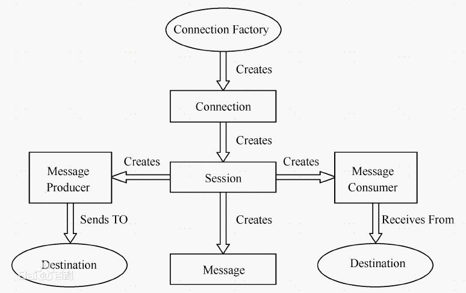](https://img2020.cnblogs.com/blog/874710/202012/874710-20201218145933918-904302278.png)

***2\***|***6\*****安装ActiveMQ**

**windows安装**

下载地址:http://activemq.apache.org/activemq-5150-release.html

下载完成后解压进入bin目录 运行 activemq.bat。

如果你遇到如下问题，5672端口被占用

[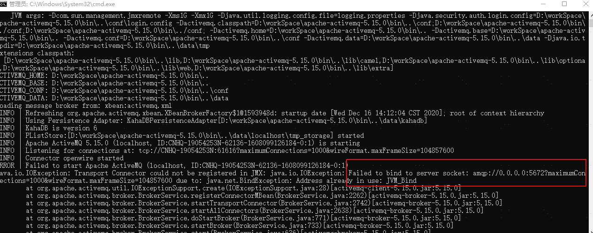](https://img2020.cnblogs.com/blog/874710/202012/874710-20201218145944589-560805277.png)

可以去修改activemq的conf目录下的activemq.xml，把amqp的端口改为其他的,这里改成了5673

[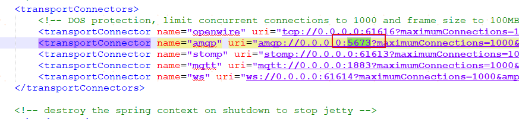](https://img2020.cnblogs.com/blog/874710/202012/874710-20201218145953307-445365424.png)

再次启动:

[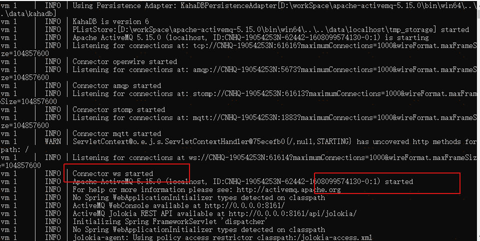](https://img2020.cnblogs.com/blog/874710/202012/874710-20201218150001361-1796783179.png)

访问地址:http://127.0.0.1:8161/admin/进入后台页面 初始账号密码 admin admin

[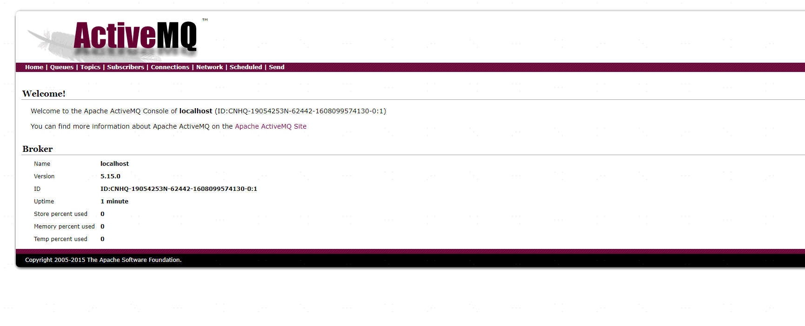](https://img2020.cnblogs.com/blog/874710/202012/874710-20201218150008805-1802342498.png)

**Docker安装ActiveMQ**

docker run -d --name activemq -p 61616:61616 -p 8161:8161 webcenter/activemq

***2\***|***7\*****ActiveMQ快速入门**

Springboot集成ActiveMQ

导入依赖


```
    <dependencies>
        <!--Springboot-->
        <dependency>
            <groupId>org.springframework.boot</groupId>
            <artifactId>spring-boot-starter-web</artifactId>
            <version>2.3.0.RELEASE</version>
        </dependency>
        <!--ActiveMq-->
        <dependency>
            <groupId>org.springframework.boot</groupId>
            <artifactId>spring-boot-starter-activemq</artifactId>
            <version>1.5.0.RELEASE</version>
        </dependency>
        <!--消息队列连接池-->
        <dependency>
            <groupId>org.apache.activemq</groupId>
            <artifactId>activemq-pool</artifactId>
            <version>5.15.0</version>
        </dependency>
    </dependencies>
```

配置MQ


```
server:
  port: 8080

spring:
  activemq:
    broker-url: tcp://127.0.0.1:61616
    user: admin
    password: admin
    close-timeout: 15s   # 在考虑结束之前等待的时间
    in-memory: true      # 默认代理URL是否应该在内存中。如果指定了显式代理，则忽略此值。
    non-blocking-redelivery: false  # 是否在回滚回滚消息之前停止消息传递。这意味着当启用此命令时，消息顺序不会被保留。
    send-timeout: 0     # 等待消息发送响应的时间。设置为0等待永远。
    queue-name: active.queue
    topic-name: active.topic.name.model
    #  packages:
    #    trust-all: true #不配置此项，会报错
    pool:
      enabled: true
      max-connections: 10   #连接池最大连接数
      idle-timeout: 30000   #空闲的连接过期时间，默认为30秒
    # jms:
    #   pub-sub-domain: true  #默认情况下activemq提供的是queue模式，若要使用topic模式需要配置下面配置

# 是否信任所有包
#spring.activemq.packages.trust-all=
# 要信任的特定包的逗号分隔列表（当不信任所有包时）
#spring.activemq.packages.trusted=
# 当连接请求和池满时是否阻塞。设置false会抛“JMSException异常”。
#spring.activemq.pool.block-if-full=true
# 如果池仍然满，则在抛出异常前阻塞时间。
#spring.activemq.pool.block-if-full-timeout=-1ms
# 是否在启动时创建连接。可以在启动时用于加热池。
#spring.activemq.pool.create-connection-on-startup=true
# 是否用Pooledconnectionfactory代替普通的ConnectionFactory。
#spring.activemq.pool.enabled=false
# 连接过期超时。
#spring.activemq.pool.expiry-timeout=0ms
# 连接空闲超时
#spring.activemq.pool.idle-timeout=30s
# 连接池最大连接数
#spring.activemq.pool.max-connections=1
# 每个连接的有效会话的最大数目。
#spring.activemq.pool.maximum-active-session-per-connection=500
# 当有"JMSException"时尝试重新连接
#spring.activemq.pool.reconnect-on-exception=true
# 在空闲连接清除线程之间运行的时间。当为负数时，没有空闲连接驱逐线程运行。
#spring.activemq.pool.time-between-expiration-check=-1ms
# 是否只使用一个MessageProducer
#spring.activemq.pool.use-anonymous-producers=true
```

编写配置类


```
/**
 * @author 原
 * @date 2020/12/16
 * @since 1.0
 **/
@Configuration
public class BeanConfig {
    @Value("${spring.activemq.broker-url}")
    private String brokerUrl;

    @Value("${spring.activemq.user}")
    private String username;

    @Value("${spring.activemq.topic-name}")
    private String password;

    @Value("${spring.activemq.queue-name}")
    private String queueName;

    @Value("${spring.activemq.topic-name}")
    private String topicName;

    @Bean(name = "queue")
    public Queue queue() {
        return new ActiveMQQueue(queueName);
    }

    @Bean(name = "topic")
    public Topic topic() {
        return new ActiveMQTopic(topicName);
    }

    @Bean
    public ConnectionFactory connectionFactory(){
        return new ActiveMQConnectionFactory(username, password, brokerUrl);
    }

    @Bean
    public JmsMessagingTemplate jmsMessageTemplate(){
        return new JmsMessagingTemplate(connectionFactory());
    }

    /**
     * 在Queue模式中，对消息的监听需要对containerFactory进行配置
     * @param connectionFactory
     * @return
     */
    @Bean("queueListener")
    public JmsListenerContainerFactory<?> queueJmsListenerContainerFactory(ConnectionFactory connectionFactory){
        SimpleJmsListenerContainerFactory factory = new SimpleJmsListenerContainerFactory();
        factory.setConnectionFactory(connectionFactory);
        factory.setPubSubDomain(false);
        return factory;
    }

    /**
     * 在Topic模式中，对消息的监听需要对containerFactory进行配置
     * @param connectionFactory
     * @return
     */
    @Bean("topicListener")
    public JmsListenerContainerFactory<?> topicJmsListenerContainerFactory(ConnectionFactory connectionFactory){
        SimpleJmsListenerContainerFactory factory = new SimpleJmsListenerContainerFactory();
        factory.setConnectionFactory(connectionFactory);
        factory.setPubSubDomain(true);
        return factory;
    }
}
```

编写启动类


```
/**
 * @author 原
 * @date 2020/12/8
 * @since 1.0
 **/
@SpringBootApplication
@EnableJms //开启JMS支持
public class DemoApplication {

    @Autowired
    private JmsMessagingTemplate jmsMessagingTemplate;

    @Autowired
    private Queue queue;

    @Autowired
    private Topic topic;

    public static void main(String[] args) {
        SpringApplication.run(DemoApplication.class, args);
    }

    /**
     * 应用启动后,会执行该方法
     * 会分别向queue和topic发送一条消息
     */
    @PostConstruct
    public void sendMsg(){
        jmsMessagingTemplate.convertAndSend(queue,"queue-test");
        jmsMessagingTemplate.convertAndSend(topic,"topic-test");
    }
}
```

查看activemq后台

[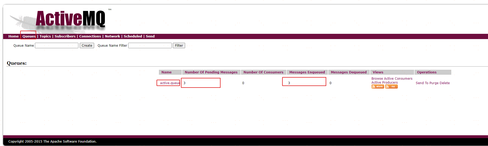](https://img2020.cnblogs.com/blog/874710/202012/874710-20201218150018777-1490356180.png)

[active.queue](http://127.0.0.1:8161/admin/browse.jsp?JMSDestination=active.queue) 为队列的名称

[Number Of Pending Messages](http://127.0.0.1:8161/admin/queues.jsp#) 等待消费的消息数量 3是因为我自己发了3次

[Messages Enqueued](http://127.0.0.1:8161/admin/queues.jsp#) 已经进入队列的消息数量

[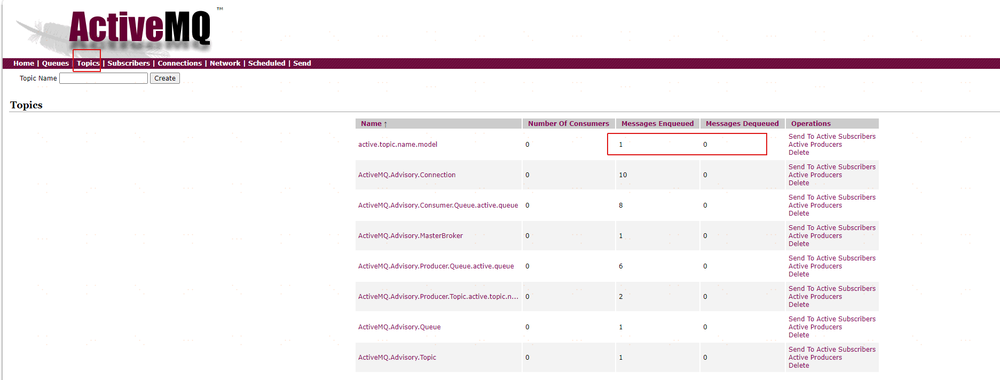](https://img2020.cnblogs.com/blog/874710/202012/874710-20201218150029815-1222738229.png)

因为没有消费者,消息一直没有被消费。下面我们编写消费者代码。


```
/**
 * @author 原
 * @date 2020/12/16
 * @since 1.0
 **/
@Component
public class QueueConsumerListener {

    @JmsListener(destination = "${spring.activemq.queue-name}",containerFactory = "queueListener")
    public void getQueue(String message){
        System.out.println("接受queue:"+message);
    }

    @JmsListener(destination = "${spring.activemq.topic-name}",containerFactory = "topicListener")
    public void getTopic(String message){
        System.out.println("接受topic:"+message);
    }
}
```

在后台发送一条消息

[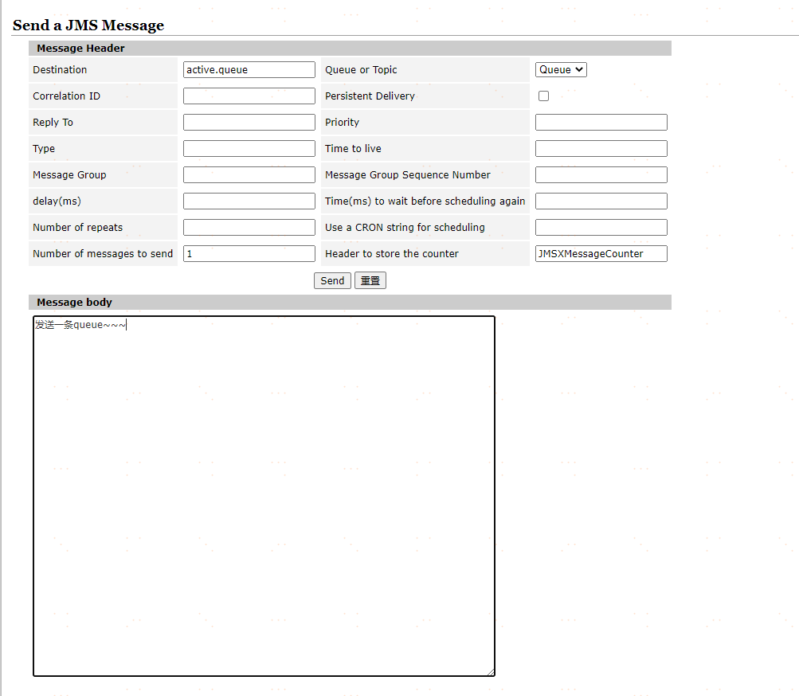](https://img2020.cnblogs.com/blog/874710/202012/874710-20201218150037856-2074093491.png)

控制台打印

[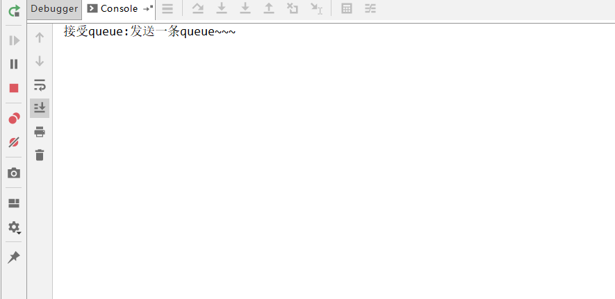](https://img2020.cnblogs.com/blog/874710/202012/874710-20201218150045300-777057475.png)

发送topic消息

[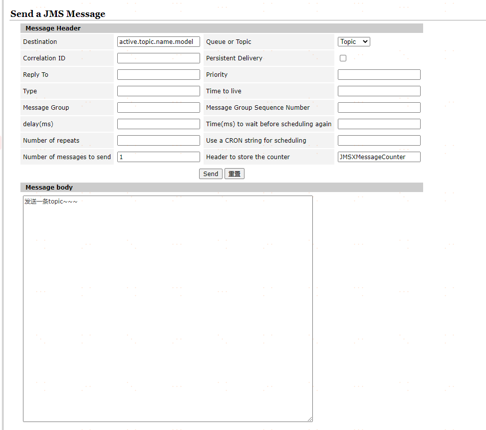](https://img2020.cnblogs.com/blog/874710/202012/874710-20201218150052318-809668985.png)

控制台打印:

[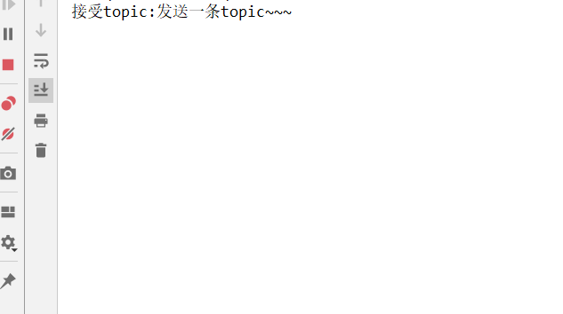](https://img2020.cnblogs.com/blog/874710/202012/874710-20201218150101035-618529941.png)

但是发现一个问题是，之前在没有消费的时候，有3条queue和一条topic，但是当我启动消费者时，queue的3条消息被消费了，topic确没有。这是因为：

topic模式有普通订阅和持久化订阅

普通订阅：在消费者启动之前发送过来的消息，消费者启动之后不会去消费；

持久化订阅： 在消费者启动之前发送过来的消息，消费者启动之后会去消费；

***2\***|***8\*****ActiveMQ原理分析****消息同步发送与异步发送**

ActiveMQ支持同步、异步两种发送模式将消息发送到broker上。
同步发送过程中，发送者发送一条消息会阻塞直到broker反馈一个确认消息，表示消息已经被broker处理。这个机
制提供了消息的安全性保障，但是由于是阻塞的操作，会影响到客户端消息发送的性能
异步发送的过程中，发送者不需要等待broker提供反馈，所以性能相对较高。但是可能会出现消息丢失的情况。所
以使用异步发送的前提是在某些情况下允许出现数据丢失的情况。
默认情况下，非持久化消息是异步发送的，持久化消息并且是在非事务模式下是同步发送的。
但是在开启事务的情况下，消息都是异步发送。由于异步发送的效率会比同步发送性能更高。所以在发送持久化消
息的时候，尽量去开启事务会话。

**消息发送原理**

[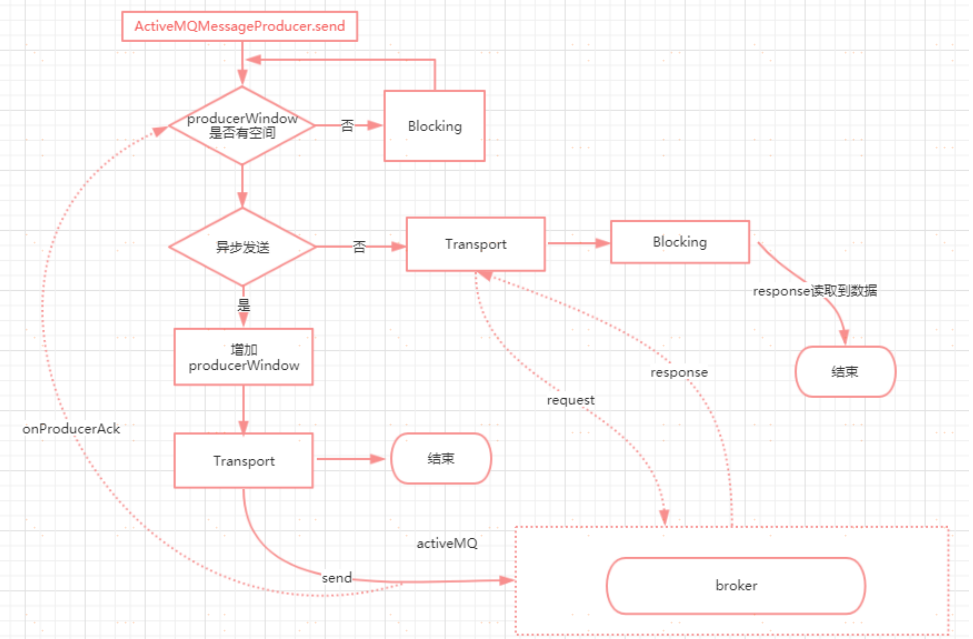](https://img2020.cnblogs.com/blog/874710/202012/874710-20201218150108849-1536842805.png)

**ProducerWindowSize的含义**

producer每发送一个消息，统计一下发送的字节数，当字节数达到ProducerWindowSize值时，需要等待broker的确认，才能继续发送。

代码在：ActiveMQSession的1957行
主要用来约束在异步发送时producer端允许积压的(尚未ACK)的消息的大小，且只对异步发送有意义。每次发送消息之后，都将会导致memoryUsage大小增加(+message.size)，当broker返回producerAck时，memoryUsage尺寸减少(producerAck.size，此size表示先前发送消息的大小)。

可以通过如下2种方式设置:
Ø 在brokerUrl中设置: "tcp://localhost:61616?jms.producerWindowSize=1048576",这种设置将会对所有的
producer生效。
Ø 在destinationUri中设置: "test-queue?producer.windowSize=1048576",此参数只会对使用此Destination实例
的producer失效，将会覆盖brokerUrl中的producerWindowSize值。

注意：此值越大，意味着消耗Client端的内存就越大。

**源码分析**

**ActiveMQMessageProducer.send(...)方法**


```
public void send(Destination destination, Message message, int deliveryMode, int priority, long timeToLive, AsyncCallback onComplete) throws JMSException {
        checkClosed();//检查session连接,若已关闭直接抛出异常
        if (destination == null) {//校验发送消息的目的地是否为空,也就是必须制定queue或者topic信息
            if (info.getDestination() == null) {
                throw new UnsupportedOperationException("A destination must be specified.");
            }
            throw new InvalidDestinationException("Don't understand null destinations");
        }

    	//这里做的是封装Destination
        ActiveMQDestination dest;
        if (destination.equals(info.getDestination())) {
            dest = (ActiveMQDestination)destination;
        } else if (info.getDestination() == null) {
            dest = ActiveMQDestination.transform(destination);
        } else {
            throw new UnsupportedOperationException("This producer can only send messages to: " + this.info.getDestination().getPhysicalName());
        }
        if (dest == null) {
            throw new JMSException("No destination specified");
        }
		//封装Message
        if (transformer != null) {
            Message transformedMessage = transformer.producerTransform(session, this, message);
            if (transformedMessage != null) {
                message = transformedMessage;
            }
        }
		//如果设置了producerWindow,则需要校验producerWindow大小
        if (producerWindow != null) {
            try {
                producerWindow.waitForSpace();
            } catch (InterruptedException e) {
                throw new JMSException("Send aborted due to thread interrupt.");
            }
        }
		//发送消息
        this.session.send(this, dest, message, deliveryMode, priority, timeToLive, producerWindow, sendTimeout, onComplete);
		//做统计的
        stats.onMessage();
    }
```

**ActiveMQSession的send方法**


```
protected void send(ActiveMQMessageProducer producer, ActiveMQDestination destination, Message message, int deliveryMode, int priority, long timeToLive,
                        MemoryUsage producerWindow, int sendTimeout, AsyncCallback onComplete) throws JMSException {
		//校验连接	
        checkClosed();
    	//校验发送目标
        if (destination.isTemporary() && connection.isDeleted(destination)) {
            throw new InvalidDestinationException("Cannot publish to a deleted Destination: " + destination);
        }
    	//互斥锁，如果一个session的多个producer发送消息到这里，会保证消息发送的有序性
        synchronized (sendMutex) {
            // tell the Broker we are about to start a new transaction
            doStartTransaction();
            TransactionId txid = transactionContext.getTransactionId();
            long sequenceNumber = producer.getMessageSequence();

            //Set the "JMS" header fields on the original message, see 1.1 spec section 3.4.11
            message.setJMSDeliveryMode(deliveryMode);//设置是否持久化
            long expiration = 0L;
            if (!producer.getDisableMessageTimestamp()) {
                long timeStamp = System.currentTimeMillis();
                message.setJMSTimestamp(timeStamp);
                if (timeToLive > 0) {
                    expiration = timeToLive + timeStamp;
                }
            }
            message.setJMSExpiration(expiration);//消息过期时间
            message.setJMSPriority(priority);//消息优先级
            message.setJMSRedelivered(false);//是否重复发送

            // transform to our own message format here 统一封装
            ActiveMQMessage msg = ActiveMQMessageTransformation.transformMessage(message, connection);
            msg.setDestination(destination);
            //设置消息ID
            msg.setMessageId(new MessageId(producer.getProducerInfo().getProducerId(), sequenceNumber));

            // Set the message id.
            if (msg != message) {//如果消息是经过转化的，则更新原来的消息id和目的地
                message.setJMSMessageID(msg.getMessageId().toString());
                // Make sure the JMS destination is set on the foreign messages too.
                message.setJMSDestination(destination);
            }
            //clear the brokerPath in case we are re-sending this message
            msg.setBrokerPath(null);

            msg.setTransactionId(txid);
            if (connection.isCopyMessageOnSend()) {
                msg = (ActiveMQMessage)msg.copy();
            }
            msg.setConnection(connection);
            msg.onSend();//把消息属性和消息体都设置为只读，防止被修改
            msg.setProducerId(msg.getMessageId().getProducerId());
            if (LOG.isTraceEnabled()) {
                LOG.trace(getSessionId() + " sending message: " + msg);
            }
            //如果onComplete没有设置，且发送超时时间小于0，且消息不需要反馈，且连接器不是同步发送模式，且消息非持久化或者连接器是异步发送模式
			//或者存在事务id的情况下，走异步发送，否则走同步发送
            if (onComplete==null && sendTimeout <= 0 && !msg.isResponseRequired() && !connection.isAlwaysSyncSend() && (!msg.isPersistent() || connection.isUseAsyncSend() || txid != null)) {
                this.connection.asyncSendPacket(msg);
                if (producerWindow != null) {
                    // Since we defer lots of the marshaling till we hit the
                    // wire, this might not
                    // provide and accurate size. We may change over to doing
                    // more aggressive marshaling,
                    // to get more accurate sizes.. this is more important once
                    // users start using producer window
                    // flow control.
                    int size = msg.getSize();//异步发送的情况下，需要设置producerWindow的大小
                    producerWindow.increaseUsage(size);
                }
            } else {
                if (sendTimeout > 0 && onComplete==null) {
                    this.connection.syncSendPacket(msg,sendTimeout);//带超时时间的同步发送//带回调的同步发送
                }else {
                    this.connection.syncSendPacket(msg, onComplete);//带回调的同步发送
                }
            }

        }
    }
```

看下异步发送的代码ActiveMQConnection. asyncSendPacket()


```
 /**
     * send a Packet through the Connection - for internal use only
     *
     * @param command
     * @throws JMSException
     */
    public void asyncSendPacket(Command command) throws JMSException {
        if (isClosed()) {
            throw new ConnectionClosedException();
        } else {
            doAsyncSendPacket(command);
        }
    }

    private void doAsyncSendPacket(Command command) throws JMSException {
        try {
            this.transport.oneway(command);
        } catch (IOException e) {
            throw JMSExceptionSupport.create(e);
        }
    }
```

再看看transport是个什么东西?在哪里实例化的？按照以前看源码的惯例来看，它肯定不是一个单纯的对象。按照以往我看源码的经验来看，一定是在创建连接的过程中初始化的。所以我们定位到代码


```
//从connection=connectionFactory.createConnection();这行代码作为入口，一直跟踪ActiveMQConnectionFactory. createActiveMQConnection这个方法中。代码如下

protected ActiveMQConnection createActiveMQConnection(String userName, String password) throws
JMSException {
if (brokerURL == null) {
throw new ConfigurationException("brokerURL not set.");
}
ActiveMQConnection connection = null;
try {
Transport transport = createTransport();//代码往下看
connection = createActiveMQConnection(transport, factoryStats);
connection.setUserName(userName);
connection.setPassword(password);
//省略后面的代码
}
```


```
//这个方法就是实例化Transport的 1.构建Broker的URL 2.根据这个URL去创建一个链接TransportFactory.connect 默认使用的TCP连接
 protected Transport createTransport() throws JMSException {
        try {
            URI connectBrokerUL = brokerURL;
            String scheme = brokerURL.getScheme();
            if (scheme == null) {
                throw new IOException("Transport not scheme specified: [" + brokerURL + "]");
            }
            if (scheme.equals("auto")) {
                connectBrokerUL = new URI(brokerURL.toString().replace("auto", "tcp"));
            } else if (scheme.equals("auto+ssl")) {
                connectBrokerUL = new URI(brokerURL.toString().replace("auto+ssl", "ssl"));
            } else if (scheme.equals("auto+nio")) {
                connectBrokerUL = new URI(brokerURL.toString().replace("auto+nio", "nio"));
            } else if (scheme.equals("auto+nio+ssl")) {
                connectBrokerUL = new URI(brokerURL.toString().replace("auto+nio+ssl", "nio+ssl"));
            }

            return TransportFactory.connect(connectBrokerUL);//里面的代码继续往下看
        } catch (Exception e) {
            throw JMSExceptionSupport.create("Could not create Transport. Reason: " + e, e);
        }
    }    
```

**TransportFactory. findTransportFactory**

1. 从TRANSPORT_FACTORYS这个Map集合中，根据scheme去获得一个TransportFactory指定的实例对象
2. 如果Map集合中不存在，则通过TRANSPORT_FACTORY_FINDER去找一个并且构建实例
   Ø 这个地方又有点类似于我们之前所学过的SPI的思想吧？他会从METAINF/services/org/apache/activemq/transport/ 这个路径下，根据URI组装的scheme去找到匹配class对象并且
   实例化，所以根据tcp为key去对应的路径下可以找到T cpT ransportFactory


```
 //TransportFactory.connect(connectBrokerUL)
    public static Transport connect(URI location) throws Exception {
        TransportFactory tf = findTransportFactory(location);
        return tf.doConnect(location);
    }
    
    //findTransportFactory(location)
        public static TransportFactory findTransportFactory(URI location) throws IOException {
        String scheme = location.getScheme();
        if (scheme == null) {
            throw new IOException("Transport not scheme specified: [" + location + "]");
        }
        TransportFactory tf = TRANSPORT_FACTORYS.get(scheme);
        if (tf == null) {
            // Try to load if from a META-INF property.
            try {
                tf = (TransportFactory)TRANSPORT_FACTORY_FINDER.newInstance(scheme);
                TRANSPORT_FACTORYS.put(scheme, tf);
            } catch (Throwable e) {
                throw IOExceptionSupport.create("Transport scheme NOT recognized: [" + scheme + "]", e);
            }
        }
        return tf;
    }
```

调用TransportFactory.doConnect去构建一个连接


```
    public Transport doConnect(URI location) throws Exception {
        try {
            Map<String, String> options = new HashMap<String, String>(URISupport.parseParameters(location));
            if( !options.containsKey("wireFormat.host") ) {
                options.put("wireFormat.host", location.getHost());
            }
            WireFormat wf = createWireFormat(options);
            Transport transport = createTransport(location, wf);
            Transport rc = configure(transport, wf, options);
            //remove auto
            IntrospectionSupport.extractProperties(options, "auto.");

            if (!options.isEmpty()) {
                throw new IllegalArgumentException("Invalid connect parameters: " + options);
            }
            return rc;
        } catch (URISyntaxException e) {
            throw IOExceptionSupport.create(e);
        }
    }
```

**configure**


```
    public Transport configure(Transport transport, WireFormat wf, Map options) throws Exception {
        //组装一个复合的transport，这里会包装两层，一个是IactivityMonitor.另一个是WireFormatNegotiator
        transport = compositeConfigure(transport, wf, options);

        transport = new MutexTransport(transport);//再做一层包装,MutexTransport
        transport = new ResponseCorrelator(transport);//包装ResponseCorrelator

        return transport;
    }
```

到目前为止，这个transport实际上就是一个调用链了，他的链结构为
ResponseCorrelator(MutexT ransport(WireFormatNegotiator(IactivityMonitor(T cpT ransport()))
每一层包装表示什么意思呢？
ResponseCorrelator 用于实现异步请求。
MutexT ransport 实现写锁，表示同一时间只允许发送一个请求
WireFormatNegotiator 实现了客户端连接broker的时候先发送数据解析相关的协议信息，比如解析版本号，是否
使用缓存等
InactivityMonitor 用于实现连接成功成功后的心跳检查机制，客户端每10s发送一次心跳信息。服务端每30s读取
一次心跳信息。

**同步发送和异步发送的区别**


```
public Object request(Object command, int timeout) throws IOException {
FutureResponse response = asyncRequest(command, null);
return response.getResult(timeout); // 从future方法阻塞等待返回
}
```

**持久化消息和非持久化消息的存储原理**

正常情况下，非持久化消息是存储在内存中的，持久化消息是存储在文件中的。能够存储的最大消息数据在
${ActiveMQ_HOME}/conf/activemq.xml文件中的systemUsage节点
SystemUsage配置设置了一些系统内存和硬盘容量


```
<systemUsage>
<systemUsage>
<memoryUsage>
//该子标记设置整个ActiveMQ节点的“可用内存限制”。这个值不能超过ActiveMQ本身设置的最大内存大小。其中的
percentOfJvmHeap属性表示百分比。占用70%的堆内存
<memoryUsage percentOfJvmHeap="70" />
</memoryUsage>
<storeUsage>
//该标记设置整个ActiveMQ节点，用于存储“持久化消息”的“可用磁盘空间”。该子标记的limit属性必须要进行设置
<storeUsage limit="100 gb"/>
</storeUsage>
<tempUsage>
//一旦ActiveMQ服务节点存储的消息达到了memoryUsage的限制，非持久化消息就会被转储到 temp store区域，虽然
我们说过非持久化消息不进行持久化存储，但是ActiveMQ为了防止“数据洪峰”出现时非持久化消息大量堆积致使内存耗
尽的情况出现，还是会将非持久化消息写入到磁盘的临时区域——temp store。这个子标记就是为了设置这个temp
store区域的“可用磁盘空间限制”
<tempUsage limit="50 gb"/>
</tempUsage>
</systemUsage>
</systemUsage>
```

从上面的配置我们需要get到一个结论，当非持久化消息堆积到一定程度的时候，也就是内存超过指定的设置阀值时，ActiveMQ会将内存中的非持久化消息写入到临时文件，以便腾出内存。但是它和持久化消息的区别是，重启之后，持久化消息会从文件中恢复，非持久化的临时文件会直接删除

**消息的持久化策略分析**

消息持久性对于可靠消息传递来说是一种比较好的方法，即时发送者和接受者不是同时在线或者消息中心在发送者发送消息后宕机了，在消息中心重启后仍然可以将消息发送出去。消息持久性的原理很简单，就是在发送消息出去后，消息中心首先将消息存储在本地文件、内存或者远程数据库，然后把消息发送给接受者，发送成功后再把消息从存储中删除，失败则继续尝试。接下来我们来了解一下消息在broker上的持久化存储实现方式

**持久化存储支持类型**

ActiveMQ支持多种不同的持久化方式，主要有以下几种，不过，无论使用哪种持久化方式，消息的存储逻辑都是一致的。
Ø KahaDB存储（默认存储方式）

Ø JDBC存储

Ø Memory存储

Ø LevelDB存储

Ø JDBC With ActiveMQ Journal

**KahaDB存储**
KahaDB是目前默认的存储方式,可用于任何场景,提高了性能和恢复能力。消息存储使用一个事务日志和仅仅用一个索引文件来存储它所有的地址。
KahaDB是一个专门针对消息持久化的解决方案,它对典型的消息使用模式进行了优化。在Kaha中,数据被追加到data logs中。当不再需要log文件中的数据的时候,log文件会被丢弃。

**配置方式**


```
<persistenceAdapter>
<kahaDB directory="${activemq.data}/kahadb"/>
</persistenceAdapter>
```

**KahaDB的存储原理**
在data/kahadb这个目录下，会生成四个文件
Ø db.data 它是消息的索引文件，本质上是B-Tree（B树），使用B-Tree作为索引指向db-*.log里面存储的消息
Ø db.redo 用来进行消息恢复
Ø db-*.log 存储消息内容。新的数据以APPEND的方式追加到日志文件末尾。属于顺序写入，因此消息存储是比较
快的。默认是32M，达到阀值会自动递增
Ø lock文件 锁，表示当前获得kahadb读写权限的broker

**JDBC存储**
使用JDBC持久化方式，数据库会创建3个表：activemq_msgs，activemq_acks和activemq_lock。
ACTIVEMQ_MSGS 消息表，queue和topic都存在这个表中
ACTIVEMQ_ACKS 存储持久订阅的信息和最后一个持久订阅接收的消息ID
ACTIVEMQ_LOCKS 锁表，用来确保某一时刻，只能有一个ActiveMQ broker实例来访问数据库
**JDBC存储配置**


```
<persistenceAdapter>
<jdbcPersistenceAdapter dataSource="# MySQL-DS " createTablesOnStartup="true" />
</persistenceAdapter>
```

dataSource指定持久化数据库的bean，createT ablesOnStartup是否在启动的时候创建数据表，默认值是true，这
样每次启动都会去创建数据表了，一般是第一次启动的时候设置为true，之后改成false
Mysql持久化Bean配置


```
<bean id="Mysql-DS" class="org.apache.commons.dbcp.BasicDataSource" destroy-method="close">
<property name="driverClassName" value="com.mysql.jdbc.Driver"/>
<property name="url" value="jdbc:mysql://192.168.11.156:3306/activemq?
relaxAutoCommit=true"/>
<property name="username" value="root"/>
<property name="password" value="root"/>
</bean>
```

**LevelDB存储**

LevelDB持久化性能高于KahaDB，虽然目前默认的持久化方式仍然是KahaDB。并且，在ActiveMQ 5.9版本提供
了基于LevelDB和Zookeeper的数据复制方式，用于Master-slave方式的首选数据复制方案。
不过，据ActiveMQ官网对LevelDB的表述：LevelDB官方建议使用以及不再支持，推荐使用的是KahaDB


```
<persistenceAdapter>
<levelDBdirectory="activemq-data"/>
</persistenceAdapter>
```

**Memory 消息存储**
基于内存的消息存储，内存消息存储主要是存储所有的持久化的消息在内存中。persistent=”false”,表示不设置持
久化存储，直接存储到内存中


```
<beans>
<broker brokerName="test-broker" persistent="false"
xmlns="http://activemq.apache.org/schema/core">
<transportConnectors>
<transportConnector uri="tcp://localhost:61635"/>
</transportConnectors> </broker>
</beans>
```

**JDBC Message store with ActiveMQ Journal**

这种方式克服了JDBC Store的不足，JDBC每次消息过来，都需要去写库和读库。
ActiveMQ Journal，使用高速缓存写入技术，大大提高了性能。
当消费者的消费速度能够及时跟上生产者消息的生产速度时，journal文件能够大大减少需要写入到DB中的消息。
举个例子，生产者生产了1000条消息，这1000条消息会保存到journal文件，如果消费者的消费速度很快的情况
下，在journal文件还没有同步到DB之前，消费者已经消费了90%的以上的消息，那么这个时候只需要同步剩余的
10%的消息到DB。
如果消费者的消费速度很慢，这个时候journal文件可以使消息以批量方式写到DB。
Ø 将原来的标签注释掉
Ø 添加如下标签


```
<persistenceFactory>
<journalPersistenceAdapterFactory  dataSource="#Mysql-DS" dataDirectory="activemqdata"/>
</persistenceFactory>
```

Ø 在服务端循环发送消息。可以看到数据是延迟同步到数据库的

**消费端消费消息的原理**

我们知道有两种方法可以接收消息，一种是使用同步阻塞的MessageConsumer#receive方法。另一种是使用消息监听器MessageListener。这里需要注意的是，在同一个session下，这两者不能同时工作，也就是说不能针对不同消息采用不同的接收方式。否则会抛出异常。
至于为什么这么做，最大的原因还是在事务性会话中，两种消费模式的事务不好管控

**消费流程图**

[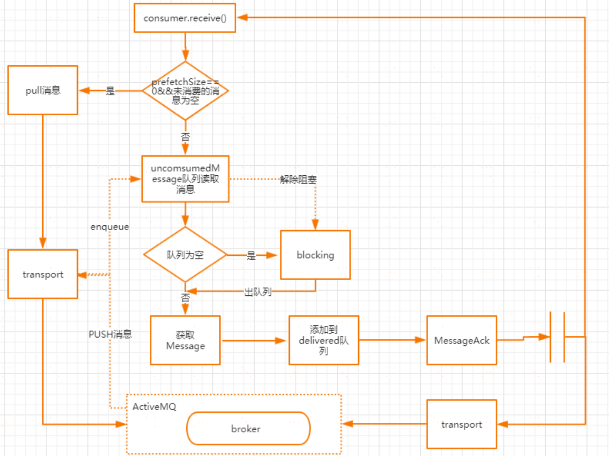](https://img2020.cnblogs.com/blog/874710/202012/874710-20201218150116613-1942957272.png)

ActiveMQMessageConsumer.receive消费端同步接收消息的源码入口


```
public Message receive() throws JMSException {
    checkClosed();
    checkMessageListener();  //检查receive和MessageListener是否同时配置在当前的会话中,同步消费不需要设置MessageListener 否则会报错
    sendPullCommand(0); //如果PrefetchSizeSize为0并且unconsumerMessage为空，则发起pull命令
    MessageDispatch md = dequeue(-1); //从unconsumerMessage出队列获取消息
    if (md == null) {
        return null;
    }
    beforeMessageIsConsumed(md);
    afterMessageIsConsumed(md, false); //发送ack给到broker
    return createActiveMQMessage(md);//获取消息并返回
}
```

**sendPullCommand**
发送pull命令从broker上获取消息，前提是prefetchSize=0并且unconsumedMessages为空。
unconsumedMessage表示未消费的消息，这里面预读取的消息大小为prefetchSize的值


```
protected void sendPullCommand(long timeout) throws JMSException {
    clearDeliveredList();
    if (info.getCurrentPrefetchSize() == 0 && unconsumedMessages.isEmpty()) {
        MessagePull messagePull = new MessagePull();
        messagePull.configure(info);
        messagePull.setTimeout(timeout);
        session.asyncSendPacket(messagePull); //向服务端异步发送messagePull指令
    }
}
```

**clearDeliveredList**

在上面的sendPullCommand方法中，会先调用clearDeliveredList方法，主要用来清理已经分发的消息链表
deliveredMessages
deliveredMessages，存储分发给消费者但还未应答的消息链表
Ø 如果session是事务的，则会遍历deliveredMessage中的消息放入到previouslyDeliveredMessage中来做重发
Ø 如果session是非事务的，根据ACK的模式来选择不同的应答操作


```
    // async (on next call) clear or track delivered as they may be flagged as duplicates if they arrive again
    private void clearDeliveredList() {
        if (clearDeliveredList) {
            synchronized (deliveredMessages) {
                if (clearDeliveredList) {
                    if (!deliveredMessages.isEmpty()) {
                        if (session.isTransacted()) {

                            if (previouslyDeliveredMessages == null) {
                                previouslyDeliveredMessages = new PreviouslyDeliveredMap<MessageId, Boolean>(session.getTransactionContext().getTransactionId());
                            }
                            for (MessageDispatch delivered : deliveredMessages) {
                                previouslyDeliveredMessages.put(delivered.getMessage().getMessageId(), false);
                            }
                            LOG.debug("{} tracking existing transacted {} delivered list ({}) on transport interrupt",
                                      getConsumerId(), previouslyDeliveredMessages.transactionId, deliveredMessages.size());
                        } else {
                            if (session.isClientAcknowledge()) {
                                LOG.debug("{} rolling back delivered list ({}) on transport interrupt", getConsumerId(), deliveredMessages.size());
                                // allow redelivery
                                if (!this.info.isBrowser()) {
                                    for (MessageDispatch md: deliveredMessages) {
                                        this.session.connection.rollbackDuplicate(this, md.getMessage());
                                    }
                                }
                            }
                            LOG.debug("{} clearing delivered list ({}) on transport interrupt", getConsumerId(), deliveredMessages.size());
                            deliveredMessages.clear();
                            pendingAck = null;
                        }
                    }
                    clearDeliveredList = false;
                }
            }
        }
    }
```

**dequeue**

从unconsumedMessage中取出一个消息，在创建一个消费者时，就会为这个消费者创建一个未消费的消息道，
这个通道分为两种，一种是简单优先级队列分发通道SimplePriorityMessageDispatchChannel ；另一种是先进先
出的分发通道FifoMessageDispatchChannel.
至于为什么要存在这样一个消息分发通道，大家可以想象一下，如果消费者每次去消费完一个消息以后再broker拿一个消息，效率是比较低的。所以通过这样的设计可以允许session能够一次性将多条消息分发给一个消费者。
默认情况下对于queue来说，prefetchSize的值是1000

**beforeMessageIsConsumed**

 这里面主要是做消息消费之前的一些准备工作，如果ACK类型不是DUPS_OK_ACKNOWLEDGE或者队列模式（简单来说就是除了T opic和DupAck这两种情况），所有的消息先放到deliveredMessages链表的开头。并且如果当前是事务类型的会话，则判断transactedIndividualAck，如果为true，表示单条消息直接返回ack。
​ 否则，调用ackLater，批量应答, client端在消费消息后暂且不发送ACK，而是把它缓存下来(pendingACK)，等到这些消息的条数达到一定阀值时，只需要通过一个ACK指令把它们全部确认；这比对每条消息都逐个确认，在性能上要提高很多


```
    private void beforeMessageIsConsumed(MessageDispatch md) throws JMSException {
        md.setDeliverySequenceId(session.getNextDeliveryId());
        lastDeliveredSequenceId = md.getMessage().getMessageId().getBrokerSequenceId();
        if (!isAutoAcknowledgeBatch()) {
            synchronized(deliveredMessages) {
                deliveredMessages.addFirst(md);
            }
            if (session.getTransacted()) {
                if (transactedIndividualAck) {
                    immediateIndividualTransactedAck(md);
                } else {
                    ackLater(md, MessageAck.DELIVERED_ACK_TYPE);
                }
            }
        }
    }
```

**afterMessageIsConsumed**

这个方法的主要作用是执行应答操作，这里面做以下几个操作
Ø 如果消息过期，则返回消息过期的ack
Ø 如果是事务类型的会话，则不做任何处理
Ø 如果是AUTOACK或者（DUPS_OK_ACK且是队列），并且是优化ack操作，则走批量确认ack
Ø 如果是DUPS_OK_ACK，则走ackLater逻辑
Ø 如果是CLIENT_ACK，则执行ackLater


```
private void afterMessageIsConsumed(MessageDispatch md, boolean messageExpired) throws JMSException {
        if (unconsumedMessages.isClosed()) {
            return;
        }
        if (messageExpired) {
            acknowledge(md, MessageAck.EXPIRED_ACK_TYPE);
            stats.getExpiredMessageCount().increment();
        } else {
            stats.onMessage();
            if (session.getTransacted()) {
                // Do nothing.
            } else if (isAutoAcknowledgeEach()) {
                if (deliveryingAcknowledgements.compareAndSet(false, true)) {
                    synchronized (deliveredMessages) {
                        if (!deliveredMessages.isEmpty()) {
                            if (optimizeAcknowledge) {
                                ackCounter++;

                                // AMQ-3956 evaluate both expired and normal msgs as
                                // otherwise consumer may get stalled
                                if (ackCounter + deliveredCounter >= (info.getPrefetchSize() * .65) || (optimizeAcknowledgeTimeOut > 0 && System.currentTimeMillis() >= (optimizeAckTimestamp + optimizeAcknowledgeTimeOut))) {
                                    MessageAck ack = makeAckForAllDeliveredMessages(MessageAck.STANDARD_ACK_TYPE);
                                    if (ack != null) {
                                        deliveredMessages.clear();
                                        ackCounter = 0;
                                        session.sendAck(ack);
                                        optimizeAckTimestamp = System.currentTimeMillis();
                                    }
                                    // AMQ-3956 - as further optimization send
                                    // ack for expired msgs when there are any.
                                    // This resets the deliveredCounter to 0 so that
                                    // we won't sent standard acks with every msg just
                                    // because the deliveredCounter just below
                                    // 0.5 * prefetch as used in ackLater()
                                    if (pendingAck != null && deliveredCounter > 0) {
                                        session.sendAck(pendingAck);
                                        pendingAck = null;
                                        deliveredCounter = 0;
                                    }
                                }
                            } else {
                                MessageAck ack = makeAckForAllDeliveredMessages(MessageAck.STANDARD_ACK_TYPE);
                                if (ack!=null) {
                                    deliveredMessages.clear();
                                    session.sendAck(ack);
                                }
                            }
                        }
                    }
                    deliveryingAcknowledgements.set(false);
                }
            } else if (isAutoAcknowledgeBatch()) {
                ackLater(md, MessageAck.STANDARD_ACK_TYPE);
            } else if (session.isClientAcknowledge()||session.isIndividualAcknowledge()) {
                boolean messageUnackedByConsumer = false;
                synchronized (deliveredMessages) {
                    messageUnackedByConsumer = deliveredMessages.contains(md);
                }
                if (messageUnackedByConsumer) {
                    ackLater(md, MessageAck.DELIVERED_ACK_TYPE);
                }
            }
            else {
                throw new IllegalStateException("Invalid session state.");
            }
        }
    }
```

***2\***|***9\*****ActiveMQ的优缺点**

ActiveMQ 采用消息推送方式，所以最适合的场景是默认消息都可在短时间内被消费。数据量越大，查找和消费消息就越慢，消息积压程度与消息速度成反比。

**缺点**

1.吞吐量低。由于 ActiveMQ 需要建立索引，导致吞吐量下降。这是无法克服的缺点，只要使用完全符合 JMS 规范的消息中间件，就要接受这个级别的TPS。
2.无分片功能。这是一个功能缺失，JMS 并没有规定消息中间件的集群、分片机制。而由于 ActiveMQ 是伟企业级开发设计的消息中间件，初衷并不是为了处理海量消息和高并发请求。如果一台服务器不能承受更多消息，则需要横向拆分。ActiveMQ 官方不提供分片机制，需要自己实现。

**适用场景**

对 TPS 要求比较低的系统，可以使用 ActiveMQ 来实现，一方面比较简单，能够快速上手开发，另一方面可控性也比较好，还有比较好的监控机制和界面

**不适用的场景**

消息量巨大的场景。ActiveMQ 不支持消息自动分片机制，如果消息量巨大，导致一台服务器不能处理全部消息，就需要自己开发消息分片功能。