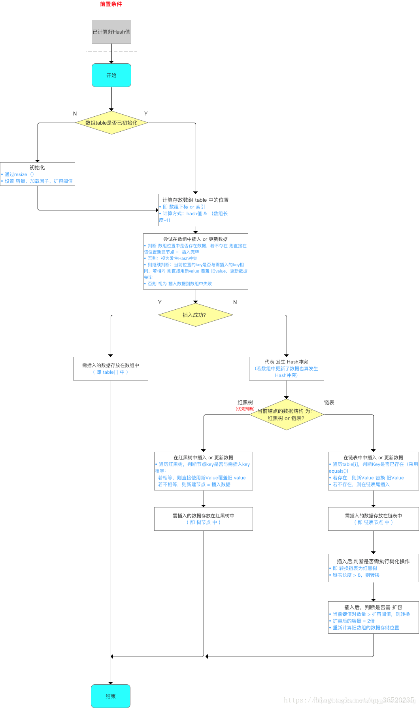
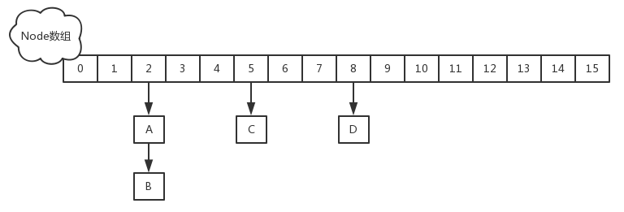
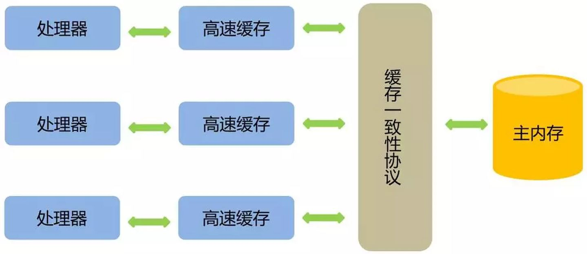
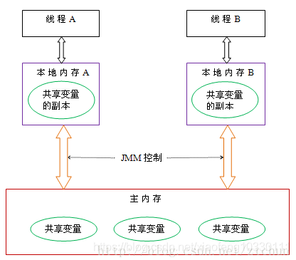
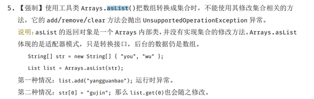
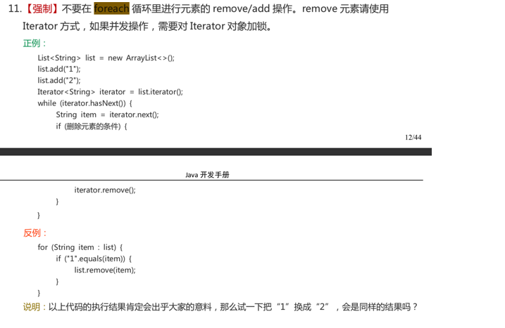

# 二、集合：

## 0️⃣：集合概念

### 1.Java集合框架是什么？说出一些集合框架的优点？

（1）使用核心集合类降低开发成本，而非实现我们自己的集合类。

（2）随着使用经过严格测试的集合框架类，代码质量会得到提高。

（3）通过使用JDK附带的集合类，可以降低代码维护成本。

（4）复用性和可操作性。

### 2.集合框架中的泛型有什么优点？

* Java1.5引入了泛型，所有的集合接口和实现都大量地使用它。泛型允许我们为集合提供一个可以容纳的对象类型，因此，如果你添加其它类型的任何元素，它会在编译时报错。这避免了在运行时出现ClassCastException，因为你将会在编译时得到报错信息。泛型也使得代码整洁，我们不需要使用显式转换和instanceOf操作符。它也给运行时带来好处，因为不会产生类型检查的字节码指令。

### 11.遍历一个List有哪些不同的方式

```java
List<String> strList = new ArrayList<>();
//使用for-each循环
for(String obj : strList){
  System.out.println(obj);
}
//using iterator
Iterator<String> it = strList.iterator();
while(it.hasNext()){
  String obj = it.next();
  System.out.println(obj);
}


```

### 12.通过迭代器fail-fast属性，你明白了什么？

每次我们尝试获取下一个元素的时候，Iterator fail-fast属性检查当前集合结构里的任何改动。如果发现任何改动，它抛出ConcurrentModificationException。Collection中所有Iterator的实现都是按fail-fast来设计的（ConcurrentHashMap和CopyOnWriteArrayList这类并发集合类除外）。

### 13.fail-fast与fail-safe有什么区别？

Iterator的fail-fast属性与当前的集合共同起作用，因此它不会受到集合中任何改动的影响。Java.util包中的所有集合类都被设计为fail-fast的，而java.util.concurrent中的集合类都为fail-safe的。Fail-fast迭代器抛出ConcurrentModificationException，而fail-safe迭代器从不抛出ConcurrentModificationException。

### 14.在迭代一个集合的时候，如何避免ConcurrentModificationException？

在遍历一个集合的时候，我们可以使用并发集合类来避免ConcurrentModificationException，比如使用`CopyOnWriteArrayList`，而不是ArrayList。


## ①、HashMap

### 1.HashMap和ConcurrentHashMap区别

主要区别在多线程安全问题上：

* 多线程操作下HashMap无法保证数据同步，多线程修改HashMap并且有遍历的操作时，可能会产生ConcurrentModificationException异常。HashMap在put的时候，插入的元素超过了容量（由负载因子决定）的范围就会触发扩容操作，就是rehash，这个会重新将原数组的内容重新hash到新的扩容数组中，在多线程的环境下，存在同时其他的元素也在进行put操作，如果hash值相同，可能出现同时在同一数组下用链表表示，造成闭环，导致在get时会出现死循环，所以HashMap是线程不安全的。
* 多线程操作下，在遍历ConcurrentHashMap时如果遍历过程中，该集合的结构发生变化，比如put,remove数据。这时不会抛出ConcurrentModificationException，能够正常遍历完成ConcurrentHashMap.

所以，对于其使用，有以下推介建议：

* 推荐的HashMap应用场景是单线程运行环境，并且不需要遍历操作的场景。这个推荐场景不是硬性条件。比如多线操作HashMap，我们通过加锁或者加入同步控制依然能正常应用HashMap，只是需要加上同步操作的代价。
* 多线程对HashMap数据添加删除操作时，可以采用ConcurrentHashMap。

### 2、ConcurrentHashMap的数据结构

* 在JDK1.7版本中，ConcurrentHashMap维护了一个Segment数组，Segment这个类继承了重入锁ReentrantLock，并且该类里面维护了一个 HashEntry<K,V>[] table数组，在写操作put，remove，扩容的时候，会对Segment加锁，所以仅仅影响这个Segment，不同的Segment还是可以并发的，所以解决了线程的安全问题，同时又采用了分段锁也提升了并发的效率。

* 在JDK1.8版本中，ConcurrentHashMap摒弃了Segment的概念，而是直接用Node数组+链表+红黑树的数据结构来实现，并发控制使用Synchronized和CAS来操作，整个看起来就像是优化过且线程安全的HashMap。

* 在JDK1.8版本中，对于size的计算，在扩容和addCount()时已经在处理了。JDK1.7是在调用时才去计算。

### 3.高并发HashMap的环是如何产生的

HashMap成环原因的代码出现在transfer代码中，也就是扩容之后的数据迁移部分，代码如下：

```java
void transfer(Entry[] newTable, boolean rehash) {
    int newCapacity = newTable.length;
    for (Entry<K,V> e : table) {
        while(null != e) {
            Entry<K,V> next = e.next;
            if (rehash) {
                e.hash = null == e.key ? 0 : hash(e.key);
            }
            int i = indexFor(e.hash, newCapacity);
            e.next = newTable[i];
            newTable[i] = e;
            e = next;
        }
    }
}
```


解释一下transfer的过程：首先获取新表的长度，之后遍历新表的每一个entry，然后每个ertry中的链表以反转的形式形成rehash之后的链表。

[并发问题：]()

* 若当前线程一此时获得entry节点，但是被线程中断无法继续执行，此时线程二进入transfer函数，并把函数顺利执行，此时新表中的某个位置有了节点，之后线程一获得执行权继续执行，因为并发transfer，所以两者都是扩容的同一个链表，当线程一执行到e.next = new table[i] 的时候，由于线程二之前数据迁移的原因导致此时new table[i] 上就有ertry存在，所以线程一执行的时候，会将next节点，设置为自己，导致自己互相使用next引用对方，因此产生链表，导致死循环。

[解决问题：]()

* 使用synchronized
* 使用Collection.synchronizeXXX方法
* 使用ConcurrentHashmap来解决。

### 4. HashMap1.7与HashMap1.8的区别，从数据结构上、Hash值的计算上、链表数据的插入方法、内部Entry类的实现上分析？

#### 数据结构上

* JDK1.7的时候使用的是数组+ 单链表的数据结构。数组和链表节点的实现类是Entry类。
* 在JDK1.8及之后时，使用的是数组+链表+红黑树的数据结构（当链表的深度达到8的时候，也就是默认阈值，就会自动扩容把链表转成红黑树的数据结构来把时间复杂度从O（n）变成O（logN）提高了效率）。数组和链表节点的实现类是Node类。

#### Hash值的计算上

* JDK1.7用了9次扰动处理=4次位运算+5次异或
* JDK1.8只用了2次扰动处理=1次位运算+1次异或。直接用了JDK1.7的时候计算的规律，相当于只需要判断Hash值的新增参与运算的位是0还是1就直接迅速计算出了扩容后的储存方式。

#### 链表数据的插入方法上

* JDK1.7用的是头插法，用单链表进行的纵向延伸，当采用头插法就是能够提高插入的效率，但是也会容易出现逆序且环形链表死循环问题。
* JDK1.8及之后使用的都是尾插法，因为加入了红黑树使用尾插法，能够避免出现逆序且链表死循环的问题。

#### 内部Entry类的实现上

* JDK1.7数组和链表节点的实现类是Entry类，实现了Map.entry接口。
* JDK1.8数组和链表节点的实现类是Node类，但是还是实现了Map.entry接口。

### 补充知识点：

### HashMap如果我想要让自己的Object作为Key应该怎么办？

* 重写hashCode()是因为需要计算存储数据的存储位置，需要注意不要试图从散列码计算中排除掉一个对象的关键部分来提高性能，这样虽然能更快但可能会导致更多的Hash碰撞；
* 重写equals()方法，需要遵守自反性、对称性、传递性、一致性以及对于任何非null的引用值x，x.equals(null)必须返回false的这几个特性，目的是为了保证key在哈希表中的唯一性；

### HashMap相关put操作，get操作等流程？（下图作为参考）



#### HashSet和HashMap

HashSet的value存的是一个static finial PRESENT = newObject()。
而HashSet的remove是使用HashMap实现，则是map.remove而map的移除会返回value，如果底层value都是存null，显然将无法分辨是否移除成功。
另外：Synchronized的实现原理
Synchronized的语义底层是通过一个monitor的对象来完成，其实wait/notify等方法也依赖于monitor对象，这就是为什么只有在同步的块或者方法中才能调用wait/notify等方法，否则会抛出java.lang.IllegalMonitorStateException的异常的原因。

### 5.Hash1.7是基于数组和链表实现的，为什么不用双链表？HashMap1.8中引入红黑树的原因是？为什么要用红黑树而不是平衡二叉树？

使用链表是为了解决哈希冲突，使用单链表就可以完成，使用双链表需要更大的存储空间。
为了提高HashMap的性能，在解决发生哈希碰撞后，链表过长导致索引效率慢的问题，同时红黑树解决快速增删改查特点。
红黑树的平衡度相比平衡二叉树要低，对于删除、插入数据之后重新构造树的开销要比平衡二叉树低，查询效率比普通二叉树高，所以选择性能相对折中的红黑树。

### 6.HashMap、HashTable、ConcurrentHashMap的原理与区别？

#### HashTable

底层数组+链表实现，无论key还是value都不能为null，线程安全，实现线程安全的方式是在修改数据时锁住整个HashTable，效率低，ConcurrentHashMap做了相关优化
初始size为11，扩容：newsize = olesize*2+1
计算index的方法：index = (hash & 0x7FFFFFFF) % tab.length

#### HashMap

底层数组+链表实现，可以存储null键和null值，线程不安全
初始size为16，扩容：newsize = oldsize*2，size一定为2的n次幂
扩容针对整个Map，每次扩容时，原来数组中的元素依次重新计算存放位置，并重新插入
插入元素后才判断该不该扩容，有可能无效扩容（插入后如果扩容，如果没有再次插入，就会产生无效扩容）
当Map中元素总数超过Entry数组的75%，触发扩容操作，为了减少链表长度，元素分配更均匀
计算index方法：index = hash & (tab.length – 1)

#### ConcurrentHashMap

底层采用分段的数组+链表实现，线程安全
通过把整个Map分为N个Segment，可以提供相同的线程安全，但是效率提升N倍，默认提升16倍。(读操作不加锁，由于HashEntry的value变量是 volatile的，也能保证读取到最新的值。)
Hashtable的synchronized是针对整张Hash表的，即每次锁住整张表让线程独占，ConcurrentHashMap允许多个修改操作并发进行，其关键在于使用了锁分离技术
有些方法需要跨段，比如size()和containsValue()，它们可能需要锁定整个表而而不仅仅是某个段，这需要按顺序锁定所有段，操作完毕后，又按顺序释放所有段的锁
扩容：段内扩容（段内元素超过该段对应Entry数组长度的75%触发扩容，不会对整个Map进行扩容），插入前检测需不需要扩容，有效避免无效扩容



###  ConcurrentHashMap的get操作源码

- 首先计算hash值，定位到该table索引位置，如果是首节点符合就返回
- 如果遇到扩容的时候，会调用标志正在扩容节点ForwardingNode的find方法，查找该节点，匹配就返回
- 以上都不符合的话，就往下遍历节点，匹配就返回，否则最后就返回null

```text
//会发现源码中没有一处加了锁
public V get(Object key) {
    Node<K,V>[] tab; Node<K,V> e, p; int n, eh; K ek;
    int h = spread(key.hashCode()); //计算hash
    if ((tab = table) != null && (n = tab.length) > 0 &&
      (e = tabAt(tab, (n - 1) & h)) != null) {//读取首节点的Node元素
        if ((eh = e.hash) == h) { //如果该节点就是首节点就返回
            if ((ek = e.key) == key || (ek != null && key.equals(ek)))
                return e.val;
        }
        //hash值为负值表示正在扩容，这个时候查的是ForwardingNode的find方法来定位到nextTable来
        //eh=-1，说明该节点是一个ForwardingNode，正在迁移，此时调用ForwardingNode的find方法去nextTable里找。
        //eh=-2，说明该节点是一个TreeBin，此时调用TreeBin的find方法遍历红黑树，由于红黑树有可能正在旋转变色，所以find里会有读写锁。
        //eh>=0，说明该节点下挂的是一个链表，直接遍历该链表即可。
        else if (eh < 0)
            return (p = e.find(h, key)) != null ? p.val : null;
        while ((e = e.next) != null) {//既不是首节点也不是ForwardingNode，那就往下遍历
            if (e.hash == h &&
             ((ek = e.key) == key || (ek != null && key.equals(ek))))
                 return e.val;
        }
    }
    return null;
}
```

> get没有加锁的话，ConcurrentHashMap是如何保证读到的数据不是脏数据的呢？

### volatile登场

对于可见性，Java提供了volatile关键字来保证可见性、有序性。但不保证原子性。

普通的共享变量不能保证可见性，因为普通共享变量被修改之后，什么时候被写入主存是不确定的，当其他线程去读取时，此时内存中可能还是原来的旧值，因此无法保证可见性。

- volatile关键字对于基本类型的修改可以在随后对多个线程的读保持一致，但是对于引用类型如数组，实体bean，仅仅保证引用的可见性，但并不保证引用内容的可见性。。
- 禁止进行指令重排序。

背景：为了提高处理速度，处理器不直接和内存进行通信，而是先将系统内存的数据读到内部缓存（L1，L2或其他）后再进行操作，但操作完不知道何时会写到内存。

- 如果对声明了volatile的变量进行写操作，JVM就会向处理器发送一条指令，将这个变量所在缓存行的数据写回到系统内存。但是，就算写回到内存，如果其他处理器缓存的值还是旧的，再执行计算操作就会有问题。
- 在多处理器下，为了保证各个处理器的缓存是一致的，就会实现缓存一致性协议，当某个CPU在写数据时，如果发现操作的变量是共享变量，则会通知其他CPU告知该变量的缓存行是无效的，因此其他CPU在读取该变量时，发现其无效会重新从主存中加载数据。



**总结下来：**

第一：使用volatile关键字会强制将修改的值立即写入主存；

第二：使用volatile关键字的话，当线程2进行修改时，会导致线程1的工作内存中缓存变量的缓存行无效（反映到硬件层的话，就是CPU的L1或者L2缓存中对应的缓存行无效）；

第三：由于线程1的工作内存中缓存变量的缓存行无效，所以线程1再次读取变量的值时会去主存读取。

### 总结

- 在1.8中ConcurrentHashMap的get操作全程不需要加锁，这也是它比其他并发集合比如hashtable、用Collections.synchronizedMap()包装的hashmap;安全效率高的原因之一。
- get操作全程不需要加锁是因为Node的成员val是用volatile修饰的和数组用volatile修饰没有关系。
- 数组用volatile修饰主要是保证在数组扩容的时候保证可见性。

### 7.volatile与synchronized的区别是什么？volatile作用

背景知识了解



​																				Java的线程抽象内存模型

Java的线程抽象内存模型中定义了每个线程都有一份自己的私有内存，里面存放自己私有的数据，其他线程不能直接访问，而一些共享数据则存在主内存中，供所有线程进行访问。

上图中，如果线程A和线程B要进行通信，就要经过主内存，比如线程B要获取线程A修改后的共享变量的值，要经过下面两步： 
     （1）、线程A修改自己的共享变量副本，并刷新到了主内存中。 
     （2）、线程B读取主内存中被A更新过的共享变量的值，同步到自己的共享变量副本中。

Java多线程中的原子性、可见性、有序性
     （1）、原子性：是指线程的多个操作是一个整体，不能被分割，要么就不执行，要么就全部执行完，中间不能被打断。 
     （2）、可见性：是指线程之间的可见性，就是一个线程修改后的结果，其他的线程能够立马知道。 
     （3）、有序性：为了提高执行效率，java中的编译器和处理器可以对指令进行重新排序，重新排序会影响多线程并发的正确性，有序性就是要保证不进行重新排序（保证线程操作的执行顺序）。

#### volatile关键字的作用

volatile关键字的作用就是保证了可见性和有序性（不保证原子性），如果一个共享变量被volatile关键字修饰，那么如果一个线程修改了这个共享变量后，其他线程是立马可知的。

为什么是这样的呢？比如，线程A修改了自己的共享变量副本，这时如果该共享变量没有被volatile修饰，那么本次修改不一定会马上将修改结果刷新到主存中，如果此时B去主存中读取共享变量的值，那么这个值就是没有被A修改之前的值。如果该共享变量被volatile修饰了，那么本次修改结果会强制立刻刷新到主存中，如果此时B去主存中读取共享变量的值，那么这个值就是被A修改之后的值了。 
volatile能禁止指令重新排序，在指令重排序优化时，在volatile变量之前的指令不能在volatile之后执行，在volatile之后的指令也不能在volatile之前执行，所以它保证了有序性。（volatile的内存屏障是在读写操作的前后各添加一个Store屏障，也就是四个位置，来保证重排序时不能把内存屏障后面的指令重排序到内存屏障之前的位置。）

#### synchronized关键字的作用

synchronized提供了同步锁的概念，被synchronized修饰的代码段可以防止被多个线程同时执行，必须一个线程把synchronized修饰的代码段都执行完毕了，其他的线程才能开始执行这段代码。 
因为synchronized保证了在同一时刻，只能有一个线程执行同步代码块，所以执行同步代码块的时候相当于是单线程操作了，那么线程的可见性、原子性、有序性（线程之间的执行顺序）它都能保证了。

#### volatile关键字和synchronized关键字的区别

​     （1）、volatile只能作用于变量，使用范围较小。synchronized可以用在变量、方法、类、同步代码块等，使用范围比较广。 
​     （2）、volatile只能保证可见性和有序性，不能保证原子性。而可见性、有序性、原子性synchronized都可以保证。 
​     （3）、volatile不会造成线程阻塞。synchronized可能会造成线程阻塞。

### 8.synchronized和Lock的区别

背景知识了解

#### synchronized

Java语言的关键字，解决多个线程之间访问资源的同步性，synchronized关键字可以保证被它修饰的方法或者代码块在任意时刻只能被一个线程执行。然而，当一个线程访问object的一个加锁代码块时，另一个线程仍然可以访问该object中的非加锁代码块。

#### 为什么早期版本中synchronized属于重量级锁效率低下？

因为监视器（monitor）是依赖底层的操作系统的Mutex lock 来实现的，java线程是映射到操作系统的原生线程之上的。如果要挂起或者唤醒一个线程，都需要操作系统帮忙完成，而操作系统实现线程之间切换时需要从用户态转换成内核态，这个状态之间的转换需要相对长的时间，时间成本相对较高。

JDK1.6之后官方从JVM层面对synchronized较大的优化，所以现在的Synchronized锁效率也优化的不错。JDK6对锁的实现引入了大量的优化，如自旋锁，适应性自旋锁，锁消除，锁粗化，偏向锁，轻量级锁等技术减少锁操作的开销。目前各种开源项目或者jdk的源码都大量使用了synchronized关键字。


### lock

#### (1)synchronized的缺陷

synchronized是java中的一个关键字，也就是说是Java语言内置的特性。那么为什么会出现Lock呢？

如果一个代码块被synchronized修饰了，当一个线程获取了对应的锁，并执行该代码块时，其他线程便只能一直等待，等待获取锁的线程释放锁，而这里获取锁的线程释放锁只会有两种情况：

　　1）获取锁的线程执行完了该代码块，然后线程释放对锁的占有；

　　2）线程执行发生异常，此时JVM会让线程自动释放锁。

　　那么如果这个获取锁的线程由于要等待IO或者其他原因（比如调用sleep方法）被阻塞了，但是又没有释放锁，其他线程便只能等待，试想一下，这多么影响程序执行效率。因此就需要有一种机制可以不让等待的线程一直无期限地等待下去（比如只等待一定的时间或者能够响应中断），通过Lock就可以办到。

再举个例子：当有多个线程读写文件时，读操作和写操作会发生冲突现象，写操作和写操作会发生冲突现象，但是读操作和读操作不会发生冲突现象。但是采用synchronized关键字来实现同步的话，就会导致一个问题：如果多个线程都只是进行读操作，所以当一个线程在进行读操作时，其他线程只能等待无法进行读操作。因此就需要一种机制来使得多个线程都只是进行读操作时，线程之间不会发生冲突，通过Lock就可以办到。

另外，通过Lock可以知道线程有没有成功获取到锁。这个是synchronized无法办到的。

总结一下，也就是说Lock提供了比synchronized更多的功能。但是要注意以下几点：

　　1）Lock不是Java语言内置的，synchronized是Java语言的关键字，因此是内置特性。Lock是一个类，通过这个类可以实现同步访问；

　　2）Lock和synchronized有一点非常大的不同，采用synchronized不需要用户去手动释放锁，当synchronized方法或者synchronized代码块执行完之后，系统会自动让线程释放对锁的占用；而Lock则必须要用户去手动释放锁，如果没有主动释放锁，就有可能导致出现死锁现象。

(2)java.util.concurrent.locks包下常用的类

```java
public interface Lock {
    /*获取锁，如果锁被其他线程获取，则进行等待*/
    void lock(); 
/**当通过这个方法去获取锁时，如果线程正在等待获取锁，则这个线程能够响应中断，
   即中断线程的等待状态。也就使说，当两个线程同时通过lock.lockInterruptibly()想获取某个锁时，
   假若此时线程A获取到了锁，而线程B只有在等待，那么对线程B调用threadB.interrupt()方法能够中断线程B的等待过程。*/
void lockInterruptibly() throws InterruptedException;
 
/**tryLock()方法是有返回值的，它表示用来尝试获取锁，如果获取成
*功，则返回true，如果获取失败（即锁已被其他线程获取），则返回
*false，也就说这个方法无论如何都会立即返回。在拿不到锁时不会一直在那等待。*/
boolean tryLock();
 
/*tryLock(long time, TimeUnit unit)方法和tryLock()方法是类似的，
  只不过区别在于这个方法在拿不到锁时会等待一定的时间，在时间期限之内如果还拿不到锁，就返回false。
  如果如果一开始拿到锁或者在等待期间内拿到了锁，则返回true。*/
boolean tryLock(long time, TimeUnit unit) throws InterruptedException;
void unlock(); //释放锁
Condition newCondition();
}
```


注意: 
当一个线程获取了锁之后，是不会被interrupt()方法中断的。因为单独调用interrupt()方法不能中断正在运行过程中的线程，只能中断阻塞过程中的线程。而用synchronized修饰的话，当一个线程处于等待某个锁的状态，是无法被中断的，只有一直等待下去。

#### (3)ReentrantLock 

ReentrantLock，意思是“可重入锁”，是唯一实现了Lock接口的类，并且ReentrantLock提供了更多的方法。

如果锁具备可重入性，则称作为可重入锁。像synchronized和ReentrantLock都是可重入锁，可重入性在我看来实际上表明了锁的分配机制：基于线程的分配，而不是基于方法调用的分配。

举个简单的例子，当一个线程执行到某个synchronized方法时，比如说method1，而在method1中会调用另外一个synchronized方法method2，此时线程不必重新去申请锁，而是可以直接执行方法method2。

```java
class MyClass {
    public synchronized void method1() {
        method2();
    }

    public synchronized void method2() {
    }

}
```

### synchronized和lock区别

1）Lock是一个接口，而synchronized是Java中的关键字，synchronized是内置的语言实现；

2）synchronized在发生异常时，会自动释放线程占有的锁，因此不会导致死锁现象发生；

而Lock在发生异常时，如果没有主动通过unLock()去释放锁，则很可能造成死锁现象，因此使用Lock时需要在finally块中释放锁；

3）Lock可以让等待锁的线程响应中断，而synchronized却不行，使用synchronized时，等待的线程会一直等待下去，不能够响应中断；

4）通过Lock可以知道有没有成功获取锁，而synchronized却无法办到。

5）Lock可以提高多个线程进行读操作的效率。

6) synchronized 可以给类、方法、代码块加锁；而 lock 只能给代码块加锁。

在性能上来说，如果竞争资源不激烈，两者的性能是差不多的，而当竞争资源非常激烈时（即有大量线程同时竞争），此时Lock的性能要远远优于synchronized。所以说，在具体使用时要根据适当情况选择。

## 9.Atomic类如何保证原子性（CAS操作）

前提知识：Atomic 内部的value 使用volatile保证内存可见性，使用CAS保证原子性

volatile保证内存可见性：
打开AtomicInteger的源码可以看到:

```java
private static final Unsafe unsafe = Unsafe.getUnsafe();
private volatile int value;
```

volatile关键字用来保证内存的可见性（但不能保证线程安全性），线程读的时候直接去主内存读，写操作完成的时候立即把数据刷新到主内存当中。

使用CAS保证原子性：

```java
/**
* Atomically sets the value to the given updated value
* if the current value {@code ==} the expected value.
* @param expect the expected value
* @param update the new value
* @return {@code true} if successful. False return indicates that
* the actual value was not equal to the expected value.
*/
  public final boolean compareAndSet(int expect, int update) {
  return unsafe.compareAndSwapInt(this, valueOffset, expect, update);
  }
```

从注释就可以看出:当线程写数据的时候，先对内存中要操作的数据保留一份旧值，真正写的时候，比较当前的值是否和旧值相同，如果相同，则进行写操作。如果不同，说明在此期间值已经被修改过，则重新尝试。

compareAndSet使用Unsafe调用native本地方法CAS（CompareAndSet）递增数值。CAS利用CPU调用底层指令实现。

两种方式:总线加锁或者缓存加锁保证原子性。

### 10.Java不可重入锁与可重入锁的区别如何理解？

#### 可重入锁：

可重入锁就是一个类的A、B两个方法，A、B都有获得统一把锁，当A方法调用时，获得锁，在A方法的锁还没有被释放时，调用B方法时，B方法也获得该锁。
这种情景，可以是不同的线程分别调用这个两个方法。也可是同一个线程，A方法中调用B方法，这个线程调用A方法。

synchronized和java.util.concurrent.locks.ReentrantLock是可重入锁

#### 不可重入锁：

不可重入锁就是一个类的A、B两个方法，A、B都有获得统一把锁，当A方法调用时，获得锁，在A方法的锁还没有被释放时，调用B方法时，B方法也获得不了该锁，必须等A方法释放掉这个锁。

### 补充问题：

### AQS理论的数据结构是什么样的？

AQS内部有3个对象，一个是state（用于计数器，类似gc的回收计数器），一个是线程标记（当前线程是谁加锁的），一个是阻塞队列。

它内部实现主要是状态变量state和一个FIFO队列来完成，同步队列的头结点是当前获取到同步状态的结点，获取同步状态state失败的线程，会被构造成一个结点（或共享式或独占式）加入到同步队列尾部（采用自旋CAS来保证此操作的线程安全），随后线程会阻塞；释放时唤醒头结点的后继结点，使其加入对同步状态的争夺中。

#### AQS设计思想

AQS使用一个int成员变量来表示同步状态
使用Node实现FIFO队列，可以用于构建锁或者其他同步装置
AQS资源共享方式：独占Exclusive（排它锁模式）和共享Share（共享锁模式）
AQS它的所有子类中，要么实现并使用了它的独占功能的api，要么使用了共享锁的功能，而不会同时使用两套api，即便是最有名的子类ReentrantReadWriteLock也是通过两个内部类读锁和写锁分别实现了两套api来实现的。ReentrantLock，state初始化为0，表示未锁定状态。A线程lock()时，会调用tryAcquire()独占该锁并将state+1。

state状态

state状态使用volatile int类型的变量，表示当前同步状态。state的访问方式有三种:

getState()
setState()
compareAndSetState()
同步队列为什么称为FIFO呢？

因为只有前驱节点是head节点的节点才能被首先唤醒去进行同步状态的获取。当该节点获取到同步状态时，它会清除自己的值，将自己作为head节点，以便唤醒下一个节点。

### 26.CAS？CAS 有什么缺陷，如何解决？

CAS是英文单词CompareAndSwap的缩写，中文意思是：比较并替换。CAS需要有3个操作数：内存地址V，旧的预期值A，即将要更新的目标值B。CAS指令执行时，当且仅当内存地址V的值与预期值A相等时，将内存地址V的值修改为B，否则就什么都不做。整个比较并替换的操作是一个原子操作。如 Intel 处理器，比较并交换通过指令的 cmpxchg 系列实现。

CAS操作ABA问题：

如果在这段期间它的值曾经被改成了B，后来又被改回为A，那CAS操作就会误认为它从来没有被改变过。Java并发包为了解决这个问题，提供了一个带有标记的原子引用类“AtomicStampedReference”，它可以通过控制变量值的版本来保证CAS的正确性。


## ②、List

### ArrayList介绍：

ArrayList就是数组列表，主要用来装载数据，当我们装载的是基本类型的数据int，long，boolean，short，byte…的时候我们只能存储他们对应的包装类，它的主要底层实现是数组Object[] elementData。

与它类似的是LinkedList，和LinkedList相比，它的查找和访问元素的速度较快，但新增，删除的速度较慢。

**小结**：ArrayList底层是用数组实现的存储。

**特点**：查询效率高，增删效率低，线程不安全。使用频率很高。

### 您说它的底层实现是数组，但是数组的大小是定长的，如果我们不断的往里面添加数据的话，不会有问题吗？

ArrayList可以通过构造方法在初始化的时候指定底层数组的大小。

通过无参构造方法的方式ArrayList()初始化，则赋值底层数Object[] elementData为一个默认空数组Object[] DEFAULTCAPACITY_EMPTY_ELEMENTDATA = {}所以数组容量为0，只有真正对数据进行添加add时，才分配默认DEFAULT_CAPACITY = 10的初始容量。


## 补充：

### 24.Array和ArrayList有什么区别？使用时注意事项有哪些？

* Array可以包含基本类型和对象类型，ArrayList只能包含对象类型。
* Array大小是固定的，ArrayList的大小是动态变化的。
* ArrayList提供了更多的方法和特性，比如：addAll()，removeAll()，iterator()等等。对于基本类型数据，集合使用自动装箱来减少编码工作量。但是，当处理固定大小的基本数据类型的时候，这种方式相对比较慢。
* ArrayList可以算是Array的加强版，（对array有所取舍的加强）。 
* 如果想要保存一些在整个程序运行期间都会存在而且不变的数据，我们可以将它们放进一个全局数组里，但是如果我们单纯只是想要以数组的形式保存数据，而不对数据进行增加等操作，只是方便我们进行查找的话，那么，我们就选择ArrayList。

* 而且还有一个地方是必须知道的，就是如果我们需要对元素进行频繁的移动或删除，或者是处理的是超大量的数据，那么，使用ArrayList就真的不是一个好的选择，因为它的效率很低，使用数组进行这样的动作就很麻烦，那么，可以考虑选择LinkedList。

### **ArrayList和LinkedList有何区别？**

ArrayList和LinkedList两者都实现了List接口，但是它们之间有些不同。

* （1）ArrayList是由Array所支持的基于一个索引的数据结构，所以它提供对元素的随机访问，复杂度为O(1)，但LinkedList存储一系列的节点数据，每个节点都与前一个和下一个节点相连接。所以，尽管有使用索引获取元素的方法，内部实现是从起始点开始遍历，遍历到索引的节点然后返回元素，时间复杂度为O(n)，比ArrayList要慢。

* （2）与ArrayList相比，在LinkedList中插入、添加和删除一个元素会更快，因为在一个元素被插入到中间的时候，不会涉及改变数组的大小，或更新索引。

* （3）LinkedList比ArrayList消耗更多的内存，因为LinkedList中的每个节点存储了前后节点的引用。

###  18、Arrays.asList()使用指南

最近使用Arrays.asList()遇到了一些坑，然后在网上看到这篇文章：[Java Array to List Examples](http://javadevnotes.com/java-array-to-list-examples) 感觉挺不错的，但是还不是特别全面。所以，自己对于这块小知识点进行了简单的总结。

#### 1.简介

Arrays.asList()在平时开发中还是比较常见的，我们可以使用它将一个数组转换为一个List集合。

```java
String[] myArray = {"Apple", "Banana", "Orange"};
List<String> myList = Arrays.asList(myArray);
//上面两个语句等价于下面一条语句
List<String> myList = Arrays.asList("Apple","Banana", "Orange");
```

JDK 源码对于这个方法的说明：

```java
/**
  *返回由指定数组支持的固定大小的列表。此方法作为基于数组和基于集合的API之间的桥梁，
  * 与 Collection.toArray()结合使用。返回的List是可序列化并实现RandomAccess接口。
  */
public static <T> List<T> asList(T... a) {
    return new ArrayList<>(a);
}
```


####  2. 《阿里巴巴Java 开发手册》对其的描述

Arrays.asList()将数组转换为集合后,底层其实还是数组，《阿里巴巴Java 开发手册》对于这个方法有如下描述：



####  3. 使用时的注意事项总结

传递的数组必须是对象数组，而不是基本类型。

Arrays.asList()是泛型方法，传入的对象必须是对象数组。

```java
int[] myArray = {1, 2, 3};
List myList = Arrays.asList(myArray);
System.out.println(myList.size());//1
System.out.println(myList.get(0));//数组地址值
System.out.println(myList.get(1));//报错：ArrayIndexOutOfBoundsException
int[] array = (int[]) myList.get(0);
System.out.println(array[0]);//1
```

当传入一个原生数据类型数组时，Arrays.asList() 的真正得到的参数就不是数组中的元素，而是数组对象本身！此时List 的唯一元素就是这个数组，这也就解释了上面的代码。

我们使用包装类型数组就可以解决这个问题。

`Integer[] myArray = {1, 2, 3};`

使用集合的修改方法:add()、remove()、clear()会抛出异常。

```java
List myList = Arrays.asList(1, 2, 3);
myList.add(4);//运行时报错：UnsupportedOperationException
myList.remove(1);//运行时报错：UnsupportedOperationException
myList.clear();//运行时报错：UnsupportedOperationException
Arrays.asList() 方法返回的并不是 java.util.ArrayList ，而是 java.util.Arrays 的一个内部类,这个内部类并没有实现集合的修改方法或者说并没有重写这些方法。
List myList = Arrays.asList(1, 2, 3);
System.out.println(myList.getClass());//class java.util.Arrays$ArrayList
```


下图是java.util.Arrays$ArrayList的简易源码，我们可以看到这个类重写的方法有哪些。

```java
private static class ArrayList<E> extends AbstractList<E>
        implements RandomAccess, java.io.Serializable
    {
        ...

        @Override
        public E get(int index) {
          ...
        }

        @Override
        public E set(int index, E element) {
          ...
        }

        @Override
        public int indexOf(Object o) {
          ...
        }

        @Override
        public boolean contains(Object o) {
           ...
        }

        @Override
        public void forEach(Consumer<? super E> action) {
          ...
        }

        @Override
        public void replaceAll(UnaryOperator<E> operator) {
          ...
        }

        @Override
        public void sort(Comparator<? super E> c) {
          ...
        }
    }
```

我们再看一下java.util.AbstractList的remove()方法，这样我们就明白为啥会抛出UnsupportedOperationException。

public E remove(int index) {    throw new UnsupportedOperationException(); }

####  4. 如何正确的将数组转换为ArrayList？

stackoverflow：https://dwz.cn/vcBkTiTW

##### 1. 自己动手实现（教育目的）

```java
//JDK1.5+
static <T> List<T> arrayToList(final T[] array) {
  final List<T> l = new ArrayList<T>(array.length);

  for (final T s : array) {
    l.add(s);
  }
  return l;
}
Integer [] myArray = { 1, 2, 3 };
System.out.println(arrayToList(myArray).getClass());//class java.util.ArrayList
```

2. ##### 最简便的方法(推荐)

List list = new ArrayList<>(Arrays.asList("a", "b", "c"))

##### 3. 使用 Java8 的Stream(推荐)

```java
Integer [] myArray = { 1, 2, 3 };
List myList = Arrays.stream(myArray).collect(Collectors.toList());
//基本类型也可以实现转换（依赖boxed的装箱操作）
int [] myArray2 = { 1, 2, 3 };
List myList = Arrays.stream(myArray2).boxed().collect(Collectors.toList());
```

##### 4. 使用 Guava(推荐)

对于不可变集合，你可以使用[ImmutableList](https://github.com/google/guava/blob/master/guava/src/com/google/common/collect/ImmutableList.java)类及其[of()](https://github.com/google/guava/blob/master/guava/src/com/google/common/collect/ImmutableList.java#L101)与[copyOf()](https://github.com/google/guava/blob/master/guava/src/com/google/common/collect/ImmutableList.java#L225)工厂方法：（参数不能为空）

```java
List<String> il = ImmutableList.of("string", "elements");  // from varargs
List<String> il = ImmutableList.copyOf(aStringArray);      // from array
```

对于可变集合，你可以使用[Lists](https://github.com/google/guava/blob/master/guava/src/com/google/common/collect/Lists.java)类及其[newArrayList()](https://github.com/google/guava/blob/master/guava/src/com/google/common/collect/Lists.java#L87)工厂方法：

```java
List<String> l1 = Lists.newArrayList(anotherListOrCollection);    // from collection
List<String> l2 = Lists.newArrayList(aStringArray);               // from array
List<String> l3 = Lists.newArrayList("or", "string", "elements"); // from varargs
```

##### 5. 使用 Apache Commons Collections

```java
List<String> list = new ArrayList<String>(); 
CollectionUtils.addAll(list, str);
```

#####  6. 使用 Java9 的 List.of()方法

```java
Integer[] array = {1, 2, 3}; 
List<Integer> list = List.of(array); 
System.out.println(list); /* [1, 2, 3] */ /* 不支持基本数据类型 */
```

####  5.Collection.toArray()方法使用的坑&如何反转数组

该方法是一个泛型方法：<T> T[] toArray(T[] a); 如果toArray方法中没有传递任何参数的话返回的是Object类型数组。

```java
String [] s= new String[]{
    "dog", "lazy", "a", "over", "jumps", "fox", "brown", "quick", "A"
};
List<String> list = Arrays.asList(s);
Collections.reverse(list);
s=list.toArray(new String[0]);//没有指定类型的话会报错
```

由于JVM优化，new String[0]作为Collection.toArray()方法的参数现在使用更好，new String[0]就是起一个模板的作用，指定了返回数组的类型，0是为了节省空间，因为它只是为了说明返回的类型。详见：https://shipilev.net/blog/2016/arrays-wisdom-ancients/

####  6.不要在 foreach 循环里进行元素的 remove/add 操作

如果要进行remove操作，可以调用迭代器的 remove 方法而不是集合类的 remove 方法。因为如果列表在任何时间从结构上修改创建迭代器之后，以任何方式除非通过迭代器自身remove/add方法，迭代器都将抛出一个ConcurrentModificationException,这就是单线程状态下产生的 fail-fast 机制。

fail-fast 机制 ：多个线程对 fail-fast 集合进行修改的时，可能会抛出ConcurrentModificationException，单线程下也会出现这种情况，上面已经提到过。

Java8开始，可以使用Collection#removeIf()方法删除满足特定条件的元素,如

```java
List<Integer> list = new ArrayList<>(); 
for (int i = 1; i <= 10; ++i) {    
	list.add(i); 
} 
list.removeIf(filter -> filter % 2 == 0); /* 删除list中的所有偶数 */ System.out.println(list); /* [1, 3, 5, 7, 9] */
```

java.util包下面的所有的集合类都是fail-fast的，而java.util.concurrent包下面的所有的类都是fail-safe的。



# Java的集合框架体系

## ArrayList

## HashMap、ConcurrentHashMap

### 1、哈希冲突的解决方法


