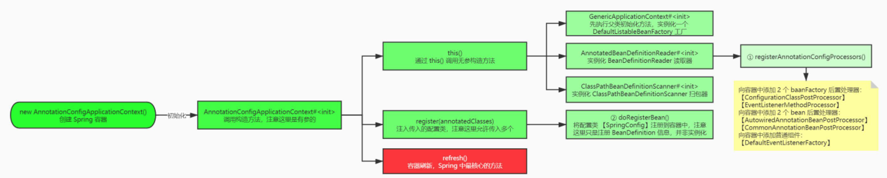
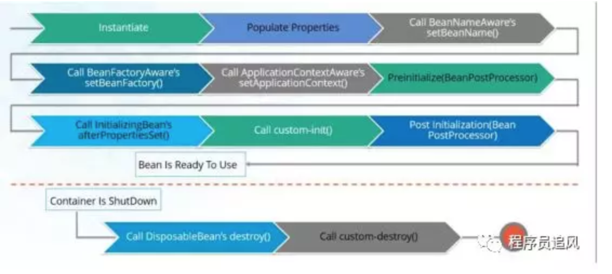
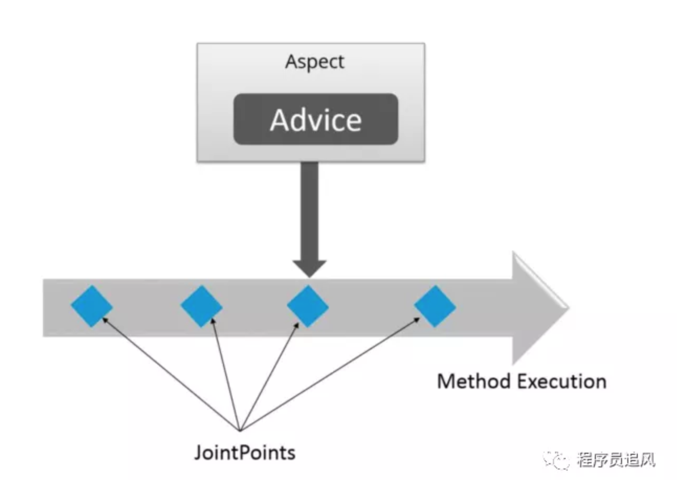
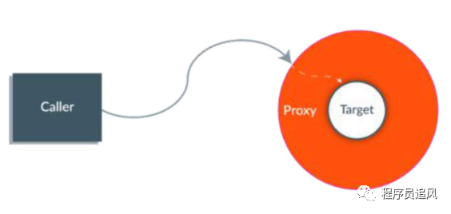
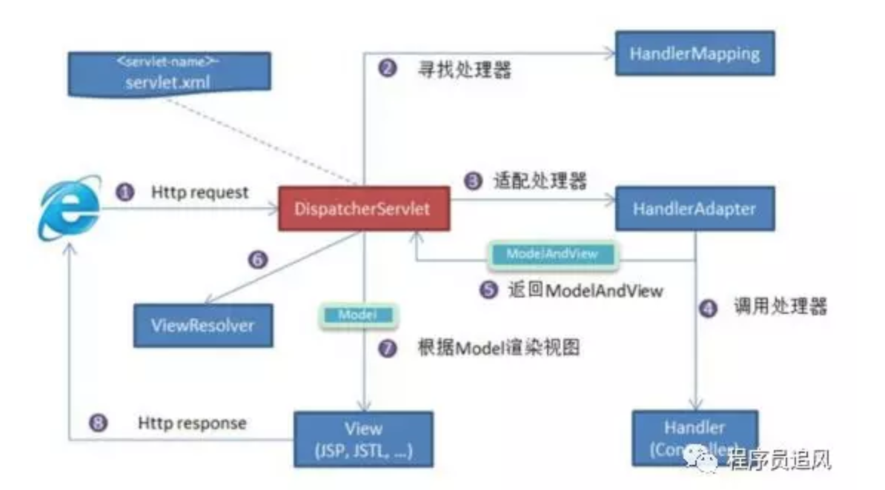
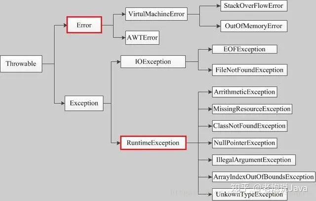
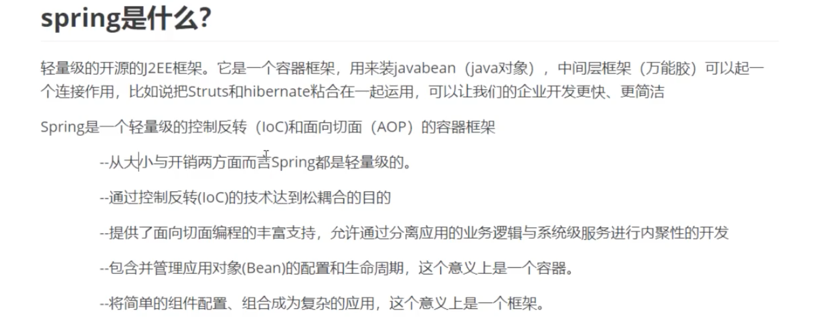

# Spring知识-benboerdong整理

### 1、Spring是什么?

Spring是一个轻量级的IoC和AOP容器框架。是为Java应用程序提供基础性服务的一套框架，目的是用于简化企业应用程序的开发，它使得开发者只需要关心业务需求。主要包括以下七个模块：

> Spring Context：提供框架式的Bean访问方式，以及企业级功能（JNDI、定时任务等）；
> Spring Core：核心类库，所有功能都依赖于该类库，提供IOC和DI服务；
> Spring AOP：AOP服务；
> Spring Web：提供了基本的面向Web的综合特性，提供对常见框架如Struts2的支持，Spring能够管理这些框架，将Spring的资源注入给框架，也能在这些框架的前后插入拦截器；
> Spring MVC：提供面向Web应用的Model-View-Controller，即MVC实现。
> Spring DAO：对JDBC的抽象封装，简化了数据访问异常的处理，并能统一管理JDBC事务；
> Spring ORM：对现有的ORM框架的支持；

下图对应的是Spring 4.x的版本，5.x版本中Web模块的Portlet组件已经被废弃


 

### 2、Spring 的优点？

（1）spring属于低侵入式设计，代码的污染极低；

（2）spring的DI机制将对象之间的依赖关系交由框架处理，减低组件的耦合性；

（3）Spring提供了AOP技术，支持将一些通用任务，如安全、事务、日志、权限等进行集中式管理，从而提供更好的复用。

（4）spring对于主流的应用框架提供了集成支持。

- 基于POJO的轻量级和最小侵入性编程；
- 通过依赖注入和面向接口实现松耦合；
- 基于切面和惯例进行声明式编程；
- 通过切面和模板减少样板式代码。

### 3、Spring的IoC理解：

（1）IOC就是控制反转，指创建对象的控制权转移给Spring框架进行管理，并由Spring根据配置文件去创建实例和管理各个实例之间的依赖关系，对象与对象之间松散耦合，也利于功能的复用。DI依赖注入，和控制反转是同一个概念的不同角度的描述，即 应用程序在运行时依赖IoC容器来动态注入对象需要的外部依赖。

（2）最直观的表达就是，以前创建对象的主动权和时机都是由自己把控的，IOC让对象的创建不用去new了，可以由spring自动生产，使用java的反射机制，根据配置文件在运行时动态的去创建对象以及管理对象，并调用对象的方法的。

（3）Spring的IOC有三种注入方式 ：构造器注入、setter方法注入、根据注解注入。

### 4、Spring的AOP理解：

OOP面向对象，允许开发者定义纵向的关系，但并不适用于定义横向的关系，会导致大量代码的重复，而不利于各个模块的重用。

AOP，一般称为面向切面，作为面向对象的一种补充，用于将那些与业务无关，但却对多个对象产生影响的公共行为和逻辑，抽取并封装为一个可重用的模块，这个模块被命名为“切面”（Aspect），减少系统中的重复代码，降低了模块间的耦合度，提高系统的可维护性。可用于`权限认证、日志、事务处理`。

AOP实现的关键在于 代理模式，AOP代理主要分为静态代理和动态代理。静态代理的代表为AspectJ；动态代理则以Spring AOP为代表。

（1）AspectJ是静态代理，也称为编译时增强，AOP框架会在编译阶段生成AOP代理类，并将AspectJ(切面)织入到Java字节码中，运行的时候就是增强之后的AOP对象。

（2）Spring AOP使用的动态代理，所谓的动态代理就是说AOP框架不会去修改字节码，而是每次运行时在内存中临时为方法生成一个AOP对象，这个AOP对象包含了目标对象的全部方法，并且在特定的切点做了增强处理，并回调原对象的方法。

#### Spring AOP中的动态代理主要有两种方式，`JDK动态代理和CGLIB动态代理`：

 ① JDK动态代理只提供接口的代理，不支持类的代理，要求被代理类实现接口。JDK动态代理的核心是InvocationHandler接口和Proxy类，在获取代理对象时，使用Proxy类来动态创建目标类的代理类（即最终真正的代理类，这个类继承自Proxy并实现了我们定义的接口），当代理对象调用真实对象的方法时， InvocationHandler 通过invoke()方法反射来调用目标类中的代码，动态地将横切逻辑和业务编织在一起；

InvocationHandler 的 invoke(Object  proxy,Method  method,Object[] args)：proxy是最终生成的代理对象;  method 是被代理目标实例的某个具体方法;  args 是被代理目标实例某个方法的具体入参, 在方法反射调用时使用。

② 如果被代理类没有实现接口，那么Spring AOP会选择使用CGLIB来动态代理目标类。CGLIB（Code Generation Library），是一个代码生成的类库，可以在运行时动态的生成指定类的一个子类对象，并覆盖其中特定方法并添加增强代码，从而实现AOP。CGLIB是通过继承的方式做的动态代理，因此如果某个类被标记为final，那么它是无法使用CGLIB做动态代理的。

（3）静态代理与动态代理区别在于生成AOP代理对象的时机不同，相对来说AspectJ的静态代理方式具有更好的性能，但是AspectJ需要特定的编译器进行处理，而Spring AOP则无需特定的编译器处理。

IoC让相互协作的组件保持松散的耦合，而AOP编程允许你把遍布于应用各层的功能分离出来形成可重用的功能组件。

### 5、Spring AOP里面的几个名词的概念：

（1）连接点（Join point）：指程序运行过程中所执行的方法。在Spring AOP中，一个连接点总代表一个方法的执行。 

（2）切面（Aspect）：被抽取出来的公共模块，可以用来会横切多个对象。Aspect切面可以看成 Pointcut切点 和 Advice通知 的结合，一个切面可以由多个切点和通知组成。

在Spring AOP中，切面可以在类上使用 @AspectJ 注解来实现。

（3）切点（Pointcut）：切点用于定义 要对哪些Join point进行拦截。

切点分为execution方式和annotation方式。execution方式可以用路径表达式指定对哪些方法拦截，比如指定拦截add*、search*。annotation方式可以指定被哪些注解修饰的代码进行拦截。

（4）通知（Advice）：指要在连接点（Join Point）上执行的动作，即增强的逻辑，比如权限校验和日志记录等。通知有各种类型，包括Around、Before、After、After returning、After throwing。

（5）目标对象（Target）：包含连接点的对象，也称作被通知（Advice）的对象。 由于Spring AOP是通过动态代理实现的，所以这个对象永远是一个代理对象。

（6）织入（Weaving）：通过动态代理，在目标对象（Target）的方法（即连接点Join point）中执行增强逻辑（Advice）的过程。

（7）引入（Introduction）：添加额外的方法或者字段到被通知的类。Spring允许引入新的接口（以及对应的实现）到任何被代理的对象。例如，你可以使用一个引入来使bean实现 IsModified 接口，以便简化缓存机制。

几个概念的关系图可以参考下图：


网上有张非常形象的图，描述了各个概念所处的场景和作用，贴在这里供大家理解：

 

### 6、Spring通知（Advice）有哪些类型？

（1）前置通知（Before Advice）：在连接点（Join point）之前执行的通知。

（2）后置通知（After Advice）：当连接点退出的时候执行的通知（不论是正常返回还是异常退出）。 

（3）环绕通知（Around Advice）：包围一个连接点的通知，这是最强大的一种通知类型。 环绕通知可以在方法调用前后完成自定义的行为。它也可以选择是否继续执行连接点或直接返回它们自己的返回值或抛出异常来结束执行。

（4）返回后通知（AfterReturning Advice）：在连接点正常完成后执行的通知（如果连接点抛出异常，则不执行）

（5）抛出异常后通知（AfterThrowing advice）：在方法抛出异常退出时执行的通知


>同一个Aspect，不同advice的执行顺序：
>
>（1）没有异常情况下的执行顺序：
>
>around before advice 
>
>before advice 
>
>target method 执行 
>
>around after  advice 
>
>after advice 
>
>afterReturning 
>
>（2）有异常情况下的执行顺序：
>
>around before advice 
>
>before advice 
>
>target method 执行 
>
>around after advice 
>
>after advice 
>
>afterThrowing 
>
>java.lang.RuntimeException: 异常发生

### 7、Spring容器的启动流程：



详细内容可以阅读这篇文章：https://blog.csdn.net/a745233700/article/details/113761271

（1）初始化Spring容器，注册内置的BeanPostProcessor的BeanDefinition到容器中：

>① 实例化BeanFactory【DefaultListableBeanFactory】工厂，用于生成Bean对象
>② 实例化BeanDefinitionReader注解配置读取器，用于对特定注解（如@Service、@Repository）的类进行读取转化成  BeanDefinition 对象，（BeanDefinition 是 Spring 中极其重要的一个概念，它存储了 bean 对象的所有特征信息，如是否单例，是否懒加载，factoryBeanName 等）
>③ 实例化ClassPathBeanDefinitionScanner路径扫描器，用于对指定的包目录进行扫描查找 bean 对象

（2）将配置类的BeanDefinition注册到容器中：

（3）调用refresh()方法刷新容器：

>① prepareRefresh()刷新前的预处理：
>② obtainFreshBeanFactory()：获取在容器初始化时创建的BeanFactory：
>③ prepareBeanFactory(beanFactory)：BeanFactory的预处理工作，向容器中添加一些组件：
>④ postProcessBeanFactory(beanFactory)：子类重写该方法，可以实现在BeanFactory创建并预处理完成以后做进一步的设置
>⑤ invokeBeanFactoryPostProcessors(beanFactory)：在BeanFactory标准初始化之后执行BeanFactoryPostProcessor的方法，即BeanFactory的后置处理器：
>⑥ registerBeanPostProcessors(beanFactory)：向容器中注册Bean的后置处理器BeanPostProcessor，它的主要作用是干预Spring初始化bean的流程，从而完成代理、自动注入、循环依赖等功能
>⑦ initMessageSource()：初始化MessageSource组件，主要用于做国际化功能，消息绑定与消息解析：
>⑧ initApplicationEventMulticaster()：初始化事件派发器，在注册监听器时会用到：
>⑨ onRefresh()：留给子容器、子类重写这个方法，在容器刷新的时候可以自定义逻辑
>⑩ registerListeners()：注册监听器：将容器中所有的ApplicationListener注册到事件派发器中，并派发之前步骤产生的事件：
>⑪  finishBeanFactoryInitialization(beanFactory)：初始化所有剩下的单实例bean，核心方法是preInstantiateSingletons()，会调用getBean()方法创建对象；
>⑫ finishRefresh()：发布BeanFactory容器刷新完成事件：

### 8、BeanFactory和ApplicationContext有什么区别？

*  BeanFactory和ApplicationContext是Spring的两大核心接口，都可以当做Spring的容器。

（1）BeanFactory是Spring里面最底层的接口，是IoC的核心，定义了IoC的基本功能，包含了各种Bean的定义、加载、实例化，依赖注入和生命周期管理。ApplicationContext接口作为BeanFactory的子类，除了提供 BeanFactory所具有的功能外，还提供了更完整的框架功能：

* 继承MessageSource，因此支持国际化。
* 资源文件访问，如URL和文件（ResourceLoader）。
* 载入多个（有继承关系）上下文（即同时加载多个配置文件） ，使得每一个上下文都专注于一个特定的层次，比如应用的web层。
* 提供在监听器中注册bean的事件。

（2）①BeanFactroy采用的是延迟加载形式来注入Bean的，只有在使用到某个Bean时(调用getBean())，才对该Bean进行加载实例化。这样，我们就不能提前发现一些存在的Spring的配置问题。如果Bean的某一个属性没有注入，BeanFacotry加载后，直至第一次使用调用getBean方法才会抛出异常。

②ApplicationContext，它是在容器启动时，一次性创建了所有的Bean。这样，在容器启动时，我们就可以发现Spring中存在的配置错误，这样有利于检查所依赖属性是否注入。 

 ③ApplicationContext启动后预载入所有的单实例Bean，所以在运行的时候速度比较快，因为它们已经创建好了。相对于BeanFactory，ApplicationContext 唯一的不足是占用内存空间，当应用程序配置Bean较多时，程序启动较慢。

（3）BeanFactory和ApplicationContext都支持BeanPostProcessor、BeanFactoryPostProcessor的使用，但两者之间的区别是：BeanFactory需要手动注册，而ApplicationContext则是自动注册。

（4）BeanFactory通常以编程的方式被创建，ApplicationContext还能以声明的方式创建，如使用ContextLoader。

 

### 9、Spring Bean的生命周期？

简单来说，Spring Bean的生命周期只有四个阶段：实例化 Instantiation --> 属性赋值 Populate  --> 初始化 Initialization  --> 销毁 Destruction

但具体来说，Spring Bean的生命周期包含下图的流程：


（1）实例化Bean：

对于BeanFactory容器，当客户向容器请求一个尚未初始化的bean时，或初始化bean的时候需要注入另一个尚未初始化的依赖时，容器就会调用createBean进行实例化。

对于ApplicationContext容器，当容器启动结束后，通过获取BeanDefinition对象中的信息，实例化所有的bean。

（2）设置对象属性（依赖注入）：实例化后的对象被封装在BeanWrapper对象中，紧接着，Spring根据BeanDefinition中的信息 以及 通过BeanWrapper提供的设置属性的接口完成属性设置与依赖注入。

（3）处理Aware接口：Spring会检测该对象是否实现了xxxAware接口，通过Aware类型的接口，可以让我们拿到Spring容器的一些资源：

①如果这个Bean实现了BeanNameAware接口，会调用它实现的setBeanName(String beanId)方法，传入Bean的名字；
②如果这个Bean实现了BeanClassLoaderAware接口，调用setBeanClassLoader()方法，传入ClassLoader对象的实例。
②如果这个Bean实现了BeanFactoryAware接口，会调用它实现的setBeanFactory()方法，传递的是Spring工厂自身。
③如果这个Bean实现了ApplicationContextAware接口，会调用setApplicationContext(ApplicationContext)方法，传入Spring上下文；
（4）BeanPostProcessor前置处理：如果想对Bean进行一些自定义的前置处理，那么可以让Bean实现了BeanPostProcessor接口，那将会调用postProcessBeforeInitialization(Object obj, String s)方法。

（5）InitializingBean：如果Bean实现了InitializingBean接口，执行afeterPropertiesSet()方法。

（6）init-method：如果Bean在Spring配置文件中配置了 init-method 属性，则会自动调用其配置的初始化方法。

（7）BeanPostProcessor后置处理：如果这个Bean实现了BeanPostProcessor接口，将会调用postProcessAfterInitialization(Object obj, String s)方法；由于这个方法是在Bean初始化结束时调用的，所以可以被应用于内存或缓存技术；

以上几个步骤完成后，Bean就已经被正确创建了，之后就可以使用这个Bean了。

（8）DisposableBean：当Bean不再需要时，会经过清理阶段，如果Bean实现了DisposableBean这个接口，会调用其实现的destroy()方法；

（9）destroy-method：最后，如果这个Bean的Spring配置中配置了destroy-method属性，会自动调用其配置的销毁方法。

如果对bean详细加载流程的感兴趣的读者，可以阅读这篇文章：https://blog.csdn.net/a745233700/article/details/113840727

 

### 10、 Spring中bean的作用域：

（1）singleton：默认作用域，单例bean，每个容器中只有一个bean的实例。

（2）prototype：为每一个bean请求创建一个实例。

（3）request：为每一个request请求创建一个实例，在请求完成以后，bean会失效并被垃圾回收器回收。

（4）session：与request范围类似，同一个session会话共享一个实例，不同会话使用不同的实例。

（5）global-session：全局作用域，所有会话共享一个实例。如果想要声明让所有会话共享的存储变量的话，那么这全局变量需要存储在global-session中。

 

### 11、Spring框架中的Bean是线程安全的么？如果线程不安全，那么如何处理？

Spring容器本身并没有提供Bean的线程安全策略，因此可以说Spring容器中的Bean本身不具备线程安全的特性，但是具体情况还是要结合Bean的作用域来讨论。

（1）对于prototype作用域的Bean，每次都创建一个新对象，也就是线程之间不存在Bean共享，因此不会有线程安全问题。

（2）对于singleton作用域的Bean，所有的线程都共享一个单例实例的Bean，因此是存在线程安全问题的。但是如果单例Bean是一个无状态Bean，也就是线程中的操作不会对Bean的成员执行查询以外的操作，那么这个单例Bean是线程安全的。比如Controller类、Service类和Dao等，这些Bean大多是无状态的，只关注于方法本身。

有状态Bean(Stateful Bean) ：就是有实例变量的对象，可以保存数据，是非线程安全的。

无状态Bean(Stateless Bean)：就是没有实例变量的对象，不能保存数据，是不变类，是线程安全的。

对于有状态的bean（比如Model和View），就需要自行保证线程安全，最浅显的解决办法就是将有状态的bean的作用域由“singleton”改为“prototype”。

也可以采用ThreadLocal解决线程安全问题，为每个线程提供一个独立的变量副本，不同线程只操作自己线程的副本变量。

ThreadLocal和线程同步机制都是为了解决多线程中相同变量的访问冲突问题。同步机制采用了“时间换空间”的方式，仅提供一份变量，不同的线程在访问前需要获取锁，没获得锁的线程则需要排队。而ThreadLocal采用了“空间换时间”的方式。ThreadLocal会为每一个线程提供一个独立的变量副本，从而隔离了多个线程对数据的访问冲突。因为每一个线程都拥有自己的变量副本，从而也就没有必要对该变量进行同步了。

 

### 12、Spring基于xml注入bean的几种方式：

set()方法注入；
构造器注入：①通过index设置参数的位置；②通过type设置参数类型；
静态工厂注入；
实例工厂；
详细内容请参考这篇文章：[Spring中bean的注入方式](https://blog.csdn.net/a745233700/article/details/89307518)

 

### 13、Spring如何解决循环依赖问题：

详细内容强烈建议参考这篇文章：[Spring如何解决循环依赖问题](https://blog.csdn.net/a745233700/article/details/110914620)

循环依赖问题在Spring中主要有三种情况：

（1）通过构造方法进行依赖注入时产生的循环依赖问题。

（2）通过setter方法进行依赖注入且是在多例（原型）模式下产生的循环依赖问题。

（3）通过setter方法进行依赖注入且是在单例模式下产生的循环依赖问题。
在Spring中，只有第（3）种方式的循环依赖问题被解决了，其他两种方式在遇到循环依赖问题时都会产生异常。这是因为：

第一种构造方法注入的情况下，在new对象的时候就会堵塞住了，其实也就是”先有鸡还是先有蛋“的历史难题。

第二种setter方法（多例）的情况下，每一次getBean()时，都会产生一个新的Bean，如此反复下去就会有无穷无尽的Bean产生了，最终就会导致OOM问题的出现。

Spring在单例模式下的setter方法依赖注入引起的循环依赖问题，主要是通过二级缓存和三级缓存来解决的，其中三级缓存是主要功臣。解决的核心原理就是：`在对象实例化之后，依赖注入之前，Spring提前暴露的Bean实例的引用在第三级缓存中进行存储。`

### 14、Spring的自动装配：

在spring中，使用autowire来配置自动装载模式，对象无需自己查找或创建与其关联的其他对象，由容器负责把需要相互协作的对象引用赋予各个对象。

#### （1）在Spring框架xml配置中共有5种自动装配：

>no：默认的方式是不进行自动装配的，通过手工设置ref属性来进行装配bean。
>byName：通过bean的名称进行自动装配，如果一个bean的 property 与另一bean 的name 相同，就进行自动装配。 
>byType：通过参数的数据类型进行自动装配。
>constructor：利用构造函数进行装配，并且构造函数的参数通过byType进行装配。
>autodetect：自动探测，如果有构造方法，通过 construct的方式自动装配，否则使用 byType的方式自动装配。

#### （2）基于注解的自动装配方式：

使用@Autowired、@Resource注解来自动装配指定的bean。在使用@Autowired注解之前需要在Spring配置文件进行配置，<context:annotation-config />。在启动spring IoC时，容器自动装载了一个AutowiredAnnotationBeanPostProcessor后置处理器，当容器扫描到@Autowied、@Resource或@Inject时，就会在IoC容器自动查找需要的bean，并装配给该对象的属性。在使用@Autowired时，首先在容器中查询对应类型的bean：

如果查询结果刚好为一个，就将该bean装配给@Autowired指定的数据；

如果查询的结果不止一个，那么@Autowired会根据名称来查找；

如果上述查找的结果为空，那么会抛出异常。解决方法时，使用required=false。

@Autowired可用于：构造函数、成员变量、Setter方法

注：@Autowired和@Resource之间的区别：

* (1) @Autowired默认是按照类型装配注入的，默认情况下它要求依赖对象必须存在（可以设置它required属性为false）。

* (2) @Resource默认是按照名称来装配注入的，只有当找不到与名称匹配的bean才会按照类型来装配注入。

### 15、Spring事务的实现方式和实现原理：

Spring事务的本质其实就是数据库对事务的支持，没有数据库的事务支持，spring是无法提供事务功能的。Spring只提供统一事务管理接口，具体实现都是由各数据库自己实现，数据库事务的提交和回滚是通过binlog或者undo log实现的。Spring会在事务开始时，根据当前环境中设置的隔离级别，调整数据库隔离级别，由此保持一致。

#### （1）Spring事务的种类：

spring支持编程式事务管理和声明式事务管理两种方式：

①编程式事务管理使用TransactionTemplate。

②声明式事务管理建立在AOP之上的。其本质是通过AOP功能，对方法前后进行拦截，将事务处理的功能编织到拦截的方法中，也就是在目标方法开始之前启动一个事务，在执行完目标方法之后根据执行情况提交或者回滚事务。

声明式事务最大的优点就是不需要在业务逻辑代码中掺杂事务管理的代码，只需在配置文件中做相关的事务规则声明或通过@Transactional注解的方式，便可以将事务规则应用到业务逻辑中，减少业务代码的污染。唯一不足地方是，最细粒度只能作用到方法级别，无法做到像编程式事务那样可以作用到代码块级别。

#### （2）spring的事务传播机制：

spring事务的传播机制说的是，当多个事务同时存在的时候，spring如何处理这些事务的行为。事务传播机制实际上是使用简单的ThreadLocal实现的，所以，如果调用的方法是在新线程调用的，事务传播实际上是会失效的。

>① PROPAGATION_REQUIRED：（默认传播行为）如果当前没有事务，就创建一个新事务；如果当前存在事务，就加入该事务。
>
>② PROPAGATION_REQUIRES_NEW：无论当前存不存在事务，都创建新事务进行执行。
>
>③ PROPAGATION_SUPPORTS：如果当前存在事务，就加入该事务；如果当前不存在事务，就以非事务执行。‘
>
>④ PROPAGATION_NOT_SUPPORTED：以非事务方式执行操作，如果当前存在事务，就把当前事务挂起。
>
>⑤ PROPAGATION_NESTED：如果当前存在事务，则在嵌套事务内执行；如果当前没有事务，则按REQUIRED属性执行。
>
>⑥ PROPAGATION_MANDATORY：如果当前存在事务，就加入该事务；如果当前不存在事务，就抛出异常。
>
>⑦ PROPAGATION_NEVER：以非事务方式执行，如果当前存在事务，则抛出异常。

#### （3）Spring中的隔离级别：

>① ISOLATION_DEFAULT：这是个 PlatfromTransactionManager 默认的隔离级别，使用数据库默认的事务隔离级别。
>
>② ISOLATION_READ_UNCOMMITTED：读未提交，允许事务在执行过程中，读取其他事务未提交的数据。
>
>③ ISOLATION_READ_COMMITTED：读已提交，允许事务在执行过程中，读取其他事务已经提交的数据。
>
>④ ISOLATION_REPEATABLE_READ：可重复读，在同一个事务内，任意时刻的查询结果都是一致的。
>
>⑤ ISOLATION_SERIALIZABLE：所有事务逐个依次执行。

### 16、Spring 框架中都用到了哪些设计模式？

Spring设计模式的详细使用案例可以阅读这篇文章：https://blog.csdn.net/a745233700/article/details/112598471

（1）工厂模式：Spring使用工厂模式，通过BeanFactory和ApplicationContext来创建对象

（2）单例模式：Bean默认为单例模式

（3）策略模式：例如Resource的实现类，针对不同的资源文件，实现了不同方式的资源获取策略

（4）代理模式：Spring的AOP功能用到了JDK的动态代理和CGLIB字节码生成技术

（5）模板方法：可以将相同部分的代码放在父类中，而将不同的代码放入不同的子类中，用来解决代码重复的问题。比如RestTemplate, JmsTemplate, JpaTemplate

（6）适配器模式：Spring AOP的增强或通知（Advice）使用到了适配器模式，Spring MVC中也是用到了适配器模式适配Controller

（7）观察者模式：Spring事件驱动模型就是观察者模式的一个经典应用。

（8）桥接模式：可以根据客户的需求能够动态切换不同的数据源。比如我们的项目需要连接多个数据库，客户在每次访问中根据需要会去访问不同的数据库 

### 17、Spring框架中有哪些不同类型的事件？

Spring 提供了以下5种标准的事件：

（1）上下文更新事件（ContextRefreshedEvent）：在调用ConfigurableApplicationContext 接口中的refresh()方法时被触发。

（2）上下文开始事件（ContextStartedEvent）：当容器调用ConfigurableApplicationContext的Start()方法开始/重新开始容器时触发该事件。

（3）上下文停止事件（ContextStoppedEvent）：当容器调用ConfigurableApplicationContext的Stop()方法停止容器时触发该事件。

（4）上下文关闭事件（ContextClosedEvent）：当ApplicationContext被关闭时触发该事件。容器被关闭时，其管理的所有单例Bean都被销毁。

（5）请求处理事件（RequestHandledEvent）：在Web应用中，当一个http请求（request）结束触发该事件。

如果一个bean实现了ApplicationListener接口，当一个ApplicationEvent 被发布以后，bean会自动被通知。


##  1、不同版本的 Spring Framework 有哪些主要功能？


## 2、什么是 Spring Framework？

Spring 是一个开源应用框架，旨在降低应用程序开发的复杂度。它是轻量级、松散耦合的。它具有分层体系结构，允许用户选择组件，同时还为 J2EE 应用程序开发提供了一个有凝聚力的框架。它可以集成其他框架，如 Structs、Hibernate、EJB 等，所以又称为框架的框架。

## 3、列举 Spring Framework 的优点。

由于 Spring Frameworks 的分层架构，用户可以自由选择自己需要的组件。Spring Framework 支持 POJO(Plain Old Java Object) 编程，从而具备持续集成和可测试性。由于依赖注入和控制反转，JDBC 得以简化。它是开源免费的。

## 4、Spring Framework 有哪些不同的功能？

轻量级 - Spring 在代码量和透明度方面都很轻便。IOC - 控制反转 AOP - 面向切面编程可以将应用业务逻辑和系统服务分离，以实现高内聚。容器 - Spring 负责创建和管理对象（Bean）的生命周期和配置。MVC - 对 web 应用提供了高度可配置性，其他框架的集成也十分方便。事务管理 - 提供了用于事务管理的通用抽象层。Spring 的事务支持也可用于容器较少的环境。JDBC 异常 - Spring的 JDBC 抽象层提供了一个异常层次结构，简化了错误处理策略。

## 5、Spring Framework 中有多少个模块，它们分别是什么？


**Spring 核心容器 – 该层基本上是 Spring Framework 的核心。它包含以下模块：

**· Spring Core
· Spring Bean
· SpEL (Spring Expression Language)
· Spring Context

**数据访问/集成 – 该层提供与数据库交互的支持。它包含以下模块：

**· JDBC (Java DataBase Connectivity)
· ORM (Object Relational Mapping)
· OXM (Object XML Mappers)
· JMS (Java Messaging Service)
· Transaction

**Web – 该层提供了创建 Web 应用程序的支持。它包含以下模块：

**· Web
· Web – Servlet
· Web – Socket
· Web – Portlet

**AOP

**· 该层支持面向切面编程

**Instrumentation

**· 该层为类检测和类加载器实现提供支持。

**Test

**· 该层为使用 JUnit 和 TestNG 进行测试提供支持。

**几个杂项模块:

**Messaging – 该模块为 STOMP 提供支持。它还支持注解编程模型，该模型用于从WebSocket 客户端路由和处理 STOMP 消息。
 Aspects – 该模块为与 AspectJ 的集成提供支持。

## 6、什么是 Spring 配置文件？

Spring 配置文件是 XML 文件。该文件主要包含类信息。它描述了这些类是如何配置以及相互引入的。但是，XML 配置文件冗长且更加干净。如果没有正确规划和编写，那么在大项目中管理变得非常困难。

## 7、Spring 应用程序有哪些不同组件？

Spring 应用一般有以下组件：
· 接口 - 定义功能。
· Bean 类 - 它包含属性，setter 和 getter 方法，函数等。
· Spring 面向切面编程（AOP） - 提供面向切面编程的功能。
 · Bean 配置文件 - 包含类的信息以及如何配置它们。
 · 用户程序 - 它使用接口。

## 8、使用 Spring 有哪些方式？

使用 Spring 有以下方式：
· 作为一个成熟的 Spring Web 应用程序。
· 作为第三方 Web 框架，使用 Spring Frameworks 中间层。
· 用于远程使用。
· 作为企业级 Java Bean，它可以包装现有的 POJO（Plain Old JavaObjects）。

## 9、什么是 Spring IOC 容器？

Spring 框架的核心是 Spring 容器。容器创建对象，将它们装配在一起，配置它们并管理它们的完整生命周期。Spring 容器使用依赖注入来管理组成应用程序的组件。容器通过读取提供的配置元数据来接收对象进行实例化，配置和组装的指令。该元数据可以通过 XML，Java 注解或 Java 代码提供。


## 10、什么是依赖注入？

在依赖注入中，您不必创建对象，但必须描述如何创建它们。您不是直接在代码 中将组件和服务连接在一起，而是描述配置文件中哪些组件需要哪些服务。由 IoC 容器将它们装配在一起。

## 11、可以通过多少种方式完成依赖注入？

通常，依赖注入可以通过三种方式完成，即：
· 构造函数注入
· setter 注入
· 接口注入 在 Spring Framework 中，仅使用构造函数和 setter 注入。

## 12、区分构造函数注入和 setter 注入。


## 13、spring 中有多少种 IOC 容器？

BeanFactory - BeanFactory 就像一个包含 bean 集合的工厂类。它会在客户端要求时实例化 bean。ApplicationContext - ApplicationContext 接口扩展了 BeanFactory 接口。它在 BeanFactory 基础上提供了一些额外的功能。

## 14、区分 BeanFactory 和 ApplicationContext。


## 15、列举 IoC 的一些好处。

IoC 的一些好处是：
· 它将最小化应用程序中的代码量。
· 它将使您的应用程序易于测试，因为它不需要单元测试用例中的任何单例或 JNDI 查找机制。
· 它以最小的影响和最少的侵入机制促进松耦合。
· 它支持即时的实例化和延迟加载服务。

## 16、Spring IoC 的实现机制。

Spring 中的 IoC 的实现原理就是工厂模式加反射机制。示例：

```java
interface Fruit {
	public abstract void eat();}class Apple implements Fruit {
	public void eat(){
		System.out.println("Apple");
	}}class Orange implements Fruit {
	public void eat(){
		System.out.println("Orange");
	}}class Factory {
	public static Fruit getInstance(String ClassName) {
		Fruit f=null;
		try {
			f=(Fruit)Class.forName(ClassName).newInstance();
		}
		catch (Exception e) {
			e.printStackTrace();
		}
		return f;
	}}class Client {
	public static void main(String[] a) {
		Fruit f=Factory.getInstance("io.github.dunwu.spring.Apple");
		if(f!=null){
			f.eat();
		}
	}}
```

## 17、什么是 spring bean？

· 它们是构成用户应用程序主干的对象。
· Bean 由 Spring IoC 容器管理。
· 它们由 Spring IoC 容器实例化，配置，装配和管理。
· Bean 是基于用户提供给容器的配置元数据创建。

## 18、spring 提供了哪些配置方式？

基于 xml 配置 bean 所需的依赖项和服务在 XML 格式的配置文件中指定。这些配置文件通常包含许多 bean 定义和特定于应用程序的配置选项。它们通常以 bean 标签开头。例如：

```xml
<bean id="studentbean" class="org.edureka.firstSpring.StudentBean">
  <property name="name" value="Edureka"></property>
</bean>
```

基于注解配置 您可以通过在相关的类，方法或字段声明上使用注解，将 bean 配置为组件类本身，而不是使用 XML 来描述 bean 装配。默认情况下，Spring 容器中未打开注解装配。因此，您需要在使用它之前在 Spring 配置文件中启用它。例如：

```
<beans><context:annotation-config/><!-- bean definitions go here --></beans>
```

基于 Java API 配置

Spring 的 Java 配置是通过使用 @Bean 和 @Configuration 来实现。
（1） @Bean 注解扮演与 <bean/> 元素相同的角色。
（2） @Configuration 类允许通过简单地调用同一个类中的其他 @Bean 方法来定义 bean 间依赖关系。例如：

```
@Configurationpublic class StudentConfig {
	@Bean
	public StudentBean myStudent() {
		return new StudentBean();
	}}
```

## 19、spring 支持集中 bean scope？

Spring bean 支持 5 种 scope：
Singleton - 每个 Spring IoC 容器仅有一个单实例。Prototype - 每次请求都会产生一个新的实例。
Request - 每一次 HTTP 请求都会产生一个新的实例，并且该 bean 仅在当前 HTTP 请求内有效。
Session - 每一次 HTTP 请求都会产生一个新的 bean，同时该 bean 仅在当前 HTTP session 内有效。
Global-session - 类似于标准的 HTTP Session 作用域，不过它仅仅在基于portlet 的 web 应用中才有意义。Portlet 规范定义了全局 Session 的概念，它被所有构成某个 portlet web 应用的各种不同的 portlet 所共享。在 globalsession 作用域中定义的 bean 被限定于全局 portlet Session 的生命周期范围内。如果你在 web 中使用 global session 作用域来标识 bean，那么 web会自动当成 session 类型来使用。仅当用户使用支持 Web 的 ApplicationContext 时，最后三个才可用。

## 20、spring bean 容器的生命周期是什么样的？

spring bean 容器的生命周期流程如下：
（1）Spring 容器根据配置中的 bean 定义中实例化 bean。
（2）Spring 使用依赖注入填充所有属性，如 bean 中所定义的配置。
（3）如果 bean 实现BeanNameAware 接口，则工厂通过传递 bean 的 ID 来调用setBeanName()。
（4）如果 bean 实现 BeanFactoryAware 接口，工厂通过传递自身的实例来调用 setBeanFactory()。
（5）如果存在与 bean 关联的任何BeanPostProcessors，则调用preProcessBeforeInitialization() 方法。
（6）如果为 bean 指定了 init 方法（ <bean> 的 init-method 属性），那么将调 用它。
（7）最后，如果存在与 bean 关联的任何 BeanPostProcessors，则将调用 postProcessAfterInitialization() 方法。
（8）如果 bean 实现DisposableBean 接口，当 spring 容器关闭时，会调用 destory()。
（9）如果为bean 指定了 destroy 方法（ <bean> 的 destroy-method 属性），那么将 调用它。



## 21、什么是 spring 的内部 bean？

只有将 bean 用作另一个 bean 的属性时，才能将 bean 声明为内部 bean。为了定义 bean，Spring 的基于 XML 的配置元数据在 <property> 或<constructor-arg> 中提供了 <bean> 元素的使用。内部 bean 总是匿名的，它们总是作为原型。例如，假设我们有一个 Student 类，其中引用了 Person 类。这里我们将只创建一个 Person 类实例并在 Student 中使用它。
Student.java

```
public class Student {
	private Person person;
	//Setters and Getters}public class Person {
	private String name;
	private String address;
	//Setters and Getters}
```

bean.xml

```
<bean id=“StudentBean" class="com.edureka.Student"><property name="person"><!--This is inner bean --><bean class="com.edureka.Person"><property name="name" value=“Scott"></property><property name="address" value=
“Bangalore"></property></bean></property></bean>
```

## 22、什么是 spring 装配

当 bean 在 Spring 容器中组合在一起时，它被称为装配或 bean 装配。Spring容器需要知道需要什么 bean 以及容器应该如何使用依赖注入来将 bean 绑定在一起，同时装配 bean。

## 23、自动装配有哪些方式？

Spring 容器能够自动装配 bean。也就是说，可以通过检查 BeanFactory 的内容让 Spring 自动解析 bean 的协作者。

**自动装配的不同模式：

**no - 这是默认设置，表示没有自动装配。应使用显式 bean 引用进行装配。
byName - 它根据 bean 的名称注入对象依赖项。它匹配并装配其属性与 XML文件中由相同名称定义的 bean。
byType - 它根据类型注入对象依赖项。如果属性的类型与 XML 文件中的一个 bean 名称匹配，则匹配并装配属性。构造函数- 它通过调用类的构造函数来注入依赖项。它有大量的参数。
autodetect - 首先容器尝试通过构造函数使用 autowire 装配，如果不能，则尝试通过 byType 自动装配。

## 24、自动装配有什么局限？

覆盖的可能性 - 您始终可以使用 <constructor-arg> 和 <property> 设置指定依赖项，这将覆盖自动装配。
基本元数据类型 - 简单属性（如原数据类型，字符串和类）无法自动装配。
令人困惑的性质 - 总是喜欢使用明确的装配，因为自动装配不太精确。

## 25、什么是基于注解的容器配置

不使用 XML 来描述 bean 装配，开发人员通过在相关的类，方法或字段声明上使用注解将配置移动到组件类本身。它可以作为 XML 设置的替代方案。例如：Spring 的 Java 配置是通过使用 @Bean 和 @Configuration 来实现。@Bean 注解扮演与 元素相同的角色。@Configuration 类允许通过简单地调用同一个类中的其他 @Bean 方法来定义 bean 间依赖关系。例如：

```
@Configurationpublic class StudentConfig {
	@Bean
	public StudentBean myStudent() {
		return new StudentBean();
	}}
```

## 26、如何在 spring 中启动注解装配？

默认情况下，Spring 容器中未打开注解装配。因此，要使用基于注解装配，我们必须通过配置 <context：annotation-config/> 元素在 Spring 配置文件中启用它。

## 27、@Component, @Controller, @Repository,@Service  有何区别？

@Component ：这将 java 类标记为 bean。它是任何 Spring 管理组件的通用构造型。spring 的组件扫描机制现在可以将其拾取并将其拉入应用程序环境中。

@Controller ：这将一个类标记为 Spring Web MVC 控制器。标有它的Bean 会自动导入到 IoC 容器中。@Service ：此注解是组件注解的特化。它不会对

@Component 注解提供任何其他行为。您可以在服务层类中使用

@Service 而不是 @Component，因为它以更好的方式指定了意图。

@Repository ：这个注解是具有类似用途和功能的 @Component 注解的特化。它为 DAO 提供了额外的好处。它将 DAO 导入 IoC 容器，并使未经检查的异常有资格转换为 Spring DataAccessException。

## 28、@Required  注解有什么用？

@Required 应用于 bean 属性 setter 方法。此注解仅指示必须在配置时使用bean 定义中的显式属性值或使用自动装配填充受影响的 bean 属性。如果尚未填充受影响的 bean 属性，则容器将抛出 BeanInitializationException。示例：

```
public class Employee {
	private String name;
	@Required
	public void setName(String name){
		this.name=name;
	}
	public string getName(){
		return name;
	}}
```

## 29、@Autowired  注解有什么用？

@Autowired 可以更准确地控制应该在何处以及如何进行自动装配。此注解用于在 setter 方法，构造函数，具有任意名称或多个参数的属性或方法上自动装配bean。默认情况下，它是类型驱动的注入。

```
public class Employee {
	private String name;
	@Autowired
	public void setName(String name) {
		this.name=name;
	}
	public string getName(){
		return name;
	}}
```

## 30、@Qualifier  注解有什么用？

当您创建多个相同类型的 bean 并希望仅使用属性装配其中一个 bean 时，您可以使用@Qualifier 注解和 @Autowired 通过指定应该装配哪个确切的 bean来消除歧义。例如，这里我们分别有两个类，Employee 和 EmpAccount。在 EmpAccount中，使用@Qualifier 指定了必须装配 id 为 emp1 的 bean。

Employee.java

```
public class Employee {
	private String name;
	@Autowired
	public void setName(String name) {
		this.name=name;
	}
	public string getName() {
		return name;
	}}
```

EmpAccount.java

```
public class EmpAccount {
	private Employee emp;
	@Autowired
	@Qualifier(emp1)
	public void showName() {
		System.out.println(“Employee name : ”+emp.getName);
	}}
```

## 31、@RequestMapping 注解有什么用？

@RequestMapping 注解用于将特定 HTTP 请求方法映射到将处理相应请求的控制器中的特定类/方法。此注释可应用于两个级别：类级别：映射请求的 URL 方法级别：映射 URL 以及 HTTP 请求方法

## 32、spring DAO 有什么用？

Spring DAO 使得 JDBC，Hibernate 或 JDO 这样的数据访问技术更容易以一种统一的方式工作。这使得用户容易在持久性技术之间切换。它还允许您在编写代码时，无需考虑捕获每种技术不同的异常。

## 33、列举 Spring DAO 抛出的异常。


## 34、spring JDBC API 中存在哪些类？

· JdbcTemplate
· SimpleJdbcTemplate
· NamedParameterJdbcTemplate
· SimpleJdbcInsert
· SimpleJdbcCall

## 35、使用 Spring 访问 Hibernate 的方法有哪些？

我们可以通过两种方式使用 Spring 访问 Hibernate：
(1)使用 Hibernate 模板和回调进行控制反转
(2) 扩展 HibernateDAOSupport 并应用 AOP 拦截器节点

## 36、列举 spring 支持的事务管理类型

Spring 支持两种类型的事务管理：
 (1)程序化事务管理：在此过程中，在编程的帮助下管理事务。它为您提供极大的灵活性，但维护起来非常困难。
(2) 声明式事务管理：在此，事务管理与业务代码分离。仅使用注解或基于 XML的配置来管理事务。

## 37、spring 支持哪些 ORM 框架

· Hibernate
· iBatis
· JPA
· JDO
· OJB

## 38、什么是 AOP？

AOP(Aspect-Oriented Programming), 即 面向切面编程, 它与OOP( Object-Oriented Programming, 面向对象编程) 相辅相成, 提供了与OOP 不同的抽象软件结构的视角. 在 OOP 中, 我们以类(class)作为我们的基本单元, 而 AOP 中的基本单元是 Aspect(切面)

## 39、什么是 Aspect？

aspect 由 pointcount 和 advice 组成, 它既包含了横切逻辑的定义, 也包括了连接点的定义. Spring AOP 就是负责实施切面的框架, 它将切面所定义的横切逻辑编织到切面所指定的连接点中. AOP 的工作重心在于如何将增强编织目标对象的连接点上, 这里包含两个工作: (1)如何通过 pointcut 和 advice 定位到特定的 joinpoint 上 (2)如何在advice 中编写切面代码.



可以简单地认为, 使用 @Aspect 注解的类就是切面.

## 40、什么是切点（JoinPoint）

程序运行中的一些时间点, 例如一个方法的执行, 或者是一个异常的处理.在 Spring AOP 中, join point 总是方法的执行点。

## 41、什么是通知（Advice）？

特定 JoinPoint 处的 Aspect 所采取的动作称为 Advice。Spring AOP 使用一个 Advice 作为拦截器，在 JoinPoint “周围”维护一系列的拦截器。


## 42、有哪些类型的通知（Advice）？

· Before - 这些类型的 Advice 在 joinpoint 方法之前执行，并使用@Before 注解标记进行配置。
· After Returning - 这些类型的 Advice 在连接点方法正常执行后执行，并使用@AfterReturning 注解标记进行配置。
· After Throwing - 这些类型的 Advice 仅在 joinpoint 方法通过抛出异常退出并使用 @AfterThrowing 注解标记配置时执行。
· After (finally) - 这些类型的 Advice 在连接点方法之后执行，无论方法退出是正常还是异常返回，并使用 @After 注解标记进行配置。
· Around - 这些类型的 Advice 在连接点之前和之后执行，并使用@Around 注解标记进行配置。

## 43、指出在 spring aop 中 concern 和 cross-cuttingconcern 的不同之处。

concern 是我们想要在应用程序的特定模块中定义的行为。它可以定义为我们想要实现的功能。cross-cutting concern 是一个适用于整个应用的行为，这会影响整个应用程序。例如，日志记录，安全性和数据传输是应用程序几乎每个模块都需要关注的问题，因此它们是跨领域的问题。

## 44、AOP 有哪些实现方式？

实现 AOP 的技术，主要分为两大类：

**静态代理**指使用 AOP 框架提供的命令进行编译，从而在编译阶段就可生成 AOP 代理类，因此也称为编译时增强；
· 编译时编织（特殊编译器实现）
· 类加载时编织（特殊的类加载器实现）。

**动态代理**在运行时在内存中“临时”生成 AOP 动态代理类，因此也被称为运行时增强。
· JDK 动态代理 · CGLIB

## 45、Spring AOP and AspectJ AOP 有什么区别？

Spring AOP 基于动态代理方式实现；AspectJ 基于静态代理方式实现。SpringAOP 仅支持方法级别的 PointCut；提供了完全的 AOP 支持，它还支持属性级别的 PointCut。

## 46、如何理解 Spring 中的代理？

将 Advice 应用于目标对象后创建的对象称为代理。在客户端对象的情况下，目标对象和代理对象是相同的。Advice + Target Object = Proxy

## 47、什么是编织（Weaving）？

为了创建一个 advice 对象而链接一个 aspect 和其它应用类型或对象，称为编织（Weaving）。在 Spring AOP 中，编织在运行时执行。请参考下图：



## 48、Spring MVC 框架有什么用？

Spring Web MVC 框架提供 模型-视图-控制器 架构和随时可用的组件，用于开发灵活且松散耦合的 Web 应用程序。MVC 模式有助于分离应用程序的不同方面，如输入逻辑，业务逻辑和 UI 逻辑，同时在所有这些元素之间提供松散耦合。

## 49、描述一下 DispatcherServlet 的工作流程

DispatcherServlet 的工作流程可以用一幅图来说明：



（1）向服务器发送 HTTP 请求，请求被前端控制器 DispatcherServlet 捕获。
（2） DispatcherServlet 根据 -servlet.xml 中的配置对请求的 URL 进行解析，得到请求资源标识符（URI）。然后根据该 URI，调用 HandlerMapping获得该 Handler 配置的所有相关的对象（包括 Handler 对象以及 Handler 对象对应的拦截器），最后以HandlerExecutionChain 对象的形式返回。
（3） DispatcherServlet 根据获得的 Handler，选择一个合适的HandlerAdapter。（附注：如果成功获得 HandlerAdapter 后，此时将开始执行拦截器的 preHandler(...)方法）。
（4）提取 Request 中的模型数据，填充 Handler 入参，开始执行 Handler（ Controller)。在填充 Handler 的入参过程中，根据你的配置，Spring 将帮你做一些额外的工作：
· HttpMessageConveter：将请求消息（如 Json、xml 等数据）转换成一个对象，将对象转换为指定的响应信息。
· 数据转换：对请求消息进行数据转换。如 String 转换成 Integer、Double 等。
· 数据根式化：对请求消息进行数据格式化。如将字符串转换成格式化数字或格式化日期等。
· 数据验证：验证数据的有效性（长度、格式等），验证结果存储到BindingResult 或 Error 中。
（5）Handler(Controller)执行完成后，向 DispatcherServlet 返回一个ModelAndView 对象；
（6）根据返回的 ModelAndView，选择一个适合的 ViewResolver（必须是已经注册到 Spring 容器中的 ViewResolver)返回给 DispatcherServlet。
（7） ViewResolver 结合 Model 和 View，来渲染视图。
（8）视图负责将渲染结果返回给客户端。


## 50、介绍一下 WebApplicationContext

WebApplicationContext 是 ApplicationContext 的扩展。它具有 Web 应用程序所需的一些额外功能。它与普通的 ApplicationContext 在解析主题和决定与哪个 servlet 关联的能力方面有所不同。

## 51、什么是 spring?

Spring 是个 java 企业级应用的开源开发框架。Spring 主要用来开发 Java 应用，但是有些扩展是针对构建 J2EE 平台的 web 应用。Spring 框架目标是简化 Java企业级应用开发，并通过 POJO 为基础的编程模型促进良好的编程习惯。

## 52、使用 Spring 框架的好处是什么？

· 轻量：Spring 是轻量的，基本的版本大约 2MB。
· 控制反转：Spring 通过控制反转实现了松散耦合，对象们给出它们的依赖，而不是创建或查找依赖的对象们。
· 面向切面的编程(AOP)：Spring 支持面向切面的编程，并且把应用业务逻辑和系统服务分开。
· 容器：Spring 包含并管理应用中对象的生命周期和配置。
 · MVC 框架：Spring 的 WEB 框架是个精心设计的框架，是 Web 框架的一个很好的替代品。
· 事务管理：Spring 提供一个持续的事务管理接口，可以扩展到上至本地事务下至全局事务（JTA）。
· 异常处理：Spring 提供方便的 API 把具体技术相关的异常（比如由 JDBC，Hibernate or JDO 抛出的）转化为一致的 unchecked 异常。

## 53、Spring 由哪些模块组成?

以下是 Spring 框架的基本模块：
· Core module
· Bean module
· Context module
· Expression Language module
· JDBC module
· ORM module
· OXM module
· Java Messaging Service(JMS) module
· Transaction module
· Web module
· Web-Servlet module
· Web-Struts module
· Web-Portlet module

## 54、核心容器（应用上下文) 模块。

这是基本的 Spring 模块，提供 spring 框架的基础功能，BeanFactory 是 任何以 spring 为基础的应用的核心。Spring 框架建立在此模块之上，它使 Spring 成为一个容器。

## 55、BeanFactory – BeanFactory 实现举例。

Bean 工厂是工厂模式的一个实现，提供了控制反转功能，用来把应用的配置和依赖从正真的应用代码中分离。最常用的 BeanFactory 实现是 XmlBeanFactory 类。

## 66、XMLBeanFactory

最常用的就是 org.springframework.beans.factory.xml.XmlBeanFactory ，它根据 XML 文件中的定义加载 beans。该容器从 XML 文件读取配置元数据并用它去创建一个完全配置的系统或应用。

## 67、解释 AOP 模块

AOP 模块用于发给我们的 Spring 应用做面向切面的开发， 很多支持由 AOP 联盟提供，这样就确保了 Spring 和其他 AOP 框架的共通性。这个模块将元数据编程引入 Spring。

## 68、解释 JDBC 抽象和 DAO 模块。

通过使用 JDBC 抽象和 DAO 模块，保证数据库代码的简洁，并能避免数据库资源错误关闭导致的问题，它在各种不同的数据库的错误信息之上，提供了一个统一的异常访问层。它还利用 Spring 的 AOP 模块给 Spring 应用中的对象提供事务管理服务。

## 69、解释对象/关系映射集成模块。

Spring 通过提供 ORM 模块，支持我们在直接 JDBC 之上使用一个对象/关系映射映射(ORM)工具，Spring 支持集成主流的 ORM 框架，如 Hiberate,JDO 和 iBATISSQL Maps。Spring 的事务管理同样支持以上所有 ORM 框架及 JDBC。

## 70、解释 WEB 模块。

Spring 的 WEB 模块是构建在 application context 模块基础之上，提供一个适合 web 应用的上下文。这个模块也包括支持多种面向 web 的任务，如透明地处理多个文件上传请求和程序级请求参数的绑定到你的业务对象。它也有对 JakartaStruts 的支持。

## 72、Spring 配置文件

Spring 配置文件是个 XML 文件，这个文件包含了类信息，描述了如何配置它们，以及如何相互调用。

## 73、什么是 Spring IOC 容器？

Spring IOC 负责创建对象，管理对象（通过依赖注入（DI），装配对象，配置对象，并且管理这些对象的整个生命周期。

## 74、IOC 的优点是什么？

IOC 或 依赖注入把应用的代码量降到最低。它使应用容易测试，单元测试不再需要单例和 JNDI 查找机制。最小的代价和最小的侵入性使松散耦合得以实现。IOC容器支持加载服务时的饿汉式初始化和懒加载。

## 75、ApplicationContext 通常的实现是什么?

· FileSystemXmlApplicationContext ：此容器从一个 XML 文件中加载 beans 的定义，XML Bean 配置文件的全路径名必须提供给它的构造函数。· ClassPathXmlApplicationContext：此容器也从一个 XML 文件中加载 beans 的定义，这里，你需要正确设置 classpath 因为这个容器将在 classpath里找 bean 配置。
· WebXmlApplicationContext：此容器加载一个 XML 文件，此文件定义了一个 WEB 应用的所有 bean。

## 76、Bean 工厂和 Application contexts 有什么区别？

Application contexts 提供一种方法处理文本消息，一个通常的做法是加载文件资源（比如镜像），它们可以向注册为监听器的 bean 发布事件。另外，在容器或容器内的对象上执行的那些不得不由 bean 工厂以程序化方式处理的操作，可以在Application contexts 中以声明的方式处理。Application contexts 实现了MessageSource 接口，该接口的实现以可插拔的方式提供获取本地化消息的方法。

## 77、一个 Spring 的应用看起来象什么？

· 一个定义了一些功能的接口。
· 这实现包括属性，它的 Setter ， getter 方法和函数等。
· Spring AOP。
· Spring 的 XML 配置文件。
· 使用以上功能的客户端程序。依赖注入

## 78、什么是 Spring 的依赖注入？

依赖注入，是 IOC 的一个方面，是个通常的概念，它有多种解释。这概念是说你不用创建对象，而只需要描述它如何被创建。你不在代码里直接组装你的组件和服务，但是要在配置文件里描述哪些组件需要哪些服务，之后一个容器（IOC 容器）负责把他们组装起来。

## 79、有哪些不同类型的 IOC（依赖注入）方式？

· 构造器依赖注入：构造器依赖注入通过容器触发一个类的构造器来实现的，该类有一系列参数，每个参数代表一个对其他类的依赖。
· Setter 方法注入：Setter 方法注入是容器通过调用无参构造器或无参static 工厂 方法实例化 bean 之后，调用该 bean 的 setter 方法，即实现了基于 setter 的依赖注入。

## 80、哪种依赖注入方式你建议使用，构造器注入，还是 Setter方法注入？

你两种依赖方式都可以使用，构造器注入和 Setter 方法注入。最好的解决方案是用构造器参数实现强制依赖，setter 方法实现可选依赖。

## 81.什么是 Spring beans?

Spring beans 是那些形成 Spring 应用的主干的 java 对象。它们被 Spring IOC容器初始化，装配，和管理。这些 beans 通过容器中配置的元数据创建。比如，以 XML 文件中 的形式定义。Spring 框架定义的 beans 都是单件 beans。在 bean tag 中有个属性”singleton”，如果它被赋为 TRUE，bean 就是单件，否则就是一个 prototypebean。默认是 TRUE，所以所有在 Spring 框架中的 beans 缺省都是单件。

## 82、一个 Spring Bean 定义 包含什么？

一个 Spring Bean 的定义包含容器必知的所有配置元数据，包括如何创建一个bean，它的生命周期详情及它的依赖。

## 83、如何给 Spring 容器提供配置元数据?

这里有三种重要的方法给 Spring 容器提供配置元数据。
 (1)XML 配置文件。
 (2)基于注解的配置。
 (3)基于 java 的配置。

## 84、你怎样定义类的作用域?

当定义一个 在 Spring 里，我们还能给这个 bean 声明一个作用域。它可以通过bean 定义中的 scope 属性来定义。如，当 Spring 要在需要的时候每次生产一个新的 bean 实例，bean 的 scope 属性被指定为 prototype。另一方面，一个 bean每次使用的时候必须返回同一个实例，这个 bean 的 scope 属性 必须设为singleton。

## 85、解释 Spring 支持的几种 bean 的作用域。

Spring 框架支持以下五种 bean 的作用域：
· singleton : bean 在每个 Spring ioc 容器中只有一个实例。
· prototype：一个 bean 的定义可以有多个实例。
· request：每次 http 请求都会创建一个 bean，该作用域仅在基于 web的 Spring ApplicationContext 情形下有效。
· session：在一个 HTTP Session 中，一个 bean 定义对应一个实例。该作用域仅在基于 web 的 Spring ApplicationContext 情形下有效。
· global-session：在一个全局的 HTTP Session 中，一个 bean 定义对应一个实例。该作用域仅在基于 web 的 Spring ApplicationContext 情形下有效。缺省的 Spring bean 的作用域是 Singleton.

## 86、Spring 框架中的单例 bean 是线程安全的吗?

不，Spring 框架中的单例 bean 不是线程安全的。

## 87、解释 Spring 框架中 bean 的生命周期。

· Spring 容器 从 XML 文件中读取 bean 的定义，并实例化 bean。
· Spring 根据 bean 的定义填充所有的属性。
· 如果 bean 实现了 BeanNameAware 接口，Spring 传递 bean 的 ID 到setBeanName 方法。
· 如果 Bean 实现了 BeanFactoryAware 接口， Spring 传递beanfactory 给 setBeanFactory 方法。
· 如果有任何与 bean 相关联的 BeanPostProcessors，Spring 会在postProcesserBeforeInitialization()方法内调用它们。
· 如果 bean 实现 IntializingBean 了，调用它的 afterPropertySet 方法，如果 bean 声明了初始化方法，调用此初始化方法。
· 如果有 BeanPostProcessors 和 bean 关联，这些 bean 的postProcessAfterInitialization() 方法将被调用。
· 如果 bean 实现了 DisposableBean，它将调用 destroy()方法。

## 88、哪些是重要的 bean 生命周期方法？你能重载它们吗？

有两个重要的 bean 生命周期方法，第一个是 setup ， 它是在容器加载 bean的时候被调用。第二个方法是 teardown 它是在容器卸载类的时候被调用。

The bean 标签有两个重要的属性（init-method 和 destroy-method）。用它们你可以自己定制初始化和注销方法。它们也有相应的注解（@PostConstruct 和@PreDestroy）。

## 89、什么是 Spring 的内部 bean？

当一个 bean 仅被用作另一个 bean 的属性时，它能被声明为一个内部 bean，为了定义 inner bean，在 Spring 的 基于 XML 的 配置元数据中，可以在 或 元素内使用 元素，内部 bean 通常是匿名的，它们的 Scope 一般是 prototype。

## 90、在 Spring 中如何注入一个 java 集合？

Spring 提供以下几种集合的配置元素：
· 类型用于注入一列值，允许有相同的值。
· 类型用于注入一组值，不允许有相同的值。
· 类型用于注入一组键值对，键和值都可以为任意类型。
· 类型用于注入一组键值对，键和值都只能为 String 类型。

## 91、什么是 bean 装配?

装配，或 bean 装配是指在 Spring 容器中把 bean 组装到一起，前提是容器需要知道 bean 的依赖关系，如何通过依赖注入来把它们装配到一起。

## 92、什么是 bean 的自动装配？

Spring 容器能够自动装配相互合作的 bean，这意味着容器不需要和配置，能通过 Bean 工厂自动处理 bean 之间的协作。

## 93、解释不同方式的自动装配 。

有五种自动装配的方式，可以用来指导 Spring 容器用自动装配方式来进行依赖注入。
· no：默认的方式是不进行自动装配，通过显式设置 ref 属性来进行装配。
· byName：通过参数名 自动装配，Spring 容器在配置文件中发现 bean的 autowire 属性被设置成 byname，之后容器试图匹配、装配和该 bean 的属性具有相同名字的 bean。
· byType:：通过参数类型自动装配，Spring 容器在配置文件中发现 bean的 autowire 属性被设置成 byType，之后容器试图匹配、装配和该 bean 的属性具有相同类型的 bean。如果有多个 bean 符合条件，则抛出错误。
· constructor：这个方式类似于 byType， 但是要提供给构造器参数，如果没有确定的带参数的构造器参数类型，将会抛出异常。
· autodetect：首先尝试使用 constructor 来自动装配，如果无法工作，则使用 byType 方式。

## 94.自动装配有哪些局限性 ?

自动装配的局限性是：
· 重写：你仍需用 和 配置来定义依赖，意味着总要重写自动装配。
· 基本数据类型：你不能自动装配简单的属性，如基本数据类型，String字符串，和类。
· 模糊特性：自动装配不如显式装配精确，如果有可能，建议使用显式装配。

## 95、你可以在 Spring 中注入一个 null 和一个空字符串吗？

可以。

## 96、什么是基于 Java 的 Spring 注解配置? 给一些注解的例子.

基于 Java 的配置，允许你在少量的 Java 注解的帮助下，进行你的大部分 Spring配置而非通过 XML 文件。以@Configuration 注解为例，它用来标记类可以当做一个 bean 的定义，被Spring IOC 容器使用。另一个例子是@Bean 注解，它表示此方法将要返回一个对象，作为一个 bean 注册进 Spring 应用上下文。

## 97、什么是基于注解的容器配置?

相对于 XML 文件，注解型的配置依赖于通过字节码元数据装配组件，而非尖括号的声明。开发者通过在相应的类，方法或属性上使用注解的方式，直接组件类中进行配置，而不是使用xml 表述 bean 的装配关系。

## 98、怎样开启注解装配？

注解装配在默认情况下是不开启的，为了使用注解装配，我们必须在 Spring 配置文件中配置 context:annotation-config/元素。

## 99、@Required 注解

这个注解表明 bean 的属性必须在配置的时候设置，通过一个 bean 定义的显式的属性值或通过自动装配，若@Required 注解的 bean 属性未被设置，容器将抛出BeanInitializationException。

## 100、@Autowired  注解

@Autowired 注解提供了更细粒度的控制，包括在何处以及如何完成自动装配。它的用法和@Required 一样，修饰 setter 方法、构造器、属性或者具有任意名称和/或多个参数的 PN 方法。

## 101、@Qualifier  注解

当有多个相同类型的 bean 却只有一个需要自动装配时，将@Qualifier 注解和@Autowire 注解结合使用以消除这种混淆，指定需要装配的确切的 bean。

## 102.在 Spring 框架中如何更有效地使用 JDBC?

使用 SpringJDBC 框架，资源管理和错误处理的代价都会被减轻。所以开发者只需写 statements 和 queries 从数据存取数据，JDBC 也可以在 Spring 框架提供的模板类的帮助下更有效地被使用，这个模板叫 JdbcTemplate （例子见这里here）

## 103、JdbcTemplate

JdbcTemplate 类提供了很多便利的方法解决诸如把数据库数据转变成基本数据类型或对象，执行写好的或可调用的数据库操作语句，提供自定义的数据错误处理。

## 104、Spring 对 DAO 的支持

Spring 对数据访问对象（DAO）的支持旨在简化它和数据访问技术如 JDBC，Hibernate or JDO 结合使用。这使我们可以方便切换持久层。编码时也不用担心会捕获每种技术特有的异常。

## 105、使用 Spring 通过什么方式访问 Hibernate?

在 Spring 中有两种方式访问 Hibernate：
· 控制反转 Hibernate Template 和 Callback。
· 继承 HibernateDAOSupport 提供一个 AOP 拦截器。

## 106、Spring 支持的 ORM

Spring 支持以下 ORM：
· Hibernate
· iBatis
· JPA (Java Persistence API)
· TopLink
· JDO (Java Data Objects)
· OJB

## 107.如何通过 HibernateDaoSupport 将 Spring 和 Hibernate结合起来？

用 Spring 的 SessionFactory 调用 LocalSessionFactory。集成过程分三步：
· 配置 the Hibernate SessionFactory。
· 继承 HibernateDaoSupport 实现一个 DAO。
· 在 AOP 支持的事务中装配。

## 108、Spring 支持的事务管理类型

Spring 支持两种类型的事务管理：
· 编程式事务管理：这意味你通过编程的方式管理事务，给你带来极大的灵活性，但是难维护。
· 声明式事务管理：这意味着你可以将业务代码和事务管理分离，你只需用注解和 XML 配置来管理事务。

## 109、Spring 框架的事务管理有哪些优点？

· 它为不同的事务 API 如 JTA，JDBC，Hibernate，JPA 和 JDO，提供一个不变的编程模式。
· 它为编程式事务管理提供了一套简单的 API 而不是一些复杂的事务 API如
· 它支持声明式事务管理。
· 它和 Spring 各种数据访问抽象层很好得集成。

## 110、你更倾向用那种事务管理类型？

大多数 Spring 框架的用户选择声明式事务管理，因为它对应用代码的影响最小，因此更符合一个无侵入的轻量级容器的思想。声明式事务管理要优于编程式事务管理，虽然比编程式事务管理（这种方式允许你通过代码控制事务）少了一点灵活性。

## 111、解释 AOP

面向切面的编程，或 AOP， 是一种编程技术，允许程序模块化横向切割关注点，或横切典型的责任划分，如日志和事务管理。

## 112、Aspect 切面

AOP 核心就是切面，它将多个类的通用行为封装成可重用的模块，该模块含有一组 API 提供横切功能。比如，一个日志模块可以被称作日志的 AOP 切面。根据需求的不同，一个应用程序可以有若干切面。在 Spring AOP 中，切面通过带有@Aspect 注解的类实现。

## 113、在 Spring AOP 中，关注点和横切关注的区别是什么？

关注点是应用中一个模块的行为，一个关注点可能会被定义成一个我们想实现的一个功能。横切关注点是一个关注点，此关注点是整个应用都会使用的功能，并影响整个应用，比如日志，安全和数据传输，几乎应用的每个模块都需要的功能。因此这些都属于横切关注点。

## 114、连接点

连接点代表一个应用程序的某个位置，在这个位置我们可以插入一个 AOP 切面，它实际上是个应用程序执行 Spring AOP 的位置。

## 115、通知

通知是个在方法执行前或执行后要做的动作，实际上是程序执行时要通过SpringAOP 框架触发的代码段。Spring 切面可以应用五种类型的通知：· before：前置通知，在一个方法执行前被调用。
· after: 在方法执行之后调用的通知，无论方法执行是否成功。
· after-returning: 仅当方法成功完成后执行的通知。
· after-throwing: 在方法抛出异常退出时执行的通知。
· around: 在方法执行之前和之后调用的通知。

## 116、切点

切入点是一个或一组连接点，通知将在这些位置执行。可以通过表达式或匹配的方式指明切入点。

## 117、什么是引入?

引入允许我们在已存在的类中增加新的方法和属性。

## 118、什么是目标对象?

被一个或者多个切面所通知的对象。它通常是一个代理对象。也指被通知（advised）对象。

## 119、什么是代理?

代理是通知目标对象后创建的对象。从客户端的角度看，代理对象和目标对象是一样的。

## 120、有几种不同类型的自动代理？

 (1)BeanNameAutoProxyCreator
 (2)DefaultAdvisorAutoProxyCreator
 (3)Metadata autoproxying

## 121、什么是织入。什么是织入应用的不同点？

织入是将切面和到其他应用类型或对象连接或创建一个被通知对象的过程。织入可以在编译时，加载时，或运行时完成。

## 122、解释基于 XML Schema 方式的切面实现。

在这种情况下，切面由常规类以及基于 XML 的配置实现。

## 123、解释基于注解的切面实现

在这种情况下(基于@AspectJ 的实现)，涉及到的切面声明的风格与带有 java5 标注的普通 java 类一致。

## 124、什么是 Spring 的 MVC 框架？

Spring 配备构建 Web 应用的全功能 MVC 框架。Spring 可以很便捷地和其他MVC 框架集成，如 Struts，Spring 的 MVC 框架用控制反转把业务对象和控制逻辑清晰地隔离。它也允许以声明的方式把请求参数和业务对象绑定。

## 125、DispatcherServlet

Spring 的 MVC 框架是围绕 DispatcherServlet 来设计的，它用来处理所有的 HTTP请求和响应。

## 126、WebApplicationContext

WebApplicationContext 继承了 ApplicationContext 并增加了一些 WEB 应用必备的特有功能，它不同于一般的 ApplicationContext ，因为它能处理主题，并找到被关联的 servlet。

## 127、什么是 Spring MVC 框架的控制器？

控制器提供一个访问应用程序的行为，此行为通常通过服务接口实现。控制器解析用户输入并将其转换为一个由视图呈现给用户的模型。Spring 用一个非常抽象的方式实现了一个控制层，允许用户创建多种用途的控制器。

## 128、@Controller  注解

该注解表明该类扮演控制器的角色，Spring 不需要你继承任何其他控制器基类或引用 Servlet API。

## 129、@RequestMapping  注解

该注解是用来映射一个 URL 到一个类或一个特定的方处理法上。

## spring事务：

### 什么是Spring事务：

* spring事务本质是对数据库事务的支持，如果数据库不支持事务，那么Spring的事务也是不生效的

### 事务的隔离级别：

### 事务的传播特性

#### 什么是事务的传播特性：

* 事务的传播特性：事务传播行为是指一个事务方法A被另一个事务方法B调用时，这个事务A应该如何处理。事务A应该在事务B中运行还是另起一个事务，这个有事务A的传播行为决定。

#### 七种传播特性：

| 常量名称                  | 常量解释                                                     |
| ------------------------- | ------------------------------------------------------------ |
| PROPAGATION_REQUIRED      | 支持当前事务，如果当前没有事务，就新建一个事务。这是Spring 默认的事务的传播。（`必须有事务`） |
| PROPAGATION_REQUIRES_NEW  | 新建事务，如果当前存在事务，把当前事务挂起。新建的事务将和被挂起的事务没有任何关系，是两个独立的事务，外层事务失败回滚之后， 不能回滚内层事务执行的结果，内层事务失败抛出异常，外层事务捕获， 也可以不处理回滚操作。 使用JtaTransactionManager作为事务管理器。（`必须有事务`） 【新开启事务可以自己回滚或提交，不影响外部事物】 |
| PROPAGATION_NESTED        | 如果一个活动的事务存在，则运行在一个嵌套的事务中。如果没有活动事务，则按REQUIRED属性执行。它使用了一个单独的事务，这个事务拥有多个可以回滚的保存点。内部事务的回滚不会对外部事务造成影响。它只对DataSourceTransactionManager事务管理器起效。（`必须有事务`）【嵌套事务一个非常重要的概念就是内层事务依赖于外层事务。外层事务失败时，会回滚内层事务所做的动作。而内层事务操作失败并不会引起外层事务的回滚。】 |
| PROPAGATION_MANDATORY     | 支持当前事务，如果当前没有事务，就抛出异常。（`必须有事务`） |
| PROPAGATION_NOT_SUPPORTED | 以非事务方式执行操作，如果当前存在事务，就把当前事务挂起。即：无论如何都不支持事务。（`不支持事务`） |
| PROPAGATION_NEVER         | 以非事务方式执行，如果当前存在事务，则抛出异常。（`不支持事务`） |
| PROPAGATION_SUPPORTS      | 支持当前事务，如果当前没有事务，就以非事务方式执行。（`可有可无`） |

[PROPAGATION_NESTED 与PROPAGATION_REQUIRES_NEW的区别:]()

PROPAGATION_NESTED 与PROPAGATION_REQUIRES_NEW的区别:它们非常类似,都像一个嵌套事务，如果不存在一个活动的事务，都会开启一个新的事务。使用 PROPAGATION_REQUIRES_NEW时，内层事务与外层事务就像两个独立的事务一样，一旦内层事务进行了提交后，外层事务不能对其进行回滚，两个事务互不影响。两个事务不是一个真正的嵌套事务。同时它需要JTA事务管理器的支持。

```PROPAGATION_NESTED```（嵌套事务）：一个非常重要的概念就是内层事务依赖于外层事务。外层事务失败时，会回滚内层事务所做的动作。而内层事务操作失败并不会引起外层事务的回滚。使用PROPAGATION_NESTED时，外层事务的回滚可以引起内层事务的回滚。而内层事务的异常并不会导致外层事务的回滚，它是一个真正的嵌套事务。DataSourceTransactionManager使用savepoint支持PROPAGATION_NESTED时，需要JDBC 3.0以上驱动及1.4以上的JDK版本支持。其它的JTA TrasactionManager实现可能有不同的支持方式。

PROPAGATION_REQUIRES_NEW 启动一个新的, 不依赖于环境的 “内部” 事务. 这个事务将被完全 commited 或 rolled back 而不依赖于外部事务, 它拥有自己的隔离范围, 自己的锁, 等等. 当内部事务开始执行时, 外部事务将被挂起, 内务事务结束时, 外部事务将继续执行。

PROPAGATION_REQUIRES_NEW 和 PROPAGATION_NESTED 的最大区别在于, PROPAGATION_REQUIRES_NEW 完全是一个新的事务, 而 PROPAGATION_NESTED 则是外部事务的子事务, 如果外部事务 commit, 嵌套事务也会被 commit, 这个规则同样适用于 roll back.


##  @Transactional注解在哪些场景下会失效？

@Transactional 注解相信大家并不陌生，平时开发中很常用的一个注解，它能保证方法内多个数据库操作要么同时成功、要么同时失败。使用@Transactional注解时需要注意许多的细节，不然你会发现@Transactional总是莫名其妙的就失效了。

### 一、事务

事务管理在系统开发中是不可缺少的一部分，Spring提供了很好事务管理机制，主要分为编程式事务和声明式事务两种。

编程式事务：是指在代码中手动的管理事务的提交、回滚等操作，代码侵入性比较强，如下示例：

```text
try {
    //TODO something
     transactionManager.commit(status);
} catch (Exception e) {
    transactionManager.rollback(status);
    throw new InvoiceApplyException("异常失败");
```

声明式事务：基于AOP面向切面的，它将具体业务与事务处理部分解耦，代码侵入性很低，所以在实际开发中声明式事务用的比较多。声明式事务也有两种实现方式，一是基于TX和AOP的xml配置文件方式，二种就是基于@Transactional注解了。

```text
@Transactional
    @GetMapping("/test")
    public String test() {
    
        int insert = cityInfoDictMapper.insert(cityInfoDict);
    }
```

### 二、@Transactional介绍

#### 1、@Transactional注解可以作用于哪些地方？

@Transactional 可以作用在接口、类、类方法。

作用于类：当把@Transactional 注解放在类上时，表示所有该类的public方法都配置相同的事务属性信息。

作用于方法：当类配置了@Transactional，方法也配置了@Transactional，方法的事务会覆盖类的事务配置信息。

作用于接口：`不推荐这种使用方法`，因为一旦标注在Interface上并且配置了Spring AOP 使用CGLib动态代理，将会导致@Transactional注解失效

```java
@Transactional
@RestController
@RequestMapping
public class MybatisPlusController {
    @Autowired
    private CityInfoDictMapper cityInfoDictMapper;
    
    @Transactional(rollbackFor = Exception.class)
    @GetMapping("/test")
    public String test() throws Exception {
        CityInfoDict cityInfoDict = new CityInfoDict();
        cityInfoDict.setParentCityId(2);
        cityInfoDict.setCityName("2");
        cityInfoDict.setCityLevel("2");
        cityInfoDict.setCityCode("2");
        int insert = cityInfoDictMapper.insert(cityInfoDict);
        return insert + "";
    }
}
```

#### 2、@Transactional注有哪些属性？

#### propagation属性

propagation 代表事务的传播行为，默认值为 Propagation.REQUIRED，其他的属性信息如下：

Propagation.REQUIRED：如果当前存在事务，则加入该事务，如果当前不存在事务，则创建一个新的事务。( 也就是说如果A方法和B方法都添加了注解，在默认传播模式下，A方法内部调用B方法，会把两个方法的事务合并为一个事务 ）

Propagation.SUPPORTS：如果当前存在事务，则加入该事务；如果当前不存在事务，则以非事务的方式继续运行。

Propagation.MANDATORY：如果当前存在事务，则加入该事务；如果当前不存在事务，则抛出异常。

Propagation.REQUIRES_NEW：重新创建一个新的事务，如果当前存在事务，暂停当前的事务。( 当类A中的 a 方法用默认Propagation.REQUIRED模式，类B中的 b方法加上采用 Propagation.REQUIRES_NEW模式，然后在 a 方法中调用 b方法操作数据库，然而 a方法抛出异常后，b方法并没有进行回滚，因为Propagation.REQUIRES_NEW会暂停 a方法的事务 )

Propagation.NOT_SUPPORTED：以非事务的方式运行，如果当前存在事务，暂停当前的事务。

Propagation.NEVER：以非事务的方式运行，如果当前存在事务，则抛出异常。

Propagation.NESTED ：和 Propagation.REQUIRED 效果一样。

#### isolation 属性

isolation ：事务的隔离级别，默认值为 Isolation.DEFAULT。

Isolation.DEFAULT：使用底层数据库默认的隔离级别。

Isolation.READ_UNCOMMITTED

Isolation.READ_COMMITTED

Isolation.REPEATABLE_READ

Isolation.SERIALIZABLE

#### timeout 属性

timeout ：事务的超时时间，默认值为 -1。如果超过该时间限制但事务还没有完成，则自动回滚事务。

#### readOnly 属性

readOnly ：指定事务是否为只读事务，默认值为 false；为了忽略那些不需要事务的方法，比如读取数据，可以设置 read-only 为 true。

#### rollbackFor 属性

rollbackFor ：用于指定能够触发事务回滚的异常类型，可以指定多个异常类型。

#### noRollbackFor属性

noRollbackFor：抛出指定的异常类型，不回滚事务，也可以指定多个异常类型。

### 三、@Transactional失效场景

接下来我们结合具体的代码分析一下哪些场景下，@Transactional 注解会失效。

#### 1、@Transactional 应用在非 public 修饰的方法上

如果Transactional注解应用在非public 修饰的方法上，Transactional将会失效。


之所以会失效是因为在Spring AOP 代理时，如上图所示 TransactionInterceptor （事务拦截器）在目标方法执行前后进行拦截，DynamicAdvisedInterceptor（CglibAopProxy 的内部类）的 intercept 方法或 JdkDynamicAopProxy 的 invoke 方法会间接调用 AbstractFallbackTransactionAttributeSource的 computeTransactionAttribute 方法，获取Transactional 注解的事务配置信息。

```java
protected TransactionAttribute computeTransactionAttribute(Method method,
    Class<?> targetClass) {
        // Don't allow no-public methods as required.
        if (allowPublicMethodsOnly() && !Modifier.isPublic(method.getModifiers())) {
        return null;
}
```

此方法会检查目标方法的修饰符是否为 public，不是 public则不会获取@Transactional 的属性配置信息。

注意：protected、private 修饰的方法上使用 @Transactional 注解，虽然事务无效，但不会有任何报错，这是我们很容犯错的一点。

#### 2、@Transactional 注解属性 propagation 设置错误

这种失效是由于配置错误，若是错误的配置以下三种 propagation，事务将不会发生回滚。

TransactionDefinition.PROPAGATION_SUPPORTS：如果当前存在事务，则加入该事务；如果当前没有事务，则以非事务的方式继续运行。 
TransactionDefinition.PROPAGATION_NOT_SUPPORTED：以非事务方式运行，如果当前存在事务，则把当前事务挂起。 
TransactionDefinition.PROPAGATION_NEVER：以非事务方式运行，如果当前存在事务，则抛出异常。

#### 3、@Transactional 注解属性 rollbackFor 设置错误

rollbackFor 可以指定能够触发事务回滚的异常类型。Spring默认抛出了未检查unchecked异常（继承自 RuntimeException 的异常）或者 Error才回滚事务；其他异常不会触发回滚事务。如果在事务中抛出其他类型的异常，但却期望 Spring 能够回滚事务，就需要指定rollbackFor属性。



```text
// 希望自定义的异常可以进行回滚
@Transactional(propagation= Propagation.REQUIRED,rollbackFor= MyException.class
```

若在目标方法中抛出的异常是 rollbackFor 指定的异常的子类，事务同样会回滚。Spring源码如下：

```java
private int getDepth(Class<?> exceptionClass, int depth) {

 if (exceptionClass.getName().contains(this.exceptionName)) {

 // Found it!

 return depth;

}

 // If we've gone as far as we can go and haven't found it...

 if (exceptionClass == Throwable.class) {

 return -1;

}

return getDepth(exceptionClass.getSuperclass(), depth + 1);

}
```

#### 4、同一个类中方法调用，导致@Transactional失效

开发中避免不了会对同一个类里面的方法调用，比如有一个类Test，它的一个方法A，A再调用本类的方法B（不论方法B是用public还是private修饰），但方法A没有声明注解事务，而B方法有。则外部调用方法A之后，方法B的事务是不会起作用的。这也是经常犯错误的一个地方。

那为啥会出现这种情况？其实这还是由于使用Spring AOP代理造成的，因为只有当事务方法被当前类以外的代码调用时，才会由Spring生成的代理对象来管理。

```java
//@Transactional
    @GetMapping("/test")
    private Integer A() throws Exception {
        CityInfoDict cityInfoDict = new CityInfoDict();
        cityInfoDict.setCityName("2");
        /**
         * B 插入字段为 3的数据
         */
        this.insertB();
        /**
         * A 插入字段为 2的数据
         */
        int insert = cityInfoDictMapper.insert(cityInfoDict);
 
        return insert;
    }
 
    @Transactional()
    public Integer insertB() throws Exception {
        CityInfoDict cityInfoDict = new CityInfoDict();
        cityInfoDict.setCityName("3");
        cityInfoDict.setParentCityId(3);
 
        return cityInfoDictMapper.insert(cityInfoDict);
    }
```

#### 5、异常被你的 catch“吃了”导致@Transactional失效

这种情况是最常见的一种@Transactional注解失效场景，

```java
@Transactional
    private Integer A() throws Exception {
        int insert = 0;
        try {
            CityInfoDict cityInfoDict = new CityInfoDict();
            cityInfoDict.setCityName("2");
            cityInfoDict.setParentCityId(2);
            /**
             * A 插入字段为 2的数据
             */
            insert = cityInfoDictMapper.insert(cityInfoDict);
            /**
             * B 插入字段为 3的数据
             */
            b.insertB();
        } catch (Exception e) {
            e.printStackTrace();
        }
    }
```

如果B方法内部抛了异常，而A方法此时try catch了B方法的异常，那这个事务还能正常回滚吗？

答案：不能！

会抛出异常：

```text
org.springframework.transaction.UnexpectedRollbackException: Transaction rolled back because it has been marked as rollback-only
```

因为当ServiceB中抛出了一个异常以后，ServiceB标识当前事务需要rollback。但是ServiceA中由于你手动的捕获这个异常并进行处理，ServiceA认为当前事务应该正常commit。此时就出现了前后不一致，也就是因为这样，抛出了前面的
UnexpectedRollbackException异常。

spring的事务是在调用业务方法之前开始的，业务方法执行完毕之后才执行commit or rollback，事务是否执行取决于是否抛出runtime异常。如果抛出runtime exception 并在你的业务方法中没有catch到的话，事务会回滚。

在业务方法中一般不需要catch异常，如果非要catch一定要抛出throw new RuntimeException()，或者注解中指定抛异常类型@Transactional(rollbackFor=Exception.class)，否则会导致事务失效，数据commit造成数据不一致，所以有些时候try catch反倒会画蛇添足。

#### 6、数据库引擎不支持事务

这种情况出现的概率并不高，事务能否生效数据库引擎是否支持事务是关键。常用的MySQL数据库默认使用支持事务的innodb引擎。一旦数据库引擎切换成不支持事务的myisam，那事务就从根本上失效了。

### 总结

@Transactional 注解的看似简单易用，但如果对它的用法一知半解，还是会踩到很多坑的


# spring面试：

### 1、IOC：

#### ①、什么是IOC

**Ioc—Inversion of Control，即“控制反转”，不是什么技术，而是一种设计思想。**在Java开发中，**Ioc意味着将你设计好的对象交给容器控制，而不是传统的在你的对象内部直接控制。**如何理解好Ioc呢？理解好Ioc的关键是要明确“谁控制谁，控制什么，为何是反转（有反转就应该有正转了），哪些方面反转了”，那我们来深入分析一下：

　　●**谁控制谁，控制什么：**传统Java SE程序设计，我们直接在对象内部通过new进行创建对象，是程序主动去创建依赖对象；而IoC是有专门一个容器来创建这些对象，即由Ioc容器来控制对 象的创建；**谁控制谁？当然是IoC 容器控制了对象；控制什么？那就是主要控制了外部资源获取（不只是对象包括比如文件等）。**

　　●**为何是反转，哪些方面反转了：**有反转就有正转，传统应用程序是由我们自己在对象中主动控制去直接获取依赖对象，也就是正转；而反转则是由容器来帮忙创建及注入依赖对象；为何是反转？**因为由容器帮我们查找及注入依赖对象，对象只是被动的接受依赖对象，所以是反转；哪些方面反转了？依赖对象的获取被反转了。**

用图例说明一下，传统程序设计如图2-1，都是主动去创建相关对象然后再组合起来：


图1-1 传统应用程序示意图

　　当有了IoC/DI的容器后，在客户端类中不再主动去创建这些对象了，如图2-2所示:

![img](data:image/png;base64,iVBORw0KGgoAAAANSUhEUgAAAVQAAAGiCAIAAAA3O6nmAAAgAElEQVR4nO29b3Bkx3UfOt+oT9qk6oX8Io4AW7OKZXKJmAAZk0PWg2XDUCoiMVUmhIq565hjCLI35lrEGKCfaS3EqVmWmAAEkxEtgAVS8SCQkZJAjVhr1lJIBiqUBNk10EYGQzzEvt4Qr4IthX7cUlB5SJQP8z78hJOz3X379r0zmDuDe079amv24v7p27d/fU6fPn061RAREUmkpOIugIiISDwi5BcRSagI+UVEEipCfhGRhIqQv9Pl4OCgVqvRf2u12sHBQeBVhUKhXq/zI7VarVQqtbx4It0rQv5Ol1KplM1m+ZFsNru3t2e/KpvNVqtVfiSfz+fz+daXT6RrRcjf6aLTuFAoFAoF+q9Rn2ezWWh+MgEymUypVCqVSoVCQelNRJIpQv6OloODg2w2e3h4WGCSzWZzuRx+5/N56h329vaq1ere3t7e3l42m61UKnt7e/V6fW9vr1KpUB9RKBTE/hdpCPk7XAqFQi6X40cODg4ymYwynteFND+E30SYLwIR8ne0ZLNZxUTH0N3P51ev1/P5fLVazWaz5XK5XC7ncrlyuZzNZkulUrVapX+VPkUkgSLk71ypVCqVSoWztFar5XK5er1OWr1SqRweHtIJ9XodnQU0f71eLxQKYDtX+PV6XfS/iJC/cwVePU7+XC4HnQ/qQsNzd6BOfpxJ5M9kMtVqVcgv0hDyd6yUy2WodCJ/Pp/PZDIgfz6fh4WvXFWv1+HVz2Qy8Ajq5G+I5hdpNBo6+W/cuFETCSl//ud/Dh+753mt+jBkzIP8GMCDuo1GI5/Pl8tl/SqwulKppFIp+PlrtVojVvLfunXrzJkzKZH2ytNP/27gp1HJf/bjZ++/v++hhx8UuOMzY0986UsvfOlLL1y69HQL+Q/J5XIY/DeOqdsICtfLZrPQ/LXj0EAiPwYF7ST/jRs37k5/xNvfFrQNK6uLjz76SOCnUcmf/mj6O997M/bSdxf2D955/4P33v/gvS996YXA2LuwQuP8BiN/o9HA/L9+frVaRSwAxgVge6lUKpfL9XoddkS9XjcaDichQv72Q8jfPpw0+ek3kR+q2xiui/Npnh99B7oJv8HCiYqQv/0Q8rcP7ST/4eFhqVQCsbPZrMJ//iclEIgmAhAX6LI6qCUi5G8/hPztw8mRH+G99N9MJsNZvbe3x4/UajX6k0J+GPxUtkqlkslkWt5PGUXI334I+duHkyM/qWuIUZ8XCgVdjfMzy+Wy7t5rW4S/kL/9EPK3DydH/r29vWgUReTP4eGhsiKw/SLkbz+E/O3DiY75u12E/O2HkL99EPJbRMjffgj52wchv0WE/O2HkL99EPJbRMjffgj52wchv0WE/O2HkL99EPJbRMjffgj52wchv0WE/O2HkL99SDj5d3Z29vf3/f4q5G8/hPztQ8LJ/9prrz3//Bf9/hoX+Xd2N2fni2GvUi5ZWV1cWV2M8PSZ4nQzhZ+cuhjtuVTsmMm/s7u5s7vpcub6xprL3cYnzm/Vr0Uuz9Dw4OTUxVAPDYuHHn6wxnbXSYhcuHDhjjvueOONN4x/dSd/9ery0PBg9ery+sYaQfnv+sba+MT5/oE+lxtOTl10PJPQ05vmjQTNJmwnsr6x1j/Q597AturXlLY9OjbCSz46NjI6NuJegPjJX7263NObXlia45icuqgcGRoe7OlNu7B6YWmupzftXqejYyP8s41PnOc1ODQ8GLZlBCKx5P/N/D85d+5e419Dkb+nN60c7B/oq15d5kdCUVonswWz80W9ACuri6lUirc6P5U2PnGeSqi00oWlOXuZ8e78DlTsldXFnt50KFOiU8jf2m/ZP9Dn/i13djd7etN0c16hs/PFUH2zIxJL/hdnZ4Y/9Umj8m8n+Xd2NxVrGcqGH1H+69K6+gf6iPA7u5v9A31GW6CnNz07X/SzVgL11uTURXp93lZhDYVqh6eB/Osba8rHWFia45dXry5TZ2kE78upQnd2N4eGB3mLacn7ehr5b926FVdawXbKr/7q0IuzM2++tWJU/u7k36pfa7LBoMnNzhcV65Ibnn5mJj19YWluZXXRMvSoXl02srGnN+3HUhcNh4Gt0lYnpy7SPdFuXTqC+MmP6mj+W+r9KAHcVtiLb0NA9aGbGJ84jx8rq4s4iKFEBM+QESD///if//3gv/6ngx/t/acbfzH9f12KPcXgSeMXH3rg7do3vP1to/IP5fBrSYOx3L96ddnv2tGxEXej0q/ws/NFpflR2zM+Fw/lgI3Q05uGi0qHi/1/esgf9lvOFKeVqp8pTqNCR8dGjN8mrFnlB5D///sf/61VFdhdMCr/sORX+nrY2I4Ov2bID77hN6l3vSFZFHgE8usYGh6ENwr9wux8MYKTu1PIr9hd/QN9M8VpfkRxbLbqW3L0D/Sh9scnzk9OXVQcgS1EwsnvmZR/V2h+DAdI869vrJFtqMNvnNik2e8xJz95H+CcAmvce4FOIX8s31J5IoZSVKFb9WujYyPo6S3unwgQ8uvKv9PIr5+wVb9GNnYz704OPx0ump/P5ymuRzJdHZtrUshvOQFdAyl5pUJhUqZSqSY/OYeQ39OUvzv51zfWWtJg/Lx9C0tzYJFy1ejYyM7upgv5ldliBZE1Pya8ObF1tYRX445qC+Inf/PefkeHn+U7cUtpfOK8PtfSP9DnWKEuEPJ7+9uv/8m/Ghr6lQjkb1WDsTxCnz/CKN27fXZNd/jb/fxABPKvrC6OT5xXBqELS3PGOayt+jXHsL9TQn67saTP63r72zPF6cmpi8oAaaY4PTQ8aJxobflUX8LJ/9T4k3Nzc5HJrzi3EfrCj1iis+wOOSPo67ff7N/Z3TQ2SLy18U+OvqpOIT8m2AhwufMj8GcY7xAhPNMPPIJCQajASTuE/N/ffjudvvvo6Cga+fXPratTS6tAi4pWcoX8Q8ODus/PHmbLi7qyusiVirHM0FI6EPOqH4ejyuUF4yf/yupik99ydGwk7AIJpa9Rupih4UHlOE2rtOSVhfyK2g9FfsxyKwdDNRiL4e3ydE5+eIv0GTsL9+BIRovdql/jRi7WuSh62zJrMDtfpPFIBMRPfqMdFfZbtioCt6c3jRVaJzTJBySc/LraD0V+4xSse4OBBzdy4XXy69zzGxrAtvfY1JK3v62b+hh72ouBqDP8jhDYC8RPfhhOkb/lyupiq1xxfCio+1daCJ38f7LyytOf/+ypx/V3NjyT2g9FfmMzcG8wTYZvNEN+4xQdJi/geyLXfaCDGVP6+I11BBHW9sZP/ia/pbHviAC4HvitQq0OCgUltv+Hf/mD55//4uXTLvfdd9+LszNGte9O/pXVReNHcWwwxjFmKDia/XohuWNbaVrkdabeAfNTfuE6+ggUN1fmrVwqM07yY9AS+VvOzhdbMg6vHq/0UI5jqN9yEyDJq/qMar/hTH6/z00NBh4BP2//0PBgM7kevKjkh3onZW5ZF0jK36j50XkZr8V6HqxPnXRL8hEz+QO/JcY//QN9euiCsuqumc9psZrg/6c6bcmEX2LJ//vP/q5R7TfcyG9xbiECB7/hRUulUoobmC99a6a1RDD7EbFOnikEEcG7zGFZPAY9F5ioBnG+ftPVCuIkv8VFr1QBZi+UYKbIszX05vDKBvaRcM+2PMKvJYzqIrlw4cLfu/P/MKr9hhv53ZW2HujiN1seodHyYvgp4cD7GJcDGF9wfWNtYWnuJDJKxT/mjwU7u5tNmn/NILHkv+uuO41qvyEJPONAQskfL5JJ/rm52ZWVFb+/CvnbDyF/DEgm+e0i5G8/hPwxQMivi5C//RDyxwAhvy5C/vZDyB8DhPy6CPnbDyF/DBDy6yLkbz+E/DFAyK+LkL/9EPLHACG/LkL+9kPIHwOE/LoI+dsPIX8MEPLrIuRvP4T8MUDIr4uQv/0Q8scAIb8uQv72Q8gfA4T8ugj52w8hfwwQ8usi5G8/hPwxQMivi5C//RDyxwAhvy5C/vYjOvlfLl9BlmtBWPz8PT8n5Ffk5s2bd3zojoceflDQNvz8PT/32GOfDvw0KvknJj776KOPCCLjxo0bJ8Khbpbr16/XRNort27dCvwuKvlFREQSIkJ+EZGEipBfpIPk6OioVqtdvnz5scc+vbW1FXdxTrkI+UVillqt9sILL4yOPnH2bAauwac//9mvvDr70MMPrq2txV260yxCfpF2y61bt1566aULFy6cO3dvKpV66OEHP3fxN18uX3m79g0+X/XuX20Nf+qXX3nly3GX99TKqSL/rVu3+B5y3Al/x4fuSB3L66+/HndJEy21Wu3sx8+mUqlP/Pzff7l85fvbb1umrJ+88Jmpqd+Pu8inU04V+R999JHP/c4/pa1j+Qz8d7735pMXRs+du7cm8/CdITdv3nz99ddHR5+46647f/uf5S38n/6DS+cvPOm3KYhIZDk95H/llVeevDBqbD1/NPP7mbMfe+WVV+Iuo4hBLl/+wqXPT9hD1v753POf/vQ/dpm7FnGXU0L+mzdvptMfefevtoxN5557PiEKv2Pl0UcfCdxV0dvffr3y5UceefjmzZtxl/f0yCkh/9DQr7z+J//Kr918/ZtffeCBgbjLKGKQo6OjM2c+7NdrAx/L/Mydd/69Jz7z+Od+55+m03fv7u7GXepTIqeB/K+99toTnzHvCE4Y/tQn33jjjbhLKqLKG2+8MfypT1o+3He+92b6o2nuIDhz5ozwvyXS9eS/efNm5uzHrr+zYSf/97ff9ttAXiRGuXTp0nOXJy0f7sXZmQsXLvBLrl+/Lt+xJdL15Lcb/By/98xvf+ELfxR3eUVuk3Pn7n3zrRXLV3viM4/L1OwJSXeTHwb/d7735vCnPjn9B5fs5H/3r7bS6Y+Ix6hzxGWp/5kzHxYn/wlJF5P/5s2b6fTdvzb6+Nmzma997WsDD/TbdYi3v/1y+cro6BNxF1zkp/L6668/8ZnHLd/rzbdWzp27N+5inlrpYvKPjj5x5syHr1wpYQQY6DoC7r+/T1aMdIhcuHDhxdkZy8d67vLkpUuX4i7mqZVuJf/R0dGzz04rNvxjj336K6/O2skvyqRzJDBn3OAvPfrWW2/FXcxTK91KfqPs7u7ec+8n7JPG8CG99tprcRc26XL9+vV77vmE3Udz5syHxbF/cnKqyN9oNC5devq5ywU7+WXarxPkpZdeeuq3ft3ymRyzUIpEltNG/lu3bmXOfsy+UMzb337ucuHSpafjLmyiJXCMdunzE5cvfyHuYp5mOW3kb1hX+HCTMpP5WUm2GZe4RPXec88nrl+/HndJT7OcQvI3HEJHvP3tr7w665LeWOQkpFarPfTwg5avc/2djTNnzsRdzFMup5P8gW3r2Jn8yPb2dtyFTaIELuOVrrkNcjrJ33Ce9vvd3/1ncZc0ifLAAwNf/+ZXLZ/myQujf/zHfxx3MU+5nFry21f4E14uz37729+Ou7DJklu3bp0582H7d7k7/RHxyJy0nFryNxqNL3zhjy498zl7I9v76+tf/OLMj3/847gLmyBxXMYbdzFPv5xm8h8dHaXTd9un/W6+/9ff/NbXV1f/NO7CJkgmJiaKV/7A8lFenJ35jd+4EHwjkebkNJO/0WisrKw8PvKP7OQ/+JFXKhX39/fjLmxSJDCq9/GRf/S1r30t7mKefjnl5G80Gg880G/xLd18/6/f/+C97279+/n5l+IuaSJElvF2jpx+8ttjyEH+9z947+V/ORcYUnJwcFCpVJopzOHh4cHBgf2carXazCMgpVKp+ZuchMgy3s6R00/+RqNx4cL5F+e+aCf/u3s/+OLzMz/5yU/styqVStlsNnJJ9vb27JcfHBxkMhlLF5PJZFwyEWcymb29vQglPGkZHX3i5fIVC/mnnn362Wen4y5mIiQR5LdM+xH53//gvX9dWXKZ9stms7lczv3p+Xyek9l+balUyufz5XI5n88bbYRMJqMfPDw8LBQKjUajXq/v7e3V6/VMJoPflUqlo6yAM2fO2BMuPvTwg5JnvT2SCPI3Go25udmnxp+0k//gR96zz04HTvtVKhU7gWu1GogHqdfr9Xqd/mq/NpPJgPPVapVMgMPDQ+Pl9KB8Po/jpO3ptHq9ns/n7W/UNpFlvB0lSSH/0dHR2bMZ3cnMyf/+B+9d/bNvKib34eHh3u1Sr9drtRr/by6Xc7cF6Ezdg6Bo6UqlAj1fq9XoKuODstks7yAat5O/UCh0CP+vXLny2xefspBflvG2U5JC/oZPbIlC/vc/eG9m5rJ92q9UKkUwpPf29qrVar1ez2az6DUqlYoy/teJDSugXq/TE/VzSqVSuVxuNBq8S8pms2T2FwqFer2u9A6xSODmPL998akXXngh7mImRRJE/kaj8StDv6zk+dbJv/0fvnflio3bdvIfHh5WKpVqtVqtVsvlMn5gGN9oNEB+nMkp3Wg0CoVCLpej8QKG/fqZCvkPDg6MtgDX/B0y5pdlvJ0mySK/PubUyY9pvx/84Ad+N3HU/PDb89F+43by12o1uk+tVoMhQOfD80dXGcl/eHiYzWbz+XypVELHUTqWTCaDH4VCAf1O7CLLeDtNkkX+hpbny0j+v3nv3Wefnfab9nMkv3GkzUf1/D6Y21fIT3+1aH7yGmQyGaNfMDCsoG1y6dIle4a1r7w6+/jjj0W+v9LPdqx0zlxG4sh/8+bNe+/9eQr4N5L//Q/eW/23y9/61k+DbchjDykUChhFQ/L5vNGdBg2vuPpLpRLRVe9EIpAfhKfwARpxZLNZ/Mjlch3S2k56c55yuRxqClYXmmrxk0KhYAnTcNQK2Wy2QwZiiSN/o9GYm5ujaT8/8vNpv4ODAwv5FXpDSqUSUQ4GOX5ns1lqXnby86ss5MfxWq2GeX6SJmnQcmnPMt5cLhcqBKter7uHYDQajUwmg0GWsY/AIEs/roRs0leGe8i9tC2XJJL/6OiItvfxI//7H7z372p/tri4oF8e2MHv7e3xE2icf3BwwJumH/kRooNJPij2arXqR/5arQbmK8EF5O3f29tDbxW2llorr7/+un0n5ZYs463VanbtDbZXjwWfgIZLdvJTfAc+qN4GuBOHHlQulxGUWa1WMR1TKBQqlQrFYsU4Lksi+RuNxltvvTX4S4/Yyf/+B++VSkXP85RrA739uVwO7rpcLlcoFBARDJ8/VwJ8CAAhnVCr1dAidc2gN9B8Pk+dCx00BgLGKIGb8xSv/MHExETzD1LGOPp8qkWUACr9rxRDxaOw8/k8jhsnVmiih6RUKnH7riVLOaJJQsnfOM7zZSf/D9/5i+ef/6JyYaDmz2az5XKZU7FarVYqFcU1wA17ulA5oj9IJz9igZRp/E4jf+Ay3uFPffKNN94Ie9tqtcrjr0B1JSIrMMbh8PCwVCpxRwnCK5UvqFhPuH+j0cjlcri/Tn6y9apM0B2QawaPDvviLZHkkv/GjRuZzM/uH/zfFvK//8F7C4tf/u53v8svNJLfHkKHKED8Ros5PDzUTT40PuMRar46q3O5XLlcRjMi1aTH/MUobVvGy2dS/U6gToH6C2I1r1ulk1X6Zd4ALCEV3Fjg13LN7/hqJyHJJX+j0bh06enlldcszH/lK/Pjn/3NBx984JlnnikcC4J5C0zgZ/LjvxJdj7AcuI6UM6EKckygx+gmmUxGadxwPeI3pvdxji4xmpeBm/O8+dbKufvONf+gQPJTb5vNZnXD3o/8GKCRTYGxOtWnH/kx+1Cv18vlMv6E1oKmQi0n+ts2LYkm/9HR0VNP/ebfvPeuXfk3k+cLUb3KQdiZEe5WqVS4sWD0Fe/t7cHzxCVG5jfauDlPIPkhe3t7evxV43h2tqHFYmHswO9s7Cb0kE0K6ObDfq7545VEk7/RaHz7299eWPyynfwHP/Kee+4P//Zv/zbuwnartG0Zr0JRzMvqp8HziiVb/GROY6UTiUB+ElxIbgjy9sMZHOE1WyVJJ3+j0Xj++S/+8J2/sPP/O5vf/vKXOyJItuskMKq3mWW8mFUlKRQKFNdMooy6Dw4OaMDFB03lcpn0s538ypStH/nJLsPJ5IIRzd9B4nleqVS0k//9D977F3P//J133om7sN0ngZvztHAZr4vZr/hfyDPK46/8yH94eAjPC78J3UEhP5Zs17V8Cpz8+l/bKUL+RqPRWFxc+He1P7OT/4fv/MXzz8/EXdLuk8BlvE/91q+/9FJrsqcGkh/qnXwicL8hRIr73vgQQLkzJU1qaLEAutkPx16lUuEhWNlsFma/nuilzSLkbzQajR//+MfPPjt98CPPzn/HPF8iJLdu3brzrjvbtow3kPyYQCmXyzQWQEeQy+UUT6pCY+Od9XP0eX7jhK6Y/Z0l3/pWdfXf/hs7+f/mvXdle59QErg5T2uX8Ropymc6jLEPSpLFhiksT78zsqfxI3qXgaQMUPV0MN5pVy5C/p/KT37yk2efnXaZ9vvTP5X9JFzl0qVLz12etJD/xdmZCxeibM6juPq4Ga+7AC3T6TDL8Rsj8Gw2awy5x314CAYfCOAq3mXUajX0DnAxIv4CC72VYse1vEfI/7/lBz/4wcv/ci5w2k+293GXsx/PvF37hoX8TS7jbVIw9lYO6mHXLoK4Xf5fXb3DNFCCr2KM8xHy3yZXrlzZ/g/fs/P/u1v//iXZ3sdBXKJ607Ibb3wi5L9N3nnnnV/6pf/zP/+Xv7Tj158cfeutt+IubKdL4OY83/nemx+V3XjjEyG/Kp/97Hjxyh/a9dXbtW/ce+4eSS9vl8BlvM9dnrx06VLcxUyuCPlVsWzvc9vs9PiTc3OzcRe2o+Wuu+60748+/KlfjrCMV6RVIuQ3CM/zZQlKTac/cvPmzbgL26ESuDmPJ7vxxi1CfoMcHR3de+4eu5va298uXvnD8c/+VtyF7VAJXMb79W9+9YEHBuIuZqJFyG+WwOgUr9XRaadMhoZ+RdkfRUGrlvGKRBYhv698OmgV+rH66o+7pB0nLpvzyG68sYuQ31euX79+f/8/CPT8/erwJ9fW1uIubGeJ2zLeMzJdEq8I+W2ibO9jxPe3306n75Z2zCVwGe9XXp197LFPx13MpIuQ3ya3bt3KnP2Yfb7K29++9MznvvCFP4q7sB0kgZvzPDX+ZKuW8YpEFiF/gDhO+90t037H4rI5zz33iqM0fhHyB0ugHvP2t18uXxkdfSLuknaEBE6UfH/77bvuujPuYooI+R2kVqv94kMP2Mnv7W//wv33bW1txV3Y+OU3fiMgqjfyMl6R1oqQ30kCk097SD5/7t64Sxq/BG7OM/qZXIzLeEVIhPxOgu19Aqf9fm308ddeey3uwsYpsoy3i0TI7yrT01NTzz5tb9Yy7Re4jPft2jfOfryz9hFMrAj5XeXo6Cidvjtw2u+5y4VLl56Ou7CxSeD46LnLhd/7PVnG2xEi5A8hr732ml2tefvb7/7VVibzs4k1awM355FlvJ0jt5H/xo0bNRGr/MzP/MyVLz23srpowTOF33nooYfiLmkM8uqrr/b2ftRSM19d/vLf+bt/580334y7pImW3d1dA/nPfvzs/ff3PfTwgwI/PPgP+++59+ce/MX77bi//74H/2F/7KVtM37h/vv+wS/ca6mW/oG+c/d9IvZyJhwf+tAdBvIHTtIIBIJuRyqVEvILBEmEkF8gSCiE/AJBQiHkFwgSCiG/wIyh4cHxifOBp61vrNHvrfo1b397Z3dzZ3cz9vILAiHkF/wUCmO36td6etPgMz+oXNU/0LewNLewNDdTnO7pTSsHR8dGRsdGYn81gRFC/u7Dyuri5NRFwsrqouOFs/PF0bERqHRctbA0R38lxhJmitPKkZ7e9Ox8kd9zaHgQP6pXl/sH+pSDKGHsNSYwQsjfldjZ3ezpTff0ph0NbDCT83B2vtg/0Ed0xX/xe2V1sXp1mR5El6ysLo6OjSjKX8jfvRDydys4de1Y31jr6U3rJFxZXeR0JZXeP9DHR/vjE+fBeaOJwc1+uhs3+4X8HQshf7fCnfz9A300Glegu/T6B/rQC2AMD3/e7HzR2H14TMmvb6xNTl0cnzhfvbo8O1/EyEI8f50MIX+3Qif/+sYatPTQ8CBp6fWNtVQq5ed1U8g5OjYCgx/DitGxEXLmz84XU6kU9+3r4O493MHb34b+j726BDqE/N0KhfwLS3P9A30gM4gKBT45dTGVSgXa3ju7m9z5NzQ8iEtmitNEeOUmC0tz3O84NDwItwJ+8z9NTl209xqCWCDk71Yo5CdzHRgaHoTidSQ/hzI/NzQ8yPsFI6pXl8n+9477hdirSGCHkL9bwclfvbqcSqXIRe/tb88Up3EkLPmNM/MYSiiTfITZ+SJnPgBLxO8SQSdAyN+t4OQnqtNfqTvAEMAlVm+rfg0hAOMT5xWjfWh4cHRsBI7DoeFBsuFXVhdxyfrGWvXqMp6CmcL1jTXwH1OS0gt0IIT83Qpd888Up+mvOAKWgn7Gm3B/Hi6HsaCcNjQ8iOn9ldVFiuGdKU5jspA6HZSHz+1PTl0cHRsJHDUIYoGQv1uhjPmhk+m/fNYddoHR8gfhuc/fj/yWYhD5cZpCfhn8dyyE/F0JPcJvYWmOPPw7u5uck97+9vjEeWXqbmFpzjgWEPInB0L+7sP6xtpMcRq84lNxCL/F+FxfgbNVvzY+cb5/oA8n+K0IwNC9enWZwxJN1D/QR0sAaH4Bpr5E+HU4hPyC2zBTnDaS32+innc04Dm6JBxZWJqTGf6OhZBfIEgohPwCQUIh5BcIEgohv0CQUAj5BYKEQsgvECQUQn6BIKHoCPKPT5zXg1IIPFLNAr7gREfgbPP6xlrgOZT3MvBWSsFo3nt9Y02S2wg6BPGTH6lm+KIUBT29aSPlFBbZs1liaRpPRKv/1xLECiCbdSD/ERVDq1mUANjApwgE7UEU8juqYkcgAhTrw4zLv/iKNOjn9QwmIogAACAASURBVI01LCb19rd5bCl+gOfKTfQgc+Ucvyh0PdEVL6SfwbKyukiL6oj8M8VpSWgl6ByEIz8o57c+NBroblv1a5Q3llvOnKVEttGxEWVdCs8hrS9ZiUz+yamLKBWA5xJSqZQf/6kMID9C6y0lFAjajNCaH+vDWvX4yamLPM0DrSHhaaF0NY5uAqeRLQCOrW+sYWsKJRwdK2H4TdzJb1maolSFssUFkuEj7+3sfJGO454y+BfEi9Dkn5y62Cryb9Wv+ZnBfGGpTn5alMb5wzW/Ttfq1WVaagYoG9T4rT8LRX4FyHKDtJajYyMzxWmLX1MgaDPiJD/0M6lE8AR/spAfC1e9Y+bzlWf4MTtfNJK/DZpfeTtcSGN+2iRHMtsIOgGxkX92vkiMpTvzUbGR/PC3Y+ANx7tO/oWlOd0h34zZryeiJhirYn1jjWe8VfJqjI6NBCbAFwjagNjIr3jCvdvpZ9H8ZDkrGSboNKNebcbhZ9H8gdMKK6uLek8keewFnYA4zX5PIz/N9lvID9qQa5BGDTSGN1JLV+Dww/EEtUaSj0+ct8QgcOzsbhp5Tntp6G8hEMSIjiD/Vv2aMgSwkB/H9YG9MjpQXGvKtILxtkbyW5LYKFBc/RQ7hO5DcS4ODQ+Kt18QL1pGfiR7D/t4EB4JJ8FGMG1ldZGsd13zYzKvenWZk4qCfMAuZR5B57A7+Zup3/6Bvq36NcljJ+hAtFLzj46N9PSmQ8X/kbYnNajb2MapPr0MgbNu9iNG8hsnDtwxU5zGU3Z2NyWqV9BpaLHZ775vNJ2vdBZ66JtOG+wYrQywLaVaWV3UOaycbyR/M2q/enW5pzdNow+Ma1zWBQkE7UE48mNXNoS7GkfCmMp2fzxWvPFEsT29ado6ho7wSzCRhhBAutzb3x4dG/EbRRtDiXBbDCIQb6uQHysOolUrHJBKv4YwROS6bu36CIEgAmJe1be+saZPntNfZ4rTykY0OJ/+i4AfbF+hAwQzTrZ5zKBAsHAqleKnIVgowhvNzhftEwQwncYnzovDTxAv4l/Sa4diX1hUsZJqnuxtF45t1a8pd46g87E1pQTwCroFnU5+gUBwQhDyCwQJhZBfIEgohPwCQUIh5BcIEgohv0CQUHQo+bfq1xAbawyGCYyQCZyi19f5WErCn8sX5FimA3d2N41TjM2k8bBPIiJVkWPsgFIMl6pQIiwArLCI8C47u5v210G4ROS64ogcoO0y3RstGKRDED/5saQPEbhY7oYgQmTCMUbL9PSmeUo8ZdmcMfhXB7JrBRYPSTvxm9YRe/vbK6uLWEpkvIqyd3MgvEfnp7Lmj07WFwhaYodmitPG2Epjd4AKpP9ioZS9Hvi704cLu5SD382Sah1/RRQpMDo2YqEZlmDw1dnK8m3+mXZ2N9GujFVNvxGryivcGCROyzcCgWg0x+Xh7UE48kMht6q326pfW99YU2J7XS7Uw/KVJuhyH0W3WBQRJdvnBNCjdzl0qvgdNGLSlH3cDiRE099R5yeypOtVSlREvLNf4Sn1MLobsEt5uhJwpbcZS1XoiyBAML/eXGlCKN74xHnloKV341Vtr3Y9Z7TnrEXoy3bOEs8Q5EdL6ulNp1IpRXW0BHpaez+9Go38pE+MsLwRrS+mJsufaNxuCGeS4gIcFz7AprAbL7PzRX5n8JDnMgbQ7pUoSWhR9H2Uj5zXDN9ZBB0BFZ7u6e1vU5ISrFnkpV1YmuPEgx2n14/fN+Jfk6c539nd1L8Rhh528uvdBx93GMlvpCjWlegH+fKtQF50zvpOV/Jv1a8NDQ/iJal1Nv945O2jVDyKreuX7ioy+S3cUzQ52pmegQPGvG40ujzLRfNTUpOe3jSG2S45f0OtF9S7FT39gaX2QPjZ+SJZsIEl1C183G1nd5M/F+M+sibQNnjCJZ7iFUAeB++4g15YmoNVj0VZ/Iix0vScTvTbMqbDahHjqAEtxD4U6hzj35X8s/NF/v1m54upVKqFS9MoFb8Onf961m1l2Nw8+fXvjdaAFhO4aV808qP1gEh8LxNQwq/FgDPKQb/RGWwEZdMhu+E6NDwIquNC/AvrgLd+5bZ0Q2z0gjMVIwh2BNoVLYvgilFxRlTdNjtxNK2NG0P47RYxyfZZUCo2kO0ctC7W8fwTRUSHX/XqcpMpaGeK05yxQ8ODSl595U/Gz0YfpuWanwPNFy0VdwAhkUfYr350h5/dOaRwWHkF9D5608dx3eDnfkql6pTqgj1sMa0pLTLeHUze2d1ECYkSyqvB2PaORxnu34JnZFKMQUsF0jlGzW+8JBT5Uc/onhSLIBT5UdvUxceLiOQPu27fDovaN6KZMb++gpjMPOMn5Jyssn2EvOMGYWyO2E1QOUjzf0rrQVcSmJtEN19RHmPV+SUmwlCC3pS8nnSyPj7Xyc9LCG+fZxrKYsxCL8KzGFjIT92Q7gMypkjVsbK6qFDLOBQnsx8+AqU96GlXMdtivI8j+amdN5khqlWISH6el755YMyp60mLcuD/bYnmHx0bUVoMkgXw1qaMfbz9behY+q/RclEcGeg3qVnDBqbGwWuYl0QvMPEW0RC65jfOS/HqIg8oHgGjWv+stFUhuk6qQyI/HmTsBBWrjZRn4AgISn5y6iLVCVKhKIlPFb8MaltvS5Pa/mg7u5tkt2JuRfmyur2AI7o9xclv9/ZxI6gTLP8o5Mcwu1UlwCSC3lLtlqEyr6v03Eby08a+LtC1h+fjqjEyk2cQcdcM3OJVXBhKq5opTtP9jS9lGfcS+TFxhdOglIy2KLrFnt40zXRQaT0H8vOPSM4Fy8eFHYR6psRHeIqLqax34p41UTrGL/oJ6GuUdo6JFe+456WxCQ1g/VzUntb8JtkWNXEhNPnh9m/V4+HRQUW4T4wpxx01v1/IkLFB6IE36KSU43ooCMD90gr5LQ3RbwIlbG5SL4j8NMjnp1k+K+04yh37KBX5Po2pFuF6oEfQzIiR/EhzTL0DLBoMHFZWFy1KleYp+ZwlGSw4yDU5N5SgOei/6Gr5NCF/kLFncezc9fzRsed0DE1+P50fIXU3TRcZW6plKjiaw89Ps7mXFt/eJcCBKxOuGaAc/O4Qjfy6Z3HBf99RjzFQqXnLQBSjPJqDxOUoFbVpfXyOzwfPiMvH5XY4+iYaImH87+e6o/vz2/KDfu8F9c6PkNGhANaHsUG6kN94Wz2ooc0IR37lA+vTxe4vMztfpMtDkR8BKvyIC/mbN1ion7awl6qFz3uFMvtDHQcim/3KaX5tEfMy9Dloo1TveLBgtGV42L9+W5ePS65WsA7PMtZ8ZPKTs4kCmSyNxBje5/J9LdHTjqHoJ4QQ5IcdxUfaRudHBE/GpGkzTD2iA/DzKhtbA/9yzVSx8uH92gGVEAYkzmkJ+S2DhebJT1HrZPTSyVv1a3gLI13hwcJoVlksoMwmOpIfoNAA3jy8Y0VNYf96vYUlv1Ie+DX8gjj8qtT+fQPXTWDj1tGxkfbv4OZKflBRgV5H0aYA3TW/cW0ZXU5ZwPVJ8sgzK4hC06kOtyL6FD6a4LNB1KQQbUqnYS2TbsQaZ+wDjUMj+S2jMK6T4cPnrRPmG13Ld0/ULWT+CHKPYeJAqUP6ga7HbyoH5j3vRzB8UHoWpeqaJD8NLhDziy+rWzR+uzn2a7sw8zu7uJlggHQu+U8UxukZY/sw1j5G1PQ7lUoZt/cLC3Q0fjsUeMcKineC+pDEO54ORC9AMBbJT/PbVYfe0/Vrmcg5eGPV59K9/W3jhB/nFSYFlftjRiCwVtGZplIphRV6ZAR5GQPVCT2X6wb88FtLB789QraNQwldIRH5Facvn8qF3wS1p6eE7jR0BPlXVhd1gjlGdOhQGm60mxhXttnBp47taG0frxPV3uyibRlAn8M4CUrnRC6zEY7uVfs5yl/xIjG62ToHHUF+gUDQfgj5BYKEQsgvECQUQn6BIKEQ8gsECYWQXyBIKDqL/K1a5BwYwz87X3SP8+ezxFv1a6HWMvMo5lDgqQGjbeYdeZLZcV/jlnypVsE4MRzqS7lXV0sWs9ubenu2b+8g8iNKxHHZDF/Ira+0s4S4UOVakrRxrG+sKdG19theBUpkq+WjKjF5tPTd888PO1Oc5jlIkVqL/qsvN6we5/Ok2EH9N9bh8K/Alyf7ldZeA+4bCjQD1IbSTtyz5fktHFAQ2EodY/XtIdt62JuSFYInWY2M0OTnuUpb/vH81oTb1+04rurT69el+vR8WOgO6L9YFqJcRSvtaNU3rf22dBzI1ae8wqQpRZ9n6keMUdJKRm3e4NxTVhuJ4U4txOq1wVhA34ffPDeZ52Oq8PI7LsHA50B0oPGexra3s7tJSyR4yDZWE1ki1v0+kGXthjtCkJ8i1f1yV4WCnoMFQa/6KvrAdTuO5MdaYGX5EEHJP6m0CSXPN1ew6IP9os31u1nMDb70EHfgmYKgmZXPz6FvVoHQfb8nGsnvl5tEj7FVRjT2sEWk6GiyzRi/KQdeuXqcqL/Kkvbr6yOgw/nKa36CZdk1ZfIjE4B/fSUFExiOOGJeS3Ra1bSnQMeRn7o6xM+3anxOL+PeOE4ijZex4+fLV0PBQn79KUo/iP4OpOWGA19GSdYHNj5Bk5o8TnfDj+gGAk/LxbctsO9fQDus6CMF9Kp2OxYFbrny13fsgJWhHKTxDr+W8hEbE/IYc7QoWhoLcr3bs/QY9aIxIyA1S9267Czy65qthfl80AcrLcO4QwNVBG+F4xPn+SYW+qo+quWw5Od8M7YnfUhC9aOvz8OK1EDbEuSEUe3nmDSuI9AbhPHaUFlrudXQTMpqmEhtyFfPV3kF1jNv1S6vo7d5SklINW9Zco41LLwlwOyHtaLkGuL5haraHjARcufoiOjwa20Gon5tu44F/53t9Po9Ic0PW5eqeOH2XWj89ImlAC4tjLyJXKUYtRCVauEkU1ZzR0wz5MfJJ5e1ksY7ysCnf6DPqKVgbYV6HfRf1KfzBZEW8vtlkeGa37ievYM0P4fiSmkS8HLp9W5pK9Fy+FWPN8MxQi8D1upHm5LxS8VpaWFoJUQwxafosrLVOK2o9016ljvuxdCrDl2PvpjPnfxkFZ9cvnq/wviRRO9M9TvwBdpIIsjPmbw9p7uR/EhGgMQH6DioV6IktOMT5wPHF14nkB/qxZjqIBqIYKHI38yY30J+/kYzxWmYWzythe6M9GtzYTU/GgFPU23f2VLvVmgluZLJT3FGYqtVamG6q9Lo+DC66/i72Ck9dLxPXmBam8gIRX7lUyJr0ORxAn9ue5LTBGaCQn66s0Xz897c6Bc0Vl1njfkJGG+kUqkmTThwHtUxOXVR2XnSnr1Xya+KMT8/EsHs1xPyew5JYPzgTv7q1eWF452q+GlhSRK4g5ixMMZL9D12KJkXj6ogD5mlE/S0RO+tUhv6uxh3OrckMtU/ViCjIpAf7YoyhZJzl3yNQ6YNiPm0BbdMeZuPbcw/OXWxyb36eHOPoPkjkD9CZ8k/qjLT5pm20FFKCNtBd/MojzD6BWF6cJcPn8SmdsYHt8rMn5IEUdl6FEYBNxzw39njve55bzhpSkfvaPYrM/zGWcPmEdbsNzazUOTnvl4L+XFcHynb/eUdTX745+nlQYPILsBQml9Pt+xo9iOvZqiC8Y+qOGDX2dZ9xkJSqXguSj062JjCCHMfgQFngbnr/FwzGIsq/a/xZGp5+p9cyG/cqM+yKTACSSKYBpHJD1Pf8WRiYM/xLtU0KPAjP+IjYZfxjp68/TCl9a5BeZ2OMPsJRs9QtPm/UJp/ZXVRcZA4kj+CwlHIr1e38X1BKorn4YnrsV2fnTbkSfLbaVd/TT/y+7UPzCnwXeX9KgeK2sjVQPIbEwTStcY/9fSm9fR+LkAMom5DBWpI3gnqjFIGg/TKK6uLtFV5YJOgwE3e24ZNxx5/hB9/tv6FoLIi8D8U+fWwykktkb5es/o5LohAftqOUjERqRieNccxtAq1OfuQtZmstRiPwAtNaYj9vo7xPnby2317tP+XngU0WiBwNM2v2DvKybrxpT/FpUkgFsgxBtTziYbUrd32kR+7JmGWyBKtMemzT54d7uRH7le/D0w3UcoQObaUz7hUry7rKYaVEnJ3g7E5UjGMxi3UrHIVLdEx7h2o15V7ympUCywUjPl7TJuO+3VAlnhYl11oUVeKuytykvUIml83TBRG6eMmPTqbjhC39fYPvsApw6OJ/eaJuVGmfGskF9eLGg0hND+yzQeOxyIM2Hgmee/YP2xsiMYXJjMEQdT6lHjkqAQ/jy7/rsoXojJjFp07aRAWjY+n1JJx4McrpP84/z9vMZzn9FzM3oHVxupCgAqCFxXFiwl55Sq6jz5DZoyHRZSRS/XqMZ2RQwBDaX5MXuiWIO0ZO3kcL6RobHwIrKEAaPKieryCQG97fIIAGrRf2wKDOhE+F6s0LV5Ix/WvdnTEkl690aP56v2fi0GoZNp3bIhG8LAZtHKlkBbvHXx+Coxrzh19pRY7wgh98zzsIVFl24cYoWikrfq19iwvbwaWflPvYixNgn81o7VlhxKObeTn+sYaDBwOKpKL7mxmExqOjiC/QCBoP4T8AkFCIeQXCBIKIb9AkFAI+QWChELILxAkFE2RP9SUvnJyqEVBFNsQFie6R3KME2CONd9pCbbjRWe2ohjRrObvd0t47GnJXv1WkhihZ2W2nMnLwwNdWhIUpby7ckM9QsYRCLzxy9iDJX30X4R5uPSeShppJXaYw0gMYxC3ES4hfRZUry7b8xd4x2uElIVVyiKrwKbomHZdWR/Nq5Ev0+p2NEt+ymFox/rt6a6pTpWoGP1TYT3s6NgI/+qWFSPe7QmwKfALweSt/Wx63kFaquVXPApDrh6nmkWgGEJo0bj1q5Q4U6X9WbSZUufK8lXlZJ5HiL+RC1tQQpe1+pQkQ1+GrCSx0wMNeX9nPCHw+yoZey3gS4+oGhHhdxL5CGJBFPLzpMj4BjyC1dj7IsR6pjjNPzb/9giNVKrVErNpD24jWtId+BrJlhjDPLEvsgnwx036bArAMxG4P4s3dCyY4WG2CPulk5F8iv7Ez+T5anlUGVWL3kErqTjsI52d3U33ZV1Y7KhY1Hg1Lyr5jbVKy2lpJTz9Xlia8+vaeN4BiqtvYdLaTkAU8iu5NJQcA8bajJa/IVTANjcNFpbmuCmILolWerQkmQTUL63NxltzQ8PYCYZa9USJaKmh68uBwWe/7kxprJaluwDK7DfEdRlu6Hy2VCBupQzTWk5+tAFjc9WXV/KhBLUivDU6EUqsckL5yNqJiOT3+5ORllgxZikEaU79s7nnZlKUElgB4yKUmnUBVp5SGdDiqa8hI0hnWiD59bXJyBqMZ2FhD62EpXbpdzdH8vO+g7d7Wm5E42r7yi4M7lxYwZe7cOOCCKxzm19iPMFCfr8q0itEaUXId4SvcPq8p+0gP0jIT9BhdCw1mZuJ/kUHb1myHhYY+FDuOrARPxQjU1/Fbczqy5NGcnZRumiejwAWe9WUcVivQF7JflYPp59SsaG8pBjcBRpW2O6KL26hNDAW8k/enu4J6e6V3GfNk58D3xdZKpCrCt830WP+UOSHyR1tsBQtPQtPSss/PFISNG/zY/CMpGDwHvMMrbrj2rHqjKB9cvRaxe6Xk1MXLRrJ3eyn1FpK4UORH66WwFSimBOhTtNj7obYNT9/nO7ww/FUKnUKbH4vMvn9FLgy10VZX6kV6kzGCMpImLCaH9kp+J+UBfCBdnIgKAkfHEIwwvEnyk5v6V8iZDrxbm/ocDSSr05PhsPhTn7oYX26wZ38lLpnfWPNsa/n31fxmLZ2zA9tocNoCuE7cm+oQnXHGa7OR4s1v9J0qAbtWcr9EIr8cOwpp51oDz15vI8yvSN4aHkuqq6q5QLFGm+/aST0aPAjKFRHFS2Ydgr2tH3NLOnD6EHe/vbO7mb19tyS9j6aSkIf15iO2uX7nhD5/bp7JboBVaS8ozF243SM/6Pk7Y9gOXNVoFecX0MJ5fDTYSRhC/eN4LdSntXjs301kd9Yh8YIHNrXRN/XmJLn+zlNQnn7yUzzWPylo+ZXTrM0Er3w+KCoPTv5uQKHN4SrcT+brkktbYwdMmYl7jqEJj8cLWEfw1thP9salaajjfyH5xydBXfX6YmiFpbmeHp88gAh8kwZZShNJNq0DWe+HnS0sDSXSqWU/XCIEhby8//CflbG/EquGLvPz0J+fTJCSaYGuJDf+Dr6zrM6wmp+5aEumh/zMu7ftHr7NgoYJ8LLY29F3YjQ5I+Q/d7z2RPScsQ7HkGQRtV38rWXhHxIyE7pd1r16nIqlUqlUqFeiu+vNumThEs/SDGwLuSHkxlP4Q1dCcVRWvz68X4B1EZ5n0hzdfSb0s73D/RF2+lE3wKAl83OfyP5KSVeS8g/U5xuZmtg8lWfxIRx7AhHfr8tRwMRlvy0GQ5vfDTmhOnB8+Ebn0hfHXNLfmdiFsD9XVAGSrdIbYJvyGHsEWibSnfNjx9KQ+dxrHbNT4qLSoVAaeOZxiIFkl/fXoJ/ROTn9Rshcz2PWiVDSXllfbOGqim1rl6SZiZ3UH6qLkdHRhchHPmjqX1PM/t1+1w5n8ZUxsbH52CMrNb3hEG0ht/gIoJy4Hta0235UFAZKyojauOMiV8fpDCTv4WF/HDvKVYPekz9O/rtoqXUv0Jj40hBKTlSzSo3gfMSJTFODSrk1y0IvbfSq2Iy0mYNACwaPW+/X+/ZjQhBfrv9bIHynQI1PzaKpvzkSgeP/hjaTI+7wjyNsZyU85g3fdjJYd+ILw7jtOHrl5QJIf4Wjprfcj6tktAXF3nHuY/93gvNWrkhBefoIRU0MYGOg17E0fWzfvsehxhf4BsZS47pN95fYHtsvzpBfH6/ts8X723DAta+UVWgcSKQsfOTGtvhSn6EfEZ7RpVllfdM5Fc+Erx39Nz+2zOlG/1zSPnuslNthHzMCuChpJts1a9xmvFmSm+qTMXt7G6G0h66ieuxvd/14gUaMuvausP1jTVcddKTWNWgxOHecX9Kp/k1PH4ffa1uBGsO5sakaVdS5bkRFEYHQjL5CAQJhZBfIEgohPwCQUIh5BcIEgohv0CQUAj5BYKEouvJf9JBV8b7tyHMw30OWd9U9+RKFTbEtfnCRKjq9gThdPskv9dp5Ef8aahqRQxZYPQRDweieWM+FWy8AwLp9U3s/RJg6zCeptyQFvAopzlmiUYaBXpQv0/+b8fKDIzG59PpgT1vv5b8F9FE7p/YPSkgFSmVSrlcoiwK1KGvWcC6ZhSeL/Xlp3VRYu/OIj8C1+zn6O3GeJXy+fkSegrbpPQV6EGMiesRwUp5o7zjJQZ8Eb6xnMg8g8W2WLwIMlNSXX6yMT+EffECL6QS+R95CYp9zS9iinjGMb/wan6J8r36tc0OFCBKkj5f2AW57vnalIpaWV1UrtKj0XjQMV/qw9OlKbHMnYyI5I+8O4Ud+lItHVhRZ8+EhxhMvzzw9NX599MbGfICebenA8Kiek/LEUR/rR6nMEaXwR/BlwPo72VkHVebSKpJ/0V/5LG+T89chhUN+I2YX5QNoMx5vJb8yK8EuiOPtd2qpxJyBJJZWWscivyTxxnTXRbhKeTXsz/olcMTB6IdwhBQlq50y/q/KOSfKU6nUqmWkF/hj05+xRhGYL9OJ+92u310bEQ32MKSny/XpyWGVB5K2qWDq2J38tP7GrN6wnDgrZOIClsUOodyinoOHbRuUdM9lfw2yGCrmMSUWsO4DQ7P2kB9EBIf8GQexguV3XL4X/VMOwTckP4buAhPJ//kcYpkqkDl0/hp/qSQH2HhrbJtlFw9SuPA5/Rb2omlezu7m/jG6IAtS1bpzvR5uBGhNLKt+jXqmCgUX8kCRMn8lGcp5KdHEB+M2tVvGOynjTn5FbMfvZWulvkCZFjXWKzF6x8anqoIt1KUm7I7w6S2/4d3Ox+IJwqd+rU9dpB7Q0n0ovSDk7fv7UPfQrk5dZd+/j96R5hUpNWrx+nJ3c3+pJAfdk4LyR8tMRtpG/jkqC2iY9LbIreZaeUfEl2Qs01pUmjTCvQRh7JhjhdS86NnwfAeOk0hLU8cwmEhP9eNekJO3N+4/aFfR6Pkw9F1pl5Cnfx+CQiVz6qc4+j1gBnC+wjcHAYRVIhSFZa2hyoykp+b/X5j/tNJfspRES/5xyfOE72h/3k75gNdui0HVpJTdn0aovNZg3XT5oIcqIeV1UVlrS4tgwXczX4+hOa5QPzy5FjIr/ixdIJ5LGeOspOnxcpAo8e4mi/71VntaeSHyWbc2tDvKiDwKwQu5YTvRh8JYnxBvTl6Q5hCKJhofrWi6ZPERX7+X+4c4ga50sdz5kPHYo0tcjwpXQO97MLxvlHKSATtAw5FxVig1GO8idCEAvHHSDClqWGIAZeSseoU8sNZoKed1g0HFIDKwDcdtHv7veOJVT2lR6DmpyES/0y6BaF3cxby8+EYFY/yLFH+Mr+UHoEsNZKfGgNPZHL6yc/fMHaz3zvOVMOvDfTxYOzKb+hnVFuKpNeGgkCz3ziXbmxqxnpGjjPMaCATDs+3D58CJUEw3kGxlcjksZMfKS4wBEClYdCkbKdBH447/LiFzJMd0XGX3Q39Mi/D0obNhRP0/le/ivt9uf6nGhDN/1OghZF6xEC3+Zd0cfgZn2LcCc873hoM+lz5E7Si7v7BrYyXeMyXrkeA+L0Ub3ncNLCnP9T/CooaXeJQttHi58DefrZHAKX98SM/NDYohJOHhgeNqUSMr8N5MslSMxk/7gLbw5umzTn0L0gdBNW8X/+rNBX9BF4DgeTH1ANGiKd5zI/URYRUKoUfeM+d3c1oGb4iaH4M4WAP89E1en3QGEmdqEhou+Q3Jmc1dTTwAhg3mfTT/BZ7gVqeQk5qTMa6Upoat6XtNPOD3yVwqvEBBZlLbVPrgQAAFCNJREFUOvmRIgknQM/DiYDq0vNqGl+HswsbkPl9XB0uDr82kB/DB/IscigTDadQ8+vVrVACtRZ2LBCW/BRj4wV1zEQ82laZf2zchDcsY4SfsUh03K+/g2KEZQTloEz1GdUXFY84Rn+CbtEfZ9zGg7wSxhm4heMd6TFLojtH/Lz95NKvsk1QYYfrT/H8yW/5uH4tLbAVRSA/9z5wSvMNvIyWGllAZL8ow4okkt87HqOGyprYzJjfTn79T3pPr5Df70J9ay0+vOSgsDljP+Jn9qNfwDyz3wDVOJ0WFkpOS6MzVSc/z8A5yRZfUF+PV7bExvqRPxSx7efQmF8nv3F8yucUFc1Pn1X/XrRBo8dS+is1llDye8fT7O6P7wryG+/JmxcvkuO2mdQ7YOKgepy+vt+0ORS/KuxiMt4N6XsZ6nGQfr4MuGOU2DvOH8U24VPfxtz+yu4jftDPUdIBe/6aH/zUDRzv9jGRZVsB/YiybQxtxMLPOeXkr2o7z1M9hlJQGM3yQbsykre4T/pv33weNpvfQJfPtJF+II0Bm8XvQqPDLzB4VnFcwUdI5eRUURofziT3Cv9Nelu3RIzAg9D07QtdKfu1vu8YJkRRSMzqQ//bJwUVzc/ril5Q6b4pH7nd4YeqUNKB4we1SXoicoErZZs0xQgSUG/9WnZzGIBK26Cbo+WjeN2S2D/mVX3G5TGO30lvfFVTimtgZ3eThqb0bZT4HOOFFoefcazbQqwfb6qlxCB4J7No37JNsAL00fYzeeXoX1CZ8G85LKMkx7zp2JyP/muclTBu4Bl5s4D2o7OW9AoEgrZByC8QJBRCfoEgoRDyCwQJhZBfIEgohPwCQUIh5BcIEgoz+T/60fT99/c99PCDAoHgtMJM/t3d3ZqIiMipluvXrxvILyIikhwR8ouIJFSE/CIiCRUhv4hIQkXILyKSUBHyi4gkVIT83S1HR0e7u7txl0KkK0XI361ydHQ0NzeXTt+dyfzsY499miZvRUQcRcjffUK0f2r8ye9vv+3tb3/l1dl77vmEdAEioUTI302i056DuoBarRZ3SUW6QIT83SF22itdwEMPP/joo49IFyBiFyF/p4s77TlWVhelCxCxi5C/06Wvry/F5I477vj6N79qof3wpz6Zul3eeOONuF9CpBNFyN9lcuHChRdnZyzkvzv9kRs3bsRdTJEuECF/l4mQX6RVIuTvMhHyi7RKhPxdJkJ+kVaJkL/LRMgv0ioR8neZCPlFWiVC/i4TIb9Iq0TI32Ui5BdplQj5u0yE/CKtEiF/l4mQX6RVIuTvMhHyi7RKhPxdJkJ+kVaJkL/LRMgv0ioR8neZCPlFWiVC/i6TkyN/Pp8/ODjA72q16p4IYG9vz+W0wBtWq1X7CQcHB4VCgQrpXqRsNktPlwQHJEL+LpOTI38mkyHOlEqlQqGgn3N4eFitVkulUvVYSqVSLpfL5/OB989ms/zCcrlcKBSqTDKZTKlUst+kUqlkMpnAZ1UqlVwuR69DlxweHmYyGeOrJVCE/F0mLST/HpN6vZ7JZOr1Ov5bKBQKhQJ+g0j8wmw2W6/X9d/KzZUjypn1el2hut+tFFWfzWb5ET9DoFQqEefpRz6fr1QqxvMTKEL+LpMWkl+hDWd4qVSyKGGd/JVKpVwukw4vFArZbNZyVSMM+bPZbD6fLxyL8ttiCND9cU61WiXmVyqVwFHGqRchf5fJyZn9nIqVSsUyks9mszhhb2+PGFsul/mt9L4jl8tFJr/xOG6i9DJgtTIqyWQyGGjw47zAyRQhf5dJa8lfq9XgAKvX67rm93P7Gc1+rki5g43fk9OvXC7n83lO1JaQnwtG+HATwMUgNj8XIX+XScs1f6VSKZVKCsFIdWezWd08NpJ/b2+PCG80xUulUhs0P8nBwUEul0PhqTxwBHBfYJJFyN9l0nLygw8Kw4n85XK5UqnoLjejww9e9L29PcVBCGnG7C8UCiWTGJ0LjUajWq0avf2NRuPg4CCbzbpMGZx6EfJ3mbSQ/KDfwcEBlOTe3h6Z5fl8nmzySqWi0DKbzdKZ/E+Y8POzrptx+Fk0vzJvd3BwoLj0q9Wqrudd5iZPvQj5u0xOwuGHeT6u3qFp/Sjnp/nL5XKtVvOzwxUFXigUcrkcV+OYazRe6GilwwepX65TXcz+hpC/66Tl5MewOZ/Pc+83KO0326eQv1KpwPkPi9pPqSrz8+6a391E5w5FHjukH3cMTDrdIuTvMmm5tx8cUCbnwDcLjcvlcqlUwjQ77zWU/3JROOxIfiphNEF/1Lh9IlMEIuTvMmkh+SuVCvnn4fPH71qtBo8dVDq/pFarZTIZkB+WM2cseeB0DmMozo84kj+fzzcTjZ/P5/GUJjuRUylC/i6TEwry4Zo/l8sR33RC6mtmcEK9Xge7YGkrV5VKJYXDSmSB37OMEweOAlcl/28ul3NZF5QQEfJ3mbSW/HD1Nxjh4ZOjE8BkS2wMMZbrVXjv+FW61qUpeoQS4b8K+XO53OHhoeO7KILYPuUgXieXy9lDGBMiQv4ukxOa56dZOj2kBxFyfvxHMJ++Tg6ThSBYuVzWOYzlQ/iN0YTiFKhUKn7TDRY5ODig2EG/E+CqkGg/IX+XyUmY/eCJhQwW9Vur1VqiQmu1GjfIDw8PI9yWopVFXETI32UimXxEWiVC/i4TIb9Iq0TI32Ui5BdplQj5u0yE/CKtEiF/l4mQX6RVIuTvMhHyi7RKhPxdJkJ+kVaJkL/LRMgv0ioR8neZPPPMpT/fftv7f7b98PnC7wj5RVxEyN9l8h/f/aFF7Xv723/5H78bdxlFukOE/F0m/+t//U87+f/r//uf4y6jSHeIkL/LRMgv0ioR8ouIJFSE/CIiCRUhv4hIQkXILyKSUGkl+a9fv14TEUmqdF14RcvIf/PmzTs+dMdDDz8oECQQ99/fd/bjZ1vFpvZIy8h/48aNu9Mfsc9CCQSnFd/53pvpj6Zbxab2iJBfIGgBhPxCfkFCIeQX8gsSCiG/kF+QUAj5hfyChELIL+SPjp3dzfGJ8yuri81cvlW/5nJy9eqy5a9Dw4OO9yFMTl0cHRvZ2d2kI+sba7FXaTsh5BfyN4WFpblUKrWwNBf58p7etAvrVlYXR8dG+JGh4UHqEfhNJqcuGu8wPnGe/2lldbGnN03/nZy66FiSUwMhv5A/BGbni/rBoeFB/fj6xpojkfoH+vzoqp85U5zm/+Xkp+MWDg8ND/b0pmEjVK8u9w/04fhW/VpPbzpyF9alEPIL+UOgf6BvYWlOwex8UT/YP9BnJOH6xppC9YWlOW7SV68uj0+cNz59fOI85+fQ8CD9VsjvV36QHKXi5OdGRHIg5BfyuwImOv13dr44NDzIx8yErfq1/oE+o/qtXl3u6U1Xry7DNNAxO1/s6U0bbwuMjo3A0HAkf/XqMsf4xHn8mJ0vwnaYKU7PFKfphP6BPmV8cVoh5Bfyu6KnN835ppMEjPL8R93eMfktT+EKGYCxQP0FKIoR++TURR3K/ReW5lZWFzn/cW1PbxrkNyL22m4DhPxC/igYnzjf05uGC42zDlrdcmEE8nv729wQIBe9n3UQSN3RsRE4GuBEGB0bmSlOh50sOAUQ8gv5Q2NldbF/oG9nd5Nr/pnidCDzvajkJz8fLt+qX/PT2NWry/A4+JVkdGwE9gvIj4PouRSH4qmHkF/IHw7Vq8tk/G/Vr+E3Buou1rIL+fUTMDL39rdXVhfxRLgJ+Shd6QJ0j8PO7ubQ8CB5Ezn58dfRsZFUKsWHNqcbQn4hfwhw5tMROPYdx8mODj/9QhB1cuqiPq3o53fkmClODw0P8nikmeK0Prc3OjZi75tOE4T8Qv4Q0IkHK3poeHB0bMRl2Gy06jl2djeNIYPgJEXyVa8uT05dhP9vdGyEHIHrG2sYxvMyT05dVO65vrGGaUv9QckZ/Av5hfwRgZE/DZIx5kfAjyW8RzG23UHkx3+pE6EfcDp6x3G79ruRAaL/CXOBsVdvGyDkF/KHBgbeSmA8gFmAVCoF/5k+5wfXerSH4v70Xwv56bkzxenxifM6EOo3OjYyOjbCj2MiwGUccQog5Bfyu2J9Yw30wMDYSCowZ2FpbnzivDEWuJn4ebj9xifOzxSnHcnvh6HhQZzjF02YBAj5hfxOwOwafls89nbika8+FBDk0z/Q1z/QRx2K3ey3k399Y40i/BeW5hISz6dDyC/kD43I5Ff87Y6YKU73D/QpFzZDfmU8AnMmCXa+AiG/kD80opF/dr7YQh0bjfw7u5vG0H24KianLibH1e8J+YX8EWCZq1fWzBMQYNPaMhD5Qeb1jTXE8PuVASt5/NyNWLYEPyXmDmOv55OGkF/IHxp2zW9kV8v9anq4EYAoPT5GQHdAawHtcJkmPDUQ8gv5W4lOGDkrs/RJ0OHRIOQX8gsSCiG/kF+QUAj5hfyChELIL+QXJBRCfiG/IKEQ8gv5BQmFkF/IL0gohPwhyO++t5TnE+6CFBSOd1hZXdQf5xKpwoHsVJF31IoM5Myl/yJFT9ibhAq2dZzPd6yKZrYh87pkLzAhfwjyYwV4qM9vbFWO2SyQVVIhgJI/2wXYUctxFT2WzVImPHqFmeL07HyRMmQG1oOy+xWCAv0IwPPwEGaK06lUyr3L6OlNIzMXAQn5+ZHJqYuOm4thew/3p3fjXmBC/nDk17UBlpoaW79RyaNV8dP8HmdMeoMmbimk345aeos37qiFmHkiPzXZyamLfLuLwER3SrouPXsXf/Gt+jWlWngx3L+OcrL+CQLTh3IgsYfjyV4X7gUm5DeQf31jbWFpTlmy4reaxa+BKvlkeMYY/EZWDMv+MH7kt/PBuKOWEcYdtRSWElX46+hMxn672E6LtC4vifJf5NVTHq2Tf2d3U7cI/KL0mye/koZwq36NP0hJVa6j6/YCE/K7an5kgHA5rXq8LRRUJX378YnzvLn7JZDkbVdfD4OVp36XKNbm7HyRt2b+9PWNNeO21tHIryNQ8+vQye+xRXu83owk1HP1hyU/7Hy/tMK4Vk8rwNFde4EJ+W3kJ+rCX4X957gK0j+kTn7KIY/uA60HWajsLiVKNaU0UAv5kUWLN3TuIMBDoc38xg5ooKSiOflHx0a4Grc3LCVzPtbb2i/h229xz4jyvn6D55aQ366i9Wu7ei8wIX8A+S1thTNNh3HMPzQ8CNbxFJF+rDAuPreTn7Czu0n+KnQ6sDKQzcJidChLZdEB7exuwnOG8uzsbhovR9dAhedmC267Vb9myfBt1Pze7eS3fBFUFx/XoHdWXICtJb+OLtoLTMjfFPnt7jr8FU5mUmj4d3RsBEeQDNM4iNVVGcoTaDcicwb1KXBE8Vv1D/SlUimj/lTW5K6sLqZSKXpNuPoo+51+OQbzMG75rYjMUIzGR/uRH+oUv7H3ht/naL/mV9Bde4EJ+YPJb0xZg10fHMlPNMDe1Y4TyH7eOHtiDIw46InQdcixQ+fALlAaOrxryiiX0trQn7AxFnoBnYewMvTuiZPZjwZ+5PdYLhDsC2B88faQ3++EbtwLTMh/gpofROUmH0bLLkYgWKRsIAFLYaY4bZkx5udXb9+agpvcxjsoB/nA2yU8CcVDB6eXik990UweP4f3s/Cw0J+IM6GoexIOPyP5u3QvMCF/gLc/Avln54uwtHUVzZNPE4yGANm3fHwOvQfdHvhp0ViVx1k0p/4WCoeRgdMvVw+/LVwbGGNzMsOI4CE9flWtaH5ciIq1fCmlV41A/sA60Y90715gQv5g8ocy+0F7tAlMZZMXCmM/Hm2GsDmjGUws5cNs+uHibDeGJOHOeKKlIRonMrzj+QJlztL4aKWEMHnstoOF/CurizBDLCMmfR8RuDaVDXn8GB4q/sel8o02QkftBSbkb7Hm39ndhG7U1Y4SZudHTv25iOrjO17Yw/VhNYAqSodF7MV0lG6eoDMiFUfZrOkIBre0IZeiDMmeV+oN3LNv46eTf6Y4jbkG/NXe5elfSv9AFobbzQq/eu7qvcCE/K03+71j2vC/LizN8balG9VKQ+SKF/NVvO/w2/pmZXWRAuD0QTW1fjAQbVd5KByEMHZwMqwSZUCOxq10QOAPcVWpK0QcWQYssJhAHihtbpvYJ1aNQUShyE+zsM2jW/YCE/K3ifzQA8RGe3ifHnun9B3GO8zOFzkbLeR3f2UyXy02Ob2vYtfQ03ncvlHvQVXCDMErKI9At2KpcKUj8/tAltdvlc3fRXuBCflbPOYnGIN8oJmNQfUEuAP0dqx0B9wXYESbya/fhF6QL3A07tujdByeNjuAOH/wym/lkl4V7uQP3OHLHf3dsxeYkL9Nmh/AgBkRPpgn14fuOjdg9uuPgDL0438z5K+yVX1EfjoYuKqPr4PATXjrd4lvr/osjJmdL+rLkxE46PKBjK9vnJuMgK7bC0zI3wLyK75x+Nt6tLW3mPknGpPnjKsyvb/AUjljAWBOW2Ld9Vlrl9W4kckPK5ci/Dzm/9OLbZz1JBD5dfc41vnzfpMHNRk/EAoGP4Je8qHhweZX2nfjXmBCfpX8WJ06O1+kCTm/JbGYq6PoXf5FsWDWO14WCieWsa0ri8b1MBu7ujBm+6GmH0HzK1qUOiPucdjZ3fTjLYgNQ9e4KpFOs+/YW726DFe534QZXbuwNOc3ecZjK73jgZJSJCy5i8yfajfvBSbkP9kcftWry4HGnt8JTQ4U4zIyUez1jbVOs3KNddJkITtEh0eDkF8SeAoSCiG/kF+QUAj5hfyChELIL+QXJBRCfiG/IKEQ8gv5BQmFkF/IL0gohPxCfkFCkWjy37x580MfuiMlIpJUue++c61iU3ukZeQXERHpLhHyi4gkVIT8IiIJFSG/iEhC5f8HDkNkLrqkgUQAAAAASUVORK5CYII=)

图1-2有IoC/DI容器后程序结构示意图

#### ②、IoC能做什么

　　IoC 不是一种技术，只是一种思想，一个重要的面向对象编程的法则，它能指导我们如何设计出松耦合、更优良的程序。传统应用程序都是由我们在类内部主动创建依赖对象，从而导致类与类之间高耦合，难于测试；有了IoC容器后，把创建和查找依赖对象的控制权交给了容器，由容器进行注入组合对象，所以对象与对象之间是 松散耦合，这样也方便测试，利于功能复用，更重要的是使得程序的整个体系结构变得非常灵活。

　　其实**IoC对编程带来的最大改变不是从代码上，而是从思想上，发生了“主从换位”的变化。应用程序原本是老大，要获取什么资源都是主动出击，但是在IoC/DI思想中，应用程序就变成被动的了，被动的等待IoC容器来创建并注入它所需要的资源了。**

　　**IoC很好的体现了面向对象设计法则之一—— 好莱坞法则：“别找我们，我们找你”；即由IoC容器帮对象找相应的依赖对象并注入，而不是由对象主动去找。**

### ③、IoC和DI

　　**DI—Dependency Injection，即“依赖注入”**：**组件之间依赖关系**由容器在运行期决定，形象的说，即**由容器动态的将某个依赖关系注入到组件之中**。**依赖注入的目的并非为软件系统带来更多功能，而是为了提升组件重用的频率，并为系统搭建一个灵活、可扩展的平台。**通过依赖注入机制，我们只需要通过简单的配置，而无需任何代码就可指定目标需要的资源，完成自身的业务逻辑，而不需要关心具体的资源来自何处，由谁实现。

　　理解DI的关键是：“谁依赖谁，为什么需要依赖，谁注入谁，注入了什么”，那我们来深入分析一下：

　　●**谁依赖于谁：**当然是**应用程序依赖于IoC容器**；

　　●**为什么需要依赖：****应用程序需要IoC容器来提供对象需要的外部资源**；

　　●**谁注入谁：**很明显是**IoC容器注入应用程序某个对象，应用程序依赖的对象**；

　　**●注入了什么：**就是**注入某个对象所需要的外部资源（包括对象、资源、常量数据）**。

　　**IoC和DI**由什么**关系**呢？其实它们**是同一个概念的不同角度描述**，由于控制反转概念比较含糊（可能只是理解为容器控制对象这一个层面，很难让人想到谁来维护对象关系），所以2004年大师级人物Martin Fowler又给出了一个新的名字：“依赖注入”，相对IoC 而言，**“****依赖注入”****明确描述了“被注入对象依赖IoC****容器配置依赖对象”。**

　　看过很多对Spring的Ioc理解的文章，好多人对Ioc和DI的解释都晦涩难懂，反正就是一种说不清，道不明的感觉，读完之后依然是一头雾水，感觉就是开涛这位技术牛人写得特别通俗易懂，他清楚地解释了IoC(控制反转) 和DI(依赖注入)中的每一个字，读完之后给人一种豁然开朗的感觉。我相信对于初学Spring框架的人对Ioc的理解应该是有很大帮助的。

## 二、分享Bromon的blog上对IoC与DI浅显易懂的讲解

### 2.1、IoC(控制反转)

　　首先想说说**IoC（Inversion of Control，控制反转）**。这是**spring的核心**，贯穿始终。**所谓IoC，对于spring框架来说，就是由spring来负责控制对象的生命周期和对象间的关系。**这是什么意思呢，举个简单的例子，我们是如何找女朋友的？常见的情况是，我们到处去看哪里有长得漂亮身材又好的mm，然后打听她们的兴趣爱好、qq号、电话号、ip号、iq号………，想办法认识她们，投其所好送其所要，然后嘿嘿……这个过程是复杂深奥的，我们必须自己设计和面对每个环节。传统的程序开发也是如此，在一个对象中，如果要使用另外的对象，就必须得到它（自己new一个，或者从JNDI中查询一个），使用完之后还要将对象销毁（比如Connection等），对象始终会和其他的接口或类藕合起来。

　　那么IoC是如何做的呢？有点像通过婚介找女朋友，在我和女朋友之间引入了一个第三者：婚姻介绍所。婚介管理了很多男男女女的资料，我可以向婚介提出一个列表，告诉它我想找个什么样的女朋友，比如长得像李嘉欣，身材像林熙雷，唱歌像周杰伦，速度像卡洛斯，技术像齐达内之类的，然后婚介就会按照我们的要求，提供一个mm，我们只需要去和她谈恋爱、结婚就行了。简单明了，如果婚介给我们的人选不符合要求，我们就会抛出异常。整个过程不再由我自己控制，而是有婚介这样一个类似容器的机构来控制。**Spring所倡导的开发方式**就是如此，**所有的类都会在spring容器中登记，告诉spring你是个什么东西，你需要什么东西，然后spring会在系统运行到适当的时候，把你要的东西主动给你，同时也把你交给其他需要你的东西。所有的类的创建、销毁都由 spring来控制，也就是说控制对象生存周期的不再是引用它的对象，而是spring。对于某个具体的对象而言，以前是它控制其他对象，现在是所有对象都被spring控制，所以这叫控制反转。**

### 2.2、DI(依赖注入)

　　**IoC的一个重点是在系统运行中，动态的向某个对象提供它所需要的其他对象。这一点是通过DI（Dependency Injection，依赖注入）来实现的**。比如对象A需要操作数据库，以前我们总是要在A中自己编写代码来获得一个Connection对象，有了 spring我们就只需要告诉spring，A中需要一个Connection，至于这个Connection怎么构造，何时构造，A不需要知道。在系统运行时，spring会在适当的时候制造一个Connection，然后像打针一样，注射到A当中，这样就完成了对各个对象之间关系的控制。A需要依赖 Connection才能正常运行，而这个Connection是由spring注入到A中的，依赖注入的名字就这么来的。那么DI是如何实现的呢？ Java 1.3之后一个重要特征是反射（reflection），它允许程序在运行的时候动态的生成对象、执行对象的方法、改变对象的属性，spring就是通过反射来实现注入的。

　　理解了IoC和DI的概念后，一切都将变得简单明了，剩下的工作只是在spring的框架中堆积木而已。

## 三、我对IoC**(控制反转)**和DI**(依赖注入)**的理解

　　在平时的java应用开发中，我们要实现某一个功能或者说是完成某个业务逻辑时至少需要两个或以上的对象来协作完成，在没有使用Spring的时候，每个对象在需要使用他的合作对象时，自己均要使用像new object() 这样的语法来将合作对象创建出来，这个合作对象是由自己主动创建出来的，创建合作对象的主动权在自己手上，自己需要哪个合作对象，就主动去创建，创建合作对象的主动权和创建时机是由自己把控的，而这样就会使得对象间的耦合度高了，A对象需要使用合作对象B来共同完成一件事，A要使用B，那么A就对B产生了依赖，也就是A和B之间存在一种耦合关系，并且是紧密耦合在一起，而使用了Spring之后就不一样了，创建合作对象B的工作是由Spring来做的，Spring创建好B对象，然后存储到一个容器里面，当A对象需要使用B对象时，Spring就从存放对象的那个容器里面取出A要使用的那个B对象，然后交给A对象使用，至于Spring是如何创建那个对象，以及什么时候创建好对象的，A对象不需要关心这些细节问题(你是什么时候生的，怎么生出来的我可不关心，能帮我干活就行)，A得到Spring给我们的对象之后，两个人一起协作完成要完成的工作即可。

　　所以**控制反转IoC(Inversion of Control)是说创建对象的控制权进行转移，以前创建对象的主动权和创建时机是由自己把控的，而现在这种权力转移到第三方**，比如转移交给了IoC容器，它就是一个专门用来创建对象的工厂，你要什么对象，它就给你什么对象，有了 IoC容器，依赖关系就变了，原先的依赖关系就没了，它们都依赖IoC容器了，通过IoC容器来建立它们之间的关系。

　　这是我对Spring的IoC**(控制反转)**的理解。DI**(依赖注入)**其实就是IOC的另外一种说法，DI是由Martin Fowler 在2004年初的一篇论文中首次提出的。他总结：**控制的什么被反转了？就是：获得依赖对象的方式反转了。**





### SpringBean的生命周期？

>* 解析类得到BeanDefinition
>* 如果有多个构造方法，则要推断构造方法
>* 确定好构造方法后，进行实例化得到一个对象
>* 对对象中加了@Autowired注解的属性进行属性填充
>* 回调Aware方法，比如BeanNameAware，BeanFactoryAware
>* 调用BeanPostProcessor的初始化前的方法
>* 调用初始化方法
>* 调用BeanPostProcessor的初始化后的方法，在这里会进行AOP
>* 如果当前创建的bean是单例的则把bean放入到单例池
>* 使用bean
>* spring容器关闭时调用DisposableBean中destory()方法。
>
>


#### BeanFactory和ApplicationContext有什么区别？

#### Spring Bean的生命周期？

### 动态代理（jdk和CGLib）

### spring事务实现的底层原理？

### spring框架用到了哪些设计模式？

>- **工厂设计模式** : Spring使用工厂模式通过 `BeanFactory`、`ApplicationContext` 创建 bean 对象。
>- **代理设计模式** : Spring AOP 功能的实现。
>- **单例设计模式** : Spring 中的 Bean 默认都是单例的。
>- **模板方法模式** : Spring 中 `jdbcTemplate`、`hibernateTemplate` 等以 Template 结尾的对数据库操作的类，它们就使用到了模板模式。
>- **包装器设计模式** : 我们的项目需要连接多个数据库，而且不同的客户在每次访问中根据需要会去访问不同的数据库。这种模式让我们可以根据客户的需求能够动态切换不同的数据源。
>- **观察者模式:** Spring 事件驱动模型就是观察者模式很经典的一个应用。
>- **适配器模式** :Spring AOP 的增强或通知(Advice)使用到了适配器模式、spring MVC 中也是用到了适配器模式适配`Controller`。
>- **策略（Strategy）**:
>
>

### Spring容器启动过程（[博文](https://blog.csdn.net/weixin_39559282/article/details/118255793)）

>## Spring的启动流程可以归纳为三个步骤：
>* 1、初始化Spring容器，注册内置的BeanPostProcessor的BeanDefinition到容器中
>* 2、将配置类的BeanDefinition注册到容器中
>* 3、调用refresh()方法刷新容器
>
>
>（1）初始化Spring容器，注册内置的BeanPostProcessor的BeanDefinition到容器中：
>
>>① 实例化BeanFactory【DefaultListableBeanFactory】工厂，用于生成Bean对象
>>② 实例化BeanDefinitionReader注解配置读取器，用于对特定注解（如@Service、@Repository）的类进行读取转化成  BeanDefinition 对象，（BeanDefinition 是 Spring 中极其重要的一个概念，它存储了 bean 对象的所有特征信息，如是否单例，是否懒加载，factoryBeanName 等）
>>③ 实例化ClassPathBeanDefinitionScanner路径扫描器，用于对指定的包目录进行扫描查找 bean 对象
>
>（2）将配置类的BeanDefinition注册到容器中：
>
>（3）调用refresh()方法刷新容器：
>
>>① prepareRefresh()刷新前的预处理：
>>② obtainFreshBeanFactory()：获取在容器初始化时创建的BeanFactory：
>>③ prepareBeanFactory(beanFactory)：BeanFactory的预处理工作，向容器中添加一些组件：
>>④ postProcessBeanFactory(beanFactory)：子类重写该方法，可以实现在BeanFactory创建并预处理完成以后做进一步的设置
>>⑤ invokeBeanFactoryPostProcessors(beanFactory)：在BeanFactory标准初始化之后执行BeanFactoryPostProcessor的方法，即BeanFactory的后置处理器：
>>⑥ registerBeanPostProcessors(beanFactory)：向容器中注册Bean的后置处理器BeanPostProcessor，它的主要作用是干预Spring初始化bean的流程，从而完成代理、自动注入、循环依赖等功能
>>⑦ initMessageSource()：初始化MessageSource组件，主要用于做国际化功能，消息绑定与消息解析：
>>⑧ initApplicationEventMulticaster()：初始化事件派发器，在注册监听器时会用到：
>>⑨ onRefresh()：留给子容器、子类重写这个方法，在容器刷新的时候可以自定义逻辑
>>⑩ registerListeners()：注册监听器：将容器中所有的ApplicationListener注册到事件派发器中，并派发之前步骤产生的事件：
>>⑪  finishBeanFactoryInitialization(beanFactory)：初始化所有剩下的单实例bean，核心方法是preInstantiateSingletons()，会调用getBean()方法创建对象；
>>⑫ finishRefresh()：发布BeanFactory容器刷新完成事件：
>
>
>## Spring Bean的生命周期？
>
>简单来说，Spring Bean的生命周期只有四个阶段：实例化 Instantiation --> 属性赋值 Populate  --> 初始化 Initialization  --> 销毁 Destruction
>
>但具体来说，Spring Bean的生命周期包含下图的流程：
>
>
>（1）实例化Bean：
>
>对于BeanFactory容器，当客户向容器请求一个尚未初始化的bean时，或初始化bean的时候需要注入另一个尚未初始化的依赖时，容器就会调用createBean进行实例化。
>对于ApplicationContext容器，当容器启动结束后，通过获取BeanDefinition对象中的信息，实例化所有的bean。
>
>（2）设置对象属性（依赖注入）：
>实例化后的对象被封装在BeanWrapper对象中，紧接着，Spring根据BeanDefinition中的信息 以及 通过BeanWrapper提供的设置属性的接口完成属性设置与依赖注入。
>
>（3）处理Aware接口：Spring会检测该对象是否实现了xxxAware接口，通过Aware类型的接口，可以让我们拿到Spring容器的一些资源：
>
>①如果这个Bean实现了BeanNameAware接口，会调用它实现的setBeanName(String beanId)方法，传入Bean的名字；
>②如果这个Bean实现了BeanClassLoaderAware接口，调用setBeanClassLoader()方法，传入ClassLoader对象的实例。
>②如果这个Bean实现了BeanFactoryAware接口，会调用它实现的setBeanFactory()方法，传递的是Spring工厂自身。
>③如果这个Bean实现了ApplicationContextAware接口，会调用setApplicationContext(ApplicationContext)方法，传入Spring上下文；
>
>（4）BeanPostProcessor前置处理：如果想对Bean进行一些自定义的前置处理，那么可以让Bean实现了BeanPostProcessor接口，那将会调用postProcessBeforeInitialization(Object obj, String s)方法。
>
>（5）InitializingBean：如果Bean实现了InitializingBean接口，执行afeterPropertiesSet()方法。
>
>（6）init-method：如果Bean在Spring配置文件中配置了 init-method 属性，则会自动调用其配置的初始化方法。
>
>（7）BeanPostProcessor后置处理：如果这个Bean实现了BeanPostProcessor接口，将会调用postProcessAfterInitialization(Object obj, String s)方法；由于这个方法是在Bean初始化结束时调用的，所以可以被应用于内存或缓存技术；
>
>以上几个步骤完成后，Bean就已经被正确创建了，之后就可以使用这个Bean了。
>
>（8）DisposableBean：当Bean不再需要时，会经过清理阶段，如果Bean实现了DisposableBean这个接口，会调用其实现的destroy()方法；
>
>（9）destroy-method：最后，如果这个Bean的Spring配置中配置了destroy-method属性，会自动调用其配置的销毁方法。
>
>
># 未完待续~
>
>


