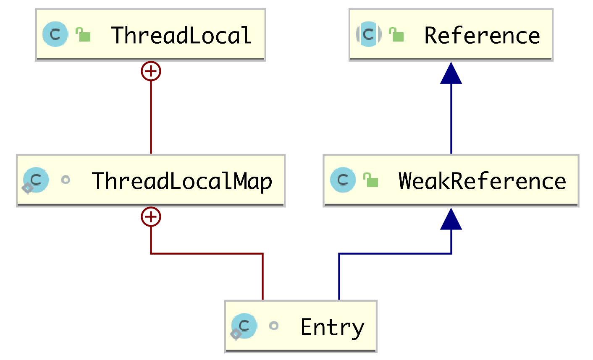
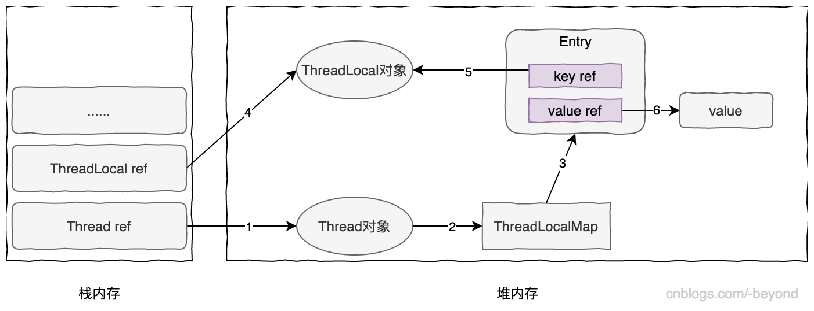
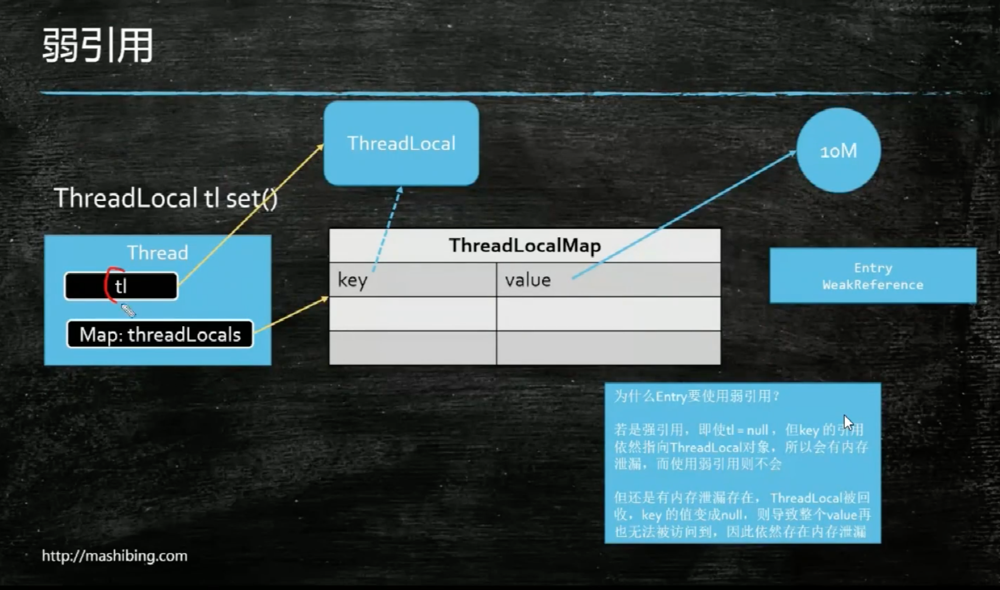

# [ThreadLocal源码解析-Java8](https://www.cnblogs.com/-beyond/p/13093032.html)

## 一.介绍ThreadLocal

### 1.1ThreadLocal的功能

　　我们知道，变量从作用域范围进行分类，可以分为“全局变量”、“局部变量”两种：

　　1.全局变量（global variable），比如类的静态属性（加static关键字），在类的整个生命周期都有效；

　　2.局部变量（local variable)，比如在一个方法中定义的变量，作用域只是在当前方法内，方法执行完毕后，变量就销毁（释放）了；

　　使用全局变量，当多个线程同时修改静态属性，就容易出现并发问题，导致脏数据；而局部变量一般来说不会出现并发问题（在方法中开启多线程并发修改局部变量，仍可能引起并发问题）；

　　再看ThreadLocal，可以用来保存局部变量，只不过这个“局部”是指“线程”作用域，也就是说，该变量在该线程的整个生命周期中有效。

　　关于ThreadLocal的使用场景，可以查看[ThreadLocal的使用场景分析](https://www.cnblogs.com/-beyond/p/13111015.html)。

### 1.2ThreadLocal的使用示例

　　ThreadLocal使用非常简单。

```
package cn.ganlixin;
 
import org.junit.Test;
 
import java.util.Arrays;
import java.util.List;
 
public class TestThreadLocal {
 
    private static class Goods {
        public Integer id;
        public List<String> tags;
    }
 
    @Test
    public void testReference() {
        Goods goods1 = new Goods();
        goods1.id = 10;
        goods1.tags = Arrays.asList("healthy", "cheap");
 
        ThreadLocal<Goods> threadLocal = new ThreadLocal<>();
        threadLocal.set(goods1);
 
        Goods goods2 = threadLocal.get();
        System.out.println(goods1); // cn.ganlixin.TestThreadLocal$Goods@1c655221
        System.out.println(goods2); // cn.ganlixin.TestThreadLocal$Goods@1c655221
 
        goods2.id = 100;
        System.out.println(goods1.id);  // 100
        System.out.println(goods2.id);  // 100
 
        threadLocal.remove();
        System.out.println(threadLocal.get()); // null
    }
 
    @Test
    public void test2() {
        // 一个线程中，可以创建多个ThreadLocal对象，多个ThreadLoca对象互不影响
        ThreadLocal<String> threadLocal1 = new ThreadLocal<>();
        ThreadLocal<String> threadLocal2 = new ThreadLocal<>();
        // ThreadLocal存的值默认为null
 
        System.out.println(threadLocal1.get()); // null
 
        threadLocal1.set("this is value1");
        threadLocal2.set("this is value2");
        System.out.println(threadLocal1.get()); // this is value1
        System.out.println(threadLocal2.get());  // this is value2
 
        // 可以重写initialValue进行设置初始值
        ThreadLocal<String> threadLocal3 = new ThreadLocal<String>() {
            @Override
            protected String initialValue() {
                return "this is initial value";
            }
        };
        System.out.println(threadLocal3.get()); // this is initial value
    }
}
```

　　

## 二.源码分析-ThreadLocal

### 2.1ThreadLocal类层级关系

　　

　　ThreadLocal类中有一个内部类ThreadLocalMap，这个类特别重要，**ThreadLocal的各种操作基本都是围绕ThreadLocalMap进行的**。

　　对于ThreadLocalMap有来说，它内部定义了一个Entry内部类，有一个table属性，是一个Entry数组，和HashMap有一些相似的地方，但是ThreadLocalMap和HashMap并没有什么关系。

　　先大概看一下内存关系图，不理解也没关系，看了后面的代码应该就能理解了：

　　 

　　大概解释一下，栈中的Thread ref（引用）堆中的Thread对象，Thread对象有一个属性threadlocals(ThreadLocalMap类型)，这个Map中每一项(Entry)的value是ThreadLocal.set()的值，而Map的key则是ThreadLocal对象。

　　下面在介绍源码的时候，**会从两部分进行介绍，先介绍ThreadLocal的常用api，然后再介绍ThreadLocalMap，因为ThreadLocal的api内部其实都是在操作ThreadLocalMap，所以看源码时一定要知道他们俩之间的关系**。

 

### 2.2ThreadLocal的属性

　　ThreadLocal有3个属性，主要的功能就是生成ThreadLocal的hash值。

```
// threadLocalHashCode用来表示当前ThreadLocal对象的hashCode，通过计算获得
private final int threadLocalHashCode = nextHashCode();
 
// 一个AtomicInteger类型的属性，功能就是计数，各种操作都是原子性的，在并发时不会出现问题
private static AtomicInteger nextHashCode = new AtomicInteger();
 
// hash值的增量，不是随便指定的，被称为“黄金分割数”，能让hash结果均衡分布
private static final int HASH_INCREMENT = 0x61c88647;
 
/**
 * 通过计算，为当前ThreadLocal对象生成一个HashCode
 */
private static int nextHashCode() {
    // 获取当前nextHashCode，然后递增HASH_INCREMENT
    return nextHashCode.getAndAdd(HASH_INCREMENT);
}
```

　　

### 2.3创建ThreadLocal对象

　　ThreadLocal类，只有一个无参构造器，如果需要是指默认值，则可以重写initialValue方法：

```
public ThreadLocal() {}
 
/**
 * 初始值默认为null，要设置初始值，只需要设置为方法返回值即可
 *
 * @return ThreadLocal的初始值
 */
protected T initialValue() {
    return null;
}
```

　　需要注意的是**initialValue方法并不会在创建ThreadLocal对象的时候设置初始值，而是延迟执行：**当ThreadLocal直接调用get时才会触发initialValue执行（get之前没有调用set来设置过值），initialValue方法在后面还会介绍。 

 

### 2.4ThreadLocal-set操作

　　下面这段代码只给出了ThreadLocal的set代码:

```
public void set(T value) {
    // 获取当前线程
    Thread t = Thread.currentThread();
 
    // 获取当前线程的ThreadLocalMap属性，ThreadLocal有一个threadLocals属性（ThreadLocalMap类型）
    ThreadLocalMap map = getMap(t);
 
    if (map != null) {
        // 如果当前线程有关联的ThreadLocalMap对象，则调用ThreadLocalMap的set方法进行设置
        map.set(this, value);
    } else {
        // 创建一个与当前线程关联的ThreadLocalMap对象，并设置对应的value
        createMap(t, value);
    }
}
 
/**
 * 获取线程关联的ThreadLocalMap对象
 */
ThreadLocalMap getMap(Thread t) {
    return t.threadLocals;
}
 
/**
 * 创建ThreadLocalMap
 * @param t          key为当前线程
 * @param firstValue value为ThreadLocal.set的值
 */
void createMap(Thread t, T firstValue) {
    t.threadLocals = new ThreadLocalMap(this, firstValue);
}
```

　　如果想立即了解ThreadLocalMap的set方法，则可点此[跳转](https://www.cnblogs.com/-beyond/p/13093032.html#threadlocalmap-set)！

 

### 2.5ThreadLocal-get操作

　　前面说过“重写ThreadLocal的initialValue方法来设置ThreadLocal的默认值，并不是在创建ThreadLocal的时候执行的，而是在直接get的时候执行的”，看了下面的代码，就知道这句话的具体含义了，感觉设计很巧妙：

```
public T get() {
    // 获取当前线程
    Thread t = Thread.currentThread();
 
    // 获取当前线程对象的threadLocals属性
    ThreadLocalMap map = getMap(t);
 
    // 若当前线程对象的threadLocals属性不为空（map不为空）
    if (map != null) {
        // 当前ThreadLocal对象作为key，获取ThreadLocalMap中对应的Entry
        ThreadLocalMap.Entry e = map.getEntry(this);
 
        // 如果找到对应的Entry，则证明该线程的该ThreadLocal有值，返回值即可
        if (e != null) {
            @SuppressWarnings("unchecked")
            T result = (T) e.value;
            return result;
        }
    }
 
    // 1.当前线程对象的threadLocals属性为空（map为空）
    // 2.或者map不为空，但是未在map中查询到以该ThreadLocal对象为key对应的entry
    // 这两种情况，都会进行设置初始值，并将初始值返回
    return setInitialValue();
}
 
/**
 * 设置ThreadLocal初始值
 *
 * @return 初始值
 */
private T setInitialValue() {
    // 调用initialValue方法，该方法可以在创建ThreadLocal的时候重写
    T value = initialValue();
    Thread t = Thread.currentThread();
 
    // 获取当前线程的threadLocals属性（map）
    ThreadLocalMap map = getMap(t);
    if (map != null) {
        // threadLocals属性值不为空，则进行调用ThreadLocalMap的set方法
        map.set(this, value);
    } else {
        // 没有关联的threadLocals，则创建ThreadLocalMap，并在map中新增一个Entry
        createMap(t, value);
    }
 
    // 返回初始值
    return value;
}
 
/**
 * 初始值默认为null，要设置初始值，只需要设置为方法返回值即可
 * 创建ThreadLocal设置默认值，可以覆盖initialValue方法，initialValue方法不是在创建ThreadLocal时执行，而是这个时候执行
 *
 * @return ThreadLocal的初始值
 */
protected T initialValue() {
    return null;
}
```

　　　　　

### 2.6ThreadLocal-remove操作

　　一般是在ThreadLocal对象使用完后，调用ThreadLocal的remove方法，在一定程度上，可以避免内存泄露；

 

```
/**
 * 删除当前线程中threadLocals属性（map）中的Entry（以当前ThreadLocal为key的）
 */
public void remove() {
    // 获取当前线程的threadLocals属性（ThreadLocalMap）
    ThreadLocalMap m = getMap(Thread.currentThread());
 
    if (m != null) {
        // 调用ThreadLocalMap的remove方法，删除map中以当前ThreadLocal为key的entry
        m.remove(this);
    }
}
```

 

## 三.ThreadLocalMap内部类

### 3.0 线性探测算法解决hash冲突

　　在介绍ThreadLocalMap的之前，强烈建议先了解一下线性探测算法，这是一种解决Hash冲突的方案，如果不了解这个算法就去看ThreadLocalMap的源码就会非常吃力，会感到莫名其妙。

　　链接在此：[利用线性探测法解决hash冲突](https://www.cnblogs.com/-beyond/p/7726347.html)

 

### 3.1Entry内部类

　　ThreadLocalMap是ThreadLocal的内部类，ThreadLocalMap底层使用数组实现，每一个数组的元素都是Entry类型（在ThreadLocalMap中定义的），源码如下：

```
/**
 * ThreadLocalMap中存放的元素类型，继承了弱引用类
 */
static class Entry extends WeakReference<ThreadLocal<?>> {
    // key对应的value，注意key是ThreadLocal类型
    Object value;
 
    Entry(ThreadLocal<?> k, Object v) {
        super(k);
        value = v;
    }
}

```

　　ThreadLocalMap和HashMap类似，比较一下：

　　a:底层都是使用数组实现，数组元素类型都是内部定义，Java8中，HashMap的元素是Node类型（或者TreeNode类型），ThreadLocalMap中的元素类型是Entry类型；

　　b.都是通过计算得到一个值，将这个值与数组的长度（容量）进行与操作，确定Entry应该放到哪个位置；

　　c.都有初始容量、负载因子，超过扩容阈值将会触发扩容；但是HashMap的初始容量、负载因子是可以更改的，而ThreadLocalMap的初始容量和负载因子不可修改；

　　注意Entry继承自WeakReference类，在实例化Entry时，将接收的key传给父类构造器（也就是WeakReference的构造器），WeakReference构造器又将key传给它的父类构造器（Reference）:

```
// 创建Reference对象，接受一个引用
Reference(T referent) {
    this(referent, null);
}
 
// 设置引用
Reference(T referent, ReferenceQueue<? super T> queue) {
    this.referent = referent;
    this.queue = (queue == null) ? ReferenceQueue.NULL : queue;
}
```

　　关于Java的各种引用，可以参考：[Java-强引用、软引用、弱引用、虚引用](https://www.cnblogs.com/-beyond/p/10881060.html)

 

### 3.2ThreadLocalMap的常量介绍

```
// ThreadLocalMap的初始容量
private static final int INITIAL_CAPACITY = 16;
 
// ThreadLocalMap底层存数据的数组
private Entry[] table;
 
// ThreadLocalMap中元素的个数
private int size = 0;
 
// 扩容阈值，当size达到阈值时会触发扩容（loadFactor=2/3;newCapacity=2*oldCapacity）
private int threshold; // Default to 0

```

　　

### 3.3创建ThreadLocalMap对象

　　创建ThreadLocalMap，是在**第一次调用ThreadLocal的set或者get方法时执行**，其中第一次未set值，直接调用get时，就会利用ThreadLocal的初始值来创建ThreadLocalMap。

　　ThreadLocalMap内部类的源码如下：

```
/**
 * 初始化一个ThreadLocalMap对象（第一次调用ThreadLocal的set方法时创建），传入ThreadLocal对象和对应的value
 */
ThreadLocalMap(ThreadLocal<?> firstKey, Object firstValue) {
    // 创建一个Entry数组，容量为16（默认）
    table = new Entry[INITIAL_CAPACITY];
 
    // 计算新增的元素，应该放到数组的哪个位置，根据ThreadLocal的hash值与初始容量进行"与"操作
    int i = firstKey.threadLocalHashCode & (INITIAL_CAPACITY - 1);
 
    // 创建一个Entry，设置key和value，注意Entry中没有key属性，key属性是传给Entry的父类WeakReference
    table[i] = new Entry(firstKey, firstValue);
 
    // 初始容量为1
    size = 1;
 
    // 设置扩容阈值
    setThreshold(INITIAL_CAPACITY);
}
 
/**
 * 设置扩容阈值，接收容量值，负载因子固定为2/3
 */
private void setThreshold(int len) {
    threshold = len * 2 / 3;
}
```

 

### 3.4 ThreadLocalMap的set操作

　　ThreadLocal的set方法，其实核心就是调用ThreadLocalMap的set方法，set方法的流程比较长

```
/**
 * 为当前ThreadLocal对象设置value
 */
private void set(ThreadLocal<?> key, Object value) {
    Entry[] tab = table;
    int len = tab.length;
 
    // 计算新元素应该放到哪个位置（这个位置不一定是最终存放的位置，因为可能会出现hash冲突）
    int i = key.threadLocalHashCode & (len - 1);
 
    // 判断计算出来的位置是否被占用，如果被占用，则需要找出应该存放的位置
    for (Entry e = tab[i]; e != null; e = tab[i = nextIndex(i, len)]) {
        // 获取Entry中key，也就是弱引用的对象
        ThreadLocal<?> k = e.get();
 
        // 判断key是否相等（判断弱引用的是否为同一个ThreadLocal对象）如果是，则进行覆盖
        if (k == key) {
            e.value = value;
            return;
        }
 
        // k为null，也就是Entry的key已经被回收了，当前的Entry是一个陈旧的元素（stale entry）
        if (k == null) {
            // 用新元素替换掉陈旧元素，同时也会清理其他陈旧元素，防止内存泄露
            replaceStaleEntry(key, value, i);
            return;
        }
    }
 
    // map中没有ThreadLocal对应的key，或者说没有找到陈旧的Entry，则创建一个新的Entry，放入数组中
    tab[i] = new Entry(key, value);
    // ThreadLocalMap的元素数量加1
    int sz = ++size;
 
    // 先清理map中key为null的Entry元素，该Entry也应该被回收掉，防止内存泄露
    // 如果清理出陈旧的Entry，那么就判断是否需要扩容，如果需要的话，则进行rehash
    if (!cleanSomeSlots(i, sz) && sz >= threshold) {
        rehash();
    }
}
```

　　上面最后几行代码涉及到清理陈旧Entry和rehash，这两块的代码在下面。

 

### 3.5清理陈旧Entry和rehash

　　陈旧的Entry，是指Entry的key为null，这种情况下，该Entry是不可访问的，但是却不会被回收，为了避免出现内存泄漏，所以需要在每次get、set、replace时，进行清理陈旧的Entry，下面只给出一部分代码：

```
/**
 * 清理map中key为null的Entry元素，该Entry也应该被回收掉，防止内存泄露
 *
 * @param i 新Entry插入的位置
 * @param n 数组中元素的数量
 * @return 是否有陈旧的entry的清除
 */
private boolean cleanSomeSlots(int i, int n) {
    boolean removed = false;
    Entry[] tab = table;
    int len = tab.length;
    do {
        i = nextIndex(i, len);
        Entry e = tab[i];
        if (e != null && e.get() == null) {
            n = len;
            removed = true;
            i = expungeStaleEntry(i);
        }
    } while ((n >>>= 1) != 0);
    return removed;
}
 
private void rehash() {
    // 清除底层数组中所有陈旧的（stale）的Entry，也就是key为null的Entry
    // 同时每清除一个Entry，就对其后面的Entry重新计算hash，获取新位置，使用线性探测法，重新确定最终位置
    expungeStaleEntries();
 
    // 清理完陈旧Entry后，判断是否需要扩容
    if (size >= threshold - threshold / 4) {
        // 扩容时，容量变为旧容量的2倍，再进行rehash，并使用线性探测发确定Entry的新位置
        resize();
    }
}
```

　　在rehash的时候，涉及到“线性探测法”，是一种用来解决hash冲突的方案，可以查看[利用线性探测法解决hash冲突](https://www.cnblogs.com/-beyond/p/7726347.html)了解详情。

 

### 3.6ThreadLocalMap-remove操作

　　remove操作，是调用ThreadLocal.remove()方法时，删除当前线程的ThreadLocalMap中该ThreadLocal为key的Entry。

```
/**
 * 移除当前线程的threadLocals属性中key为ThreadLocal的Entry
 *
 * @param key 要移除的Entry的key(ThreadLocal对象）
 */
private void remove(ThreadLocal<?> key) {
    Entry[] tab = table;
    int len = tab.length;
 
    // 计算出该ThreadLocal对应的key应该存放的位置
    int i = key.threadLocalHashCode & (len - 1);
 
    // 找到指定位置，开始按照线性探测算法进行查找到该Thread的Entry
    for (Entry e = tab[i]; e != null; e = tab[i = nextIndex(i, len)]) {
 
        // 如果Entry的key相同
        if (e.get() == key) {
            // 调用WeakReference的clear方法，Entry的key是弱引用，指向ThreadLocal，现在将key指向null
            // 则该ThreadLocal对象在会在下一次gc时，被垃圾收集器回收
            e.clear();
 
            // 将该位置的Entry中的value置为null，于是value引用的对象也会被垃圾收集器回收（不会造成内存泄漏）
            // 同时内部会调整Entry的顺序（开放探测算法的特点，删除元素后会重新调整顺序）
            expungeStaleEntry(i);
 
            return;
        }
    }
}
```

 

## 四.总结

　　在学习ThreadLocal类源码的过程还是受益颇多的：

　　1.ThreadLocal的使用场景；

　　2.initialValue的延迟执行；

　　3.HashMap使用链表+红黑树解决hash冲突，ThreadLocalMap使用线性探测算法（开放寻址）解决hash冲突

　　另外，ThreadLocal还有一部分内容，是关于弱引用和内存泄漏的问题，可以参考：[分析ThreadLocal的弱引用与内存泄漏问题-Java8](https://www.cnblogs.com/-beyond/p/13125195.html)。

 

　　原文地址：https://www.cnblogs.com/-beyond/p/13093032.html


-----


# ThreadLocal：

>典型的用法：spring事务中使用到事务， 
>

>key 是ThreadLocal对象。
>
>一个ThreadLocal只能装一个值，因为ThreadLocal只是一个map的key，因此想要装多个值的话就需要多个ThreadLocal对象。



>ThreadLocal：首先我们会声明一个ThreadLocal
>
>我们往里面set值时候，实际上指向了当前线程所拥有的一个ThreadLocalMap，
>
>ThreadLocalMap中是一个Entry，Entry调用了WeakReference的构造方法，构造方法中传入的是一个ThreadLocal对象，`Entry extends WeakReference<ThreadLocal<?>>`，弱引用key。
>
>

```java

ThreadLocal<Integer> th =new ThreadLocal<>();
		th.set(1);
		
		
/**
     * Sets the current thread's copy of this thread-local variable
     * to the specified value.  Most subclasses will have no need to
     * override this method, relying solely on the {@link #initialValue}
     * method to set the values of thread-locals.
     *
     * @param value the value to be stored in the current thread's copy of
     *        this thread-local.
     */
    public void set(T value) {
        Thread t = Thread.currentThread();
        ThreadLocalMap map = getMap(t);// 首先拿到当前线程的map
        if (map != null)
            map.set(this, value);
        else
            createMap(t, value);
    }
    
    
    /**
     * Get the map associated with a ThreadLocal. Overridden in
     * InheritableThreadLocal.
     *
     * @param  t the current thread
     * @return the map
     */
    ThreadLocalMap getMap(Thread t) {
        return t.threadLocals;
    }

// Thread类下的

/* ThreadLocal values pertaining to this thread. This map is maintained
     * by the ThreadLocal class. */
    ThreadLocal.ThreadLocalMap threadLocals = null;


 					/**
         * Set the value associated with key.
         *
         * @param key the thread local object
         * @param value the value to be set
         */
        private void set(ThreadLocal<?> key, Object value) {

            // We don't use a fast path as with get() because it is at
            // least as common to use set() to create new entries as
            // it is to replace existing ones, in which case, a fast
            // path would fail more often than not.

            Entry[] tab = table;
            int len = tab.length;
            int i = key.threadLocalHashCode & (len-1);

            for (Entry e = tab[i];
                 e != null;
                 e = tab[i = nextIndex(i, len)]) {
                ThreadLocal<?> k = e.get();

                if (k == key) {
                    e.value = value;
                    return;
                }

                if (k == null) {
                    replaceStaleEntry(key, value, i);
                    return;
                }
            }

            tab[i] = new Entry(key, value);
            int sz = ++size;
            if (!cleanSomeSlots(i, sz) && sz >= threshold)
                rehash();
        }

最终生成的是个Entry，点进去发现，其父类是个弱引用。
  弱引用，其实指的就是ThreadLocal对象。（WeakReference we =new WeakReference(new ThreadLocal());） 弱引用指的就是WeakReference里面的对象。
 					/**
         * The entries in this hash map extend WeakReference, using
         * its main ref field as the key (which is always a
         * ThreadLocal object).  Note that null keys (i.e. entry.get()
         * == null) mean that the key is no longer referenced, so the
         * entry can be expunged from table.  Such entries are referred to
         * as "stale entries" in the code that follows.
         */
        static class Entry extends WeakReference<ThreadLocal<?>> {
            /** The value associated with this ThreadLocal. */
            Object value;

            Entry(ThreadLocal<?> k, Object v) {
                super(k);
                value = v;
            }
        }


```


# [分析ThreadLocal的弱引用与内存泄漏问题-Java8](https://www.cnblogs.com/-beyond/p/13125195.html)

## 一.介绍

　　之前使用ThreadLocal的时候，就听过ThreadLocal怎么怎么的可能会出现内存泄漏，具体原因也没去深究，就是一种不清不楚的状态。最近在看JDK的源码，其中就包含ThreadLocal，在对ThreadLocal的使用场景介绍以及源码的分析后，对于ThreadLocal中可能存在的内存泄漏问题也搞清楚了，所以这里专门写一篇博客分析一下，对于ThreadLocal源码分析，可以参考我另一篇博客：[ThreadLocal源码解析-Java8](https://www.cnblogs.com/-beyond/p/13093032.html)。

在分析内存泄漏之前，先了解2个概念，就是内存泄漏和内存溢出：

* 内存溢出（memory overflow）：是指不能申请到足够的内存进行使用，就会发生内存溢出，比如出现的OOM（Out Of Memory）

* 内存泄漏（memory lack）：内存泄露是指在程序中已经动态分配的堆内存由于某种原因未释放或者无法释放（已经没有用处了，但是没有释放），造成系统内存的浪费，这种现象叫“内存泄露”。

　　当内存泄露到达一定规模后，造成系统能申请的内存较少，甚至无法申请内存，最终导致内存溢出，所以内存泄露是导致内存溢出的一个原因。

## 二.问题提出

### 2.1内存原理图

　　下图是程序运行中的内存分布图，简要介绍一下这种图：当前线程有一个threadLocals属性（ThreadLocalMap属性），该map的底层是数组，每个数组元素时Entry类型，Entry类型的key是ThreadLocal类型（也就是创建的ThreadLocal对象），而value是则是ThreadLocal.set()方法设置的value。

　　

　　需要注意的是ThreadLocalMap的Entry，继承自弱引用，定义如下，关于Java的引用介绍，可以参考：[Java-强引用、软引用、弱引用、虚引用](https://www.cnblogs.com/-beyond/p/10881060.html)

```
/**
 * ThreadLocalMap中存放的元素类型，继承了弱引用类
 */
static class Entry extends WeakReference<ThreadLocal<?>> {
    // key对应的value，注意key是ThreadLocal类型
    Object value;
 
    Entry(ThreadLocal<?> k, Object v) {
        super(k);
        value = v;
    }
}
```

###  

### 2.2问题提出

　　在看了上面ThreadLocal和ThreadLocalMap相关的内存分布以及关联后，提出这样几个问题：

　　1.ThreadLocal为什么会出现内存溢出？

　　2.Entry的key为什么要用弱引用？

　　3.使用弱引用是否就能解决内存溢出？

　　为了回答上面这3个问题，我写了一段代码，后面根据这段代码进行分析：

```
public void step1() {
    // some action
     
    step2();
    step3();
     
    // other action
}
 
// 在stepX中都会创建threadLocal对象
public void step2() {
    ThreadLocal<String> tl = new ThreadLocal<>();
    tl.set("this is value");
}
public void step3() {
    ThreadLocal<Integer> tl = new ThreadLocal<>();
    tl.set(99);
}
```

　　在step1中会调用step2和step3，step2和step3都会创建ThreadLocal对象，当step2和step3执行完毕后，其中的栈内存中ThreadLocal引用就会被清除。

 

## 三.回答问题

###  

　　

　　现在针对这个图，一步一步的分析问题，中途会得出一些临时的结论，但是最终的结论才是正确的。

 

### 3.1为什么会出现内存泄露

　　现在有2点假设，本小节的分析都是基于这两个假设之上的：

　　1.Entry的key使用强引用，key对ThreadLocal对象使用强引用，也就是上面图中连线5是强引用（key强引用ThreadLocal对象）；

　　2.ThreadLocalMap中不会对过期的Entry进行清理。

　　上面代码中，如果ThreadLocalMap的key使用强引用，那么即使栈内存的ThreadLocal引用被清除，但是堆中的ThreadLocal对象却并不会被清除，这是因为ThreadLocalMap中Entry的key对ThreadLocal对象是强引用。

　　如果当前线程不结束，那么堆中的ThreadLocal对象将会一直存在，对应的内存就不会被回收，与之关联的Entry也不会被回收（Entry对应的value也不会被回收），当这种情况出现数量比较多的时候，未释放的内存就会上升，就可能出现内存泄漏的问题。

　　上面的结论是暂时的，有前提假设！！！最终结论还需要看后面分析。

 

### 3.2若Entry使用弱引用

　　

　　仍旧有1个假设，就是ThreadLocalMap中不会对过期的Entry进行清理，陈旧的Entry是指Entry的key为null。

　　按照源码，Entry继承弱引用，其Key对ThreadLocal是弱引用，也就是上图中连线5是弱引用，连线6仍为强引用。

　　同样以上面代码为例，step2和step3创建了ThreadLocal对象，step2和step3执行完后，栈中的ThreadLocal引用被清除了；由于堆内存中ThreadLocalMap的Entry key弱引用ThreadLocal对象，根据垃圾收集器对弱引用对象的处理：

> 当垃圾收集器工作时，无论当前内存是否足够，都会回收掉只被弱引用关联的对象。

　　此时堆中ThreadLocal对象会被gc回收（因为之前还有栈中的ThreadLocal ref强引用ThreadLocal对象，但现在ThreadLocal ref被清除了，于是就没有对ThreadLocal的强引用，只有一个弱引用ThreadLocal对象），Entry的key为null，但是value不为null，且value也是强引用（连线6），所以Entry仍旧不能回收，只能释放ThreadLocal的内存，**仍旧可能导致内存泄漏**。

　　在没有自动清理陈旧Entry的前提下，即使Entry使用弱引用，仍可能出现内存泄漏。

 

### 3.3弱引用配合自动回收

　　通过3.2的分析，其实**只要陈旧的Entry能自动被回收，就能解决内存泄漏的问题**，其实JDK就是这么做的。

　　如果看过源码，就知道，ThreadLocalMap底层使用数组来保存元素，使用“线性探测法”来解决hash冲突，关于线性探测法的介绍可以查看：[利用线性探测法解决hash冲突](https://www.cnblogs.com/-beyond/p/7726347.html)

　　在每次调用ThreadLocal类的get、set、remove这些方法的时候，内部其实都是对ThreadLocalMap进行操作，对应ThreadLocalMap的get、set、remove操作。

　　重点来了！重点来了！重点来了！

　　ThreadLocalMap的每次get、set、remove，都会清理过期的Entry，下面以get操作解释，其他操作也是一个意思，大致如下：

　　1.ThreadLocalMap底层用数组保存元素，当get一个Entry时，根据key的hash值（非hashCode）计算出该Entry应该出在什么位置；

　　2.计算出的位置可能会有冲突，比如预期位置是position=5，但是position=5的位置已经有其他Entry了；

　　3.出现冲突后，会使用线性探测法，找position=6位置上的Entry是否匹配（匹配是指hash相同），如果匹配，则返回position=6的Entry。

　　4.在这个过程中，如果position=5位置上的Entry已经是陈旧的Entry（Entry的key为null），此时position=5的key就应该被清理；

　　5.光清理position=5的Entry还不够，为了保证线性探测法的规则，需要判断数组中的其他元素是否需要调整位置（如果需要，则调整位置），在这个过程中，也会进行清理陈旧Entry的操作。

　　上面这5个步骤就保证了每次get都会清理数组中（map）的陈旧Entry，清理一个陈旧的Entry，就是下面这三行代码：

```java
Entry.value = null; // 将Entry的value设为null
table[index] = null;// 将数组中该Entry的位置设置null
size--; // map的size减一
```

　　对于ThreadLocal的set、remove也类似这个原理。

　　有了自动回收陈旧Entry的操作，需要注意的是，在这个时候，key使用弱引用就是至关重要的一点！！！

　　因为key使用弱引用后，当弱引用的ThreadLocal对象被会回收后，该key的引用为null，则该Entry在下一次get、set、remove的时候就才会被清理，从未避免内存泄漏的问题。

## 四.总结

　　在上面的分析中，看到ThreadLocal基本不会出现内存泄漏的问题了，因为ThreadLocalMap中会在get、set、remove的时候清理陈旧的Entry，与Entry的key使用弱引用密不可分。

　　当然我们也可以在代码中手动调用ThreadLocal的remove方法进行清除map中key为该threadLocal对象的Entry，同时清理过期的Entry。