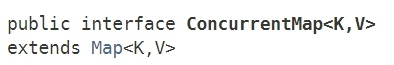

# 一、ConcurrentHashMap基础

## 1、ConcurrentHashMap介绍

ConcurrentHashMap是在JDK1.5时，J.U.C引入的一个同步集合工具类，顾名思义，这是一个线程安全的HashMap。不同版本的ConcurrentHashMap，内部实现机制千差万别，本节所有的讨论基于JDK1.8。

ConcurrentHashMap的类继承关系并不复杂：


可以看到ConcurrentHashMap继承了AbstractMap，这是一个java.util包下的抽象类，提供Map接口的骨干实现，以最大限度地减少实现Map这类数据结构时所需的工作量，一般来讲，如果需要重复造轮子——自己来实现一个Map，那一般就是继承AbstractMap。

另外，ConcurrentHashMap实现了ConcurrentMap这个接口，ConcurrentMap是在JDK1.5时随着J.U.C包引入的，这个接口其实就是提供了一些针对Map的原子操作：



### ConcurrentMap接口提供的功能：


## 2、基本结构

### 基本结构

我们先来看下ConcurrentHashMap对象的内部结构究竟什么样的：


ConcurrentHashMap内部维护了一个Node类型的数组，也就是table：

```java
transient volatile Node<K, V>[] table;
```

数组的每一个位置table[i]代表了一个桶，当插入键值对时，会根据键的hash值映射到不同的桶位置，table一共可以包含4种不同类型的桶：Node、TreeBin、ForwardingNode、ReservationNode。上图中，不同的桶用不同颜色表示。可以看到，有的桶链接着链表，有的桶链接着树，这也是JDK1.8中ConcurrentHashMap的特殊之处，后面会详细讲到。

需要注意的是：TreeBin所链接的是一颗红黑树，红黑树的结点用TreeNode表示，所以ConcurrentHashMap中实际上一共有五种不同类型的Node结点。


`之所以用TreeBin而不是直接用TreeNode，是因为红黑树的操作比较复杂，包括构建、左旋、右旋、删除，平衡等操作，用一个代理结点TreeBin来包含这些复杂操作，其实是一种“职责分离”的思想。另外TreeBin中也包含了一些加/解锁的操作。`

## ConcurrentHashMap一共包含5种结点各个结点的定义和作用。

### Node结点

Node结点的定义非常简单，也是其它四种类型结点的父类。

> 默认链接到table[i]——桶上的结点就是Node结点。
> 当出现hash冲突时，Node结点会首先以链表的形式链接到table上，当结点数量超过一定数目时，链表会转化为红黑树。因为链表查找的平均时间复杂度为O(n)，而红黑树是一种平衡二叉树，其平均时间复杂度为O(logn)。

```java
/**
 * 普通的Entry结点, 以链表形式保存时才会使用, 存储实际的数据.
 */
static class Node<K, V> implements Map.Entry<K, V> {
    final int hash;
    final K key;
    volatile V val;
    volatile Node<K, V> next;   // 链表指针

    Node(int hash, K key, V val, Node<K, V> next) {
        this.hash = hash;
        this.key = key;
        this.val = val;
        this.next = next;
    }

    public final K getKey() {
        return key;
    }

    public final V getValue() {
        return val;
    }

    public final int hashCode() {
        return key.hashCode() ^ val.hashCode();
    }

    public final String toString() {
        return key + "=" + val;
    }

    public final V setValue(V value) {
        throw new UnsupportedOperationException();
    }

    public final boolean equals(Object o) {
        Object k, v, u;
        Map.Entry<?, ?> e;
        return ((o instanceof Map.Entry) &&
            (k = (e = (Map.Entry<?, ?>) o).getKey()) != null &&
            (v = e.getValue()) != null &&
            (k == key || k.equals(key)) &&
            (v == (u = val) || v.equals(u)));
    }

    /**
     * 链表查找.
     */
    Node<K, V> find(int h, Object k) {
        Node<K, V> e = this;
        if (k != null) {
            do {
                K ek;
                if (e.hash == h &&
                    ((ek = e.key) == k || (ek != null && k.equals(ek))))
                    return e;
            } while ((e = e.next) != null);
        }
        return null;
    }
}
```

### TreeNode结点

TreeNode就是红黑树的结点，TreeNode不会直接链接到table[i]——桶上面，而是由TreeBin链接，TreeBin会指向红黑树的根结点。

```java
/**
 * 红黑树结点, 存储实际的数据.
 */
static final class TreeNode<K, V> extends Node<K, V> {
    boolean red;

    TreeNode<K, V> parent;
    TreeNode<K, V> left;
    TreeNode<K, V> right;

    /**
     * prev指针是为了方便删除.
     * 删除链表的非头结点时，需要知道它的前驱结点才能删除，所以直接提供一个prev指针
     */
    TreeNode<K, V> prev;

    TreeNode(int hash, K key, V val, Node<K, V> next,
             TreeNode<K, V> parent) {
        super(hash, key, val, next);
        this.parent = parent;
    }

    Node<K, V> find(int h, Object k) {
        return findTreeNode(h, k, null);
    }

    /**
     * 以当前结点（this）为根结点，开始遍历查找指定key.
     */
    final TreeNode<K, V> findTreeNode(int h, Object k, Class<?> kc) {
        if (k != null) {
            TreeNode<K, V> p = this;
            do {
                int ph, dir;
                K pk;
                TreeNode<K, V> q;
                TreeNode<K, V> pl = p.left, pr = p.right;
                if ((ph = p.hash) > h)
                    p = pl;
                else if (ph < h)
                    p = pr;
                else if ((pk = p.key) == k || (pk != null && k.equals(pk)))
                    return p;
                else if (pl == null)
                    p = pr;
                else if (pr == null)
                    p = pl;
                else if ((kc != null ||
                    (kc = comparableClassFor(k)) != null) &&
                    (dir = compareComparables(kc, k, pk)) != 0)
                    p = (dir < 0) ? pl : pr;
                else if ((q = pr.findTreeNode(h, k, kc)) != null)
                    return q;
                else
                    p = pl;
            } while (p != null);
        }
        return null;
    }
}
```

### TreeBin结点

TreeBin相当于TreeNode的代理结点。TreeBin会直接链接到table[i]——桶上面，该结点提供了一系列红黑树相关的操作，以及加锁、解锁操作。

```java
/**
 * TreeNode的代理结点（相当于封装了TreeNode的容器，提供针对红黑树的转换操作和锁控制）
 * hash值固定为-3
 */
static final class TreeBin<K, V> extends Node<K, V> {
    TreeNode<K, V> root;                // 红黑树结构的根结点
    volatile TreeNode<K, V> first;      // 链表结构的头结点
    volatile Thread waiter;             // 最近的一个设置WAITER标识位的线程

    volatile int lockState;             // 整体的锁状态标识位

    static final int WRITER = 1;        // 二进制001，红黑树的写锁状态
    static final int WAITER = 2;        // 二进制010，红黑树的等待获取写锁状态
    static final int READER = 4;        // 二进制100，红黑树的读锁状态，读可以并发，每多一个读线程，lockState都加上一个READER值

    /**
     * 在hashCode相等并且不是Comparable类型时，用此方法判断大小.
     */
    static int tieBreakOrder(Object a, Object b) {
        int d;
        if (a == null || b == null ||
            (d = a.getClass().getName().
                compareTo(b.getClass().getName())) == 0)
            d = (System.identityHashCode(a) <= System.identityHashCode(b) ?
                -1 : 1);
        return d;
    }

    /**
     * 将以b为头结点的链表转换为红黑树.
     */
    TreeBin(TreeNode<K, V> b) {
        super(TREEBIN, null, null, null);
        this.first = b;
        TreeNode<K, V> r = null;
        for (TreeNode<K, V> x = b, next; x != null; x = next) {
            next = (TreeNode<K, V>) x.next;
            x.left = x.right = null;
            if (r == null) {
                x.parent = null;
                x.red = false;
                r = x;
            } else {
                K k = x.key;
                int h = x.hash;
                Class<?> kc = null;
                for (TreeNode<K, V> p = r; ; ) {
                    int dir, ph;
                    K pk = p.key;
                    if ((ph = p.hash) > h)
                        dir = -1;
                    else if (ph < h)
                        dir = 1;
                    else if ((kc == null &&
                        (kc = comparableClassFor(k)) == null) ||
                        (dir = compareComparables(kc, k, pk)) == 0)
                        dir = tieBreakOrder(k, pk);
                    TreeNode<K, V> xp = p;
                    if ((p = (dir <= 0) ? p.left : p.right) == null) {
                        x.parent = xp;
                        if (dir <= 0)
                            xp.left = x;
                        else
                            xp.right = x;
                        r = balanceInsertion(r, x);
                        break;
                    }
                }
            }
        }
        this.root = r;
        assert checkInvariants(root);
    }

    /**
     * 对红黑树的根结点加写锁.
     */
    private final void lockRoot() {
        if (!U.compareAndSwapInt(this, LOCKSTATE, 0, WRITER))
            contendedLock();
    }

    /**
     * 释放写锁.
     */
    private final void unlockRoot() {
        lockState = 0;
    }

    /**
     * Possibly blocks awaiting root lock.
     */
    private final void contendedLock() {
        boolean waiting = false;
        for (int s; ; ) {
            if (((s = lockState) & ~WAITER) == 0) {
                if (U.compareAndSwapInt(this, LOCKSTATE, s, WRITER)) {
                    if (waiting)
                        waiter = null;
                    return;
                }
            } else if ((s & WAITER) == 0) {
                if (U.compareAndSwapInt(this, LOCKSTATE, s, s | WAITER)) {
                    waiting = true;
                    waiter = Thread.currentThread();
                }
            } else if (waiting)
                LockSupport.park(this);
        }
    }

    /**
     * 从根结点开始遍历查找，找到“相等”的结点就返回它，没找到就返回null
     * 当存在写锁时，以链表方式进行查找
     */
    final Node<K, V> find(int h, Object k) {
        if (k != null) {
            for (Node<K, V> e = first; e != null; ) {
                int s;
                K ek;
                /**
                 * 两种特殊情况下以链表的方式进行查找:
                 * 1. 有线程正持有写锁，这样做能够不阻塞读线程
                 * 2. 有线程等待获取写锁，不再继续加读锁，相当于“写优先”模式
                 */
                if (((s = lockState) & (WAITER | WRITER)) != 0) {
                    if (e.hash == h &&
                        ((ek = e.key) == k || (ek != null && k.equals(ek))))
                        return e;
                    e = e.next;
                } else if (U.compareAndSwapInt(this, LOCKSTATE, s,
                    s + READER)) {
                    TreeNode<K, V> r, p;
                    try {
                        p = ((r = root) == null ? null :
                            r.findTreeNode(h, k, null));
                    } finally {
                        Thread w;
                        if (U.getAndAddInt(this, LOCKSTATE, -READER) ==
                            (READER | WAITER) && (w = waiter) != null)
                            LockSupport.unpark(w);
                    }
                    return p;
                }
            }
        }
        return null;
    }

    /**
     * 查找指定key对应的结点,如果未找到，则插入.
     *
     * @return 插入成功返回null, 否则返回找到的结点
     */
    final TreeNode<K, V> putTreeVal(int h, K k, V v) {
        Class<?> kc = null;
        boolean searched = false;
        for (TreeNode<K, V> p = root; ; ) {
            int dir, ph;
            K pk;
            if (p == null) {
                first = root = new TreeNode<K, V>(h, k, v, null, null);
                break;
            } else if ((ph = p.hash) > h)
                dir = -1;
            else if (ph < h)
                dir = 1;
            else if ((pk = p.key) == k || (pk != null && k.equals(pk)))
                return p;
            else if ((kc == null &&
                (kc = comparableClassFor(k)) == null) ||
                (dir = compareComparables(kc, k, pk)) == 0) {
                if (!searched) {
                    TreeNode<K, V> q, ch;
                    searched = true;
                    if (((ch = p.left) != null &&
                        (q = ch.findTreeNode(h, k, kc)) != null) ||
                        ((ch = p.right) != null &&
                            (q = ch.findTreeNode(h, k, kc)) != null))
                        return q;
                }
                dir = tieBreakOrder(k, pk);
            }

            TreeNode<K, V> xp = p;
            if ((p = (dir <= 0) ? p.left : p.right) == null) {
                TreeNode<K, V> x, f = first;
                first = x = new TreeNode<K, V>(h, k, v, f, xp);
                if (f != null)
                    f.prev = x;
                if (dir <= 0)
                    xp.left = x;
                else
                    xp.right = x;
                if (!xp.red)
                    x.red = true;
                else {
                    lockRoot();
                    try {
                        root = balanceInsertion(root, x);
                    } finally {
                        unlockRoot();
                    }
                }
                break;
            }
        }
        assert checkInvariants(root);
        return null;
    }

    /**
     * 删除红黑树的结点：
     * 1. 红黑树规模太小时，返回true，然后进行 树 -> 链表 的转化;
     * 2. 红黑树规模足够时，不用变换成链表，但删除结点时需要加写锁.
     */
    final boolean removeTreeNode(TreeNode<K, V> p) {
        TreeNode<K, V> next = (TreeNode<K, V>) p.next;
        TreeNode<K, V> pred = p.prev;  // unlink traversal pointers
        TreeNode<K, V> r, rl;
        if (pred == null)
            first = next;
        else
            pred.next = next;
        if (next != null)
            next.prev = pred;
        if (first == null) {
            root = null;
            return true;
        }
        if ((r = root) == null || r.right == null || // too small
            (rl = r.left) == null || rl.left == null)
            return true;
        lockRoot();
        try {
            TreeNode<K, V> replacement;
            TreeNode<K, V> pl = p.left;
            TreeNode<K, V> pr = p.right;
            if (pl != null && pr != null) {
                TreeNode<K, V> s = pr, sl;
                while ((sl = s.left) != null) // find successor
                    s = sl;
                boolean c = s.red;
                s.red = p.red;
                p.red = c; // swap colors
                TreeNode<K, V> sr = s.right;
                TreeNode<K, V> pp = p.parent;
                if (s == pr) { // p was s's direct parent
                    p.parent = s;
                    s.right = p;
                } else {
                    TreeNode<K, V> sp = s.parent;
                    if ((p.parent = sp) != null) {
                        if (s == sp.left)
                            sp.left = p;
                        else
                            sp.right = p;
                    }
                    if ((s.right = pr) != null)
                        pr.parent = s;
                }
                p.left = null;
                if ((p.right = sr) != null)
                    sr.parent = p;
                if ((s.left = pl) != null)
                    pl.parent = s;
                if ((s.parent = pp) == null)
                    r = s;
                else if (p == pp.left)
                    pp.left = s;
                else
                    pp.right = s;
                if (sr != null)
                    replacement = sr;
                else
                    replacement = p;
            } else if (pl != null)
                replacement = pl;
            else if (pr != null)
                replacement = pr;
            else
                replacement = p;
            if (replacement != p) {
                TreeNode<K, V> pp = replacement.parent = p.parent;
                if (pp == null)
                    r = replacement;
                else if (p == pp.left)
                    pp.left = replacement;
                else
                    pp.right = replacement;
                p.left = p.right = p.parent = null;
            }

            root = (p.red) ? r : balanceDeletion(r, replacement);

            if (p == replacement) {  // detach pointers
                TreeNode<K, V> pp;
                if ((pp = p.parent) != null) {
                    if (p == pp.left)
                        pp.left = null;
                    else if (p == pp.right)
                        pp.right = null;
                    p.parent = null;
                }
            }
        } finally {
            unlockRoot();
        }
        assert checkInvariants(root);
        return false;
    }

    // 以下是红黑树的经典操作方法，改编自《算法导论》
    static <K, V> TreeNode<K, V> rotateLeft(TreeNode<K, V> root,
                                            TreeNode<K, V> p) {
        TreeNode<K, V> r, pp, rl;
        if (p != null && (r = p.right) != null) {
            if ((rl = p.right = r.left) != null)
                rl.parent = p;
            if ((pp = r.parent = p.parent) == null)
                (root = r).red = false;
            else if (pp.left == p)
                pp.left = r;
            else
                pp.right = r;
            r.left = p;
            p.parent = r;
        }
        return root;
    }

    static <K, V> TreeNode<K, V> rotateRight(TreeNode<K, V> root,
                                             TreeNode<K, V> p) {
        TreeNode<K, V> l, pp, lr;
        if (p != null && (l = p.left) != null) {
            if ((lr = p.left = l.right) != null)
                lr.parent = p;
            if ((pp = l.parent = p.parent) == null)
                (root = l).red = false;
            else if (pp.right == p)
                pp.right = l;
            else
                pp.left = l;
            l.right = p;
            p.parent = l;
        }
        return root;
    }

    static <K, V> TreeNode<K, V> balanceInsertion(TreeNode<K, V> root,
                                                  TreeNode<K, V> x) {
        x.red = true;
        for (TreeNode<K, V> xp, xpp, xppl, xppr; ; ) {
            if ((xp = x.parent) == null) {
                x.red = false;
                return x;
            } else if (!xp.red || (xpp = xp.parent) == null)
                return root;
            if (xp == (xppl = xpp.left)) {
                if ((xppr = xpp.right) != null && xppr.red) {
                    xppr.red = false;
                    xp.red = false;
                    xpp.red = true;
                    x = xpp;
                } else {
                    if (x == xp.right) {
                        root = rotateLeft(root, x = xp);
                        xpp = (xp = x.parent) == null ? null : xp.parent;
                    }
                    if (xp != null) {
                        xp.red = false;
                        if (xpp != null) {
                            xpp.red = true;
                            root = rotateRight(root, xpp);
                        }
                    }
                }
            } else {
                if (xppl != null && xppl.red) {
                    xppl.red = false;
                    xp.red = false;
                    xpp.red = true;
                    x = xpp;
                } else {
                    if (x == xp.left) {
                        root = rotateRight(root, x = xp);
                        xpp = (xp = x.parent) == null ? null : xp.parent;
                    }
                    if (xp != null) {
                        xp.red = false;
                        if (xpp != null) {
                            xpp.red = true;
                            root = rotateLeft(root, xpp);
                        }
                    }
                }
            }
        }
    }

    static <K, V> TreeNode<K, V> balanceDeletion(TreeNode<K, V> root,
                                                 TreeNode<K, V> x) {
        for (TreeNode<K, V> xp, xpl, xpr; ; ) {
            if (x == null || x == root)
                return root;
            else if ((xp = x.parent) == null) {
                x.red = false;
                return x;
            } else if (x.red) {
                x.red = false;
                return root;
            } else if ((xpl = xp.left) == x) {
                if ((xpr = xp.right) != null && xpr.red) {
                    xpr.red = false;
                    xp.red = true;
                    root = rotateLeft(root, xp);
                    xpr = (xp = x.parent) == null ? null : xp.right;
                }
                if (xpr == null)
                    x = xp;
                else {
                    TreeNode<K, V> sl = xpr.left, sr = xpr.right;
                    if ((sr == null || !sr.red) &&
                        (sl == null || !sl.red)) {
                        xpr.red = true;
                        x = xp;
                    } else {
                        if (sr == null || !sr.red) {
                            if (sl != null)
                                sl.red = false;
                            xpr.red = true;
                            root = rotateRight(root, xpr);
                            xpr = (xp = x.parent) == null ?
                                null : xp.right;
                        }
                        if (xpr != null) {
                            xpr.red = (xp == null) ? false : xp.red;
                            if ((sr = xpr.right) != null)
                                sr.red = false;
                        }
                        if (xp != null) {
                            xp.red = false;
                            root = rotateLeft(root, xp);
                        }
                        x = root;
                    }
                }
            } else { // symmetric
                if (xpl != null && xpl.red) {
                    xpl.red = false;
                    xp.red = true;
                    root = rotateRight(root, xp);
                    xpl = (xp = x.parent) == null ? null : xp.left;
                }
                if (xpl == null)
                    x = xp;
                else {
                    TreeNode<K, V> sl = xpl.left, sr = xpl.right;
                    if ((sl == null || !sl.red) &&
                        (sr == null || !sr.red)) {
                        xpl.red = true;
                        x = xp;
                    } else {
                        if (sl == null || !sl.red) {
                            if (sr != null)
                                sr.red = false;
                            xpl.red = true;
                            root = rotateLeft(root, xpl);
                            xpl = (xp = x.parent) == null ?
                                null : xp.left;
                        }
                        if (xpl != null) {
                            xpl.red = (xp == null) ? false : xp.red;
                            if ((sl = xpl.left) != null)
                                sl.red = false;
                        }
                        if (xp != null) {
                            xp.red = false;
                            root = rotateRight(root, xp);
                        }
                        x = root;
                    }
                }
            }
        }
    }

    /**
     * 递归检查红黑树的正确性
     */
    static <K, V> boolean checkInvariants(TreeNode<K, V> t) {
        TreeNode<K, V> tp = t.parent, tl = t.left, tr = t.right,
            tb = t.prev, tn = (TreeNode<K, V>) t.next;
        if (tb != null && tb.next != t)
            return false;
        if (tn != null && tn.prev != t)
            return false;
        if (tp != null && t != tp.left && t != tp.right)
            return false;
        if (tl != null && (tl.parent != t || tl.hash > t.hash))
            return false;
        if (tr != null && (tr.parent != t || tr.hash < t.hash))
            return false;
        if (t.red && tl != null && tl.red && tr != null && tr.red)
            return false;
        if (tl != null && !checkInvariants(tl))
            return false;
        if (tr != null && !checkInvariants(tr))
            return false;
        return true;
    }

    private static final sun.misc.Unsafe U;
    private static final long LOCKSTATE;

    static {
        try {
            U = sun.misc.Unsafe.getUnsafe();
            Class<?> k = TreeBin.class;
            LOCKSTATE = U.objectFieldOffset
                (k.getDeclaredField("lockState"));
        } catch (Exception e) {
            throw new Error(e);
        }
    }
}
```

### ForwardingNode结点

ForwardingNode结点仅仅在扩容时才会使用——关于扩容，会在下一篇文章专门论述

```java
/**
 * ForwardingNode是一种临时结点，在扩容进行中才会出现，hash值固定为-1，且不存储实际数据。
 * 如果旧table数组的一个hash桶中全部的结点都迁移到了新table中，则在这个桶中放置一个ForwardingNode。
 * 读操作碰到ForwardingNode时，将操作转发到扩容后的新table数组上去执行；写操作碰见它时，则尝试帮助扩容。
 */
static final class ForwardingNode<K, V> extends Node<K, V> {
    final Node<K, V>[] nextTable;

    ForwardingNode(Node<K, V>[] tab) {
        super(MOVED, null, null, null);
        this.nextTable = tab;
    }

    // 在新的数组nextTable上进行查找
    Node<K, V> find(int h, Object k) {
        // loop to avoid arbitrarily deep recursion on forwarding nodes
        outer:
        for (Node<K, V>[] tab = nextTable; ; ) {
            Node<K, V> e;
            int n;
            if (k == null || tab == null || (n = tab.length) == 0 ||
                (e = tabAt(tab, (n - 1) & h)) == null)
                return null;
            for (; ; ) {
                int eh;
                K ek;
                if ((eh = e.hash) == h &&
                    ((ek = e.key) == k || (ek != null && k.equals(ek))))
                    return e;
                if (eh < 0) {
                    if (e instanceof ForwardingNode) {
                        tab = ((ForwardingNode<K, V>) e).nextTable;
                        continue outer;
                    } else
                        return e.find(h, k);
                }
                if ((e = e.next) == null)
                    return null;
            }
        }
    }
}
```

### ReservationNode结点

保留结点，ConcurrentHashMap中的一些特殊方法会专门用到该类结点。

```java
/**
 * 保留结点.
 * hash值固定为-3， 不保存实际数据
 * 只在computeIfAbsent和compute这两个函数式API中充当占位符加锁使用
 */
static final class ReservationNode<K, V> extends Node<K, V> {
    ReservationNode() {
        super(RESERVED, null, null, null);
    }

    Node<K, V> find(int h, Object k) {
        return null;
    }
}
```

## 类变量定义

我们再看下ConcurrentHashMap内部定义了哪些常量/字段，先大致熟悉下这些常量/字段，后面结合具体的方法分析就能相对容易地理解这些常量/字段的含义了。

**常量：**

```
/**
 * 最大容量.
 */
private static final int MAXIMUM_CAPACITY = 1 << 30;

/**
 * 默认初始容量
 */
private static final int DEFAULT_CAPACITY = 16;

/**
 * The largest possible (non-power of two) array size.
 * Needed by toArray and related methods.
 */
static final int MAX_ARRAY_SIZE = Integer.MAX_VALUE - 8;

/**
 * 负载因子，为了兼容JDK1.8以前的版本而保留。
 * JDK1.8中的ConcurrentHashMap的负载因子恒定为0.75
 */
private static final float LOAD_FACTOR = 0.75f;

/**
 * 链表转树的阈值，即链接结点数大于8时， 链表转换为树.
 */
static final int TREEIFY_THRESHOLD = 8;

/**
 * 树转链表的阈值，即树结点树小于6时，树转换为链表.
 */
static final int UNTREEIFY_THRESHOLD = 6;

/**
 * 在链表转变成树之前，还会有一次判断：
 * 即只有键值对数量大于MIN_TREEIFY_CAPACITY，才会发生转换。
 * 这是为了避免在Table建立初期，多个键值对恰好被放入了同一个链表中而导致不必要的转化。
 */
static final int MIN_TREEIFY_CAPACITY = 64;

/**
 * 在树转变成链表之前，还会有一次判断：
 * 即只有键值对数量小于MIN_TRANSFER_STRIDE，才会发生转换.
 */
private static final int MIN_TRANSFER_STRIDE = 16;

/**
 * 用于在扩容时生成唯一的随机数.
 */
private static int RESIZE_STAMP_BITS = 16;

/**
 * 可同时进行扩容操作的最大线程数.
 */
private static final int MAX_RESIZERS = (1 << (32 - RESIZE_STAMP_BITS)) - 1;

/**
 * The bit shift for recording size stamp in sizeCtl.
 */
private static final int RESIZE_STAMP_SHIFT = 32 - RESIZE_STAMP_BITS;

static final int MOVED = -1;                // 标识ForwardingNode结点（在扩容时才会出现，不存储实际数据）
static final int TREEBIN = -2;              // 标识红黑树的根结点
static final int RESERVED = -3;             // 标识ReservationNode结点（）
static final int HASH_BITS = 0x7fffffff;    // usable bits of normal node hash

/**
 * CPU核心数，扩容时使用
 */
static final int NCPU = Runtime.getRuntime().availableProcessors();
```

**字段**

```java
/**
 * Node数组，标识整个Map，首次插入元素时创建，大小总是2的幂次.
 */
transient volatile Node<K, V>[] table;

/**
 * 扩容后的新Node数组，只有在扩容时才非空.
 */
private transient volatile Node<K, V>[] nextTable;

/**
 * 控制table的初始化和扩容.
 * 0  : 初始默认值
 * -1 : 有线程正在进行table的初始化
 * >0 : table初始化时使用的容量，或初始化/扩容完成后的threshold
 * -(1 + nThreads) : 记录正在执行扩容任务的线程数
 */
private transient volatile int sizeCtl;

/**
 * 扩容时需要用到的一个下标变量.
 */
private transient volatile int transferIndex;

/**
 * 计数基值,当没有线程竞争时，计数将加到该变量上。类似于LongAdder的base变量
 */
private transient volatile long baseCount;

/**
 * 计数数组，出现并发冲突时使用。类似于LongAdder的cells数组
 */
private transient volatile CounterCell[] counterCells;

/**
 * 自旋标识位，用于CounterCell[]扩容时使用。类似于LongAdder的cellsBusy变量
 */
private transient volatile int cellsBusy;


// 视图相关字段
private transient KeySetView<K, V> keySet;
private transient ValuesView<K, V> values;
private transient EntrySetView<K, V> entrySet;
```

## 构造方法

ConcurrentHashMap提供了五个构造器，这五个构造器内部最多也只是计算了下table的初始容量大小，并没有进行实际的创建table数组的工作：

> ConcurrentHashMap，采用了一种“懒加载”的模式，只有到首次插入键值对的时候，才会真正的去初始化table数组。

**空构造器**

```
public ConcurrentHashMap() {
}
```

**指定table初始容量的构造器**

```
/**
 * 指定table初始容量的构造器.
 * tableSizeFor会返回大于入参（initialCapacity + (initialCapacity >>> 1) + 1）的最小2次幂值
 */
public ConcurrentHashMap(int initialCapacity) {
    if (initialCapacity < 0)
        throw new IllegalArgumentException();

    int cap = ((initialCapacity >= (MAXIMUM_CAPACITY >>> 1)) ? MAXIMUM_CAPACITY :
        tableSizeFor(initialCapacity + (initialCapacity >>> 1) + 1));

    this.sizeCtl = cap;  //计算后的容量大小存入sizeCtl中
}
```

**根据已有的Map构造**

```
/**
 * 根据已有的Map构造ConcurrentHashMap.
 */
public ConcurrentHashMap(Map<? extends K, ? extends V> m) {
    this.sizeCtl = DEFAULT_CAPACITY;
    putAll(m);
}
```

**指定table初始容量和负载因子的构造器**

```
/**
 * 指定table初始容量和负载因子的构造器.
 */
public ConcurrentHashMap(int initialCapacity, float loadFactor) {
    this(initialCapacity, loadFactor, 1);
}
```

**指定table初始容量、负载因子、并发级别的构造器**

```
/**
 * 指定table初始容量、负载因子、并发级别的构造器.
 * <p>
 * 注意：concurrencyLevel只是为了兼容JDK1.8以前的版本，并不是实际的并发级别，loadFactor也不是实际的负载因子
 * 这两个都失去了原有的意义，仅仅对初始容量有一定的控制作用
 */
public ConcurrentHashMap(int initialCapacity, float loadFactor, int concurrencyLevel) {
    if (!(loadFactor > 0.0f) || initialCapacity < 0 || concurrencyLevel <= 0)
        throw new IllegalArgumentException();

    if (initialCapacity < concurrencyLevel)
        initialCapacity = concurrencyLevel;

    long size = (long) (1.0 + (long) initialCapacity / loadFactor);
    int cap = (size >= (long) MAXIMUM_CAPACITY) ?
        MAXIMUM_CAPACITY : tableSizeFor((int) size);
    this.sizeCtl = cap;     //计算后的容量大小存入sizeCtl中
}
```

## put操作

我们来看下ConcurrentHashMap如何插入一个元素：

```
/**
 * 插入键值对，<K,V>均不能为null.
 */
public V put(K key, V value) {
    return putVal(key, value, false);
}
```

put方法内部调用了putVal这个私有方法：

```
/**
 * 实际的插入操作
 *
 * @param onlyIfAbsent true:仅当key不存在时,才插入
 */
final V putVal(K key, V value, boolean onlyIfAbsent) {
    if (key == null || value == null) throw new NullPointerException();
    int hash = spread(key.hashCode());  // 再次计算hash值

    /**
     * 使用链表保存时，binCount记录table[i]这个桶中所保存的结点数；
     * 使用红黑树保存时，binCount==2，保证put后更改计数值时能够进行扩容检查，同时不触发红黑树化操作
     */
    int binCount = 0;

    for (Node<K, V>[] tab = table; ; ) {            // 自旋插入结点，直到成功
        Node<K, V> f;
        int n, i, fh;
        if (tab == null || (n = tab.length) == 0)                   // CASE1: 首次初始化table —— 懒加载
            tab = initTable();
        else if ((f = tabAt(tab, i = (n - 1) & hash)) == null) {    // CASE2: table[i]对应的桶为null
            // 注意下上面table[i]的索引i的计算方式：[ key的hash值 & (table.length-1) ]
            // 这也是table容量必须为2的幂次的原因，读者可以自己看下当table.length为2的幂次时，(table.length-1)的二进制形式的特点 —— 全是1
            // 配合这种索引计算方式可以实现key的均匀分布，减少hash冲突
            if (casTabAt(tab, i, null, new Node<K, V>(hash, key, value, null))) // 插入一个链表结点
                break;
        } else if ((fh = f.hash) == MOVED)                          // CASE3: 发现ForwardingNode结点，说明此时table正在扩容，则尝试协助数据迁移
            tab = helpTransfer(tab, f);
        else {                                                      // CASE4: 出现hash冲突,也就是table[i]桶中已经有了结点
            V oldVal = null;
            synchronized (f) {              // 锁住table[i]结点
                if (tabAt(tab, i) == f) {   // 再判断一下table[i]是不是第一个结点, 防止其它线程的写修改
                    if (fh >= 0) {          // CASE4.1: table[i]是链表结点
                        binCount = 1;
                        for (Node<K, V> e = f; ; ++binCount) {
                            K ek;
                            // 找到“相等”的结点，判断是否需要更新value值
                            if (e.hash == hash && ((ek = e.key) == key || (ek != null && key.equals(ek)))) {
                                oldVal = e.val;
                                if (!onlyIfAbsent)
                                    e.val = value;
                                break;
                            }
                            Node<K, V> pred = e;
                            if ((e = e.next) == null) {     // “尾插法”插入新结点
                                pred.next = new Node<K, V>(hash, key,
                                    value, null);
                                break;
                            }
                        }
                    } else if (f instanceof TreeBin) {  // CASE4.2: table[i]是红黑树结点
                        Node<K, V> p;
                        binCount = 2;
                        if ((p = ((TreeBin<K, V>) f).putTreeVal(hash, key, value)) != null) {
                            oldVal = p.val;
                            if (!onlyIfAbsent)
                                p.val = value;
                        }
                    }
                }
            }
            if (binCount != 0) {
                if (binCount >= TREEIFY_THRESHOLD)
                    treeifyBin(tab, i);     // 链表 -> 红黑树 转换
                if (oldVal != null)         // 表明本次put操作只是替换了旧值，不用更改计数值
                    return oldVal;
                break;
            }
        }
    }
    addCount(1L, binCount);             // 计数值加1
    return null;
}   
```

putVal方法一共处理四种情况：

### 首次初始化table —— 懒加载

之前讲构造器的时候说了，ConcurrentHashMap在构造的时候并不会初始化table数组，首次初始化就在这里通过initTable方法完成：

```
/**
 * 初始化table, 使用sizeCtl作为初始化容量.
 */
private final Node<K, V>[] initTable() {
    Node<K, V>[] tab;
    int sc;
    while ((tab = table) == null || tab.length == 0) {  //自旋直到初始化成功
        if ((sc = sizeCtl) < 0)         // sizeCtl<0 说明table已经正在初始化/扩容
            Thread.yield();
        else if (U.compareAndSwapInt(this, SIZECTL, sc, -1)) {  // 将sizeCtl更新成-1,表示正在初始化中
            try {
                if ((tab = table) == null || tab.length == 0) {
                    int n = (sc > 0) ? sc : DEFAULT_CAPACITY;
                    Node<K, V>[] nt = (Node<K, V>[]) new Node<?, ?>[n];
                    table = tab = nt;
                    sc = n - (n >>> 2);     // n - (n >>> 2) = n - n/4 = 0.75n, 前面说了loadFactor已在JDK1.8废弃
                }
            } finally {
                sizeCtl = sc;               // 设置threshold = 0.75 * table.length
            }
            break;
        }
    }
    return tab;
}
```

initTable方法就是将sizeCtl字段的值（ConcurrentHashMap对象在构造时设置）作为table的大小。
需要注意的是这里的n - (n >>> 2)，其实就是0.75 * n，sizeCtl 的值最终需要变更为0.75 * n，相当于设置了threshold。

### table[i]对应的桶为空

最简单的情况，直接CAS操作占用桶table[i]即可。

### 发现ForwardingNode结点，说明正在扩容

说明此时table正在扩容，则尝试协助进行数据迁移。ForwardingNode结点是ConcurrentHashMap中的五类结点之一，相当于一个占位结点，表示当前table正在进行扩容，当前线程可以尝试协助数据迁移。

> 扩容和数据迁移是ConcurrentHashMap中最复杂的部分，我们会在下一章专门讨论。

### 出现hash冲突,也就是table[i]桶中已经有了结点

当两个不同key映射到同一个table[i]桶中时，就会出现这种情况：

- 当table[i]的结点类型为Node——链表结点时，就会将新结点以“尾插法”的形式插入链表的尾部。
- 当table[i]的结点类型为TreeBin——红黑树代理结点时，就会将新结点通过红黑树的插入方式插入。

putVal方法的最后，涉及将链表转换为红黑树 —— treeifyBin ，但实际情况并非立即就会转换，当table的容量小于64时，出于性能考虑，只是对table数组扩容1倍——tryPresize：

> tryPresize方法涉及扩容和数据迁移，我们会在下一章专门讨论。

```
/**
 * 尝试进行 链表 -> 红黑树 的转换.
 */
private final void treeifyBin(Node<K, V>[] tab, int index) {
    Node<K, V> b;
    int n, sc;
    if (tab != null) {

        // CASE 1: table的容量 < MIN_TREEIFY_CAPACITY(64)时，直接进行table扩容，不进行红黑树转换
        if ((n = tab.length) < MIN_TREEIFY_CAPACITY)
            tryPresize(n << 1);

            // CASE 2: table的容量 ≥ MIN_TREEIFY_CAPACITY(64)时，进行链表 -> 红黑树的转换
        else if ((b = tabAt(tab, index)) != null && b.hash >= 0) {
            synchronized (b) {
                if (tabAt(tab, index) == b) {
                    TreeNode<K, V> hd = null, tl = null;

                    // 遍历链表，建立红黑树
                    for (Node<K, V> e = b; e != null; e = e.next) {
                        TreeNode<K, V> p = new TreeNode<K, V>(e.hash, e.key, e.val, null, null);
                        if ((p.prev = tl) == null)
                            hd = p;
                        else
                            tl.next = p;
                        tl = p;
                    }
                    // 以TreeBin类型包装，并链接到table[index]中
                    setTabAt(tab, index, new TreeBin<K, V>(hd));
                }
            }
        }
    }
}
```

## get操作

我们来看下ConcurrentHashMap如何根据key来查找一个元素：

```
/**
 * 根据key查找对应的value值
 *
 * @return 查找不到则返回null
 * @throws NullPointerException if the specified key is null
 */
public V get(Object key) {
    Node<K, V>[] tab;
    Node<K, V> e, p;
    int n, eh;
    K ek;
    int h = spread(key.hashCode());     // 重新计算key的hash值
    if ((tab = table) != null && (n = tab.length) > 0 &&
            (e = tabAt(tab, (n - 1) & h)) != null) {
        if ((eh = e.hash) == h) {       // table[i]就是待查找的项，直接返回
            if ((ek = e.key) == key || (ek != null && key.equals(ek)))
                return e.val;
        } else if (eh < 0)              // hash值<0, 说明遇到特殊结点(非链表结点), 调用find方法查找
            return (p = e.find(h, key)) != null ? p.val : null;
        while ((e = e.next) != null) {  // 按链表方式查找
            if (e.hash == h &&
                    ((ek = e.key) == key || (ek != null && key.equals(ek))))
                return e.val;
        }
    }
    return null;
}
```

get方法的逻辑很简单，首先根据key的hash值计算映射到table的哪个桶——table[i]。

1. 如果table[i]的key和待查找key相同，那直接返回；
2. 如果table[i]对应的结点是特殊结点（hash值小于0），则通过find方法查找；
3. 如果table[i]对应的结点是普通链表结点，则按链表方式查找。

关键是第二种情况，不同结点的find查找方式有所不同，我们来具体看下：

### Node结点的查找

当槽table[i]被普通Node结点占用，说明是链表链接的形式，直接从链表头开始查找：

```
/**
 * 链表查找.
 */
Node<K, V> find(int h, Object k) {
    Node<K, V> e = this;
    if (k != null) {
        do {
            K ek;
            if (e.hash == h && ((ek = e.key) == k || (ek != null && k.equals(ek))))
                return e;
        } while ((e = e.next) != null);
    }
    return null;
}
```

### TreeBin结点的查找

TreeBin的查找比较特殊，我们知道当槽table[i]被TreeBin结点占用时，说明链接的是一棵红黑树。由于红黑树的插入、删除会涉及整个结构的调整，所以通常存在读写并发操作的时候，是需要加锁的。

> ConcurrentHashMap采用了一种类似读写锁的方式：当线程持有写锁（修改红黑树）时，如果读线程需要查找，不会像传统的读写锁那样阻塞等待，而是转而以链表的形式进行查找（TreeBin本身时Node类型的子类，所有拥有Node的所有字段）

```
/**
 * 从根结点开始遍历查找，找到“相等”的结点就返回它，没找到就返回null
 * 当存在写锁时，以链表方式进行查找
 */
final Node<K, V> find(int h, Object k) {
    if (k != null) {
        for (Node<K, V> e = first; e != null; ) {
            int s;
            K ek;
            /**
             * 两种特殊情况下以链表的方式进行查找:
             * 1. 有线程正持有写锁，这样做能够不阻塞读线程
             * 2. 有线程等待获取写锁，不再继续加读锁，相当于“写优先”模式
             */
            if (((s = lockState) & (WAITER | WRITER)) != 0) {
                if (e.hash == h &&
                    ((ek = e.key) == k || (ek != null && k.equals(ek))))
                    return e;
                e = e.next;     // 链表形式
            }

            // 读线程数量加1，读状态进行累加
            else if (U.compareAndSwapInt(this, LOCKSTATE, s, s + READER)) {
                TreeNode<K, V> r, p;
                try {
                    p = ((r = root) == null ? null :
                        r.findTreeNode(h, k, null));
                } finally {
                    Thread w;
                    // 如果当前线程是最后一个读线程，且有写线程因为读锁而阻塞，则写线程，告诉它可以尝试获取写锁了
                    if (U.getAndAddInt(this, LOCKSTATE, -READER) == (READER | WAITER) && (w = waiter) != null)
                        LockSupport.unpark(w);
                }
                return p;
            }
        }
    }
    return null;
}
```

### ForwardingNode结点的查找

ForwardingNode是一种临时结点，在扩容进行中才会出现，所以查找也在扩容的table上进行：

```
/**
 * 在新的扩容table——nextTable上进行查找
 */
Node<K, V> find(int h, Object k) {
    // loop to avoid arbitrarily deep recursion on forwarding nodes
    outer:
    for (Node<K, V>[] tab = nextTable; ; ) {
        Node<K, V> e;
        int n;
        if (k == null || tab == null || (n = tab.length) == 0 ||
            (e = tabAt(tab, (n - 1) & h)) == null)
            return null;
        for (; ; ) {
            int eh;
            K ek;
            if ((eh = e.hash) == h &&
                ((ek = e.key) == k || (ek != null && k.equals(ek))))
                return e;
            if (eh < 0) {
                if (e instanceof ForwardingNode) {
                    tab = ((ForwardingNode<K, V>) e).nextTable;
                    continue outer;
                } else
                    return e.find(h, k);
            }
            if ((e = e.next) == null)
                return null;
        }
    }
}
```

### ReservationNode结点的查找

ReservationNode是保留结点，不保存实际数据，所以直接返回null：

```
Node<K, V> find(int h, Object k) {
    return null;
}
```

## 总结

本文较为详细地分析了ConcurrentHashMap的内部结构和典型方法的实现，下一篇将分析ConcurrentHashMap最复杂的部分——扩容/数据转移。


#  二、ConcurrentHashMap 扩容


通过上一篇文章——ConcurrentHashMap原理(1)，相信读者对ConcurrentHashMap的基本原理有了一个初步认识，但是上一篇中还有一个遗留问题没有讨论到，那就是ConcurrentHashMap的扩容和数据迁移。本文中，我们将会对这两个问题进行讨论。

## 扩容思路

JDK1.8中，ConcurrentHashMap最复杂的部分就是扩容/数据迁移，涉及多线程的合作和rehash。我们先来考虑下一般情况下，如何对一个Hash表进行扩容。

Hash表的扩容，一般都包含两个步骤：

1. table数组的扩容

table数组的扩容，一般就是新建一个2倍大小的槽数组，这个过程通过由一个单线程完成，且不允许出现并发。

1. 数据迁移

所谓数据迁移，就是把旧table中的各个槽中的结点重新分配到新table中。比如，单线程情况下，可以遍历原来的table，然后put到新table中。

这一过程通常涉及到槽中key的rehash，因为key映射到桶的位置与table的大小有关，新table的大小变了，key映射的位置一般也会变化。

ConcurrentHashMap在处理rehash的时候，并不会重新计算每个key的hash值，而是利用了一种很巧妙的方法。我们在上一篇说过，ConcurrentHashMap内部的table数组的大小必须为2的幂次，原因是让key均匀分布，减少冲突，这只是其中一个原因。另一个原因就是：

> 当table数组的大小为2的幂次时，通过key.hash & table.length-1这种方式计算出的索引i，当table扩容后（2倍），新的索引要么在原来的位置i，要么是i+n。

我们来看个例子：


上图中：
扩容前，table数组大小为16，key1和key2映射到同一个索引5；
扩容后，table数组的大小变成 2*16=32 ，key1的索引不变，key2的索引变成 5+16=21。

而且还有一个特点，扩容后key对应的索引如果发生了变化，那么其变化后的索引最高位一定是1（见扩容后key2的最高位）。

> 这种处理方式非常利于扩容时多个线程同时进行的数据迁移操作，因为旧table的各个桶中的结点迁移不会互相影响，所以就可以用“分治”的方式，将整个table数组划分为很多部分，每一部分包含一定区间的桶，每个数据迁移线程处理各自区间中的结点，对多线程同时进行数据迁移非常有利，后面我们会详细介绍。

## 扩容时机

我们再来看下，ConcurrentHashMap何时会发生扩容。

在上篇文章中，我们提到过，当往Map中插入结点时，如果链表的结点数目超过一定阈值，就会触发链表 -> 红黑树的转换：

```
if (binCount >= TREEIFY_THRESHOLD)
    treeifyBin(tab, i);             // 链表 -> 红黑树 转换
```

现在，我们来分析下treeifyBin这个红黑树化的操作：

```
/**
 * 尝试进行 链表 -> 红黑树 的转换.
 */
private final void treeifyBin(Node<K, V>[] tab, int index) {
    Node<K, V> b;
    int n, sc;
    if (tab != null) {

        // CASE 1: table的容量 < MIN_TREEIFY_CAPACITY(64)时，直接进行table扩容，不进行红黑树转换
        if ((n = tab.length) < MIN_TREEIFY_CAPACITY)
            tryPresize(n << 1);

            // CASE 2: table的容量 ≥ MIN_TREEIFY_CAPACITY(64)时，进行链表 -> 红黑树的转换
        else if ((b = tabAt(tab, index)) != null && b.hash >= 0) {
            synchronized (b) {
                if (tabAt(tab, index) == b) {
                    TreeNode<K, V> hd = null, tl = null;

                    // 遍历链表，建立红黑树
                    for (Node<K, V> e = b; e != null; e = e.next) {
                        TreeNode<K, V> p = new TreeNode<K, V>(e.hash, e.key, e.val, null, null);
                        if ((p.prev = tl) == null)
                            hd = p;
                        else
                            tl.next = p;
                        tl = p;
                    }
                    // 以TreeBin类型包装，并链接到table[index]中
                    setTabAt(tab, index, new TreeBin<K, V>(hd));
                }
            }
        }
    }
}
```

上述第一个分支中，还会再对table数组的长度进行一次判断：
如果table长度小于阈值MIN_TREEIFY_CAPACITY——默认64，则会调用tryPresize方法把数组长度扩大到原来的两倍。

> 从代码也可以看到，链表 -> 红黑树这一转换并不是一定会进行的，table长度较小时，CurrentHashMap会首先选择扩容，而非立即转换成红黑树。

来看下tryPresize方法如何执行扩容：

```
/**
 * 尝试对table数组进行扩容.
 *
 * @param 待扩容的大小
 */
private final void tryPresize(int size) {
    // 视情况将size调整为2的幂次
    int c = (size >= (MAXIMUM_CAPACITY >>> 1)) ? MAXIMUM_CAPACITY : tableSizeFor(size + (size >>> 1) + 1);
    int sc;
    while ((sc = sizeCtl) >= 0) {
        Node<K, V>[] tab = table;
        int n;

        //CASE 1: table还未初始化，则先进行初始化
        if (tab == null || (n = tab.length) == 0) {
            n = (sc > c) ? sc : c;
            if (U.compareAndSwapInt(this, SIZECTL, sc, -1)) {
                try {
                    if (table == tab) {
                        Node<K, V>[] nt = (Node<K, V>[]) new Node<?, ?>[n];
                        table = nt;
                        sc = n - (n >>> 2);
                    }
                } finally {
                    sizeCtl = sc;
                }
            }
        }
        // CASE2: c <= sc说明已经被扩容过了；n >= MAXIMUM_CAPACITY说明table数组已达到最大容量
        else if (c <= sc || n >= MAXIMUM_CAPACITY)
            break;
            // CASE3: 进行table扩容
        else if (tab == table) {
            int rs = resizeStamp(n);    // 根据容量n生成一个随机数，唯一标识本次扩容操作
            if (sc < 0) {               // sc < 0 表明此时有别的线程正在进行扩容
                Node<K, V>[] nt;

                // 如果当前线程无法协助进行数据转移, 则退出
                if ((sc >>> RESIZE_STAMP_SHIFT) != rs || sc == rs + 1 ||
                    sc == rs + MAX_RESIZERS || (nt = nextTable) == null ||
                    transferIndex <= 0)
                    break;

                // 协助数据转移, 把正在执行transfer任务的线程数加1
                if (U.compareAndSwapInt(this, SIZECTL, sc, sc + 1))
                    transfer(tab, nt);
            }
            // sc置为负数, 当前线程自身成为第一个执行transfer(数据转移)的线程
            // 这个CAS操作可以保证，仅有一个线程会执行扩容
            else if (U.compareAndSwapInt(this, SIZECTL, sc, (rs << RESIZE_STAMP_SHIFT) + 2))
                transfer(tab, null);
        }
    }
}
```

前两个分支没什么好说的，看下注释很容易理解，关键看第三个分支 —— CASE3：进行table扩容。CASE3其实分为两种情况：

1. 已经有其它线程正在执行扩容了，则当前线程会尝试协助“数据迁移”；（多线程并发）
2. 没有其它线程正在执行扩容，则当前线程自身发起扩容。（单线程）

> 注意：这两种情况都是调用了transfer方法，通过第二个入参nextTab进行区分（nextTab表示扩容后的新table数组，如果为null，表示首次发起扩容）。
> 第二种情况下，是通过CAS和移位运算来保证仅有一个线程能发起扩容。

## 扩容原理

我们来看下transfer方法，这个方法可以被多个线程同时调用，也是“数据迁移”的核心操作方法：

```
/**
 * 数据转移和扩容.
 * 每个调用tranfer的线程会对当前旧table中[transferIndex-stride, transferIndex-1]位置的结点进行迁移
 *
 * @param tab     旧table数组
 * @param nextTab 新table数组
 */
private final void transfer(Node<K, V>[] tab, Node<K, V>[] nextTab) {
    int n = tab.length, stride;

    // stride可理解成“步长”，即数据迁移时，每个线程要负责旧table中的多少个桶
    if ((stride = (NCPU > 1) ? (n >>> 3) / NCPU : n) < MIN_TRANSFER_STRIDE)
        stride = MIN_TRANSFER_STRIDE;

    if (nextTab == null) {           // 首次扩容
        try {
            // 创建新table数组
            Node<K, V>[] nt = (Node<K, V>[]) new Node<?, ?>[n << 1];
            nextTab = nt;
        } catch (Throwable ex) {      // 处理内存溢出（OOME）的情况
            sizeCtl = Integer.MAX_VALUE;
            return;
        }
        nextTable = nextTab;
        transferIndex = n;          // [transferIndex-stride, transferIndex-1]表示当前线程要进行数据迁移的桶区间
    }

    int nextn = nextTab.length;

    // ForwardingNode结点，当旧table的某个桶中的所有结点都迁移完后，用该结点占据这个桶
    ForwardingNode<K, V> fwd = new ForwardingNode<K, V>(nextTab);

    // 标识一个桶的迁移工作是否完成，advance == true 表示可以进行下一个位置的迁移
    boolean advance = true;

    // 最后一个数据迁移的线程将该值置为true，并进行本轮扩容的收尾工作
    boolean finishing = false;

    // i标识桶索引, bound标识边界
    for (int i = 0, bound = 0; ; ) {
        Node<K, V> f;
        int fh;

        // 每一次自旋前的预处理，主要是定位本轮处理的桶区间
        // 正常情况下，预处理完成后：i == transferIndex-1，bound == transferIndex-stride
        while (advance) {
            int nextIndex, nextBound;
            if (--i >= bound || finishing)
                advance = false;
            else if ((nextIndex = transferIndex) <= 0) {
                i = -1;
                advance = false;
            } else if (U.compareAndSwapInt(this, TRANSFERINDEX, nextIndex,
                nextBound = (nextIndex > stride ? nextIndex - stride : 0))) {
                bound = nextBound;
                i = nextIndex - 1;
                advance = false;
            }
        }

        if (i < 0 || i >= n || i + n >= nextn) {    // CASE1：当前是处理最后一个tranfer任务的线程或出现扩容冲突
            int sc;
            if (finishing) {    // 所有桶迁移均已完成
                nextTable = null;
                table = nextTab;
                sizeCtl = (n << 1) - (n >>> 1);
                return;
            }

            // 扩容线程数减1,表示当前线程已完成自己的transfer任务
            if (U.compareAndSwapInt(this, SIZECTL, sc = sizeCtl, sc - 1)) {
                // 判断当前线程是否是本轮扩容中的最后一个线程，如果不是，则直接退出
                if ((sc - 2) != resizeStamp(n) << RESIZE_STAMP_SHIFT)
                    return;
                finishing = advance = true;

                /**
                 * 最后一个数据迁移线程要重新检查一次旧table中的所有桶，看是否都被正确迁移到新table了：
                 * ①正常情况下，重新检查时，旧table的所有桶都应该是ForwardingNode;
                 * ②特殊情况下，比如扩容冲突(多个线程申请到了同一个transfer任务)，此时当前线程领取的任务会作废，那么最后检查时，
                 * 还要处理因为作废而没有被迁移的桶，把它们正确迁移到新table中
                 */
                i = n; // recheck before commit
            }
        } else if ((f = tabAt(tab, i)) == null)     // CASE2：旧桶本身为null，不用迁移，直接尝试放一个ForwardingNode
            advance = casTabAt(tab, i, null, fwd);
        else if ((fh = f.hash) == MOVED)            // CASE3：该旧桶已经迁移完成，直接跳过
            advance = true;
        else {                                      // CASE4：该旧桶未迁移完成，进行数据迁移
            synchronized (f) {
                if (tabAt(tab, i) == f) {
                    Node<K, V> ln, hn;
                    if (fh >= 0) {                  // CASE4.1：桶的hash>0，说明是链表迁移

                        /**
                         * 下面的过程会将旧桶中的链表分成两部分：ln链和hn链
                         * ln链会插入到新table的槽i中，hn链会插入到新table的槽i+n中
                         */
                        int runBit = fh & n;    // 由于n是2的幂次，所以runBit要么是0，要么高位是1
                        Node<K, V> lastRun = f; // lastRun指向最后一个相邻runBit不同的结点
                        for (Node<K, V> p = f.next; p != null; p = p.next) {
                            int b = p.hash & n;
                            if (b != runBit) {
                                runBit = b;
                                lastRun = p;
                            }
                        }
                        if (runBit == 0) {
                            ln = lastRun;
                            hn = null;
                        } else {
                            hn = lastRun;
                            ln = null;
                        }

                        // 以lastRun所指向的结点为分界，将链表拆成2个子链表ln、hn
                        for (Node<K, V> p = f; p != lastRun; p = p.next) {
                            int ph = p.hash;
                            K pk = p.key;
                            V pv = p.val;
                            if ((ph & n) == 0)
                                ln = new Node<K, V>(ph, pk, pv, ln);
                            else
                                hn = new Node<K, V>(ph, pk, pv, hn);
                        }
                        setTabAt(nextTab, i, ln);               // ln链表存入新桶的索引i位置
                        setTabAt(nextTab, i + n, hn);        // hn链表存入新桶的索引i+n位置
                        setTabAt(tab, i, fwd);                  // 设置ForwardingNode占位
                        advance = true;                         // 表示当前旧桶的结点已迁移完毕
                    }
                    else if (f instanceof TreeBin) {    // CASE4.2：红黑树迁移

                        /**
                         * 下面的过程会先以链表方式遍历，复制所有结点，然后根据高低位组装成两个链表；
                         * 然后看下是否需要进行红黑树转换，最后放到新table对应的桶中
                         */
                        TreeBin<K, V> t = (TreeBin<K, V>) f;
                        TreeNode<K, V> lo = null, loTail = null;
                        TreeNode<K, V> hi = null, hiTail = null;
                        int lc = 0, hc = 0;
                        for (Node<K, V> e = t.first; e != null; e = e.next) {
                            int h = e.hash;
                            TreeNode<K, V> p = new TreeNode<K, V>
                                (h, e.key, e.val, null, null);
                            if ((h & n) == 0) {
                                if ((p.prev = loTail) == null)
                                    lo = p;
                                else
                                    loTail.next = p;
                                loTail = p;
                                ++lc;
                            } else {
                                if ((p.prev = hiTail) == null)
                                    hi = p;
                                else
                                    hiTail.next = p;
                                hiTail = p;
                                ++hc;
                            }
                        }

                        // 判断是否需要进行 红黑树 <-> 链表 的转换
                         ln = (lc <= UNTREEIFY_THRESHOLD) ? untreeify(lo) :
                            (hc != 0) ? new TreeBin<K, V>(lo) : t;
                        hn = (hc <= UNTREEIFY_THRESHOLD) ? untreeify(hi) :
                            (lc != 0) ? new TreeBin<K, V>(hi) : t;
                        setTabAt(nextTab, i, ln);
                        setTabAt(nextTab, i + n, hn);
                        setTabAt(tab, i, fwd);  // 设置ForwardingNode占位
                        advance = true;         // 表示当前旧桶的结点已迁移完毕
                    }
                }
            }
        }
    }
}
```

tranfer方法的开头，会计算出一个stride变量的值，这个stride其实就是每个线程处理的桶区间，也就是步长：

```
// stride可理解成“步长”，即数据迁移时，每个线程要负责旧table中的多少个桶
if ((stride = (NCPU > 1) ? (n >>> 3) / NCPU : n) < MIN_TRANSFER_STRIDE)
    stride = MIN_TRANSFER_STRIDE;
```

首次扩容时，会将table数组变成原来的2倍：

```
if (nextTab == null) {           // 首次扩容
    try {
        // 创建新table数组
        Node<K, V>[] nt = (Node<K, V>[]) new Node<?, ?>[n << 1];
        nextTab = nt;
    } catch (Throwable ex) {      // 处理内存溢出（OOME）的情况
        sizeCtl = Integer.MAX_VALUE;
        return;
    }
    nextTable = nextTab;
    transferIndex = n;          // [transferIndex-stride, transferIndex-1]表示当前线程要进行数据迁移的桶区间
}
```

注意上面的transferIndex变量，这是一个字段，table[transferIndex-stride, transferIndex-1]就是当前线程要进行数据迁移的桶区间：

```
/**
 * 扩容时需要用到的一个下标变量.
 */
private transient volatile int transferIndex;
```

整个transfer方法几乎都在一个自旋操作中完成，从右往左开始进行数据迁移，transfer的退出点是当某个线程处理完最后的table区段——table[0,stride-1]。

transfer方法主要包含4个分支，即对4种不同情况进行处理，我们按照难易程度来解释下各个分支所做的事情：

### CASE2：桶table[i]为空

当旧table的桶table[i] == null，说明原来这个桶就没有数据，那就直接尝试放置一个ForwardingNode，表示这个桶已经处理完成。

```
else if ((f = tabAt(tab, i)) == null)     // CASE2：旧桶本身为null，不用迁移，直接尝试放一个ForwardingNode
    advance = casTabAt(tab, i, null, fwd);
```

> 注：ForwardingNode我们在上一篇提到过，主要做占用位，多线程进行数据迁移时，其它线程看到这个桶中是ForwardingNode结点，就知道有线程已经在数据迁移了。
> 另外，当最后一个线程完成迁移任务后，会遍历所有桶，看看是否都是ForwardingNode，如果是，那么说明整个扩容/数据迁移的过程就完成了。

### CASE3：桶table[i]已迁移完成

没什么好说的，就是桶已经用ForwardingNode结点占用了，表示该桶的数据都迁移完了。

```
else if ((fh = f.hash) == MOVED)            // CASE3：该旧桶已经迁移完成，直接跳过
    advance = true;
```

### CASE4：桶table[i]未迁移完成

如果旧桶的数据未迁移完成，就要进行迁移，这里根据桶中结点的类型分为：链表迁移、红黑树迁移。

#### 链表迁移

链表迁移的过程如下，首先会遍历一遍原链表，找到最后一个相邻runBit不同的结点。
runbit是根据key.hash和旧table长度n进行与运算得到的值，由于table的长度为2的幂次，所以runbit只可能为0或最高位为1

然后，会进行第二次链表遍历，按照第一次遍历找到的结点为界，将原链表分成2个子链表，再链接到新table的槽中。可以看到，新table的索引要么是i，要么是i+n，这里就利用了上一节说的ConcurrentHashMap的rehash特点。

```
if (fh >= 0) {                  // CASE4.1：桶的hash>0，说明是链表迁移
    /**
     * 下面的过程会将旧桶中的链表分成两部分：ln链和hn链
     * ln链会插入到新table的槽i中，hn链会插入到新table的槽i+n中
     */
    int runBit = fh & n;    // 由于n是2的幂次，所以runBit要么是0，要么高位是1
    Node<K, V> lastRun = f; // lastRun指向最后一个相邻runBit不同的结点
    for (Node<K, V> p = f.next; p != null; p = p.next) {
        int b = p.hash & n;
        if (b != runBit) {
            runBit = b;
            lastRun = p;
        }
    }
    if (runBit == 0) {
        ln = lastRun;
        hn = null;
    } else {
        hn = lastRun;
        ln = null;
    }

    // 以lastRun所指向的结点为分界，将链表拆成2个子链表ln、hn
    for (Node<K, V> p = f; p != lastRun; p = p.next) {
        int ph = p.hash;
        K pk = p.key;
        V pv = p.val;
        if ((ph & n) == 0)
            ln = new Node<K, V>(ph, pk, pv, ln);
        else
            hn = new Node<K, V>(ph, pk, pv, hn);
    }
    setTabAt(nextTab, i, ln);               // ln链表存入新桶的索引i位置
    setTabAt(nextTab, i + n, hn);        // hn链表存入新桶的索引i+n位置
    setTabAt(tab, i, fwd);                  // 设置ForwardingNode占位
    advance = true;                         // 表示当前旧桶的结点已迁移完毕
}
```

#### 红黑树迁移

红黑树的迁移按照链表遍历的方式进行，当链表结点超过/小于阈值时，涉及红黑树<->链表的相互转换：

```
else if (f instanceof TreeBin) {    // CASE4.2：红黑树迁移
    /**
     * 下面的过程会先以链表方式遍历，复制所有结点，然后根据高低位组装成两个链表；
     * 然后看下是否需要进行红黑树转换，最后放到新table对应的桶中
     */
    TreeBin<K, V> t = (TreeBin<K, V>) f;
    TreeNode<K, V> lo = null, loTail = null;
    TreeNode<K, V> hi = null, hiTail = null;
    int lc = 0, hc = 0;
    for (Node<K, V> e = t.first; e != null; e = e.next) {
        int h = e.hash;
        TreeNode<K, V> p = new TreeNode<K, V>
            (h, e.key, e.val, null, null);
        if ((h & n) == 0) {
            if ((p.prev = loTail) == null)
                lo = p;
            else
                loTail.next = p;
            loTail = p;
            ++lc;
        } else {
            if ((p.prev = hiTail) == null)
                hi = p;
            else
                hiTail.next = p;
            hiTail = p;
            ++hc;
        }
    }

    // 判断是否需要进行 红黑树 <-> 链表 的转换
     ln = (lc <= UNTREEIFY_THRESHOLD) ? untreeify(lo) :
        (hc != 0) ? new TreeBin<K, V>(lo) : t;
    hn = (hc <= UNTREEIFY_THRESHOLD) ? untreeify(hi) :
        (lc != 0) ? new TreeBin<K, V>(hi) : t;
    setTabAt(nextTab, i, ln);
    setTabAt(nextTab, i + n, hn);
    setTabAt(tab, i, fwd);  // 设置ForwardingNode占位
    advance = true;         // 表示当前旧桶的结点已迁移完毕
}
```

### CASE1：当前是最后一个迁移任务或出现扩容冲突

我们刚才说了，调用transfer的线程会自动领用某个区段的桶，进行数据迁移操作，当区段的初始索引i变成负数的时候，说明当前线程处理的其实就是最后剩下的桶，并且处理完了。

所以首先会更新sizeCtl变量，将扩容线程数减1，然后会做一些收尾工作：
设置table指向扩容后的新数组，遍历一遍旧数组，确保每个桶的数据都迁移完成——被ForwardingNode占用。

另外，可能在扩容过程中，出现扩容冲突的情况，比如多个线程领用了同一区段的桶，这时任何一个线程都不能进行数据迁移。

```
if (i < 0 || i >= n || i + n >= nextn) {    // CASE1：当前是处理最后一个tranfer任务的线程或出现扩容冲突
    int sc;
    if (finishing) {    // 所有桶迁移均已完成
        nextTable = null;
        table = nextTab;
        sizeCtl = (n << 1) - (n >>> 1);
        return;
    }

    // 扩容线程数减1,表示当前线程已完成自己的transfer任务
    if (U.compareAndSwapInt(this, SIZECTL, sc = sizeCtl, sc - 1)) {
        // 判断当前线程是否是本轮扩容中的最后一个线程，如果不是，则直接退出
        if ((sc - 2) != resizeStamp(n) << RESIZE_STAMP_SHIFT)
            return;
        finishing = advance = true;

        /**
         * 最后一个数据迁移线程要重新检查一次旧table中的所有桶，看是否都被正确迁移到新table了：
         * ①正常情况下，重新检查时，旧table的所有桶都应该是ForwardingNode;
         * ②特殊情况下，比如扩容冲突(多个线程申请到了同一个transfer任务)，此时当前线程领取的任务会作废，那么最后检查时，
         * 还要处理因为作废而没有被迁移的桶，把它们正确迁移到新table中
         */
        i = n; // recheck before commit
    }
}
```

转载自：https://segmentfault.com/a/1190000016124883

https://shuyi.tech/archives/con-col-02-concurrent-hashmap-resize


# ConcurrentHashMap基础3

# 并发集合源码系列（三）：ConcurrentSkipListMap

*Posted by 陈树义 on 2021-06-17*

通过上一篇文章——ConcurrentHashMap原理(1)，相信读者对ConcurrentHashMap的基本原理有了一个初步认识，但是上一篇中还有一个遗留问题没有讨论到，那就是ConcurrentHashMap的扩容和数据迁移。本文中，我们将会对这两个问题进行讨论。

## 扩容思路

JDK1.8中，ConcurrentHashMap最复杂的部分就是扩容/数据迁移，涉及多线程的合作和rehash。我们先来考虑下一般情况下，如何对一个Hash表进行扩容。

Hash表的扩容，一般都包含两个步骤：

1. table数组的扩容

table数组的扩容，一般就是新建一个2倍大小的槽数组，这个过程通过由一个单线程完成，且不允许出现并发。

1. 数据迁移

所谓数据迁移，就是把旧table中的各个槽中的结点重新分配到新table中。比如，单线程情况下，可以遍历原来的table，然后put到新table中。

这一过程通常涉及到槽中key的rehash，因为key映射到桶的位置与table的大小有关，新table的大小变了，key映射的位置一般也会变化。

ConcurrentHashMap在处理rehash的时候，并不会重新计算每个key的hash值，而是利用了一种很巧妙的方法。我们在上一篇说过，ConcurrentHashMap内部的table数组的大小必须为2的幂次，原因是让key均匀分布，减少冲突，这只是其中一个原因。另一个原因就是：

> 当table数组的大小为2的幂次时，通过key.hash & table.length-1这种方式计算出的索引i，当table扩容后（2倍），新的索引要么在原来的位置i，要么是i+n。

我们来看个例子：


上图中：
扩容前，table数组大小为16，key1和key2映射到同一个索引5；
扩容后，table数组的大小变成 2*16=32 ，key1的索引不变，key2的索引变成 5+16=21。

而且还有一个特点，扩容后key对应的索引如果发生了变化，那么其变化后的索引最高位一定是1（见扩容后key2的最高位）。

> 这种处理方式非常利于扩容时多个线程同时进行的数据迁移操作，因为旧table的各个桶中的结点迁移不会互相影响，所以就可以用“分治”的方式，将整个table数组划分为很多部分，每一部分包含一定区间的桶，每个数据迁移线程处理各自区间中的结点，对多线程同时进行数据迁移非常有利，后面我们会详细介绍。

## 扩容时机

我们再来看下，ConcurrentHashMap何时会发生扩容。

在上篇文章中，我们提到过，当往Map中插入结点时，如果链表的结点数目超过一定阈值，就会触发链表 -> 红黑树的转换：

```
if (binCount >= TREEIFY_THRESHOLD)
    treeifyBin(tab, i);             // 链表 -> 红黑树 转换
```

现在，我们来分析下treeifyBin这个红黑树化的操作：

```
/**
 * 尝试进行 链表 -> 红黑树 的转换.
 */
private final void treeifyBin(Node<K, V>[] tab, int index) {
    Node<K, V> b;
    int n, sc;
    if (tab != null) {

        // CASE 1: table的容量 < MIN_TREEIFY_CAPACITY(64)时，直接进行table扩容，不进行红黑树转换
        if ((n = tab.length) < MIN_TREEIFY_CAPACITY)
            tryPresize(n << 1);

            // CASE 2: table的容量 ≥ MIN_TREEIFY_CAPACITY(64)时，进行链表 -> 红黑树的转换
        else if ((b = tabAt(tab, index)) != null && b.hash >= 0) {
            synchronized (b) {
                if (tabAt(tab, index) == b) {
                    TreeNode<K, V> hd = null, tl = null;

                    // 遍历链表，建立红黑树
                    for (Node<K, V> e = b; e != null; e = e.next) {
                        TreeNode<K, V> p = new TreeNode<K, V>(e.hash, e.key, e.val, null, null);
                        if ((p.prev = tl) == null)
                            hd = p;
                        else
                            tl.next = p;
                        tl = p;
                    }
                    // 以TreeBin类型包装，并链接到table[index]中
                    setTabAt(tab, index, new TreeBin<K, V>(hd));
                }
            }
        }
    }
}
```

上述第一个分支中，还会再对table数组的长度进行一次判断：
如果table长度小于阈值MIN_TREEIFY_CAPACITY——默认64，则会调用tryPresize方法把数组长度扩大到原来的两倍。

> 从代码也可以看到，链表 -> 红黑树这一转换并不是一定会进行的，table长度较小时，CurrentHashMap会首先选择扩容，而非立即转换成红黑树。

来看下tryPresize方法如何执行扩容：

```
/**
 * 尝试对table数组进行扩容.
 *
 * @param 待扩容的大小
 */
private final void tryPresize(int size) {
    // 视情况将size调整为2的幂次
    int c = (size >= (MAXIMUM_CAPACITY >>> 1)) ? MAXIMUM_CAPACITY : tableSizeFor(size + (size >>> 1) + 1);
    int sc;
    while ((sc = sizeCtl) >= 0) {
        Node<K, V>[] tab = table;
        int n;

        //CASE 1: table还未初始化，则先进行初始化
        if (tab == null || (n = tab.length) == 0) {
            n = (sc > c) ? sc : c;
            if (U.compareAndSwapInt(this, SIZECTL, sc, -1)) {
                try {
                    if (table == tab) {
                        Node<K, V>[] nt = (Node<K, V>[]) new Node<?, ?>[n];
                        table = nt;
                        sc = n - (n >>> 2);
                    }
                } finally {
                    sizeCtl = sc;
                }
            }
        }
        // CASE2: c <= sc说明已经被扩容过了；n >= MAXIMUM_CAPACITY说明table数组已达到最大容量
        else if (c <= sc || n >= MAXIMUM_CAPACITY)
            break;
            // CASE3: 进行table扩容
        else if (tab == table) {
            int rs = resizeStamp(n);    // 根据容量n生成一个随机数，唯一标识本次扩容操作
            if (sc < 0) {               // sc < 0 表明此时有别的线程正在进行扩容
                Node<K, V>[] nt;

                // 如果当前线程无法协助进行数据转移, 则退出
                if ((sc >>> RESIZE_STAMP_SHIFT) != rs || sc == rs + 1 ||
                    sc == rs + MAX_RESIZERS || (nt = nextTable) == null ||
                    transferIndex <= 0)
                    break;

                // 协助数据转移, 把正在执行transfer任务的线程数加1
                if (U.compareAndSwapInt(this, SIZECTL, sc, sc + 1))
                    transfer(tab, nt);
            }
            // sc置为负数, 当前线程自身成为第一个执行transfer(数据转移)的线程
            // 这个CAS操作可以保证，仅有一个线程会执行扩容
            else if (U.compareAndSwapInt(this, SIZECTL, sc, (rs << RESIZE_STAMP_SHIFT) + 2))
                transfer(tab, null);
        }
    }
}
```

前两个分支没什么好说的，看下注释很容易理解，关键看第三个分支 —— CASE3：进行table扩容。CASE3其实分为两种情况：

1. 已经有其它线程正在执行扩容了，则当前线程会尝试协助“数据迁移”；（多线程并发）
2. 没有其它线程正在执行扩容，则当前线程自身发起扩容。（单线程）

> 注意：这两种情况都是调用了transfer方法，通过第二个入参nextTab进行区分（nextTab表示扩容后的新table数组，如果为null，表示首次发起扩容）。
> 第二种情况下，是通过CAS和移位运算来保证仅有一个线程能发起扩容。

## 扩容原理

我们来看下transfer方法，这个方法可以被多个线程同时调用，也是“数据迁移”的核心操作方法：

```
/**
 * 数据转移和扩容.
 * 每个调用tranfer的线程会对当前旧table中[transferIndex-stride, transferIndex-1]位置的结点进行迁移
 *
 * @param tab     旧table数组
 * @param nextTab 新table数组
 */
private final void transfer(Node<K, V>[] tab, Node<K, V>[] nextTab) {
    int n = tab.length, stride;

    // stride可理解成“步长”，即数据迁移时，每个线程要负责旧table中的多少个桶
    if ((stride = (NCPU > 1) ? (n >>> 3) / NCPU : n) < MIN_TRANSFER_STRIDE)
        stride = MIN_TRANSFER_STRIDE;

    if (nextTab == null) {           // 首次扩容
        try {
            // 创建新table数组
            Node<K, V>[] nt = (Node<K, V>[]) new Node<?, ?>[n << 1];
            nextTab = nt;
        } catch (Throwable ex) {      // 处理内存溢出（OOME）的情况
            sizeCtl = Integer.MAX_VALUE;
            return;
        }
        nextTable = nextTab;
        transferIndex = n;          // [transferIndex-stride, transferIndex-1]表示当前线程要进行数据迁移的桶区间
    }

    int nextn = nextTab.length;

    // ForwardingNode结点，当旧table的某个桶中的所有结点都迁移完后，用该结点占据这个桶
    ForwardingNode<K, V> fwd = new ForwardingNode<K, V>(nextTab);

    // 标识一个桶的迁移工作是否完成，advance == true 表示可以进行下一个位置的迁移
    boolean advance = true;

    // 最后一个数据迁移的线程将该值置为true，并进行本轮扩容的收尾工作
    boolean finishing = false;

    // i标识桶索引, bound标识边界
    for (int i = 0, bound = 0; ; ) {
        Node<K, V> f;
        int fh;

        // 每一次自旋前的预处理，主要是定位本轮处理的桶区间
        // 正常情况下，预处理完成后：i == transferIndex-1，bound == transferIndex-stride
        while (advance) {
            int nextIndex, nextBound;
            if (--i >= bound || finishing)
                advance = false;
            else if ((nextIndex = transferIndex) <= 0) {
                i = -1;
                advance = false;
            } else if (U.compareAndSwapInt(this, TRANSFERINDEX, nextIndex,
                nextBound = (nextIndex > stride ? nextIndex - stride : 0))) {
                bound = nextBound;
                i = nextIndex - 1;
                advance = false;
            }
        }

        if (i < 0 || i >= n || i + n >= nextn) {    // CASE1：当前是处理最后一个tranfer任务的线程或出现扩容冲突
            int sc;
            if (finishing) {    // 所有桶迁移均已完成
                nextTable = null;
                table = nextTab;
                sizeCtl = (n << 1) - (n >>> 1);
                return;
            }

            // 扩容线程数减1,表示当前线程已完成自己的transfer任务
            if (U.compareAndSwapInt(this, SIZECTL, sc = sizeCtl, sc - 1)) {
                // 判断当前线程是否是本轮扩容中的最后一个线程，如果不是，则直接退出
                if ((sc - 2) != resizeStamp(n) << RESIZE_STAMP_SHIFT)
                    return;
                finishing = advance = true;

                /**
                 * 最后一个数据迁移线程要重新检查一次旧table中的所有桶，看是否都被正确迁移到新table了：
                 * ①正常情况下，重新检查时，旧table的所有桶都应该是ForwardingNode;
                 * ②特殊情况下，比如扩容冲突(多个线程申请到了同一个transfer任务)，此时当前线程领取的任务会作废，那么最后检查时，
                 * 还要处理因为作废而没有被迁移的桶，把它们正确迁移到新table中
                 */
                i = n; // recheck before commit
            }
        } else if ((f = tabAt(tab, i)) == null)     // CASE2：旧桶本身为null，不用迁移，直接尝试放一个ForwardingNode
            advance = casTabAt(tab, i, null, fwd);
        else if ((fh = f.hash) == MOVED)            // CASE3：该旧桶已经迁移完成，直接跳过
            advance = true;
        else {                                      // CASE4：该旧桶未迁移完成，进行数据迁移
            synchronized (f) {
                if (tabAt(tab, i) == f) {
                    Node<K, V> ln, hn;
                    if (fh >= 0) {                  // CASE4.1：桶的hash>0，说明是链表迁移

                        /**
                         * 下面的过程会将旧桶中的链表分成两部分：ln链和hn链
                         * ln链会插入到新table的槽i中，hn链会插入到新table的槽i+n中
                         */
                        int runBit = fh & n;    // 由于n是2的幂次，所以runBit要么是0，要么高位是1
                        Node<K, V> lastRun = f; // lastRun指向最后一个相邻runBit不同的结点
                        for (Node<K, V> p = f.next; p != null; p = p.next) {
                            int b = p.hash & n;
                            if (b != runBit) {
                                runBit = b;
                                lastRun = p;
                            }
                        }
                        if (runBit == 0) {
                            ln = lastRun;
                            hn = null;
                        } else {
                            hn = lastRun;
                            ln = null;
                        }

                        // 以lastRun所指向的结点为分界，将链表拆成2个子链表ln、hn
                        for (Node<K, V> p = f; p != lastRun; p = p.next) {
                            int ph = p.hash;
                            K pk = p.key;
                            V pv = p.val;
                            if ((ph & n) == 0)
                                ln = new Node<K, V>(ph, pk, pv, ln);
                            else
                                hn = new Node<K, V>(ph, pk, pv, hn);
                        }
                        setTabAt(nextTab, i, ln);               // ln链表存入新桶的索引i位置
                        setTabAt(nextTab, i + n, hn);        // hn链表存入新桶的索引i+n位置
                        setTabAt(tab, i, fwd);                  // 设置ForwardingNode占位
                        advance = true;                         // 表示当前旧桶的结点已迁移完毕
                    }
                    else if (f instanceof TreeBin) {    // CASE4.2：红黑树迁移

                        /**
                         * 下面的过程会先以链表方式遍历，复制所有结点，然后根据高低位组装成两个链表；
                         * 然后看下是否需要进行红黑树转换，最后放到新table对应的桶中
                         */
                        TreeBin<K, V> t = (TreeBin<K, V>) f;
                        TreeNode<K, V> lo = null, loTail = null;
                        TreeNode<K, V> hi = null, hiTail = null;
                        int lc = 0, hc = 0;
                        for (Node<K, V> e = t.first; e != null; e = e.next) {
                            int h = e.hash;
                            TreeNode<K, V> p = new TreeNode<K, V>
                                (h, e.key, e.val, null, null);
                            if ((h & n) == 0) {
                                if ((p.prev = loTail) == null)
                                    lo = p;
                                else
                                    loTail.next = p;
                                loTail = p;
                                ++lc;
                            } else {
                                if ((p.prev = hiTail) == null)
                                    hi = p;
                                else
                                    hiTail.next = p;
                                hiTail = p;
                                ++hc;
                            }
                        }

                        // 判断是否需要进行 红黑树 <-> 链表 的转换
                         ln = (lc <= UNTREEIFY_THRESHOLD) ? untreeify(lo) :
                            (hc != 0) ? new TreeBin<K, V>(lo) : t;
                        hn = (hc <= UNTREEIFY_THRESHOLD) ? untreeify(hi) :
                            (lc != 0) ? new TreeBin<K, V>(hi) : t;
                        setTabAt(nextTab, i, ln);
                        setTabAt(nextTab, i + n, hn);
                        setTabAt(tab, i, fwd);  // 设置ForwardingNode占位
                        advance = true;         // 表示当前旧桶的结点已迁移完毕
                    }
                }
            }
        }
    }
}
```

tranfer方法的开头，会计算出一个stride变量的值，这个stride其实就是每个线程处理的桶区间，也就是步长：

```
// stride可理解成“步长”，即数据迁移时，每个线程要负责旧table中的多少个桶
if ((stride = (NCPU > 1) ? (n >>> 3) / NCPU : n) < MIN_TRANSFER_STRIDE)
    stride = MIN_TRANSFER_STRIDE;
```

首次扩容时，会将table数组变成原来的2倍：

```
if (nextTab == null) {           // 首次扩容
    try {
        // 创建新table数组
        Node<K, V>[] nt = (Node<K, V>[]) new Node<?, ?>[n << 1];
        nextTab = nt;
    } catch (Throwable ex) {      // 处理内存溢出（OOME）的情况
        sizeCtl = Integer.MAX_VALUE;
        return;
    }
    nextTable = nextTab;
    transferIndex = n;          // [transferIndex-stride, transferIndex-1]表示当前线程要进行数据迁移的桶区间
}
```

注意上面的transferIndex变量，这是一个字段，table[transferIndex-stride, transferIndex-1]就是当前线程要进行数据迁移的桶区间：

```
/**
 * 扩容时需要用到的一个下标变量.
 */
private transient volatile int transferIndex;
```

整个transfer方法几乎都在一个自旋操作中完成，从右往左开始进行数据迁移，transfer的退出点是当某个线程处理完最后的table区段——table[0,stride-1]。

transfer方法主要包含4个分支，即对4种不同情况进行处理，我们按照难易程度来解释下各个分支所做的事情：

### CASE2：桶table[i]为空

当旧table的桶table[i] == null，说明原来这个桶就没有数据，那就直接尝试放置一个ForwardingNode，表示这个桶已经处理完成。

```
else if ((f = tabAt(tab, i)) == null)     // CASE2：旧桶本身为null，不用迁移，直接尝试放一个ForwardingNode
    advance = casTabAt(tab, i, null, fwd);
```

> 注：ForwardingNode我们在上一篇提到过，主要做占用位，多线程进行数据迁移时，其它线程看到这个桶中是ForwardingNode结点，就知道有线程已经在数据迁移了。
> 另外，当最后一个线程完成迁移任务后，会遍历所有桶，看看是否都是ForwardingNode，如果是，那么说明整个扩容/数据迁移的过程就完成了。

### CASE3：桶table[i]已迁移完成

没什么好说的，就是桶已经用ForwardingNode结点占用了，表示该桶的数据都迁移完了。

```
else if ((fh = f.hash) == MOVED)            // CASE3：该旧桶已经迁移完成，直接跳过
    advance = true;
```

### CASE4：桶table[i]未迁移完成

如果旧桶的数据未迁移完成，就要进行迁移，这里根据桶中结点的类型分为：链表迁移、红黑树迁移。

#### 链表迁移

链表迁移的过程如下，首先会遍历一遍原链表，找到最后一个相邻runBit不同的结点。
runbit是根据key.hash和旧table长度n进行与运算得到的值，由于table的长度为2的幂次，所以runbit只可能为0或最高位为1

然后，会进行第二次链表遍历，按照第一次遍历找到的结点为界，将原链表分成2个子链表，再链接到新table的槽中。可以看到，新table的索引要么是i，要么是i+n，这里就利用了上一节说的ConcurrentHashMap的rehash特点。

```
if (fh >= 0) {                  // CASE4.1：桶的hash>0，说明是链表迁移
    /**
     * 下面的过程会将旧桶中的链表分成两部分：ln链和hn链
     * ln链会插入到新table的槽i中，hn链会插入到新table的槽i+n中
     */
    int runBit = fh & n;    // 由于n是2的幂次，所以runBit要么是0，要么高位是1
    Node<K, V> lastRun = f; // lastRun指向最后一个相邻runBit不同的结点
    for (Node<K, V> p = f.next; p != null; p = p.next) {
        int b = p.hash & n;
        if (b != runBit) {
            runBit = b;
            lastRun = p;
        }
    }
    if (runBit == 0) {
        ln = lastRun;
        hn = null;
    } else {
        hn = lastRun;
        ln = null;
    }

    // 以lastRun所指向的结点为分界，将链表拆成2个子链表ln、hn
    for (Node<K, V> p = f; p != lastRun; p = p.next) {
        int ph = p.hash;
        K pk = p.key;
        V pv = p.val;
        if ((ph & n) == 0)
            ln = new Node<K, V>(ph, pk, pv, ln);
        else
            hn = new Node<K, V>(ph, pk, pv, hn);
    }
    setTabAt(nextTab, i, ln);               // ln链表存入新桶的索引i位置
    setTabAt(nextTab, i + n, hn);        // hn链表存入新桶的索引i+n位置
    setTabAt(tab, i, fwd);                  // 设置ForwardingNode占位
    advance = true;                         // 表示当前旧桶的结点已迁移完毕
}
```

#### 红黑树迁移

红黑树的迁移按照链表遍历的方式进行，当链表结点超过/小于阈值时，涉及红黑树<->链表的相互转换：

```
else if (f instanceof TreeBin) {    // CASE4.2：红黑树迁移
    /**
     * 下面的过程会先以链表方式遍历，复制所有结点，然后根据高低位组装成两个链表；
     * 然后看下是否需要进行红黑树转换，最后放到新table对应的桶中
     */
    TreeBin<K, V> t = (TreeBin<K, V>) f;
    TreeNode<K, V> lo = null, loTail = null;
    TreeNode<K, V> hi = null, hiTail = null;
    int lc = 0, hc = 0;
    for (Node<K, V> e = t.first; e != null; e = e.next) {
        int h = e.hash;
        TreeNode<K, V> p = new TreeNode<K, V>
            (h, e.key, e.val, null, null);
        if ((h & n) == 0) {
            if ((p.prev = loTail) == null)
                lo = p;
            else
                loTail.next = p;
            loTail = p;
            ++lc;
        } else {
            if ((p.prev = hiTail) == null)
                hi = p;
            else
                hiTail.next = p;
            hiTail = p;
            ++hc;
        }
    }

    // 判断是否需要进行 红黑树 <-> 链表 的转换
     ln = (lc <= UNTREEIFY_THRESHOLD) ? untreeify(lo) :
        (hc != 0) ? new TreeBin<K, V>(lo) : t;
    hn = (hc <= UNTREEIFY_THRESHOLD) ? untreeify(hi) :
        (lc != 0) ? new TreeBin<K, V>(hi) : t;
    setTabAt(nextTab, i, ln);
    setTabAt(nextTab, i + n, hn);
    setTabAt(tab, i, fwd);  // 设置ForwardingNode占位
    advance = true;         // 表示当前旧桶的结点已迁移完毕
}
```

### CASE1：当前是最后一个迁移任务或出现扩容冲突

我们刚才说了，调用transfer的线程会自动领用某个区段的桶，进行数据迁移操作，当区段的初始索引i变成负数的时候，说明当前线程处理的其实就是最后剩下的桶，并且处理完了。

所以首先会更新sizeCtl变量，将扩容线程数减1，然后会做一些收尾工作：
设置table指向扩容后的新数组，遍历一遍旧数组，确保每个桶的数据都迁移完成——被ForwardingNode占用。

另外，可能在扩容过程中，出现扩容冲突的情况，比如多个线程领用了同一区段的桶，这时任何一个线程都不能进行数据迁移。

```
if (i < 0 || i >= n || i + n >= nextn) {    // CASE1：当前是处理最后一个tranfer任务的线程或出现扩容冲突
    int sc;
    if (finishing) {    // 所有桶迁移均已完成
        nextTable = null;
        table = nextTab;
        sizeCtl = (n << 1) - (n >>> 1);
        return;
    }

    // 扩容线程数减1,表示当前线程已完成自己的transfer任务
    if (U.compareAndSwapInt(this, SIZECTL, sc = sizeCtl, sc - 1)) {
        // 判断当前线程是否是本轮扩容中的最后一个线程，如果不是，则直接退出
        if ((sc - 2) != resizeStamp(n) << RESIZE_STAMP_SHIFT)
            return;
        finishing = advance = true;

        /**
         * 最后一个数据迁移线程要重新检查一次旧table中的所有桶，看是否都被正确迁移到新table了：
         * ①正常情况下，重新检查时，旧table的所有桶都应该是ForwardingNode;
         * ②特殊情况下，比如扩容冲突(多个线程申请到了同一个transfer任务)，此时当前线程领取的任务会作废，那么最后检查时，
         * 还要处理因为作废而没有被迁移的桶，把它们正确迁移到新table中
         */
        i = n; // recheck before commit
    }
}
```

# 面试题：

### 1、ConcurrentHashMap如何保证线程安全？

* JDK1.8 中 ConcurrentHashMap 类取消了 Segment 分段锁，采用 `CAS` + `synchronized` 来保证并发安全，数据结构跟 jdk1.8 中 HashMap 结构类似，都是**数组 + 链表（当链表长度大于 8 时，链表结构转为红黑二叉树**）结构。

* 在jdk1.7中是采用Segment + HashEntry + ReentrantLock的方式进行实现的，而1.8中放弃了Segment臃肿的设计，取而代之的是采用Node + CAS + Synchronized来保证并发安全进行实现。

*  JDK1.8 中的 ConcurrentHashMap 对节点`Node`类中的共享变量，和 JDK1.7 一样，使用`volatile`关键字，保证多线程操作时，变量的可见行！


>- 在1.8中ConcurrentHashMap的get操作全程不需要加锁，这也是它比其他并发集合比如hashtable、用Collections.synchronizedMap()包装的hashmap;安全效率高的原因之一。
>- get操作全程不需要加锁是因为Node的成员val是用volatile修饰的和数组用volatile修饰没有关系。
>- 数组用volatile修饰主要是保证在数组扩容的时候保证可见性。

### 2、ConcurrentHashMap在1.7和1.8之间有哪些区别？

- JDK1.8的实现降低锁的粒度，JDK1.7版本锁的粒度是基于Segment的，包含多个HashEntry，而JDK1.8锁的粒度就是HashEntry（首节点）
- JDK1.8版本的数据结构变得更加简单，使得操作也更加清晰流畅，因为已经使用synchronized来进行同步，所以不需要分段锁的概念，也就不需要Segment这种数据结构了，由于粒度的降低，实现的复杂度也增加了
- JDK1.8使用红黑树来优化链表，基于长度很长的链表的遍历是一个很漫长的过程，而红黑树的遍历效率是很快的，代替一定阈值的链表，这样形成一个最佳拍档
- Segment 这个静态内部类继承了`ReentrantLock`类

### 3、红黑树？为什么不用平衡二叉树，而是使用红黑树？

#### ①、红黑树特性？（https://www.cnblogs.com/skywang12345/p/3245399.html）

> （1）每个节点或者是黑色，或者是红色。
> （2）根节点是黑色。
> （3）每个叶子节点（NIL）是黑色。 [注意：这里叶子节点，是指为空(NIL或NULL)的叶子节点！]
> （4）如果一个节点是红色的，则它的子节点必须是黑色的。
> （5）从一个节点到该节点的子孙节点的所有路径上包含相同数目的黑节点。

#### ②、为什么不用平衡二叉树，而是使用红黑树？

> **最主要的一点**： 
>
> 在CurrentHashMap中是加锁了的，实际上是读写锁，如果写冲突就会等待，如果插入时间过长必然等待时间更长，而红黑树相对AVL树他的插入更快！

* 首先两种数据结构的查询时间复杂度O(lg n)，但平衡AVL树可能需要O（log n）旋转，而红黑树将需要最多两次旋转使其达到平衡（尽管可能需要检查O（log n）节点以确定旋转的位置）。旋转本身是O（1）操作，因为只是移动指针。

* 红黑树相对更通用，它在添加、删除、查询方面表现的相对较好，但AVL树的查询效率更高，代价是添加/删除速度较慢。
* 在AVL树中，从根到任何叶子的最短路径和最长路径之间的差异最多为1。在红黑树中，差异可以是2倍。

#### ③、红黑树和AVL树的区别？

* AVL树是更加严格的平衡，因此可以提供更快的查找速度，一般读取查找密集型任务，适用AVL树。
* 红黑树更适合于插入修改密集型任务。
* 通常，AVL树的旋转比红黑树的旋转更加难以平衡和调试。

### 4、ConcurrentHashMap的put过程

​	(https://blog.csdn.net/singwhatiwanna/article/details/104586114/)

```java
final V putVal(K key, V value, boolean onlyIfAbsent) {
  			// 1、key和value不允许为空
        if (key == null || value == null) throw new NullPointerException();
				//2、获取key的hash值
  			int hash = spread(key.hashCode());
        int binCount = 0;
        for (Node<K,V>[] tab = table;;) {
            Node<K,V> f; int n, i, fh;
            if (tab == null || (n = tab.length) == 0)
								//3、如果table为空，就初始化node数组              
                tab = initTable();
            else if ((f = tabAt(tab, i = (n - 1) & hash)) == null) {
              //4、如果f为null，说明table的这个位置第一次插入元素，利用Unsafe.compareAndSwapObject方法插入Node节点
                if (casTabAt(tab, i, null,
                             new Node<K,V>(hash, key, value, null)))
                    break;                   // no lock when adding to empty bin
            }
            else if ((fh = f.hash) == MOVED)
              //5、MOVED等于-1，如果f.hash等于-1，说明当前f是ForwardingNode节点，意味着有其他线程正在扩容，则一起进行扩容操作
                tab = helpTransfer(tab, f);
            else {
              //7、其余情况都是把心的Node节点按链表或红黑树的方式插入到合适的位置
                V oldVal = null;
              //7.1 节点插入之前，再次利用tabAt(tab, i) == f 防止被其他线程修改
                synchronized (f) {
                    if (tabAt(tab, i) == f) {
                      //7.2 如果fh=f.hash>=0，说明f是链表结构的头结点
                        if (fh >= 0) {
                          //7.3 遍历链表，如果找到对应的node节点，则修改value；否则直接在链表的尾部加入节点
                            binCount = 1;
                            for (Node<K,V> e = f;; ++binCount) {
                                K ek;
                                if (e.hash == hash &&
                                    ((ek = e.key) == key ||
                                     (ek != null && key.equals(ek)))) {
                                    oldVal = e.val;
                                    if (!onlyIfAbsent)
                                        e.val = value;
                                    break;
                                }
                                Node<K,V> pred = e;
                                if ((e = e.next) == null) {
                                    pred.next = new Node<K,V>(hash, key,
                                                              value, null);
                                    break;
                                }
                            }
                        }
                        else if (f instanceof TreeBin) {
                          //7.4 如果f是TreeBin类型节点，说明f是红黑树根节点，则在树结果上遍历元素，更新或增加节点。 
                            Node<K,V> p;
                            binCount = 2;
                            if ((p = ((TreeBin<K,V>)f).putTreeVal(hash, key,
                                                           value)) != null) {
                                oldVal = p.val;
                                if (!onlyIfAbsent)
                                    p.val = value;
                            }
                        }
                    }
                }
                if (binCount != 0) {
                  //8、如果离岸边中节点数binCount》=TREEIFY_THRESHOLD（默认8）则把链表转化为红黑树结构
                    if (binCount >= TREEIFY_THRESHOLD)
                        treeifyBin(tab, i);
                    if (oldVal != null)
                        return oldVal;
                    break;
                }
            }
        }
  			//9、插入完成后，扩容判断
        addCount(1L, binCount);
        return null;
    }
```

