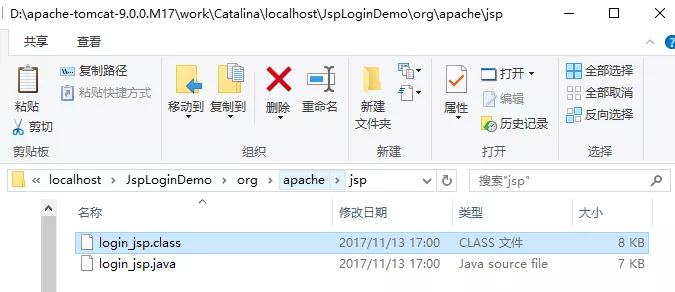

**1、什么是Servlet？**

可以从两个方面去看Servlet：

a、API：有一个接口servlet，它是servlet规范中定义的用来处理客户端请求的程序需要实现的顶级接口。

b、组件：服务器端用来处理客户端请求的组件，需要在web.xml文件中进行配置。

**2、Servlet的生命周期，并说出Servlet和CGI的区别？**

servlet有良好的生存期的定义，包括加载和实例化、初始化、处理请求以及服务结束。

这个生存期由javax.servlet.servlet接口中的init、service、destroy方法表达。

web容器加载servlet，生命周期开始。通过调用servlet的init()方法进行servlet的初始化。通过调用service()方法实现根据请求的不同调用不同的do**()方法。结束服务，web容器调用servlet的destroy()方法。

   

**区别：**

Servlet处于服务器进程中，它通过多线程运行service()方法，一个实例可以服务于多个请求，并且实例一般不会被销毁；而CGI对每个请求都产生一个新的进程，服务完成后就销毁，所有效率低于Servlet

## **3、Servlet接口中有哪些方法？**

Servlet接口定义了5个方法：

1. void init(ServletConfig config) throws ServletException
2. void service(ServletRequest req, ServletResponse resp) throws ServletException, java.io.IOException
3. void destory()
4. java.lang.String getServletInfo()
5. ServletConfig getServletConfig()

## **4、get和post请求的区别？**

a、get是用来从服务器上获取数据，而post是用来向服务器传递数据；

b、get将表单中数据按照variable=value的形式，添加到action所指向的URL后面，并且两者用"？"连接，变量之间用"&"连接；而post是将表单中的数据放在form的数据体中，按照变量与值对应的方式，传递到action所指定的URL。

c、get是不安全的，因为在传输过程中，数据是被放在请求的URL中;而post的所有操作对用户来说都是不可见的。

d、get传输的数据量小，这主要应为受url长度限制;而post可以传输大量的数据，所有上传文件只能用post提交。

e、get限制form表单的数据集必须为ASCII字符；而post支持整个IS01 0646字符集。

f、get是form表单的默认方法。

## **5、什么情况下调用doGet()和doPost()？**

默认情况是调用doGet()方法，JSP页面中的Form表单的method属性设置为post的时候，调用的为doPost()方法；为get的时候，调用deGet()方法。

## **6、转发（Forward）和重定向（Redirect）的区别？**

转发是服务器行为，重定向是客户端行为。

转发（Forword）


通过RequestDispatcher对象的forward（HttpServletRequest request,HttpServletResponse response）方法实现的。RequestDispatcher可以通过HttpServletRequest 的getRequestDispatcher()方法获得。例如下面的代码就是跳转到login_success.jsp页面。

```
request.getRequestDispatcher("login_success.jsp").forward(request, response);
```

重定向（Redirect） 是利用服务器返回的状态吗来实现的。客户端浏览器请求服务器的时候，服务器会返回一个状态码。服务器通过HttpServletRequestResponse的setStatus(int status)方法设置状态码。如果服务器返回301或者302，则浏览器会到新的网址重新请求该资源。

\1. 从地址栏显示来说

forward是服务器请求资源，服务器直接访问目标地址的URL，把那个URL的响应内容读取过来，然后把这些内容再发给浏览器。浏览器根本不知道服务器发送的内容从哪里来的，所以它的地址栏还是原来的地址。
redirect是服务端根据逻辑，发送一个状态码,告诉浏览器重新去请求那个地址，所以地址栏显示的是新的URL。

\2. 从数据共享来说

forward：转发页面和转发到的页面可以共享request里面的数据.
redirect：不能共享数据.

\3. 从运用地方来说

forward：一般用于用户登陆的时候,根据角色转发到相应的模块.
redirect：一般用于用户注销登陆时返回主页面和跳转到其它的网站等

\4. 从效率来说

forward：高.
redirect：低.

## **7、自动刷新（Refresh）**

自动刷新不仅可以实现一段时间之后自动跳转到另一个页面，还可以实现一段时间之后自动刷新本页面。Servlet中通过HttpServletResponse对象设置Header属性实现自动刷新例如：

```
Response.setHeader("Refresh","1000;URL=http://localhost:8080/servlet/example.htm");
```

其中1000为时间，单位为毫秒。URL指定就是要跳转的页面（如果设置自己的路径，就会实现没过一秒自动刷新本页面一次）

## **8、Servlet与线程安全**

Servlet不是线程安全的，多线程并发的读写会导致数据不同步的问题。 解决的办法是尽量不要定义name属性，而是要把name变量分别定义在doGet()和doPost()方法内。虽然使用synchronized(name){}语句块可以解决问题，但是会造成线程的等待，不是很科学的办法。
注意：多线程的并发的读写Servlet类属性会导致数据不同步。但是如果只是并发地读取属性而不写入，则不存在数据不同步的问题。因此Servlet里的只读属性最好定义为final类型的。

**9、JSP和Servlet有哪些相同点和不同点，他们之间的联系是什么？**

JSP是Servlet的扩展，本质上是Servlet的简易方式，更强调应用的外表表达。JSP编译后是"类Servlet"。Servlet和JSP最主要的不同点在于，Servlet的应用逻辑是在java文件中，并且完全从表示层中的HTML里分离开来。而JSP的情况是java和HTML可以组合成一个扩展名为.jsp的文件。JSP偏重于视图，Servlet偏重于业务逻辑。

## **10、JSP工作原理：**

JSP是一种Servlet，但是与HttpServlet的工作方式不太一样。HttpServlet是先由源代码编译为class文件后部署到服务器下，为先编译后部署。而JSP则是先部署后编译。JSP会在客户端第一次请求JSP文件时被编译为HttpJspPage类（接口Servlet的一个子类）。该类会被服务器临时存放在服务器工作目录里面。下面通过实例给大家介绍。


工程JspLoginDemo下有一个名为login.jsp的Jsp文件，把工程第一次部署到服务器上后访问这个Jsp文件，我们发现这个目录下多了下图这两个东东。
.class文件便是JSP对应的Servlet。编译完毕后再运行class文件来响应客户端请求。以后客户端访问login.jsp的时候，Tomcat将不再重新编译JSP文件，而是直接调用class文件来响应客户端请求。




由于JSP只会在客户端第一次请求的时候被编译 ，因此第一次请求JSP时会感觉比较慢，之后就会感觉快很多。如果把服务器保存的class文件删除，服务器也会重新编译JSP。

开发Web程序时经常需要修改JSP。Tomcat能够自动检测到JSP程序的改动。如果检测到JSP源代码发生了改动。Tomcat会在下次客户端请求JSP时重新编译JSP，而不需要重启Tomcat。这种自动检测功能是默认开启的，检测改动会消耗少量的时间，在部署Web应用的时候可以在web.xml中将它关掉。

## **11、Request对象的主要方法有哪些？**

- setAttribute(String name,Object)：设置名字为name的request 的参数值
- getAttribute(String name)：返回由name指定的属性值
- getAttributeNames()：返回request 对象所有属性的名字集合，结果是一个枚举的实例
- getCookies()：返回客户端的所有 Cookie 对象，结果是一个Cookie 数组
- getCharacterEncoding() ：返回请求中的字符编码方式 = getContentLength() ：返回请求的 Body的长度
- getHeader(String name) ：获得HTTP协议定义的文件头信息
- getHeaders(String name) ：返回指定名字的request Header 的所有值，结果是一个枚举的实例
- getHeaderNames() ：返回所以request Header 的名字，结果是一个枚举的实例
- getInputStream() ：返回请求的输入流，用于获得请求中的数据
- getMethod() ：获得客户端向服务器端传送数据的方法
- getParameter(String name) ：获得客户端传送给服务器端的有 name指定的参数值
- getParameterNames() ：获得客户端传送给服务器端的所有参数的名字，结果是一个枚举的实例
- getParameterValues(String name)：获得有name指定的参数的所有值
- getProtocol()：获取客户端向服务器端传送数据所依据的协议名称
- getQueryString() ：获得查询字符串
- getRequestURI() ：获取发出请求字符串的客户端地址
- getRemoteAddr()：获取客户端的 IP 地址
- getRemoteHost() ：获取客户端的名字
- getSession([Boolean create]) ：返回和请求相关 Session
- getServerName() ：获取服务器的名字
- getServletPath()：获取客户端所请求的脚本文件的路径
- getServerPort()：获取服务器的端口号
- removeAttribute(String name)：删除请求中的一个属性

## **12、request.getAttribute()和 request.getParameter()有何区别？**

a、request.getParameter()获取的类型是String；request.getAttribute()获取的类型是Object。

b、request.getPrameter()获取的是POST/GET传递的参数值和URL中的参数；request.getAttribute()获取的是对象容器中的数据值/对象。

c、request.setAttribute()和request.getAttribute()可以发送、接收对象；request.getParamter()只能接收字符串，官方不开放request.setParamter()（也就是没有这个方法）。

setAttribute()和getAttribute()的传参原理：

setAttribute()是应用服务器把这个对象放在该页面所对应的一块内存中去，当你的页面服务器重定向到另外一个页面时，应用服务器会把这块内存拷贝到另一个页面所对应的那块内存中。这个就可以通过getAttribute()获取到相应的参数值或者对象。

**13、JSP中动态include和静态include的区别？**

a、静态include：语法：<%@ include file="文件名" %>，相当于复制，编辑时将对应的文件包含进来，当内容变化时，不会再一次对其编译，不易维护。

b、动态include：语法：<jsp:include page="文件名">,能够自动检查被包含文件，当客户端对JSP文件进行请求时，会重新将对应的文件包含进来，进行实时的更新。

## **14、JSP有哪些内置对象？作用分别是什么？**

JSP一共有9个内置对象：

1. request：负责得到客户端请求的信息，对应类型：javax.servlet.http.HttpServletRequest
2. response:负责向客户端发出响应，对应类型：javax.servlet.http.HttpServletResponse
3. session:负责保存同一客户端一次会话过程中的一些信息，对应类型：javax.servlet.http.httpsession
4. out：负责管理对客户端的输出，对应类型：javax.serlvet.jsp.jspwriter
5. application:表示整个应用环境的信息，对应类型：javax.servlet.servletcontext
6. config:表示ServletConfig，对应类型：javax.servlet.servletconfig
7. exception:表示页面中发生的异常，可以通过它获得页面异常信息，对应类型：java.lang.exception
8. pagecontext:表示这个JSP页面上下文，对应类型：javax.servlet.jsp.pagecontext
9. page:表示当前JSP页面本身。

**15、JSP有哪些动作？作用分别是什么？**

JSP一共有以下6中基本动作：

1. JSP：include    （当页面被请求的时候引入一个文件）
2. JSP：forward    （将请求转到另一个页面）
3. JSP：useBean   （获得JavaBean的一个实例）
4. JSP：setProperty （设置JavaBean的属性）
5. JSP：getProperty （获得JavaBean的属性）
6. JSP：plugin     （根据浏览器类型为Java插件生成object或者embed两种标记）

## **16、JSP常用指令有哪些？**

**page、include、taglib**

a、page指令：定义页面的一些属性。

常用属性：

contentType="text/html;charset=utf-8";   向浏览器端输出数据的编码

pageEncoding="utf-8";               JSP编译成java文件时所用的编码

session="true"                     是否自动创建session

b、include指令：引入一个静态的JSP页面

c、taglib指令：引入一个标签库

## **17、讲解JSP中的四种作用域**

JSP中的四种作用域包括page、request、session和application，具体来说：

a、page是代表一个页面相关的对象和属性。一个页面由一个编译好的java servlet类（可以带有include指令，但不可以带有include动作）表示。这既包括servlet又包括编译成servlet的jsp页面。

b、request是代表与web客户机发出的一个请求相关的对象和属性。一个请求可能跨越多个页面，涉及多个web组件（由于forware指令和include动作的关系）

c、session是代表与用于某个web客户机的一个用户体验相关的对象和属性。一个web回话也可以经常跨域多个客户机请求。

d、application是代表与整个web应用程序相关的对象和属性。这实质上是跨域整个web应用程序，包括多个页面、请求和回话的一个全局作用域。

## **18、如何实现JSP或Servlet的单线程模式？**

在JSP中使用page指令进行设置，具体代码如下：

```
<%@page isThreadSafe="false"%>
```

对于Servlet，可以让自定义的Servlet实现SingleThreadModel标识接口。

说明：如果将JSP或Servlet设置成单线程工作模式，会导致每个请求创建一个Servlet实例，这种实践将导致严重的性能问题（服务器的内存压力很大，还会导致频繁的垃圾回收），所以通常情况下并不会这么做。

**19、JSP乱码如何解决？**

a、JSP页面乱码：<%@page contentType="text/html;charset=utf-8" %>

b、表单提交时出现乱码：request.setCharacterEncoding("utf-8");

c、数据库出现乱码：jdbc:mysql://localhost:3306:/user?useSSL=false&useUnicode=true&characterEncoding=utf-8;

其实我一般的处理的方法就是配置一个过滤器对每个JSP页面进行字符集处理。

## **20、实现会话跟踪的技术有哪些？**

**1. 使用Cookie**

向客户端发送Cookie

```
Cookie c =new Cookie("name","value"); //创建Cookie 
c.setMaxAge(60*60*24); //设置最大时效，此处设置的最大时效为一天
response.addCookie(c); //把Cookie放入到HTTP响应中

```

从客户端读取Cookie

```
String name ="name"; 
Cookie[]cookies =request.getCookies(); 
if(cookies !=null){ 
  for(int i= 0;i<cookies.length;i++){ 
   Cookie cookie =cookies[i]; 
   if(name.equals(cookis.getName())) 
   //something is here. 
   //you can get the value 
   cookie.getValue(); 
      
  }
}

```

优点: 数据可以持久保存，不需要服务器资源，简单，基于文本的Key-Value

缺点: 大小受到限制，用户可以禁用Cookie功能，由于保存在本地，有一定的安全风险。

**2. URL 重写**

在URL中添加用户会话的信息作为请求的参数，或者将唯一的会话ID添加到URL结尾以标识一个会话。

优点： 在Cookie被禁用的时候依然可以使用

缺点： 必须对网站的URL进行编码，所有页面必须动态生成，不能用预先记录下来的URL进行访问。

**3. 隐藏的表单域**

```
<input type="hidden" name ="session" value="..."/>
```

优点： Cookie被禁时可以使用

缺点： 所有页面必须是表单提交之后的结果。

**4. HttpSession**

在所有会话跟踪技术中，HttpSession对象是最强大也是功能最多的。当一个用户第一次访问某个网站时会自动创建 HttpSession，每个用户可以访问他自己的HttpSession。可以通过HttpServletRequest对象的getSession方 法获得HttpSession，通过HttpSession的setAttribute方法可以将一个值放在HttpSession中，通过调用 HttpSession对象的getAttribute方法，同时传入属性名就可以获取保存在HttpSession中的对象。与上面三种方式不同的 是，HttpSession放在服务器的内存中，因此不要将过大的对象放在里面，即使目前的Servlet容器可以在内存将满时将HttpSession 中的对象移到其他存储设备中，但是这样势必影响性能。添加到HttpSession中的值可以是任意Java对象，这个对象最好实现了 Serializable接口，这样Servlet容器在必要的时候可以将其序列化到文件中，否则在序列化时就会出现异常。

## **21、Cookie和Session的的区别？**

1. 由于HTTP协议是无状态的协议，所以服务端需要记录用户的状态时，就需要用某种机制来识具体的用户，这个机制就是Session.典型的场景比如购物车，当你点击下单按钮时，由于HTTP协议无状态，所以并不知道是哪个用户操作的，所以服务端要为特定的用户创建了特定的Session，用用于标识这个用户，并且跟踪用户，这样才知道购物车里面有几本书。这个Session是保存在服务端的，有一个唯一标识。在服务端保存Session的方法很多，内存、数据库、文件都有。集群的时候也要考虑Session的转移，在大型的网站，一般会有专门的Session服务器集群，用来保存用户会话，这个时候 Session 信息都是放在内存的，使用一些缓存服务比如Memcached之类的来放 Session。
2. 思考一下服务端如何识别特定的客户？这个时候Cookie就登场了。每次HTTP请求的时候，客户端都会发送相应的Cookie信息到服务端。实际上大多数的应用都是用 Cookie 来实现Session跟踪的，第一次创建Session的时候，服务端会在HTTP协议中告诉客户端，需要在 Cookie 里面记录一个Session ID，以后每次请求把这个会话ID发送到服务器，我就知道你是谁了。有人问，如果客户端的浏览器禁用了 Cookie 怎么办？一般这种情况下，会使用一种叫做URL重写的技术来进行会话跟踪，即每次HTTP交互，URL后面都会被附加上一个诸如 sid=xxxxx 这样的参数，服务端据此来识别用户。
3. Cookie其实还可以用在一些方便用户的场景下，设想你某次登陆过一个网站，下次登录的时候不想再次输入账号了，怎么办？这个信息可以写到Cookie里面，访问网站的时候，网站页面的脚本可以读取这个信息，就自动帮你把用户名给填了，能够方便一下用户。这也是Cookie名称的由来，给用户的一点甜头。所以，总结一下：Session是在服务端保存的一个数据结构，用来跟踪用户的状态，这个数据可以保存在集群、数据库、文件中；Cookie是客户端保存用户信息的一种机制，用来记录用户的一些信息，也是实现Session的一种方式。

**22、什么是Tomcat？**

Tomcat是一种web服务器，java编写的web项目可以部署在上面，用户在客户端请求时，都是将请求发到Tomcat上，Tomcat在将请求发到对应的项目上。

**23、 详细描述MVC**

基于java的web应用系统采用MVC设计模型，即用Model（模型）、View（视图）和Controller（控制）分离设计，这是目前web应用服务系统的主流设置方向。

Model：处理业务逻辑的模块。

View：负责页面显示，显示Model的处理结果给用户，主要实现数据到页面的转换过程。

Controller：负责每个请求的分发，把Form数据传递给Model进行处理，处理完成后，把处理结果返回给相应的View显示给用户。


### 1、JSP 和 Servlet 有什么区别？

JSP 经编译后就变成了Servlet（JSP 的本质就是 Servlet，JVM只能识别 Java 的类，不能识别 JSP 的代码，Web 容器将JSP 的代码编译成 JVM 能够识别的 Java 类）。
JSP 更擅长表现于页面显示，Servlet 更擅长于逻辑控制。
Servlet 中没有内置对象，JSP 中的内置对象都是必须通过 HttpServletRequest 对象，HttpServletResponse 对象以及HttpServlet 对象得到。
JSP 是Servlet 的一种简化，使用Jsp只需要完成程序员需要输出到客户端的内容，JSP 中的 Java 脚本如何镶嵌到一个类中，由 JSP 容器完成。而Servlet 则是个完整的 Java 类，这个类的 Service 方法用于生成对客户端的响应。
注：JSP 现在公司用的少了，面试不作为重点，但是 Servlet 还是要了解一些东西的！

### 2、说一下 jsp 的 4 种作用域？

page 代表与一个页面相关的对象和属性
request 代表与Web客户机发出的一个请求相关的对象和属性。一个请求可能跨越多个页面，涉及多个Web组件；需要在页面显示的临时数据可以置于此作用域。
session 代表与某个用户与服务器建立的一次会话相关的对象和属性。跟某个用户相关的数据应该放在用户自己的session中。
application 代表与整个Web应用程序相关的对象和属性，它实质上是跨越整个Web应用程序，包括多个页面、请求和会话的一个全局作用域。
3、请说一下 session 的工作原理？
Session 是一个存在服务器上的类似于一个散列表格式的文件。里面存有我们需要的信息，在我们需要用的时候可以从里面取出来。类似于一个大号的 map (服务器端的一个集合)，里面的 键(key) 存储的是用户的 sessionid，用户向服务器发送请求的时候会带上这个sessionid，这时就可以从中取出对应的值了。

### 4、session 和 cookie 有什么区别？

Cookie 和 Session 的区别？

Cookie 的概念：客户端会话技术，服务器端将数据保存到客户端。

Session 的概念：服务器端会话技术，在一次会话的多次请求间共享数据，（客户端）将数据保存在服务器端的对象中（HttpSession）。

存储位置不同：Cookie 存储在客户端浏览器，Session 存储在服务器端。
存储容量不同：Cookie 存储数据的容量很小（通常为 4KB 左右），对同一个域名下的总 Cookie 数量也有限制(20个)，而 Session 的存储容量较大。
安全性不同：Cookie 的安全性较低，而 Session 安全性较高。
Cookie 和 Session 的生命周期不同：

当浏览器关闭后，Cookie 数据被销毁。
当服务器关闭时，Session 数据被销毁。或者 Session 对象调用invalidate() 主动销毁，也可以设置定时销毁 Session对象。
Cookie 和 Session 的使用案例：

Cookie ：

记住上一次访问时间。
在不登录的情况下，完成服务器对客户端的身份识别。
存少量的不太敏感的数据。
Session：

存储登录验证码。
用户登录的信息。

### 5、如果客户端禁止 cookie 能实现 session 还能用吗？

Cookie 与 Session，一般认为是两个独立的东西，Session 采用的是在服务器端保持状态的方案，而 Cookie 采用的是在客户端保持状态的方案。但为什么禁用 Cookie 就不能得到Session呢？

因为 Session 是用Session ID 来确定当前对话所对应的服务器 Session，而Session ID 是通过 Cookie 来传递的，禁用 Cookie 相当于失去了Session ID，也就得不到服务器端的 Session了。

总结一句话（来自评论区大佬的反馈）：SessionID就是在Cookie里面，禁用了Cookie就得不到SessionID，就拿不到Session。

这里在推荐一篇文章：cookie被禁止后怎样使用session的解决方案

### 6、forward 和 redirect 的区别？

forward 请求转发是一次请求，redirect 重定向是两次请求；
重定向的第二个请求一定是 GET 请求；
请求转发的目标只能是本应用中的资源，重定向的目标可以是其他应用；
请求转发后浏览器地址栏不会有变化，而重定向会有变化，因为重定向是两个请求；
请求转发对Servlet01和Servlet02的请求方法是相同的，即要么都是GET，要么都是POST，因为请求转发是一个请求；
直接上图更好对比区别：


### 7、什么是 XSS 攻击，如何避免？

XSS 攻击，即跨站脚本攻击（Cross Site Scripting），它是 web 程序中常见的漏洞。

原理：

攻击者往 web 页面里插入恶意的 HTML 代码（JavaScript、Css、Html 标签等），当某个用户浏览该页面时，嵌入其中的 HTML 代码会被执行，从而达到恶意攻击用户的目的。如盗取用户 cookie 执行一系列操作，破坏页面结构、重定向到其他网站等。

案例：恶意的在某个网站的登录页面加 HTML 代码（JavaScript、Css、Html 标签等），当用户输入账号密码登录后，这段恶意的 HTML 代码会被执行，从而获取用户的账号密码信息。

预防思路 ：

web 页面中可由用户输入的地方，对输入的数据转义、过滤处理。
后台输出页面的时候，也需要对输出内容进行转义、过滤处理（因为攻击者可能通过其他方式把恶意脚本写入数据库）。
前端对 html 标签属性、css 属性赋值的地方进行校验。
参考文章：什么是 XSS 攻击，如何避免？

### 8、什么是 CSRF 攻击，如何避免？

CSRF：Cross Site Request Forgery（跨站点请求伪造）。

CSRF 攻击者在用户已经登录目标网站之后，诱使用户访问一个攻击页面，利用目标网站对用户的信任，以用户身份在攻击页面对目标网站发起伪造用户操作的请求，达到攻击目的。

案例：就好比用户A，在自己电脑上通过自己的账号密码登录了 B 网站（登录用户身份标识被 XX 网站信任），当 A 在浏览网页时候，不经意间打开了钓鱼网站 X，这时候 X 就可借着 B 网站对用户 A 的信任标识，以用户 A 的身份去访问 B 网站，并对其进行攻击！

预防方法：

添加并验证 token
添加自定义 http 请求头
使用 post 请求
敏感操作添加验证码
参考文章：什么是 CSRF 攻击，如何避免？

### 9、说下原生 jdbc 操作数据库流程？

第一步： Class.forName()加载数据库连接驱动；
第二步： DriverManager.getConnection()获取数据连接对象；
第三步：根据 SQL 获取 sql 会话对象，有 2 种方式 Statement、 PreparedStatement ；
第四步：执行 SQL 处理结果集，执行 SQL 前如果有参数值就设置参数值 setXxx()；
第五步：关闭结果集、关闭会话、关闭连接。

### 10、如何避免 sql 注入？

预编译 SQL（使用 PreparedStatement），参数化查询方式，避免 SQL 拼接。
校验参数的数据格式是否合法（可以使用正则或特殊字符的判断）。
对进入数据库的特殊字符进行转义处理，或编码转换。