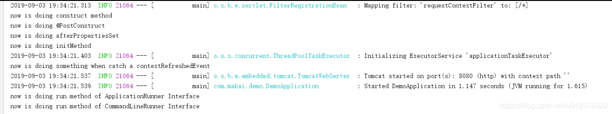

## SpringBoot知识整理

### 1、Spring Boot 如何解决项目启动时初始化资源

SpringBoot提供了多种方法可实现在启动过程中初始化资源

* 使用注解@PostConstruct

* 实现InitializingBean接口

* 实现CommandLineRunner接口

* 实现ApplicationRunner接口

* 监听Spring事件ContextRefreshedEvent

以上5个方法的执行顺序为：

> Bean初始化-> 依赖注入-> @PostConstruct-> InitializingBean接口-> ContextRefreshedEvent->  ApplicationRunner接口->  CommandLineRunner接口

以下代码在同一个Bean实现以上多种初始化方法，并在每个阶段打印日志信息。

```java

import org.springframework.beans.factory.InitializingBean;
import org.springframework.boot.ApplicationArguments;
import org.springframework.boot.ApplicationRunner;
import org.springframework.boot.CommandLineRunner;
import org.springframework.context.ApplicationListener;
import org.springframework.context.event.ContextRefreshedEvent;

import javax.annotation.PostConstruct;


public class InitClass implements InitializingBean, CommandLineRunner, ApplicationRunner, ApplicationListener<ContextRefreshedEvent> {

    public InitClass() {
        System.out.println("now is doing construct method");
    }

    //bean初始化后执行
    @PostConstruct
    public void postConstruct() {
        System.out.println("now is doing @PostConstruct");
    }

    //bean指定initMethod方法，bean初始化后执行
    public void initMethod() {
        System.out.println("now is doing initMethod");
    }

    //实现ApplicationRunner，bean初始化后执行
    @Override
    public void afterPropertiesSet() throws Exception {
        System.out.println("now is doing afterPropertiesSet");
    }

    //实现CommandLineRunner，SpringBoot启动后后执行
    @Override
    public void run(ApplicationArguments args) throws Exception {
        System.out.println("now is doing run method of ApplicationRunner Interface");
    }

    //实现CommandLineRunner，SpringBoot启动后后执行
    @Override
    public void run(String... args) throws Exception {
        System.out.println("now is doing run method of CommandLineRunner Interface");
    }

    //监听SpringBean加载事件，在springboot 初始化完成时执行
    @Override
    public void onApplicationEvent(ContextRefreshedEvent contextRefreshedEvent) {
        System.out.println("now is doing something when catch a contextRefreshedEvent");
    }
}

```


```java

import com.makai.initorder.InitClass;
import org.springframework.boot.SpringApplication;
import org.springframework.boot.autoconfigure.SpringBootApplication;
import org.springframework.context.annotation.Bean;
import org.springframework.context.annotation.ComponentScan;

@SpringBootApplication
@ComponentScan({"com.makai"})
public class DemoApplication {

    public static void main(String[] args) {
        SpringApplication.run(DemoApplication.class, args);

    }

    @Bean(initMethod = "initMethod")
    public InitClass initClass(){
        return new InitClass();
    }
}

```

启动过程中打印如下，可以验证各个接口的执行顺序。实际应用中按需选择。



____


#### 1、@PostConstruct 注解

从Java EE5规范开始，Servlet中增加了两个影响Servlet生命周期的注解，@PostConstruct和@PreDestroy，这两个注解被用来修饰一个非静态的void（）方法。@PostConstruct会在所在类的构造函数执行之后执行，在init()方法执行之前执行。(@PreDestroy注解的方法会在这个类的destory()方法执行之后执行.）

使用示例：在Spring容器加载之后，启动定时任务读取数据库配置的。在这里我使用@PostConstruct 指定了需要启动的方法。

@Component // 注意 这里必须有
public class StartAllJobInit {
    protected Logger logger = LoggerFactory.getLogger(getClass().getName());
    @Autowired
    JobInfoService jobInfoService;

```java
@Autowired
JobTaskUtil jobTaskUtil;
 
@PostConstruct // 构造函数之后执行
public void init(){
    System.out.println("容器启动后执行");
    startJob();
}
 
public void startJob() {
    List<JobInfoBO> list = jobInfoService.findList();
    for (JobInfoBO jobinfo :list) {
        try {
            if("0".equals(jobinfo.getStartWithrun())){
                logger.info("任务{}未设置自动启动。", jobinfo.getJobName());
                jobInfoService.updateJobStatus(jobinfo.getId(), BasicsConstantManual.BASICS_SYS_JOB_STATUS_STOP);
            }else{
                logger.info("任务{}设置了自动启动。", jobinfo.getJobName());
                jobTaskUtil.addOrUpdateJob(jobinfo);
                jobInfoService.updateJobStatus(jobinfo.getId(), BasicsConstantManual.BASICS_SYS_JOB_STATUS_STARTING);
            }
        } catch (SchedulerException e) {
            logger.error("执行定时任务出错，任务名称 {} ", jobinfo.getJobName());
        }
    }
	}
}
```
#### 2、实现org.springframework.beans.factory.InitializingBean接口并重写 afterPropertiesSet()方法 

InitializingBean接口只包含一个方法afterPropertiesSet()，凡是继承了InitializingBean接口的类，在初始化时都会调用这方法;

使用方法分为三个步骤：

*  被spring管理 @Component       

* 实现InitializingBean接口       

* 重写afterPropertiesSet方法

    @Component
    public class InitializationBeanTest implements InitializingBean{
        private static final Logger LOG = LoggerFactory.getLogger(InitializationBeanTest.class);
    @Override
    public void afterPropertiesSet() throws Exception {
        LOG.info("InitializingBean 开始了。。。");
        //初始化操作
    	}
    }
#### 3、实现`CommandLineRunner`接口

在我们实际工作中，总会遇到这样需求，在项目启动的时候需要做一些初始化的操作，比如初始化线程池，提前加载好加密证书等。今天就给大家介绍一个 Spring Boot 神器，专门帮助大家解决项目启动初始化资源操作。

这个神器就是 `CommandLineRunner`，`CommandLineRunner` 接口的 `Component` 会在所有 `Spring Beans `都初始化之后，`SpringApplication.run() `之前执行，非常适合在应用程序启动之初进行一些数据初始化的工作。

接下来我们就运用案例测试它如何使用，在测试之前在启动类加两行打印提示，方便我们识别 `CommandLineRunner` 的执行时机。

```java
@SpringBootApplication
public class CommandLineRunnerApplication {
	public static void main(String[] args) {
		System.out.println("The service to start.");
		SpringApplication.run(CommandLineRunnerApplication.class, args);
		System.out.println("The service has started.");
	}
}

```

接下来我们直接创建一个类继承 `CommandLineRunner` ，并实现它的 `run()` 方法。

```java
@Component
public class Runner implements CommandLineRunner {
    @Override
    public void run(String... args) throws Exception {
        System.out.println("The Runner start to initialize ...");
    }
}

```

我们在 `run()` 方法中打印了一些参数来看出它的执行时机。完成之后启动项目进行测试：

```
...
The service to start.
 
  .   ____          _            __ _ _
 /\\ / ___'_ __ _ _(_)_ __  __ _ \ \ \ \
( ( )\___ | '_ | '_| | '_ \/ _` | \ \ \ \
 \\/  ___)| |_)| | | | | || (_| |  ) ) ) )
  '  |____| .__|_| |_|_| |_\__, | / / / /
 =========|_|==============|___/=/_/_/_/
 :: Spring Boot ::        (v2.0.0.RELEASE)
...
2018-04-21 22:21:34.706  INFO 27016 --- [           main] o.s.b.w.embedded.tomcat.TomcatWebServer  : Tomcat started on port(s): 8080 (http) with context path ''
2018-04-21 22:21:34.710  INFO 27016 --- [           main] com.neo.CommandLineRunnerApplication     : Started CommandLineRunnerApplication in 3.796 seconds (JVM running for 5.128)
The Runner start to initialize ...
The service has started.

```

根据控制台的打印信息我们可以看出 `CommandLineRunner` 中的方法会在 Spring Boot 容器加载之后执行，执行完成后项目启动完成。

如果我们在启动容器的时候需要初始化很多资源，并且初始化资源相互之间有序，那如何保证不同的 `CommandLineRunner`的执行顺序呢？Spring Boot 也给出了解决方案。那就是使用 `@Order` 注解。

我们创建两个 `CommandLineRunner` 的实现类来进行测试：

第一个实现类：

```java
@Component
@Order(1)
public class OrderRunner1 implements CommandLineRunner {
    @Override
    public void run(String... args) throws Exception {
        System.out.println("The OrderRunner1 start to initialize ...");
    }
}

```

第二个实现类：

```java
@Component
@Order(2)
public class OrderRunner2 implements CommandLineRunner {
    @Override
    public void run(String... args) throws Exception {
        System.out.println("The OrderRunner2 start to initialize ...");
    }
}

```

添加完成之后重新启动，观察执行顺序：

```
...
The service to start.
 
  .   ____          _            __ _ _
 /\\ / ___'_ __ _ _(_)_ __  __ _ \ \ \ \
( ( )\___ | '_ | '_| | '_ \/ _` | \ \ \ \
 \\/  ___)| |_)| | | | | || (_| |  ) ) ) )
  '  |____| .__|_| |_|_| |_\__, | / / / /
 =========|_|==============|___/=/_/_/_/
 :: Spring Boot ::        (v2.0.0.RELEASE)
...
2018-04-21 22:21:34.706  INFO 27016 --- [           main] o.s.b.w.embedded.tomcat.TomcatWebServer  : Tomcat started on port(s): 8080 (http) with context path ''
2018-04-21 22:21:34.710  INFO 27016 --- [           main] com.neo.CommandLineRunnerApplication     : Started CommandLineRunnerApplication in 3.796 seconds (JVM running for 5.128)
The OrderRunner1 start to initialize ...
The OrderRunner2 start to initialize ...
The Runner start to initialize ...
The service has started.

```

通过控制台的输出我们发现，添加 `@Order` 注解的实现类最先执行，并且`@Order()`里面的值越小启动越早。

在实践中，使用`ApplicationRunner`也可以达到相同的目的，两着差别不大。看来使用 Spring Boot 解决初始化资源的问题非常简单。

#### 4、实现 @ApplicationRunner 接口并重写run()方法

#### 5、使用ContextRefreshedEvent事件(上下文件刷新事件)

ContextRefreshedEvent是Spring的ApplicationContextEvent一个实现，此事件会在Spring容器初始化完成后以及刷新时触发。

在这里我需要在springboot程序启动之后加载配置信息和字典信息到Redis缓存中去，我可以这样写：

@Component // 注意 这个也是必须有的注解 三种都需要 使spring扫描到这个类并交给它管理
public class InitRedisCache implements ApplicationListener<ContextRefreshedEvent> {
    static final Logger logger = LoggerFactory.getLogger(InitRedisCache.class);

```java
@Autowired
private SysConfigService sysConfigService;
 
@Autowired
private SysDictService sysDictService;
 
@Override
public void onApplicationEvent(ContextRefreshedEvent contextRefreshedEvent) {
    logger.info("-------加载配置信息 start-------");
    sysConfigService.loadConfigIntoRedis();
    logger.info("-------加载配置信息 end-------");
 
    logger.info("-------加载字典信息 start-------");
    sysDictService.loadDictIntoRedis();
    logger.info("-------加载字典信息 end-------");
	}
}
```
### 2、SpringBoot的核心注解：

**1、@SpringBootApplication**

这是 Spring Boot 最最最核心的注解，用在 SpringBoot 主类上，标识这是一个 Spring Boot 应用，用来开启 Spring Boot 的各项能力。

其实这个注解就是 `@SpringBootConfiguration`、`@EnableAutoConfiguration`、`@ComponentScan` 这三个注解的组合，也可以用这三个注解来代替 `@SpringBootApplication`注解。

```java 
@Target(ElementType.TYPE)
@Retention(RetentionPolicy.RUNTIME)
@Documented
@Inherited
@SpringBootConfiguration
@EnableAutoConfiguration
@ComponentScan(excludeFilters = { @Filter(type = FilterType.CUSTOM, classes = TypeExcludeFilter.class),
		@Filter(type = FilterType.CUSTOM, classes = AutoConfigurationExcludeFilter.class) })
public @interface SpringBootApplication {}
```

>* SpringBootConfiguration:
>
>  * 除了，原来的那些注解外。就多了一个@Configuration注解。它是让我们能够去注册一些额外的Bean，并且导入一些额外的配置。@Configuration还有一个作用就是把该类变成一个配置类，不需要额外的XML进行配置。所以@SpringBootConfiguration就相当于@Configuration。
>
>* @EnableAutoConfiguration
>
>  @AutoConfigurationPackage，@Import(AutoConfigurationImportSelector.class)
>  先来说一下这两个注解的作用。
>
>  * @AutoConfigurationPackage：让包中的类以及子包中的类能够被自动扫描到spring容器中。
>  * @Import(AutoConfigurationImportSelector.class)：这个是自动配置的核心，我们说自动配置，那他到底帮我们配置了什么，怎么配置的？我们就来看看这个注解：`AutoConfigurationImportSelector`重要
>  * @EnableAutoConfiguration主要作用就是让你自动去配置，但并不是所有都是创建好的，是根据你程序去进行决定。
>
>* ComponentScan
>  *  扫描包，放入spring容器
>
>

**2、@EnableAutoConfiguration**

允许 Spring Boot 自动配置注解，开启这个注解之后，Spring Boot 就能根据当前类路径下的包或者类来配置 Spring Bean。

如：当前类路径下有 Mybatis 这个 JAR 包，`MybatisAutoConfiguration` 注解就能根据相关参数来配置 Mybatis 的各个 Spring Bean。

**3、@Configuration**

这是 Spring 3.0 添加的一个注解，用来代替 applicationContext.xml 配置文件，所有这个配置文件里面能做到的事情都可以通过这个注解所在类来进行注册。

**4、@SpringBootConfiguration**

这个注解就是 @Configuration 注解的变体，只是用来修饰是 Spring Boot 配置而已，或者可利于 Spring Boot 后续的扩展。

**5、@ComponentScan**

这是 Spring 3.1 添加的一个注解，用来代替配置文件中的 component-scan 配置，开启组件扫描，即自动扫描包路径下的 @Component 注解进行注册 bean 实例到 context 中。

前面 5 个注解可以在Java技术栈的这篇文章《[Spring Boot 最核心的 3 个注解详解](https://link.zhihu.com/?target=https%3A//mp.weixin.qq.com/s/kNvy_0jb4oJtYdaxryq5xg)》中了解更多细节的。

**6、@Conditional**

这是 Spring 4.0 添加的新注解，用来标识一个 Spring Bean 或者 Configuration 配置文件，当满足指定的条件才开启配置。

**7、@ConditionalOnBean**

组合 `@Conditional` 注解，当容器中有指定的 Bean 才开启配置。

**8、@ConditionalOnMissingBean**

组合 `@Conditional` 注解，和 `@ConditionalOnBean` 注解相反，当容器中没有指定的 Bean 才开启配置。

**9、@ConditionalOnClass**

组合 `@Conditional` 注解，当容器中有指定的 Class 才开启配置。

**10、@ConditionalOnMissingClass**

组合 `@Conditional` 注解，和 `@ConditionalOnMissingClass` 注解相反，当容器中没有指定的 Class 才开启配置。

**11、@ConditionalOnWebApplication**

组合 `@Conditional` 注解，当前项目类型是 WEB 项目才开启配置。

当前项目有以下 3 种类型。

```text
enum Type {

    /**
     * Any web application will match.
     */
    ANY,

    /**
     * Only servlet-based web application will match.
     */
    SERVLET,

    /**
     * Only reactive-based web application will match.
     */
    REACTIVE

}
```

**12、@ConditionalOnNotWebApplication**

组合 `@Conditional` 注解，和 `@ConditionalOnWebApplication` 注解相反，当前项目类型不是 WEB 项目才开启配置。

**13、@ConditionalOnProperty**

组合 `@Conditional` 注解，当指定的属性有指定的值时才开启配置。

**14、@ConditionalOnExpression**

组合 `@Conditional` 注解，当 SpEL 表达式为 true 时才开启配置。

**15、@ConditionalOnJava**

组合 `@Conditional` 注解，当运行的 Java JVM 在指定的版本范围时才开启配置。

**16、@ConditionalOnResource**

组合 `@Conditional` 注解，当类路径下有指定的资源才开启配置。

**17、@ConditionalOnJndi**

组合 `@Conditional` 注解，当指定的 JNDI 存在时才开启配置。

**18、@ConditionalOnCloudPlatform**

组合 `@Conditional` 注解，当指定的云平台激活时才开启配置。

**19、@ConditionalOnSingleCandidate**

组合 `@Conditional` 注解，当指定的 class 在容器中只有一个 Bean，或者同时有多个但为首选时才开启配置。

**20、@ConfigurationProperties**

用来加载额外的配置（如 .properties 文件），可用在 `@Configuration` 注解类，或者 `@Bean`注解方法上面。

关于这个注解的用法可以参考Java技术栈《 [Spring Boot读取配置的几种方式](https://link.zhihu.com/?target=https%3A//mp.weixin.qq.com/s/aen2PIh0ut-BSHad-Bw7hg)》这篇文章。

**21、@EnableConfigurationProperties**

一般要配合 `@ConfigurationProperties` 注解使用，用来开启对 `@ConfigurationProperties` 注解配置 Bean 的支持。

**22、@AutoConfigureAfter**

用在自动配置类上面，表示该自动配置类需要在另外指定的自动配置类配置完之后。

如 Mybatis 的自动配置类，需要在数据源自动配置类之后。

```text
@AutoConfigureAfter(DataSourceAutoConfiguration.class)
public class MybatisAutoConfiguration {
```

**23、@AutoConfigureBefore**

这个和 `@AutoConfigureAfter` 注解使用相反，表示该自动配置类需要在另外指定的自动配置类配置之前。

**24、@Import**

这是 Spring 3.0 添加的新注解，用来导入一个或者多个 `@Configuration` 注解修饰的类，这在 Spring Boot 里面应用很多。

**25、@ImportResource**

这是 Spring 3.0 添加的新注解，用来导入一个或者多个 Spring 配置文件，这对 Spring Boot 兼容老项目非常有用，因为有些配置无法通过 Java Config 的形式来配置就只能用这个注解来导入。