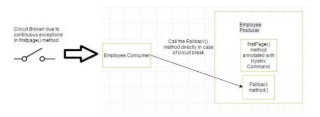
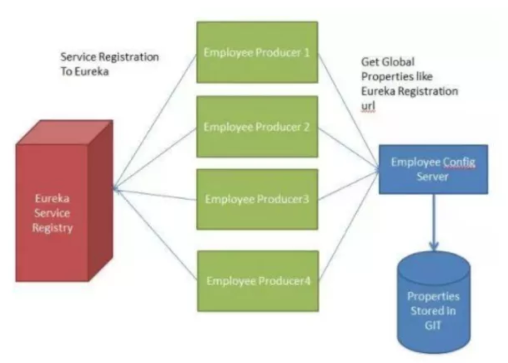
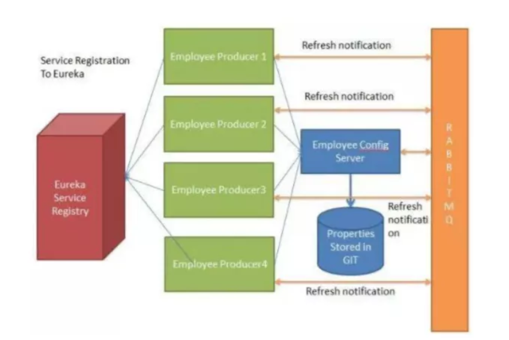
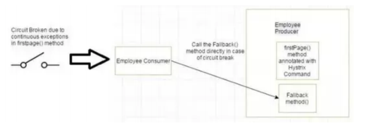

## Spring Cloud面试题万字解析（2020面试必备）

[程序员追风](javascript:void(0);) *2020-05-11*

***\*1、什么是 Spring Cloud\**\**？\****


Spring cloud 流应用程序启动器是 于 Spring Boot 的 Spring 集成应用程序，提供与外部系统的集成。Spring cloud Task，一个生命周期短暂的微服务框架，用于快速构建执行有限数据处理的应用程序。


## **2、使用 Spring Cloud 有什么优势？**

使用 Spring Boot 开发分布式微服务时，我们面临以下问题

（1）与分布式系统相关的复杂性-这种开销包括网络问题，延迟开销，带宽问题，安全问题。

（2）服务发现-服务发现工具管理群集中的流程和服务如何查找和互相交谈。它涉及一个服务目录，在该目录中注册服务，然后能够查找并连接到该目录中的服务。

（3）冗余-分布式系统中的冗余问题。

（4）负载平衡 --负载平衡改善跨多个计算资源的工作负荷，诸如计算机，计算机集群，网络链路，中央处理单元，或磁盘驱动器的分布。

（5）性能-问题 于各种运营开销导致的性能问题。

（6）部署复杂性 evops 技能的要求。

## **3、服务注册和发现是什么意思？Spring Cloud 如何实现？**

当我们开始一个项目时，我们通常在属性文件中进行所有的配置。随着越来越多的服务开发和部署，添加和修改这些属性变得更加复杂。有些服务可能会下降，而某些位置可能会发生变化。手动更改属性可能会产生问题。Eureka 服务注册和发现可以在这种情况下提供帮助。由于所有服务都在 Eureka 服务器上注册并通过调用 Eureka 服务器完成查找，因此无需处理服务地点的任何更改和处理。

## **4、负载平衡的意义什么？**

在计算中，负载平衡可以改善跨计算机，计算机集群，网络链接，中央处理单元或磁盘驱动器等多种计算资源的工作负载分布。负载平衡旨在优化资源使用，最大化吞吐量，最小化响应时间并避免任何单一资源的过载。使用多个组件进行负载平衡而不是单个组件可能会通过冗余来提高可靠性和可用性。负载平衡通常涉及专用软件或硬件，例如多层交换机或域名系统服务器进程。

## 5、什么是 Hystrix？它如何实现容错？

Hystrix 是一个延迟和容错库，旨在隔离远程系统，服务和第三方库的访问点，当出现故障是不可避免的故障时，停止级联故障并在复杂的分布式系统中实现弹性。通常对于使用微服 构开发的系统，涉及到许多微服务。这些微服务彼此协作。思考以下微服务


假设如果上图中的微服务 9 失败了，那么使用传统方法我们将传播一个异常。但这仍然会导致整个系统崩溃。随着微服务数量的增加，这个问题变得更加复杂。微服务的数量可以高达 1000.这是 hystrix 出现的地方 我们将使 Hystrix 在这种情况下的 Fallback 方法功能。我们有两个服务 employee-consumer 使用由 employee-consumer 公开的服务。简化图如下所示


现在假设由于 原因，employee-producer 公开的服务会抛出异常。我们在这种情况下使用 Hystrix定义了一个回退方法。这种后备方法应该具有与公开服务相同的返回类型。如果暴露服务中出现异常，则回退方法将返回一些值。

## 6、什么是 Hystrix 断路器？我们需要它吗？

由于某些原因，employee-consumer 公开服务会引发异常。在这种情况下使用Hystrix 我们定义了一个回退方法。如果在公开服务中发生异常，则回退方法返回一些默认值。


如果 firstPage method() 中的异常继续发生，则 Hystrix 电 ，并且员工使用者将一起跳过firtsPage 方法，并直接调用回退方法。断路器的目的是给第一 方法或第一页方法可能调用的其他方法留出时间，并导致异常恢复。可能发生的情况是，在负载较小的情况下，导致异常的问题有更好的恢复机会 。



## 7、什么是 Netflix Feign？它的优点是什么？

Feign 是受到 Retrofit，JAXRS-2.0 和 WebSocket 启发的 java 客户端联编程序。Feign 的第一个目标是将约束分母的复杂性统一到 http apis，而不考虑其稳定性。在 employee-consumer 的例子中，我们使用了 emplo e-producer 使用 REST模板公开的 REST 服务。

但是我们必须编写大量代码才能执行以下步骤

1、使用功能区进行负载平衡。

2、获取服务实例，然后获取基本 URL。

3、利用 REST 模板来使用服务。前面的代码如下

```
@Controllerpublic class ConsumerControllerClient {
	@Autowired
	private LoadBalancerClient loadBalancer;
	public void getEmployee() throws RestClientException, IOException {
		ServiceInstance serviceInstance=loadBalancer.choose("employee-producer");
		System.out.println(serviceInstance.getUri());
		String baseUrl=serviceInstance.getUri().toString();
		baseUrl=baseUrl+"/employee";
		RestTemplate restTemplate = new RestTemplate();
		ResponseEntity<String> response=null;
		try{
			response=restTemplate.exchange(baseUrl,
			HttpMethod.GET, getHeaders(),String.class);
		}
		catch (Exception ex)
		{
			System.out.println(ex);
		}
		System.out.println(response.getBody());
	}}
```

之前的代码，有像 NullPointer 这样的例外的机会，并不是最优 。我们将看到如何使用 Netflix Fe n使呼叫变得更加轻松和清洁。如果 Netflix Ribbon 依赖关系 径中，那么 Feign 默认也会负载平衡。

## 8、什么是 Spring Cloud Bus？我们需要它吗？

考虑以下情况：我们有多个应用程序使用 Spr ng Cloud Config 读取属性，而S ring Cloud Config 从GIT 读取这些属性。

下面的例子中多个员工生产者模块从 Employee Config Module 获取 Eureka 注册的财产



如果假设 GIT 中的 Eureka 注册属性更改为指向另一台 Eureka 服务器，会发生什么情况。在这种情况下，我们将不得不重新启动服务以获取更新的属性。还有另一种使用执行器端点/刷新的方式。但是我们将不得不为每个模块单独调用这个 url。例如，如果 Employee Producer1 部署在端口 8080 上，则调用 http：// localhost：8080 / refresh。同样对于 Employee Producer2 http：//localhost：8081 /refresh 等等。这又很麻烦。这就是 Spring Cloud Bus 发挥作用的地方。



Spring Cloud Bus 提供了跨多个实例刷新配置的功能。因此，在上面的 中，如果我们刷新Employee Producer1，则会自动刷 所有其他必需的模块。如果我们有 个微服务启动并运行，这特别有用。这是通过将所有微服务连 到单个消息代理来实现的。无论何时刷新实例，此事件都会订阅到侦听此代理的所有微服务，并且它们也会刷新。可以通过使用端点/总线/刷新来实现对任何单个实例的刷新

## 9、什么是微服务

微服务架构是一种架构模式或者说是一种架构风格，它提倡将单一应用程序划分为一组小的服务，每个服务运行在其独立的自己的进程中，服务之间相互协调、互相配合，为用户提供最终价值。服务之间采用轻量级的通信机制互相沟通（通常是基于HTTP的RESTful API）,每个服务都围绕着具体的业务进行构建，并且能够被独立的构建在生产环境、类生产环境等。另外，应避免统一的、集中式的服务管理机制，对具体的一个服务而言，应根据业务上下文，选择合适的语言、工具对其进行构建，可以有一个非常轻量级的集中式管理来协调这些服务，可以使用不同的语言来编写服务，也可以使用不同的数据存储。

## 10、什么是服务熔断？什么是服务降级

熔断机制是应对雪崩效应的一种微服务链路保护机制。当某个微服务不可用或者响应时间太长时，会进行服务降级，进而熔断该节点微服务的调用，快速返回“错误”的响应信息。当检测到该节点微服务调用响应正常后恢复调用链路。在SpringCloud框架里熔断机制通过Hystrix实现，Hystrix会监控微服务间调用的状况，当失败的调用到一定阈值，缺省是5秒内调用20次，如果失败，就会启动熔断机制。

服务降级，一般是从整体负荷考虑。就是当某个服务熔断之后，服务器将不再被调用，此时客户端可以自己准备一个本地的fallback回调，返回一个缺省值。这样做，虽然水平下降，但好歹可用，比直接挂掉强。

## 11、Eureka和zookeeper都可以提供服务注册与发现的功能，请说说两个的区别？

Zookeeper保证了CP（C：一致性，P：分区容错性），Eureka保证了AP（A：高可用）

（1）当向注册中心查询服务列表时，我们可以容忍注册中心返回的是几分钟以前的信息，但不能容忍直接down掉不可用。也就是说，服务注册功能对高可用性要求比较高，但zk会出现这样一种情况，当master节点因为网络故障与其他节点失去联系时，剩余节点会重新选leader。问题在于，选取leader时间过长，30 ~120s，且选取期间zk集群都不可用，这样就会导致选取期间注册服务瘫痪。在云部署的环境下，因网络问题使得zk集群失去master节点是较大概率会发生的事，虽然服务能够恢复，但是漫长的选取时间导致的注册长期不可用是不能容忍的。

（2）Eureka保证 用性，Eureka各个节点是平等的，几个节点挂掉不会影响正常节点的工作，剩余的节点仍然可以提供注册和查询服务。而Eureka的客户端向某个Eureka注册或发现时发生连接失败，则会自动切换到其他节点，只要有一台Eureka还在，就能保证注册服务可用，只是查到的信息可能不是最新的。除此之外，Eureka还有自我保护机制，如果在15分钟内超过85%的节点没有正常的心跳，那么Eureka就认为客户端与注册中心发生了网络故障，此时会出现以下几种情况：

①、Eureka不在从注册列表中移除因为长时间没有收到心跳而应该过期的服务。

②、Eureka仍然能够接受新服务的注册和查询请求，但是不会被同步到其他节点上（即保证当前节点仍然可用）

③、当网络稳定时，当前实例新的注册信息会被同步到其他节点。因此，Eureka可以很好的应对因网络故障导致部分节点失去联系的情况，而不会像Zookeeper那样使整个微服务瘫痪

## 12、SpringBoot和SpringCloud的区别？

SpringBoot专注于快速方便的开发单个个体微服务。

SpringCloud是关注全局的微服务协调整理治理框架，它将SpringBoot开发的一个个单体微服务整合并管理起来，为各个微服务之间提供，配置管理、服务发现、断路器、路由、微代理、事件总线、全局锁、决策竞选、分布式会话等等集成服务SpringBoot可以离开SpringCloud独立使用开发项目， 但是SpringCloud离不开SpringBoot ，属于依赖的关系.

SpringBoot专注于快速、方便的开发单个微服务个体，SpringCloud关注全局的 治理框架

## 13、什么是Hystrix断路器？我们需要它吗

由于某些原因，employee-consumer公开服务会引发异常。情况下使用Hystrix我们定义了回退方法。如果在公开服务中发生异常，则回退方法返回一些默认值 。


如果firstPage method() 中的异常继续发生，则Hystrix电路将中断，并且员工使用者将一起跳过firtsPage方法，并直接调用回退方法。断路器的目的是给第一页方法或第一页方法可能调用的其他方法留出时间，并导致异常恢复。可能发生的情况是，在负载较小的情况下，导致异常的问题有更好的恢复机会 。



## 14、说说 RPC 的实现原理

首先需要有处理网络连接通讯的模块，负责连接建立、管理和消息的传输。其次需要有编解码的模块，因为网络通讯都是传输的字节码，需要将我们使用的对象序列化和反序列化。剩下的就是客户端和服务器端的部分，服务器端暴露要开放的服务接口，客户调用服务接口的一个代理实现，这个代理实现负责收集数据、编码并传输给服务器然后等待结果返回。

## 15、微服务的优点缺点?说下开发项目中遇到的坑?

**优点:**

（1）每个服务直接足够内聚，代码容易理解

（2）开发效率高，一个服务只做一件事，适合小团队开发

（3）松耦合，有功能意义的服务。

（4）可以用不同语言开发，面向接口编程。

（5）易于第三方集成

（6）微服务只是业务逻辑的代码，不会和HTML,CSS或其他界

（7）可以灵活搭配，连接公共库/连接独立库

**缺点:**

（1）分布式系统的责任性

（2）多服务运维难度加大。

（3）系统部署依赖，服务间通信成本，数据一致 ，系统集成测试，性能监控。

## 16、spring cloud 和d bbo区别?

（1）服务调用方式 dubbo是RPC spri cloud Rest Api

（2）注册中心,dubbo 是zookeep r springcloud是eureka，也可以是zookeeper

（3）服务网关,dubbo本身没有实现，只能通过其他第三方技术整合，springcloud有Zuul路由网关，作为路由服务器，进行消费者的请求分发,springcloud支持断路器，与git完美集成配置文件支持版本控制，事物总线实现配置文 的更新与服务自动装配等等一系列的微服务架构要素。

## 17、REST 和RPC对比

（1）RPC主要的缺陷是服务提供方和调用方式之间的依赖太强，需要对每一个微服务进行接口的定义，并通过持续继承发布，严格版本控制才不会出现冲突。

（2）REST是轻量级的接口，服务的提供和调用不存在代码之间的耦合，只需要一个约定进行规范。

## 18、你所知道的微服务技术栈？

维度(springcloud)

服务开发：springboot spring springmvc

服务配置与管理:Netfix公司的Archaiusm ,阿里的Diamond

服务注册与发现:Eureka,Zookeeper

服务调用:Rest RPC gRpc

服务熔断器:Hystrix

服务负载均衡:Ribbon Nginx

服务接口调用:Fegin

消息队列:Kafka Rabbitmq activemq

服务配置中心管理:SpringCloudConfig

服务路由（API网关）Zuul

事件消息总线:SpringCloud Bus

## 19、微服务之间是如何独立通讯的?

（1）远程调用，比如feign调用，直接通过远程过程调用来访问别的service。

（2）消息中间件

## 20、springcloud如何实现服务的注册?

（1）服务发布时，指定对应的服务名,将服务注册到 注册中心(eureka zookeeper)

（2）注册中心加@EnableEurekaServer,服务用@EnableDiscoveryClient，然后用ribbon或feign进行服务直接的调用发现。

## 21、Eureka和Zookeeper区别

（1）Eureka取CAP的AP，注重可用性，Zookeeper取CAP的CP注重一致性。

（2）Zookeeper在选举期间注册服务瘫痪，虽然服务最终会恢复，但选举期间不可用。

（3）eureka的自我保护机制，会导致一个结果就是不会再从注册列表移除因长时间没收到心跳而过期的服务。依然能接受新服务的注册和查询请求，但不会被同步到其他节点。不会服务瘫痪。

（4）Zookeeper有Leader和Follower角色，Eureka各个节点平等。

（5）Zookeeper采用过半数存活原则， reka采用自我保护机制解决分区 。

（6）eureka本质是一个工程，Zookeeper只是一个进程。

## 22、eureka自我保护机制是什么?

当Eureka Server 点在短时间内丢失了过多实例的连接时（比如网络故障或频繁启动关闭客户端）节点会进入自我保护模式，保护注册信息，不再删除注册数据，故障恢复时，自动退出自我保护模式。

## 23、什么是Ribbon？

ribbon是一个负载均衡客户端，可以很好的控制htt和tcp的一些行为。feign默认集成了ribbon。

## 24、什么是feigin？它的优点是什么？

（1）feign采用的是基于接口的注解

（2）feign整合了ribbon，具有负载均衡的能力

（3）整合了Hystrix，具有熔断的能力

使用:

（1）添加pom依赖。

（2）启动类添加@EnableFeignClients

（3）定义一个接口@FeignClient(name=“xxx”)指定调用哪个服务

## 25、Ribbon和Feign的区别？

（1）Ribbon都是调用其他服务的，但方式不同。

（2）启动类注解不同，Ribbon是@RibbonClient feign的是@EnableFeignClients

（3）服务指定的位置不同，Ribbon是在@RibbonClient注解上声明，Feign则是在定义抽象方法的接口中使用@FeignClient声明。

（4）调用方式不同，Ribbon需要自己构建http请求，模拟http请求然后使用RestTemplate发送给其他服务，步骤相当繁琐。Feign需要将调用的方法定义成抽象方法即可。

## 26、什么是Spring Cloud Bus?

spring cloud bus 将分布式的节点用轻量的消息代理连接起来，它可以用于广播配置文件的更改或者服务直接的通讯，也可用于监控。

如果修改了配置文件，发送一次请求，所有的客户端便会重新读取配置文件。

使用:

（1）添加依赖

（2）配置rabbimq

## 27、springcloud断路器作用?

当一个服务调用另一个服务由于网络原因或自 原因出现问题，调用者就会等 调用者的响应 当更多的服务请求到这些资源导致更多的请求等待，发生连锁效应（雪崩效应）

断路器有完全打开状态:一段时间内 到一定的次数无法调用 并且多次监 没有恢复的迹象 断路器完全打开 那么下次请求就不会请求到该服务

半开:短时间内 有恢复迹象 断路器会将部分请求发给该服务，正常调用时 断路器关闭

关闭：当服务一直处于正常状 能正常调用

## 28、Spring Cloud Gateway?

Spring Cloud Gateway是Spring Cloud官方推出的第二代网关框架，取代Zuul网关。网关作为流量的，在微服务系统中有着非常作用，网关常见的功能有路由转发、权限校验、限流控制等作用。

使用了一个RouteLocatorBuilder的bean去创建路由，除了创建路由RouteLocatorBuilder可以让你添加各种predicates和filters，predicates断言的意思，顾名思义就是根据具体的请求的规则，由具体的route去处理，filters是各种过滤器，用来对请求做各种判断和修改。

## 29、作为 务注册中心，Eureka比Zookeeper好在哪里?

（1）Eureka保证的是可用性和分区容错性，Zookeeper 保证的是一致性和分区容错性 。

（2）Eureka还有一种自我保护机制，如果在15分钟内超过85%的节点都没有正常的心跳，那么Eureka就认为客户端与注册中心出现了网络故障。而不会像zookeeper那样使整个注册服务瘫痪。

## 30、什么是 Ribbon负载均衡？

（1）Spring Cloud Ribbon是基于Netflix Ribbon实现的一套客户端 负载均衡的工具。

（2）Ribbon客户端组件提供一系列完善的配置项如连接超时，重试等。简单的说，就是在配置文件中列出Load Balancer（简称LB）后面所有的机器，Ribbon会自动的帮助你基于某种规则（如简单轮询，随机连接等）去连接这些机器。我们也很容易使用Ribbon实现自定义的负载均衡算法。

## 31、Ribbon负载均衡能干什么？

（1）将用户的请求平摊的分配到多个服务上

（2）集中式LB即在服务的消费方和提供方之间使用独立的LB设施(可以是硬件，如F5, 也可以是软件，如nginx), 由该设施负责把访问请求通过某种策略转发至服务的提供方；

（3）进程内LB将LB逻辑集成到消费方，消费方从服务注册中心获知有哪些地址可用，然后自己再从这些地址中选择出一个合适的服务器。

注意：Ribbon就属于进程内LB，它只是一个类库，集成于消费方进程，消费方 它来获取到服务提供方的地址。

## 32、什么是 zuul路由网关

（1）Zuul 包含了对请求的路由和过滤两个最主要的功能:其中 责将外部请求转发到具体的微服务实例上，是实现外部访问统一入口的基础而过滤器功能则负 请求的处理过程进行干预，是实现请求校验、服务聚合等功能的基础、

（2）Zuul和Eureka进行整合，将Zuul自身注册为Eureka服务治理下的应用，同时从Eureka中获得其他微服务的消息，也即以后的访问微服务都是通过Zuul跳转后获得。

注意：Zuul服务最终还是会注册进Eureka 提供=代理+路由+过滤 三大功能

## 33、分布式配置中心能干嘛？

（1）集中管理配置文件不同环境不同配置，动态化的配置更新，分环境部署比如

dev/test/prod/beta/release

（2）运行期间动态调整 置，不再需要在每个服务部署的机器上编写配置文件，服务会向配置中心统一拉取配置自己的信息

（3）当配置发生变动时，服务不需要重启即可感知到配置的变化并应用新的配置将配置信息以REST接口的形式暴露

## 34、Hystrix相关注解

@EnableHystrix：开启熔断

@HystrixCommand(fallbackMethod=”XXX”)：声明一个失败回滚处理函数XXX，当被注解的方法执行超时（默认是 0毫秒），就会执行fallback函数，返回错误提示。


## 35、Eureka和zookeeper都可以提供服务注册与发现的功能，请说说两个的区别？

Zookeeper保证了CP（C：一致性，P：分区容错性），Eureka保证了AP（A：高可用）

（1）当向注册中心查询服务列表时，我们可以容忍注册中心返回的是几分钟以前的信息，但不能容忍直接down掉不可用。就是说，服务注册功能对高可用性要求比较高，但zk会出现这样一种情况，当master节点因为网络故障与其他节点失去联系时，剩余节点会重新选leader。问题在于，选取leader时间过长，30 ~ 120s，且选取期间zk集群都不可用，这样就会导致选取期间注册服务瘫痪。在云部署的环境下，因网络问题使得zk集群失去master节点是较大概率会发生的事，虽然服务能够恢复，但是漫长的选取时间导致的注册长期不可用是不能容忍的。

（2）Eureka保证了可用性，Eureka各个节点是平等的，几个节点挂掉不会影响正常节点的工作，剩余的节点仍然可以提供注册和查询服务。而Eureka的客户端向某个Eureka注册或发现时发生连接失败，则会自动切换到其他节点，只要有一台Eureka还在，就能保证注册服务可用，只是查到的信息可能不是最新的。除此之外，Eureka还有自我保护机制，如果在15分钟内超过85%的节点没有正常的心跳，那么Eureka就认为 户端与注册中心发生了网络故障，此时会出现以下几种情况：

①、Eureka不 从注册列表中移除因为长时间没有收到心跳而应该过期的服务。

②、Eureka仍然能够接受新服务的注册和查询请求，但是不会被同步到其他节点上（即保证当前节点仍然可用）

③、当网络稳定时，当前实例新的注册信息会被同步到其他节点。

因此，Eureka可以很好的应对因网络故障导致部分节点失去联系的情况，而不会像Zookeeper那样使整个微服务瘫痪。