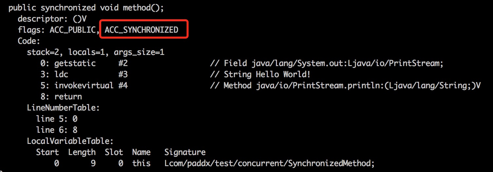

# [深入分析Synchronized原理(阿里面试题)](https://www.cnblogs.com/aspirant/p/11470858.html)

还有一篇 讲解lock的实现原理，参考：[解决多线程安全问题-无非两个方法synchronized和lock 具体原理以及如何 获取锁AQS算法 (百度-美团)](https://www.cnblogs.com/aspirant/p/8657681.html)

 

记得开始学习Java的时候，一遇到多线程情况就使用synchronized，相对于当时的我们来说synchronized是这么的神奇而又强大，那个时候我们赋予它一个名字“同步”，也成为了我们解决多线程情况的百试不爽的良药。但是，随着学习的进行我们知道在JDK1.5之前synchronized是一个重量级锁，相对于j.u.c.Lock，它会显得那么笨重，以至于我们认为它不是那么的高效而慢慢摒弃它。

不过，随着Javs SE 1.6对synchronized进行的各种优化后，synchronized并不会显得那么重了。下面来一起探索synchronized的基本使用、实现机制、Java是如何对它进行了优化、锁优化机制、锁的存储结构等升级过程。

# 1 基本使用

Synchronized是Java中解决并发问题的一种最常用的方法，也是最简单的一种方法。Synchronized的作用主要有三个：

> 1. 原子性：确保线程互斥的访问同步代码；
> 2. 可见性：保证共享变量的修改能够及时可见，其实是通过Java内存模型中的 “**对一个变量unlock操作之前，必须要同步到主内存中；如果对一个变量进行lock操作，则将会清空工作内存中此变量的值，在执行引擎使用此变量前，需要重新从主内存中load操作或assign操作初始化变量值**” 来保证的；
> 3. 有序性：有效解决重排序问题，即 “一个unlock操作先行发生(happen-before)于后面对同一个锁的lock操作”；

从语法上讲，Synchronized可以把任何一个非null对象作为"锁"，在HotSpot JVM实现中，**锁有个专门的名字：对象监视器（Object Monitor）**。

Synchronized总共有三种用法：

> 1. 当synchronized作用在实例方法时，监视器锁（monitor）便是对象实例（this）；
> 2. 当synchronized作用在静态方法时，监视器锁（monitor）便是对象的Class实例，因为Class数据存在于永久代，因此静态方法锁相当于该类的一个全局锁；
> 3. 当synchronized作用在某一个对象实例时，监视器锁（monitor）便是括号括起来的对象实例；

注意，synchronized 内置锁 是一种 对象锁（锁的是对象而非引用变量），**作用粒度是对象 ，可以用来实现对 临界资源的同步互斥访问 ，是 可重入 的。其可重入最大的作用是避免死锁**，如：

> **子类同步方法调用了父类同步方法，如没有可重入的特性，则会发生死锁；**

# 2 同步原理

数据同步需要依赖锁，那锁的同步又依赖谁？**synchronized给出的答案是在软件层面依赖JVM，而j.u.c.Lock给出的答案是在硬件层面依赖特殊的CPU指令。**

当一个线程访问同步代码块时，首先是需要得到锁才能执行同步代码，当退出或者抛出异常时必须要释放锁，那么它是如何来实现这个机制的呢？我们先看一段简单的代码：


```
package com.paddx.test.concurrent;
public class SynchronizedDemo {
    public void method() {
        synchronized (this) {
            System.out.println("Method 1 start");
        }
    }
}
```


查看反编译后结果： 


反编译结果

1. **monitorenter**：每个对象都是一个监视器锁（monitor）。当monitor被占用时就会处于锁定状态，线程执行monitorenter指令时尝试获取monitor的所有权，过程如下：

   > 1. 如果monitor的进入数为0，则该线程进入monitor，然后将进入数设置为1，该线程即为monitor的所有者；
   > 2. 如果线程已经占有该monitor，只是重新进入，则进入monitor的进入数加1；
   > 3. 如果其他线程已经占用了monitor，则该线程进入阻塞状态，直到monitor的进入数为0，再重新尝试获取monitor的所有权；

2. monitorexit：执行monitorexit的线程必须是objectref所对应的monitor的所有者。指令执行时，monitor的进入数减1，如果减1后进入数为0，那线程退出monitor，不再是这个monitor的所有者。其他被这个monitor阻塞的线程可以尝试去获取这个 monitor 的所有权。

   > monitorexit指令出现了两次，第1次为同步正常退出释放锁；第2次为发生异步退出释放锁；

通过上面两段描述，我们应该能很清楚的看出Synchronized的实现原理，**Synchronized的语义底层是通过一个monitor的对象来完成，其实wait/notify等方法也依赖于monitor对象，这就是为什么只有在同步的块或者方法中才能调用wait/notify等方法，否则会抛出java.lang.IllegalMonitorStateException的异常的原因。**

再来看一下同步方法：


```
package com.paddx.test.concurrent;

public class SynchronizedMethod {
    public synchronized void method() {
        System.out.println("Hello World!");
    }
}
```


查看反编译后结果： 



反编译结果 

从编译的结果来看，方法的同步并没有通过指令 `monitorenter` 和 `monitorexit` 来完成（理论上其实也可以通过这两条指令来实现），不过相对于普通方法，其常量池中多了 `ACC_SYNCHRONIZED` 标示符。JVM就是根据该标示符来实现方法的同步的：

> 当方法调用时，调用指令将会检查方法的 ACC_SYNCHRONIZED 访问标志是否被设置，如果设置了，执行线程将先获取monitor，获取成功之后才能执行方法体，方法执行完后再释放monitor。**在方法执行期间，其他任何线程都无法再获得同一个monitor对象。**

两种同步方式本质上没有区别，只是方法的同步是一种隐式的方式来实现，无需通过字节码来完成。两个指令的执行是JVM通过调用操作系统的互斥原语mutex来实现，被阻塞的线程会被挂起、等待重新调度，会导致“用户态和内核态”两个态之间来回切换，对性能有较大影响。

# 3 同步概念

## 3.1 Java对象头

在JVM中**，对象在内存中的布局分为三块区域：对象头、实例数据和对齐填充。**如下图所示：

 

 

1. 实例数据：存放类的属性数据信息，包括父类的属性信息；
2. 对齐填充：由于虚拟机要求 对象起始地址必须是8字节的整数倍。填充数据不是必须存在的，仅仅是为了字节对齐；
3. **对象头：Java对象头一般占有2个机器码（在32位虚拟机中，1个机器码等于4字节，也就是32bit，在64位虚拟机中，1个机器码是8个字节，也就是64bit），但是 如果对象是数组类型，则需要3个机器码，因为JVM虚拟机可以通过Java对象的元数据信息确定Java对象的大小，但是无法从数组的元数据来确认数组的大小，所以用一块来记录数组长度。**

Synchronized用的锁就是存在Java对象头里的，那么什么是Java对象头呢？Hotspot虚拟机的对象头主要包括两部分数据：**Mark Word（标记字段）、**Class Pointer（类型指针）。其中 Class Pointer是对象指向它的类元数据的指针，虚拟机通过这个指针来确定这个对象是哪个类的实例，Mark Word用于存储对象自身的运行时数据，它是实现轻量级锁和偏向锁的关键。 Java对象头具体结构描述如下：

 


Java对象头结构组成

Mark Word用于存储对象自身的运行时数据，如：哈希码（HashCode）、GC分代年龄、**锁状态标志**、线程持有的锁、偏向线程 ID、偏向时间戳等。比如锁膨胀就是借助Mark Word的偏向的线程ID 参考：[JAVA锁的膨胀过程和优化(阿里)](https://www.cnblogs.com/aspirant/p/11705068.html) 阿里也经常问的问题

下图是Java对象头 无锁状态下Mark Word部分的存储结构（32位虚拟机）：

 


Mark Word存储结构 

对象头信息是与对象自身定义的数据无关的额外存储成本，但是考虑到虚拟机的空间效率，Mark Word被设计成一个非固定的数据结构以便在极小的空间内存存储尽量多的数据，它会根据对象的状态复用自己的存储空间，也就是说，Mark Word会随着程序的运行发生变化，可能变化为存储以下4种数据：

 


Mark Word可能存储4种数据

在64位虚拟机下，Mark Word是64bit大小的，其存储结构如下：

 


64位Mark Word存储结构

对象头的最后两位存储了锁的标志位，01是初始状态，未加锁，其对象头里存储的是对象本身的哈希码，随着锁级别的不同，对象头里会存储不同的内容。偏向锁存储的是当前占用此对象的线程ID；而轻量级则存储指向线程栈中锁记录的指针。从这里我们可以看到，“锁”这个东西，可能是个锁记录+对象头里的引用指针（判断线程是否拥有锁时将线程的锁记录地址和对象头里的指针地址比较)，也可能是对象头里的线程ID（判断线程是否拥有锁时将线程的ID和对象头里存储的线程ID比较）。 


HotSpot虚拟机对象头Mark Word

## 3.2 对象头中Mark Word与线程中Lock Record

在线程进入同步代码块的时候，如果此同步对象没有被锁定，即它的锁标志位是01，则虚拟机首先在当前线程的栈中创建我们称之为“锁记录（Lock Record）”的空间，用于存储锁对象的Mark Word的拷贝，官方把这个拷贝称为Displaced Mark Word。整个Mark Word及其拷贝至关重要。

**Lock Record是线程私有的数据结构**，每一个线程都有一个可用Lock Record列表，同时还有一个全局的可用列表。每一个被锁住的对象Mark Word都会和一个Lock Record关联（对象头的MarkWord中的Lock Word指向Lock Record的起始地址），同时Lock Record中有一个Owner字段存放拥有该锁的线程的唯一标识（或者`object mark word`），表示该锁被这个线程占用。如下图所示为Lock Record的内部结构：

| Lock Record | 描述                                                         |
| ----------- | ------------------------------------------------------------ |
| Owner       | 初始时为NULL表示当前没有任何线程拥有该monitor record，当线程成功拥有该锁后保存线程唯一标识，当锁被释放时又设置为NULL； |
| EntryQ      | 关联一个系统互斥锁（semaphore），阻塞所有试图锁住monitor record失败的线程； |
| RcThis      | 表示blocked或waiting在该monitor record上的所有线程的个数；   |
| Nest        | 用来实现 重入锁的计数；                                      |
| HashCode    | 保存从对象头拷贝过来的HashCode值（可能还包含GC age）。       |
| Candidate   | 用来避免不必要的阻塞或等待线程唤醒，因为每一次只有一个线程能够成功拥有锁，如果每次前一个释放锁的线程唤醒所有正在阻塞或等待的线程，会引起不必要的上下文切换（从阻塞到就绪然后因为竞争锁失败又被阻塞）从而导致性能严重下降。Candidate只有两种可能的值0表示没有需要唤醒的线程1表示要唤醒一个继任线程来竞争锁。 |

## 3.3 监视器（Monitor）

任何一个对象都有一个Monitor与之关联，当且一个Monitor被持有后，它将处于锁定状态。Synchronized在JVM里的实现都是 基于进入和退出Monitor对象来实现方法同步和代码块同步，虽然具体实现细节不一样，但是都可以通过成对的MonitorEnter和MonitorExit指令来实现。 

1. **MonitorEnter指令：插入在同步代码块的开始位置，当代码执行到该指令时，将会尝试获取该对象Monitor的所有权，即尝试获得该对象的锁；**
2. **MonitorExit指令：插入在方法结束处和异常处，JVM保证每个MonitorEnter必须有对应的MonitorExit；**

那什么是Monitor？可以把它理解为 一个同步工具，也可以描述为 一种同步机制，它通常被 描述为一个对象。

与一切皆对象一样，所有的Java对象是天生的Monitor，每一个Java对象都有成为Monitor的潜质，因为在Java的设计中 ，**每一个Java对象自打娘胎里出来就带了一把看不见的锁，它叫做内部锁或者Monitor锁**。

也就是通常说Synchronized的对象锁，MarkWord锁标识位为10，其中指针指向的是Monitor对象的起始地址。在Java虚拟机（HotSpot）中，Monitor是由ObjectMonitor实现的，其主要数据结构如下（位于HotSpot虚拟机源码ObjectMonitor.hpp文件，C++实现的）：


```
ObjectMonitor() {
    _header       = NULL;
    _count        = 0; // 记录个数
    _waiters      = 0,
    _recursions   = 0;
    _object       = NULL;
    _owner        = NULL;
    _WaitSet      = NULL; // 处于wait状态的线程，会被加入到_WaitSet
    _WaitSetLock  = 0 ;
    _Responsible  = NULL ;
    _succ         = NULL ;
    _cxq          = NULL ;
    FreeNext      = NULL ;
    _EntryList    = NULL ; // 处于等待锁block状态的线程，会被加入到该列表
    _SpinFreq     = 0 ;
    _SpinClock    = 0 ;
    OwnerIsThread = 0 ;
  }
```


ObjectMonitor中有两个队列，_WaitSet 和 _EntryList，用来保存ObjectWaiter对象列表（ 每个等待锁的线程都会被封装成ObjectWaiter对象 ），_owner指向持有ObjectMonitor对象的线程，当多个线程同时访问一段同步代码时：

> 1. 首先会进入 _EntryList 集合，当线程获取到对象的monitor后，进入 _Owner区域并把monitor中的owner变量设置为当前线程，同时monitor中的计数器count加1；
> 2. 若线程调用 wait() 方法，将释放当前持有的monitor，owner变量恢复为null，count自减1，同时该线程进入 WaitSet集合中等待被唤醒；
> 3. 若当前线程执行完毕，也将释放monitor（锁）并复位count的值，以便其他线程进入获取monitor(锁)；

同时**，Monitor对象存在于每个Java对象的对象头Mark Word中（存储的指针的指向），Synchronized锁便是通过这种方式获取锁的，也是为什么Java中任意对象可以作为锁的原因，同时notify/notifyAll/wait等方法会使用到Monitor锁对象，所以必须在同步代码块中使用。**

监视器Monitor有两种同步方式：互斥与协作。多线程环境下线程之间如果需要共享数据，需要解决互斥访问数据的问题，监视器可以确保监视器上的数据在同一时刻只会有一个线程在访问。

什么时候需要协作？ 比如：

> 一个线程向缓冲区写数据，另一个线程从缓冲区读数据，如果读线程发现缓冲区为空就会等待，当写线程向缓冲区写入数据，就会唤醒读线程，这里读线程和写线程就是一个合作关系。JVM通过Object类的wait方法来使自己等待，在调用wait方法后，该线程会释放它持有的监视器，直到其他线程通知它才有执行的机会。一个线程调用notify方法通知在等待的线程，这个等待的线程并不会马上执行，而是要通知线程释放监视器后，它重新获取监视器才有执行的机会。如果刚好唤醒的这个线程需要的监视器被其他线程抢占，那么这个线程会继续等待。Object类中的notifyAll方法可以解决这个问题，它可以唤醒所有等待的线程，总有一个线程执行。

 


如上图所示，一个线程通过1号门进入Entry Set(入口区)，如果在入口区没有线程等待，那么这个线程就会获取监视器成为监视器的Owner，然后执行监视区域的代码。如果在入口区中有其它线程在等待，那么新来的线程也会和这些线程一起等待。线程在持有监视器的过程中，有两个选择，一个是正常执行监视器区域的代码，释放监视器，通过5号门退出监视器；还有可能等待某个条件的出现，于是它会通过3号门到Wait Set（等待区）休息，直到相应的条件满足后再通过4号门进入重新获取监视器再执行。

注意：

> 当一个线程释放监视器时，在入口区和等待区的等待线程都会去竞争监视器，如果入口区的线程赢了，会从2号门进入；如果等待区的线程赢了会从4号门进入。只有通过3号门才能进入等待区，在等待区中的线程只有通过4号门才能退出等待区，也就是说一个线程只有在持有监视器时才能执行wait操作，处于等待的线程只有再次获得监视器才能退出等待状态。

# 4 锁的优化

从JDK5引入了现代操作系统新增加的CAS原子操作（ JDK5中并没有对synchronized关键字做优化，而是体现在J.U.C中，所以在该版本concurrent包有更好的性能 ），从JDK6开始，就对synchronized的实现机制进行了较大调整，包括使用JDK5引进的CAS自旋之外，还增加了自适应的CAS自旋、锁消除、锁粗化、偏向锁、轻量级锁这些优化策略。由于此关键字的优化使得性能极大提高，同时语义清晰、操作简单、无需手动关闭，所以推荐在允许的情况下尽量使用此关键字，同时在性能上此关键字还有优化的空间。

锁主要存在四种状态，依次是**：无锁状态、偏向锁状态、轻量级锁状态、重量级锁状态**，锁可以从偏向锁升级到轻量级锁，再升级的重量级锁。但是锁的升级是单向的，也就是说只能从低到高升级，不会出现锁的降级。

在 JDK 1.6 中默认是开启偏向锁和轻量级锁的，可以通过-XX:-UseBiasedLocking来禁用偏向锁。

## 4.1 自旋锁

线程的阻塞和唤醒需要CPU从用户态转为核心态，频繁的阻塞和唤醒对CPU来说是一件负担很重的工作，势必会给系统的并发性能带来很大的压力。同时我们发现在许多应用上面，对象锁的锁状态只会持续很短一段时间，为了这一段很短的时间频繁地阻塞和唤醒线程是非常不值得的。

所以引入自旋锁，何谓自旋锁？ 

所谓自旋锁，就是指当一个线程尝试获取某个锁时，如果该锁已被其他线程占用，就一直循环检测锁是否被释放，而不是进入线程挂起或睡眠状态。

自旋锁适用于锁保护的临界区很小的情况，临界区很小的话，锁占用的时间就很短。自旋等待不能替代阻塞，虽然它可以避免线程切换带来的开销，但是它占用了CPU处理器的时间。如果持有锁的线程很快就释放了锁，那么自旋的效率就非常好，反之，自旋的线程就会白白消耗掉处理的资源，它不会做任何有意义的工作，典型的占着茅坑不拉屎，这样反而会带来性能上的浪费。所以说，自旋等待的时间（自旋的次数）必须要有一个限度，如果自旋超过了定义的时间仍然没有获取到锁，则应该被挂起。

自旋锁在JDK 1.4.2中引入，默认关闭，但是可以使用-XX:+UseSpinning开开启，在JDK1.6中默认开启。同时自旋的默认次数为10次，可以通过参数-XX:PreBlockSpin来调整。

如果通过参数-XX:PreBlockSpin来调整自旋锁的自旋次数，会带来诸多不便。假如将参数调整为10，但是系统很多线程都是等你刚刚退出的时候就释放了锁（假如多自旋一两次就可以获取锁），是不是很尴尬。于是JDK1.6引入自适应的自旋锁，让虚拟机会变得越来越聪明。

## 4.2 适应性自旋锁

JDK 1.6引入了更加聪明的自旋锁，即自适应自旋锁。所谓自适应就意味着自旋的次数不再是固定的，它是由前一次在同一个锁上的自旋时间及锁的拥有者的状态来决定。那它如何进行适应性自旋呢？ 

**线程如果自旋成功了，那么下次自旋的次数会更加多，因为虚拟机认为既然上次成功了，那么此次自旋也很有可能会再次成功，那么它就会允许自旋等待持续的次数更多。反之，如果对于某个锁，很少有自旋能够成功，那么在以后要或者这个锁的时候自旋的次数会减少甚至省略掉自旋过程，以免浪费处理器资源。**

有了自适应自旋锁，随着程序运行和性能监控信息的不断完善，虚拟机对程序锁的状况预测会越来越准确，虚拟机会变得越来越聪明。

## 4.3 锁消除

为了保证数据的完整性，在进行操作时需要对这部分操作进行同步控制，但是在有些情况下，JVM检测到不可能存在共享数据竞争，这是JVM会对这些同步锁进行锁消除。

> 锁消除的依据是逃逸分析的数据支持

如果不存在竞争，为什么还需要加锁呢？所以锁消除可以节省毫无意义的请求锁的时间。变量是否逃逸，对于虚拟机来说需要使用数据流分析来确定，但是对于程序员来说这还不清楚么？在明明知道不存在数据竞争的代码块前加上同步吗？但是有时候程序并不是我们所想的那样？虽然没有显示使用锁，但是在使用一些JDK的内置API时，如StringBuffer、Vector、HashTable等，这个时候会存在隐形的加锁操作。比如StringBuffer的append()方法，Vector的add()方法：


```
public void vectorTest(){
    Vector<String> vector = new Vector<String>();
    for(int i = 0 ; i < 10 ; i++){
        vector.add(i + "");
    }

    System.out.println(vector);
}
```


在运行这段代码时，JVM可以明显检测到变量vector没有逃逸出方法vectorTest()之外，所以JVM可以大胆地将vector内部的加锁操作消除。

## 4.4 锁粗化

在使用同步锁的时候，需要让同步块的作用范围尽可能小—仅在共享数据的实际作用域中才进行同步，这样做的目的是 为了使需要同步的操作数量尽可能缩小，如果存在锁竞争，那么等待锁的线程也能尽快拿到锁。

在大多数的情况下，上述观点是正确的。但是如果一系列的连续加锁解锁操作，可能会导致不必要的性能损耗，所以引入锁粗话的概念。

锁粗话概念比较好理解，就是将多个连续的加锁、解锁操作连接在一起，扩展成一个范围更大的锁

如上面实例：

> **vector每次add的时候都需要加锁操作，JVM检测到对同一个对象（vector）连续加锁、解锁操作，会合并一个更大范围的加锁、解锁操作，即加锁解锁操作会移到for循环之外。**

## 4.5 偏向锁

偏向锁是JDK6中的重要引进，因为HotSpot作者经过研究实践发现，在大多数情况下，锁不仅不存在多线程竞争，而且总是由同一线程多次获得，为了让线程获得锁的代价更低，引进了偏向锁。

偏向锁是在单线程执行代码块时使用的机制，如果在多线程并发的环境下（即线程A尚未执行完同步代码块，线程B发起了申请锁的申请），则一定会转化为轻量级锁或者重量级锁。

在JDK5中偏向锁默认是关闭的，而到了JDK6中偏向锁已经默认开启。如果并发数较大同时同步代码块执行时间较长，则被多个线程同时访问的概率就很大，就可以使用参数-XX:-UseBiasedLocking来禁止偏向锁(但这是个JVM参数，不能针对某个对象锁来单独设置)。

引入偏向锁主要目的是：为了在没有多线程竞争的情况下尽量减少不必要的轻量级锁执行路径。因为轻量级锁的加锁解锁操作是需要依赖多次CAS原子指令的，而偏向锁只需要在置换ThreadID的时候依赖一次CAS原子指令（由于一旦出现多线程竞争的情况就必须撤销偏向锁，所以偏向锁的撤销操作的性能损耗也必须小于节省下来的CAS原子指令的性能消耗）。

> 轻量级锁是为了在线程交替执行同步块时提高性能，而偏向锁则是在只有一个线程执行同步块时进一步提高性能。

那么偏向锁是如何来减少不必要的CAS操作呢？首先我们看下无竞争下锁存在什么问题：

> **现在几乎所有的锁都是可重入的，即已经获得锁的线程可以多次锁住/解锁监视对象，按照之前的HotSpot设计，每次加锁/解锁都会涉及到一些CAS操作（比如对等待队列的CAS操作），CAS操作会延迟本地调用，因此偏向锁的想法是 一旦线程第一次获得了监视对象，之后让监视对象“偏向”这个线程，之后的多次调用则可以避免CAS操作，说白了就是置个变量，如果发现为true则无需再走各种加锁/解锁流程。**

CAS为什么会引入本地延迟？这要从SMP（对称多处理器）架构说起，下图大概表明了SMP的结构：

 


SMP（对称多处理器）架构

> 其意思是 所有的CPU会共享一条系统总线（BUS），靠此总线连接主存。每个核都有自己的一级缓存，各核相对于BUS对称分布，因此这种结构称为“对称多处理器”。

而CAS的全称为Compare-And-Swap，是一条CPU的原子指令，其作用是让CPU比较后原子地更新某个位置的值，经过调查发现，其实现方式是基于硬件平台的汇编指令，就是说CAS是靠硬件实现的，JVM只是封装了汇编调用，那些AtomicInteger类便是使用了这些封装后的接口。

例如：Core1和Core2可能会同时把主存中某个位置的值Load到自己的L1 Cache中，当Core1在自己的L1 Cache中修改这个位置的值时，会通过总线，使Core2中L1 Cache对应的值“失效”，而Core2一旦发现自己L1 Cache中的值失效（称为Cache命中缺失）则会通过总线从内存中加载该地址最新的值，大家通过总线的来回通信称为“Cache一致性流量”，因为总线被设计为固定的“通信能力”，如果Cache一致性流量过大，总线将成为瓶颈。而当Core1和Core2中的值再次一致时，称为“Cache一致性”，从这个层面来说，锁设计的终极目标便是减少Cache一致性流量。

而CAS恰好会导致Cache一致性流量，如果有很多线程都共享同一个对象，当某个Core CAS成功时必然会引起总线风暴，这就是所谓的本地延迟，本质上偏向锁就是为了消除CAS，降低Cache一致性流量。

*Cache一致性：*

> 上面提到Cache一致性，其实是有协议支持的，现在通用的协议是MESI（最早由Intel开始支持），具体参考：http://en.wikipedia.org/wiki/MESI_protocol。

*Cache一致性流量的例外情况：*

> 其实也不是所有的CAS都会导致总线风暴，这跟Cache一致性协议有关，具体参考：http://blogs.oracle.com/dave/entry/biased_locking_in_hotspot

*NUMA(Non Uniform Memory Access Achitecture）架构：*

> 与SMP对应还有非对称多处理器架构，现在主要应用在一些高端处理器上，主要特点是没有总线，没有公用主存，每个Core有自己的内存，针对这种结构此处不做讨论。

所以，当一个线程访问同步块并获取锁时，会在对象头和栈帧中的锁记录里存储锁偏向的线程ID，以后该线程进入和退出同步块时不需要花费CAS操作来争夺锁资源，只需要检查是否为偏向锁、锁标识为以及ThreadID即可，处理流程如下：

> 1. 检测Mark Word是否为可偏向状态，即是否为偏向锁1，锁标识位为01；
> 2. 若为可偏向状态，则测试线程ID是否为当前线程ID，如果是，则执行步骤（5），否则执行步骤（3）；
> 3. 如果测试线程ID不为当前线程ID，则通过CAS操作竞争锁，竞争成功，则将Mark Word的线程ID替换为当前线程ID，否则执行线程（4）；
> 4. 通过CAS竞争锁失败，证明当前存在多线程竞争情况，当到达全局安全点，获得偏向锁的线程被挂起，偏向锁升级为轻量级锁，然后被阻塞在安全点的线程继续往下执行同步代码块；
> 5. 执行同步代码块；

偏向锁的释放采用了 一种只有竞争才会释放锁的机制，线程是不会主动去释放偏向锁，需要等待其他线程来竞争。偏向锁的撤销需要 等待全局安全点（这个时间点是上没有正在执行的代码）。其步骤如下：

> 1. 暂停拥有偏向锁的线程；
> 2. 判断锁对象是否还处于被锁定状态，否，则恢复到无锁状态（01），以允许其余线程竞争。是，则挂起持有锁的当前线程，并将指向当前线程的锁记录地址的指针放入对象头Mark Word，升级为轻量级锁状态（00），然后恢复持有锁的当前线程，进入轻量级锁的竞争模式；
>
> 注意：此处将 当前线程挂起再恢复的过程中并没有发生锁的转移，仍然在当前线程手中，只是穿插了个 “将对象头中的线程ID变更为指向锁记录地址的指针” 这么个事。

 


偏向锁的获取和释放过程

## 4.6 轻量级锁

引入轻量级锁的主要目的是 在没有多线程竞争的前提下，减少传统的重量级锁使用操作系统互斥量产生的性能消耗。当关闭偏向锁功能或者多个线程竞争偏向锁导致偏向锁升级为轻量级锁，则会尝试获取轻量级锁，其步骤如下：

1. 在线程进入同步块时，如果同步对象锁状态为无锁状态（锁标志位为“01”状态，是否为偏向锁为“0”），虚拟机首先将在当前线程的栈帧中建立一个名为锁记录（Lock Record）的空间，用于存储锁对象目前的Mark Word的拷贝，官方称之为 Displaced Mark Word。此时线程堆栈与对象头的状态如下图所示：

    

   

   轻量级锁CAS操作之前线程堆栈与对象的状态

2. 拷贝对象头中的Mark Word复制到锁记录（Lock Record）中；

3. 拷贝成功后，虚拟机将使用CAS操作尝试将对象Mark Word中的Lock Word更新为指向当前线程Lock Record的指针，并将Lock record里的owner指针指向object mark word。如果更新成功，则执行步骤（4），否则执行步骤（5）；

4. 如果这个更新动作成功了，那么当前线程就拥有了该对象的锁，并且对象Mark Word的锁标志位设置为“00”，即表示此对象处于轻量级锁定状态，此时线程堆栈与对象头的状态如下图所示：

    

   

   轻量级锁CAS操作之后线程堆栈与对象的状态

5. 如果这个更新操作失败了，虚拟机首先会检查对象Mark Word中的Lock Word是否指向当前线程的栈帧，如果是，就说明当前线程已经拥有了这个对象的锁，那就可以直接进入同步块继续执行。否则说明多个线程竞争锁，进入自旋执行（3），若自旋结束时仍未获得锁，轻量级锁就要膨胀为重量级锁，锁标志的状态值变为“10”，Mark Word中存储的就是指向重量级锁（互斥量）的指针，当前线程以及后面等待锁的线程也要进入阻塞状态。

轻量级锁的释放也是通过CAS操作来进行的，主要步骤如下：

> 1. 通过CAS操作尝试把线程中复制的Displaced Mark Word对象替换当前的Mark Word；
> 2. 如果替换成功，整个同步过程就完成了，恢复到无锁状态（01）；
> 3. 如果替换失败，说明有其他线程尝试过获取该锁（此时锁已膨胀），那就要在释放锁的同时，唤醒被挂起的线程；

对于轻量级锁，其性能提升的依据是 “对于绝大部分的锁，在整个生命周期内都是不会存在竞争的”，如果打破这个依据则除了互斥的开销外，还有额外的CAS操作，因此在有多线程竞争的情况下，轻量级锁比重量级锁更慢。

 


轻量级锁的获取和释放过程

1. 为什么升级为轻量锁时要把对象头里的Mark Word复制到线程栈的锁记录中呢？

   > 因为在申请对象锁时 需要以该值作为CAS的比较条件，同时在升级到重量级锁的时候，能通过这个比较判定是否在持有锁的过程中此锁被其他线程申请过，如果被其他线程申请了，则在释放锁的时候要唤醒被挂起的线程。

2. 为什么会尝试CAS不成功以及什么情况下会不成功？

   > CAS本身是不带锁机制的，其是通过比较而来。假设如下场景：线程A和线程B都在对象头里的锁标识为无锁状态进入，那么如线程A先更新对象头为其锁记录指针成功之后，线程B再用CAS去更新，就会发现此时的对象头已经不是其操作前的对象HashCode了，所以CAS会失败。也就是说，只有两个线程并发申请锁的时候会发生CAS失败。
   >
   > 然后线程B进行CAS自旋，等待对象头的锁标识重新变回无锁状态或对象头内容等于对象HashCode（因为这是线程B做CAS操作前的值），这也就意味着线程A执行结束（参见后面轻量级锁的撤销，只有线程A执行完毕撤销锁了才会重置对象头），此时线程B的CAS操作终于成功了，于是线程B获得了锁以及执行同步代码的权限。如果线程A的执行时间较长，线程B经过若干次CAS时钟没有成功，则锁膨胀为重量级锁，即线程B被挂起阻塞、等待重新调度。

此处，如何理解“轻量级”？“轻量级”是相对于使用操作系统互斥量来实现的传统锁而言的。但是，首先需要强调一点的是，轻量级锁并不是用来代替重量级锁的，它的本意是在没有多线程竞争的前提下，减少传统的重量级锁使用产生的性能消耗。

> 轻量级锁所适应的场景是线程交替执行同步块的情况，如果存在同一时间访问同一锁的情况，必然就会导致轻量级锁膨胀为重量级锁。

## 4.7 重量级锁

Synchronized是通过对象内部的一个叫做 监视器锁（Monitor）来实现的。但是监视器锁本质又是依赖于底层的操作系统的Mutex Lock来实现的。而操作系统实现线程之间的切换这就需要从用户态转换到核心态，这个成本非常高，状态之间的转换需要相对比较长的时间，这就是为什么Synchronized效率低的原因。因此，这种依赖于操作系统Mutex Lock所实现的锁我们称之为 “重量级锁”。

## 4.8 重量级锁、轻量级锁和偏向锁之间转换

 


重量级锁、轻量级锁和偏向锁之间转换

 


Synchronized偏向锁、轻量级锁及重量级锁转换流程

# 5 锁的优劣

各种锁并不是相互代替的，而是在不同场景下的不同选择，绝对不是说重量级锁就是不合适的。每种锁是只能升级，不能降级，即由偏向锁->轻量级锁->重量级锁，而这个过程就是开销逐渐加大的过程。

> 1. 如果是单线程使用，那偏向锁毫无疑问代价最小，并且它就能解决问题，连CAS都不用做，仅仅在内存中比较下对象头就可以了；
> 2. 如果出现了其他线程竞争，则偏向锁就会升级为轻量级锁；
> 3. 如果其他线程通过一定次数的CAS尝试没有成功，则进入重量级锁；

在第3种情况下进入同步代码块就 要做偏向锁建立、偏向锁撤销、轻量级锁建立、升级到重量级锁，最终还是得靠重量级锁来解决问题，那这样的代价就比直接用重量级锁要大不少了。所以使用哪种技术，一定要看其所处的环境及场景，在绝大多数的情况下，偏向锁是有效的，这是基于HotSpot作者发现的“大多数锁只会由同一线程并发申请”的经验规律。

 


锁的优劣

# 6 扩展资料

1. [JVM源码分析之synchronized实现](https://www.jianshu.com/p/c5058b6fe8e5)
2. [自旋锁、排队自旋锁、MCS锁、CLH锁](https://blog.csdn.net/fei33423/article/details/30316377)
3. [深入理解Java并发之synchronized实现原理](https://blog.csdn.net/javazejian/article/details/72828483) 

 

参考：[啃碎并发（七）：深入分析Synchronized原理](https://www.jianshu.com/p/e62fa839aa41)

还有一篇写的不错：[深入理解synchronized底层原理，一篇文章就够了！](https://cloud.tencent.com/developer/article/1465413)

另一篇少的：[synchronize原理](https://www.cnblogs.com/heqiyoujing/p/11144649.html)


## Synchronized对线面试

### 1. 面试官：Synchronized有用过吗？谈谈你对它的理解

（1）画外音：面试官主要是想了解你有没有Java并发编程方面的经验，可以讲讲它的概念和部分原理！

（2）**回答**：Synchronized是Java的关键词，JVM实现的一种可以实现并发产生的多个线程互斥同步访问共享资源的 方式，也可以说是一种 “同步互斥锁”，在实际代码中可用于修饰代码块、方法、静态方法以及类；适用于单体应用系统架构

### 2.面试官：嗯，说一说它的原理？

（1）画外音：这么快就问原理，看来是动真格的了，不是随便问问而已！

（2）**回答**：通过查看被Synchronized 修饰过的代码块编译后的字节码，会发现编译器会在 被Synchronized修饰过的代码块的前、后生成两个字节码指令：monitorenter、monitorexit；

这两个字节码指令的含义：当JVM执行到monitorenter指令时，首先会尝试着先获取对象（共享资源）的锁，如果该对象没有被锁定、又或者当前线程已经拥有了这个对象的锁时，则锁的计数器count加1，即执行 +1 操作；当JVM执行monitorexit指令时，则将锁的计数器count减一，即执行 -1 操作；

当计数器count为0时 ，该对象的锁就被释放了！！

如果当前线程获取该对象的锁失败了，则进入堵塞等待状态，直到该对象的锁被另外一个线程释放为止；即Java中的Synchronize底层其实是通过对象（共享资源）头、尾设置标记，从而实现锁的获取和释放。

### **3.面试官：你刚才提到获取对象的锁，说一说“锁”到底是什么，如何确定对象的锁？**

（1）画外音：这是笔者自行想象、扩充的内容！

（2）**回答**：“锁” 可以理解为monitorenter和monitorexit字节码指令之间的一个 Reference类型的参数，即要锁定Lock和解锁UnLock的对象。

众所周知，使用Synchronized可以修饰不同的对象，因此，对应的对象的锁可以这么确定：

A.如果Synchronized明确指定了“锁”的对象，比如Synchronized变量、Synchronized(this) 等，说明加、解锁的即为该变量、当前对象；

B.若Synchronized 修饰的方法为非静态方法，表示此方法对应的对象为“锁”对象；若Synchronized 修饰的方法为静态方法，则表示此方法对应的类对象为“锁”对象；

注意：当一个对象被锁住时，对象里面所有用Synchronized 修饰的方法都将产生堵塞， 而对象里非Synchronized 修饰的方法可正常被调用，不受锁的影响；

### **4.面试官：什么叫可重入锁，为什么说Synchronized是可重入锁？**

（1）画外音：这面试官脑袋瓜转得可真快！

（2）**回答**：通俗地讲，“可重入”指的是：当 当前线程获取到了当前对象的锁之后，如果后续的操作仍然需要获取获取该对象的锁时，可以不用再次重新获取，即可以直接操作该对象（共享资源）；

可重入性是锁的一个基本要求，是为了解决自己锁死自己的情况，比如一个类的同步方法调用另一个同步方法时，假如Synchronized不支持重入，进入method2方法时当前线程已经获得锁，而在method2方法里面执行method1时当前线程又要去尝试获取锁，这时如果不支持重入，它就要等待释放，把自己阻塞，导致很有可能自己锁死自己！

对Synchronized来说，可重入性是显而易见的，刚才提到，在执行monitorenter指令时，如果这个对象没有锁定，或者当前线程已经拥有了这个对象的锁，就把锁的计数器+1，其实本质上就是通过这种方式实现了可重入性（而不是已拥有了锁则不能继续获取）。

### **5.面试官：说一说JVM底层对Java的原生锁做了哪些优化？**

（1）画外音：这有点难，特意上网参考了下，原来是关于锁竞争和升级的……

（2）**回答**：在Java 6以前前，Monitor的实现完全依赖底层操作系统的互斥锁来实现，也就是上面在问题2中所阐述的获取、释放锁的逻辑；由于Java的线程与操作系统的原生线程有映射关系，如果要将一个线程进行阻塞或唤起 都需要操作系统的协助，这就需要从用户态切换到内核态来执行，这种切换代价十分昂贵，很耗处理器时间，现代JDK中做了大量的优化；

一种优化是使用自旋锁，即在线程进行阻塞操作之前先让线程自旋等待一段时间，可能在等待期间其他线程已经解锁，这时就无需再让线程执行阻塞操作，避免了用户态到内核态的切换。

而现代JDK中还提供了三种不同的Monitor实现，也就是三种不同的锁：偏向锁、轻量级锁、重量级锁。

这三种锁使得JDK得以优化Synchronized的运行，当JVM检测到不同的竞争状况时，会自动切换到适合的锁实现，这就是锁的升级、降级。

当没有竞争出现时，默认使用偏向锁，JVM会利用CAS操作，在对象头上的MarkWord部分设置线程ID，以表示这个对象偏向于当前线程，所以并不涉及真正的互斥锁，因为在很多应用场景中，大部分对象生命周期中最多会被一个线程锁定，使用偏斜锁可以降低无竞争开销。

如果有另一线程试图锁定某个被偏向锁锁过的对象，JVM就会自动撤销偏向锁，切换到轻量级锁实现；轻量级锁依赖CAS操作MarkWord来试图获取锁，如果重试成功，就使用普通的轻量级锁；否则，进一步升级为重量级锁；

### 6.面试官：嗯，不错，Synchronized是公平锁还是非公平锁，为什么？

（1）画外音：这个倒不难……

（2）**回答**：非公平；非公平主要表现在获取锁的行为上：并非是按照申请锁的时间前后给等待线程分配锁的，每当锁被释放后，任何一个线程都有机会竞争到锁，这样做的目的是为了提高执行性能，缺点是可能会产生线程饥饿现象；

### **7.面试官：为什么说Synchronized是悲观锁？**

（1）画外音：面试官的用意应该是想让候选人谈谈对悲观锁的理解（下面的回答有点官方）

（2）**回答**：因为Synchronized的并发策略是悲观的：即不管是否会产生竞争，任何的数据操作都必须要加锁，包括“从用户态切换到核心态”、“维护锁计数器”和“检查被阻塞的线程是否需要被唤醒”等操作；

随着硬件指令集的发展，我们可以使用基于冲突检测的乐观并发策略，即先进行操作，如果没有其他线程征用数据，那操作就成功了；

如果共享数据有征用，产生了冲突，那就再进行其他的补偿措施，这种乐观的并发策略的许多实现不需要线程挂起，所以被称为非阻塞同步。

### **8.面试官：那你了解乐观锁吗，它的实现原理又是什么，能讲讲吗？**

（1）画外音：应该是聊聊CAS机制……

（2）**回答**：乐观锁，顾名思义表示系统总是认为当前的并发情况是乐观的，而不需要通过加各种锁进行控制；

乐观锁的实现原理是CAS机制（Compare And Swap，比较并交换），一种在JUC中广泛使用的算法；它涉及到三个操作数：内存值V、预期值A、新值B，当且仅当预期值A和内存值V相等时才将内存值V修改为新值B；

其底层实现逻辑：首先检查某块内存的值是否跟之前我读取的是一样的，如果不一样则表示期间此内存值已经被别的线程更改过，舍弃本次操作，否则说明期间没有其他线程对此内存值操作，可以把新值设置给此块内存，即间接意味着获取锁成功！

CAS具有原子性，它的原子性是由CPU硬件指令实现保证的，即通过JNI调用Native方法，从而调用由C++编写的硬件级别指令，JDK中提供了Unsafe类来执行这些操作（查看JUC很多类的底层源码会发现 Unsafe.compareAndSwapxxx() 的调用无处不在，很牛逼！！！）

### 9.面试官：那乐观锁就一定是好的吗？

（1）画外音：废话，世间一切事物哪有什么是一定的，此处应该是想让候选人提到自旋消耗性能以及ABA的问题……

（2）**回答**：乐观锁可以避免 悲观锁独占对象这一现象 的出现，同时也提高了并发性能，但它也有一些缺点：

A.  乐观锁只能保证一个共享变量的原子操作：如果多一个或几个变量，乐观锁将变得力不从心，但互斥锁能轻易解决，不管对象数量多少及对象颗粒度大小；

B.  长时间自旋可能导致开销大。假如CAS长时间不成功而一直自旋，会给CPU带来很大的开销；

C.  ABA问题：CAS的核心思想是通过比对内存值与预期值是否一样而判断内存值是否被改过，但这个判断逻辑不够严谨；


假如内存值原来是A，后来被一线程改为B，最后又被改回了A，则CAS认为此内存值并没有发生改变，但实际上是有被其他线程改过的，这种情况对依赖过程值的情景的运算结果影响很大。

### **10.面试官：刚提到ABA的问题，那有什么办法解决吗？**

（1）画外音：打个广告~这个可以看看debug的“分布式锁实战视频教程”，乐观锁那里就用的 version来实现的。

（2）**回答**：解决的思路是引入版本号，每次变量更新时都把版本号加1，同时如果条件允许，还需要额外建立数据更新历史表，并同时维护好版本号version 和 数据变更记录的映射关系！

### **11.面试官：跟Synchronized相比，可重入锁ReentrantLock的实现原理有什么不同？**

（1）画外音：打个广告~这个可以看看debug的“分布式锁实战视频教程”，乐观锁那里就用的 version来实现的

（2）**回答**：其实，几乎所有锁的实现原理都是为了达到同个目的：让所有的线程都能看到某种标记，同一时刻只能有一个线程获取到锁；

Synchronized通过在对象头中设置标记MarkWord实现了这一目的，是一种JVM原生的锁实现方式；

而ReentrantLock以及所有的基于Lock接口的实现类，则是通过一个volitile关键字修饰的int类型变量，并保证每个线程都能拥有对该int变量的可见性和原子性，其本质是基于所谓的AQS框架；

### **12.面试官：你刚刚提到了AQS，那你说说AQS的实现原理？**

（1）画外音：还真是不依不饶啊……

（2）**回答**：AQS，即 AbstractQueuedSynchronizer  抽象队列同步器，是一个用来构建锁和同步器的类，JUC  Lock包下的锁（常用的有ReentrantLock、ReadWriteLock），以及其他的像Semaphore、CountDownLatch，甚至是早期的FutureTask等，都是基于AQS来构建的；

* A.AQS在内部定义了一个变量：volatile int state，用于表示同步状态：当线程调用lock方法时，如果state=0，说明没有任何线程占有共享资源的锁，可以获得锁并将state=1；如果state=1，则说明有线程目前正在使用共享变量，其他线程必须加入同步队列进行等待。

* B.AQS内部是通过Node实体类来表示一个双向链表结构的同步队列，完成线程获取锁的排队工作，当有线程获取锁失败后，就被添加到队列末尾。

Node类是对要访问同步代码的线程的封装，包含了线程本身及其状态waitStatus（它有五种不同的取值，分别表示是否被阻塞、是否等待唤醒、是否已经被取消等），每个Node结点关联其prev结点和next结点（指针），方便线程释放锁后快速唤醒下一个在等待的线程，是一个FIFO的过程；

Node类有两个常量，SHARED和EXCLUSIVE，分别代表共享模式和独占模式，所谓共享模式是一个锁允许多条线程同时操作（信号量Semaphore就是基于AQS的共享模式实现的），独占模式指的是同一个时间段只能有一个线程对共享资源进行操作，多余的请求线程需要排队等待（如ReentranLock）；

C.AQS通过内部类ConditionObject构建等待队列（可有多个），当Condition调用wait()方法后，线程将会加入等待队列中，而当Condition调用signal()方法后，线程将从等待队列转移动同步队列中竞争锁。

D.AQS和Condition各自维护了不同的队列，在使用Lock和Condition的时候，其实就是两个队列的互相移动。

### **13.面试官：请对比下Synchronized 和 ReentrantLock的异同？**

（1）画外音：笔者自行扩充的

（2）**回答**：ReentrantLock是Lock的实现类，是一个互斥的同步锁；

A.从功能角度上看，ReentrantLock比Synchronized的同步操作更精细（因为可以像普通对象一样使用），甚至实现了Synchronized没有的高级功能，如：

等待可中断：当持有锁的线程长期不释放锁的时候，正在等待的线程可以选择放弃等待，对处理执行时间非常长的同步块很有用。

带超时的获取锁尝试：在指定的时间范围内获取锁，如果时间到了仍然无法获取则返回，可以判断是否有线程在排队等待获取锁。

可以响应中断请求：与Synchronized不同，当获取到锁的线程被中断时，能够响应中断，中断异常将会被抛出，同时锁会被释放。

可以实现公平锁：从锁的释放角度上看，Synchronized在JVM层面上实现的，不但可以通过一些监控工具监控Synchronized的锁定，而且在代码执行出现异常时，JVM会自动释放锁定；但是使用Lock则不行，Lock是通过代码实现的，要保证锁定一定会被释放，就必须将unLock()放到finally{}中。

B.从性能角度上看，Synchronized早期实现比较低效，对比ReentrantLock，大多数场景性能都相差较大，但是在Java6中对其进行了非常多的改进，在竞争不激烈时，Synchronized的性能要优于ReetrantLock；在高竞争情况下，Synchronized的性能会下降几十倍，但是ReetrantLock的性能能维持常态。

### **14.面试官：上面提到ReentrantLock也是一种可重入锁，那它的底层又是如何实现的？**

（1）画外音：这……还是得聊聊AQS？（后面偷瞄了一会源码）

（2）**回答**：ReentrantLock内部自定义了同步器Sync（Sync既实现了AQS，又实现了AOS，而AOS提供了一种持有互斥锁的方式），其实就是加锁的时候通过CAS算法，将线程对象放到一个双向链表中，每次获取锁的时候，看下当前维护的那个线程ID和当前请求的线程ID是否一样，一样就可重入了。

### **15.面试官：除了Synchronized 和 ReentrantLock，你还接触过JUC下中的哪些并发工具？

（1）画外音：总算人性化一点了，可以自圆其说了！

（2）**回答**：通常所说的并发包JUC其实就是java.util.concurrent包及其子包下集合了Java并发的各种基础工具类，具体主要包括几个方面：

A.提供了CountDownLatch、CyclicBarrier、Semaphore等，比Synchronized更加高级，可以实现更加丰富多线程操作的同步结构;

B.提供了ConcurrentHashMap、有序的ConcunrrentSkipListMap，或者通过类似快照机制实现线程安全的动态数组CopyOnWriteArrayList等，各种线程安全的容器;

C.提供了ArrayBlockingQueue、SynchorousQueue或针对特定场景的PriorityBlockingQueue等，各种并发队列的实现；

D.强大的Executor框架，可以创建各种不同类型的线程池，调度任务运行等。

### **16.面试官：简单说一说ReadWriteLock 和StampedLock 吧？**

（1）画外音：问得还比较多……

（2）**回答**：虽然ReentrantLock和Synchronized简单实用，但是行为上有一定的局限性，要么不占，要么独占；在实际应用场景中，有时候不需要大量竞争的写操作，而是以并发读为主，为了进一步优化并发操作的粒度，Java提供了读写锁；

读写锁基于的原理是：多个读操作不需要互斥，如果读锁试图锁定时，写锁却被某个线程持有时，读锁将无法获得，而只好等待对方操作结束，这样就可以自动保证不会读取到脏数据；

ReadWriteLock代表了一对锁，它在数据量大 且 并发读多、写少的时候，能够比纯同步版本凸显出优势；

读写锁看起来比Synchronized的粒度似乎细一些，但在实际应用中，其表现也并不尽人意，主要还是因为相对比较大的开销；

所以，JDK在后期引入了StampedLock，在提供类似读写锁的同时，还支持优化读模式，优化读是基于这样的假设：大多数情况下读操作并不会和写操作冲突，其逻辑是先试着修改，然后通过validate方法确认是否进入了写模式，如果没有进入，就成功避免了开销；如果进入，则尝试获取读锁。

### **17.面试官：如何让Java的线程彼此同步？你了解过哪些同步器？**

（1）画外音：应该是想聊JUC 同步器的三个成员 ：CountDownLatch、 CyclicBarrier和 Semaphore，我不玩了……

面试官：看出了我的不悦，诡异一笑，好吧，关于Java的锁和同步咱们聊得也比较多了，咱们换个话题吧！！！

### 为什么添加synchronized也能保证变量的可见性？

* 线程加锁前，将清空工作内存中共享变量的值，当使用 共享变量时，需要从主内存中重新获取最新的值。
* 线程在解锁前，必须将共享变量的最新值刷新到主内存中
* volatile的可见性都是通过内存屏障（Memory Barrier） 来实现
* synchronized靠操作系统内核互斥锁实现，相当于JMM中lock、unlock。退出代码块时刷新变量到主内存。