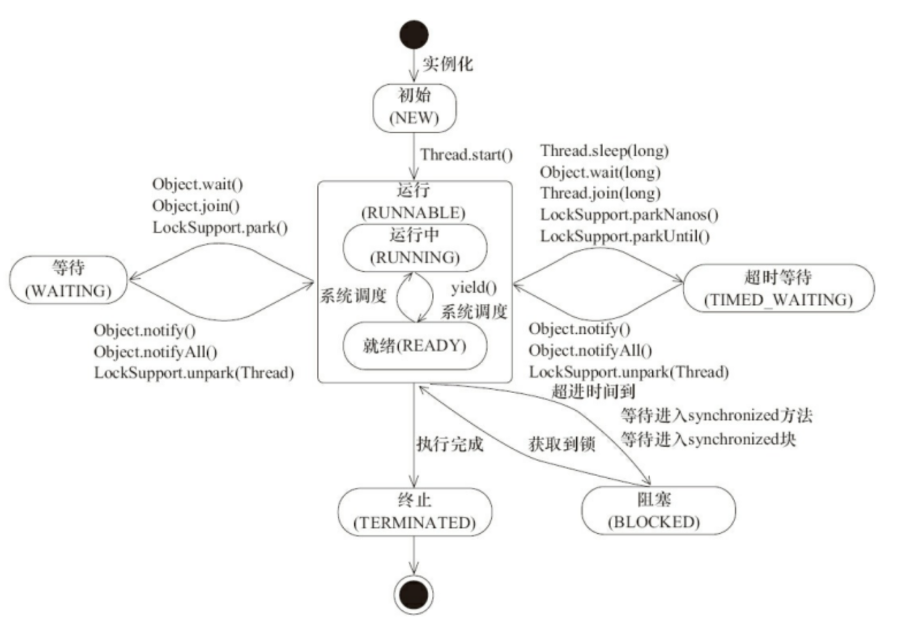
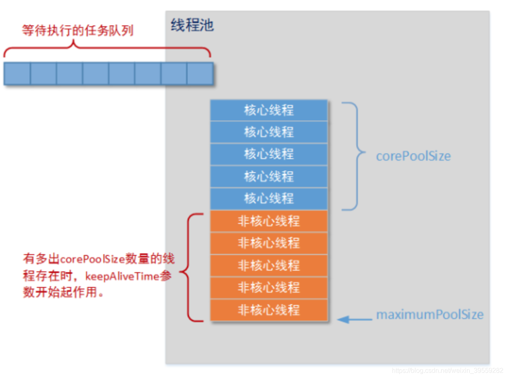
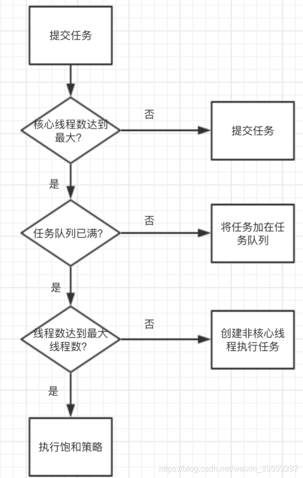
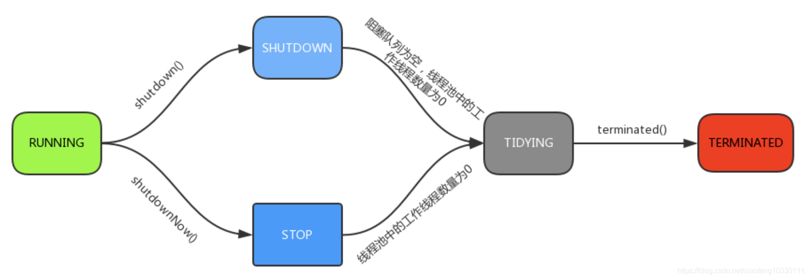
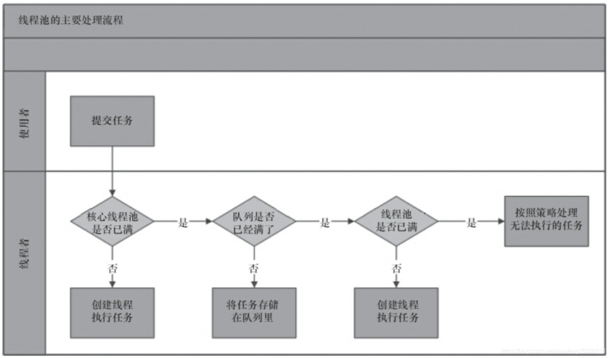
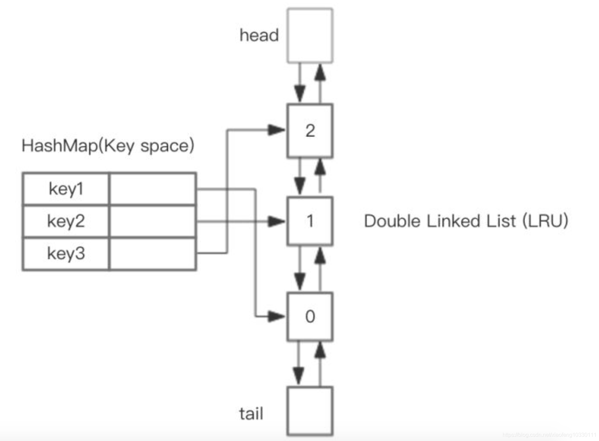
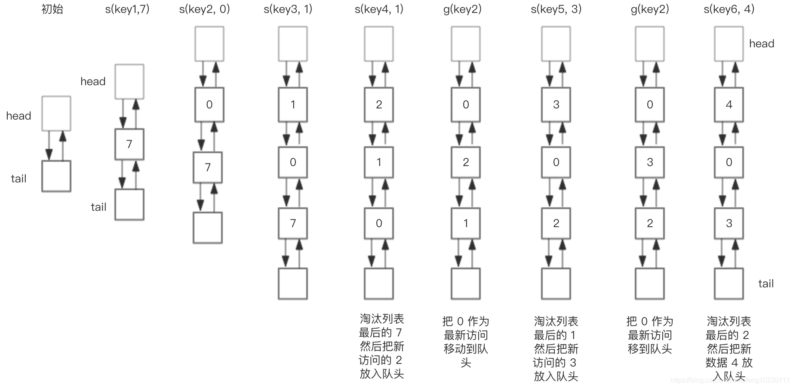
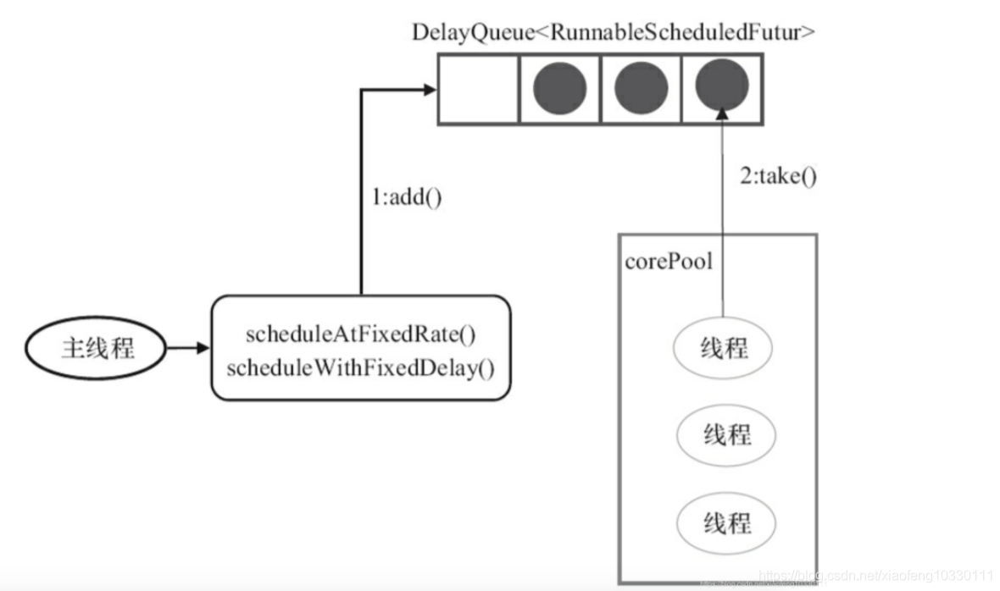

# 三、线程：

## 线程：


### 什么是进程和线程？

* 线程是程序执行流的最小执行单元，是实际运作单位。区别在于：进程是一个动态的过程，是活动的实体。简单说：一个应用程序的运行被看作一个进程，而线程是运行中实际的执行者，进程包含了很多个可以同时运行的线程。

 * 进程：进程是程序的一次执行过程，是系统运行程序的基本单位。系统运行一个程序即是进程从创建、运行、消亡的过程。进程是系统进行资源分配和调度的一个独立单元。

* 线程：线程和进程相似，但线程是比进程更小的执行单位。一个进程在执行过程中可以产生多个线程。这些线程共享进程的堆和方法区，同时拥有各自的计数器、虚拟机栈、本地方法栈。线程是进程的一个实体是CUP调度和分配的基本单元。

 * 总结：

   > 1.线程是程序执行的最小单元，而进程是操作系统分配资源的最小单元
   >
   > 2.一个程序至少有一个进程，一个进程至少有一个线程。
   >
   > 3.线程的划分尺度小于进程，线程比进程更轻量级。 
   >
   > 4.线程的开销小但是不利于资源的管理和保护，进程则相反。
   >
   > 5.从逻辑上讲 ，多线程的意义在于应用程序中，多个执行部分同时执行；但操作系统并没有将多线程看作多个独立的应用去实现资源分配和调度。

### 线程状态：



## 线程池

```java
 public ThreadPoolExecutor(int corePoolSize,
                              int maximumPoolSize,
                              long keepAliveTime,
                              TimeUnit unit,
                              BlockingQueue<Runnable> workQueue,
                              ThreadFactory threadFactory,
                              RejectedExecutionHandler handler) {
   
```


>`corePoolSize：核心线程数`、`最大线程数`、`keepAliveTime 空闲线程存活时间`、unit 空闲线程存活时间单位、`任务队列数`、threadFactory 线程工厂（创建新线程的工厂）、handler 拒绝策略



### 线程池的处理流程：




#### 线程池的拒绝策略：

* ThreadPoolExecutor.`AbortPolicy`:丢弃任务并抛出RejectedExecutionException异常。 
* ThreadPoolExecutor.`DiscardPolicy`：丢弃任务，但是不抛出异常。 
* ThreadPoolExecutor.`DiscardOldestPolicy`：丢弃队列最前面的任务，然后重新提交被拒绝的任务 
* ThreadPoolExecutor.`CallerRunsPolicy`：由调用线程（提交任务的线程）处理该任务

####  线程池不允许使用Executors去创建，而是通过new ThreadPoolExecutor（）的方式。

“线程池不允许使用Executors去创建，而是通过ThreadPoolExecutor的方式，这样的处理方式让写的同学更加明确线程池的运行规则，规避资源耗尽的风险”

* FixedThreadPool和SingleThreadExecutor => 允许的请求队列长度为Integer.MAX_VALUE，可能会堆积大量的请求，从而引起OOM异常
* CachedThreadPool => 允许创建的线程数为Integer.MAX_VALUE，可能会创建大量的线程，从而引起OOM异常


### 11.多线程中sleep与wait的区别是什么？

因为从表象来看，好像sleep和wait都能使线程处于阻塞状态，但是却有着本质上的区别：

* sleep是线程中的方法，但是wait是Object中的方法。
* sleep方法不会释放lock，但是wait会释放，而且会加入到等待队列中。
* sleep方法不依赖于同步器synchronized，但是wait需要依赖synchronized关键字。
* sleep不需要被唤醒（休眠之后推出阻塞），但是wait需要（不指定时间需要被别人中断）。

### 13.ThreadLocal的原理和实现

#### 了解ThreadLocal

ThreadLocal主要用来`存储当前线程上下文的变量信息`，它可以保障存储进去的数据，只能被当前线程读取到，并且线程之间不会相互影响。
ThreadLocal提供了set和get函数，set函数表示把数据存储到线程的上下文中，get函数表示从线程的上下文中读取数据。通过get函数读取数据，类似于`以当前线程为key从map中读取数据`。
在实际的应用场景中，InheritableThreadLocal可能更常用，它不仅可以取出当前线程存储的数据，还可以在子线程中读取父线程存储的数据。某些业务场景中，需要开启子线程，InheritableThreadLocal就派上用场了。

#### 典型的应用场景

* `数据库事务：`事务的实现原理非常简单，只需要在整个请求的处理过程中，用同一个connection开启事务、执行sql、提交事务就可以了。按照这个思路，实现起来也有两种方案：一种就是在第一次执行的时候 ，获取connection，在调用其他函数的时候，显示的传递connection对象。这种方案，只能存在于学习的demo中，无法应用到项目实践。另一种方案就是通过AOP的方式，对执行数据库事务的函数进行拦截。函数开始前，获取connection开启事务并存储在ThreadLocal中，任何用到connection的地方，从ThreadLocal中获取，函数执行完毕后，提交事务释放connection。
* `web项目中的用户登录信息`：web项目中，用户的登录信息通常保存在session中。按照分层的设计理念，往往会被分成controller层、service层、dao层等等，还约定在service层是不能处理request、session等对象的。一种方案是调用service函数的时候，显示的传递用户信息；另一种方案则是用到了ThreadLocal，做一个拦截器，把用户信息放在ThreadLocal中，在任何用到用户信息的时候，只需要从TreadLocal中读取就可以了。

#### ThreadLocal实现原理

* step1：首先看一下ThreadLocalMap，它是在ThreadLocal定义的一个内部类，看名字，就可以知道它用你来存储键值对的。只不过呢，它的`Key只能是ThreadLocal对象`。
* step2：再来看一下Thread，它有个ThreadLocalMap类型的属性threadLocals。
* step3：最后看一下get()函数的实现，得到当前线程的ThreadLocalMap，然后以当前的ThreadLocal对象为key，读取数据。这也就解释了为什么线程之间不会相互干扰，因为读取数据的时候，是从当前线程的ThreadLocalMap中读取的。

###  ThreadLocal归纳下来就2类用途：

* 保存线程上下文信息，在任意需要的地方可以获取！！！
* 线程安全的，避免某些情况需要考虑线程安全必须同步带来的性能损失！！！
* ThreadLocal用于创建线程的本地变量，我们知道一个对象的所有线程会共享它的全局变量，所以这些变量不是线程安全的，我们可以使用同步技术。但是当我们不想使用同步的时候，我们可以选择ThreadLocal变量。
* 每个线程都会拥有他们自己的Thread变量，它们可以使用get()\set()方法去获取他们的默认值或者在线程内部改变他们的值。ThreadLocal实例通常是希望它们同线程状态关联起来是private static属性
  ThreadLocal 是线程的局部变量， 是每一个线程所单独持有的，其他线程不能对其进行访问。
  当使用ThreadLocal维护变量的时候 为每一个使用该变量的线程提供一个独立的变量副本，即每个线程内部都会有一个该变量，这样同时多个线程访问该变量并不会彼此相互影响，因此他们使用的都是自己从内存中拷贝过来的变量的副本， 这样就不存在线程安全问题，也不会影响程序的执行性能。

但是要注意，虽然ThreadLocal能够解决上面说的问题，但是由于在每个线程中都创建了副本，所以要考虑它对资源的消耗，比如内存的占用会比不使用ThreadLocal要大。		 			 		

### 补充问题：

#### ThreadLocal为什么要使用弱引用和内存泄露问题

Map中的key为一个threadlocal实例. 这个Map的确使用了弱引用,不过弱引用只是针对key.每个key都弱引用指向threadlocal.

假如每个key都强引用指向threadlocal，那么这个threadlocal就会因为和entry存在强引用无法被回收！造成内存泄漏 ，除非线程结束，线程被回收了，map也跟着回收。

虽然上述的弱引用解决了key，也就是线程的ThreadLocal能及时被回收，但是value却依然存在内存泄漏的问题。

当把threadlocal实例置为null以后，没有任何强引用指向threadlocal实例，所以threadlocal将会被gc回收，map里面的value却没有被回收。而这块value永远不会被访问到了，所以存在着内存泄露，因为存在一条从current thread连接过来的强引用。只有当前thread结束以后,，current thread就不会存在栈中，强引用断开CurrentThreadMap，value将全部被GC回收，`所以当线程的某个localThread使用完了，马上调用threadlocal的remove方法`，就不会发生这种情况了。

另外其实只要这个线程对象及时被gc回收，这个内存泄露问题影响不大，但在threadLocal设为null到线程结束中间这段时间不会被回收的，就发生了我们认为的内存泄露。最要命的是线程对象不被回收的情况，这就发生了真正意义上的内存泄露。比如使用线程池的时候，线程结束是不会销毁的，会再次使用，就可能出现内存泄露。

### 14.为什么要使用线程池

Java的线程池是运用场景最多的并发框架，几乎所有需要异步或者并发执行任务的程序都可以使用线程池。
合理使用线程池能带来的好处：

* 降低资源消耗。 通过重复利用已经创建的线程降低线程创建的和销毁造成的消耗。例如，工作线程Woker会无线循环获取阻塞队列中的任务来执行。
* 提高响应速度。 当任务到达时，任务可以不需要等到线程创建就能立即执行。
* 提高线程的可管理性。 线程是稀缺资源，Java的线程池可以对线程资源进行统一分配、调优和监控。

### 补充问题：

### 线程池的线程数量怎么确定

* 一般来说，如果是CPU密集型应用，则线程池大小设置为N+1。

* 一般来说，如果是IO密集型应用，则线程池大小设置为2N+1。

在IO优化中，线程等待时间所占比例越高，需要越多线程，线程CPU时间所占比例越高，需要越少线程。这样的估算公式可能更适合：最佳线程数目 = （（线程等待时间+线程CPU时间）/线程CPU时间 ）* CPU数目
线程池的五种运行状态   




RUNNING ： 该状态的线程池既能接受新提交的任务，又能处理阻塞队列中任务。
SHUTDOWN：该状态的线程池**不能接收新提交的任务**，**但是能处理阻塞队列中的任务**。处于 RUNNING 状态时，调用 shutdown()方法会使线程池进入到该状态。
注意： finalize() 方法在执行过程中也会隐式调用shutdown()方法。
STOP： 该状态的线程池不接受新提交的任务，也不处理在阻塞队列中的任务，还会中断正在执行的任务。在线程池处于 RUNNING 或 SHUTDOWN 状态时，调用 shutdownNow() 方法会使线程池进入到该状态；
TIDYING： 如果所有的任务都已终止，workerCount (有效线程数)=0 。线程池进入该状态后会调用 terminated() 钩子方法进入TERMINATED 状态。
TERMINATED： 在terminated()钩子方法执行完后进入该状态，默认terminated()钩子方法中什么也没有做。

线程池的关闭（shutdown或者shutdownNow方法）   
可以通过调用线程池的shutdown或者shutdownNow方法来关闭线程池：遍历线程池中工作线程，逐个调用interrupt方法来中断线程。
shutdown方法与shutdownNow的特点：

shutdown方法将线程池的状态设置为SHUTDOWN状态，只会中断空闲的工作线程。
shutdownNow方法将线程池的状态设置为STOP状态，会中断所有工作线程，不管工作线程是否空闲。
调用两者中任何一种方法，都会使isShutdown方法的返回值为true；线程池中所有的任务都关闭后，isTerminated方法的返回值为true。
通常使用shutdown方法关闭线程池，如果不要求任务一定要执行完，则可以调用shutdownNow方法。

### 15.如何控制线程池线程的优先级

思路：

设定一个 orderNum，每个线程执行结束之后，更新 orderNum，指明下一个要执行的线程。并且唤醒所有的等待线程。
在每一个线程的开始，要 while 判断 orderNum 是否等于自己的要求值，不是，则 wait，是则执行本线程。

### 16.线程之间如何通信

线程间的四种通信方式

* 方式一：同步

这里讲的同步是指多个线程通过synchronized关键字这种方式来实现线程间的通信。这种方式，本质上就是“共享内存”式的通信。多个线程需要访问同一个共享变量，谁拿到了锁（获得了访问权限），谁就可以执行。

* 方式二：while轮询的方式

在这种方式下，线程A不断地改变条件，线程ThreadB不停地通过while语句检测这个条件(例如，list.size==5)是否成立 ，从而实现了线程间的通信。但是这种方式会浪费CPU资源。之所以说它浪费资源，是因为JVM调度器将CPU交给线程B执行时，它没做啥“有用”的工作，只是在不断地测试某个条件是否成立。

* 方式三：wait/notify机制

这里用到了Object类的 wait 和 notify 方法。

当条件未满足时(list.size !=5)，线程A调用wait 放弃CPU，并进入阻塞状态。---不像while轮询那样占用CPU

当条件满足时，线程B调用 notify通知线程A，所谓通知线程A，就是唤醒线程A，并让它进入可运行状态。

这种方式的一个好处就是CPU的利用率提高了。

但是也有一些缺点：比如，线程B先执行，一下子添加了5个元素并调用了notify发送了通知，而此时线程A还执行；当线程A执行并调用wait时，那它永远就不可能被唤醒了。因为，线程B已经发了通知了，以后不再发通知了。这说明：通知过早，会打乱程序的执行逻辑。

* 方式四：管道通信

就是使用java.io.PipedInputStream 和 java.io.PipedOutputStream进行通信，更像消息传递机制，也就是说：通过管道，将一个线程中的消息发送给另一个。

### 17.核心线程池ThreadPoolExecutor的参数

可以通过ThreadPoolExecutor来创建一个线程池，先上代码吧：

`new ThreadPoolExecutor(int corePoolSize, int maximumPoolSize, long keepAliveTime,
	TimeUnit unit, BlockingQueue<Runnable> workQueue, RejectedExecutionHandler handler)`
常用的5个，`核心池、最大池、空闲时间、时间的单位、阻塞队列`；另外两个：拒绝策略、线程工厂类

>corePoolSize：指定了线程池中的线程数量
>maximumPoolSize：指定了线程池中的最大线程数量
>keepAliveTime：线程池维护线程所允许的空闲时间
>unit: keepAliveTime 的单位。
>workQueue：任务队列，被提交但尚未被执行的任务。
>threadFactory：线程工厂，用于创建线程，一般用默认的即可。
>handler：拒绝策略。当任务太多来不及处理，如何拒绝任务。

具体详细说明：

corePoolSize（线程池的基本大小）：

提交一个任务到线程池时，线程池会创建一个新的线程来执行任务。注意： 即使有空闲的基本线程能执行该任务，也会创建新的线程。
如果线程池中的线程数已经大于或等于corePoolSize，则不会创建新的线程。
如果调用了线程池的prestartAllCoreThreads()方法，线程池会提前创建并启动所有基本线程。
maximumPoolSize（线程池的最大数量）： 线程池允许创建的最大线程数。

阻塞队列已满，线程数小于maximumPoolSize便可以创建新的线程执行任务。
如果使用无界的阻塞队列，该参数没有什么效果。
workQueue（工作队列）： 用于保存等待执行的任务的阻塞队列。

ArrayBlockingQueue： 基于数组结构的有界阻塞队列，按FIFO（先进先出）原则对任务进行排序。使用该队列，线程池中能创建的最大线程数为maximumPoolSize。
LinkedBlockingQueue： 基于链表结构的无界阻塞队列，按FIFO（先进先出）原则对任务进行排序，吞吐量高于ArrayBlockingQueue。使用该队列，线程池中能创建的最大线程数为corePoolSize。静态工厂方法 Executor.newFixedThreadPool()使用了这个队列。
SynchronousQueue： 一个不存储元素的阻塞队列。添加任务的操作必须等到另一个线程的移除操作，否则添加操作一直处于阻塞状态。静态工厂方法 Executor.newCachedThreadPool()使用了这个队列。
PriorityBlokingQueue： 一个支持优先级的无界阻塞队列。使用该队列，线程池中能创建的最大线程数为corePoolSize。
keepAliveTime（线程活动保持时间）： 线程池的工作线程空闲后，保持存活的时间。如果任务多而且任务的执行时间比较短，可以调大keepAliveTime，提高线程的利用率。
unit（线程活动保持时间的单位）： 可选单位有DAYS、HOURS、MINUTES、毫秒、微秒、纳秒。
handler（饱和策略，或者又称拒绝策略）： 当队列和线程池都满了，即线程池饱和了，必须采取一种策略处理提交的新任务。

AbortPolicy： 无法处理新任务时，直接抛出异常，这是默认策略。
CallerRunsPolicy：用调用者所在的线程来执行任务。
DiscardOldestPolicy：丢弃阻塞队列中最靠前的一个任务，并执行当前任务。
DiscardPolicy： 直接丢弃任务。
threadFactory： 构建线程的工厂类

### 补充问题：

常见线程池的创建参数是什么样的？
PS: CachedThreadPool核心池为0，最大池为Integer.MAX_VALUE，相当于只使用了最大池；其他线程池，核心池与最大池一样大，因此相当于只用了核心池。

FixedThredPool: new ThreadExcutor(n, n, 0L, ms, new LinkedBlockingQueue<Runable>()
SingleThreadExecutor: new ThreadExcutor(1, 1, 0L, ms, new LinkedBlockingQueue<Runable>())
CachedTheadPool: new ThreadExcutor(0, max_valuem, 60L, s, new SynchronousQueue<Runnable>());
ScheduledThreadPoolExcutor: ScheduledThreadPool, SingleThreadScheduledExecutor.

注意：

如果使用的阻塞队列为无界队列，则永远不会调用拒绝策略，因为再多的任务都可以放在队列中。
SynchronousQueue是不存储任务的，新的任务要么立即被已有线程执行，要么创建新的线程执行。

### 18.ThreadPoolExecutor的工作流程

基本背景思路：

一个新的任务到线程池时，线程池的处理流程如下：



 

线程池判断核心线程池里的线程是否都在执行任务。 如果不是，创建一个新的工作线程来执行任务。如果核心线程池里的线程都在执行任务，则进入下个流程。
线程池判断阻塞队列是否已满。 如果阻塞队列没有满，则将新提交的任务存储在阻塞队列中。如果阻塞队列已满，则进入下个流程。
线程池判断线程池里的线程是否都处于工作状态。 如果没有，则创建一个新的工作线程来执行任务。如果已满，则交给饱和策略来处理这个任务。
ThreadPoolExecutor类具体的处理流程：

线程池的核心实现类是ThreadPoolExecutor类，用来执行提交的任务。因此，任务提交到线程池时，具体的处理流程是由ThreadPoolExecutor类的execute()方法去完成的。


如果当前运行的线程少于corePoolSize，则创建新的工作线程来执行任务（执行这一步骤需要获取全局锁）。
如果当前运行的线程大于或等于corePoolSize，而且BlockingQueue未满，则将任务加入到BlockingQueue中。
如果BlockingQueue已满，而且当前运行的线程小于maximumPoolSize，则创建新的工作线程来执行任务（执行这一步骤需要获取全局锁）。
如果当前运行的线程大于或等于maximumPoolSize，任务将被拒绝，并调用RejectExecutionHandler.rejectExecution()方法。即调用饱和策略对任务进行处理。
补充问题：
Java线程池的调优经验有哪些？（线程池的合理配置）
从以下几个角度分析任务的特性：

任务的性质： CPU 密集型任务、IO 密集型任务和混合型任务。
任务的优先级： 高、中、低。
任务的执行时间： 长、中、短。
任务的依赖性： 是否依赖其他系统资源，如数据库连接。
任务性质不同的任务可以用不同规模的线程池分开处理。 可以通过 Runtime.getRuntime().availableProcessors() 方法获得当前设备的 CPU 个数。

CPU 密集型任务配置尽可能小的线程，如配置 个线程的线程池。
IO 密集型任务则由于线程并不是一直在执行任务，则配置尽可能多的线程，如 。
混合型任务，如果可以拆分，则将其拆分成一个 CPU 密集型任务和一个 IO 密集型任务。只要这两个任务执行的时间相差不是太大，那么分解后执行的吞吐率要高于串行执行的吞吐率；如果这两个任务执行时间相差太大，则没必要进行分解。
优先级不同的任务可以使用优先级队列 PriorityBlockingQueue 来处理，它可以让优先级高的任务先得到执行。但是，如果一直有高优先级的任务加入到阻塞队列中，那么低优先级的任务可能永远不能执行。
执行时间不同的任务可以交给不同规模的线程池来处理，或者也可以使用优先级队列，让执行时间短的任务先执行。
依赖数据库连接池的任务，因为线程提交 SQL 后需要等待数据库返回结果，线程数应该设置得较大，这样才能更好的利用 CPU。
建议使用有界队列，有界队列能增加系统的稳定性和预警能力。可以根据需要设大一点，比如几千。使用无界队列，线程池的队列就会越来越大，有可能会撑满内存，导致整个系统不可用。

怎么对线程池进行有效监控？
以通过线程池提供的参数读线程池进行监控，有以下属性可以使用：

taskCount：线程池需要执行的任务数量，包括已经执行完的、未执行的和正在执行的。
completedTaskCount：线程池在运行过程中已完成的任务数量，completedTaskCount <= taskCount。
largestPoolSize：线程池曾经创建过的最大线程数量，通过这个数据可以知道线程池是否满过。如等于线程池的最大大小，则表示线程池曾经满了。
getPoolSize: 线程池的线程数量。如果线程池不销毁的话，池里的线程不会自动销毁，所以线程池的线程数量只增不减。
getActiveCount：获取活动的线程数。
通过继承线程池并重写线程池的 beforeExecute，afterExecute 和 terminated 方法，我们可以在任务执行前，执行后和线程池关闭前干一些事情。


### 25.LRU算法是怎么实现的？大致说明下（必考）

LRU算法的设计原则：

如果一个数据在最近一段时间没有被访问到，那么在将来它被访问的可能性也很小。也就是说，当限定的空间已存满数据时，应当把最久没有被访问到的数据淘汰。

当存在热点数据时，LRU的效率很好，但偶发性的、周期性的批量操作会导致LRU命中率急剧下降，缓存污染情况比较严重。

实现LRU思路：

第一种方法：利用数组来实现

用一个数组来存储数据，给每一个数据项标记一个访问时间戳

每次插入新数据项的时候，先把数组中存在的数据项的时间戳自增，并将新数据项的时间戳置为0并插入到数组中

每次访问数组中的数据项的时候，将被访问的数据项的时间戳置为0。

当数组空间已满时，将时间戳最大的数据项淘汰。

第二种方法：利用链表来实现

每次新插入数据的时候将新数据插到链表的头部

每次缓存命中（即数据被访问），则将数据移到链表头部；

那么当链表满的时候，就将链表尾部的数据丢弃。

第三种方法：利用链表和hashmap来实现

当需要插入新的数据项的时候，如果新数据项在链表中存在（一般称为命中），则把该节点移到链表头部，如果不存在，则新建一个节点，放到链表头部，若缓存满了，则把链表最后一个节点删除即可。

在访问数据的时候，如果数据项在链表中存在，则把该节点移到链表头部，否则返回-1。这样一来在链表尾部的节点就是最近最久未访问的数据项。

对于第一种方法，需要不停地维护数据项的访问时间戳，另外，在插入数据、删除数据以及访问数据时，时间复杂度都是O(n)。对于第二种方法，链表在定位数据的时候时间复杂度为O(n)。所以在一般使用第三种方式来是实现LRU算法。

具体实现方案：使用LinkedHashMap实现
LinkedHashMap底层就是用的HashMap加双链表实现的，而且本身已经实现了按照访问顺序的存储。

此外，LinkedHashMap中本身就实现了一个方法removeEldestEntry用于判断是否需要移除最不常读取的数，方法默认是直接返回false，不会移除元素，所以需要重写该方法。即当缓存满后就移除最不常用的数。

```java
public class LRU<K,V> {

  private static final float hashLoadFactory = 0.75f;
  private LinkedHashMap<K,V> map;
  private int cacheSize;

  public LRU(int cacheSize) {
    this.cacheSize = cacheSize;
    int capacity = (int)Math.ceil(cacheSize / hashLoadFactory) + 1;
    map = new LinkedHashMap<K,V>(capacity, hashLoadFactory, true){
      private static final long serialVersionUID = 1;

  /*将LinkedHashMap中的removeEldestEntry进行重写改造*/
  @Override
  protected boolean removeEldestEntry(Map.Entry eldest) {
    return size() > LRU.this.cacheSize;
  }
};

  }

  public synchronized V get(K key) {
    return map.get(key);
  }

  public synchronized void put(K key, V value) {
    map.put(key, value);
  }

  public synchronized void clear() {
    map.clear();
  }

  public synchronized int usedSize() {
    return map.size();
  }

  public void print() {
    for (Map.Entry<K, V> entry : map.entrySet()) {
      System.out.print(entry.getValue() + "--");
    }
    System.out.println();
  }
}
```

也可以自己手写一个：基于 HashMap 和 双向链表实现 LRU
整体的设计思路是：可以使用 HashMap 存储 key，这样可以做到 save 和 get key的时间都是 O(1)，而 HashMap 的 Value 指向双向链表实现的 LRU 的 Node 节点，如图所示。



LRU 存储是基于双向链表实现的，下面的图演示了它的原理。其中 h 代表双向链表的表头，t 代表尾部。首先预先设置 LRU 的容量，如果存储满了，可以通过 O(1) 的时间淘汰掉双向链表的尾部，每次新增和访问数据，都可以通过 O(1)的效率把新的节点增加到对头，或者把已经存在的节点移动到队头。



总结一下核心操作的步骤:

save(key, value)，首先在 HashMap 找到 Key 对应的节点，如果节点存在，更新节点的值，并把这个节点移动队头。如果不存在，需要构造新的节点，并且尝试把节点塞到队头，如果LRU空间不足，则通过 tail 淘汰掉队尾的节点，同时在 HashMap 中移除 Key。
get(key)，通过 HashMap 找到 LRU 链表节点，把节点插入到队头，返回缓存的值。
定义基本结构：

```java
class DLinkedNode {
	String key;
	int value;
	DLinkedNode pre;
	DLinkedNode post;
}
```

具体手写代码如下：

```java
public class LRUCache {

    private Hashtable<Integer, DLinkedNode> cache = new Hashtable<Integer, DLinkedNode>();
    private int count;
    private int capacity;
    private DLinkedNode head, tail;
     
    public LRUCache(int capacity) {
        this.count = 0;
        this.capacity = capacity;
     
        head = new DLinkedNode();
        head.pre = null;
     
        tail = new DLinkedNode();
        tail.post = null;
     
        head.post = tail;
        tail.pre = head;
    }
     
    public int get(String key) {
     
        DLinkedNode node = cache.get(key);
        if(node == null){
            /**should raise exception here.*/
            return -1; 
        }
     
        // move the accessed node to the head;
        this.moveToHead(node);
     
        return node.value;
    }


    public void set(String key, int value) {
        DLinkedNode node = cache.get(key);
     
        if(node == null){
     
            DLinkedNode newNode = new DLinkedNode();
            newNode.key = key;
            newNode.value = value;
     
            this.cache.put(key, newNode);
            this.addNode(newNode);
     
            ++count;
     
            if(count > capacity){
                // pop the tail
                DLinkedNode tail = this.popTail();
                this.cache.remove(tail.key);
                --count;
            }
        }else{
            // update the value.
            node.value = value;
            this.moveToHead(node);
        }
    }
    /**
     * Always add the new node right after head;
     */
    private void addNode(DLinkedNode node){
        node.pre = head;
        node.post = head.post;
     
        head.post.pre = node;
        head.post = node;
    }
     
    /**
     * Remove an existing node from the linked list.
     */
    private void removeNode(DLinkedNode node){
        DLinkedNode pre = node.pre;
        DLinkedNode post = node.post;
     
        pre.post = post;
        post.pre = pre;
    }
     
    /**
     * Move certain node in between to the head.
     */
    private void moveToHead(DLinkedNode node){
        this.removeNode(node);
        this.addNode(node);
    }
     
    // pop the current tail.
    private DLinkedNode popTail(){
        DLinkedNode res = tail.pre;
        this.removeNode(res);
        return res;
    }

}
```

其他相关内容补充：
LRU-K
LRU-K中的K代表最近使用的次数，因此LRU可以认为是LRU-1。LRU-K的主要目的是为了解决LRU算法“缓存污染”的问题，其核心思想是将“最近使用过1次”的判断标准扩展为“最近使用过K次”。
相比LRU，LRU-K需要多维护一个队列，用于记录所有缓存数据被访问的历史。只有当数据的访问次数达到K次的时候，才将数据放入缓存。当需要淘汰数据时，LRU-K会淘汰第K次访问时间距当前时间最大的数据。

数据第一次被访问时，加入到历史访问列表，如果数据在访问历史列表中没有达到K次访问，则按照一定的规则（FIFO,LRU）淘汰；
当访问历史队列中的数据访问次数达到K次后，将数据索引从历史队列中删除，将数据移到缓存队列中，并缓存数据，缓存队列重新按照时间排序；
缓存数据队列中被再次访问后，重新排序，需要淘汰数据时，淘汰缓存队列中排在末尾的数据，即“淘汰倒数K次访问离现在最久的数据”。
LRU-K具有LRU的优点，同时还能避免LRU的缺点，实际应用中LRU-2是综合最优的选择。由于LRU-K还需要记录那些被访问过、但还没有放入缓存的对象，因此内存消耗会比LRU要多。

two queue
Two queues（以下使用2Q代替）算法类似于LRU-2，不同点在于2Q将LRU-2算法中的访问历史队列（注意这不是缓存数据的）改为一个FIFO缓存队列，即：2Q算法有两个缓存队列，一个是FIFO队列，一个是LRU队列。

当数据第一次访问时，2Q算法将数据缓存在FIFO队列里面，当数据第二次被访问时，则将数据从FIFO队列移到LRU队列里面，两个队列各自按照自己的方法淘汰数据。
新访问的数据插入到FIFO队列中，如果数据在FIFO队列中一直没有被再次访问，则最终按照FIFO规则淘汰；
如果数据在FIFO队列中再次被访问到，则将数据移到LRU队列头部，如果数据在LRU队列中再次被访问，则将数据移动LRU队列头部，LRU队列淘汰末尾的数据。
Multi Queue(MQ)
MQ算法根据访问频率将数据划分为多个队列，不同的队列具有不同的访问优先级，其核心思想是：优先缓存访问次数多的数据。Q0，Q1....Qk代表不同的优先级队列，Q-history代表从缓存中淘汰数据，但记录了数据的索引和引用次数的队列：

新插入的数据放入Q0，每个队列按照LRU进行管理，当数据的访问次数达到一定次数，需要提升优先级时，将数据从当前队列中删除，加入到高一级队列的头部；
为了防止高优先级数据永远不会被淘汰，当数据在指定的时间里没有被访问时，需要降低优先级，将数据从当前队列删除，加入到低一级的队列头部；
需要淘汰数据时，从最低一级队列开始按照LRU淘汰，每个队列淘汰数据时，将数据从缓存中删除，将数据索引加入Q-history头部。如果数据在Q-history中被重新访问，则重新计算其优先级，移到目标队列头部。Q-history按照LRU淘汰数据的索引。
MQ需要维护多个队列，且需要维护每个数据的访问时间，复杂度比LRU高。


### 27.ScheduledThreadPoolExecutor中的使用的是什么队列？内部如何实现任务排序的？

ScheduledThreadPoolExecutor继承自ThreadPoolExecutor。

它主要用来在给定的延迟之后运行任务，或者定期执行任务。ScheduledThreadPoolExecutor的功能与Timer类似，但 ScheduledThreadPoolExecutor功能更强大、更灵活。Timer对应的是单个后台线程，而 ScheduledThreadPoolExecutor可以在构造函数中指定多个对应的后台线程数。



DelayQueue是一个无界队列，所以ThreadPoolExecutor的maximumPoolSize在ScheduledThreadPoolExecutor中没有什么意义（设置maximumPoolSize的大小没有什么效果）。
ScheduledThreadPoolExecutor的执行主要分为两大部分。

1）当调用ScheduledThreadPoolExecutor的scheduleAtFixedRate()方法或者scheduleWithFixedDelay()方法时，会向ScheduledThreadPoolExecutor的DelayQueue添加一个实现了RunnableScheduledFutur接口的ScheduledFutureTask。
2）线程池中的线程从DelayQueue中获取ScheduledFutureTask，然后执行任务。
ScheduledThreadPoolExecutor为了实现周期性的执行任务，对ThreadPoolExecutor做了如下的修改。

使用DelayQueue作为任务队列。
获取任务的方式不同。
执行周期任务后，增加了额外的处理。


## 线程面试题：

### 1、线程池中线程的数量确认：

>1、CPU密集型：操作内存处理的业务，一般线程数设置为：CPU核数 + 1 或者 CPU核数*2。核数为4的话，一般设置 5 或 8
>
>2、IO密集型：文件操作，网络操作，数据库操作，一般线程设置为：cpu核数 / (1-0.9)，核数为4的话，一般设置 40

### 2、线程池的参数：

>
>
>

### 3、java多线程是如何实现的及底层原理？和操作系统有什么关系？

>底层是通过调用操作系统的底层的线程创建方式去实现的。
>
>