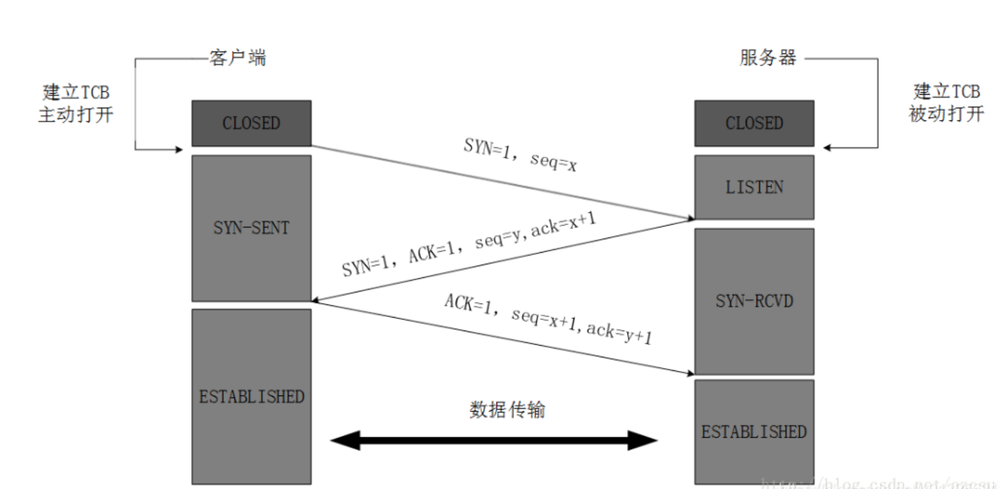

[toc]

 

## 自言自语

### 三次握手：

* 第一次握手：客户端A向服务器端B发起建立连接的请求，同时传送包含SYN=1以及客户端A随机生成的 seq number = XXX的数据包，服务器端B通过SYN=1可知 ，A想要建立连接

* 第二次握手：服务器端B收到连接请求后需要给A一个确认信息，向A发送包含：ack number=（XXX（A seq number）  + 1 ），SYN=1，ACK=1 及随机产生一个seq number = xxxx，的数据包。

* 第三次握手：客户端A接收到服务器端B的确认请求，检查ack number 是否我首次seq number +1， 及ACK是否为1，若正确，A会再发送ack number =(服务端B的seq +1), ack=1，B收到确认seq值与ack=1，则连接建立成功。

  

### 四次挥手：

* 第一次挥手：
* 