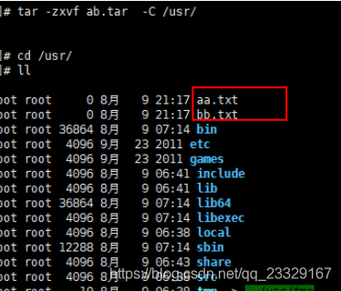

# Linux常用命令


### 一、基本命令

#### 1.1 关机和重启

关机
    shutdown -h now        立刻关机
    shutdown -h 5        5分钟后关机
    poweroff            立刻关机
重启
    shutdown -r now        立刻重启
    shutdown -r 5        5分钟后重启
    reboot                立刻重启

#### 1.2 帮助命令

--help命令
  shutdown --help：
  ifconfig  --help：查看网卡信息

man命令（命令说明书） 
  man shutdown
  注意：man shutdown打开命令说明书之后，使用按键q退出

### 二、目录操作命令

#### 2.1 目录切换 cd

命令：cd 目录

cd /        切换到根目录
cd /usr        切换到根目录下的usr目录
cd ../        切换到上一级目录 或者  cd ..
cd ~        切换到home目录
cd -        切换到上次访问的目录

#### 2.2 目录查看 ls [-al]

命令：ls [-al]

ls                查看当前目录下的所有目录和文件
ls -a            查看当前目录下的所有目录和文件（包括隐藏的文件）
ls -l 或 ll       列表查看当前目录下的所有目录和文件（列表查看，显示更多信息）
ls /dir            查看指定目录下的所有目录和文件   如：ls /usr

#### 2.3 目录操作【增，删，改，查】

##### 2.3.1 创建目录【增】 mkdir

命令：mkdir 目录

mkdir    aaa            在当前目录下创建一个名为aaa的目录
mkdir    /usr/aaa    在指定目录下创建一个名为aaa的目录

##### 2.3.2 删除目录或文件【删】rm

命令：rm [-rf] 目录

删除文件：
rm 文件        删除当前目录下的文件
rm -f 文件    删除当前目录的的文件（不询问）

删除目录：
rm -r aaa    递归删除当前目录下的aaa目录
rm -rf aaa    递归删除当前目录下的aaa目录（不询问）

全部删除：
rm -rf *    将当前目录下的所有目录和文件全部删除
rm -rf /*    【自杀命令！慎用！慎用！慎用！】将根目录下的所有文件全部删除

注意：rm不仅可以删除目录，也可以删除其他文件或压缩包，为了方便大家的记忆，无论删除任何目录或文件，都直接使用 rm -rf 目录/文件/压缩包

##### 2.3.3 目录修改【改】mv 和 cp

**重命名目录**
    命令：mv 当前目录  新目录
    例如：mv aaa bbb    将目录aaa改为bbb
    注意：mv的语法不仅可以对目录进行重命名而且也可以对各种文件，压缩包等进行    重命名的操作

**剪切目录**
    命令：mv 目录名称 目录的新位置
    示例：将/usr/tmp目录下的aaa目录剪切到 /usr目录下面     mv /usr/tmp/aaa /usr
    注意：mv语法不仅可以对目录进行剪切操作，对文件和压缩包等都可执行剪切操作

**拷贝目录**
    命令：cp -r 目录名称 目录拷贝的目标位置   -r代表递归
    示例：将/usr/tmp目录下的aaa目录复制到 /usr目录下面     cp /usr/tmp/aaa  /usr
    注意：cp命令不仅可以拷贝目录还可以拷贝文件，压缩包等，拷贝文件和压缩包时不    用写-r递归

##### 2.3.4 搜索目录【查】find

命令：find 目录 参数 文件名称
示例：find /usr/tmp -name 'a*'    查找/usr/tmp目录下的所有以a开头的目录或文件

### 三、文件操作命令

#### 3.1 文件操作【增，删，改，查】

##### 3.1.1 新建文件【增】touch

命令：touch 文件名
示例：在当前目录创建一个名为aa.txt的文件        touch  aa.txt

##### 3.1.2 删除文件 【删】 rm

命令：rm -rf 文件名

##### 3.1.3 修改文件【改】 vi或vim

【vi编辑器的3种模式】
    基本上vi可以分为三种状态，分别是命令模式（command mode）、插入模式（Insert mode）和底行模式（last line mode），各模式的功能区分如下：
1) 命令行模式command mode）
      控制屏幕光标的移动，字符、字或行的删除，查找，移动复制某区段及进入Insert mode下，或者到 last line mode。
      命令行模式下的常用命令：
      【1】控制光标移动：↑，↓，j
      【2】删除当前行：dd 
      【3】查找：/字符
      【4】进入编辑模式：i o a
      【5】进入底行模式：:
      
2) 编辑模式（Insert mode）
      只有在Insert mode下，才可以做文字输入，按「ESC」键可回到命令行模式。
      编辑模式下常用命令：
      【1】ESC 退出编辑模式到命令行模式；
      
3) 底行模式（last line mode）
     将文件保存或退出vi，也可以设置编辑环境，如寻找字符串、列出行号……等。
     底行模式下常用命令：
     【1】退出编辑：   :q
     【2】强制退出：   :q!
     【3】保存并退出：  :wq

打开文件

命令：vi 文件名
示例：打开当前目录下的aa.txt文件     vi aa.txt 或者 vim aa.txt

注意：使用vi编辑器打开文件后，并不能编辑，因为此时处于命令模式，点击键盘i/a/o进入编辑模式。

编辑文件

使用vi编辑器打开文件后点击按键：i ，a或者o即可进入编辑模式。

i:在光标所在字符前开始插入
a:在光标所在字符后开始插入
o:在光标所在行的下面另起一新行插入

保存或者取消编辑

保存文件：

第一步：ESC  进入命令行模式
第二步：:     进入底行模式
第三步：wq     保存并退出编辑

取消编辑：

第一步：ESC  进入命令行模式
第二步：:     进入底行模式
第三步：q!     撤销本次修改并退出编辑

##### 3.1.4 文件的查看【查】

文件的查看命令：cat/more/less/tail

cat：看最后一屏

示例：使用cat查看/etc/sudo.conf文件，只能显示最后一屏内容
cat sudo.conf

more：百分比显示

示例：使用more查看/etc/sudo.conf文件，可以显示百分比，回车可以向下一行，空格可以向下一页，q可以退出查看
more sudo.conf

less：翻页查看

示例：使用less查看/etc/sudo.conf文件，可以使用键盘上的PgUp和PgDn向上    和向下翻页，q结束查看
less sudo.conf

tail：指定行数或者动态查看

示例：使用tail -10 查看/etc/sudo.conf文件的后10行，Ctrl+C结束  
tail -10 sudo.conf

#### 3.2 权限修改

rwx：r代表可读，w代表可写，x代表该文件是一个可执行文件，如果rwx任意位置变为-则代表不可读或不可写或不可执行文件。

示例：给aaa.txt文件权限改为可执行文件权限，aaa.txt文件的权限是-rw-------

第一位：-就代表是文件，d代表是文件夹
第一段（3位）：代表拥有者的权限
第二段（3位）：代表拥有者所在的组，组员的权限
第三段（最后3位）：代表的是其他用户的权限

   421  421  421
-  rw-   ---     ---

```
命令：chmod +x aaa.txt
或者采用8421法
命令：chmod 100 aaa.txt
```


### 四、压缩文件操作

#### 4.1 打包和压缩

Windows的压缩文件的扩展名  .zip/.rar
linux中的打包文件：aa.tar      
linux中的压缩文件：bb.gz    
linux中打包并压缩的文件：.tar.gz

Linux中的打包文件一般是以.tar结尾的，压缩的命令一般是以.gz结尾的。
而一般情况下打包和压缩是一起进行的，打包并压缩后的文件的后缀名一般.tar.gz。

命令：tar -zcvf 打包压缩后的文件名 要打包的文件
其中：z：调用gzip压缩命令进行压缩
  c：打包文件
  v：显示运行过程
  f：指定文件名

示例：打包并压缩/usr/tmp 下的所有文件 压缩后的压缩包指定名称为xxx.tar
tar -zcvf ab.tar aa.txt bb.txt 
或：tar -zcvf ab.tar  *

#### 4.2 解压

命令：tar [-zxvf] 压缩文件    
其中：x：代表解压
示例：将/usr/tmp 下的ab.tar解压到当前目录下


示例：将/usr/tmp 下的ab.tar解压到根目录/usr下
tar -xvf ab.tar -C /usr------C代表指定解压的位置



### 五、查找命令

#### 5.1 grep

grep命令是一种强大的文本搜索工具

使用实例：

```
ps -ef | grep sshd  查找指定ssh服务进程 
ps -ef | grep sshd | grep -v grep 查找指定服务进程，排除gerp身 
ps -ef | grep sshd -c 查找指定进程个数 
```

#### 5.2 find

find命令在目录结构中搜索文件，并对搜索结果执行指定的操作。 

find 默认搜索当前目录及其子目录，并且不过滤任何结果（也就是返回所有文件），将它们全都显示在屏幕上。

使用实例：

find . -name "*.log" -ls  在当前目录查找以.log结尾的文件，并显示详细信息。 
find /root/ -perm 600   查找/root/目录下权限为600的文件 
find . -type f -name "*.log"  查找当目录，以.log结尾的普通文件 
find . -type d | sort   查找当前所有目录并排序 
find . -size +100M  查找当前目录大于100M的文件

#### 5.3 locate

locate 让使用者可以很快速的搜寻某个路径。默认每天自动更新一次，所以使用locate 命令查不到最新变动过的文件。为了避免这种情况，可以在使用locate之前，先使用updatedb命令，手动更新数据库。如果数据库中没有查询的数据，则会报出locate: can not stat () `/var/lib/mlocate/mlocate.db': No such file or directory该错误！updatedb即可！

yum -y install mlocate 如果是精简版CentOS系统需要安装locate命令

使用实例：

updatedb
locate /etc/sh 搜索etc目录下所有以sh开头的文件 
locate pwd 查找和pwd相关的所有文件

#### 5.4 whereis

whereis命令是定位可执行文件、源代码文件、帮助文件在文件系统中的位置。这些文件的属性应属于原始代码，二进制文件，或是帮助文件。

使用实例：

whereis ls    将和ls文件相关的文件都查找出来

#### 5.5 which

which命令的作用是在PATH变量指定的路径中，搜索某个系统命令的位置，并且返回第一个搜索结果。

使用实例：

which pwd  查找pwd命令所在路径 
which java  查找path中java的路径 

### 六、su、sudo

6.1 su
su用于用户之间的切换。但是切换前的用户依然保持登录状态。如果是root 向普通或虚拟用户切换不需要密码，反之普通用户切换到其它任何用户都需要密码验证。

su test:切换到test用户，但是路径还是/root目录
su - test : 切换到test用户，路径变成了/home/test
su : 切换到root用户，但是路径还是原来的路径
su - : 切换到root用户，并且路径是/root
su不足：如果某个用户需要使用root权限、则必须要把root密码告诉此用户。

退出返回之前的用户：exit

6.2 sudo
sudo是为所有想使用root权限的普通用户设计的。可以让普通用户具有临时使用root权限的权利。只需输入自己账户的密码即可。

进入sudo配置文件命令：

vi /etc/sudoer或者visudo
案例：
允许hadoop用户以root身份执行各种应用命令，需要输入hadoop用户的密码。
hadoop  ALL=(ALL)   ALL 

案例：
只允许hadoop用户以root身份执行ls 、cat命令，并且执行时候免输入密码。 
配置文件中： 
hadoop  ALL=NOPASSWD:  /bin/ls, /bin/cat 

### 七、系统服务

service iptables status  --查看iptables服务的状态
service iptables start  --开启iptables服务
service iptables stop  --停止iptables服务
service iptables restart  --重启iptables服务

chkconfig iptables off  --关闭iptables服务的开机自启动
chkconfig iptables on  --开启iptables服务的开机自启动

### 八、网络管理

8.1 主机名配置
[root@node1 ~]# vi /etc/sysconfig/network
NETWORKING=yes
HOSTNAME=node1
8.2 IP 地址配置
[root@node1 ~]# vi /etc/sysconfig/network-scripts/ifcfg-eth0
8.3 域名映射
/etc/hosts文件用于在通过主机名进行访问时做ip地址解析之用。所以，你想访问一个什么样的主机名，就需要把这个主机名和它对应的ip地址。

[root@node1 ~]# vi /etc/hosts
#### 在最后加上
192.168.52.201  node1
192.168.52.202  node2
192.168.52.203  node3

### 九、定时任务指令crontab 配置

crontab是Unix和Linux用于设置定时任务的指令。通过crontab命令，可以在固定间隔时间,执行指定的系统指令或shell脚本。时间间隔的单位可以是分钟、小时、日、月、周及以上的任意组合。

crontab安装：

yum install crontabs
服务操作说明：

```
service crond start   ## 启动服务 
service crond stop    ## 关闭服务 
service crond restart ## 重启服务
```

9.1 命令格式
crontab [-u user] file

crontab [-u user] [ -e | -l | -r ]

参数说明：

-u user：用来设定某个用户的crontab服务  

file：file是命令文件的名字,表示将file做为crontab的任务列表文件

并载入crontab。

-e：编辑某个用户的crontab文件内容。如果不指定用户，则表示编辑当前

用户的crontab文件。

-l：显示某个用户的crontab文件内容。如果不指定用户，则表示显示当前

用户的crontab文件内容。

-r：删除定时任务配置，从/var/spool/cron目录中删除某个用户的crontab

文件，如果不指定用户，则默认删除当前用户的crontab文件。

命令示例：

crontab file [-u user] ## 用指定的文件替代目前的crontab
crontab -l [-u user]  ## 列出用户目前的crontab
crontab -e [-u user]  ## 编辑用户目前的crontab
9.2 配置说明、实例
命令：*   *    *   *   *   command  

解释：分  时  日  月  周  命令

第1列表示分钟1～59 每分钟用*或者 */1表示    

第2列表示小时0～23（0表示0点）

第3列表示日期1～31  

第4列表示月份1～12  

第5列标识号星期0～6（0表示星期天）  

第6列要运行的命令

配置实例：

先打开定时任务所在的文件：
crontab -e

每分钟执行一次date命令 
*/1 * * * * date >> /root/date.txt

每晚的21:30重启apache。 
30 21 * * * service httpd restart

每月1、10、22日的4 : 45重启apache。  
45 4 1,10,22 * * service httpd restart

每周六、周日的1 : 10重启apache。 
10 1 * * 6,0 service httpd restart

每天18 : 00至23 : 00之间每隔30分钟重启apache。
0,30   18-23    *   *   *   service httpd restart
晚上11点到早上7点之间，每隔一小时重启apache
*  23-7/1    *   *   *   service httpd restart

### 十、其他命令

10.1 查看当前目录：pwd
命令：pwd     查看当前目录路径

10.2 查看进程：ps -ef
命令：ps -ef    查看所有正在运行的进程

10.3 结束进程：kill
命令：kill pid 或者 kill -9 pid(强制杀死进程)           pid:进程号

10.4 网络通信命令：
ifconfig：查看网卡信息

命令：ifconfig 或 ifconfig | more

ping：查看与某台机器的连接情况

命令：ping ip

netstat -an：查看当前系统端口

命令：netstat -an

搜索指定端口
命令：netstat -an | grep 8080

10.5 配置网络
命令：setup

10.6 重启网络
命令：service network restart

10.7 切换用户
命令：su - 用户名

10.8 关闭防火墙
命令：chkconfig iptables off

或者：

 iptables -L;
 iptables -F;
 service iptables stop
10.9 修改文件权限
命令：chmod 777

10.10 清屏
命令：ctrl + l

10.11 vi模式下快捷键
esc后:

保存并退出快捷键：shift+z+z

光标跳到最后一行快捷键：shift+g

删除一行：dd

复制一行内容：y+y

粘贴复制的内容：p
————————————————
版权声明：本文为CSDN博主「Demon_gu」的原创文章，遵循CC 4.0 BY-SA版权协议，转载请附上原文出处链接及本声明。
原文链接：https://blog.csdn.net/qq_23329167/article/details/83856430/