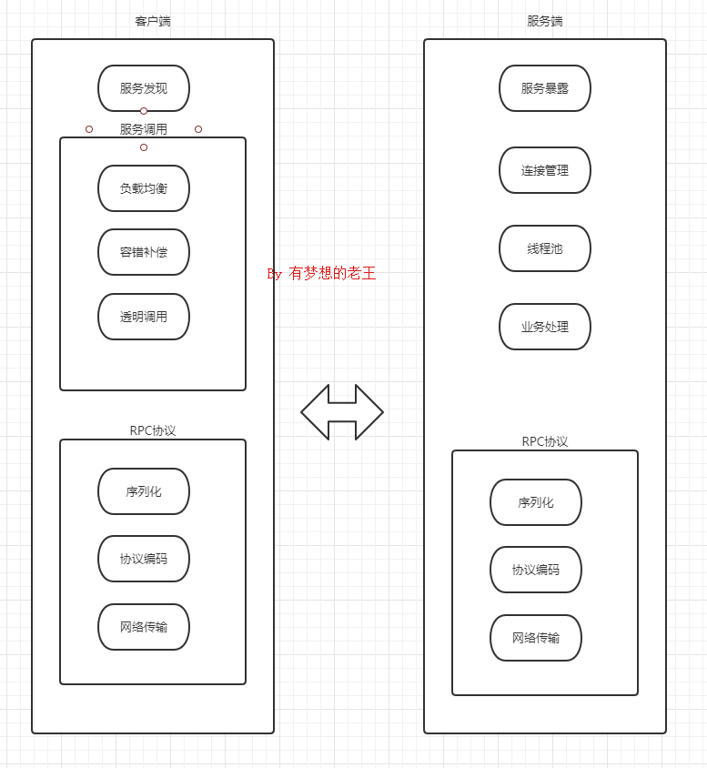
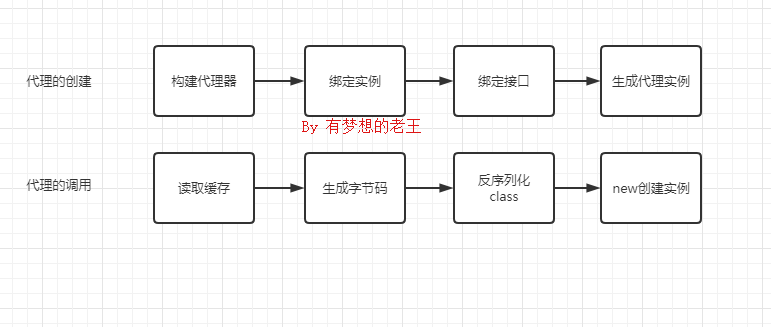

# [ RPC深入原理](https://www.cnblogs.com/whgk/p/14371290.html)

## 1、前言


 什么是RPC？它的原理是什么？它有什么特点？如果让你实现一个RPC框架，你会如何是实现？带着这些问题，开始今天的学习。

## ***2\***|***0\*****RPC概述*

###  2\***|***1\*什么是RPC ？

*RPC*是远程过程调用（Remote Procedure Call）。 RPC 的主要功能目标是让构建分布式计算（应用）更容易，在提供强大的远程调用能力时不损失本地调用的语义简洁性。为实现该目标，RPC 框架需提供一种透明调用机制，让使用者不必显式的区分本地调用和远程调用。

### ***2\***|***2\*****优点**

1、分布式设计

2、部署灵活

3、解构服务

4、扩展性强

### ***2\***|***3\*****有哪些RPC框架

**Dubbo**：国内最早开源的 RPC 框架，由阿里巴巴公司开发并于 2011 年对外开源，仅支持 Java 语言。
**Motan**：微博内部使用的 RPC 框架，于 2016 年对外开源，仅支持 Java 语言。
**Tars**：腾讯内部使用的 RPC 框架，于 2017 年对外开源，仅支持 C++ 语言。
**Spring** **Cloud**：国外 Pivotal 公司 2014 年对外开源的 RPC 框架，提供了丰富的生态组件。
**gRPC**：Google 于 2015 年对外开源的跨语言 RPC 框架，支持多种语言。
**Thrift**：最初是由 Facebook 开发的内部系统跨语言的 RPC 框架，2007 年贡献给了 Apache 基金，成为Apache 开源项目之一，支持多种语言。

### ***2\***|***4\*****特性**

1、RPC框架一般使用长链接，不必每次通信都要3次握手，减少网络开销。
2、RPC框架一般都有注册中心，有丰富的监控管理。发布、下线接口、动态扩展等，对调用方来说是无感知、统一化的操作协议私密，安全性较高
3、RPC 协议更简单内容更小，效率更高，服务化架构、服务化治理，RPC框架是一个强力的支撑。

### ***2\***|***5\*****架构**

[](https://img2020.cnblogs.com/blog/874710/202103/874710-20210326165611063-1130636091.png)

### ***2\***|***6\*****调用流程**

[](https://img2020.cnblogs.com/blog/874710/202103/874710-20210326165617865-1226051491.png)

#### **具体步骤：**

1. 服务消费者（client客户端）通过本地调用的方式调用服务。
2. 客户端存根（client stub）接收到请求后负责将方法、入参等信息序列化（组装）成能够进行网络传输的消息
   体。
3. 客户端存根（client stub）找到远程的服务地址，并且将消息通过网络发送给服务端。
4. 服务端存根（server stub）收到消息后进行解码（反序列化操作）。
5. 服务端存根（server stub）根据解码结果调用本地的服务进行相关处理。
6. 本地服务执行具体业务逻辑并将处理结果返回给服务端存根（server stub）。
7. 服务端存根（server stub）将返回结果重新打包成消息（序列化）并通过网络发送至消费方。
8. 客户端存根（client stub）接收到消息，并进行解码（反序列化）。
9. 服务消费方得到最终结果。

#### **涉及到的技术**

1. 动态代理
   生成Client Stub（客户端存根）和Server Stub（服务端存根）的时候需要用到java动态代理技术。
2. 序列化 在网络中，所有的数据都将会被转化为字节进行传送，需要对这些参数进行序列化和反序列化操作。目前主流高效的开源序列化框架有Kryo、fastjson、Hessian、Protobuf等。
3. NIO通信
   Java 提供了 NIO 的解决方案，Java 7 也提供了更优秀的 NIO.2 支持。可以采用Netty或者mina框架来解决NIO数据传输的问题。开源的RPC框架Dubbo就是采用NIO通信，集成支持netty、mina、grizzly。
4. 服务注册中心
   通过注册中心，让客户端连接调用服务端所发布的服务。主流的注册中心组件：Redis、Zookeeper、Consul、Etcd。Dubbo采用的是ZooKeeper提供服务注册与发现功能。
5. 负载均衡
   在高并发的场景下，需要多个节点或集群来提升整体吞吐能力。
6. 健康检查
   健康检查包括，客户端心跳和服务端主动探测两种方式。

## ***3\***|***0\*****RPC深入解析*

### *3\***|***1\*序列化技术序列化作用**

在网络传输中，数据必须采用二进制形式， 所以在RPC调用过程中， 需要采用序列化技术，对入参对象和返回值对象进行序列化与反序列化。

**如何序列化**

自定义二进制协议来实现序列化:

[](https://img2020.cnblogs.com/blog/874710/202103/874710-20210326165626344-1419049044.png)

**序列化的处理要素**

序列化的处理要素

1. 解析效率：序列化协议应该首要考虑的因素，像xml/json解析起来比较耗时，需要解析doom树，二进制自定义协议解析起来效率要快很多。
2. 压缩率：同样一个对象，xml/json传输起来有大量的标签冗余信息，信息有效性低，二进制自定义协议占用的空间相对来说会小很多。
3. 扩展性与兼容性：是否能够利于信息的扩展，并且增加字段后旧版客户端是否需要强制升级，这都是需要考虑的问题，在自定义二进制协议时候，要做好充分考虑设计。
4. 可读性与可调试性：xml/json的可读性会比二进制协议好很多，并且通过网络抓包是可以直接读取，二进制则需要反序列化才能查看其内容。
5. 跨语言：有些序列化协议是与开发语言紧密相关的，例如dubbo的Hessian序列化协议就只能支持Java的RPC调用。
6. 通用性：xml/json非常通用，都有很好的第三方解析库，各个语言解析起来都十分方便，二进制数据的处理方面也有Protobuf和Hessian等插件，在做设计的时候尽量做到较好的通用性。

**常用序列化技术**

1、JDK原生序列化，通过实现Serializable接口。通过ObjectOutPutSream和ObjectInputStream对象进行序列化及反序列化.

2、JSON序列化。一般在HTTP协议的RPC框架通信中，会选择JSON方式。JSON具有较好的扩展性、可读性和通用性。但JSON序列化占用空间开销较大,没有JAVA的强类型区分，需要通过反射解决，解析效率和压缩率都较差。如果对并发和性能要求较高，或者是传输数据量较大的场景，不建议采用JSON序列化方式。

3、Hessian2序列化。Hessian 是一个动态类型，二进制序列化，并且支持跨语言特性的序列化框架。Hessian 性能上要比 JDK、JSON 序列化高效很多，并且生成的字节数也更小。有非常好的兼容性和稳定性，所以 Hessian 更加适合作为 RPC 框架远程通信的序列化协议。


```
...
User user = new User();
user.setName("laowang");
 
//user对象序列化处理
ByteArrayOutputStream bos = new ByteArrayOutputStream();
Hessian2Output output = new Hessian2Output(bos);
output.writeObject(user);
output.flushBuffer();
byte[] data = bos.toByteArray();
bos.close();
 
//user对象反序列化处理
ByteArrayInputStream bis = new ByteArrayInputStream(data);
Hessian2Input input = new Hessian2Input(bis);
User user = (User) input.readObject();
input.close();
 
System.out.println(user);
...
```

**Hessian自身也存在一些缺陷，大家在使用过程中要注意：**
1、对Linked系列对象不支持，比如LinkedHashMap、LinkedHashSet 等，但可以通过CollectionSerializer类修复。
2、Locale 类不支持，可以通过扩展 ContextSerializerFactory 类修复。

3、Byte/Short 在反序列化的时候会转成 Integer。

***3\***|***2\*****动态代理**

RPC的调用内部核心技术采用的就是动态代理。

**JDK动态代理如何实现？**


```
public class JdkProxyTest {
 
    /**
     * 定义用户的接口
     */
    public interface User {
        String job();
    }
 
 
    /**
     * 实际的调用对象
     */
    public static class Teacher {
 
        public String invoke(){
            return "i'm Teacher";
        }
    }
 
 
    /**
     * 创建JDK动态代理类
     */
    public static class JDKProxy implements InvocationHandler {
        private Object target;
 
        JDKProxy(Object target) {
            this.target = target;
        }
 
        @Override
        public Object invoke(Object proxy, Method method, Object[] paramValues) {
            return ((Teacher)target).invoke();
        }
    }
 
 
        public static void main(String[] args){
            // 构建代理器
            JDKProxy proxy = new JDKProxy(new Teacher());
            ClassLoader classLoader = ClassLoaderUtils.getClassLoader();
 
            // 生成代理类
            User user = (User) Proxy.newProxyInstance(classLoader, new Class[]{User.class}, 
proxy);
 
            // 接口调用
            System.out.println(user.job());
        }
}
```

**JDK动态代理实现原理:**

[](https://img2020.cnblogs.com/blog/874710/202103/874710-20210326165634228-1746208531.png)

代理类 $Proxy里面会定义相同签名的接口，然后内部会定义一个变量绑定JDKProxy代理对象，当调用User.job接口方法，实质上调用的是JDKProxy.invoke()方法。

**Cglib*****3\***|***3\*****服务注册发现****注册与发现流程**

服务注册：服务提供方将对外暴露的接口发布到注册中心内，注册中心为了检测服务的有效状态，一般会建立双向心跳机制。
服务订阅：服务调用方去注册中心查找并订阅服务提供方的 IP，并缓存到本地用于后续调用。

**如何实现:基于ZK**

A. 在 ZooKeeper 中创建一个服务根路径，可以根据接口名命名（例
如：/micro/service/com.laowang.orderService），在这个路径再创建服务提供方与调用方目录（server、
client），分别用来存储服务提供方和调用方的节点信息。
B. 服务端发起注册时，会在服务提供方目录中创建一个临时节点，节点中存储注册信息。
C. 客户端发起订阅时，会在服务调用方目录中创建一个临时节点，节点中存储调用方的信息，同时watch 服务提供方的目录（/micro/service/com.laowang.orderService/server）中所有的服务节点数据。当服务端产生变化时ZK就会通知给订阅的客户端。
ZooKeeper方案的特点：
强一致性，ZooKeeper 集群的每个节点的数据每次发生更新操作，都会通知其它 ZooKeeper 节点同时执行更新。

***3\***|***4\*****健康监测**

为什么需要做健康监测?

比如网络中的波动，硬件设施的老化等等。可能造成集群当中的某个节点存在问题，无法正常调用。

健康监测实现分析

心跳检测的过程总共包含以下状态:健康状态、波动状态、失败状态。

完善的解决方案

（1）阈值： 健康监测增加失败阈值记录。
（2）成功率： 可以再追加调用成功率的记录（成功次数/总次数）。
（3）探针： 对服务节点有一个主动的存活检测机制。

***3\***|***5\*****网络IO模型*****3\***|***6\*****零拷贝****什么是零拷贝**

系统内核处理 IO 操作分为两个阶段：等待数据和拷贝数据。

等待数据，就是系统内核在等待网卡接收到数据后，把数据写到内核中。

拷贝数据，就是系统内核在获取到数据后，将数据拷贝到用户进程的空间中

所谓的零拷贝，就是取消用户空间与内核空间之间的数据拷贝操作，应用进程每一次的读写操作，都可以通过一种方式，让应用进程向用户空间写入或者读取数据，就如同直接向内核空间写入或者读取数据一样，再通过 DMA 将内核中的数据拷贝到网卡，或将网卡中的数据 copy 到内核。

**RPC框架的零拷贝应用**

**Netty 框架是否也有零拷贝机制？**
Netty 的零拷贝则有些不一样，他完全站在了用户空间上，也就是基于 JVM 之上。

**Netty当中的零拷贝是如何实现的？**
RPC 并不会把请求参数作为一个整体数据包发送到对端机器上，中间可能会拆分，也可能会合并其他请求，所以消息都需要有边界。接收到消息之后，需要对数据包进行处理，根据边界对数据包进行分割和合并，最终获得完整的消息。

**Netty零拷贝主要体现在三个方面：**

1、Netty的接收和发送ByteBuffer是采用DIRECT BUFFERS，使用堆外的直接内存（内存对象分配在JVM中堆以外的内存）进行Socket读写，不需要进行字节缓冲区的二次拷贝。如果采用传统堆内存（HEAP BUFFERS）进行Socket读写，JVM会将堆内存Buffer拷贝一份到直接内存中，然后写入Socket中。
2、Netty提供了组合Buffer对象，也就是CompositeByteBuf 类，可以将 ByteBuf 分解为多个共享同一个存储区域的 ByteBuf，避免了内存的拷贝。

3、Netty的文件传输采用了FileRegion 中包装 NIO 的 FileChannel.transferT o() 方法，它可以直接将文件缓冲区的数据发送到目标Channel，避免了传统通过循环write方式导致的内存拷贝问题。

零拷贝带来的作用就是避免没必要的 CPU 拷贝，减少了 CPU 在用户空间与内核空间之间的上下文切换，从而提升了网络通信效率与应用程序的整体性能。

***3\***|***7\*****时间轮****为什么需要时间轮？**

在Dubbo中，为增强系统的容错能力，会有相应的监听判断处理机制。比如RPC调用的超时机制的实现，消费者判断RPC调用是否超时，如果超时会将超时结果返回给应用层。在Dubbo最开始的实现中，是将所有的返回结果（DefaultFuture）都放入一个集合中，并且通过一个定时任务，每隔一定时间间隔就扫描所有的future，逐个判断是否超时。

这样的实现方式虽然比较简单，但是存在一个问题就是会有很多无意义的遍历操作开销。比如一个RPC调用的超时时间是10秒，而设置的超时判定的定时任务是2秒执行一次，那么可能会有4次左右无意义的循环检测判断操作。

为了解决上述场景中的类似问题，Dubbo借鉴Netty，引入了时间轮算法，减少无意义的轮询判断操作。

**时间轮原理**

对于以上问题， 目的是要减少额外的扫描操作就可以了。比如说一个定时任务是在5 秒之后执行，那么在 4.9秒之后才扫描这个定时任务，这样就可以极大减少 CPU开销。这时我们就可以利用时钟轮的机制了。

时钟轮的实质上是参考了生活中的时钟跳动的原理，那么具体是如何实现呢？
在时钟轮机制中，有时间槽和时钟轮的概念，时间槽就相当于时钟的刻度；而时钟轮就相当于指针跳动的一个周期，我们可以将每个任务放到对应的时间槽位上。

如果时钟轮有 10 个槽位，而时钟轮一轮的周期是 10 秒，那么我们每个槽位的单位时间就是 1 秒，而下一层时间轮的周期就是 100 秒，每个槽位的单位时间也就是 10 秒，这就好比秒针与分针， 在秒针周期下， 刻度单位为
秒， 在分针周期下， 刻度为分。

假设现在我们有 3 个任务，分别是任务 A（0.9秒之后执行）、任务 B（2.1秒后执行）与任务 C（12.1秒之后执
行），我们将这 3 个任务添加到时钟轮中，任务 A 被放到第 0 槽位，任务 B 被放到第 2槽位，任务 C 被放到下一
层时间轮的第2个槽位。

通过这个场景我们可以了解到，时钟轮的扫描周期仍是最小单位1秒，但是放置其中的任务并没有反复扫描，每个
任务会按要求只扫描执行一次， 这样就能够很好的解决CPU 浪费的问题。

**Dubbo中的时间轮原理是如何实现的?**

主要是通过Timer，Timeout，TimerT ask几个接口定义了一个定时器的模型，再通过HashedWheelTimer这个类
实现了一个时间轮定时器（默认的时间槽的数量是512，可以自定义这个值）。它对外提供了简单易用的接口，只
需要调用newTimeout接口，就可以实现对只需执行一次任务的调度。通过该定时器，Dubbo在响应的场景中实现
了高效的任务调度。

**时间轮在RPC的应用**

调用超时： 上面所讲的客户端调用超时的处理，就可以应用到时钟轮，我们每发一次请求，都创建一个处理请求超时的定时任务放到时钟轮里，在高并发、高访问量的情况下，时钟轮每次只轮询一个时间槽位中的任务，这样会节省大量的 CPU。

启动加载： 调用端与服务端启动也可以应用到时钟轮，比如说在服务启动完成之后要去加载缓存，执行定时任务等， 都可以放在时钟轮里

定时心跳检测： RPC 框架调用端定时向服务端发送的心跳检测，来维护连接状态，我们可以将心跳的逻辑封装为一个心跳任务，放到时钟轮里。心跳是要定时重复执行的，而时钟轮中的任务执行一遍就被移除了，对于这种需要重复执行的定时任务我们该如何处理呢？我们在定时任务逻辑结束的最后，再加上一段逻辑， 重设这个任务的执行时间，把它重新丢回到时钟轮里。这样就可以实现循环执行。

***4\***|***0\*****PRC高级应用*****4\***|***1\*****异步处理机制****为什么要采用异步?**

如果采用同步调用， CPU 大部分的时间都在等待而没有去计算，从而导致 CPU 的利用率不够。RPC 请求比较耗时的原因主要是在哪里？在大多数情况下，RPC 本身处理请求的效率是在毫秒级的。RPC 请求的耗时大部分都是业务耗时。

**调用端如何实现异步**

常用的方式就是Future 方式，它是返回 Future 对象，通过GET方式获取结果；或者采用入参为 Callback 对象的回调方式，处理结果。

基于RPC的DUBBO框架是如何实现异步调用呢？

[](https://img2020.cnblogs.com/blog/874710/202103/874710-20210326165642689-1561468661.png)

**服务端如何实现异步?**

为了提升性能，连接请求与业务处理不会放在一个线程处理， 这个就是服务端的异步化。服务端业务处理逻辑加入异步处理机制。在RPC 框架提供一种回调方式，让业务逻辑可以异步处理，处理完之后调用 RPC 框架的回调接口

RPC 框架的异步策略主要是调用端异步与服务端异步。调用端的异步就是通过 Future 方式。
服务端异步则需要一种回调方式，让业务逻辑可以异步处理。这样就实现了RPC调用的全异步化

***4\***|***2\*****路由和负载均衡****为什么要用路由**

真实的环境中一般是以集群的方式提供服务，对于服务调用方来说，一个接口会有多个服务提供方同时提供服务，所以 RPC 在每次发起请求的时候，都需要从多个服务节点里面选取一个用于处理请求的服务节点。这就需要在RPC应用中增加路由功能。

**如何实现路由**

服务注册发现方式：
通过服务发现的方式从逻辑上看是可行，但注册中心是用来保证数据的一致性。通过服务发现方式来实现请求隔离并不理想。

RPC路由策略：
从服务提供方节点集合里面选择一个合适的节点（负载均衡），把符合我们要求的节点筛选出来。这个就是路由策略：接收请求-->请求校验-->路由策略-->负载均衡-->

有些场景下，可能还需要更细粒度的路由方式，比如说根据SESSIONID要落到相同的服务节点上以保持会话的有效性;

**RPC框架中的负载均衡**

RPC 的负载均衡是由 RPC 框架自身提供实现，自主选择一个最佳的服务节点，发起 RPC 调用请求。

RPC 负载均衡策略一般包括轮询、随机、权重、最少连接等。Dubbo默认就是使用随机负载均衡策略。

自适应的负载均衡策略
RPC 的负载均衡完全由 RPC 框架自身实现，通过所配置的负载均衡组件，自主选择合适服务节点。这个就是自适应的负载均衡策略。
具体如何实现？
这就需要判定服务节点的处理能力。

主要步骤：
（1）添加计分器和指标采集器。
（2）指标采集器收集服务节点 CPU 核数、CPU 负载以及内存占用率等指标。
（3）可以配置开启哪些指标采集器，并设置这些参考指标的具体权重。
（4）通过对服务节点的综合打分，最终计算出服务节点的实际权重，选择合适的服务节点。

***4\***|***3\*****熔断限流**

在实际生产环境中，每个服务节点都可能由于访问量过大而引起一系列问题，就需要业务提供方能够进行自我保护，从而保证在高访问量、高并发的场景下，系统依然能够稳定，高效运行。

在Dubbo框架中， 可以通过Sentinel来实现更为完善的熔断限流功能，服务端是具体如何实现限流逻辑的？

方法有很多种， 最简单的是计数器，还有平滑限流的滑动窗口、漏斗算法以及令牌桶算法等等。Sentinel采用是滑动窗口来实现的限流。

调用方的自我保护

一个服务 A 调用服务 B 时，服务 B 的业务逻辑又调用了服务 C，这时服务 C 响应超时，服务 B 就可能会因为堆积大量请求而导致服务宕机，由此产生服务雪崩的问题。

熔断机制：
熔断器的工作机制主要是关闭、打开和半打开这三个状态之间的切换。
Sentinel 熔断降级组件它可以支持以下降级策略：

平均响应时间 ( DEGRADE_GRADE_RT )：当 1s 内持续进入 N 个请求，对应时刻的平均响应时间（秒级）均超过阈值（ count ，以 ms 为单位），那么在接下的时间窗口（ DegradeRule 中的 timeWindow ，以 s为单位）之内，对这个方法的调用都会自动地熔断（抛出 DegradeException ）。注意 Sentinel 默认统计的 RT 上限是 4900 ms，超出此阈值的都会算作 4900 ms，若需要变更此上限可以通过启动配置项Dcsp.sentinel.statistic.max.rt=xxx 来配置。

异常比例 ( DEGRADE_GRADE_EXCEPTION_RATIO )：当资源的每秒请求量 >= N（可配置），并且每秒异常总数占通过量的比值超过阈值（ DegradeRule 中的 count ）之后，资源进入降级状态，即在接下的时间窗口（ DegradeRule 中的 timeWindow ，以 s 为单位）之内，对这个方法的调用都会自动地返回。异常比率的阈值范围是 [0.0, 1.0] ，代表 0% - 100%。

异常数 ( DEGRADE_GRADE_EXCEPTION_COUNT )：当资源近 1 分钟的异常数目超过阈值之后会进行熔断。注意由于统计时间窗口是分钟级别的，若 timeWindow 小于 60s，则结束熔断状态后仍可能再进入熔断状态。

***4\***|***4\*****优雅启动****什么是启动预热**

启动预热就是让刚启动的服务，不直接承担全部的流量，而是让它随着时间的移动慢慢增加调用次数，最终让流量缓和运行一段时间后达到正常水平。

**如何实现**

首先要知道服务提供方的启动时间，有两种获取方法：
一种是服务提供方在启动的时候，主动将启动的时间发送给注册中心；
另一种就是注册中心来检测， 将服务提供方的请求注册时间作为启动时间。

调用方通过服务发现获取服务提供方的启动时间， 然后进行降权，减少被负载均衡选择的概率，从而实现预热过程。

在Dubbo框架中也引入了"warmup"特性，核心源码是
在" com.alibaba.dubbo.rpc.cluster.loadbalance.AbstractLoadBalance.java"中：


```
protected int getWeight(Invoker<?> invoker, Invocation invocation) {
      // 先得到Provider的权重
      int weight = invoker.getUrl().getMethodParameter(invocation.getMethodName(), 
Constants.WEIGHT_KEY, Constants.DEFAULT_WEIGHT);
      if (weight > 0) {
          // 得到provider的启动时间戳
          long timestamp = invoker.getUrl().getParameter(Constants.REMOTE_TIMESTAMP_KEY, 0L);
          if (timestamp > 0L) {
              // provider已经运行时间
              int uptime = (int) (System.currentTimeMillis() ‐ timestamp);
              // 得到warmup的值，默认为10分钟
              int warmup = invoker.getUrl().getParameter(Constants.WARMUP_KEY, 
Constants.DEFAULT_WARMUP);
              // provider运行时间少于预热时间，那么需要重新计算权重weight（即需要降权）
              if (uptime > 0 && uptime < warmup) {
                  weight = calculateWarmupWeight(uptime, warmup, weight);
              }
          }
      }
      return weight;
  }
  
  static int calculateWarmupWeight(int uptime, int warmup, int weight) {
      // 随着provider的启动时间越来越长，慢慢提升权重weight
      int ww = (int) ( (float) uptime / ( (float) warmup / (float) weight ) );
      return ww < 1 ? 1 : (ww > weight ? weight : ww);
  }
```

**优雅关闭****为什么需要优雅关闭**

调用方会存在以下情况：目标服务已经下线;目标服务正在关闭中。

**如何实现优雅关闭**

当服务提供方正在关闭，可以直接返回一个特定的异常给调用方。然后调用方把这个节点从健康列表挪出，并把其
他请求自动重试到其他节点。如需更为完善， 可以再加上主动通知机制。

在Dubbo框架中， 在以下场景中会触发优雅关闭：
JVM主动关闭( System.exit(int) ； JVM由于资源问题退出( OOM )； 应用程序接受到进程正常结束信号：SIGTERM 或 SIGINT 信号。
优雅停机是默认开启的，停机等待时间为10秒。可以通过配置 dubbo.service.shutdown.wait 来修改等待时间。Dubbo 推出了多段关闭的方式来保证服务完全无损。

## ***5\***|***0\*****如何实现一个RPC框架**

思路:

1. 服务设计：客户端、服务端、ZK注册中心，获取订单接口。
   怎么知道服务端的信息？ 如何去调用的？
2. 先启动服务端： 将接口信息注册至ZK。（ServicePushManager.registerIntoZK方法）
3. 启动客户端： 从ZK拉取服务端接口信息。（ServicePullManager.pullServiceFromZK方法）
4. Rpc调用处理流程：
   客户端->通过动态代理调用服务端接口（ProxyHelper.doIntercept）-> 选取不同的调用策略
   -> 异步方式调用（通过MAP存储记录channel，rpcRequestPool.fetchResponse获取结果）
   -> 服务端（根据请求信息调用对应的接口， RpcRequestHandler.channelRead0）
   -> 客户端监听接收结果(RpcResponseHandler.channelRead0)
   -> 关闭连接（RpcRequestManager.destroyChannelHolder关闭连接）
