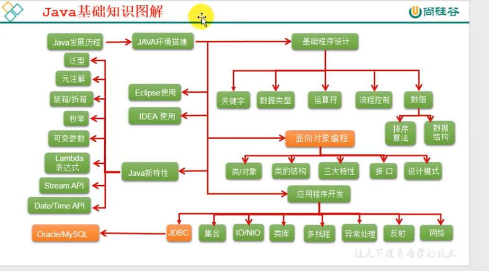
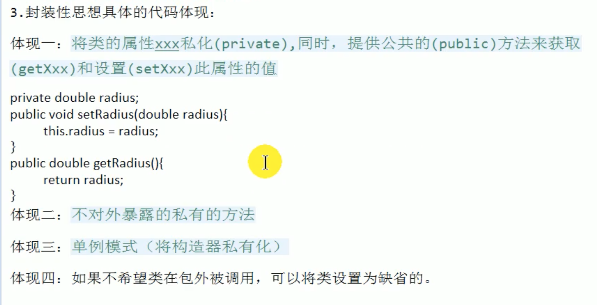
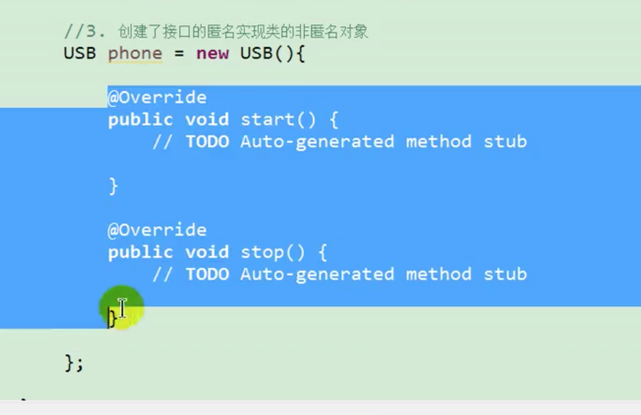

## 尚硅谷视频笔记：

### Java基础：

* Java语言概述
* 基本语法
* 数组
* 面向对象编程
* 异常处理

### Java高级：

* 枚举、注解
* Java集合
* 泛型
* IO流
* 多线程
* Java常用类
* Java反射机制
* 网络编程
* Java8中lambda表达式与Stream API 的使用
* Java9&Java10的新特性

### Java拓展：

* 数据结构

* 常用算法

* 常用设计模式

* JVM

  

建立学习笔记

DOS下

创建文件夹（md）

新建文件 echo 文件名 

del 删除文件

rd  删除文件夹（空文件夹）

del 文件夹（删除的是文件夹里的文件） 

### 计算机语言

第一代语言：机器语言（0101010）

第二代语言：汇编语言

第三代语言：高级语言

### Java语言概述：

Sun公司，面向对象

后台开发：Java、PHP、Python、Go、Node.js

**Java8 主要体现在lambda表达式+Stream流**

#### Java与C语言

**Java舍弃了C语言中容易引起错误的指针，增加了垃圾回收器功能。**

Java语言的特点：

* 面向对象
  * 类、对象 。
  * 三大特性：封装继承多态
* 健壮性
* 跨平台性
  * 提供不同操作系统对应的jvm

递归：

代码块执行的先后顺序:父类的静态代码块——>子类的静态代码块-->父类的非静态代码块-->父类的构造器-->子类的非静态代码块-->子类的构造器（由父及子静态先行）

* 23种设计模式（GOF）
* Final关键字

*   
* 

* 
* 接口或抽象类可以定义（匿名实现类的非匿名对象）

Java7及以前，接口中只能定义抽象方法及常量。

Java8及以后，接口中能定义静态方法、默认方法。（1、接口中定义的静态方法只能通过接口调用。2、通过实现类的对象可以调用默认方法）

